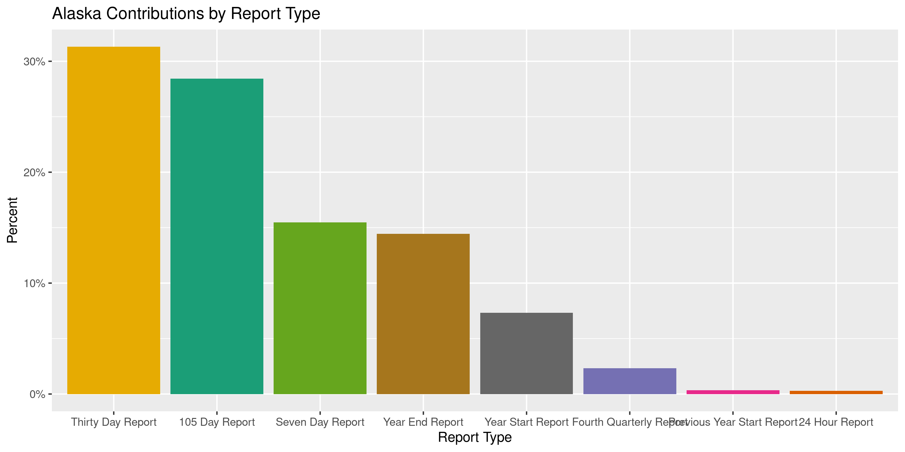
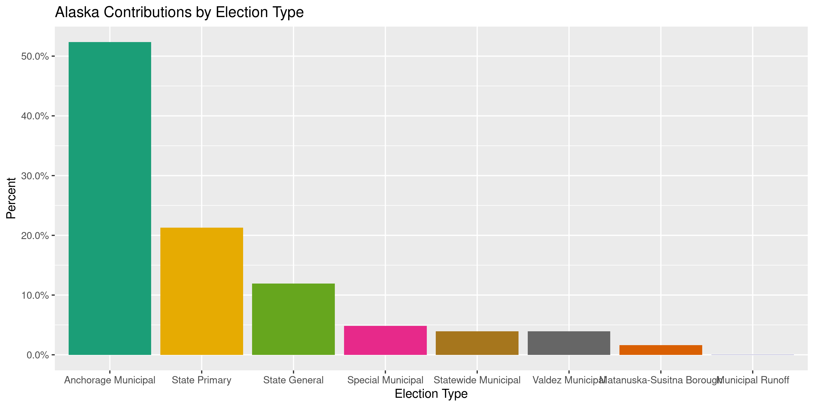
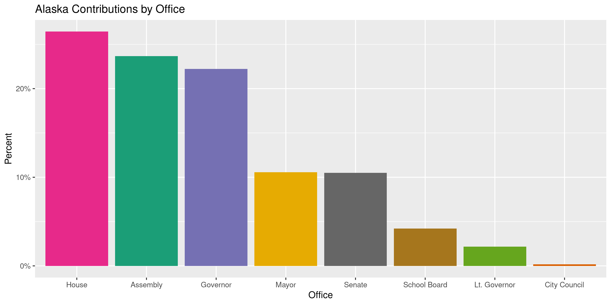
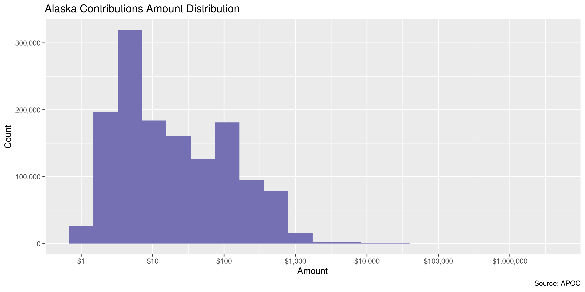

Alaska Contributions
================
Kiernan Nicholls
2020-03-02 15:25:41

  - [Project](#project)
  - [Objectives](#objectives)
  - [Packages](#packages)
  - [Data](#data)
  - [Import](#import)
  - [Explore](#explore)
  - [Wrangle](#wrangle)
  - [Conclude](#conclude)
  - [Export](#export)

<!-- Place comments regarding knitting here -->

## Project

The Accountability Project is an effort to cut across data silos and
give journalists, policy professionals, activists, and the public at
large a simple way to search across huge volumes of public data about
people and organizations.

Our goal is to standardizing public data on a few key fields by thinking
of each dataset row as a transaction. For each transaction there should
be (at least) 3 variables:

1.  All **parties** to a transaction.
2.  The **date** of the transaction.
3.  The **amount** of money involved.

## Objectives

This document describes the process used to complete the following
objectives:

1.  How many records are in the database?
2.  Check for entirely duplicated records.
3.  Check ranges of continuous variables.
4.  Is there anything blank or missing?
5.  Check for consistency issues.
6.  Create a five-digit ZIP Code called `zip`.
7.  Create a `year` field from the transaction date.
8.  Make sure there is data on both parties to a transaction.

## Packages

The following packages are needed to collect, manipulate, visualize,
analyze, and communicate these results. The `pacman` package will
facilitate their installation and attachment.

The IRW’s `campfin` package will also have to be installed from GitHub.
This package contains functions custom made to help facilitate the
processing of campaign finance data.

``` r
if (!require("pacman")) install.packages("pacman")
pacman::p_load_gh("irworkshop/campfin")
pacman::p_load(
  tidyverse, # data manipulation
  lubridate, # datetime strings
  magrittr, # pipe operators
  janitor, # dataframe clean
  refinr, # cluster and merge
  scales, # format strings
  knitr, # knit documents
  vroom, # read files fast
  glue, # combine strings
  httr, # http requests
  here, # relative storage
  fs # search storage 
)
```

This document should be run as part of the `R_campfin` project, which
lives as a sub-directory of the more general, language-agnostic
[`irworkshop/accountability_datacleaning`](https://github.com/irworkshop/accountability_datacleaning)
GitHub repository.

The `R_campfin` project uses the [RStudio
projects](https://support.rstudio.com/hc/en-us/articles/200526207-Using-Projects)
feature and should be run as such. The project also uses the dynamic
`here::here()` tool for file paths relative to *your* machine.

``` r
# where does this document knit?
here::here()
#> [1] "/home/kiernan/Code/accountability_datacleaning/R_campfin"
```

## Data

Data is obtained from the [Alaska Public Offices Commission
(APOC)](https://aws.state.ak.us/ApocReports/Campaign/#).

## Import

### Download

From the [APOC income
search](https://aws.state.ak.us/ApocReports/CampaignDisclosure/CDIncome.aspx),
we can search “Any” report year without any additional parameters to
return all income reports. From that search page we can “Export” *all*
results as a tab-delimited text file. We can do that by hand since the
`httr::GET()` request below does not have all the cookies needed.

``` r
raw_dir <- dir_create(here("ak", "contribs", "data", "raw"))
```

``` r
httr::GET(
  url = str_c(
    "https://aws.state.ak.us",
    "ApocReports",
    "CampaignDisclosure",
    "CDIncome.aspx",
    sep = "/"
  ),
  query = list(
    exportAll = "True",
    exportFormat = "TXT",
    isExport = "True"
  ),
  write_disk(
    path = path(raw_dir, "CD_Transactions_03-02-2020.TXT")
  )
)
```

### Read

This tab-delimited text file can be read with `readr::read_tsv()`.

``` r
raw_file <- dir_ls(raw_dir)
ak_names <- raw_file %>% 
  read_lines(n_max = 1) %>% 
  str_split("\t") %>% 
  pluck(1) %>% 
  make_clean_names()

akc <- raw_file %>%
  # skip col name line
  read_lines(skip = 1) %>%
  # startrs with id num
  str_subset("^\\d") %>% 
  # remove trailing delim
  str_remove("\t$") %>% 
  # read with names as tsv
  read_delim(
    delim = "\t",
    na = c("", "NA", "N/A"),
    escape_backslash = FALSE,
    escape_double = TRUE,
    col_names = ak_names,
    col_types = cols(
      .default = col_character(),
      date = col_date_usa(),
      amount = col_number(),
      report_year = col_integer(),
      submitted = col_date_usa()
    )
  )
```

## Explore

``` r
head(akc)
#> # A tibble: 6 x 25
#>   id    date       tran_type pay_type pay_detail amount last  first address city  state zip  
#>   <chr> <date>     <chr>     <chr>    <chr>       <dbl> <chr> <chr> <chr>   <chr> <chr> <chr>
#> 1 1     2019-12-13 Income    Check    9365          500 McGr… Thom… 100 W.… Anch… Alas… 99501
#> 2 2     2019-12-20 Income    Check    5842          500 Penn… Robe… 913 Ke… Sold… Alas… 99669
#> 3 3     2019-12-20 Income    Check    2575          500 Penn… PJ    913 Ke… Sold… Alas… 99669
#> 4 4     2019-12-20 Income    Check    3947          500 Penn… Henry 2091 S… Anch… Alas… 99508
#> 5 5     2019-12-10 Income    Cash     <NA>          100 Fras… Cher… 2415 L… Anch… Alas… 99517
#> 6 6     2019-10-07 Income    Credit … <NA>          100 Ozer  Kerry PO Box… Anch… Alas… 99509
#> # … with 13 more variables: country <chr>, occupation <chr>, employer <chr>, expend_purpose <chr>,
#> #   report_type <chr>, election_name <chr>, election_type <chr>, municipality <chr>, office <chr>,
#> #   filer_type <chr>, filer <chr>, report_year <int>, submitted <date>
tail(akc)
#> # A tibble: 6 x 25
#>   id    date       tran_type pay_type pay_detail amount last  first address city  state zip  
#>   <chr> <date>     <chr>     <chr>    <chr>       <dbl> <chr> <chr> <chr>   <chr> <chr> <chr>
#> 1 4349… 2016-09-13 Income    Check    10997       18.4  "GUR… T     "2740 … "FAI… Alas… 99709
#> 2 4349… 2016-09-13 Income    Check    10997       14    "GUT… L     "1974 … "JUN… Alas… 99801
#> 3 4349… 2016-09-13 Income    Check    10997        3.78 "HAL… J     "409 N… "FAI… Alas… 99701
#> 4 4349… 2016-09-13 Income    Check    10997       17.0  "HAM… S     "505 K… "FAI… Alas… 99701
#> 5 4349… 2016-09-13 Income    Check    10997       17.0  "HAR… J     "695 E… "FAI… Alas… 99712
#> 6 4350… 2016-09-13 Income    Check    10997       15.7  "HAR… D     "974 M… "NOR… Alas… 99705
#> # … with 13 more variables: country <chr>, occupation <chr>, employer <chr>, expend_purpose <chr>,
#> #   report_type <chr>, election_name <chr>, election_type <chr>, municipality <chr>, office <chr>,
#> #   filer_type <chr>, filer <chr>, report_year <int>, submitted <date>
glimpse(sample_n(akc, 20))
#> Rows: 20
#> Columns: 25
#> $ id             <chr> "110435", "18635", "177009", "52945", "334911", "432430", "167710", "7876…
#> $ date           <date> 2018-02-28, 2019-03-07, 2018-06-15, 2019-09-17, 2017-07-17, 2016-08-31, …
#> $ tran_type      <chr> "Income", "Income", "Income", "Income", "Income", "Income", "Income", "In…
#> $ pay_type       <chr> "Payroll Deduction", "Payroll Deduction", "Credit Card", "Payroll Deducti…
#> $ pay_detail     <chr> "Payroll deduction", NA, NA, NA, NA, "Payroll Deduction", NA, "Payroll De…
#> $ amount         <dbl> 19.00, 11.90, 100.00, 9.40, 18.31, 2.00, 50.00, 2.00, 0.84, 25.00, 100.00…
#> $ last           <chr> "Ingram", "GEARY", "Hackley", "Sheen", "POLLARD     ", "JONES", "Avellane…
#> $ first          <chr> "Joshua Nathan", "RYAN", "Patricia", "Courtney", "TIMOTHY        ", "BRON…
#> $ address        <chr> "11824 Inspiration Drive", "6400 EAST 9TH AVENUE", "4550 E. 135th Ave.", …
#> $ city           <chr> "Eagle River", "ANCHORAGE", "Anchorage", "Fairbanks", "WASILLA           …
#> $ state          <chr> "Alabama", "Alaska", "Alaska", "Alaska", "Alaska", "Alaska", "Alaska", "A…
#> $ zip            <chr> "99577", "99504", "9516", "99701", "99687", "99504", "99506", "99802", "9…
#> $ country        <chr> "USA", "USA", "USA", "USA", "USA", "USA", "USA", "USA", "USA", "USA", "US…
#> $ occupation     <chr> "Municipality of Anchorage", "Fitter", "Retired", "Operator", "Laborer", …
#> $ employer       <chr> "Fire Fighter", "Mechanical Builders Inc.", NA, "Fairbanks City", "QAP   …
#> $ expend_purpose <chr> NA, NA, NA, NA, NA, NA, "Donation", NA, NA, NA, NA, NA, NA, NA, NA, NA, N…
#> $ report_type    <chr> "Thirty Day Report", "Seven Day Report", "Thirty Day Report", "Seven Day …
#> $ election_name  <chr> "2018 - Anchorage Municipal Election", "2019 - Anchorage Municipal Electi…
#> $ election_type  <chr> "Anchorage Municipal", "Anchorage Municipal", "State Primary", NA, NA, NA…
#> $ municipality   <chr> "Anchorage, City and Borough", "Anchorage, City and Borough", NA, NA, NA,…
#> $ office         <chr> NA, NA, NA, NA, NA, NA, "House", NA, NA, NA, NA, NA, "Governor", NA, NA, …
#> $ filer_type     <chr> "Group", "Group", "Candidate", "Group", "Group", "Group", "Candidate", "G…
#> $ filer          <chr> "IAFF Local 1264 PAC", "Local367PAC", "JASON GRENN", "IUOE Local 302 PAC …
#> $ report_year    <int> 2018, 2019, 2018, 2019, 2017, 2016, 2018, 2019, 2017, 2017, 2018, 2017, 2…
#> $ submitted      <date> 2018-03-01, 2019-03-26, 2018-09-04, 2019-09-23, 2018-02-14, 2016-09-06, …
```

### Missing

``` r
col_stats(akc, count_na)
#> # A tibble: 25 x 4
#>    col            class       n          p
#>    <chr>          <chr>   <int>      <dbl>
#>  1 id             <chr>       0 0         
#>  2 date           <date>      8 0.0000187 
#>  3 tran_type      <chr>       1 0.00000234
#>  4 pay_type       <chr>       2 0.00000467
#>  5 pay_detail     <chr>  195872 0.458     
#>  6 amount         <dbl>      20 0.0000467 
#>  7 last           <chr>      24 0.0000561 
#>  8 first          <chr>    7702 0.0180    
#>  9 address        <chr>    1823 0.00426   
#> 10 city           <chr>    1812 0.00423   
#> 11 state          <chr>      36 0.0000841 
#> 12 zip            <chr>    1825 0.00426   
#> 13 country        <chr>      25 0.0000584 
#> 14 occupation     <chr>  124415 0.291     
#> 15 employer       <chr>   50476 0.118     
#> 16 expend_purpose <chr>  365497 0.854     
#> 17 report_type    <chr>     149 0.000348  
#> 18 election_name  <chr>      64 0.000150  
#> 19 election_type  <chr>  162155 0.379     
#> 20 municipality   <chr>  261180 0.610     
#> 21 office         <chr>  359854 0.841     
#> 22 filer_type     <chr>      73 0.000171  
#> 23 filer          <chr>      67 0.000157  
#> 24 report_year    <int>     448 0.00105   
#> 25 submitted      <date>    448 0.00105
```

``` r
akc <- akc %>% flag_na(date, last, amount, filer)
sum(akc$na_flag)
#> [1] 82
```

### Duplicates

Quite a few records are entirely duplicated. We will not remove these
records, as they may very well be valid repetitions, but we can flag
them with `campfin::flag_dupes()`.

``` r
akc <- flag_dupes(akc, -id, .check = TRUE)
percent(mean(akc$dupe_flag), 0.1)
#> [1] "8.2%"
```

``` r
akc %>% 
  filter(dupe_flag) %>% 
  select(date, last, amount, filer)
#> # A tibble: 35,176 x 4
#>    date       last         amount filer                  
#>    <date>     <chr>         <dbl> <chr>                  
#>  1 2020-01-30 "Hacker"         25 Forrest Dunbar         
#>  2 2020-01-30 "Hacker"         25 Forrest Dunbar         
#>  3 2019-12-21 "Ristenpart"   1000 Austin A Quinn-Davidson
#>  4 2019-12-21 "Ristenpart"   1000 Austin A Quinn-Davidson
#>  5 2019-12-23 "Noble"          50 Sharon Jackson         
#>  6 2019-12-23 "Noble"          50 Sharon Jackson         
#>  7 2019-08-12 "Hallden"        25 Janice L Park          
#>  8 2019-08-12 "Hallden"        25 Janice L Park          
#>  9 2019-11-06 "Spohnholz "     50 Janice L Park          
#> 10 2019-11-06 "Spohnholz "     50 Janice L Park          
#> # … with 35,166 more rows
```

### Categorical

``` r
col_stats(akc, n_distinct)
#> # A tibble: 27 x 4
#>    col            class       n          p
#>    <chr>          <chr>   <int>      <dbl>
#>  1 id             <chr>  427926 1.00      
#>  2 date           <date>   1667 0.00390   
#>  3 tran_type      <chr>       8 0.0000187 
#>  4 pay_type       <chr>      14 0.0000327 
#>  5 pay_detail     <chr>   19260 0.0450    
#>  6 amount         <dbl>    5915 0.0138    
#>  7 last           <chr>   30931 0.0723    
#>  8 first          <chr>   16124 0.0377    
#>  9 address        <chr>   66473 0.155     
#> 10 city           <chr>    4450 0.0104    
#> 11 state          <chr>      84 0.000196  
#> 12 zip            <chr>    9151 0.0214    
#> 13 country        <chr>      34 0.0000795 
#> 14 occupation     <chr>   13684 0.0320    
#> 15 employer       <chr>   19455 0.0455    
#> 16 expend_purpose <chr>    5414 0.0127    
#> 17 report_type    <chr>      19 0.0000444 
#> 18 election_name  <chr>      73 0.000171  
#> 19 election_type  <chr>      21 0.0000491 
#> 20 municipality   <chr>      31 0.0000724 
#> 21 office         <chr>      23 0.0000537 
#> 22 filer_type     <chr>      14 0.0000327 
#> 23 filer          <chr>     667 0.00156   
#> 24 report_year    <int>       7 0.0000164 
#> 25 submitted      <date>    640 0.00150   
#> 26 na_flag        <lgl>       2 0.00000467
#> 27 dupe_flag      <lgl>       2 0.00000467
```

<!-- -->

<!-- -->

<!-- -->

<!-- -->

<!-- -->

### Continuous

#### Amounts

``` r
summary(akc$amount)
#>      Min.   1st Qu.    Median      Mean   3rd Qu.      Max.      NA's 
#>       0.0       5.0       6.5     124.7      25.0 1450000.0        20
mean(akc$amount <= 0, na.rm = TRUE)
#> [1] 0.002091547
```

<!-- -->

#### Dates

``` r
akc <- akc %>% 
  mutate(
    date = date %>% 
      str_replace("^210(?=\\d-)", "201") %>% 
      as_date(),
    year = year(date)
  )
```

``` r
min(akc$date, na.rm = TRUE)
#> [1] "2006-10-15"
sum(akc$year < 2000, na.rm = TRUE)
#> [1] 0
max(akc$date, na.rm = TRUE)
#> [1] "2020-03-06"
sum(akc$date > today(), na.rm = TRUE)
#> [1] 143
```

<!-- -->

## Wrangle

To improve the searchability of the database, we will perform some
consistent, confident string normalization. For geographic variables
like city names and ZIP codes, the corresponding `campfin::normal_*()`
functions are tailor made to facilitate this process.

### Address

For the street `addresss` variable, the `campfin::normal_address()`
function will force consistence case, remove punctuation, and abbreviate
official USPS suffixes.

``` r
akc <- akc %>% 
  mutate(
    address_norm = normal_address(
      address = address,
      abbs = usps_street,
      na_rep = TRUE
    )
  )
```

``` r
akc %>% 
  select(contains("address")) %>% 
  distinct() %>% 
  sample_n(10)
#> # A tibble: 10 x 2
#>    address                        address_norm               
#>    <chr>                          <chr>                      
#>  1 "1553 A St. Apartment 407"     1553 A ST APT 407          
#>  2 "8892 E Kokopeli Cir, Unit 19" 8892 E KOKOPELI CIR UNIT 19
#>  3 "1326 K St."                   1326 K ST                  
#>  4 "11404 Discovery Park Drive "  11404 DISCOVERY PARK DR    
#>  5 "1434 Bannister Dr."           1434 BANNISTER DR          
#>  6 "2030 E 75TH AVE UNIT B"       2030 E 75 TH AVE UNIT B    
#>  7 "1115 sw 2nd Ave"              1115 SW 2 ND AVE           
#>  8 "PO Box 3371"                  PO BOX 3371                
#>  9 "13350 W La Reata Ave"         13350 W LA REATA AVE       
#> 10 "PO Box 140350"                PO BOX 140350
```

### ZIP

For ZIP codes, the `campfin::normal_zip()` function will attempt to
create valid *five* digit codes by removing the ZIP+4 suffix and
returning leading zeroes dropped by other programs like Microsoft Excel.

``` r
akc <- akc %>% 
  mutate(
    zip_norm = normal_zip(
      zip = zip,
      na_rep = TRUE
    )
  )
```

``` r
progress_table(
  akc$zip,
  akc$zip_norm,
  compare = valid_zip
)
#> # A tibble: 2 x 6
#>   stage    prop_in n_distinct prop_na n_out n_diff
#>   <chr>      <dbl>      <dbl>   <dbl> <dbl>  <dbl>
#> 1 zip        0.974       9151 0.00426 11156   4583
#> 2 zip_norm   0.999       5308 0.00646   544    208
```

### State

Valid two digit state abbreviations can be made using the
`campfin::normal_state()` function.

``` r
akc <- akc %>% 
  mutate(
    state_norm = normal_state(
      state = state,
      abbreviate = TRUE,
      na_rep = TRUE,
      valid = valid_state
    )
  )
```

``` r
akc %>% 
  filter(state != state_norm) %>% 
  count(state, state_norm, sort = TRUE)
#> # A tibble: 53 x 3
#>    state        state_norm      n
#>    <chr>        <chr>       <int>
#>  1 Alaska       AK         408929
#>  2 Washington   WA           2645
#>  3 California   CA           2523
#>  4 New York     NY           1051
#>  5 Texas        TX           1046
#>  6 Oregon       OR            948
#>  7 Florida      FL            855
#>  8 Arizona      AZ            835
#>  9 Pennsylvania PA            588
#> 10 Colorado     CO            521
#> # … with 43 more rows
```

``` r
progress_table(
  akc$state,
  akc$state_norm,
  compare = valid_state
)
#> # A tibble: 2 x 6
#>   stage        prop_in n_distinct   prop_na  n_out n_diff
#>   <chr>          <dbl>      <dbl>     <dbl>  <dbl>  <dbl>
#> 1 state      0.0000187         84 0.0000841 427889     78
#> 2 state_norm 1                 55 0.000168       0      1
```

### City

Cities are the most difficult geographic variable to normalize, simply
due to the wide variety of valid cities and formats.

#### Normal

The `campfin::normal_city()` function is a good start, again converting
case, removing punctuation, but *expanding* USPS abbreviations. We can
also remove `invalid_city` values.

``` r
akc <- akc %>% 
  mutate(
    city_norm = normal_city(
      city = city, 
      abbs = usps_city,
      states = c("AK", "DC", "ALASKA"),
      na = invalid_city,
      na_rep = TRUE
    )
  )
```

#### Swap

We can further improve normalization by comparing our normalized value
against the *expected* value for that record’s state abbreviation and
ZIP code. If the normalized value is either an abbreviation for or very
similar to the expected value, we can confidently swap those two.

``` r
akc <- akc %>% 
  rename(city_raw = city) %>% 
  left_join(
    y = zipcodes,
    by = c(
      "state_norm" = "state",
      "zip_norm" = "zip"
    )
  ) %>% 
  rename(city_match = city) %>% 
  mutate(
    match_abb = is_abbrev(city_norm, city_match),
    match_dist = str_dist(city_norm, city_match),
    city_swap = if_else(
      condition = !is.na(match_dist) & (match_abb | match_dist == 1),
      true = city_match,
      false = city_norm
    )
  ) %>% 
  select(
    -city_match,
    -match_dist,
    -match_abb
  )
```

#### Refine

The \[OpenRefine\] algorithms can be used to group similar strings and
replace the less common versions with their most common counterpart.
This can greatly reduce inconsistency, but with low confidence; we will
only keep any refined strings that have a valid city/state/zip
combination.

``` r
good_refine <- akc %>% 
  mutate(
    city_refine = city_swap %>% 
      key_collision_merge() %>% 
      n_gram_merge(numgram = 1)
  ) %>% 
  filter(city_refine != city_swap) %>% 
  inner_join(
    y = zipcodes,
    by = c(
      "city_refine" = "city",
      "state_norm" = "state",
      "zip_norm" = "zip"
    )
  )
```

    #> # A tibble: 13 x 5
    #>    state_norm zip_norm city_swap           city_refine             n
    #>    <chr>      <chr>    <chr>               <chr>               <int>
    #>  1 AK         99929    WRANGLER            WRANGELL                7
    #>  2 AK         99639    NILICHIK            NINILCHIK               2
    #>  3 AK         99802    JUEANU              JUNEAU                  2
    #>  4 AK         99501    ANCHORAGEANCHORAGE  ANCHORAGE               1
    #>  5 AK         99503    ANCHORAGEANCHORAGE  ANCHORAGE               1
    #>  6 AK         99507    ANCHORAGEANCHORAGE  ANCHORAGE               1
    #>  7 AK         99518    ANCHORAGENCHORAGE   ANCHORAGE               1
    #>  8 AK         99586    GOKANA              GAKONA                  1
    #>  9 AK         99801    JUNUEA              JUNEAU                  1
    #> 10 AK         99826    GASTUVUS            GUSTAVUS                1
    #> 11 FL         33855    INDIAN LAKES ESTATE INDIAN LAKE ESTATES     1
    #> 12 TX         76262    RONAOAKE            ROANOKE                 1
    #> 13 TX         76262    RONOAKE             ROANOKE                 1

Then we can join the refined values back to the database.

``` r
akc <- akc %>% 
  left_join(good_refine) %>% 
  mutate(city_refine = coalesce(city_refine, city_swap))
```

#### Progress

| stage        | prop\_in | n\_distinct | prop\_na | n\_out | n\_diff |
| :----------- | -------: | ----------: | -------: | -----: | ------: |
| city\_raw)   |    0.872 |        3942 |    0.004 |  54673 |    1163 |
| city\_norm   |    0.954 |        3418 |    0.005 |  19470 |     561 |
| city\_swap   |    0.996 |        3143 |    0.005 |   1519 |     242 |
| city\_refine |    0.996 |        3132 |    0.005 |   1498 |     231 |

You can see how the percentage of valid values increased with each
stage.

<!-- -->

More importantly, the number of distinct values decreased each stage. We
were able to confidently change many distinct invalid values to their
valid equivalent.

<!-- -->

## Conclude

``` r
akc <- akc %>% 
  select(
    -city_norm,
    -city_swap,
    city_clean = city_refine
  ) %>% 
  rename_all(~str_replace(., "_norm", "_clean"))
```

``` r
glimpse(sample_n(akc, 20))
#> Rows: 20
#> Columns: 32
#> $ id             <chr> "199881", "247925", "105606", "22016", "157076", "184539", "237587", "381…
#> $ date           <date> 2018-10-10, 2017-06-26, 2017-12-29, 2019-06-11, 2018-06-28, 2018-08-20, …
#> $ tran_type      <chr> "Income", "Income", "Income", "Income", "Income", "Income", "Income", "In…
#> $ pay_type       <chr> "Cash", "Credit Card", "Credit Card", "Payroll Deduction", "Credit Card",…
#> $ pay_detail     <chr> NA, NA, NA, NA, NA, NA, "Live Auction Item", "5165", NA, NA, NA, NA, "Pay…
#> $ amount         <dbl> 100.0, 100.0, 500.0, 18.9, 50.0, 25.0, 750.0, 150.0, 2.0, 19.0, 5.0, 19.0…
#> $ last           <chr> "Andersen", "Gosewich", "Clark", "BARNETT     ", "Crossett", "Madden", "H…
#> $ first          <chr> "Terry", "Joan", "Catherine", "BRANDI         ", "Celia", "Camilla", "Rub…
#> $ address        <chr> "PO Box 80810", "744 Lotus Blossom Street", "PO Box 665", "521 HOLLYBROOK…
#> $ city_raw       <chr> "Fairbanks", "Encinitas", "Nome", "NEW WHITELAND           ", "Anchorage"…
#> $ state          <chr> "Alaska", "California", "Alaska", "Indiana", "Alaska", "Alaska", "Alaska"…
#> $ zip            <chr> "99708", "92024", "99762", "46184", "99507", "99516-4164", "99611", "9950…
#> $ country        <chr> "USA", "USA", "USA", "USA", "USA", "USA", "USA", "USA", "USA", "USA", "US…
#> $ occupation     <chr> "Pipefitter", "Retired", "Probation Officer", "Laborer", "Business planne…
#> $ employer       <chr> "UA, Local 375", "Retired", "State of Alaska", "GRANITE CONSTRUCTION  ", …
#> $ expend_purpose <chr> NA, NA, NA, NA, NA, NA, "Lincoln Day Event (2/17/18) Live Auction Item: D…
#> $ report_type    <chr> "Seven Day Report", "Year Start Report", "Year Start Report", "105 Day Re…
#> $ election_name  <chr> "2018 - State General Election ", "2018 - State Primary Election ", "2018…
#> $ election_type  <chr> "State General", "State Primary", "State Primary", "Anchorage Municipal",…
#> $ municipality   <chr> NA, NA, NA, "Anchorage, City and Borough", NA, NA, "Anchorage, City and B…
#> $ office         <chr> NA, NA, "Governor", NA, "House", "Governor", NA, "Assembly", NA, NA, NA, …
#> $ filer_type     <chr> "Group", "Candidate", "Candidate", "Group", "Candidate", "Candidate", "Gr…
#> $ filer          <chr> "Putting Alaskans First PAC", "Kathryn Dodge", "Michael J. Dunleavy", "La…
#> $ report_year    <int> 2018, 2018, 2018, 2019, 2018, 2018, 2018, 2016, 2018, 2019, 2019, 2019, 2…
#> $ submitted      <date> 2018-10-30, 2019-02-15, 2018-02-15, 2019-07-09, 2018-07-23, 2018-10-02, …
#> $ na_flag        <lgl> FALSE, FALSE, FALSE, FALSE, FALSE, FALSE, FALSE, FALSE, FALSE, FALSE, FAL…
#> $ dupe_flag      <lgl> FALSE, FALSE, FALSE, FALSE, FALSE, FALSE, FALSE, FALSE, FALSE, TRUE, FALS…
#> $ year           <dbl> 2018, 2017, 2017, 2019, 2018, 2018, 2018, 2016, 2018, 2019, 2019, 2019, 2…
#> $ address_clean  <chr> "PO BOX 80810", "744 LOTUS BLOSSOM ST", "PO BOX 665", "521 HOLLYBROOK DR"…
#> $ zip_clean      <chr> "99708", "92024", "99762", "46184", "99507", "99516", "99611", "99502", "…
#> $ state_clean    <chr> "AK", "CA", "AK", "IN", "AK", "AK", "AK", "AK", "AK", "AK", "WA", "AK", "…
#> $ city_clean     <chr> "FAIRBANKS", "ENCINITAS", "NOME", "NEW WHITELAND", "ANCHORAGE", "ANCHORAG…
```

1.  There are 427,933 records in the database.
2.  There are 35,176 duplicate records in the database.
3.  The range and distribution of `amount` and `date` seem reasonable.
4.  There are 82 records missing key variables.
5.  Consistency in geographic data has been improved with
    `campfin::normal_*()`.
6.  The 4-digit `year` variable has been created with
    `lubridate::year()`.

## Export

``` r
clean_dir <- dir_create(here("ak", "contribs", "data", "clean"))
```

``` r
write_csv(
  x = akc,
  path = path(clean_dir, "ak_contribs_clean.csv"),
  na = ""
)
```
