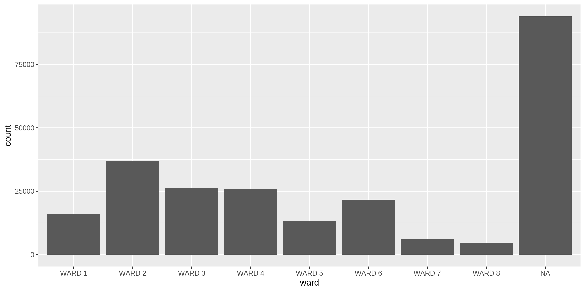
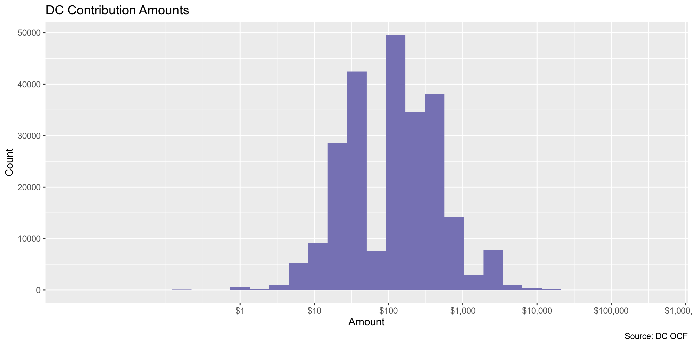
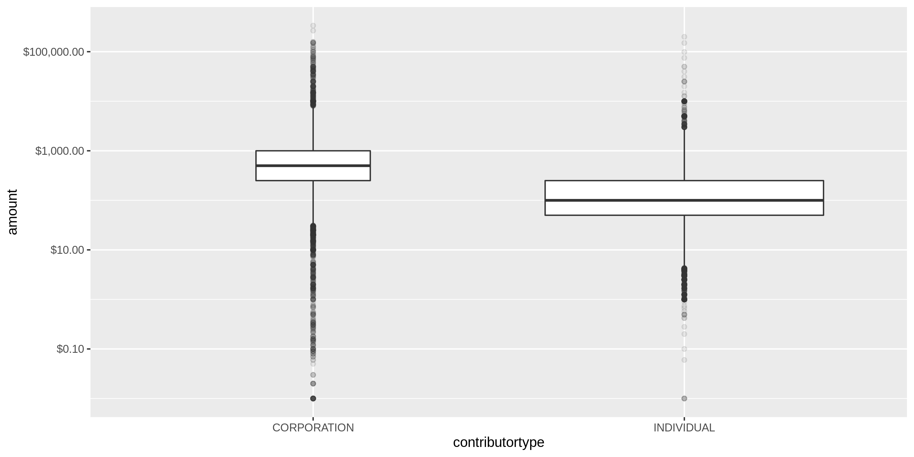
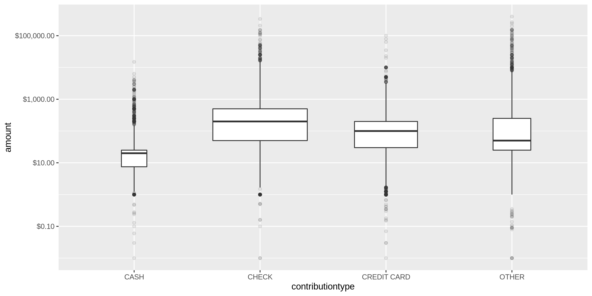
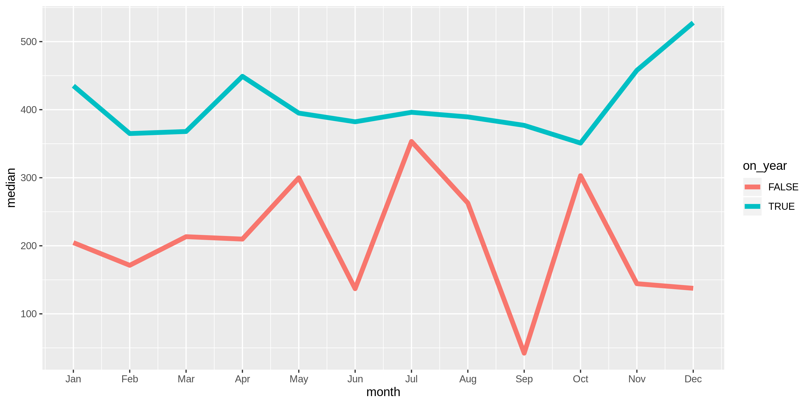

District Contributions
================
Kiernan Nicholls
2019-07-15 12:27:10

  - [Project](#project)
  - [Objectives](#objectives)
  - [Packages](#packages)
  - [Data](#data)
  - [Import](#import)
  - [Explore](#explore)
  - [Wrangle](#wrangle)
  - [Conclude](#conclude)
  - [Write](#write)

## Project

The Accountability Project is an effort to cut across data silos and
give journalists, policy professionals, activists, and the public at
large a simple way to search across huge volumes of public data about
people and organizations.

Our goal is to standardizing public data on a few key fields by thinking
of each dataset row as a transaction. For each transaction there should
be (at least) 3 variables:

1.  All **parties** to a transaction
2.  The **date** of the transaction
3.  The **amount** of money involved

## Objectives

This document describes the process used to complete the following
objectives:

1.  How many records are in the database?
2.  Check for duplicates
3.  Check ranges
4.  Is there anything blank or missing?
5.  Check for consistency issues
6.  Create a five-digit ZIP Code called `ZIP5`
7.  Create a `YEAR` field from the transaction date
8.  Make sure there is data on both parties to a transaction

## Packages

The following packages are needed to collect, manipulate, visualize,
analyze, and communicate these results. The `pacman` package will
facilitate their installation and attachment.

``` r
if (!require("pacman")) install.packages("pacman")
pacman::p_load(
  stringdist, # levenshtein value
  tidyverse, # data manipulation
  lubridate, # datetime strings
  magrittr, # pipe opperators
  jsonlite, # reading JSON
  janitor, # dataframe clean
  zipcode, # clean & database
  refinr, # cluster & merge
  vroom, # quickly read files
  ggmap, # google maps API
  knitr, # knit documents
  glue, # combine strings
  here, # relative storage
  fs, # search storage 
  sf # spatial data
)
```

This document should be run as part of the `R_campfin` project, which
lives as a sub-directory of the more general, language-agnostic
[`irworkshop/accountability_datacleaning`](https://github.com/irworkshop/accountability_datacleaning "TAP repo")
GitHub repository.

The `R_campfin` project uses the [RStudio
projects](https://support.rstudio.com/hc/en-us/articles/200526207-Using-Projects "Rproj")
feature and should be run as such. The project also uses the dynamic
`here::here()` tool for file paths relative to *your* machine.

``` r
# where dcs this document knit?
here::here()
#> [1] "/home/ubuntu/R/accountability_datacleaning/R_campfin"
```

## Data

Data comes courtesy of the Washington, [DC Office of Campaign Finance
(OCF)](https://ocf.dc.gov/ "OCF").

The data was published 2016-10-06 and was last updated 2019-05-07. Each
record represents a single contribution made.

As the [OCF
website](https://ocf.dc.gov/service/view-contributions-expenditures)
explains:

> The Office of Campaign Finance (OCF) provides easy access to all
> contributions and expenditures reported from 2003, through the current
> reporting period. Because the system is updated on a daily basis, you
> may be able to retrieve data received by OCF after the latest
> reporting period. This data is as reported, but may not be complete.

### About

The data is found on the dc.gov [OpenData
website](https://opendata.dc.gov/datasets/campaign-financial-contributions).
The file abstract reads:

> The Office of Campaign Finance (OCF) is pleased to publicly share
> election campaign contribution data. The Campaign Finance Office is
> charged with administering and enforcing the District of Columbia laws
> pertaining to campaign finance operations, lobbying activities,
> conflict of interest matters, the ethical conduct of public officials,
> and constituent service and statehood fund programs. OCF provides easy
> access to all contributions and expenditures reported from 2003,
> through the current reporting period. Because the system is updated on
> a daily basis, you may be able to retrieve data received by OCF after
> the latest reporting period. This data is as reported, but may not be
> complete. Visit the <http://ocf.dc.gov> for more information.
> 
> Users may also visit the [Candidate
> Campaign](http://geospatial.dcgis.dc.gov/ocf/) Contributions web
> application to find financial data by zip codes.

> Keywords: \* contributions \* dc \* dc gis \* elections \*
> expenditures \* finance \* money \* oct2016 \* political \* public
> service \* vote \* washington dc

> Contact: \* Organization: D.C. Office of the Chief Technology Officer
> \* Person: GIS Data Coordinator \* Address: Address: 200 I Street SE,
> 5th Floor, Washington DC 20003 USA \* Facsimile Telephone: (202)
> 727-5660 \* Electronic Mail Address: <dcgis@dc.gov> \* Hours: 8:30 am
> - 5 pm

## Import

We can retreive the data from the GeoJSON API using the
`jsonlite::fromJSON()` function.

``` r
dir_raw <- here("dc", "contribs", "data", "raw")
dir_create(dir_raw)

dc <- 
  fromJSON("https://opendata.arcgis.com/datasets/6443e0b5b2454e86a3208b8a38fdee84_34.geojson") %>% 
  use_series(features) %>% 
  use_series(properties) %>% 
  as_tibble() %>% 
  clean_names() %>%
  mutate_if(is_character, str_to_upper) %>% 
  mutate_at(vars(dateofreceipt), parse_datetime) %>% 
  select(
    -xcoord, 
    -ycoord, 
    -fulladdress, 
    -gis_last_mod_dttm,
  )
```

Then save a copy of the data frame to the disk in the `/data/raw`
directory.

``` r
write_delim(
  x = dc,
  path = glue("{dir_raw}/Campaign_Financial_Contributions.csv"),
  delim = ";",
  na = "",
  append = FALSE,
  col_names = TRUE,
  quote_escape = "double"
)
```

## Explore

There are 244678 records of 16 variables in the full database.

``` r
head(dc)
```

    #> # A tibble: 6 x 16
    #>   objectid committeename candidatename electionyear contributorname address contributortype
    #>      <int> <chr>         <chr>                <int> <chr>           <chr>   <chr>          
    #> 1     1001 RE-ELECT BRA… BRANDON TODD          2016 JOIGIE HAYES    7503 1… INDIVIDUAL     
    #> 2     1002 ALLEN FOR DC  S. KATHRYN A…         2018 CAMILLE MOSLEY  7504 1… INDIVIDUAL     
    #> 3     1003 FENTY 2006    ADRIAN FENTY          2006 CAMILLE RIGGS-… 7504 1… INDIVIDUAL     
    #> 4     1004 MICHAEL BROW… MICHAEL BROWN         2007 PEYTON MCCALL … 7504 A… CORPORATION    
    #> 5     1005 FRIENDS OF M… MICHAEL BROWN         2008 HERBERT SCOTT   7504 A… INDIVIDUAL     
    #> 6     1006 FENTY 2006    ADRIAN FENTY          2006 PEYTON MCCALL,… 7504 A… CORPORATION    
    #> # … with 9 more variables: contributiontype <chr>, employer <chr>, employeraddress <chr>,
    #> #   amount <dbl>, dateofreceipt <dttm>, address_id <int>, latitude <dbl>, longitude <dbl>,
    #> #   ward <chr>

``` r
tail(dc)
```

    #> # A tibble: 6 x 16
    #>   objectid committeename candidatename electionyear contributorname address contributortype
    #>      <int> <chr>         <chr>                <int> <chr>           <chr>   <chr>          
    #> 1   243995 BB&T DISTRIC… CALVIN WINGF…         2002 JAMES NORTON    4322 W… INDIVIDUAL     
    #> 2   243996 BOLDEN 2006 … A. SCOTT BOL…         2006 DOROTHY MYERS   4323 1… INDIVIDUAL     
    #> 3   243997 MARY CHEH WA… MARY CHEH             2006 ELLEN BERLOW    4323 E… INDIVIDUAL     
    #> 4   243998 KATHY PATTER… KATHY PATTER…         2006 ANDRE DE VINCE… 4323 R… INDIVIDUAL     
    #> 5   243999 "DUMPTRUMP -… JOHN CAPOZZI          2018 CATRINA EDWARDS 4323 V… INDIVIDUAL     
    #> 6   244000 MENDELSON FO… PHIL MENDELS…         2006 BETH KRAVETZ    4323 W… INDIVIDUAL     
    #> # … with 9 more variables: contributiontype <chr>, employer <chr>, employeraddress <chr>,
    #> #   amount <dbl>, dateofreceipt <dttm>, address_id <int>, latitude <dbl>, longitude <dbl>,
    #> #   ward <chr>

``` r
glimpse(dc)
```

    #> Observations: 244,678
    #> Variables: 16
    #> $ objectid         <int> 1001, 1002, 1003, 1004, 1005, 1006, 1007, 1008, 1009, 1010, 1011, 1012,…
    #> $ committeename    <chr> "RE-ELECT BRANDON TODD FOR WARD 4", "ALLEN FOR DC", "FENTY 2006", "MICH…
    #> $ candidatename    <chr> "BRANDON TODD", "S. KATHRYN ALLEN", "ADRIAN FENTY", "MICHAEL BROWN", "M…
    #> $ electionyear     <int> 2016, 2018, 2006, 2007, 2008, 2006, 2006, 2015, 2002, 2008, 2018, 2008,…
    #> $ contributorname  <chr> "JOIGIE HAYES", "CAMILLE MOSLEY", "CAMILLE RIGGS-MOSLEY", "PEYTON MCCAL…
    #> $ address          <chr> "7503 12TH STREET, NW, WASHINGTON, DC 20012", "7504 14TH ST NW, WASHING…
    #> $ contributortype  <chr> "INDIVIDUAL", "INDIVIDUAL", "INDIVIDUAL", "CORPORATION", "INDIVIDUAL", …
    #> $ contributiontype <chr> "CREDIT CARD", "CREDIT CARD", "CHECK", "CHECK", "CHECK", "CHECK", "CHEC…
    #> $ employer         <chr> NA, "ARAMARK", "LEE HECHT HARRISSON", NA, NA, NA, "SELF-EMPLOYED", NA, …
    #> $ employeraddress  <chr> NA, "1101 MARKET ST, PHILADELPHIA, PA 19107", "WASHINGTON, DC", NA, NA,…
    #> $ amount           <dbl> 51.00, 100.00, 100.00, 250.00, 250.00, 150.00, 100.00, 100.00, 100.00, …
    #> $ dateofreceipt    <dttm> 2016-06-08, 2018-06-05, 2006-11-04, 2007-04-19, 2009-01-29, 2005-07-30…
    #> $ address_id       <int> 253514, 256263, 256263, 257290, 257290, 257290, 257290, 251129, 253508,…
    #> $ latitude         <dbl> 38.98059, 38.98074, 38.98074, 38.98080, 38.98080, 38.98080, 38.98080, 3…
    #> $ longitude        <dbl> -77.02759, -77.03366, -77.03366, -77.03043, -77.03043, -77.03043, -77.0…
    #> $ ward             <chr> "WARD 4", "WARD 4", "WARD 4", "WARD 4", "WARD 4", "WARD 4", "WARD 4", "…

### Distinct

The variables range in their degree of distinctness.

``` r
dc %>% glimpse_fun(n_distinct)
```

    #> # A tibble: 16 x 4
    #>    var              type       n         p
    #>    <chr>            <chr>  <int>     <dbl>
    #>  1 objectid         int   244678 1        
    #>  2 committeename    chr     1524 0.00623  
    #>  3 candidatename    chr      430 0.00176  
    #>  4 electionyear     int       17 0.0000695
    #>  5 contributorname  chr   113061 0.462    
    #>  6 address          chr   139777 0.571    
    #>  7 contributortype  chr       27 0.000110 
    #>  8 contributiontype chr        9 0.0000368
    #>  9 employer         chr    36593 0.150    
    #> 10 employeraddress  chr    21055 0.0861   
    #> 11 amount           dbl     5125 0.0209   
    #> 12 dateofreceipt    dttm    5681 0.0232   
    #> 13 address_id       int    28692 0.117    
    #> 14 latitude         dbl    28692 0.117    
    #> 15 longitude        dbl    28692 0.117    
    #> 16 ward             chr        9 0.0000368

<!-- -->

<!-- -->

<!-- -->

### Map

<!-- -->

### Missing

There are several variables missing key values:

``` r
dc %>% glimpse_fun(count_na)
```

    #> # A tibble: 16 x 4
    #>    var              type       n        p
    #>    <chr>            <chr>  <int>    <dbl>
    #>  1 objectid         int        0 0       
    #>  2 committeename    chr        0 0       
    #>  3 candidatename    chr    22054 0.0901  
    #>  4 electionyear     int       28 0.000114
    #>  5 contributorname  chr     1161 0.00475 
    #>  6 address          chr     1149 0.00470 
    #>  7 contributortype  chr     1452 0.00593 
    #>  8 contributiontype chr     2425 0.00991 
    #>  9 employer         chr    96609 0.395   
    #> 10 employeraddress  chr   140419 0.574   
    #> 11 amount           dbl      367 0.00150 
    #> 12 dateofreceipt    dttm       0 0       
    #> 13 address_id       int    93945 0.384   
    #> 14 latitude         dbl    93945 0.384   
    #> 15 longitude        dbl    93945 0.384   
    #> 16 ward             chr    93945 0.384

Any row with a missing `contributorname` *or* `amount` value will have a
`TRUE` value in the new `na_flag` variable.

``` r
dc <- dc %>% mutate(na_flag = is.na(contributorname) | is.na(amount))
```

### Duplicates

There are no duplicate records.

``` r
dc_dupes <- get_dupes(dc)
nrow(dc_dupes)
#> [1] 0
```

### Ranges

#### Amounts

The `amount` varies from $-31,889.24 to $400,000.

``` r
summary(dc$amount)
#>     Min.  1st Qu.   Median     Mean  3rd Qu.     Max.     NA's 
#> -31889.2     50.0    100.0    373.7    400.0 400000.0      367
sum(dc$amount < 0, na.rm = TRUE)
#> [1] 58
```

<!-- -->

<!-- -->

<!-- -->

<!-- -->

### Dates

The dates range from  and -. There are 0 records with a date greater
than 2019-07-15.

``` r
summary(dc$dateofreceipt)
#>                  Min.               1st Qu.                Median                  Mean 
#> "2003-01-01 00:00:00" "2007-07-20 00:00:00" "2012-01-25 00:00:00" "2011-09-28 23:02:33" 
#>               3rd Qu.                  Max. 
#> "2015-01-02 00:00:00" "2019-05-08 00:00:00"
sum(dc$dateofreceipt > today())
#> [1] 0
```

<!-- -->

<!-- -->

Since we’ve already used `readr::parse_datetime()`, we can use
`lubridate::year()` to create a new variable representng the year of the
reciept.

``` r
dc <- dc %>% mutate(yearofreceipt = year(dateofreceipt))
```

## Wrangle

We will have to break the `address` variable into `address`, `city`,
`state`, and `zip`.

``` r
head(dc$address)
```

    #> [1] "7503 12TH STREET, NW, WASHINGTON, DC 20012"   "7504 14TH ST NW, WASHINGTON, DC 20012"       
    #> [3] "7504 14TH ST NW, WASHINGTON, DC 20012"        "7504 ALASKA AVE NW, WASHINGTON, DC 20012"    
    #> [5] "7504 ALASKA AVE NW, WASHINGTON, DC 20012"     "7504 ALASKA AVENUE, NW, WASHINGTON, DC 20012"

First, we will extract the ZIP digits from the end of the `address`
string.

``` r
dc <- dc %>% 
  mutate(
    zip_clean = address %>% 
      str_extract("\\d{5}(?:-\\d{4})?$") %>% 
      normalize_zip(na_rep = TRUE)
  )

sample(dc$zip_clean, 10)
#>  [1] "20016" "20009" "20012" "20001" "20895" "20817" "20012" "20017" "38116" "20016"
```

Then we can get the two digit state abbreviation preceding those digits.

``` r
dc <- dc %>% 
  mutate(
    state_clean = address %>% 
      str_extract("[:alpha:]+(?=[:space:]+[:digit:]{5}(?:-[:digit:]{4})?$)") %>%
      normalize_state(
        na = c("UNKNOWN", "TBD", "INFORMATION", "REQUESTED", "DISCLOSED"), 
        expand = TRUE
      )
  )

n_distinct(dc$state_clean)
#> [1] 101
sample(dc$state_clean, 10)
#>  [1] "MD" "DC" "DC" "DC" "DC" "DC" "DC" "DC" "DC" "MD"
```

``` r
setdiff(dc$state_clean, geo$state)
```

    #>  [1] NA              "COLUMBIA"      "JERSEY"        "CAROLINA"      "YORK"         
    #>  [6] "WASH"          "MARLBORO"      "A"             "MCLEAN"        "MARYALND"     
    #> [11] "BROOKLYN"      "PARK"          "PENSACOLA"     "GAITHERSBURG"  "CHURCH"       
    #> [16] "POTOMAC"       "LORTON"        "LEESBURG"      "BALTIMORE"     "HILL"         
    #> [21] "LANHAM"        "SPRING"        "SEATTLE"       "MARLOBR"       "HOHENFELS"    
    #> [26] "MILWAUKEE"     "ALEXANDRIA"    "MONTREAL"      "CHASE"         "APO"          
    #> [31] "DALE"          "BETHESDA"      "FREDERICK"     "STEVENSVILLE"  "BEACH"        
    #> [36] "DPO"           "BAMAKO"        "RESTON"        "KINSHASA"      "COLOMBIA"     
    #> [41] "ARLINGTON"     "MITCHELLVILLE" "BETHES"        "BLANK"         "CALIFORRNIA"

Some `address` strings lack the two character abbreviation, so we will
have to infer from their city names.

``` r
dc$state_clean <- dc$state_clean %>% 
  na_if("A") %>% 
  str_replace("COLUMBIA",  "DC") %>% 
  str_replace("BETHESDA",  "MD") %>% 
  str_replace("MARYALND",  "MD") %>% 
  str_replace("SPRING",    "MD") %>% 
  str_replace("ARLINGTON", "VA") %>% 
  str_replace("BROOKLYN", "NY") %>% 
  str_replace("YORK", "NY") %>% 
  str_replace("BALTIMORE", "MD") %>% 
  str_replace("CAROLINA", "NC") %>% 
  str_replace("DALE", "MD") %>% 
  str_replace("BALTIMORE", "MD") %>% 
  str_replace("ALEXANDRIA", "VA") %>% 
  str_replace("MARLBORO", "MD")

dc$state_clean[dc$state_clean %out% geo$state] <- NA
```

## Conclude

1.  How are 244678 records in the database
2.  There are 0 duplicate records
3.  The `amount` values range from $-31,889.24 to $400,000; the
    `dateofreceipt` ranges from to .
4.  There are 1161 records missing a `contributorname` or `amount` value
    (flagged with the logical `na_flag` variable)
5.  Consistency in ZIP codes and state abbreviations has been fixed from
    `address`
6.  The `zip_clean` variable contains the 5 digit ZIP from `address`
7.  The `yearofreceipt` variable contains the 4 digit year of the
    receipt.
8.  There are not both names to *every* transaction (99.5% of records
    have all data)

## Write

``` r
dir_proc <- here("dc", "contribs", "data", "processed")
dir_create(dir_proc)

write_csv(
  x = dc,
  na = "",
  path = glue("{dir_proc}/dc_contribs_clean.csv")
)
```
