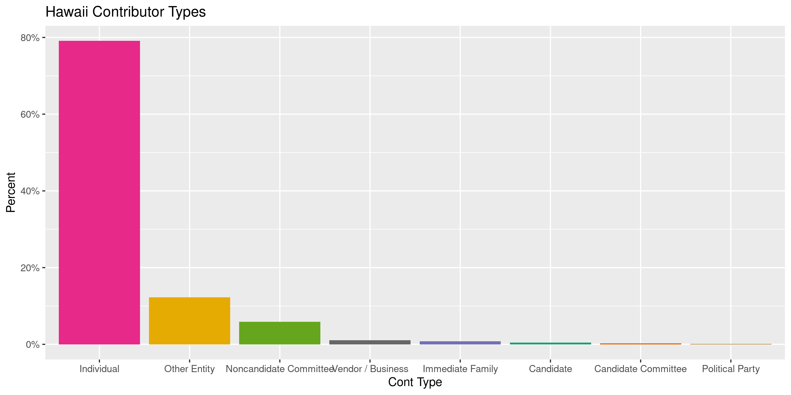
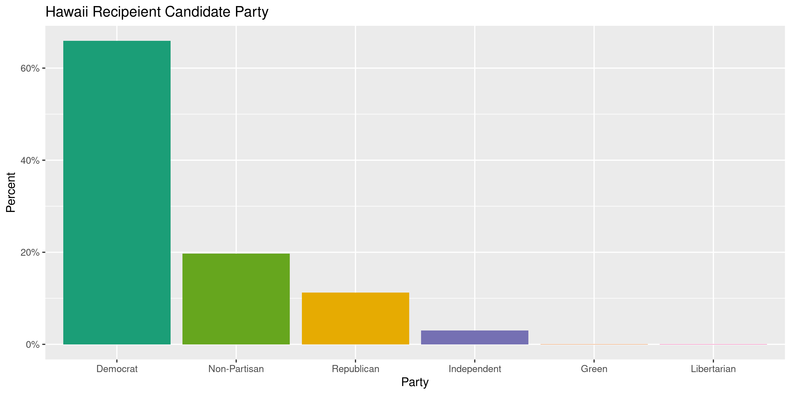
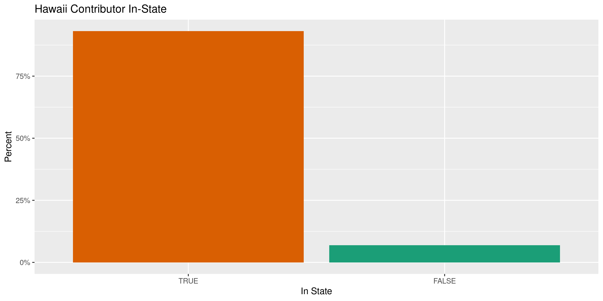
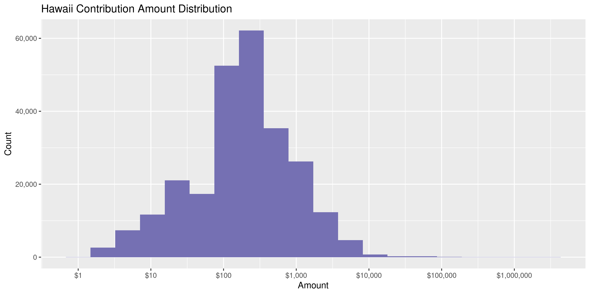
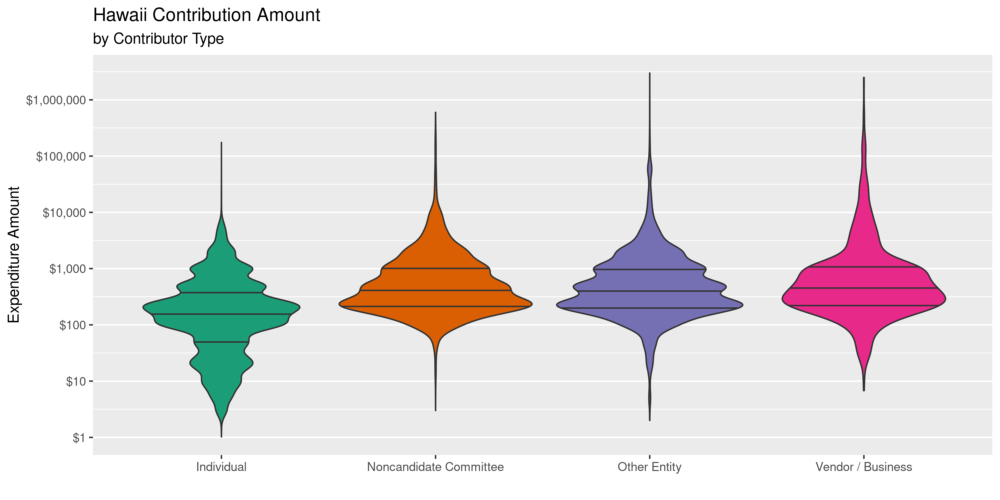

Hawaii Contributions
================
Kiernan Nicholls
2020-01-17 17:13:59

  - [Project](#project)
  - [Objectives](#objectives)
  - [Packages](#packages)
  - [Data](#data)
  - [Import](#import)
  - [Explore](#explore)
  - [Wrangle](#wrangle)
  - [Conclude](#conclude)
  - [Export](#export)

<!-- Place comments regarding knitting here -->

## Project

The Accountability Project is an effort to cut across data silos and
give journalists, policy professionals, activists, and the public at
large a simple way to search across huge volumes of public data about
people and organizations.

Our goal is to standardizing public data on a few key fields by thinking
of each dataset row as a transaction. For each transaction there should
be (at least) 3 variables:

1.  All **parties** to a transaction
2.  The **date** of the transaction
3.  The **amount** of money involved

## Objectives

This document describes the process used to complete the following
objectives:

1.  How many records are in the database?
2.  Check for duplicates
3.  Check ranges
4.  Is there anything blank or missing?
5.  Check for consistency issues
6.  Create a five-digit ZIP Code called `ZIP5`
7.  Create a `YEAR` field from the transaction date
8.  Make sure there is data on both parties to a transaction

## Packages

The following packages are needed to collect, manipulate, visualize,
analyze, and communicate these results. The `pacman` package will
facilitate their installation and attachment.

The IRW’s `campfin` package will also have to be installed from GitHub.
This package contains functions custom made to help facilitate the
processing of campaign finance data.

``` r
if (!require("pacman")) install.packages("pacman")
pacman::p_load_gh("irworkshop/campfin")
pacman::p_load(
  tidyverse, # data manipulation
  lubridate, # datetime strings
  magrittr, # pipe opperators
  janitor, # dataframe clean
  refinr, # cluster and merge
  scales, # format strings
  knitr, # knit documents
  vroom, # read files fast
  glue, # combine strings
  here, # relative storage
  fs # search storage 
)
```

This document should be run as part of the `R_campfin` project, which
lives as a sub-directory of the more general, language-agnostic
[`irworkshop/accountability_datacleaning`](https://github.com/irworkshop/accountability_datacleaning "TAP repo")
GitHub repository.

The `R_campfin` project uses the [RStudio
projects](https://support.rstudio.com/hc/en-us/articles/200526207-Using-Projects "Rproj")
feature and should be run as such. The project also uses the dynamic
`here::here()` tool for file paths relative to *your* machine.

``` r
# where does this document knit?
here::here()
#> [1] "/home/kiernan/R/accountability_datacleaning/R_campfin"
```

## Data

Data is obtained from the [Hawaii Campaign Spending
Commission](https://ags.hawaii.gov/campaign/) (CSC). The file can be
found on the \[Hawaii Open Data portal\]\[odp\]. There are two files,
one contributions received by Candidate committees and one for
Noncandidate committees. In both files, each record represents a
campaign contribution made from an individual, political party, or some
other entity.

## Import

We can read both files into a single data frame with `purrr::map_df()`
and `readr::read_csv()`.

``` r
hic <- map_df(
  .x = c(
    "https://data.hawaii.gov/api/views/jexd-xbcg/rows.csv", # Candidates
    "https://data.hawaii.gov/api/views/rajm-32md/rows.csv" # Noncandidate Committees
  ),
  .f = read_csv,
  .id = "reg_type",
  col_types = cols(
    .default = col_character(),
    Date = col_date_usa(),
    Amount = col_double(),
    Aggregate = col_double()
  )
)
```

Then we will do some slight wrangling to the column names, types, and
positions for clarity.

``` r
hic <- hic %>%
  clean_names(case = "snake") %>%
  rename(
    cand_name = candidate_name,
    comm_name = noncandidate_committee_name,
    cont_type = contributor_type,
    cont_name = contributor_name,
    monetary = non_monetary_yes_or_no,
    category = non_monetary_category,
    description = non_monetary_description,
    in_state = in_out_state,
    zip = zip_code,
    reg_id = reg_no,
  ) %>% 
  mutate(
    reg_type = recode(reg_type, "1" = "Candidate", "2" = "Noncandidate"),
    reg_name = coalesce(cand_name, comm_name),
    monetary = equals(monetary, "N"),
    in_state = equals(in_state, "HI")
  ) %>% 
  select(
    date,
    reg_id,
    reg_type,
    reg_name,
    everything(),
    -comm_name,
    -cand_name
  )
```

## Explore

The data base has 247,581 rows of 26 variables.

``` r
head(hic)
#> # A tibble: 6 x 26
#>   date       reg_id reg_type reg_name cont_type cont_name amount aggregate employer occupation
#>   <date>     <chr>  <chr>    <chr>    <chr>     <chr>      <dbl>     <dbl> <chr>    <chr>     
#> 1 2010-08-23 CC105… Candida… Abercro… Individu… Kamau, A…     25       125 N/A      Retired   
#> 2 2016-08-24 CC110… Candida… Agustin… Individu… Chong Jr…   1000      1000 None     Retired   
#> 3 2014-10-29 CC110… Candida… Ahu, El… Individu… Tesoro, …    200       400 <NA>     <NA>      
#> 4 2007-06-21 CC101… Candida… Aiona, … Individu… Hartman,…    500       500 Self     Business …
#> 5 2007-06-19 CC101… Candida… Aiona, … Individu… Moriguch…   1000      1000 None     Retired   
#> 6 2008-06-19 CC101… Candida… Aiona, … Individu… Boyd, Vi…    100       150 Retired  Retired   
#> # … with 16 more variables: address_1 <chr>, address_2 <chr>, city <chr>, state <chr>, zip <chr>,
#> #   monetary <lgl>, category <chr>, description <chr>, office <chr>, district <chr>, county <chr>,
#> #   party <chr>, election_period <chr>, mapping_location <chr>, in_state <lgl>, range <chr>
tail(hic)
#> # A tibble: 6 x 26
#>   date       reg_id reg_type reg_name cont_type cont_name amount aggregate employer occupation
#>   <date>     <chr>  <chr>    <chr>    <chr>     <chr>      <dbl>     <dbl> <chr>    <chr>     
#> 1 2012-06-06 NC205… Noncand… ZIC PAC  Noncandi… ZIC PAC     1500      2600 <NA>     <NA>      
#> 2 2014-09-24 NC205… Noncand… ZIC PAC  Noncandi… ZIC PAC     3400      6400 <NA>     <NA>      
#> 3 2014-06-18 NC205… Noncand… ZIC PAC  Noncandi… ZIC PAC     3000      3000 <NA>     <NA>      
#> 4 2010-11-02 NC202… Noncand… ZIC PAC  Noncandi… ZIC PAC     3000      3000 <NA>     <NA>      
#> 5 2015-10-21 NC205… Noncand… ZIC PAC  Noncandi… ZIC PAC      500       500 <NA>     <NA>      
#> 6 2011-07-27 NC205… Noncand… ZIC PAC  Noncandi… ZIC PAC     1000      1100 <NA>     <NA>      
#> # … with 16 more variables: address_1 <chr>, address_2 <chr>, city <chr>, state <chr>, zip <chr>,
#> #   monetary <lgl>, category <chr>, description <chr>, office <chr>, district <chr>, county <chr>,
#> #   party <chr>, election_period <chr>, mapping_location <chr>, in_state <lgl>, range <chr>
glimpse(sample_frac(hic))
#> Observations: 247,581
#> Variables: 26
#> $ date             <date> 2017-10-24, 2012-11-25, 2015-12-31, 2018-07-23, 2010-06-10, 2016-04-25…
#> $ reg_id           <chr> "CC10171", "NC20456", "NC20134", "CC10243", "CC10330", "NC20024", "CC10…
#> $ reg_type         <chr> "Candidate", "Noncandidate", "Noncandidate", "Candidate", "Candidate", …
#> $ reg_name         <chr> "Dela Cruz, Donovan", "Cattlemen's Action Legislative Fund (\"CALF\")",…
#> $ cont_type        <chr> "Noncandidate Committee", "Vendor / Business", "Individual", "Other Ent…
#> $ cont_name        <chr> "HGEA Political Contribution Account", "Kapuniani Ranch", "BAKER, ALFRE…
#> $ amount           <dbl> 1000.00, 250.00, 124.79, 250.00, 125.00, 20.00, 1000.00, 7.00, 104.82, …
#> $ aggregate        <dbl> 1500.00, 250.00, 124.79, 600.00, 125.00, 360.00, 1000.00, 182.00, 104.8…
#> $ employer         <chr> NA, NA, "HEIDE & COOK, LLC", NA, NA, "Central Pacific Home Loan", "none…
#> $ occupation       <chr> NA, NA, "REFRIGERATION FITTER", NA, NA, "Assistant Controller", "Retire…
#> $ address_1        <chr> "P.O. Box 2930", "PO Box 6753", "91-1083 HANALOA STREET", "1259 Aala St…
#> $ address_2        <chr> NA, NA, NA, NA, NA, NA, NA, NA, NA, NA, NA, NA, "Apt 2701", NA, "Apt 26…
#> $ city             <chr> "Honolulu", "Kamuela", "EWA BEACH", "Honolulu", "Kihei", "Aiea", "San F…
#> $ state            <chr> "HI", "HI", "HI", "HI", "HI", "HI", "CA", "HI", "HI", "HI", "HI", "HI",…
#> $ zip              <chr> "96802", "96743", "96706", "96817", "96753", "96701", "94105", "96793",…
#> $ monetary         <lgl> TRUE, TRUE, TRUE, TRUE, TRUE, TRUE, TRUE, TRUE, TRUE, FALSE, TRUE, TRUE…
#> $ category         <chr> NA, NA, NA, NA, NA, NA, NA, NA, NA, "Advertising", NA, NA, NA, NA, NA, …
#> $ description      <chr> NA, NA, NA, NA, NA, NA, NA, NA, NA, "PRIZES FOR KEIKI FUN RUN", NA, NA,…
#> $ office           <chr> "Senate", NA, NA, "House", "Maui Council", NA, "Lt. Governor", NA, NA, …
#> $ district         <chr> "22", NA, NA, "42", "Upcountry", NA, NA, NA, NA, NA, NA, "4", NA, "1", …
#> $ county           <chr> NA, NA, NA, NA, "Maui", NA, NA, NA, NA, "Kauai", NA, "Honolulu", NA, NA…
#> $ party            <chr> "Democrat", NA, NA, "Democrat", "Non-Partisan", NA, "Democrat", NA, NA,…
#> $ election_period  <chr> "2016-2018", "2012-2014", "2014-2016", "2016-2018", "2008-2010", "2014-…
#> $ mapping_location <chr> NA, NA, "91-1083 HANALOA STREET\nEWA BEACH, HI 96706\n(21.322527, -158.…
#> $ in_state         <lgl> TRUE, TRUE, TRUE, TRUE, TRUE, TRUE, FALSE, TRUE, TRUE, TRUE, TRUE, TRUE…
#> $ range            <chr> "0-1000", "0-1000", "0-1000", "0-1000", "0-1000", "0-1000", "0-1000", "…
```

### Missing

``` r
col_stats(hic, count_na)
#> # A tibble: 26 x 4
#>    col              class       n          p
#>    <chr>            <chr>   <int>      <dbl>
#>  1 date             <date>      0 0         
#>  2 reg_id           <chr>       0 0         
#>  3 reg_type         <chr>       0 0         
#>  4 reg_name         <chr>       0 0         
#>  5 cont_type        <chr>       0 0         
#>  6 cont_name        <chr>       0 0         
#>  7 amount           <dbl>       0 0         
#>  8 aggregate        <dbl>       0 0         
#>  9 employer         <chr>  106065 0.428     
#> 10 occupation       <chr>  104408 0.422     
#> 11 address_1        <chr>      18 0.0000727 
#> 12 address_2        <chr>  234469 0.947     
#> 13 city             <chr>       5 0.0000202 
#> 14 state            <chr>       0 0         
#> 15 zip              <chr>       0 0         
#> 16 monetary         <lgl>      39 0.000158  
#> 17 category         <chr>  239842 0.969     
#> 18 description      <chr>  239845 0.969     
#> 19 office           <chr>   88227 0.356     
#> 20 district         <chr>  154282 0.623     
#> 21 county           <chr>  203823 0.823     
#> 22 party            <chr>   88227 0.356     
#> 23 election_period  <chr>       1 0.00000404
#> 24 mapping_location <chr>   42284 0.171     
#> 25 in_state         <lgl>       0 0         
#> 26 range            <chr>       0 0
```

There are no columns missing the name, date, or amount used to identify
a unique contribution.

### Duplicates

``` r
hic <- flag_dupes(hic, everything())
```

There are 119 rows that are complete duplicated of another. They are
flagged.

### Categorical

``` r
col_stats(hic, n_distinct)
#> # A tibble: 27 x 4
#>    col              class      n          p
#>    <chr>            <chr>  <int>      <dbl>
#>  1 date             <date>  4270 0.0172    
#>  2 reg_id           <chr>   1543 0.00623   
#>  3 reg_type         <chr>      2 0.00000808
#>  4 reg_name         <chr>   1456 0.00588   
#>  5 cont_type        <chr>      9 0.0000364 
#>  6 cont_name        <chr>  67890 0.274     
#>  7 amount           <dbl>  16204 0.0654    
#>  8 aggregate        <dbl>  29831 0.120     
#>  9 employer         <chr>  14992 0.0606    
#> 10 occupation       <chr>   7345 0.0297    
#> 11 address_1        <chr>  70634 0.285     
#> 12 address_2        <chr>   4145 0.0167    
#> 13 city             <chr>   3450 0.0139    
#> 14 state            <chr>     57 0.000230  
#> 15 zip              <chr>   6148 0.0248    
#> 16 monetary         <lgl>      3 0.0000121 
#> 17 category         <chr>     23 0.0000929 
#> 18 description      <chr>   5256 0.0212    
#> 19 office           <chr>     13 0.0000525 
#> 20 district         <chr>     68 0.000275  
#> 21 county           <chr>      5 0.0000202 
#> 22 party            <chr>      7 0.0000283 
#> 23 election_period  <chr>     11 0.0000444 
#> 24 mapping_location <chr>  60646 0.245     
#> 25 in_state         <lgl>      2 0.00000808
#> 26 range            <chr>      3 0.0000121 
#> 27 dupe_flag        <lgl>      2 0.00000808
```

``` r
explore_plot(
  data = filter(hic, !is.na(reg_type)),
  var = reg_type,
  title = "Hawaii Recipient Types"
)
```

<!-- -->

``` r
explore_plot(
  data = hic,
  var = cont_type,
  title = "Hawaii Contributor Types"
)
```

<!-- -->

``` r
explore_plot(
  data = hic,
  var = monetary,
  title = "Hawaii Monetary Contributions"
)
```

<!-- -->

``` r
explore_plot(
  data = filter(hic, !is.na(category)),
  var = category,
  title = "Hawaii Non-Monetary Categories"
)
```

<!-- -->

``` r
explore_plot(
  data = filter(hic, !is.na(office)),
  var = office,
  title = "Hawaii Recipeient Candidate for Office"
)
```

<!-- -->

``` r
explore_plot(
  data = filter(hic, !is.na(party)),
  var = party,
  title = "Hawaii Recipeient Candidate Party"
)
```

<!-- -->

``` r
explore_plot(
  data = filter(hic, !is.na(in_state)),
  var = in_state,
  title = "Hawaii Contributor In-State"
)
```

<!-- -->

``` r
hic <- mutate(hic, range = str_remove_all(range, "\\s"))
```

``` r
explore_plot(
  data = filter(hic, !is.na(range)),
  var = range,
  title = "Hawaii Contributor In-State"
)
```

<!-- -->

### Continuous

#### Amounts

``` r
summary(hic$amount)
#>      Min.   1st Qu.    Median      Mean   3rd Qu.      Max. 
#>  -59078.3      82.8     200.0     779.0     500.0 3000000.0
```

<!-- -->

<!-- -->

<!-- -->

#### Dates

``` r
hic <- mutate(hic, year = year(date))
```

``` r
min(hic$date)
#> [1] "2006-11-08"
sum(hic$year < 2000)
#> [1] 0
max(hic$date)
#> [1] "2019-12-26"
sum(hic$date > today())
#> [1] 0
```

## Wrangle

### Address

``` r
hic <- hic %>% 
  # combine street addr
  unite(
    col = adress_full,
    starts_with("address"),
    sep = " ",
    remove = FALSE,
    na.rm = TRUE
  ) %>% 
  # normalize combined addr
  mutate(
    address_norm = normal_address(
      address = adress_full,
      abbs = usps_street,
      na_rep = TRUE
    )
  ) %>% 
  select(-adress_full)
```

``` r
hic %>% 
  select(starts_with("address")) %>% 
  distinct() %>% 
  sample_frac()
#> # A tibble: 73,374 x 3
#>    address_1                      address_2          address_norm                                  
#>    <chr>                          <chr>              <chr>                                         
#>  1 130 Kaiko Place                <NA>               130 KAIKO PLACE                               
#>  2 161 Wailea Ike Place, Ste. B1… <NA>               161 WAILEA IKE PLACE SUITE B102               
#>  3 Re-Elect Congressman Kucinich… 550 East Walnut S… RE ELECT CONGRESSMAN KUCINICH COMMITTEE 550 E…
#>  4 4875 Nonou Rd                  <NA>               4875 NONOU ROAD                               
#>  5 700 Bishop St Ste 1600         <NA>               700 BISHOP STREET SUITE 1600                  
#>  6 120 dodge avenue               <NA>               120 DODGE AVENUE                              
#>  7 P.O. Box 61732                 <NA>               PO BOX 61732                                  
#>  8 104 Waterford Place            <NA>               104 WATERFORD PLACE                           
#>  9 92-115 Oloa Place              <NA>               92 115 OLOA PLACE                             
#> 10 1360 S Beretania Ste 200       <NA>               1360 SOUTH BERETANIA SUITE 200                
#> # … with 73,364 more rows
```

### ZIP

``` r
hic <- hic %>% 
  mutate(
    zip_norm = normal_zip(
      zip = zip,
      na_rep = TRUE
    )
  )
```

``` r
progress_table(
  hic$zip,
  hic$zip_norm,
  compare = valid_zip
)
#> # A tibble: 2 x 6
#>   stage    prop_in n_distinct prop_na n_out n_diff
#>   <chr>      <dbl>      <dbl>   <dbl> <dbl>  <dbl>
#> 1 zip        0.958       6148 0       10338   2842
#> 2 zip_norm   0.998       3613 0.00179   388    128
```

### State

``` r
prop_in(hic$state, valid_state)
#> [1] 1
count_vec(hic$state)
#> # A tibble: 57 x 2
#>    value      n
#>    <chr>  <int>
#>  1 HI    230499
#>  2 CA      5112
#>  3 DC      1389
#>  4 MO      1332
#>  5 WA       921
#>  6 VA       895
#>  7 TX       839
#>  8 FL       761
#>  9 NY       581
#> 10 IL       569
#> # … with 47 more rows
```

### City

``` r
hic <- hic %>% 
  mutate(
    city_norm = normal_city(
      city = city, 
      abbs = usps_city,
      states = c("HI", "DC", "HAWAII"),
      na = invalid_city,
      na_rep = TRUE
    )
  )
```

``` r
hic <- hic %>% 
  rename(cont_city = city) %>% 
  left_join(
    y = zipcodes,
    by = c(
      "state" = "state",
      "zip_norm" = "zip"
    )
  ) %>% 
  rename(city_match = city) %>% 
  mutate(
    match_abb = is_abbrev(city_norm, city_match),
    match_dist = str_dist(city_norm, city_match),
    city_swap = if_else(
      condition = match_abb | match_dist == 1,
      true = city_match,
      false = city_norm
    )
  ) %>% 
  select(
    -match_abb,
    -match_dist,
    -city_match
  ) %>% 
  rename(city = cont_city)
```

``` r
progress_table(
  hic$city,
  hic$city_norm,
  hic$city_swap,
  compare = c(valid_city, extra_city)
)
#> # A tibble: 3 x 6
#>   stage     prop_in n_distinct   prop_na  n_out n_diff
#>   <chr>       <dbl>      <dbl>     <dbl>  <dbl>  <dbl>
#> 1 city        0.200       3450 0.0000202 197993   2818
#> 2 city_norm   0.982       2603 0.00193     4440    780
#> 3 city_swap   0.993       2093 0.00605     1762    276
```

## Conclude

``` r
glimpse(sample_frac(hic))
#> Observations: 247,581
#> Variables: 32
#> $ date             <date> 2017-10-12, 2014-08-04, 2017-05-19, 2019-01-14, 2010-09-16, 2014-04-07…
#> $ reg_id           <chr> "NC20132", "CC10568", "NC20075", "CC10186", "NC20016", "CC10529", "CC11…
#> $ reg_type         <chr> "Noncandidate", "Candidate", "Noncandidate", "Candidate", "Noncandidate…
#> $ reg_name         <chr> "Patsy T. Mink PAC", "Martin, Ernest", "Hawaiian Telcom Good Government…
#> $ cont_type        <chr> "Individual", "Noncandidate Committee", "Individual", "Individual", "In…
#> $ cont_name        <chr> "Saito, Gary K.", "HDR, Inc. Political Action Committee", "Robinson, El…
#> $ amount           <dbl> 200.00, 1000.00, 15.00, 250.00, 10.00, 150.00, 1500.00, 20.00, 1000.00,…
#> $ aggregate        <dbl> 200.00, 3000.00, 225.00, 250.00, 120.00, 150.00, 1500.00, 145.00, 1000.…
#> $ employer         <chr> "self-employed", NA, "Hawaiian Telcom, Inc.", "retired", "Bank of Hawai…
#> $ occupation       <chr> "chiropractor", NA, "Director - Wholesale Markets", "retired", "Senior …
#> $ address_1        <chr> "98-1827 C Kaahumanu Street", "8404 Indian Hills Dr", "1177 Bishop Stre…
#> $ address_2        <chr> NA, NA, NA, NA, NA, NA, NA, NA, NA, NA, NA, NA, NA, NA, NA, NA, NA, NA,…
#> $ city             <chr> "Aiea", "Omaha", "Honolulu", "Aiea", "Honolulu", "Honolulu", "Honolulu"…
#> $ state            <chr> "HI", "NE", "HI", "HI", "HI", "HI", "HI", "HI", "HI", "HI", "HI", "HI",…
#> $ zip              <chr> "96701", "68114", "96813", "96701", "96846", "96839", "96817", "96793",…
#> $ monetary         <lgl> TRUE, TRUE, TRUE, TRUE, TRUE, TRUE, TRUE, TRUE, TRUE, TRUE, TRUE, TRUE,…
#> $ category         <chr> NA, NA, NA, NA, NA, NA, NA, NA, NA, NA, NA, NA, NA, NA, "Food & Beverag…
#> $ description      <chr> NA, NA, NA, NA, NA, NA, NA, NA, NA, NA, NA, NA, NA, NA, "6 Cases of Ste…
#> $ office           <chr> NA, "Senate", NA, "House", NA, "Governor", "Hawaii Council", "Maui Coun…
#> $ district         <chr> NA, "22", NA, "25", NA, NA, "3", "11", "At-Large", NA, "Maui", NA, NA, …
#> $ county           <chr> NA, NA, NA, NA, NA, NA, "Hawaii", "Maui", NA, NA, NA, NA, NA, NA, "Hawa…
#> $ party            <chr> NA, "Democrat", NA, "Democrat", NA, "Democrat", "Non-Partisan", "Non-Pa…
#> $ election_period  <chr> "2016-2018", "2012-2014", "2016-2018", "2018-2020", "2008-2010", "2012-…
#> $ mapping_location <chr> "98-1827 C Kaahumanu Street\nAiea, HI 96701\n(21.410658, -157.945678)",…
#> $ in_state         <lgl> TRUE, FALSE, TRUE, TRUE, TRUE, TRUE, TRUE, TRUE, TRUE, TRUE, TRUE, TRUE…
#> $ range            <chr> "0-1000", "0-1000", "0-1000", "0-1000", "0-1000", "0-1000", ">1000", "0…
#> $ dupe_flag        <lgl> FALSE, FALSE, FALSE, FALSE, FALSE, FALSE, FALSE, FALSE, FALSE, FALSE, F…
#> $ year             <dbl> 2017, 2014, 2017, 2019, 2010, 2014, 2016, 2008, 2010, 2017, 2014, 2016,…
#> $ address_norm     <chr> "98 1827 C KAAHUMANU STREET", "8404 INDIAN HILLS DRIVE", "1177 BISHOP S…
#> $ zip_norm         <chr> "96701", "68114", "96813", "96701", "96846", "96839", "96817", "96793",…
#> $ city_norm        <chr> "AIEA", "OMAHA", "HONOLULU", "AIEA", "HONOLULU", "HONOLULU", "HONOLULU"…
#> $ city_swap        <chr> "AIEA", "OMAHA", "HONOLULU", "AIEA", "HONOLULU", "HONOLULU", "HONOLULU"…
```

1.  There are 247581 records in the database.
2.  There are 119 duplicate records in the database.
3.  The range and distribution of `amount` and `date` seem reasonable.
4.  There are 0 records missing either recipient or date.
5.  Consistency in geographic data has been improved with
    `campfin::normal_*()`.
6.  The 5-digit `zip_norm` variable has been created with
    `campfin::normal_zip(hic$zip)`.
7.  The 4-digit `year` variable has been created with
    `lubridate::year()`.

## Export

``` r
proc_dir <- dir_create(here("df", "type", "data", "processed"))
```

``` r
hic %>% 
  select(
    -city_norm,
    city_norm = city_swap
  ) %>% 
  write_csv(
    path = glue("{proc_dir}/hi_cont_clean.csv"),
    na = ""
  )
```
