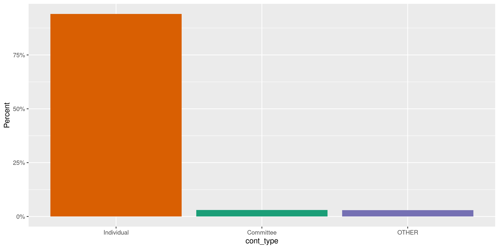
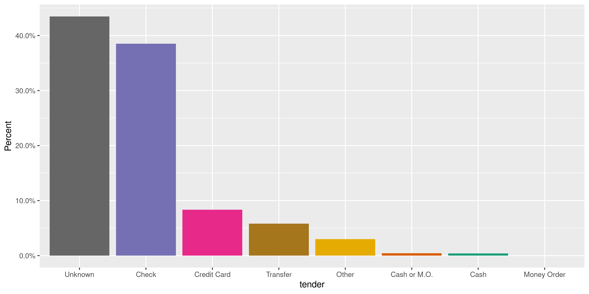
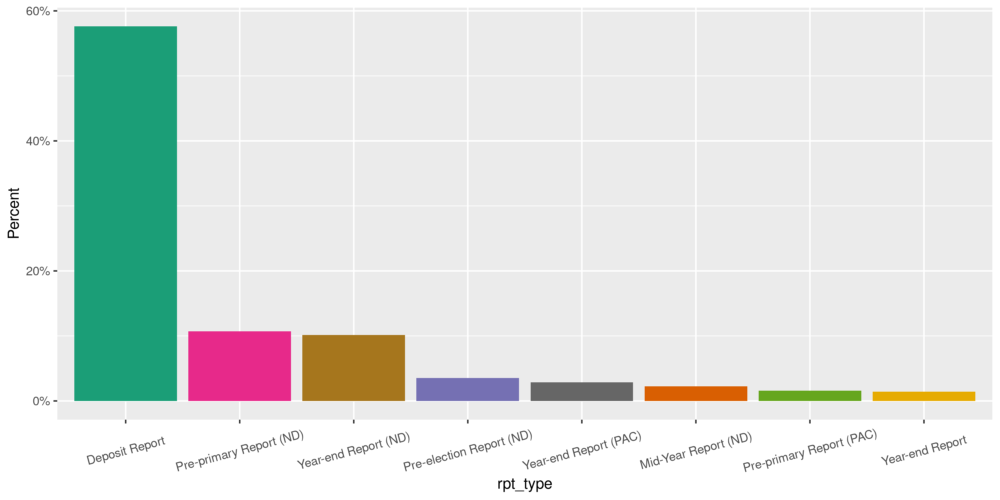
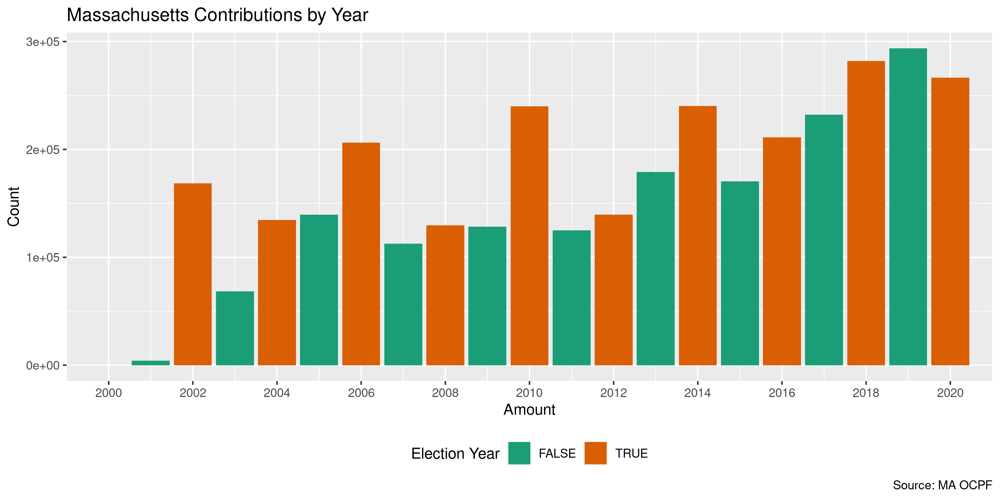
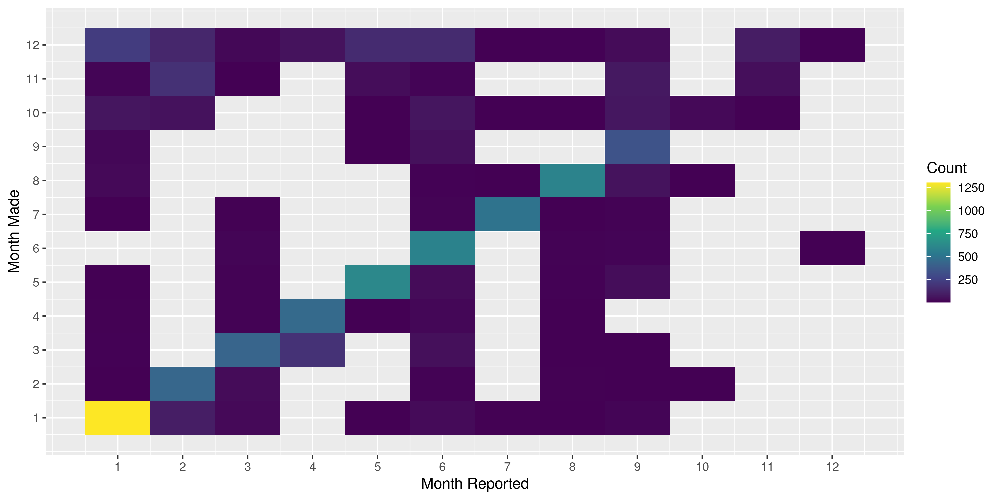
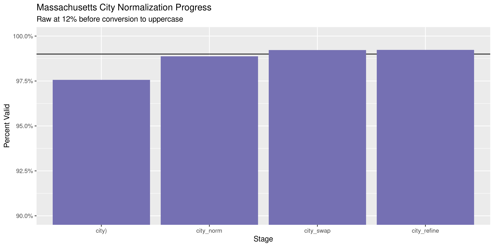
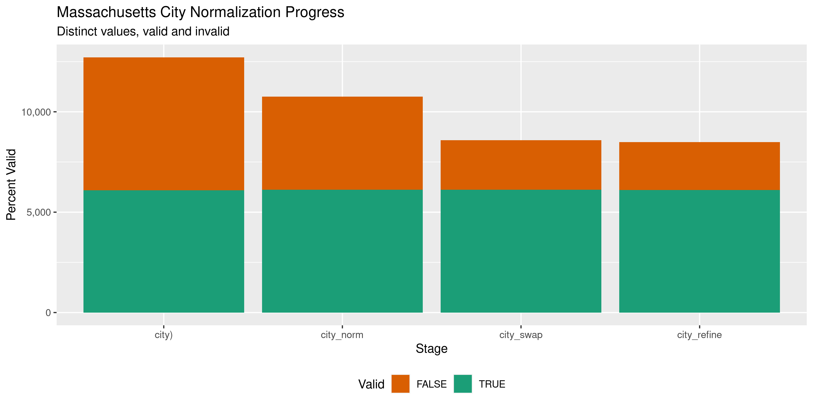

Massachusetts Contributions
================
Kiernan Nicholls
2020-02-11 14:16:29

  - [Project](#project)
  - [Objectives](#objectives)
  - [Packages](#packages)
  - [Data](#data)
  - [Import](#import)
  - [Explore](#explore)
  - [Wrangle](#wrangle)
  - [Conclude](#conclude)
  - [Export](#export)

<!-- Place comments regarding knitting here -->

## Project

The Accountability Project is an effort to cut across data silos and
give journalists, policy professionals, activists, and the public at
large a simple way to search across huge volumes of public data about
people and organizations.

Our goal is to standardizing public data on a few key fields by thinking
of each dataset row as a transaction. For each transaction there should
be (at least) 3 variables:

1.  All **parties** to a transaction.
2.  The **date** of the transaction.
3.  The **amount** of money involved.

## Objectives

This document describes the process used to complete the following
objectives:

1.  How many records are in the database?
2.  Check for entirely duplicated records.
3.  Check ranges of continuous variables.
4.  Is there anything blank or missing?
5.  Check for consistency issues.
6.  Create a five-digit ZIP Code called `zip`.
7.  Create a `year` field from the transaction date.
8.  Make sure there is data on both parties to a transaction.

## Packages

The following packages are needed to collect, manipulate, visualize,
analyze, and communicate these results. The `pacman` package will
facilitate their installation and attachment.

The IRW’s `campfin` package will also have to be installed from GitHub.
This package contains functions custom made to help facilitate the
processing of campaign finance data.

``` r
if (!require("pacman")) install.packages("pacman")
pacman::p_load_gh("irworkshop/campfin")
pacman::p_load(
  tidyverse, # data manipulation
  lubridate, # datetime strings
  magrittr, # pipe operators
  gluedown, # print markdown
  janitor, # dataframe clean
  refinr, # cluster and merge
  scales, # format strings
  knitr, # knit documents
  vroom, # read files fast
  glue, # combine strings
  here, # relative storage
  fs # search storage 
)
```

This document should be run as part of the `R_campfin` project, which
lives as a sub-directory of the more general, language-agnostic
[`irworkshop/accountability_datacleaning`](https://github.com/irworkshop/accountability_datacleaning)
GitHub repository.

The `R_campfin` project uses the [RStudio
projects](https://support.rstudio.com/hc/en-us/articles/200526207-Using-Projects)
feature and should be run as such. The project also uses the dynamic
`here::here()` tool for file paths relative to *your* machine.

``` r
# where does this document knit?
here::here()
#> [1] "/home/kiernan/Code/accountability_datacleaning/R_campfin"
```

## Data

Data is obtained from the Massachusetts \[Office of Campaign and
Political Finance (OCPF)\]\[<https://www.ocpf.us/>\].

> The Office of Campaign and Political Finance is an independent state
> agency that administers Massachusetts General Law
> [Chapter 55](https://www.ocpf.us/Legal/CampaignFinanceLaw) the
> campaign finance law, and
> [Chapter 55C](https://www.ocpf.us/Legal/PublicFinancingLaw), the
> limited public financing program for statewide candidates. Established
> in 1973, OCPF is the depository for disclosure reports filed by
> candidates and political committees under M.G.L. Chapter 55.

## Import

We can import data by downloading "" from the [OCPF Data Download
page](https://www.ocpf.us/Data).

### Download

The data is provided as an archived [Microsoft Access (MDB)
file](http://ocpf2.blob.core.windows.net/downloads/data/campaign-finance-reports.zip).
This file is updated nightly at 3:00am.

> Download a zipped Microsoft Access 2000 format (`.mdb`) database that
> includes report summaries, receipts, expenditures, in-kind
> contributions, liabilities, assets disposed, savings accounts, credit
> card reports, reimbursement reports and subvendor reports.

We can download this archive and extract the file to the
`ma/contribs/data/raw` directory.

``` r
raw_dir <- dir_create(here("ma", "contribs", "data", "raw"))
zip_url <- "http://ocpf2.blob.core.windows.net/downloads/data/campaign-finance-reports.zip"
zip_file <- url2path(zip_url, raw_dir) 
mdb_file <- if (!this_file_new(zip_file)) {
  download.file(zip_url, zip_file)
  unzip(zip_file, exdir = raw_dir)
} else {
  dir_ls(raw_dir, regexp = "mdb")
}
```

Using the `system2()` function, we can utilize the
[`mdbtools`](https://github.com/brianb/mdbtools) command line tool to
list the tables contained in the Access file. The `mdbtools` CLI program
is free, open-source, and can be downloaded on Linux systems using APT.

``` bash
sudo apt install mdbtools
```

``` r
mdb_tables <- system2("mdb-tables", args = mdb_file, stdout = TRUE)
mdb_tables <- str_split(str_trim(mdb_tables), "\\s")[[1]]
md_bullet(md_code(mdb_tables))
```

  - `vUPLOAD_MASTER`
  - `vUPLOAD_tCURRENT_ASSETS_DISPOSED`
  - `vUPLOAD_tCURRENT_BANK_CREDITS`
  - `vUPLOAD_tCURRENT_CPF9_DETAIL`
  - `vUPLOAD_tCURRENT_CPF9_SUMMARIES`
  - `vUPLOAD_tCURRENT_EXPENDITURES`
  - `vUPLOAD_tCURRENT_INKINDS`
  - `vUPLOAD_tCURRENT_LIABILITIES`
  - `vUPLOAD_tCURRENT_R1_DETAIL`
  - `vUPLOAD_tCURRENT_R1_SUMMARIES`
  - `vUPLOAD_tCURRENT_RECEIPTS`
  - `vUPLOAD_tCURRENT_SAVINGS`
  - `vUPLOAD_tCURRENT_SUBVENDOR_ITEMS`
  - `vUPLOAD_tCURRENT_SUBVENDOR_SUMMARIES`

### Read

The using `mdbtools` via `system2(stdout = TRUE)` write the database
table to a local CSV file which is then imported into R with
`readr::read_csv()`.

``` r
read_mdb <- function(file, table, ...) {
  out_file <- fs::path_temp(table)
  system2("mdb-export", c(file, table), stdout = out_file)
  readr::read_csv(out_file, ...)
}
```

We can use this method to first read the `UPLOAD_CURRENT_RECEIPTS` file,
which contains all contributions made to Massachusetts political
committees.

``` r
mac <- read_mdb(
  file = mdb_file,
  table = "vUPLOAD_tCURRENT_RECEIPTS",
  col_types = cols(
    .default = col_character(),
    Date = col_date(),
    Amount = col_double()
  )
)
```

    #>             used  (Mb) gc trigger   (Mb)  max used   (Mb)
    #> Ncells   9285005 495.9   19491885 1041.0   9468514  505.7
    #> Vcells 113801431 868.3  223694967 1706.7 217136381 1656.7

The records of the receipts file are provided to OCPF on reports,
identified by the `rpt_id` variable. The receipt records themselves do
not contain the information on the committee recipients of each
contribution. The information on the recieving committee are contained
in the `UPLOAD_MASTER` database. We can read that table using the same
method as above.

``` r
master <- read_mdb(
  file = mdb_file,
  table = "vUPLOAD_MASTER",
  col_types = cols(
    .default = col_character(),
    Amendment = col_logical(),
    Filing_Date = col_datetime("%m/%d/%y %H:%M:%S"),
    Report_Year = col_integer(),
    Beginning_Date = col_date(),
    Ending_Date = col_date()
  )
)
```

The records of this file contain the identifying information for the
recieving committees making each report. We can use
`dplyr::inner_join()` to join this table with the contributions table
along the `rpt_id` variable.

``` r
mac <- inner_join(mac, master, by = "rpt_id")
```

## Explore

``` r
head(mac)
#> # A tibble: 6 x 33
#>   id    rpt_id line  date       cont_type first last  address city  state zip   occupation employer
#>   <chr> <chr>  <chr> <date>     <chr>     <chr> <chr> <chr>   <chr> <chr> <chr> <chr>      <chr>   
#> 1 5358… 39     5358… 2002-01-02 Individu… E.A.  Drake PO Box… Bedf… MA    01730 <NA>       <NA>    
#> 2 5358… 39     5358… 2002-01-02 Individu… Jacq… Mich… 19 Gou… Bedf… MA    <NA>  <NA>       <NA>    
#> 3 5358… 39     5358… 2002-01-02 Individu… Suza… Beale 8 Aspe… Bedf… MA    <NA>  <NA>       <NA>    
#> 4 5358… 39     5358… 2002-01-02 Individu… Will… Beale 8 Aspe… Bedf… MA    <NA>  <NA>       <NA>    
#> 5 5358… 39     5358… 2002-01-02 Individu… Dave  Hema… 1 Heri… Bedf… MA    <NA>  <NA>       <NA>    
#> 6 5358… 39     5358… 2002-01-02 Individu… Trent Fish… 241 Le… Wobu… MA    01801 <NA>       <NA>    
#> # … with 20 more variables: officer <chr>, cont_id <chr>, amount <dbl>, tender <chr>, guid <chr>,
#> #   rpt_year <int>, filing_date <dttm>, start_date <date>, end_date <date>, cpf_id <chr>,
#> #   report_type <chr>, cand_name <chr>, office <chr>, district <chr>, comm_name <chr>,
#> #   comm_city <chr>, comm_state <chr>, comm_zip <chr>, category <chr>, amendment <lgl>
tail(mac)
#> # A tibble: 6 x 33
#>   id    rpt_id line  date       cont_type first last  address city  state zip   occupation employer
#>   <chr> <chr>  <chr> <date>     <chr>     <chr> <chr> <chr>   <chr> <chr> <chr> <chr>      <chr>   
#> 1 1368… 730809 1368… 2020-01-27 OTHER     <NA>  Shee… 32 Ste… Spri… MA    01104 <NA>       <NA>    
#> 2 1368… 730810 1368… 2020-02-10 Individu… Jess… Sizer 78 Pet… Palm… MA    01069 Town Coun… Town of…
#> 3 1368… 730811 1368… 2020-02-10 Individu… Maur… Glynn 8 Vide… Quin… MA    02169 Attorney/… Murphy …
#> 4 1368… 730811 1368… 2020-02-10 Individu… Will… Kenn… 1245 A… Bost… MA    02124 Attorney   Nutter,…
#> 5 1368… 730811 1368… 2020-02-10 Individu… Lorr… Ahern 3510 O… Pomp… FL    33069 Retired    Retired 
#> 6 1368… 730812 1368… 2020-02-06 Individu… Joan… Daup… 8 Shre… Nort… MA    01536 Retired    Retired 
#> # … with 20 more variables: officer <chr>, cont_id <chr>, amount <dbl>, tender <chr>, guid <chr>,
#> #   rpt_year <int>, filing_date <dttm>, start_date <date>, end_date <date>, cpf_id <chr>,
#> #   report_type <chr>, cand_name <chr>, office <chr>, district <chr>, comm_name <chr>,
#> #   comm_city <chr>, comm_state <chr>, comm_zip <chr>, category <chr>, amendment <lgl>
glimpse(sample_n(mac, 20))
#> Observations: 20
#> Variables: 33
#> $ id          <chr> "5525050", "6720886", "12605049", "9037819", "5608601", "7461888", "12059493…
#> $ rpt_id      <chr> "10275", "68960", "661683", "208741", "14950", "109030", "611669", "188874",…
#> $ line        <chr> "5525050", "6720886", "12605049", "9037819", "5608601", "7461888", "12059493…
#> $ date        <date> 2002-10-24, 2006-09-13, 2018-07-09, 2014-09-20, 2002-09-04, 2010-03-11, 201…
#> $ cont_type   <chr> "OTHER", "Individual", "Individual", "Individual", "Individual", "Individual…
#> $ first       <chr> "SEIU Loc 509 Seg", "RICHARD", "Brian", "Jonathan", "Richard", "KWABENA", "S…
#> $ last        <chr> "Union", "WAITT", "Cady", "Howe", "Battin", "ABBOA OFFEI", "Tocco", "Sweeney…
#> $ address     <chr> "Post Office Box 509", "3 BUTTERWORTH RD", "50 Atherton St", "159 South Main…
#> $ city        <chr> "Cambridge", "Wilmington", "Roxbury", "Milford", "Lexington", "BOSTON", "Bos…
#> $ state       <chr> "MA", "MA", "MA", "MA", "MA", "MA", "MA", "MA", "MA", "MA", "MA", "MA", "MA"…
#> $ zip         <chr> "02139", "01887-3841", "02118", "01757", "02421", "02111-2725", "02113-2114"…
#> $ occupation  <chr> "Union Segregated Fund", "CIVIL ENGINEER", NA, "corrections officer", "senio…
#> $ employer    <chr> "-------------", "INFO REQ", NA, "Massachusetts Dept of Corrections", "MIT",…
#> $ officer     <chr> NA, NA, NA, NA, NA, NA, NA, NA, NA, NA, NA, NA, NA, NA, NA, NA, NA, NA, NA, …
#> $ cont_id     <chr> NA, NA, NA, NA, NA, NA, NA, NA, NA, NA, NA, NA, NA, NA, NA, NA, NA, NA, NA, …
#> $ amount      <dbl> 15000.0, 250.0, 75.0, 5.0, 30.0, 400.0, 200.0, 100.0, 100.0, 150.0, 100.0, 7…
#> $ tender      <chr> "Check", "Check", "Check", "Unknown", "Check", "Check", "Unknown", "Unknown"…
#> $ guid        <chr> "{c0dd1523-6227-4b2d-559e-1f456763f279}", "{f9605602-5b0d-4f14-79ad-2a610c95…
#> $ rpt_year    <int> 2002, 2006, 2018, 2014, 2002, 2010, 2016, 2013, 2012, 2011, 2013, 2020, 2013…
#> $ filing_date <dttm> 2002-11-05 12:49:38, 2007-09-04 11:47:27, 2018-07-10 10:01:26, 2014-10-27 1…
#> $ start_date  <date> NA, NA, NA, 2014-08-23, NA, NA, 2016-01-01, 2013-07-01, NA, 2011-07-01, NA,…
#> $ end_date    <date> 2002-10-24, 2006-09-13, 2018-07-09, 2014-10-17, 2002-09-04, 2010-03-11, 201…
#> $ cpf_id      <chr> "30914", "14376", "17006", "80690", "13821", "14376", "11853", "14191", "130…
#> $ report_type <chr> "Deposit Report", "Deposit Report", "Deposit Report", "Pre-election Report (…
#> $ cand_name   <chr> "Shannon P. O'Brien", "Deval L. Patrick", "Edward J. Stamas", "MA Correction…
#> $ office      <chr> "Constitutional", "Constitutional", "Statewide", "Unknown/ N/A", "Constituti…
#> $ district    <chr> "Governor", "Governor", "Auditor", "Unknown/ N/A", "Governor", "Governor", "…
#> $ comm_name   <chr> "The Shannon O'Brien Committee", "The Deval Patrick Committee", "Stamas Comm…
#> $ comm_city   <chr> NA, NA, "North Amherst", "Milford", NA, NA, "Boston", "W. Springfield", NA, …
#> $ comm_state  <chr> NA, NA, "MA", "MA", NA, NA, "MA", "MA", NA, "MA", NA, "MA", "MA", "MA", "MA"…
#> $ comm_zip    <chr> NA, NA, "01059", "01757", NA, NA, "02137", "01090", NA, "01095", NA, "01748"…
#> $ category    <chr> "D", "D", "D", "P", "D", "D", "N", "N", "D", "N", "D", "P", "P", "D", "N", "…
#> $ amendment   <lgl> FALSE, TRUE, FALSE, FALSE, TRUE, FALSE, TRUE, FALSE, FALSE, FALSE, FALSE, FA…
```

### Missing

We should flag any records missing one of the key variables needed to
properly identify a unique contribution.

``` r
col_stats(mac, count_na)
#> # A tibble: 33 x 4
#>    col         class        n           p
#>    <chr>       <chr>    <int>       <dbl>
#>  1 id          <chr>        0 0          
#>  2 rpt_id      <chr>        0 0          
#>  3 line        <chr>        0 0          
#>  4 date        <date>       0 0          
#>  5 cont_type   <chr>        0 0          
#>  6 first       <chr>   211806 0.0657     
#>  7 last        <chr>    34917 0.0108     
#>  8 address     <chr>   120383 0.0374     
#>  9 city        <chr>   102329 0.0318     
#> 10 state       <chr>    57470 0.0178     
#> 11 zip         <chr>   143084 0.0444     
#> 12 occupation  <chr>  1385557 0.430      
#> 13 employer    <chr>  1395998 0.433      
#> 14 officer     <chr>  3195114 0.991      
#> 15 cont_id     <chr>  3130464 0.971      
#> 16 amount      <dbl>        0 0          
#> 17 tender      <chr>        0 0          
#> 18 guid        <chr>        0 0          
#> 19 rpt_year    <int>        0 0          
#> 20 filing_date <dttm>       0 0          
#> 21 start_date  <date> 1763317 0.547      
#> 22 end_date    <date>       0 0          
#> 23 cpf_id      <chr>        0 0          
#> 24 report_type <chr>        0 0          
#> 25 cand_name   <chr>        1 0.000000310
#> 26 office      <chr>      206 0.0000639  
#> 27 district    <chr>      206 0.0000639  
#> 28 comm_name   <chr>    87674 0.0272     
#> 29 comm_city   <chr>   913803 0.284      
#> 30 comm_state  <chr>   914037 0.284      
#> 31 comm_zip    <chr>   913887 0.284      
#> 32 category    <chr>        0 0          
#> 33 amendment   <lgl>        0 0
```

We can first `dplyr::coalesce()` the contributor and recipient variables
to only flag records missing *any* kind of name.

``` r
mac <- mac %>% 
  mutate(
    contrib_any = coalesce(first, last),
    recip_any = coalesce(comm_name, cand_name)
  ) %>% 
  flag_na(contrib_any, recip_any, date, amount)
```

The only variable missing from theses columns is the coalesced
contributor name.

``` r
mac %>% 
  filter(na_flag) %>% 
  select(contrib_any, recip_any, date, amount) %>% 
  col_stats(count_na)
#> # A tibble: 4 x 4
#>   col         class      n     p
#>   <chr>       <chr>  <int> <dbl>
#> 1 contrib_any <chr>  32370     1
#> 2 recip_any   <chr>      0     0
#> 3 date        <date>     0     0
#> 4 amount      <dbl>      0     0
```

For all records with a `cont_type` of “OTHER”, there is no given
contributor name. We can remove these flags.

``` r
prop_na(mac$contrib_any[which(mac$cont_type != "OTHER")])
#> [1] 0.0003695842
prop_na(mac$contrib_any[which(mac$cont_type == "OTHER")])
#> [1] 0.3200422
mac$na_flag[which(mac$cont_type == "OTHER")] <- FALSE
# very few remain
percent(mean(mac$na_flag), accuracy = 0.01)
#> [1] "0.04%"
```

### Duplicates

On a more powerful computer, we could also flag duplicate rows.

``` r
mac <- flag_dupes(mac, -id, -line, -guid, )
percent(mean(mac$dupe_flag), accuracy = 0.1)
```

``` r
mac %>%
  filter(dupe_flag) %>%
  select(date, last, amount, committee)
```

### Categorical

``` r
col_stats(mac, n_distinct)
#> # A tibble: 36 x 4
#>    col         class        n           p
#>    <chr>       <chr>    <int>       <dbl>
#>  1 id          <chr>  3222668 1          
#>  2 rpt_id      <chr>   149625 0.0464     
#>  3 line        <chr>  3222668 1          
#>  4 date        <date>    6954 0.00216    
#>  5 cont_type   <chr>        3 0.000000931
#>  6 first       <chr>   115052 0.0357     
#>  7 last        <chr>   237565 0.0737     
#>  8 address     <chr>   887175 0.275      
#>  9 city        <chr>    15797 0.00490    
#> 10 state       <chr>      303 0.0000940  
#> 11 zip         <chr>   128856 0.0400     
#> 12 occupation  <chr>    87004 0.0270     
#> 13 employer    <chr>   264298 0.0820     
#> 14 officer     <chr>     7568 0.00235    
#> 15 cont_id     <chr>     6770 0.00210    
#> 16 amount      <dbl>    30345 0.00942    
#> 17 tender      <chr>        8 0.00000248 
#> 18 guid        <chr>  3219417 0.999      
#> 19 rpt_year    <int>       24 0.00000745 
#> 20 filing_date <dttm>  149551 0.0464     
#> 21 start_date  <date>    1555 0.000483   
#> 22 end_date    <date>    6178 0.00192    
#> 23 cpf_id      <chr>     4311 0.00134    
#> 24 report_type <chr>       72 0.0000223  
#> 25 cand_name   <chr>     4529 0.00141    
#> 26 office      <chr>       59 0.0000183  
#> 27 district    <chr>      325 0.000101   
#> 28 comm_name   <chr>     5791 0.00180    
#> 29 comm_city   <chr>      689 0.000214   
#> 30 comm_state  <chr>       33 0.0000102  
#> 31 comm_zip    <chr>      891 0.000276   
#> 32 category    <chr>        8 0.00000248 
#> 33 amendment   <lgl>        2 0.000000621
#> 34 contrib_any <chr>   156101 0.0484     
#> 35 recip_any   <chr>     5962 0.00185    
#> 36 na_flag     <lgl>        2 0.000000621
```

<!-- -->

<!-- -->

<!-- -->

<!-- -->

<!-- -->

### Continuous

#### Amounts

``` r
summary(mac$amount)
#>     Min.  1st Qu.   Median     Mean  3rd Qu.     Max. 
#>   -94729       26      100      387      200 12588840
mean(mac$amount <= 0)
#> [1] 0.007535682
```

<!-- -->

#### Dates

The actual year a contribution was made sometimes differs from the year
in which it was reported. The later is identified int eh `rpt_year`
variable but we will create a new `year` variable from `date` using
`lubridate::year()`. This will more accurately identify the
contribution.

``` r
mac <- mutate(mac, year = year(date))
```

``` r
mac %>%
  count(year) %>%
  mutate(even = is_even(year)) %>% 
  ggplot(aes(x = year, y = n)) +
  geom_col(aes(fill = even)) +
  coord_cartesian(xlim = c(2000, 2020)) +
  scale_fill_brewer(palette = "Dark2") +
  scale_x_continuous(breaks = seq(2000, 2020, by = 2)) +
  theme(legend.position = "bottom") +
  labs(
    title = "Massachusetts Contributions by Year",
    caption = "Source: MA OCPF",
    fill = "Election Year",
    x = "Amount",
    y = "Count"
  )
```

<!-- -->

<!-- -->

``` r
min(mac$date)
#> [1] "1916-07-05"
sum(mac$year < 2001)
#> [1] 4
max(mac$date)
#> [1] "2097-05-24"
sum(mac$date > today())
#> [1] 9
```

``` r
mac %>%
  count(year) %>%
  mutate(even = is_even(year)) %>%
  ggplot(aes(x = year, y = n)) +
  geom_col(aes(fill = even)) +
  scale_fill_brewer(palette = "Dark2") +
  scale_y_continuous(labels = comma) +
  scale_x_continuous(breaks = seq(2000, 2020, by = 2)) +
  theme(legend.position = "bottom") +
  labs(
    title = "Massachusetts Contributions by Year",
    caption = "Source: MA OCPF",
    fill = "Election Year",
    x = "Year Made",
    y = "Count"
  )
```

<!-- -->

## Wrangle

To improve the searchability of the database, we will perform some
consistent, confident string normalization. For geographic variables
like city names and ZIP codes, the corresponding `campfin::normal_*()`
functions are taylor made to facilitate this process.

### Address

For the street `addresss` variable, the `campfin::normal_address()`
function will force consistence case, remove punctuation, and abbreviate
official USPS suffixes.

``` r
mac <- mac %>%
  mutate(
    address_norm = normal_address(
      address = address,
      abbs = usps_street,
      na_rep = TRUE
    )
  )
```

``` r
mac %>%
  select(contains("address")) %>%
  distinct() %>%
  sample_n(10)
#> # A tibble: 10 x 2
#>    address                         address_norm              
#>    <chr>                           <chr>                     
#>  1 17820 Tipton Ave.               17820 TIPTON AVE          
#>  2 62 Lake Street                  62 LK ST                  
#>  3 1 PELICAN REACH                 1 PELICAN REACH           
#>  4 24 Lochstead Avenue             24 LOCHSTEAD AVE          
#>  5 20 Marks Rd.                    20 MARKS RD               
#>  6 92 Barberry Drive               92 BARBERRY DR            
#>  7 76 Empire St., #1               76 EMPIRE ST 1            
#>  8 160 W. Brookline St. #1         160 W BROOKLINE ST 1      
#>  9 30 Rockfeller Plaza, 31st Floor 30 ROCKFELLER PLZ 31 ST FL
#> 10 114 MOTT STREET 1ST FL          114 MOTT ST 1 ST FL
```

### ZIP

For ZIP codes, the `campfin::normal_zip()` function will attempt to
create valied *five* digit codes by removing the ZIP+4 suffix and
returning leading zeroes dropped by other programs like Microsoft Excel.

``` r
mac <- mac %>%
  mutate(
    zip_norm = normal_zip(
      zip = zip,
      na_rep = TRUE
    )
  )
```

``` r
progress_table(
  mac$zip,
  mac$zip_norm,
  compare = valid_zip
)
#> # A tibble: 2 x 6
#>   stage    prop_in n_distinct prop_na  n_out n_diff
#>   <chr>      <dbl>      <dbl>   <dbl>  <dbl>  <dbl>
#> 1 zip        0.861     128856  0.0444 426777 117358
#> 2 zip_norm   0.999      13737  0.0445   4490   1565
```

### State

Valid two digit state abbreviations can be made using the
`campfin::normal_state()` function.

``` r
mac <- mac %>%
  mutate(
    state_norm = normal_state(
      state = state,
      abbreviate = TRUE,
      na_rep = TRUE,
      valid = NULL
    )
  )
```

``` r
mac %>%
  filter(state != state_norm) %>%
  count(state, sort = TRUE)
#> # A tibble: 126 x 2
#>    state     n
#>    <chr> <int>
#>  1 ma     2047
#>  2 Ma     1674
#>  3 nh      211
#>  4 ri      165
#>  5 ct      163
#>  6 Fl      146
#>  7 ny      116
#>  8 ca      105
#>  9 Ca       89
#> 10 fl       78
#> # … with 116 more rows
```

``` r
progress_table(
  mac$state,
  mac$state_norm,
  compare = valid_state
)
#> # A tibble: 2 x 6
#>   stage      prop_in n_distinct prop_na n_out n_diff
#>   <chr>        <dbl>      <dbl>   <dbl> <dbl>  <dbl>
#> 1 state        0.998        303  0.0178  6043    241
#> 2 state_norm   1.00         171  0.0179   433    110
```

### City

Cities are the most difficult geographic variable to normalize, simply
due to the wide variety of valid cities and formats.

#### Normal

The `campfin::normal_city()` function is a good start, again converting
case, removing punctuation, but *expanding* USPS abbreviations. We can
also remove `invalid_city` values.

``` r
mac <- mac %>%
  mutate(
    city_norm = normal_city(
      city = city,
      abbs = usps_city,
      states = c("MA", "DC", "MASSACHUSETTS"),
      na = invalid_city,
      na_rep = TRUE
    )
  )
```

#### Swap

We can further improve normalization by comparing our normalized value
agaist the *expected* value for that record’s state abbreviation and ZIP
code. If the normalized value is either an abbreviation for or very
similar to the expected value, we can confidently swap those two.

``` r
mac <- mac %>%
  rename(city_raw = city) %>%
  left_join(
    y = zipcodes,
    by = c(
      "state_norm" = "state",
      "zip_norm" = "zip"
    )
  ) %>%
  rename(city_match = city) %>%
  mutate(
    match_abb = is_abbrev(city_norm, city_match),
    match_dist = str_dist(city_norm, city_match),
    city_swap = if_else(
      condition = !is.na(match_dist) & match_abb | match_dist == 1,
      true = city_match,
      false = city_norm
    )
  ) %>%
  select(
    -city_match,
    -match_dist,
    -match_abb
  )
```

#### Refine

The \[OpenRefine\] algorithms can be used to group similar strings and
replace the less common versions with their most common counterpart.
This can greatly reduce inconsistency, but with low confidence; we will
only keep any refined strings that have a valid city/state/zip
combination.

``` r
good_refine <- mac %>%
  mutate(
    city_refine = city_swap %>%
      key_collision_merge() %>%
      n_gram_merge(numgram = 1)
  ) %>%
  filter(city_refine != city_swap) %>%
  inner_join(
    y = zipcodes,
    by = c(
      "city_refine" = "city",
      "state_norm" = "state",
      "zip_norm" = "zip"
    )
  ) %>% 
  select(
    id, 
    city_swap, 
    city_refine
  )
```

    #> # A tibble: 106 x 3
    #>    city_swap         city_refine         n
    #>    <chr>             <chr>           <int>
    #>  1 SO BOSTON         BOSTON            284
    #>  2 LITTLETON COMPTON LITTLE COMPTON     18
    #>  3 NO DARTHMOUTH     NORTH DARTMOUTH    17
    #>  4 CINCINATTI        CINCINNATI         15
    #>  5 NEW YORK NY       NEW YORK            8
    #>  6 NORTH HAMPTON     NORTHAMPTON         6
    #>  7 SAN FRANSICO      SAN FRANCISCO       6
    #>  8 CENTER FALLS      CENTRAL FALLS       4
    #>  9 MARRIETA          MARIETTA            4
    #> 10 MARSHFIELD HILLS  MARSHFIELD          4
    #> # … with 96 more rows

Then we can join the refined values back to the database.

``` r
mac <- mac %>%
  left_join(good_refine) %>%
  mutate(city_refine = coalesce(city_refine, city_swap))
```

#### Progress

| stage        | prop\_in | n\_distinct | prop\_na | n\_out | n\_diff |
| :----------- | -------: | ----------: | -------: | -----: | ------: |
| city\_raw)   |    0.983 |       11530 |    0.032 |  52397 |    5532 |
| city\_norm   |    0.984 |       10536 |    0.032 |  49183 |    4593 |
| city\_swap   |    0.993 |        7136 |    0.050 |  22812 |    1221 |
| city\_refine |    0.993 |        7035 |    0.050 |  22337 |    1121 |

You can see how the percentage of valid values increased with each
stage.

<!-- -->

More importantly, the number of distinct values decreased each stage. We
were able to confidently change many distinct invalid values to their
valid equivalent.

``` r
progress %>%
  select(
    stage,
    all = n_distinct,
    bad = n_diff
  ) %>%
  mutate(good = all - bad) %>%
  pivot_longer(c("good", "bad")) %>%
  mutate(name = name == "good") %>%
  ggplot(aes(x = stage, y = value)) +
  geom_col(aes(fill = name)) +
  scale_fill_brewer(palette = "Dark2", direction = -1) +
  scale_y_continuous(labels = comma) +
  theme(legend.position = "bottom") +
  labs(
    title = "Massachusetts City Normalization Progress",
    subtitle = "Distinct values, valid and invalid",
    x = "Stage",
    y = "Percent Valid",
    fill = "Valid"
  )
```

<!-- -->

## Conclude

``` r
mac <- mac %>% 
  select(
    -city_norm,
    -city_swap,
    city_clean = city_refine
  ) %>% 
  rename_all(~str_replace(., "_norm", "_clean"))
```

``` r
glimpse(sample_n(mac, 20))
#> Observations: 20
#> Variables: 41
#> $ id            <chr> "7183828", "11825679", "7986405", "6406880", "5595184", "8791761", "574841…
#> $ rpt_id        <chr> "96127", "593426", "135568", "52239", "14087", "193993", "19760", "721064"…
#> $ line          <chr> "7183828", "11825679", "7986405", "6406880", "5595184", "8791761", "574841…
#> $ date          <date> 2008-02-29, 2016-12-07, 2010-08-27, 2006-07-20, 2002-09-10, 2014-04-11, 2…
#> $ cont_type     <chr> "Individual", "Individual", "Individual", "Individual", "Individual", "Ind…
#> $ first         <chr> "FRANCIS X", "Annalisa M", "Vivian", "James", "Mary Ellen", "Jody", "Jenni…
#> $ last          <chr> "BELLOTTI", "Piroli", "Mann", "Abreu", "Grossman", "Trunfio", "Hunt", "Ngu…
#> $ address       <chr> "120 HILLSIDE AVE", "177 FRANKLIN ST", "109 Broad Street, no. 506", "57 Ho…
#> $ city_raw      <chr> "WOLLASTON", "QUINCY", "Weymouth", "Fall River", "Waban", "Salem", "Marlbo…
#> $ state         <chr> "MA", "MA", "MA", "MA", "MA", "MA", "MA", "MA", "MA", "MA", "MA", "MA", "M…
#> $ zip           <chr> "02170", "02169", "02188", "02723", "02468", "01970-1030", "01752", "02189…
#> $ occupation    <chr> "LOBBYIST", "SERVICE REPRESENTATIVE", NA, "Social Worker", "Treasurer", "E…
#> $ employer      <chr> "LOBBYIST", "Verizon New England Inc.", NA, "Dept. Mental Health", "MassEn…
#> $ officer       <chr> NA, NA, NA, NA, NA, NA, NA, NA, NA, NA, NA, NA, NA, NA, NA, NA, NA, NA, NA…
#> $ cont_id       <chr> NA, NA, NA, NA, NA, NA, NA, NA, NA, NA, NA, NA, NA, NA, NA, NA, NA, NA, NA…
#> $ amount        <dbl> 100.0, 1.0, 25.0, 200.0, 250.0, 250.0, 100.0, 2.0, 250.0, 25.0, 100.0, 500…
#> $ tender        <chr> "Unknown", "Check", "Unknown", "Unknown", "Unknown", "Check", "Unknown", "…
#> $ guid          <chr> "{8e8599fa-3bb6-4093-d287-4f7c60389958}", "{8d90f004-b7bc-e611-e280-030050…
#> $ rpt_year      <int> 2008, 2016, 2010, 2006, 2002, 2014, 2004, 2019, 2017, 2010, 2017, 2010, 20…
#> $ filing_date   <dttm> 2009-06-26 14:59:36, 2016-12-07 15:00:00, 2011-05-31 12:49:05, 2006-09-08…
#> $ start_date    <date> 2008-01-01, NA, 2010-01-01, 2006-01-01, 2002-08-31, NA, 2004-01-01, NA, N…
#> $ end_date      <date> 2008-08-29, 2016-12-07, 2010-08-27, 2006-09-01, 2002-10-18, 2014-04-11, 2…
#> $ cpf_id        <chr> "13651", "80530", "11677", "10106", "12530", "13182", "13065", "80224", "1…
#> $ report_type   <chr> "Pre-primary Report (ND)", "Deposit Report", "Pre-primary Report (ND)", "P…
#> $ cand_name     <chr> "Paul J. Donato", "Int'l Brotherhood of Electrical Workers Local Union 222…
#> $ office        <chr> "House", "N/A", "Senate", "House", "House", "Statewide", "House", "N/A", "…
#> $ district      <chr> "35th Middlesex", "No office", "Plymouth & Norfolk", "7th Bristol", "8th S…
#> $ comm_name     <chr> "Donato Committee", "Int'l Brotherhood of Electrical Workers Local Union 2…
#> $ comm_city     <chr> "Medford", "Dorchester", "Hingham", "Fall River", "Boston", NA, "Marlborou…
#> $ comm_state    <chr> "MA", "MA", "MA", "MA", "MA", NA, "MA", "MA", "MA", NA, "MA", NA, "NY", "M…
#> $ comm_zip      <chr> "02155", "02124", "02043", "02724", "02101", NA, "01752", "01752", "02466"…
#> $ category      <chr> "N", "P", "N", "N", "N", "D", "N", "P", "D", "D", "N", "D", "P", "N", "N",…
#> $ amendment     <lgl> TRUE, FALSE, TRUE, FALSE, TRUE, FALSE, TRUE, FALSE, FALSE, FALSE, TRUE, TR…
#> $ contrib_any   <chr> "FRANCIS X", "Annalisa M", "Vivian", "James", "Mary Ellen", "Jody", "Jenni…
#> $ recip_any     <chr> "Donato Committee", "Int'l Brotherhood of Electrical Workers Local Union 2…
#> $ na_flag       <lgl> FALSE, FALSE, FALSE, FALSE, FALSE, FALSE, FALSE, FALSE, FALSE, FALSE, FALS…
#> $ year          <dbl> 2008, 2016, 2010, 2006, 2002, 2014, 2004, 2019, 2017, 2010, 2017, 2010, 20…
#> $ address_clean <chr> "120 HILLSIDE AVE", "177 FRANKLIN ST", "109 BROAD ST NO 506", "57 HORTON S…
#> $ zip_clean     <chr> "02170", "02169", "02188", "02723", "02468", "01970", "01752", "02189", "0…
#> $ state_clean   <chr> "MA", "MA", "MA", "MA", "MA", "MA", "MA", "MA", "MA", "MA", "MA", "MA", "M…
#> $ city_clean    <chr> "WOLLASTON", "QUINCY", "WEYMOUTH", "FALL RIVER", "WABAN", "SALEM", "MARLBO…
```

1.  There are 3,222,668 records in the database.
2.  There are 0 duplicate records in the database.
3.  The range and distribution of `amount` and `date` seem reasonable.
4.  There are 1,155 records missing either recipient or date.
5.  Consistency in goegraphic data has been improved with
    `campfin::normal_*()`.
6.  The 4-digit `year` variable has been created with
    `lubridate::year()`.

## Export

``` r
clean_dir <- dir_create(here("ma", "contribs", "data", "clean"))
```

``` r
write_csv(
  x = mac,
  path = path(clean_dir, "ma_contribs_clean.csv"),
  na = ""
)
```
