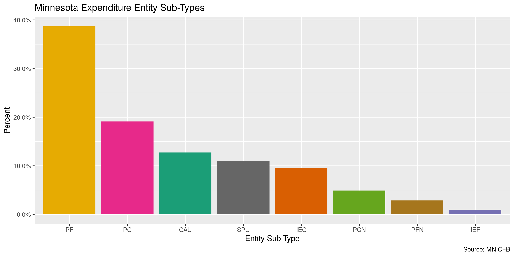
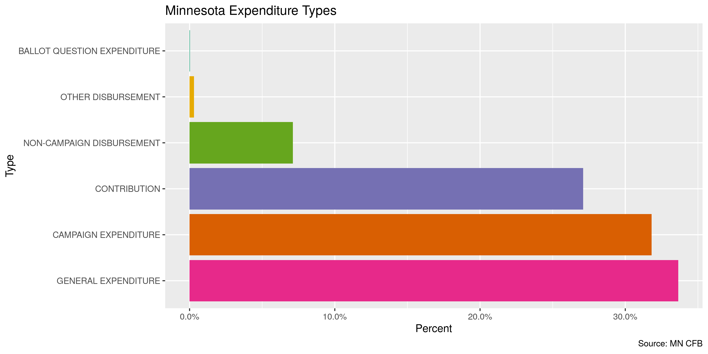
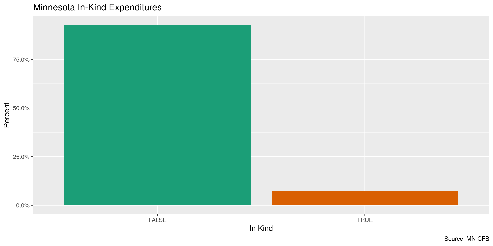
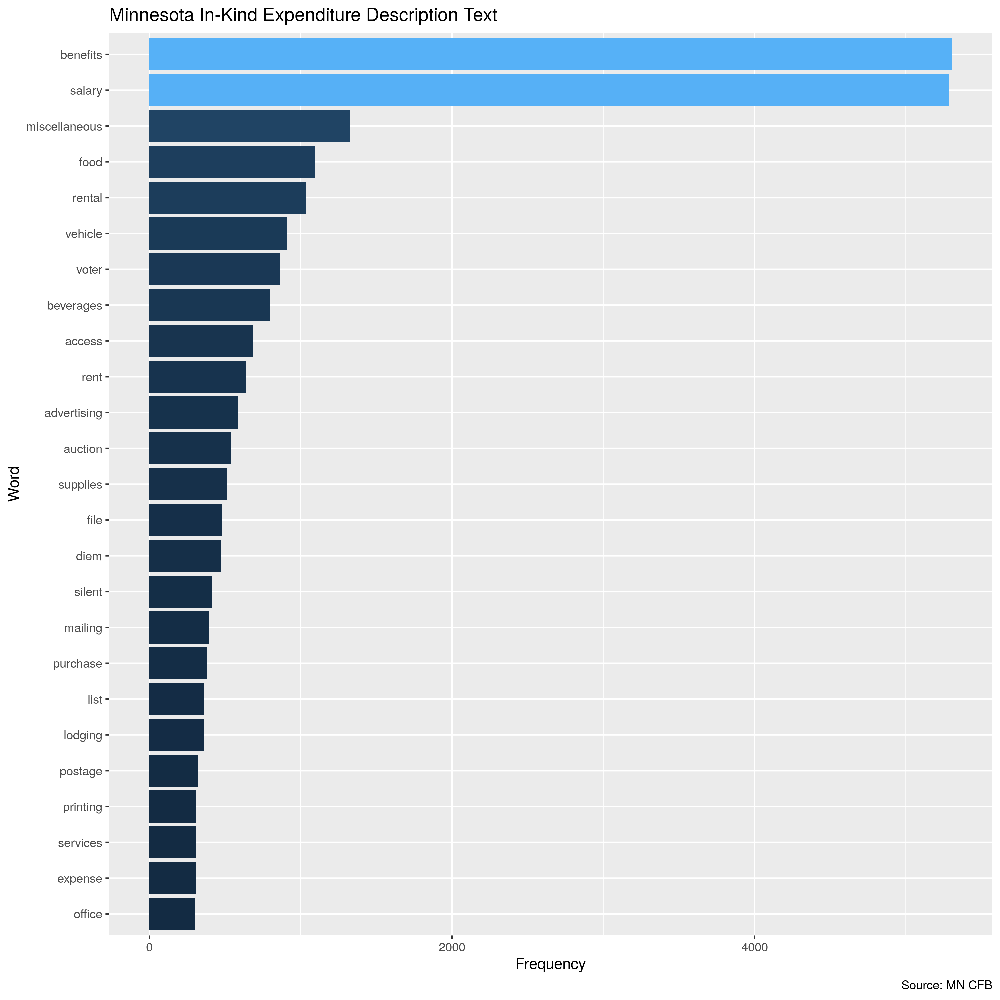
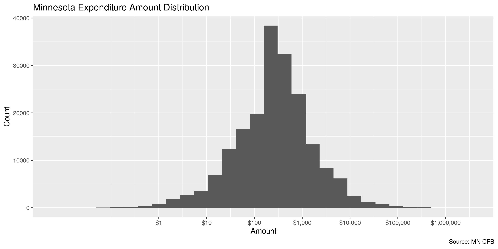
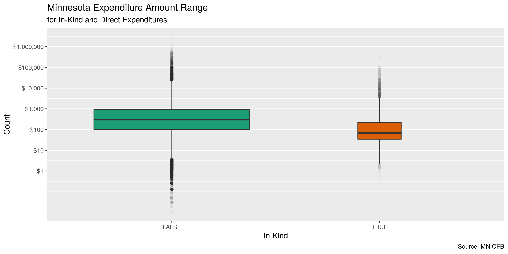

State Data
================
First Last
2019-08-07 12:03:10

  - [Project](#project)
  - [Objectives](#objectives)
  - [Packages](#packages)
  - [Data](#data)
  - [Import](#import)
  - [Explore](#explore)
  - [Wrangle](#wrangle)
  - [Conclude](#conclude)
  - [Export](#export)

## Project

The Accountability Project is an effort to cut across data silos and
give journalists, policy professionals, activists, and the public at
large a simple way to search across huge volumes of public data about
people and organizations.

Our goal is to standardizing public data on a few key fields by thinking
of each dataset row as a transaction. For each transaction there should
be (at least) 3 variables:

1.  All **parties** to a transaction
2.  The **date** of the transaction
3.  The **amount** of money involved

## Objectives

This document describes the process used to complete the following
objectives:

1.  How many records are in the database?
2.  Check for duplicates
3.  Check ranges
4.  Is there anything blank or missing?
5.  Check for consistency issues
6.  Create a five-digit ZIP Code called `ZIP5`
7.  Create a `YEAR` field from the transaction date
8.  Make sure there is data on both parties to a transaction

## Packages

The following packages are needed to collect, manipulate, visualize,
analyze, and communicate these results. The `pacman` package will
facilitate their installation and attachment.

The IRW’s `campfin` package will also have to be installed from GitHub.
This package contains functions custom made to help facilitate the
processing of campaign finance data.

``` r
if (!require("pacman")) install.packages("pacman")
pacman::p_load_current_gh("kiernann/campfin")
pacman::p_load(
  stringdist, # levenshtein value
  tidyverse, # data manipulation
  lubridate, # datetime strings
  magrittr, # pipe opperators
  tidytext, # text analysis
  janitor, # dataframe clean
  batman, # parse logical
  refinr, # cluster and merge
  scales, # format strings
  rvest, # read html files
  knitr, # knit documents
  vroom, # read files fast
  glue, # combine strings
  here, # relative storage
  fs # search storage 
)
```

This document should be run as part of the `R_campfin` project, which
lives as a sub-directory of the more general, language-agnostic
[`irworkshop/accountability_datacleaning`](https://github.com/irworkshop/accountability_datacleaning "TAP repo")
GitHub repository.

The `R_campfin` project uses the [RStudio
projects](https://support.rstudio.com/hc/en-us/articles/200526207-Using-Projects "Rproj")
feature and should be run as such. The project also uses the dynamic
`here::here()` tool for file paths relative to *your* machine.

``` r
# where does this document knit?
here::here()
#> [1] "/home/ubuntu/R/accountability_datacleaning/R_campfin"
```

## Data

Data is obtained from the [Minnestoa Campaign Finance Board
(CFB)](https://cfb.mn.gov/ "cfb_home").

The [CFB’s
mission](https://cfb.mn.gov/citizen-resources/the-board/more-about-the-board/mission/ "cfb_mission")
is to regulating [campaign
finance](https://cfb.mn.gov/citizen-resources/board-programs/overview/campaign-finance/ "cfb_cf"),
among other things.

> The Campaign Finance and Public Disclosure Board was established by
> the state legislature in 1974 and is charged with the administration
> of Minnesota Statutes, Chapter 10A, the Campaign Finance and Public
> Disclosure Act, as well as portions of Chapter 211B, the Fair Campaign
> Practices act.

> The Board’s mission is to promote public confidence in state
> government decision-making through development, administration, and
> enforcement of disclosure and public financing programs which will
> ensure public access to and understanding of information filed with
> the Board.

> The Board is responsible for administration of statutes governing the
> financial operations of associations that seek to influence Minnesota
> state elections. The Board’s jurisdiction is established by Minnesota
> Statutes Chapter 10A. The Board does not have jurisdiction over
> federal elections, which are regulated by the Federal Election
> Commission, nor does the Board have jurisdiction over local elections.

We can go to the Minnesota Statutes, Chapter 10A, to see the exact scope
of the data collection we will be wrangling.

> [Subd. 9. Campaign
> expenditure](https://www.revisor.mn.gov/statutes/cite/10A.01#stat.10A.01.9 "mn_10a.1.9").
> “Campaign expenditure” or “expenditure” means a purchase or payment of
> money or anything of value, or an advance of credit, made or incurred
> for the purpose of influencing the nomination or election of a
> candidate or for the purpose of promoting or defeating a ballot
> question. An expenditure is considered to be made in the year in which
> the candidate made the purchase of goods or services or incurred an
> obligation to pay for goods or services. An expenditure made for the
> purpose of defeating a candidate is considered made for the purpose of
> influencing the nomination or election of that candidate or any
> opponent of that candidate… “Expenditure” does not include:  
> (1) noncampaign disbursements as defined in subdivision 26;  
> (2) services provided without compensation by an individual
> volunteering personal time on behalf of a candidate, ballot question,
> political committee, political fund, principal campaign committee, or
> party unit;  
> (3) the publishing or broadcasting of news items or editorial comments
> by the news media; or  
> (4) an individual’s unreimbursed personal use of an automobile owned
> by the individual and used by the individual while volunteering
> personal time.

On the CFB [Self-Help Data Download
page](https://cfb.mn.gov/reports-and-data/self-help/data-downloads/campaign-finance/ "cf_dl"),
there are three types of files listed:

1.  Contributions received
2.  Expenditures and contributions made
3.  Independent expenditures

For each type of file, there is a table listing the 8 types of files
that can be downloaded. Here is the table for Expenditures and
contributions made:

| Download Name                                | Data Included                                                                                                                          | Download Data                                                                                                   |
| :------------------------------------------- | :------------------------------------------------------------------------------------------------------------------------------------- | :-------------------------------------------------------------------------------------------------------------- |
| All                                          | Expenditures, including contributions made, by all entities - 2009 to present                                                          | [Download](https://cfb.mn.gov/reports-and-data/self-help/data-downloads/campaign-finance/?download=-1890073264) |
| Candidates                                   | Expenditures, including contributions made, by all candidates - 2009 to present                                                        | [Download](https://cfb.mn.gov/reports-and-data/self-help/data-downloads/campaign-finance/?download=-1315784544) |
| Party units                                  | Expenditures, including contributions made, by all party units - 2009 to present                                                       | [Download](https://cfb.mn.gov/reports-and-data/self-help/data-downloads/campaign-finance/?download=452957533)   |
| State party units                            | Expenditures, including contributions made, by state party units - 2009 to present                                                     | [Download](https://cfb.mn.gov/reports-and-data/self-help/data-downloads/campaign-finance/?download=-897202306)  |
| Party unit caucus committees                 | Expenditures, including contributions made, by state party caucus committees only - 2009 to present                                    | [Download](https://cfb.mn.gov/reports-and-data/self-help/data-downloads/campaign-finance/?download=941425475)   |
| Local party units                            | Expenditures, including contributions made, by local party units only - 2009 to present (excludes state parties and caucus committees) | [Download](https://cfb.mn.gov/reports-and-data/self-help/data-downloads/campaign-finance/?download=935202885)   |
| Committees and funds                         | Expenditures, including contributions made, by all committees and funds - 2009 to present (excludes candidates and party units)        | [Download](https://cfb.mn.gov/reports-and-data/self-help/data-downloads/campaign-finance/?download=1606012724)  |
| Independent expenditure committees and funds | Expenditures by independent expenditure committees and funds units only - 2009 to present                                              | [Download](https://cfb.mn.gov/reports-and-data/self-help/data-downloads/campaign-finance/?download=1002650125)  |

## Import

We will be processing the “All” file under “Expenditures and
contributions made.”

### Download

We can download a copy of the file in question to the `/raw` directory.

``` r
raw_dir  <- here("mn", "expends", "data", "raw")
exp_file <- glue("{raw_dir}/all_expenditures_contributions_made.csv")
dir_create(raw_dir)

if (!all_files_new(raw_dir)) {
  download.file(
    url = download_urls[1],
    destfile = exp_file
  )
}
```

### Read

``` r
mn <- 
  vroom(
    file = exp_file,
    .name_repair = make_clean_names,
    col_types = cols(
      .default = col_character(),
      Amount = col_double(),
      `Unpaid amount` = col_double(),
      Date = col_date("%m/%d/%Y"),
      Year = col_integer()
    )
  )
mn <- mutate(mn, in_kind = to_logical(in_kind))
mn <- mutate_if(mn, is_character, toupper)
```

## Explore

The database has 194252 records of 21 variables. The file appears to
have been properly read into R as a data frame.

``` r
head(mn)
```

    #> # A tibble: 6 x 21
    #>   committee_reg_n… committee_name entity_type entity_sub_type vendor_name vendor_name_mas…
    #>   <chr>            <chr>          <chr>       <chr>           <chr>       <chr>           
    #> 1 10054            KAHN, PHYLLIS… PCC         <NA>            CLARK, KAR… 34              
    #> 2 10054            KAHN, PHYLLIS… PCC         <NA>            CLARK, KAR… 34              
    #> 3 10054            KAHN, PHYLLIS… PCC         <NA>            CLARK, KAR… 34              
    #> 4 10054            KAHN, PHYLLIS… PCC         <NA>            MN DEPARTM… 105323          
    #> 5 10054            KAHN, PHYLLIS… PCC         <NA>            CLARK, KAR… 34              
    #> 6 10054            KAHN, PHYLLIS… PCC         <NA>            MOLZAHN, M… 72047           
    #> # … with 15 more variables: vendor_address_1 <chr>, vendor_address_2 <chr>, vendor_city <chr>,
    #> #   vendor_state <chr>, vendor_zip <chr>, amount <dbl>, unpaid_amount <dbl>, date <date>,
    #> #   purpose <chr>, year <int>, type <chr>, in_kind_descr <chr>, in_kind <lgl>,
    #> #   affected_committee_name <chr>, affected_committee_reg_num <chr>

``` r
tail(mn)
```

    #> # A tibble: 6 x 21
    #>   committee_reg_n… committee_name entity_type entity_sub_type vendor_name vendor_name_mas…
    #>   <chr>            <chr>          <chr>       <chr>           <chr>       <chr>           
    #> 1 80032            MN ALLIANCE F… PCF         PFN             ABELER, JI… 4678            
    #> 2 80032            MN ALLIANCE F… PCF         PFN             FRANSON, M… 1923            
    #> 3 80032            MN ALLIANCE F… PCF         PFN             SCHOMACKER… 82409           
    #> 4 80032            MN ALLIANCE F… PCF         PFN             ALBRIGHT T… 89317           
    #> 5 80032            MN ALLIANCE F… PCF         PFN             FRANSON, M… 1923            
    #> 6 80032            MN ALLIANCE F… PCF         PFN             BENSON, MI… 1996            
    #> # … with 15 more variables: vendor_address_1 <chr>, vendor_address_2 <chr>, vendor_city <chr>,
    #> #   vendor_state <chr>, vendor_zip <chr>, amount <dbl>, unpaid_amount <dbl>, date <date>,
    #> #   purpose <chr>, year <int>, type <chr>, in_kind_descr <chr>, in_kind <lgl>,
    #> #   affected_committee_name <chr>, affected_committee_reg_num <chr>

``` r
glimpse(sample_frac(mn))
```

    #> Observations: 194,252
    #> Variables: 21
    #> $ committee_reg_num          <chr> "17813", "17361", "20006", "20219", "30608", "17776", "20013"…
    #> $ committee_name             <chr> "FREMLING, WADE K HOUSE COMMITTEE", "RADINOVICH, JOSEPH (JOE)…
    #> $ entity_type                <chr> "PCC", "PCC", "PTU", "PTU", "PCF", "PCC", "PTU", "PCC", "PCF"…
    #> $ entity_sub_type            <chr> NA, NA, "CAU", NA, "PF", NA, "CAU", NA, "PF", "SPU", "PC", NA…
    #> $ vendor_name                <chr> "CLS", "STRIPE INC", "RICE, BRIAN F", "SCAPANSKI KARLA JEAN H…
    #> $ vendor_name_master_name_id <chr> "81461", "78392", "27194", "136246", "6654", "37597", "88105"…
    #> $ vendor_address_1           <chr> "N172 S PARK DR", "3180 18TH STREET", "10 2ND ST NE", NA, NA,…
    #> $ vendor_address_2           <chr> NA, "HTTPS://STRIPE.COM", NA, NA, NA, NA, NA, NA, NA, NA, NA,…
    #> $ vendor_city                <chr> "APPLETON", "SAN FRANCISCO", "MINNEAPOLIS", NA, NA, "LAKELAND…
    #> $ vendor_state               <chr> "WI", "CA", "MN", NA, NA, "MN", "MO", "MN", "MN", "MN", NA, "…
    #> $ vendor_zip                 <chr> "54914", "94110", "55413", NA, NA, "55043", "63179", "56001",…
    #> $ amount                     <dbl> 1142.50, 1.75, 971.65, 500.00, 500.00, 75.00, 29.86, 80.40, 2…
    #> $ unpaid_amount              <dbl> 0.00, 0.00, 0.00, 0.00, 0.00, 0.00, 0.00, 0.00, 0.00, 0.00, 0…
    #> $ date                       <date> 2014-07-25, 2014-10-31, 2018-07-19, 2018-06-10, 2013-07-30, …
    #> $ purpose                    <chr> "ADVERTISING - PRINT: YARD SIGNS", "CREDIT CARD PROCESSING FE…
    #> $ year                       <int> 2014, 2014, 2018, 2018, 2013, 2014, 2017, 2016, 2016, 2015, 2…
    #> $ type                       <chr> "CAMPAIGN EXPENDITURE", "NON-CAMPAIGN DISBURSEMENT", "GENERAL…
    #> $ in_kind_descr              <chr> NA, NA, "EVENT FOOD & BEVERAGE", NA, NA, NA, NA, NA, NA, NA, …
    #> $ in_kind                    <lgl> FALSE, FALSE, TRUE, FALSE, FALSE, FALSE, FALSE, FALSE, FALSE,…
    #> $ affected_committee_name    <chr> NA, NA, NA, "SCAPANSKI, KARLA JEAN HOUSE COMMITTEE", "6TH SEN…
    #> $ affected_committee_reg_num <chr> NA, NA, NA, "17861", "20899", NA, NA, NA, NA, NA, "15676", NA…

### Missing

First, we need to ensure that each record contains a value for both
parties to the expenditure (`committee_name` makes the expenditure to
`vendor_name`), as well as a `date` and `amount`.

``` r
glimpse_fun(mn, count_na)
```

    #> # A tibble: 21 x 4
    #>    var                        type       n         p
    #>    <chr>                      <chr>  <int>     <dbl>
    #>  1 committee_reg_num          chr        0 0        
    #>  2 committee_name             chr        0 0        
    #>  3 entity_type                chr        0 0        
    #>  4 entity_sub_type            chr   101642 0.523    
    #>  5 vendor_name                chr       10 0.0000515
    #>  6 vendor_name_master_name_id chr       10 0.0000515
    #>  7 vendor_address_1           chr    63691 0.328    
    #>  8 vendor_address_2           chr   183548 0.945    
    #>  9 vendor_city                chr    63098 0.325    
    #> 10 vendor_state               chr    63078 0.325    
    #> 11 vendor_zip                 chr    64586 0.332    
    #> 12 amount                     dbl        0 0        
    #> 13 unpaid_amount              dbl        0 0        
    #> 14 date                       date       0 0        
    #> 15 purpose                    chr    52405 0.270    
    #> 16 year                       int        0 0        
    #> 17 type                       chr        0 0        
    #> 18 in_kind_descr              chr   180863 0.931    
    #> 19 in_kind                    lgl        0 0        
    #> 20 affected_committee_name    chr   141669 0.729    
    #> 21 affected_committee_reg_num chr   141665 0.729

There are 10 records missing a `vendor_name` value thay will be flagged.

``` r
mn <- mn %>% 
  mutate(na_flag = is.na(vendor_name) | is.na(committee_name) | is.na(date) | is.na(amount))

sum(mn$na_flag)
#> [1] 10
```

It’s important to note that 32.5% of values are missing a
`vendor_state`, `vendor_state`, and `vendor_zip` value. From the bar
chart below, we can see that 99.9% of expenditures with a `type` value
of “CONTRIBUTION.” are missing the geographic vendor data like
`vendor_city`. However, only 27.1% of expenditures have `type`
“CONTRIBUTION.”

<!-- -->

### Duplicates

``` r
mn <- flag_dupes(mn)
sum(mn$dupe_flag)
#> [1] 6121
percent(mean(mn$dupe_flag))
#> [1] "3.15%"
```

### Categorical

``` r
glimpse_fun(mn, n_distinct)
```

    #> # A tibble: 23 x 4
    #>    var                        type      n         p
    #>    <chr>                      <chr> <int>     <dbl>
    #>  1 committee_reg_num          chr    2375 0.0122   
    #>  2 committee_name             chr    2327 0.0120   
    #>  3 entity_type                chr       3 0.0000154
    #>  4 entity_sub_type            chr      13 0.0000669
    #>  5 vendor_name                chr   24385 0.126    
    #>  6 vendor_name_master_name_id chr   25664 0.132    
    #>  7 vendor_address_1           chr   20755 0.107    
    #>  8 vendor_address_2           chr    1459 0.00751  
    #>  9 vendor_city                chr    2559 0.0132   
    #> 10 vendor_state               chr      63 0.000324 
    #> 11 vendor_zip                 chr    3169 0.0163   
    #> 12 amount                     dbl   44872 0.231    
    #> 13 unpaid_amount              dbl     674 0.00347  
    #> 14 date                       date   3462 0.0178   
    #> 15 purpose                    chr   43292 0.223    
    #> 16 year                       int      11 0.0000566
    #> 17 type                       chr       6 0.0000309
    #> 18 in_kind_descr              chr    2982 0.0154   
    #> 19 in_kind                    lgl       2 0.0000103
    #> 20 affected_committee_name    chr    1741 0.00896  
    #> 21 affected_committee_reg_num chr    1777 0.00915  
    #> 22 na_flag                    lgl       2 0.0000103
    #> 23 dupe_flag                  lgl       2 0.0000103

For categorical data, we can explore the distribution of values using
`ggplot::geom_col()`.

<!-- -->

<!-- -->

<!-- -->

<!-- -->

<!-- -->

<!-- -->

### Continuous

For continuous variables, we should explore the ranges and distribution
of values.

#### Amounts

``` r
summary(mn$amount)
#>      Min.   1st Qu.    Median      Mean   3rd Qu.      Max. 
#>    -962.1      88.5     276.3    1847.2     800.0 3000000.0
sum(mn$amount <= 0)
#> [1] 429
```

<!-- -->

<!-- -->

<!-- -->

<!-- -->

<!-- -->

#### Dates

The range of `date` is very good, there are 0 dates beyond `today()`.

``` r
min(mn$date)
```

    #> [1] "2009-01-01"

``` r
max(mn$date)
```

    #> [1] "2019-04-03"

``` r
sum(mn$date > today())
```

    #> [1] 0

We do not need to create a 4-digit year variable, as one already exists.

<!-- -->

<!-- -->

<!-- -->

## Wrangle

### Address

To improve searcability of payees, we will unite the `vendor_address_1`
and `vendor_address_2`. Then we can normalize the combined address with
`campfin::normal_address()`.

``` r
mn <- mn %>% 
  unite(
    col = vendor_address_full,
    starts_with("vendor_address"),
    sep = " ",
    remove = FALSE,
    na.rm = TRUE
  ) %>% 
  mutate(
    address_norm = normal_address(
      address = vendor_address_full,
      add_abbs = usps,
      na_rep = TRUE
    )
  )
```

Here, we see the type of changes that are made.

    #> # A tibble: 10,460 x 3
    #>    vendor_address_1           vendor_address_2         address_norm                                
    #>    <chr>                      <chr>                    <chr>                                       
    #>  1 4170 WEST DIVISIION STREET SUITE 160                4170 WEST DIVISIION STREET SUITE 160        
    #>  2 XCEL ENERGY SERVICES, INC. 414 NICOLLET MALL - 401… XCEL ENERGY SERVICES INC 414 NICOLLET MALL …
    #>  3 1433 17TH STREET           SUITE 300                1433 17TH STREET SUITE 300                  
    #>  4 1410 ENERGY PARK           STE 9                    1410 ENERGY PARK STE 9                      
    #>  5 716 EAST 10TH STR          P.O. BOX 188             716 EAST 10TH STREET PO BOX 188             
    #>  6 HQ 1                       HACKER WAY               HQ 1 HACKER WAY                             
    #>  7 7 11TH AVE NW              APT. #5                  7 11TH AVENUE NW APT 5                      
    #>  8 1101 15TH ST NW            #500                     1101 15TH STREET NW 500                     
    #>  9 1828 MARSHALL STREET NE    #15A                     1828 MARSHALL STREET NE 15A                 
    #> 10 48 GROVE STREET            SUITE 202                48 GROVE STREET SUITE 202                   
    #> # … with 10,450 more rows

### ZIP

We do not need to do much zip to normalize the `vendor_zip`.

``` r
n_distinct(mn$vendor_zip)
#> [1] 3169
prop_in(mn$vendor_zip, geo$zip, na.rm = TRUE)
#> [1] 0.997856
length(setdiff(mn$vendor_zip, geo$zip))
#> [1] 67
setdiff(mn$vendor_zip, geo$zip)
#>  [1] "47646" "02182" "55023" "99999" "56810" "55461" "00000" "55900" "55649" "26248" "76224"
#> [12] "29043" "55147" "55141" "65131" "52082" "01142" "11038" "55209" "55132" "55035" "55937"
#> [23] "55891" "55739" "55242" "56404" "99162" "55729" "55610" "56092" "56305" "55097" "64162"
#> [34] "56203" "55186" "55499" "11014" "55531" "55400" "20917" "55278" "56268" "55100" "56607"
#> [45] "56530" "55464" "56204" "53869" "55948" "55822" "55198" "55913" "56107" "13884" "55048"
#> [56] "91154" "20000" "55477" "48546" "47105" "53302" "55727" "55269" "55221" "94113" "32045"
#> [67] "55821"
```

``` r
mn <- mutate(mn, zip_norm = vendor_zip %>% na_if("99999") %>% na_if("00000"))
```

### State

The `vendor_state` value is also very clean.

``` r
n_distinct(mn$vendor_state)
#> [1] 63
prop_in(mn$vendor_state, geo$state, na.rm = TRUE)
#> [1] 0.9997942
length(setdiff(mn$vendor_state, geo$state))
#> [1] 6
setdiff(mn$vendor_state, geo$state)
#> [1] NA   "M"  "FO" "GR" "MM" "LW"
```

``` r
mn <- mn %>% 
  mutate(
    state_norm = vendor_state %>% 
      str_replace("^M$", "MN") %>% 
      str_replace("^MM$", "MN") %>% 
      str_replace("^FO$", "FL") %>% 
      na_if("GR") %>% 
      na_if("LW")
  )
```

``` r
n_distinct(mn$state_norm)
#> [1] 58
prop_in(mn$state_norm, geo$state, na.rm = TRUE)
#> [1] 1
setdiff(mn$state_norm, geo$state)
#> [1] NA
```

### City

To clean the `vendor_city`, we will use a three step process that makes
only simple normalization and confident automatic changes.

1.  Normalize with `campfin::normal_city()` (capitalization,
    punctuation, abbreviations)
2.  Swap cities with their expected value (for that state and ZIP) if
    the strings are very similar

<!-- end list -->

``` r
n_distinct(mn$vendor_city)
#> [1] 2559
prop_in(mn$vendor_city, geo$city, na.rm = TRUE)
#> [1] 0.7938225
length(setdiff(mn$vendor_city, geo$city))
#> [1] 835
```

#### Normalize

``` r
mn <- mn %>% 
  mutate(
    city_norm = normal_city(
      city = vendor_city, 
      geo_abbs = usps_city,
      st_abbs = c("MN", "DC", "MINNESOTA"),
      na = na_city,
      na_rep = TRUE
    )
  )
```

``` r
n_distinct(mn$city_norm)
#> [1] 2222
prop_in(mn$city_norm, geo$city, na.rm = TRUE)
#> [1] 0.9252187
length(setdiff(mn$city_norm, geo$city))
#> [1] 465
```

#### Swap

``` r
mn <- mn %>% 
  left_join(
    y = geo,
    by = c(
      "state_norm" = "state",
      "zip_norm" = "zip"
    )
  ) %>% 
  rename(city_match = city) %>% 
  mutate(
    match_dist = stringdist(city_norm, city_match),
    city_swap = if_else(
      condition = is_less_than(match_dist, 3) & !is.na(city_match),
      true = city_match,
      false = city_norm
    )
  )
```

``` r
summary(mn$match_dist)
#>    Min. 1st Qu.  Median    Mean 3rd Qu.    Max.    NA's 
#>    0.00    0.00    0.00    1.64    0.00   18.00   65226
mean(mn$match_dist == 0, na.rm = TRUE)
#> [1] 0.8219264
n_distinct(mn$city_swap)
#> [1] 2009
prop_in(mn$city_swap, geo$city, na.rm = TRUE)
#> [1] 0.9348516
length(setdiff(mn$city_swap, geo$city))
#> [1] 237
```

There are still cities which are registered as invalid.

    #> # A tibble: 296 x 4
    #>    state_norm vendor_city      city_swap            n
    #>    <chr>      <chr>            <chr>            <int>
    #>  1 <NA>       <NA>             <NA>             63018
    #>  2 MN         MAPLE GROVE      MAPLE GROVE        847
    #>  3 MN         BROOKLYN PARK    BROOKLYN PARK      768
    #>  4 MN         SHOREVIEW        SHOREVIEW          639
    #>  5 MN         MENDOTA HEIGHTS  MENDOTA HEIGHTS    604
    #>  6 MN         WHITE BEAR LAKE  WHITE BEAR LAKE    459
    #>  7 MN         ST LOUIS PARK    SAINT LOUIS PARK   444
    #>  8 MN         SAINT LOUIS PARK SAINT LOUIS PARK   382
    #>  9 MN         NORTH ST. PAUL   NORTH SAINT PAUL   263
    #> 10 MN         ST. LOUIS PARK   SAINT LOUIS PARK   231
    #> # … with 286 more rows

#### Refine

``` r
good_refine <- mn %>% 
  filter(state_norm == "MN") %>% 
  mutate(
    city_refine = city_swap %>% 
      key_collision_merge(dict = geo$city[geo$state == "MN"]) %>% 
      n_gram_merge(numgram = 1)
  ) %>% 
  filter(city_swap != city_refine) %>% 
  inner_join(
    y = geo,
    by = c(
      "city_refine" = "city",
      "state_norm" = "state",
      "zip_norm" = "zip"
    )
  )
```

Obviously, this wasn’t worth the effort, but I’ve already done it.

    #> # A tibble: 1 x 4
    #>   state_norm city_swap  city_refine     n
    #>   <chr>      <chr>      <chr>       <int>
    #> 1 MN         NO MANKATO MANKATO         4

Then we can join theses good refines back to the original database and
combine them with the unchanged `city_swap`.

``` r
mn <- mn %>% 
  left_join(good_refine) %>% 
  mutate(city_clean = coalesce(city_refine, city_swap))
```

    #> # A tibble: 4 x 4
    #>   step   n_distinct prop_in unique_bad
    #>   <chr>       <int>   <dbl>      <int>
    #> 1 raw          2559   0.794        835
    #> 2 norm         2222   0.925        465
    #> 3 swap         2009   0.935        237
    #> 4 refine       2008   0.935        236

## Conclude

1.  There are 194285 records in the database.
2.  There are 6121 duplicate records in the database.
3.  The range and distribution of `amount` and `date` seem reasonable.
4.  There are 10 records missing a `vendor_name` variable.
5.  Consistency in goegraphic data has been improved with
    `campfin::normal_*()`.
6.  The database already contained a 5-digit `vendor_zip` and 4-digit
    `year` variable.

## Export

``` r
proc_dir <- here("mn", "expends", "data", "processed")
dir_create(proc_dir)
```

``` r
date()
#> [1] "Wed Aug  7 12:04:11 2019"
mn %>% 
  select(
    everything()
  ) %>% 
  write_csv(
    na = "",
    path = glue("{proc_dir}/mn_expends_processed.csv")
  )
```
