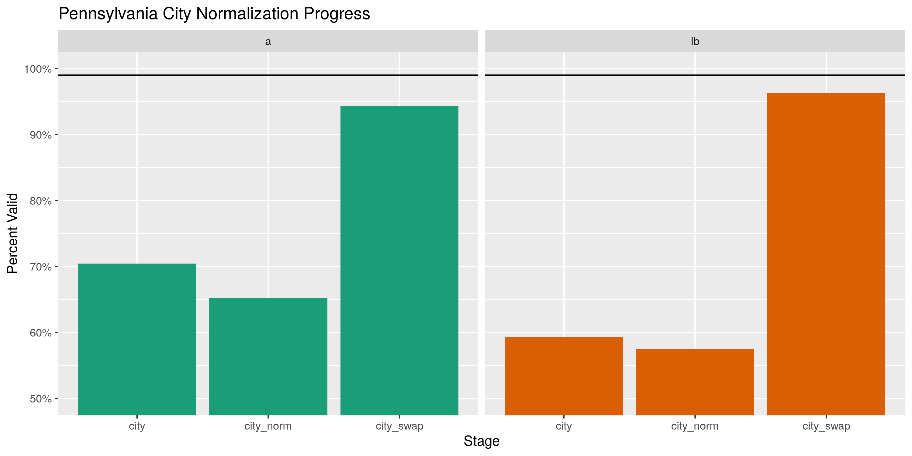
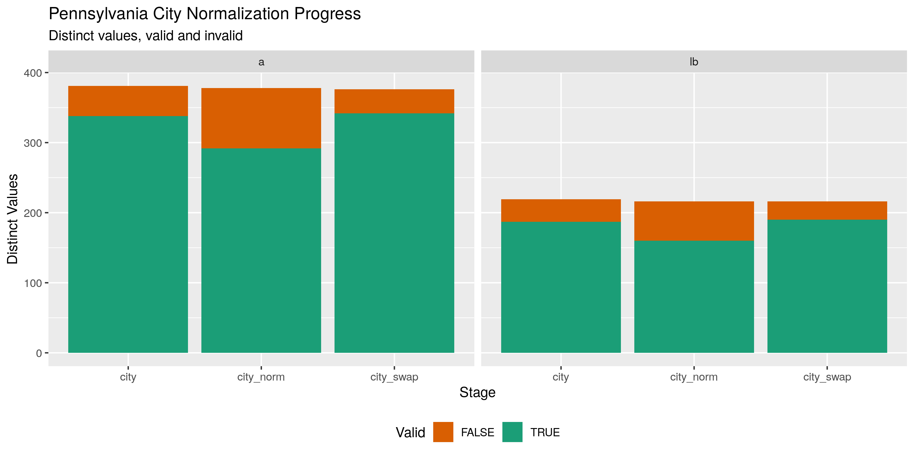
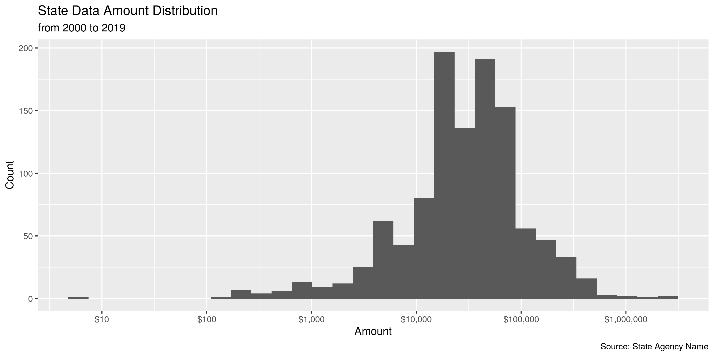

Minnesota Lobbyists
================
Kiernan Nicholls
2019-12-17 16:38:11

  - [Project](#project)
  - [Objectives](#objectives)
  - [Packages](#packages)
  - [Registration](#registration)
      - [Data](#data)
      - [Import](#import)
      - [Explore](#explore)
      - [Wrangle](#wrangle)
      - [Export](#export)
  - [Expenditures](#expenditures)

<!-- Place comments regarding knitting here -->

## Project

The Accountability Project is an effort to cut across data silos and
give journalists, policy professionals, activists, and the public at
large a simple way to search across huge volumes of public data about
people and organizations.

Our goal is to standardizing public data on a few key fields by thinking
of each dataset row as a transaction. For each transaction there should
be (at least) 3 variables:

1.  All **parties** to a transaction
2.  The **date** of the transaction
3.  The **amount** of money involved

## Objectives

This document describes the process used to complete the following
objectives:

1.  How many records are in the database?
2.  Check for duplicates
3.  Check ranges
4.  Is there anything blank or missing?
5.  Check for consistency issues
6.  Create a five-digit state Code called `ZIP5`
7.  Create a `YEAR` field from the transaction date
8.  Make sure there is data on both parties to a transaction

## Packages

The following packages are needed to collect, manipulate, visualize,
analyze, and communicate these results. The `pacman` package will
facilitate their installation and attachment.

The IRW’s `campfin` package will also have to be installed from GitHub.
This package contains functions custom made to help facilitate the
processing of campaign finance data.

``` r
if (!require("pacman")) install.packages("pacman")
pacman::p_load_gh("irworkshop/campfin")
pacman::p_load(
  tidyverse, # data manipulation
  lubridate, # datetime strings
  magrittr, # pipe opperators
  janitor, # dataframe clean
  refinr, # cluster and merge
  scales, # format strings
  knitr, # knit documents
  vroom, # read files fast
  glue, # combine strings
  here, # relative storage
  fs # search storage 
)
```

This document should be run as part of the `R_campfin` project, which
lives as a sub-directory of the more general, language-agnostic
[`irworkshop/accountability_datacleaning`](https://github.com/irworkshop/accountability_datacleaning "TAP repo")
GitHub repository.

The `R_campfin` project uses the [RStudio
projects](https://support.rstudio.com/hc/en-us/articles/200526207-Using-Projects "Rproj")
feature and should be run as such. The project also uses the dynamic
`here::here()` tool for file paths relative to *your* machine.

``` r
# where does this document knit?
here::here()
#> [1] "/home/kiernan/R/accountability_datacleaning/R_campfin"
```

# Registration

## Data

Data is obtained from the [Campaign Finance Public Disclosure Board
(CFPB)](https://cfb.mn.gov/)

> The Board’s four major programs are campaign finance registration and
> disclosure, public subsidy administration, **lobbyist registration and
> disclosure**, and economic interest disclosure by public officials.
> The Board has six members, appointed by the Governor on a bi-partisan
> basis for staggered four-year terms. The appointments must be
> confirmed by a three-fifths vote of the members of each house of the
> legislature.

The CFPB provides an index of lobbyists in alphabetical order as well as
a similar list for associations who have hired lobbyists. Each letter of
the alphabet has a corresponding page listing all the registered
lobbyists (or associations) that start with that letter. Each name is
linked to their own page, on which the address is listed alongside a
table of represented associations (or lobbyists).

I have written a separate script that goes through the complicated
process of scraping each individual lobbyist page, connecting that
lobbyist to all their represented associations, and combining these
relationships into a single data frame. We can run that script now if
needed.

``` r
raw_dir <- here("mn", "lobby", "data", "raw")
dir_create(raw_dir)
scrape_file <- dir_ls(raw_dir, glob = "*lob_scrape.csv$")
scrape_script <- here("mn", "lobby", "code", "scrape_mn_lobby.R")
if (!file_exists(path = scrape_file)) {
  source(file = scrape_script, local = TRUE)
}
```

## Import

``` r
mnlr <- read_csv(
  file = scrape_file,
  col_types = cols(
    .default = col_character(),
    start = col_date(),
    end = col_date(),
    designated = col_logical()
  )
)
```

## Explore

``` r
head(mnlr)
#> # A tibble: 6 x 21
#>   lb_id lb_name lb_tel lb_email lb_company lb_street lb_city lb_state lb_zip a_name a_id 
#>   <chr> <chr>   <chr>  <chr>    <chr>      <chr>     <chr>   <chr>    <chr>  <chr>  <chr>
#> 1 1733  Aafedt… (612)… daafedt… Winthrop … 225 S 6t… Minnea… MN       55402… Baxte… 4547 
#> 2 1733  Aafedt… (612)… daafedt… Winthrop … 225 S 6t… Minnea… MN       55402… Cente… 518  
#> 3 1733  Aafedt… (612)… daafedt… Winthrop … 225 S 6t… Minnea… MN       55402… Colon… 6801 
#> 4 1733  Aafedt… (612)… daafedt… Winthrop … 225 S 6t… Minnea… MN       55402… Emily… 6622 
#> 5 1733  Aafedt… (612)… daafedt… Winthrop … 225 S 6t… Minnea… MN       55402… Intl … 6532 
#> 6 1733  Aafedt… (612)… daafedt… Winthrop … 225 S 6t… Minnea… MN       55402… Merid… 6721 
#> # … with 10 more variables: start <date>, end <date>, type <chr>, designated <lgl>,
#> #   a_website <chr>, a_contact <chr>, a_street <chr>, a_city <chr>, a_state <chr>, a_zip <chr>
tail(mnlr)
#> # A tibble: 6 x 21
#>   lb_id lb_name lb_tel lb_email lb_company lb_street lb_city lb_state lb_zip a_name a_id 
#>   <chr> <chr>   <chr>  <chr>    <chr>      <chr>     <chr>   <chr>    <chr>  <chr>  <chr>
#> 1 3711  Zlajic… (312)… Susan.z… <NA>       1 S Dear… Chicago IL       60603  Arcel… 6235 
#> 2 3510  Zoelln… (651)… azoelln… Planned P… 671 Vand… St Paul MN       55114  Plann… 5869 
#> 3 3039  Zomer,… (612)… patrick… Moss & Ba… 150 S 5t… Minnea… MN       55402  Otter… 685  
#> 4 3039  Zomer,… (612)… patrick… Moss & Ba… 150 S 5t… Minnea… MN       55402  Xcel … 660  
#> 5 3534  Zweber… (651)… Roxanne… Assn of M… 145 Univ… St Paul MN       55103  Assn … 59   
#> 6 2238  Zylla,… (612)… ezylla@… LPaC Alli… 33 S 6th… Minnea… MN       55402  MN Sa… 5981 
#> # … with 10 more variables: start <date>, end <date>, type <chr>, designated <lgl>,
#> #   a_website <chr>, a_contact <chr>, a_street <chr>, a_city <chr>, a_state <chr>, a_zip <chr>
glimpse(sample_frac(mnlr))
#> Observations: 5,464
#> Variables: 21
#> $ lb_id      <chr> "9032", "9483", "8993", "1204", "8692", "1436", "141", "3520", "9078", "7668"…
#> $ lb_name    <chr> "Dooley Jr, William L Jr", "Munyon, Sherry", "Thrane, Peter H", "Frenette, Li…
#> $ lb_tel     <chr> "(612)961-3144", "(612)723-4245", "(612)335-1779", "(651)785-5202", "(651)223…
#> $ lb_email   <chr> "bdooley09@gmail.com", "smunyon@capitolaccess.us", "peter.thrane@stinson.com"…
#> $ lb_company <chr> NA, "Capitol Access", "Stinson Leonard Street LLP", NA, NA, "Management Guida…
#> $ lb_street  <chr> "5653 James Ave S", "2680 2nd St N", "150 S 5th St Ste 2300", "1734 Blair Ave…
#> $ lb_city    <chr> "Minneapolis", "North St Paul", "Minneapolis", "St Paul", "St Paul", "Mendota…
#> $ lb_state   <chr> "MN", "MN", "MN", "MN", "MN", "MN", "MN", "ND", "MN", "MN", "MN", "MN", "MN",…
#> $ lb_zip     <chr> "55419", "55109", "55402", "55104-1702", "55102", "55120", "55413", "58103", …
#> $ a_name     <chr> "Transit for Livable Communities", "Suburban Transit Assn", "AXA Equitable Li…
#> $ a_id       <chr> "5045", "4321", "6893", "6907", "410", "2430", "309", "7140", "3187", "875", …
#> $ start      <date> 2017-02-10, 2009-09-30, 2014-11-20, 2017-03-01, 2009-04-01, 2004-11-29, 1997…
#> $ end        <date> 2017-04-30, NA, 2015-12-31, NA, 2016-12-31, NA, NA, NA, NA, NA, NA, NA, NA, …
#> $ type       <chr> "Leg/Adm/Metro", "Leg/Adm/Metro", NA, "Leg", NA, "Leg/Adm/Metro", "Leg/Adm", …
#> $ designated <lgl> NA, NA, NA, NA, NA, NA, NA, TRUE, TRUE, NA, NA, TRUE, TRUE, NA, TRUE, TRUE, T…
#> $ a_website  <chr> "www.tlcminnesota.org", "www.mvta.com/Suburban_Transit_Association.html", "ht…
#> $ a_contact  <chr> "Jessica Treat, Director", "Jeff Wosje, Chairman", "Robert Negron, Lead Direc…
#> $ a_street   <chr> "2356 University Ave W Ste 403", "525 Park St Ste 130", "1290 Avenue of the A…
#> $ a_city     <chr> "St Paul", "St Paul", "New York", "Inver Grove Heights", "Minneapolis", "Mend…
#> $ a_state    <chr> "MN", "MN", "NY", "MN", "MN", "MN", "MN", "ND", "MN", "MN", "VA", "MN", "MN",…
#> $ a_zip      <chr> "55114", "55103-2044", "10104", "55077-1733", "55414-1053", "55120", "55474",…
```

Very few records are missing the kind of values needed to identify the
lobbyist relationships.

``` r
col_stats(mnlr, count_na)
#> # A tibble: 21 x 4
#>    col        class      n        p
#>    <chr>      <chr>  <int>    <dbl>
#>  1 lb_id      <chr>      0 0       
#>  2 lb_name    <chr>      0 0       
#>  3 lb_tel     <chr>      4 0.000732
#>  4 lb_email   <chr>      1 0.000183
#>  5 lb_company <chr>   1328 0.243   
#>  6 lb_street  <chr>      0 0       
#>  7 lb_city    <chr>      0 0       
#>  8 lb_state   <chr>      1 0.000183
#>  9 lb_zip     <chr>      2 0.000366
#> 10 a_name     <chr>      0 0       
#> 11 a_id       <chr>      0 0       
#> 12 start      <date>     0 0       
#> 13 end        <date>  3736 0.684   
#> 14 type       <chr>   1555 0.285   
#> 15 designated <lgl>   4076 0.746   
#> 16 a_website  <chr>     28 0.00512 
#> 17 a_contact  <chr>     34 0.00622 
#> 18 a_street   <chr>     34 0.00622 
#> 19 a_city     <chr>     34 0.00622 
#> 20 a_state    <chr>     34 0.00622 
#> 21 a_zip      <chr>     34 0.00622
```

## Wrangle

To improve the consistency and searchability of the database, we can
perform some simple and confident text normalization.

### Phone

``` r
mnlr <- mutate(
  .data = mnlr,
  lb_tel_norm = normal_phone(lb_tel)
)
```

    #> # A tibble: 1,509 x 2
    #>    lb_tel        lb_tel_norm   
    #>    <chr>         <chr>         
    #>  1 (612)242-7848 (612) 242-7848
    #>  2 (651)224-5445 (651) 224-5445
    #>  3 (202)830-2038 (202) 830-2038
    #>  4 (612)676-3393 (612) 676-3393
    #>  5 (651)215-4000 (651) 215-4000
    #>  6 (952)229-7779 (952) 229-7779
    #>  7 (952)405-2017 (952) 405-2017
    #>  8 (507)451-1136 (507) 451-1136
    #>  9 (612)335-1577 (612) 335-1577
    #> 10 (651)493-5780 (651) 493-5780
    #> # … with 1,499 more rows

### Address

``` r
mnlr <- mutate_at(
  .tbl = mnlr,
  .vars = vars(ends_with("street")),
  .funs = list(norm = normal_address),
  abbs = usps_street
)
```

    #> # A tibble: 3,354 x 4
    #>    lb_street          a_street                 lb_street_norm           a_street_norm              
    #>    <chr>              <chr>                    <chr>                    <chr>                      
    #>  1 100 Empire Dr Ste… 100 Empire Dr Ste 202    100 EMPIRE DRIVE SUITE … 100 EMPIRE DRIVE SUITE 202 
    #>  2 750 Otto Ave #2549 17025 Hwy 12 NE          750 OTTO AVENUE 2549     17025 HIGHWAY 12 NORTHEAST 
    #>  3 525 Park St Ste 2… 901 Marquette Ave 7th F… 525 PARK STREET SUITE 2… 901 MARQUETTE AVENUE 7TH F…
    #>  4 4525 Douglas Ave   2355 Hwy 36 West Ste 400 4525 DOUGLAS AVENUE      2355 HIGHWAY 36 WEST SUITE…
    #>  5 90 S 7th St #2200… 4248 Park Glen Rd        90 SOUTH 7TH STREET 220… 4248 PARK GLEN ROAD        
    #>  6 701 City Center Dr 720 City Center Dr       701 CITY CENTER DRIVE    720 CITY CENTER DRIVE      
    #>  7 168 6th St E Unit… 4111 E 37th St N         168 6TH STREET EAST UNI… 4111 EAST 37TH STREET NORTH
    #>  8 6965 Oakbrook St … 10710 Midlothian Turnpi… 6965 OAKBROOK STREET SO… 10710 MIDLOTHIAN TURNPIKE …
    #>  9 17444 Park Ave SE  8170 33rd Ave S MS 2110… 17444 PARK AVENUE SOUTH… 8170 33RD AVENUE SOUTH MS …
    #> 10 114 Mackubin St S… 2400 W 64th St           114 MACKUBIN STREET SUI… 2400 WEST 64TH STREET      
    #> # … with 3,344 more rows

### ZIP

``` r
mnlr <- mutate_at(
  .tbl = mnlr,
  .vars = vars(ends_with("zip")),
  .funs = list(norm = normal_zip),
  na_rep = TRUE
)
```

    #> # A tibble: 2,634 x 4
    #>    lb_zip a_zip      lb_zip_norm a_zip_norm
    #>    <chr>  <chr>      <chr>       <chr>     
    #>  1 55402  55403      55402       55403     
    #>  2 55074  56007      55074       56007     
    #>  3 55710  55734      55710       55734     
    #>  4 55402  55487-0235 55402       55487     
    #>  5 55407  55407-2102 55407       55407     
    #>  6 55103  53593      55103       53593     
    #>  7 15317  15317      15317       15317     
    #>  8 55125  60053      55125       60053     
    #>  9 55125  55103      55125       55103     
    #> 10 55441  55415-1829 55441       55415     
    #> # … with 2,624 more rows

    #> # A tibble: 4 x 6
    #>   stage       prop_in n_distinct  prop_na n_out n_diff
    #>   <chr>         <dbl>      <dbl>    <dbl> <dbl>  <dbl>
    #> 1 lb_zip        0.886        405 0.000366   622    102
    #> 2 lb_zip_norm   0.999        320 0.000366     3      4
    #> 3 a_zip         0.823        711 0.00622    962    201
    #> 4 a_zip_norm    0.997        558 0.00622     19      5

### State

``` r
prop_in(mnlr$lb_state, valid_state)
#> [1] 0.999817
mnlr$lb_state <- na_out(mnlr$lb_state, valid_state)
prop_in(mnlr$a_state, valid_state)
#> [1] 1
```

### City

``` r
mnlr <- mutate_at(
  .tbl = mnlr,
  .vars = vars(ends_with("city")),
  .funs = list(norm = normal_city),
  abbs = usps_city,
  state = c("MN", "DC", "MINNESOTA"),
  na = invalid_city,
  na_rep = TRUE
)
```

``` r
mnlr <- mnlr %>%
  left_join(
    y = zipcodes,
    by = c(
      "lb_state" = "state",
      "lb_zip_norm" = "zip"
    )
  ) %>% 
  rename(lb_city_match = city) %>% 
  mutate(
    lb_match_abb = is_abbrev(lb_city_norm, lb_city_match),
    lb_match_dist = str_dist(lb_city_norm, lb_city_match),
    lb_city_swap = if_else(
      condition = lb_match_abb | lb_match_dist == 1,
      true = lb_city_match,
      false = lb_city_norm
    )
  ) %>% 
  select(
    -lb_match_abb,
    -lb_match_dist,
    -lb_city_match
  )

# repeat for associations
mnlr <- mnlr %>% 
  left_join(
    y = zipcodes,
    by = c(
      "a_state" = "state",
      "a_zip_norm" = "zip"
    )
  ) %>% 
  rename(a_city_match = city) %>% 
  mutate(
    a_match_abb = is_abbrev(a_city_norm, a_city_match),
    a_match_dist = str_dist(a_city_norm, a_city_match),
    a_city_swap = if_else(
      condition = a_match_abb | a_match_dist == 1,
      true = a_city_match,
      false = a_city_norm
    )
  ) %>% 
  select(
    -a_match_abb,
    -a_match_dist,
    -a_city_match
  )
```

``` r
progress <- 
  progress_table(
    str_to_upper(mnlr$lb_city),
    mnlr$lb_city_norm,
    mnlr$lb_city_swap,
    str_to_upper(mnlr$a_city),
    mnlr$a_city_norm,
    mnlr$a_city_swap,
    compare = valid_city
  ) %>%
  separate(
    col = stage, 
    into = c("type", "stage"), 
    sep = "_", 
    extra = "merge"
  ) %>% 
  mutate(stage = str_remove(as_factor(stage), "\\)$")) %>% 
  group_by(stage) 
```

``` r
kable(progress, digits = 3)
```

| type | stage      | prop\_in | n\_distinct | prop\_na | n\_out | n\_diff |
| :--: | :--------- | -------: | ----------: | -------: | -----: | ------: |
|  lb  | city       |    0.593 |         219 |    0.000 |   2223 |      32 |
|  lb  | city\_norm |    0.970 |         216 |    0.000 |    164 |      22 |
|  lb  | city\_swap |    0.970 |         214 |    0.001 |    163 |      22 |
|  a   | city       |    0.704 |         381 |    0.006 |   1605 |      43 |
|  a   | city\_norm |    0.953 |         378 |    0.006 |    254 |      31 |
|  a   | city\_swap |    0.954 |         373 |    0.011 |    246 |      27 |

<!-- -->

<!-- -->

## Export

``` r
proc_dir <- here("mn", "lobby", "data", "processed")
dir_create(proc_dir)
write_csv(
  x = mnlr,
  path = glue("{proc_dir}/mn_lobbyists.csv"),
  na = ""
)
```

# Expenditures

We can also obtain a report of lobbying expenditures made by the
principal associations.

``` r
exp_url <- "https://cfb.mn.gov/reports-and-data/self-help/data-downloads/lobbying/?download=102614850"
mnle <- read_csv(
  file = exp_url,
  col_types = cols(
    Principal = col_character(),
    `Entity ID` = col_character(),
    `Report Year` = col_double(),
    `General lobbying amount` = col_double(),
    `PUC lobbying amount` = col_double(),
    `Total spent` = col_double()
  )
)

mnle <- mnle %>% 
  rename(
    a_name  = `Principal`,
    a_id  = `Entity ID`,
    year  = `Report Year`,
    gen_amount  = `General lobbying amount`,
    lob_amount  = `PUC lobbying amount`,
    total_amount  = `Total spent`
  )
```

``` r
mnle %>% 
  filter(total_amount > 1) %>% 
  ggplot(aes(x = total_amount)) +
  geom_histogram() +
  scale_x_continuous(
    breaks = c(1 %o% 10^(0:6)),
    labels = dollar,
    trans = "log10"
  ) +
  labs(
    title = "State Data Amount Distribution",
    subtitle = "from 2000 to 2019",
    caption = "Source: State Agency Name",
    x = "Amount",
    y = "Count"
  )
```

<!-- -->
