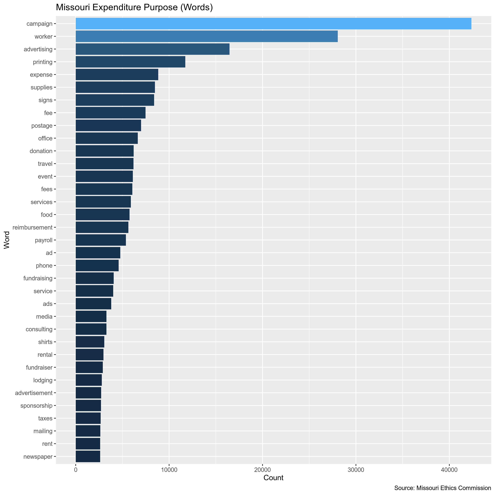
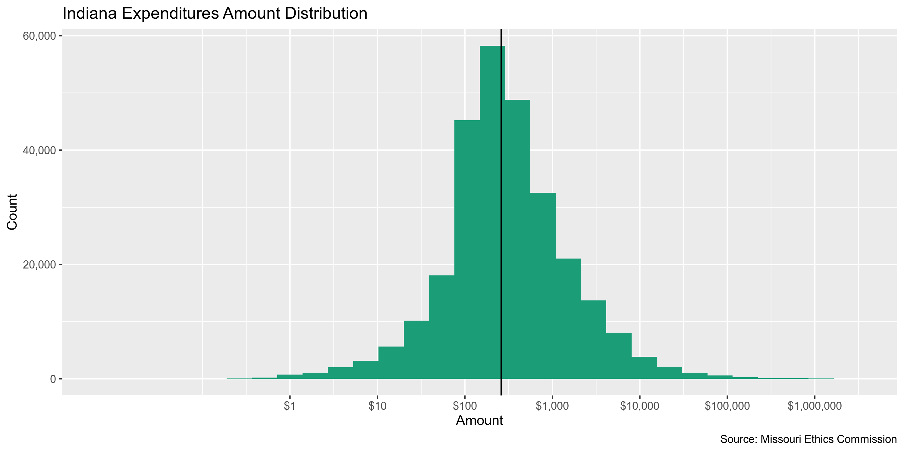
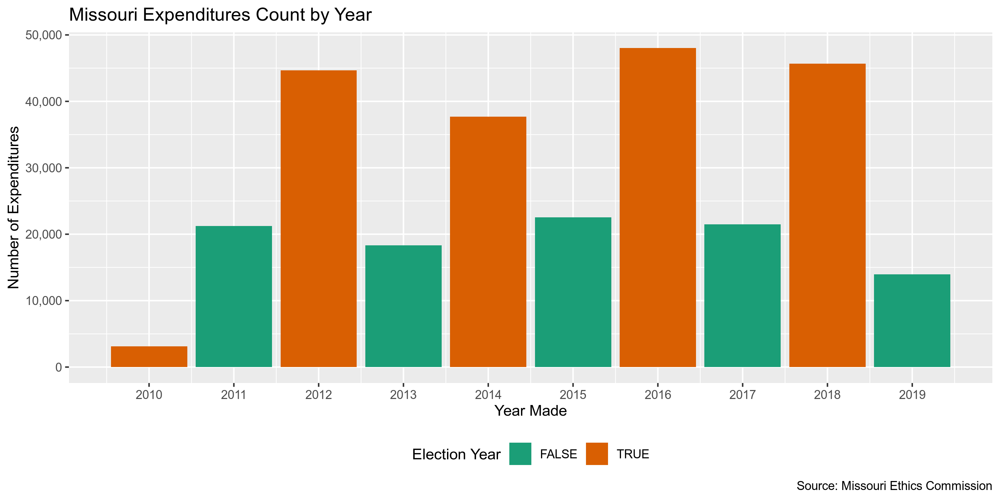
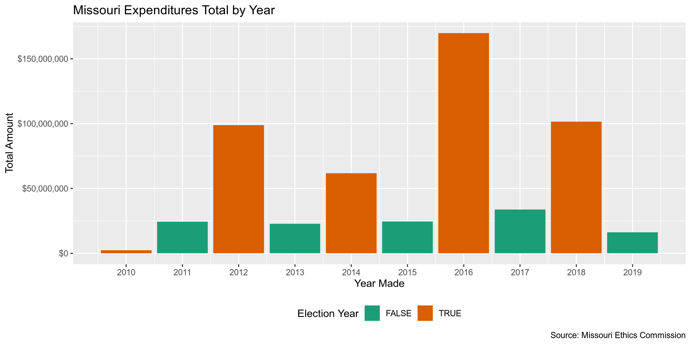
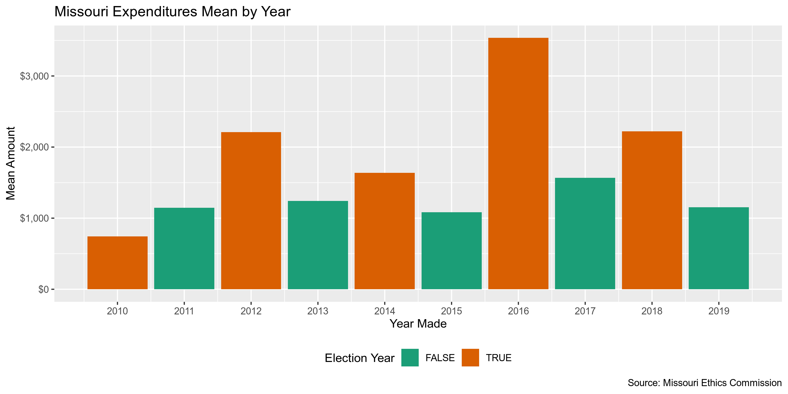
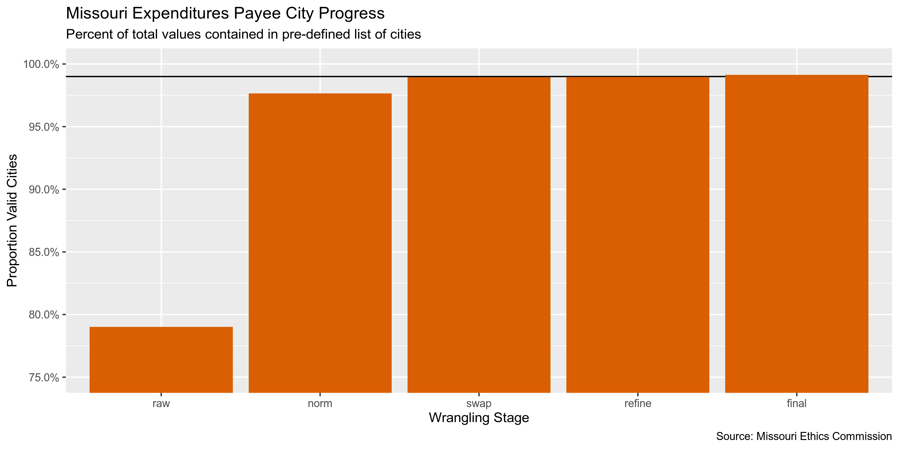
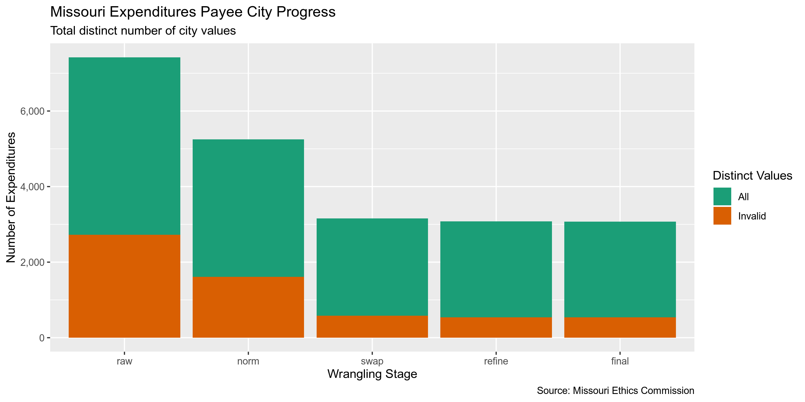

Missouri Expenditures
================
Kiernan Nicholls
2019-08-21 15:58:25

  - [Project](#project)
  - [Objectives](#objectives)
  - [Packages](#packages)
  - [Data](#data)
  - [Import](#import)
  - [Explore](#explore)
  - [Wrangle](#wrangle)
  - [Conclude](#conclude)
  - [Export](#export)

<!-- Place comments regarding knitting here -->

## Project

The Accountability Project is an effort to cut across data silos and
give journalists, policy professionals, activists, and the public at
large a simple way to search across huge volumes of public data about
people and organizations.

Our goal is to standardizing public data on a few key fields by thinking
of each dataset row as a transaction. For each transaction there should
be (at least) 3 variables:

1.  All **parties** to a transaction
2.  The **date** of the transaction
3.  The **amount** of money involved

## Objectives

This document describes the process used to complete the following
objectives:

1.  How many records are in the database?
2.  Check for duplicates
3.  Check ranges
4.  Is there anything blank or missing?
5.  Check for consistency issues
6.  Create a five-digit ZIP Code called `ZIP5`
7.  Create a `YEAR` field from the transaction date
8.  Make sure there is data on both parties to a transaction

## Packages

The following packages are needed to collect, manipulate, visualize,
analyze, and communicate these results. The `pacman` package will
facilitate their installation and attachment.

The IRW’s `campfin` package will also have to be installed from GitHub.
This package contains functions custom made to help facilitate the
processing of campaign finance data.

``` r
if (!require("pacman")) install.packages("pacman")
pacman::p_load_current_gh("kiernann/campfin")
pacman::p_load(
  stringdist, # levenshtein value
  RSelenium, # remote browser
  tidyverse, # data manipulation
  lubridate, # datetime strings
  tidytext, # text analysis
  magrittr, # pipe opperators
  janitor, # dataframe clean
  refinr, # cluster and merge
  scales, # format strings
  rvest, # scrape html pages
  knitr, # knit documents
  vroom, # read files fast
  glue, # combine strings
  here, # relative storage
  fs # search storage 
)
```

This document should be run as part of the `R_campfin` project, which
lives as a sub-directory of the more general, language-agnostic
[`irworkshop/accountability_datacleaning`](https://github.com/irworkshop/accountability_datacleaning "TAP repo")
GitHub repository.

The `R_campfin` project uses the [RStudio
projects](https://support.rstudio.com/hc/en-us/articles/200526207-Using-Projects "Rproj")
feature and should be run as such. The project also uses the dynamic
`here::here()` tool for file paths relative to *your* machine.

``` r
# where dfs this document knit?
here::here()
#> [1] "/home/ubuntu/R/accountability_datacleaning/R_campfin"
```

## Data

Data is obtained from the [Missouri Ethics
Commission](https://www.mec.mo.gov/MEC/Default.aspx) (MEC).

> The Commission makes transparency and public information a priority in
> their operations. The Commission’s website provides detailed financial
> information about campaign expenditures and contributions and includes
> many publications, brochures, and web tutorials explaining Missouri’s
> ethics laws, requirements and regulations.

Their data can be downloaded as anual files on their [data download
page](https://www.mec.mo.gov/MEC/Campaign_Finance/CF_ContrCSV.aspx).

> This search returns results from Campaign Finance Committee Reports
> filed for 2011 and later. The first row of the file contains the
> header/column names; the results are downloaded into a comma-separated
> value format only.

## Import

We can import each file into R as a single data frame to be explored,
wrangled, and exported as a single file to be indexed on the TAP
database.

### Download

The files can only be downloaded after submitting a form request for a
type of data for a specific year. We can automate this process with the
RSelenium package.

``` r
raw_dir <- here("mo", "expends", "data", "raw")
dir_create(raw_dir)
```

``` r
# open the driver with auto download options
remote_driver <- rsDriver(
  port = 4444L,
  browser = "firefox",
  extraCapabilities = makeFirefoxProfile(
    list(
      browser.download.dir = raw_dir,
      browser.download.folderList = 2L,
      browser.helperApps.neverAsk.saveToDisk = "text/csv"
    )
  )
)

# navigate to the FL DOE download site
remote_browser <- remote_driver$client
remote_browser$navigate("https://www.mec.mo.gov/MEC/Campaign_Finance/CF_ContrCSV.aspx")

# chose "All" from elections list
type_css <- "/html/body/form/div[4]/div/div/div[2]/div[2]/table/tbody/tr[6]/td[2]/select/option[3]"
remote_browser$findElement("xpath", type_css)$clickElement()

for (i in 2:10) {
  dropdown <- "/html/body/form/div[4]/div/div/div[2]/div[2]/table/tbody/tr[8]/td[2]/select"
  remote_browser$findElement("xpath", glue("{dropdown}/option[{i}]"))$clickElement()
  submit_button <- "#ContentPlaceHolder_ContentPlaceHolder1_btnExport"
  remote_browser$findElement("css", submit_button)$clickElement()
}

# close the browser and driver
remote_browser$close()
remote_driver$server$stop()
```

### Read

We can read each file as a data frame into a list of data frames by
`vroom::vroom()`.

``` r
mo <- vroom(
  file = dir_ls(raw_dir, glob = "*.csv$"),
  .name_repair = make_clean_names,
  delim = ",",
  escape_backslash = FALSE,
  escape_double = FALSE,
  col_types = cols(.default = "c")
)
```

Due to an small bug in `vroom::vroom()`, we will have to parse the
`date` column using `readr::parse_date()` *after* initally reading the
files.

``` r
mo <- mo %>% 
  mutate(
    date = parse_date(date, "%m/%d/%Y %H:%M:%S %p"),
    amount = parse_number(amount)
  )
```

## Explore

``` r
head(mo)
#> # A tibble: 6 x 16
#>   cd3_b_id mecid committee_name first_name last_name company address_1 address_2 city  state zip  
#>   <chr>    <chr> <chr>          <chr>      <chr>     <chr>   <chr>     <chr>     <chr> <chr> <chr>
#> 1 1547     C081… KCFT & SRP ST… Judy       Morgan    <NA>    3837 Cam… <NA>      Kans… MO    64109
#> 2 1548     C081… KCFT & SRP ST… <NA>       <NA>      KCFT &… 3901 Mai… Ste. 201  Kans… MO    64111
#> 3 1549     C081… KCFT & SRP ST… <NA>       <NA>      KCFT &… 3901 Mai… Ste. 201  Kans… MO    64111
#> 4 1550     C081… KCFT & SRP ST… <NA>       <NA>      KCFT F… 3901 Mai… Ste. 201  Kans… MO    64111
#> 5 1551     C091… HICKORY COUNT… <NA>       <NA>      The In… PO Box 1… <NA>      Herm… MO    65668
#> 6 1571     C091… FRIENDS TO EL… <NA>       <NA>      Missou… 3950 E.N… <NA>      Jopl… MO    64801
#> # … with 5 more variables: date <date>, purpose <chr>, amount <dbl>, expenditure_type <chr>,
#> #   report <chr>
tail(mo)
#> # A tibble: 6 x 16
#>   cd3_b_id mecid committee_name first_name last_name company address_1 address_2 city  state zip  
#>   <chr>    <chr> <chr>          <chr>      <chr>     <chr>   <chr>     <chr>     <chr> <chr> <chr>
#> 1 374261   C111… SEIU HCII MIS… Corinthia… Robinson  <NA>    9628 Ced… A         "Ove… MO    63114
#> 2 374262   C111… SEIU HCII MIS… Elinor     Simmons   <NA>    1275 N F… <NA>      St L… MO    63135
#> 3 374263   C111… SEIU HCII MIS… Moorey     Rewita    <NA>    5151      Northland St L… MO    63113
#> 4 374264   C111… SEIU HCII MIS… "Paula "   Johnson   <NA>    2843 How… <NA>      "St … MO    63106
#> 5 374265   C111… SEIU HCII MIS… Amy        Jones     <NA>    11141 La… <NA>      St L… MO    63136
#> 6 374266   C111… SEIU HCII MIS… "Alice "   Allen     <NA>    5808 Ame… 1st FL    St L… MO    63120
#> # … with 5 more variables: date <date>, purpose <chr>, amount <dbl>, expenditure_type <chr>,
#> #   report <chr>
glimpse(sample_frac(mo))
#> Observations: 276,742
#> Variables: 16
#> $ cd3_b_id         <chr> "166814", "29857", "282834", "84666", "270802", "124824", "243217", "18…
#> $ mecid            <chr> "C051151", "C031159", "C171046", "C101216", "C000478", "C131073", "C000…
#> $ committee_name   <chr> "HOLSMAN FOR MISSOURI", "MISSOURIANS FOR KOSTER", "Prater For City Coun…
#> $ first_name       <chr> "Robert ", NA, NA, NA, "CARLA", NA, NA, NA, NA, "LEN", NA, NA, NA, NA, …
#> $ last_name        <chr> "Felton", NA, NA, NA, "MEDINA", NA, NA, NA, NA, "SALUGHTER", NA, NA, NA…
#> $ company          <chr> NA, "Starbucks", "Medical Consulting Group LLC", "Quicktrip", NA, "The …
#> $ address_1        <chr> "8510 E 9th", "2401 Utah Ave S", "2808 S Ingram Mill Rd, Bldg B", "2600…
#> $ address_2        <chr> NA, NA, NA, NA, NA, NA, NA, NA, NA, NA, NA, "Suite 201", NA, NA, NA, NA…
#> $ city             <chr> "Kansas City", "Seattle", "Springfield", "Fenton", "KANSAS CITY", "St L…
#> $ state            <chr> "MO", "WA", "MO", "MO", "MO", "MO", "KS", "TX", "MO", "MO", "MO", "MO",…
#> $ zip              <chr> "64112", "98134", "65804", "63026", "64108", "63139", "66212", "79415",…
#> $ date             <date> 2014-09-15, 2011-07-09, 2017-03-23, 2012-09-29, 2016-11-08, 2013-08-20…
#> $ purpose          <chr> "Campaign Worker", "Meal Expense", "Campaign mgmt & creative", "stamps"…
#> $ amount           <dbl> 500.00, 1.87, 3200.00, 153.00, 125.00, 477.36, 110.00, 148.46, 14919.75…
#> $ expenditure_type <chr> "P", "P", "P", "P", "P", "P", "P", "P", "P", "P", "P", "P", "P", "P", "…
#> $ report           <chr> "October Quarterly Report", "October Quarterly Report", "8 Day Before G…
```

### Missing

``` r
glimpse_fun(mo, count_na)
#> # A tibble: 16 x 4
#>    var              type       n         p
#>    <chr>            <chr>  <int>     <dbl>
#>  1 cd3_b_id         chr        0 0        
#>  2 mecid            chr        0 0        
#>  3 committee_name   chr        0 0        
#>  4 first_name       chr   214056 0.773    
#>  5 last_name        chr   211749 0.765    
#>  6 company          chr    60648 0.219    
#>  7 address_1        chr       12 0.0000434
#>  8 address_2        chr   252153 0.911    
#>  9 city             chr       11 0.0000397
#> 10 state            chr       19 0.0000687
#> 11 zip              chr      142 0.000513 
#> 12 date             date       0 0        
#> 13 purpose          chr        0 0        
#> 14 amount           dbl        0 0        
#> 15 expenditure_type chr        0 0        
#> 16 report           chr        0 0
```

There are very few records missing one of the key values needed to
identify a transaction (who, what, when). The `first_name` and
`last_name` variables are used to identify individual payees, with
`company` used to identify non-individuals. We can flag any record with
`campfin::flag_na()` to create a new `na_flag` variable with value
`TRUE` for any record missing *any* of those key variables.

``` r
mo <- mo %>% 
  mutate(
    individual = coalesce(last_name, first_name),
    payee_name = coalesce(individual, company)
    ) %>% 
  flag_na(
    payee_name,
    committee_name,
    date,
    amount
  )

sum(mo$na_flag)
#> [1] 5
```

### Duplicates

We can use `campfin::flag_dupes()` to create a new `dupe_flag` variable
with with value `TRUE` for any duplicate row, after the first occurance.
We will ignore the supposedly unique `cd3_b_id` variable.

``` r
mo <- flag_dupes(mo, -cd3_b_id)
sum(mo$dupe_flag)
#> [1] 1687
percent(mean(mo$dupe_flag))
#> [1] "0.610%"
```

### Categorical

``` r
glimpse_fun(mo, n_distinct)
#> # A tibble: 20 x 4
#>    var              type       n          p
#>    <chr>            <chr>  <int>      <dbl>
#>  1 cd3_b_id         chr   276742 1         
#>  2 mecid            chr     6816 0.0246    
#>  3 committee_name   chr     7254 0.0262    
#>  4 first_name       chr     8314 0.0300    
#>  5 last_name        chr    11484 0.0415    
#>  6 company          chr    54472 0.197     
#>  7 address_1        chr    90798 0.328     
#>  8 address_2        chr     6407 0.0232    
#>  9 city             chr     6203 0.0224    
#> 10 state            chr       84 0.000304  
#> 11 zip              chr     7820 0.0283    
#> 12 date             date    3329 0.0120    
#> 13 purpose          chr    59185 0.214     
#> 14 amount           dbl    74678 0.270     
#> 15 expenditure_type chr        2 0.00000723
#> 16 report           chr      392 0.00142   
#> 17 individual       chr    11887 0.0430    
#> 18 payee_name       chr    64013 0.231     
#> 19 na_flag          lgl        2 0.00000723
#> 20 dupe_flag        lgl        2 0.00000723
```

<!-- -->

### Continuous

For continuous variables, we should explore both the range and
distribution. This can be done with visually with
`ggplot2::geom_histogram()` and `ggplot2::geom_violin()`.

#### Amounts

``` r
summary(mo$amount)
#>      Min.   1st Qu.    Median      Mean   3rd Qu.      Max. 
#>     -86.8     120.0     259.6    2006.8     750.0 2438725.0
sum(mo$amount <= 0, na.rm = TRUE)
#> [1] 40
sum(mo$amount >= 100000, na.rm = TRUE)
#> [1] 664
```

<!-- -->

#### Dates

``` r
mo <- mutate(mo, year = year(date))
```

``` r
count_na(mo$date)
#> [1] 0
min(mo$date, na.rm = TRUE)
#> [1] "1900-01-20"
sum(mo$year < 2010, na.rm = TRUE)
#> [1] 59
max(mo$date, na.rm = TRUE)
#> [1] "2021-02-02"
sum(mo$date > today(), na.rm = TRUE)
#> [1] 1
```

``` r
count(mo, year)
#> # A tibble: 17 x 2
#>     year     n
#>    <dbl> <int>
#>  1  1900     2
#>  2  2001     1
#>  3  2002     1
#>  4  2007    16
#>  5  2008    22
#>  6  2009    17
#>  7  2010  3113
#>  8  2011 21245
#>  9  2012 44656
#> 10  2013 18305
#> 11  2014 37670
#> 12  2015 22564
#> 13  2016 48007
#> 14  2017 21512
#> 15  2018 45658
#> 16  2019 13952
#> 17  2021     1
```

``` r
mo <- mo %>% 
  mutate(
    date_flag = year < 2010 | date > today(),
    date_clean = case_when(date_flag ~ as.Date(NA), not(date_flag) ~ date),
    year_clean = year(date_clean)
  )

sum(mo$date_flag, na.rm = TRUE)
#> [1] 60
```

<!-- -->

<!-- -->

<!-- -->

<!-- -->

## Wrangle

We should use the `campfin::normal_*()` functions to perform some basic,
high-confidence text normalization to improve the searchability of the
database.

### Address

First, we will normalize the street address by removing punctuation and
expanding abbreviations.

``` r
if (packageVersion("tidyr") > "0.8.3.9") {
  mo <- mo %>% 
    unite(
      col = adress_full,
      starts_with("address"),
      remove = FALSE,
      na.rm = TRUE
    ) %>% 
    mutate(
      address_norm = normal_address(
        address = adress_full,
        add_abbs = usps,
        na_rep = TRUE
      )
    )
} else {
  stop(
    glue("tidyr needs a newer version, found {packageVersion('tidyr')}, need at least 0.8.3.9")
  )
}
```

We can see how this improves consistency across the `address_1` and
`address_2` fields.

    #> # A tibble: 10 x 3
    #>    address_1                address_2             address_norm                                  
    #>    <chr>                    <chr>                 <chr>                                         
    #>  1 7925 Clayton Road        Suite 200             7925 CLAYTON ROAD SUITE 200                   
    #>  2 135 Paul Avenue          Ste B                 135 PAUL AVENUE STE B                         
    #>  3 5555 Hilton Ave          Ste 203               5555 HILTON AVENUE STE 203                    
    #>  4 2001 Holly Ave           #5                    2001 HOLLY AVENUE 5                           
    #>  5 "1034 S Brentwood Blvd " Suite 1700            1034 SOUTH BRENTWOOD BOULEVARD SUITE 1700     
    #>  6 6142 Greer               6142 Greer            6142 GREER 6142 GREER                         
    #>  7 1200 18th St NW          Ste 700               1200 18TH STREET NW STE 700                   
    #>  8 850 Quincy Street NW     #402                  850 QUINCY STREET NW 402                      
    #>  9 3433 Hampton Ave         3841 Holly Hills Blvd 3433 HAMPTON AVENUE 3841 HOLLY HILLS BOULEVARD
    #> 10 34100 Woodward Ave       Ste 250               34100 WOODWARD AVENUE STE 250

### ZIP

The `zip` address is already pretty good, with 92.5% of the values
already in our 95% comprehensive `valid_zip` list.

``` r
n_distinct(mo$zip)
#> [1] 7820
prop_in(mo$zip, valid_zip)
#> [1] 0.9254049
length(setdiff(mo$zip, valid_zip))
#> [1] 3779
```

We can improve this further by lopping off the uncommon four-digit
extensions and removing common invalid codes like 00000 and 99999.

``` r
mo <- mo %>% 
  mutate(
    zip_norm = normal_zip(
      zip = zip,
      na_rep = TRUE
    )
  )
```

This brings our valid percentage to 99.6%.

``` r
n_distinct(mo$zip_norm)
#> [1] 4682
prop_in(mo$zip_norm, valid_zip)
#> [1] 0.995687
length(setdiff(mo$zip_norm, valid_zip))
#> [1] 511
count_na(mo$zip_norm) - count_na(mo$zip)
#> [1] 227
```

### State

The `state` variable is also very clean, already at 99.8%.

``` r
n_distinct(mo$state)
#> [1] 84
prop_in(mo$state, valid_state, na.rm = TRUE)
#> [1] 0.9976728
length(setdiff(mo$state, valid_state))
#> [1] 27
setdiff(mo$state, valid_state)
#>  [1] NA   "Ks" "Mo" "mo" "0"  "na" "CN" "Tx" "UK" "Fl" " "  "Pa" "SP" "SA" "Ca" "US" "Il" "AU" "Va"
#> [20] "b"  "EN" "Fr" "JS" "mO" "Ne" "Ia" "KC"
```

There are still 27 invalid values which we can remove.

``` r
mo <- mo %>% 
  mutate(
    state_norm = normal_state(
      state = str_replace(str_trim(state), "^I$", "IN"),
      abbreviate = TRUE,
      na_rep = TRUE,
      valid = valid_state
    )
  )
```

``` r
n_distinct(mo$state_norm)
#> [1] 52
prop_in(mo$state_norm, valid_state)
#> [1] 1
```

### City

The `city` value is the hardest to normalize. We can use a four-step
system to functionally improve the searchablity of the database.

1.  **Normalize** the raw values with `campfin::normal_city()`
2.  **Match** the normal values with the *expected* value for that ZIP
    code
3.  **Swap** the normal values with the expected value if they are
    *very* similar
4.  **Refine** the swapped values the [OpenRefine
    algorithms](https://github.com/OpenRefine/OpenRefine/wiki/Clustering-In-Depth)
    and keep good changes

The raw `city` values are not very normal, with only 5.05% already in
`valid_city`, mostly due to case difference. If we simply convert to
uppcase that numbers increases to 77.2%. We will aim to get this number
over 99% using the other steps in the process.

``` r
n_distinct(mo$city)
#> [1] 6203
prop_in(str_to_upper(mo$city), valid_city, na.rm = TRUE)
#> [1] 0.7721939
length(setdiff(mo$city, valid_city))
#> [1] 5594
count_na(mo$city)
#> [1] 11
```

#### Normalize

``` r
mo <- mo %>% 
  mutate(
    city_norm = normal_city(
      city = city, 
      geo_abbs = usps_city,
      st_abbs = c("MO", "DC", "MISSOURI"),
      na = na_city,
      na_rep = TRUE
    )
  )
```

This process brought us to 95.7% valid.

``` r
n_distinct(mo$city_norm)
#> [1] 3635
prop_in(mo$city_norm, valid_city, na.rm = TRUE)
#> [1] 0.9574533
length(setdiff(mo$city_norm, valid_city))
#> [1] 1625
count_na(mo$city_norm)
#> [1] 199
```

It also increased the proportion of `NA` values by 0.0679%. These new
`NA` values were either a single (possibly repeating) character, or
contained in the `na_city` vector.

    #> # A tibble: 114 x 4
    #>    zip_norm state_norm city      city_norm
    #>    <chr>    <chr>      <chr>     <chr>    
    #>  1 63368    MO         Online    <NA>     
    #>  2 65203    MO         Unknown   <NA>     
    #>  3 65101    MO         unknown   <NA>     
    #>  4 <NA>     MO         None      <NA>     
    #>  5 63376    MO         requested <NA>     
    #>  6 64444    MO         Unkown    <NA>     
    #>  7 <NA>     MO         Unknown   <NA>     
    #>  8 65803    MO         internet  <NA>     
    #>  9 66212    MO         Unknown   <NA>     
    #> 10 12345    CA         Online    <NA>     
    #> # … with 104 more rows

#### Swap

Then, we will compare these normalized `city_norm` values to the
*expected* city value for that vendor’s ZIP code. If the [levenshtein
distance](https://en.wikipedia.org/wiki/Levenshtein_distance) is less
than 3, we can confidently swap these two values.

``` r
mo <- mo %>% 
  rename(city_raw = city) %>% 
  left_join(
    y = geo,
    by = c(
      "state_norm" = "state",
      "zip_norm" = "zip"
    )
  ) %>% 
  rename(city_match = city) %>% 
  mutate(
    match_dist = stringdist(city_norm, city_match),
    city_swap = if_else(
      condition = is_less_than(match_dist, 3),
      true = city_match,
      false = city_norm
    )
  )
```

This is a very fast way to increase the valid proportion to 97.1% and
reduce the number of distinct *invalid* values from 1625 to only 590

``` r
n_distinct(mo$city_swap)
#> [1] 2572
prop_in(mo$city_swap, valid_city, na.rm = TRUE)
#> [1] 0.970532
length(setdiff(mo$city_swap, valid_city))
#> [1] 590
```

#### Refine

Finally, we can pass these swapped `city_swap` values to the OpenRefine
cluster and merge algorithms. These two algorithms cluster similar
values and replace infrequent values with their more common
counterparts. This process can be harmful by making *incorrect* changes.
We will only keep changes where the state, ZIP code, *and* new city
value all match a valid combination.

``` r
good_refine <- mo %>% 
  mutate(
    city_refine = city_swap %>% 
      key_collision_merge() %>% 
      n_gram_merge(numgram = 1)
  ) %>% 
  filter(city_refine != city_swap) %>% 
  inner_join(
    y = geo,
    by = c(
      "city_refine" = "city",
      "state_norm" = "state",
      "zip_norm" = "zip"
    )
  )

nrow(good_refine)
#> [1] 66
```

    #> # A tibble: 57 x 5
    #>    state_norm zip_norm city_raw              city_refine         n
    #>    <chr>      <chr>    <chr>                 <chr>           <int>
    #>  1 KS         66101    Kanssas Cityas City   KANSAS CITY         5
    #>  2 MO         64108    Kanssas Cityas City   KANSAS CITY         4
    #>  3 CA         92067    Ranchero Sante Fe     RANCHO SANTA FE     3
    #>  4 CA         94133    "San Francisco CA "   SAN FRANCISCO       1
    #>  5 CA         95131    Jose San              SAN JOSE            1
    #>  6 DC         20009    NW Washington         WASHINGTON          1
    #>  7 IA         52802    Daavenportvenport     DAVENPORT           1
    #>  8 IL         60094    Palenentine           PALATINE            1
    #>  9 KS         66101    Kanansas Citysas City KANSAS CITY         1
    #> 10 KS         66101    Kansas City KS        KANSAS CITY         1
    #> # … with 47 more rows

We can join these good refined values back to the original data and use
them over their incorrect `city_swap` counterparts in a new
`city_refine` variable.

``` r
mo <- mo %>% 
  left_join(good_refine) %>% 
  mutate(city_refine = coalesce(city_refine, city_swap))
```

This brings us to 97.1% valid values.

``` r
n_distinct(mo$city_refine)
#> [1] 2532
prop_in(mo$city_refine, valid_city, na.rm = TRUE)
#> [1] 0.9707729
length(setdiff(mo$city_refine, valid_city))
#> [1] 550
```

#### Progress

We can make very few manual changes to capture the last few big invalid
values. Local city abbreviations (e.g., SPFD) often need to be changed
by hand.

``` r
mo %>%
  filter(city_refine %out% valid_city) %>% 
  count(state_norm, city_refine, sort = TRUE) %>% 
  drop_na(city_refine)
#> # A tibble: 553 x 3
#>    state_norm city_refine           n
#>    <chr>      <chr>             <int>
#>  1 KS         OVERLAND PARK       868
#>  2 MO         RAYTOWN             665
#>  3 MO         NORTH KANSAS CITY   518
#>  4 KS         PRAIRIE VILLAGE     430
#>  5 MO         OVERLAND            421
#>  6 MO         WEBSTER GROVES      418
#>  7 MO         UNIVERSITY CITY     376
#>  8 MO         STLOUIS             318
#>  9 MO         RICHMOND HEIGHTS    312
#> 10 KS         LENEXA              256
#> # … with 543 more rows
```

``` r
mo <- mo %>% 
  mutate(
    city_final = city_refine %>% 
      str_replace("^STLOUIS$", "SAINT LOUIS") %>% 
      str_replace("^SPFD$", "SPRINGFIELD") %>% 
      str_replace("^INDEP$", "INDEPENDENCE") %>% 
      str_replace("^NKC$", "NORTH KANSAS CITY")
  )
```

By adding a dozen popular Missouri cities to our `valid_city` list, we
can reach our 99% goal.

``` r
valid_city <- c(
  valid_city,
  "OVERLAND",
  "OVERLAND PARK",
  "RAYTOWN",
  "NORTH KANSAS CITY",
  "PRAIRIE VILLAGE",
  "UNIVERSITY CITY",
  "WEBSTER GROVES",
  "RICHMOND HEIGHTS",
  "LENEXA",
  "STE GENEVIEVE",
  "LEAWOOD",
  "DES PERES",
  "OLIVETTE",
  "TOWN AND COUNTRY",
  "AFFTON"
)
```

Still, our progress is significant without having to make a single
manual or unconfident change. The percent of valid cities increased from
79.0% to 99.2%. The number of total distinct city values decreased from
4,700 to 2,528. The number of distinct invalid city names decreased from
2,721 to only 531, a change of -80.5%.

| Normalization Stage | Total Distinct | Percent Valid | Unique Invalid |
| :------------------ | -------------: | ------------: | -------------: |
| raw                 |         0.7902 |          4700 |           2721 |
| norm                |         0.9767 |          3635 |           1610 |
| swap                |         0.9897 |          2572 |            575 |
| refine              |         0.9899 |          2532 |            535 |
| final               |         0.9915 |          2528 |            531 |

<!-- -->

<!-- -->

## Conclude

1.  There are 276742 records in the database.
2.  There are 1687 duplicate records in the database.
3.  The range and distribution of `amount` seems reasomable, and `date`
    has been cleaned by removing 60 values from the distance past or
    future.
4.  There are 5 records missing either recipient or date.
5.  Consistency in geographic data has been improved with
    `campfin::normal_*()`.
6.  The 5-digit `zip_norm` variable has been created with
    `campfin::normal_zip()`.
7.  The 4-digit `year_clean` variable has been created with
    `lubridate::year()`.

## Export

``` r
proc_dir <- here("in", "expends", "data", "processed")
dir_create(proc_dir)
```

``` r
mo %>% 
  select(
    -city_norm,
    -city_swap,
    -city_match,
    -city_swap,
    -match_dist,
    -city_refine,
    -year
  ) %>% 
  write_csv(
    path = glue("{proc_dir}/mo_expends_clean.csv"),
    na = ""
  )
```
