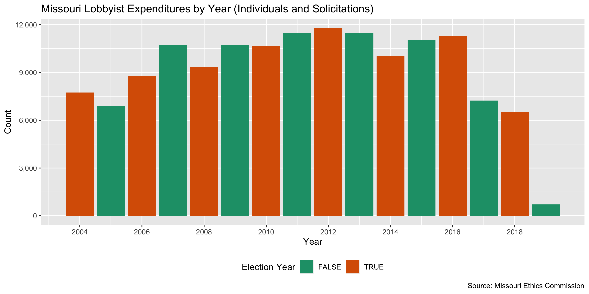
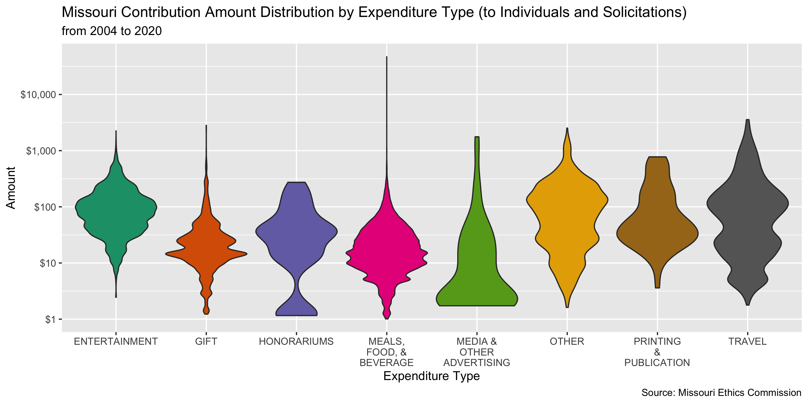
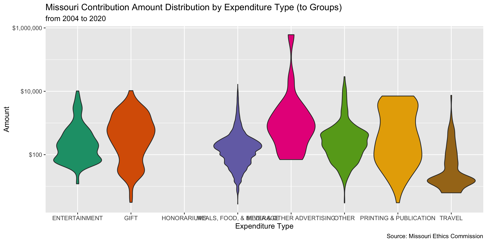
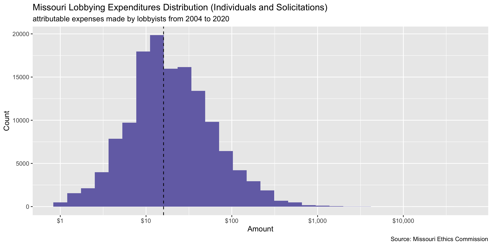

Missouri Lobbying Expenditure Diary
================
Yanqi Xu
2020-02-28 14:57:46

-   [Project](#project)
-   [Objectives](#objectives)
-   [Packages](#packages)
-   [Data](#data)
-   [Import](#import)
-   [Explore](#explore)
-   [Conclude](#conclude)
-   [Export](#export)

<!-- Place comments regarding knitting here -->
Project
-------

The Accountability Project is an effort to cut across data silos and give journalists, policy professionals, activists, and the public at large a simple way to search across huge volumes of public data about people and organizations.

Our goal is to standardizing public data on a few key fields by thinking of each dataset row as a transaction. For each transaction there should be (at least) 3 variables:

1.  All **parties** to a transaction.
2.  The **date** of the transaction.
3.  The **amount** of money involved.

Objectives
----------

This document describes the process used to complete the following objectives:

1.  How many records are in the database?
2.  Check for entirely duplicated records.
3.  Check ranges of continuous variables.
4.  Is there anything blank or missing?
5.  Check for consistency issues.
6.  Create a five-digit ZIP Code called `zip`.
7.  Create a `year` field from the transaction date.
8.  Make sure there is data on both parties to a transaction.

Packages
--------

The following packages are needed to collect, manipulate, visualize, analyze, and communicate these results. The `pacman` package will facilitate their installation and attachment.

The IRW's `campfin` package will also have to be installed from GitHub. This package contains functions custom made to help facilitate the processing of campaign finance data.

``` r
if (!require("pacman")) install.packages("pacman")
pacman::p_load_gh("irworkshop/campfin")
pacman::p_load(
  readxl, #read excel files
  rvest, # used to scrape website and get html elements
  tidyverse, # data manipulation
  stringdist, # calculate distances between strings
  lubridate, # datetime strings
  magrittr, # pipe opperators
  janitor, # dataframe clean
  refinr, # cluster and merge
  scales, # format strings
  knitr, # knit documents
  vroom, # read files fast
  httr, # http queries
  glue, # combine strings
  here, # relative storage
  fs # search storage 
)
```

This document should be run as part of the `R_campfin` project, which lives as a sub-directory of the more general, language-agnostic [`irworkshop/accountability_datacleaning`](https://github.com/irworkshop/accountability_datacleaning) GitHub repository.

The `R_campfin` project uses the [Rstudio projects](https://support.rstudio.com/hc/en-us/articles/200526207-Using-Projects "Rproj") feature and should be run as such. The project also uses the dynamic `here::here()` tool for file paths relative to *your* machine.

``` r
# where does this document knit?
here::here()
#> [1] "/Users/soc/accountability/accountability_datacleaning/R_campfin"
```

Data
----

The [Missouri Ethics Commission](https://jcope.ny.gov/lobbying-datasets) makes lobbyist expenditure data from 2004 to 2020 available for download. Note that data for 2019 onward exists in a separate search. The 2018 data and prior year's data exist in two separate files.

The `mo_lob_exp` data captures expenditures reported by a lobbyist made on behalf of any group or individual including a state public official, their employee/ staff, spouse/child, a department head and their staff, and a local elected official in a municipality with a budget over $10 million.

Import
------

### Setting up Raw Data Directory

``` r
raw_dir <- dir_create(here("mo", "lobby", "data", "raw","exp"))
```

### Read

The `xlsx` files we obtained actually contain two tabs, one for `individual/solicitation` and the other for `group`. The columns are slightly dififerent, and we will read them separately.

``` r
mo_lob_exp <- dir_ls(raw_dir) %>% str_subset("200.|201[^9]")  %>% map_dfr(read_xlsx, sheet = 1) %>% clean_names() %>% mutate_if(is.character, str_to_upper)
mo_lob_grp <- dir_ls(raw_dir) %>% str_subset("200.|201[^9]") %>% map_dfr(read_xlsx, sheet = 2) %>% clean_names() %>% mutate_if(is.character, str_to_upper)

mo_lob_19 <- dir_ls(raw_dir) %>% str_subset("2019") %>% map_dfr(read_xlsx) %>% clean_names() %>% mutate_if(is.character, str_to_upper)
```

According to the Missouri Ethics Commission,

> The recipient field is always the person who received the gift. If that person is an employee/staff/spouse/child of a public official the actual recipient is listed in the recipient field and the name of the associated public official is listed in the public official field. If the recipient of the gift is the public official their name is then listed in the recipient field only.

Explore
-------

``` r
head(mo_lob_exp)
#> # A tibble: 6 x 15
#>   lob_id lob_first_name lob_last_name report              public_official recipient
#>   <chr>  <chr>          <chr>         <dttm>              <chr>           <chr>    
#> 1 L0017… CONNIE J.      CIERPIOT      2004-01-01 00:00:00 <NA>            REINHART…
#> 2 L0006… GREGORY        TAYLOR        2004-01-01 00:00:00 <NA>            HAMPTON,…
#> 3 L0006… GREGORY        TAYLOR        2004-01-01 00:00:00 <NA>            WARD, DA…
#> 4 L0006… GREGORY        TAYLOR        2004-01-01 00:00:00 <NA>            HUNTER, …
#> 5 L0006… GREGORY        TAYLOR        2004-01-01 00:00:00 <NA>            DEMPSEY,…
#> 6 L0006… GREGORY        TAYLOR        2004-01-01 00:00:00 <NA>            ANGST, R…
#> # … with 9 more variables: date <dttm>, type <chr>, description <chr>, amount <dbl>,
#> #   principal <chr>, amend_reason <chr>, ind_id <dbl>, amend_ind_id <dbl>, expenditure_type <chr>
tail(mo_lob_exp)
#> # A tibble: 6 x 15
#>   lob_id lob_first_name lob_last_name report              public_official recipient
#>   <chr>  <chr>          <chr>         <dttm>              <chr>           <chr>    
#> 1 L0029… BRAD           BATES         2018-05-01 00:00:00 DOORMAN - PUBL… JOHN SCH…
#> 2 L0005… MARK J         RHOADS        2018-11-01 00:00:00 RICHARD, RON  … MRS. PAT…
#> 3 L0029… BRAD           BATES         2018-05-01 00:00:00 DOORMAN - PUBL… J.O. RAC…
#> 4 L0029… BRAD           BATES         2018-05-01 00:00:00 DOORMAN - PUBL… GAIL JON…
#> 5 L0005… MARK J         RHOADS        2018-09-01 00:00:00 <NA>            RICHARD,…
#> 6 L0005… MARK J         RHOADS        2018-11-01 00:00:00 <NA>            RICHARD,…
#> # … with 9 more variables: date <dttm>, type <chr>, description <chr>, amount <dbl>,
#> #   principal <chr>, amend_reason <chr>, ind_id <dbl>, amend_ind_id <dbl>, expenditure_type <chr>
glimpse(sample_n(mo_lob_exp, 20))
#> Observations: 20
#> Variables: 15
#> $ lob_id           <chr> "L000523", "L000299", "L000159", "L000349", "L001075C", "L001839A", "L0…
#> $ lob_first_name   <chr> "D SCOTT", "WILLIAM A", "TERRY W", "STEVE", "DONALD C", "SHARON GEUEA",…
#> $ lob_last_name    <chr> "PENMAN", "GAMBLE", "BRIGGS", "JACKSON", "OTTO JR", "JONES", "BURCH", "…
#> $ report           <dttm> 2015-01-01, 2006-04-01, 2009-10-01, 2011-07-01, 2012-02-01, 2010-03-01…
#> $ public_official  <chr> NA, NA, NA, NA, "GUEST - PUBLIC OFFICIAL", NA, "FAITH, SALLY A. - REPRE…
#> $ recipient        <chr> "LAFAVER, JEREMY  - REPRESENTATIVE", "KLINDT, DAVID - SENATOR", "LEMBKE…
#> $ date             <dttm> 2015-01-28, 2006-04-23, 2009-10-27, 2011-07-24, 2012-02-28, 2010-03-03…
#> $ type             <chr> "MEALS, FOOD, & BEVERAGE", "MEALS, FOOD, & BEVERAGE", "MEALS, FOOD, & B…
#> $ description      <chr> "DINNER MEETING", "NULL", "LUNCH", "THE CITY ADMINISTRATOR OF MY CLIENT…
#> $ amount           <dbl> 26.05, 16.00, 9.75, 2.48, 2.00, 40.56, 13.29, 46.00, 40.00, 39.00, -57.…
#> $ principal        <chr> "PENMAN & WINTON CONSULTING", "MISSOURI BEVERAGE ASSOCIATION", "SITE IM…
#> $ amend_reason     <chr> NA, "NULL", "NULL", NA, NA, NA, "NULL", NA, NA, NA, "NOT INDIVIDUAL CHA…
#> $ ind_id           <dbl> 49445, 3534, 8712, 16596, 21641, 3893, 2966, 37825, 8556, 13273, 2446, …
#> $ amend_ind_id     <dbl> 0, 0, 0, 0, 0, 0, 0, 0, 0, 0, 1957, 0, 0, 0, 0, 0, 0, 0, 0, 0
#> $ expenditure_type <chr> "INDIVIDUAL", "INDIVIDUAL", "INDIVIDUAL", "INDIVIDUAL", "INDIVIDUAL", "…

head(mo_lob_grp)
#> # A tibble: 6 x 13
#>   lob_id lob_first_name lob_last_name report              group date                type 
#>   <chr>  <chr>          <chr>         <dttm>              <chr> <dttm>              <chr>
#> 1 L0005… RANDY J        SCHERR        2004-07-01 00:00:00 ENTI… 2004-07-27 00:00:00 MEAL…
#> 2 L0005… RANDY J        SCHERR        2004-07-01 00:00:00 ENTI… 2004-07-27 00:00:00 MEAL…
#> 3 L0005… RANDY J        SCHERR        2004-07-01 00:00:00 ENTI… 2004-07-27 00:00:00 MEAL…
#> 4 L0005… RANDY J        SCHERR        2004-07-01 00:00:00 ENTI… 2004-07-27 00:00:00 MEAL…
#> 5 L0017… GARY           MARBLE        2004-07-01 00:00:00 HOUS… 2004-07-27 00:00:00 MEAL…
#> 6 L0005… JIM            RUSSELL       2004-01-01 00:00:00 WEST… 2004-01-27 00:00:00 MEAL…
#> # … with 6 more variables: description <chr>, amount <dbl>, principal <chr>, amend_reason <chr>,
#> #   gro_id <dbl>, amend_gro_id <dbl>
tail(mo_lob_grp)
#> # A tibble: 6 x 13
#>   lob_id lob_first_name lob_last_name report              group date                type 
#>   <chr>  <chr>          <chr>         <dttm>              <chr> <dttm>              <chr>
#> 1 L0036… JOHN E         JUNGMANN      2018-12-01 00:00:00 ENTI… 2018-12-11 00:00:00 MEAL…
#> 2 L0018… JEWELL D. H.   PATEK         2018-12-01 00:00:00 ENTI… 2018-12-01 00:00:00 MEAL…
#> 3 L0005… JENNIFER       DURHAM        2018-12-01 00:00:00 ENTI… 2018-12-04 00:00:00 MEAL…
#> 4 L0016… JAMES M.       FOLEY         2018-11-01 00:00:00 ENTI… 2018-11-27 00:00:00 ENTE…
#> 5 L0039… BJ             TANKSLEY      2018-12-01 00:00:00 ENTI… 2018-12-02 00:00:00 MEAL…
#> 6 L0039… BJ             TANKSLEY      2018-12-01 00:00:00 ENTI… 2018-12-03 00:00:00 MEAL…
#> # … with 6 more variables: description <chr>, amount <dbl>, principal <chr>, amend_reason <chr>,
#> #   gro_id <dbl>, amend_gro_id <dbl>
glimpse(sample_n(mo_lob_grp, 20))
#> Observations: 20
#> Variables: 13
#> $ lob_id         <chr> "L000127", "L000580", "L003084", "L002248A", "L000299", "L001096", "L0005…
#> $ lob_first_name <chr> "SAM", "JORGEN", "SUSAN HENDERSON", "CHARLES G", "WILLIAM A", "BETH M", "…
#> $ lob_last_name  <chr> "BARBEE", "SCHLEMEIER", "MOORE", "SIMINO", "GAMBLE", "WHEELER", "SCRUGGS"…
#> $ report         <dttm> 2005-01-01, 2010-01-01, 2013-05-01, 2014-02-01, 2010-04-01, 2006-03-01, …
#> $ group          <chr> "DEMOCRAT FRESHMAN CAUCUS", "JOB CREATION AND ECONOMIC DEVELOPMENT, STAND…
#> $ date           <dttm> 2005-01-05, 2010-01-19, 2013-05-09, 2014-02-11, 2010-04-21, 2006-03-28, …
#> $ type           <chr> "MEALS, FOOD, & BEVERAGE", "MEALS, FOOD, & BEVERAGE", "GIFT", "MEALS, FOO…
#> $ description    <chr> "NULL", "DINNER", "MOTHER'S DAY FLOWERS SENT TO THE CAPITOL FOR FEMALE ME…
#> $ amount         <dbl> 112.50, 114.09, 23.80, 322.10, 62.76, 144.00, 200.00, 58.48, 186.27, 36.1…
#> $ principal      <chr> "MISSOURI AUTOMOBILE DEALERS ASSOCIATION", "MISSOURI RAILROAD ASSOCIATION…
#> $ amend_reason   <chr> "NULL", "NULL", "NULL", "NULL", "NULL", "NULL", "NULL", "NULL", "NULL", "…
#> $ gro_id         <dbl> 191, 49, 6603, 7159, 768, 734, 839, 4820, 7176, 2268, 882, 7922, 1095, 70…
#> $ amend_gro_id   <dbl> 0, 0, 0, 0, 0, 0, 0, 0, 0, 0, 0, 0, 0, 0, 0, 0, 0, 0, 0, 0
```

### Missing

Not many fields have missing records. However, we can convert the `NULL` entries to *NAs*.

``` r
col_stats(mo_lob_exp, count_na)
#> # A tibble: 15 x 4
#>    col              class      n     p
#>    <chr>            <chr>  <int> <dbl>
#>  1 lob_id           <chr>      0 0    
#>  2 lob_first_name   <chr>      0 0    
#>  3 lob_last_name    <chr>      0 0    
#>  4 report           <dttm>     0 0    
#>  5 public_official  <chr>  95891 0.658
#>  6 recipient        <chr>      0 0    
#>  7 date             <dttm>     0 0    
#>  8 type             <chr>      0 0    
#>  9 description      <chr>  40827 0.280
#> 10 amount           <dbl>      0 0    
#> 11 principal        <chr>      0 0    
#> 12 amend_reason     <chr>  76441 0.524
#> 13 ind_id           <dbl>      0 0    
#> 14 amend_ind_id     <dbl>      0 0    
#> 15 expenditure_type <chr>      0 0
col_stats(mo_lob_grp, count_na)
#> # A tibble: 13 x 4
#>    col            class      n        p
#>    <chr>          <chr>  <int>    <dbl>
#>  1 lob_id         <chr>      0 0       
#>  2 lob_first_name <chr>      0 0       
#>  3 lob_last_name  <chr>      0 0       
#>  4 report         <dttm>     0 0       
#>  5 group          <chr>     21 0.000844
#>  6 date           <dttm>     0 0       
#>  7 type           <chr>      0 0       
#>  8 description    <chr>   2888 0.116   
#>  9 amount         <dbl>      0 0       
#> 10 principal      <chr>      0 0       
#> 11 amend_reason   <chr>      0 0       
#> 12 gro_id         <dbl>      0 0       
#> 13 amend_gro_id   <dbl>      0 0

mo_lob_grp <- mo_lob_grp %>% 
  mutate(amend_reason = na_if(amend_reason, "NULL"),
         description = na_if(description, "NULL"))

mo_lob_exp <- mo_lob_exp %>% 
  mutate(amend_reason = na_if(amend_reason, "NULL"),
         description = na_if(description, "NULL"))

mo_lob_19 <- mo_lob_19 %>% 
  mutate_if(is.character, na_if, "NULL") %>% 
  mutate_if(is.character, na_if, "N/A")
```

We will flag records missing recipient/group, principal, amount.

``` r
mo_lob_exp <- mo_lob_exp %>% 
  flag_na(c(recipient, principal, amount,date))

mo_lob_grp <- mo_lob_grp %>% 
  flag_na(c(group, principal, amount,date))
```

### Duplicates

Running the following commands shows that there are over a thousand entries with totally identical information. Since each of them contain `total_compensation` and `total_reimbursed` for a certain period, there should be only one such entry for each corresponding time period. We will note that in the `dupe_flag` column.

``` r
mo_lob_exp <- flag_dupes(mo_lob_exp, dplyr::everything())
sum(mo_lob_exp$dupe_flag)
#> [1] 46
```

``` r
mo_lob_grp <- flag_dupes(mo_lob_grp, dplyr::everything())
sum(mo_lob_grp$dupe_flag)
#> [1] 12
```

### Categorical

First, we will create a `year` variable.

``` r
mo_lob_exp <- mo_lob_exp %>% 
  mutate(date = as.Date(date, format = "%m/%d/%Y"),
         year = year(date))

mo_lob_grp <- mo_lob_grp %>% 
  mutate(date = as.Date(date, format = "%m/%d/%Y"),
         year = year(date))

mo_lob_19 <- mo_lob_19 %>% 
  mutate(year = year(expenditure_date))
```

#### No. of expenditures

Visualize number of expenses each year. We can see that some of the year variable is not valid, with values greater than 2200. We will manually filter these entries out before visualizing the data. 

``` r
 mo_lob_grp %>% 
  count(year) %>% 
  filter(year > 2003 & year < 2020) %>% 
    bind_rows(mo_lob_19 %>% filter(expenditure_type == "GROUP") %>% count(year)) %>% 
  mutate(even = is_even(year)) %>% 
  ggplot(aes(x = year, y = n)) +
  geom_col(aes(fill = even)) + 
  scale_fill_brewer(palette = "Dark2") +
  scale_y_continuous(labels = comma) +
  scale_x_continuous(breaks = seq(2004, 2019, by = 2)) +
  theme(legend.position = "bottom") +
  labs(
    title = "Missouri Lobbyist Expenditures by Year (Groups)",
    caption = "Source: Missouri Ethics Commission",
    fill = "Election Year",
    x = "Year",
    y = "Count"
  )
```


#### Expenditure Type


### Continuous

First, let's take a look at the distribution of the amount by expenditure type








Conclude
--------

``` r
glimpse(sample_n(mo_lob_exp, 20))
#> Observations: 20
#> Variables: 18
#> $ lob_id           <chr> "L001855", "L000299", "L001988", "L000993", "L001708", "L002043", "L000…
#> $ lob_first_name   <chr> "STEPHEN C.", "WILLIAM A", "NIKKI R", "JAMES P", "CHRIS", "SANDY", "J C…
#> $ lob_last_name    <chr> "KNORR", "GAMBLE", "STRONG", "BROWN", "LIESE", "HOWARD", "STRAUB", "GAM…
#> $ report           <dttm> 2006-04-01, 2012-01-01, 2015-05-01, 2013-05-01, 2015-07-01, 2015-01-01…
#> $ public_official  <chr> NA, NA, "EGGLESTON, J - REPRESENTATIVE", NA, "GOSEN, DON  - REPRESENTAT…
#> $ recipient        <chr> "PRATT, BRYAN - REPRESENTATIVE", "SCHARNHORST, DWIGHT D. - REPRESENTATI…
#> $ date             <date> 2006-04-11, 2012-01-24, 2015-05-05, 2013-05-06, 2015-07-09, 2015-01-23…
#> $ type             <chr> "MEALS, FOOD, & BEVERAGE", "MEALS, FOOD, & BEVERAGE", "MEALS, FOOD, & B…
#> $ description      <chr> NA, "NON-ALCOHOLIC BEVERAGES", "END OF SESSION MEAL", NA, NA, "CHAMBER …
#> $ amount           <dbl> 35.65, 26.00, 11.87, 30.15, 103.41, 10.00, 18.75, 72.00, 75.00, 29.98, …
#> $ principal        <chr> "UNIVERSITY OF MISSOURI", "MISSOURI BEVERAGE ASSOCIATION", "MISSOURI HE…
#> $ amend_reason     <chr> NA, NA, NA, NA, "NEW ENTRY", NA, NA, NA, NA, NA, NA, NA, NA, "NEW ENTRY…
#> $ ind_id           <dbl> 3066, 19753, 54992, 36239, 57400, 49425, 40, 1535, 75248, 1384, 33247, …
#> $ amend_ind_id     <dbl> 0, 0, 0, 0, 0, 0, 0, 0, 0, 0, 0, 0, 0, 0, 0, 0, 0, 0, 0, 0
#> $ expenditure_type <chr> "INDIVIDUAL", "INDIVIDUAL", "INDIVIDUAL", "INDIVIDUAL", "INDIVIDUAL", "…
#> $ na_flag          <lgl> FALSE, FALSE, FALSE, FALSE, FALSE, FALSE, FALSE, FALSE, FALSE, FALSE, F…
#> $ dupe_flag        <lgl> FALSE, FALSE, FALSE, FALSE, FALSE, FALSE, FALSE, FALSE, FALSE, FALSE, F…
#> $ year             <dbl> 2006, 2012, 2015, 2013, 2015, 2015, 2006, 2004, 2017, 2007, 2013, 2014,…
glimpse(sample_n(mo_lob_grp, 20))
#> Observations: 20
#> Variables: 16
#> $ lob_id         <chr> "L000128", "L003105", "L002808", "L000299", "L000179", "L003122", "L00070…
#> $ lob_first_name <chr> "JOHN E", "CHRIS", "MARK F", "WILLIAM A", "CALVIN W", "MIKE", "PHIL", "JO…
#> $ lob_last_name  <chr> "BARDGETT JR", "ROEPE", "HABBAS", "GAMBLE", "CALL", "LODEWEGEN", "WRIGHT"…
#> $ report         <dttm> 2005-02-01, 2013-08-01, 2016-05-01, 2013-02-01, 2006-02-01, 2014-01-01, …
#> $ group          <chr> "APPROPRIATIONS - GENERAL ADMINISTRATION - STANDING", "HOUSE MINORITY CAU…
#> $ date           <date> 2005-02-01, 2013-08-24, 2016-05-04, 2013-02-26, 2006-02-28, 2014-01-14, …
#> $ type           <chr> "MEALS, FOOD, & BEVERAGE", "MEALS, FOOD, & BEVERAGE", "MEALS, FOOD, & BEV…
#> $ description    <chr> NA, "CAUCUS MEETING", "SENATE CRAB BOIL EVENT", "MISSOURI STATE CAPITOL, …
#> $ amount         <dbl> 94.97, 2500.00, 655.00, 80.26, 15.00, 160.33, 188.08, -1581.00, 250.00, 1…
#> $ principal      <chr> "JOHN BARDGETT & ASSOCIATES, INC.", "FAIR ENERGY RATE ACTION FUND", "MISS…
#> $ amend_reason   <chr> NA, NA, NA, NA, NA, NA, NA, "MISCALCULATED THE AMOUNT", NA, NA, NA, NA, N…
#> $ gro_id         <dbl> 404, 6840, 9562, 5776, 470, 7099, 1935, 1555, 774, 771, 6716, 1482, 8093,…
#> $ amend_gro_id   <dbl> 0, 0, 0, 0, 0, 0, 0, 1552, 0, 0, 0, 0, 0, 0, 0, 0, 0, 0, 0, 0
#> $ na_flag        <lgl> FALSE, FALSE, FALSE, FALSE, FALSE, FALSE, FALSE, FALSE, FALSE, FALSE, FAL…
#> $ dupe_flag      <lgl> FALSE, FALSE, FALSE, FALSE, FALSE, FALSE, FALSE, FALSE, FALSE, FALSE, FAL…
#> $ year           <dbl> 2005, 2013, 2016, 2013, 2006, 2014, 2011, 2007, 2010, 2006, 2013, 2010, 2…
```

1.  There are 145776 records in the individual/solicitation database, and 24882 in the group database.
2.  There are 46 duplicate records in the individual/solicitation database, and 0 in the group database.
3.  The range and distribution of `amount` and `date` seem reasonable with a few anomalies.
4.  There are 0 records missing recipient, principal, amount or date, and 0 records missing group, principal, amount or date.
5.  The 4-digit `YEAR` variable has been created with `lubridate::year()`.

Export
------

``` r
clean_dir <- dir_create(here("mo", "lobby", "data", "reg","clean"))
```

``` r
write_csv(
  x = mo_lob_exp,
  path = path(clean_dir, "mo_lob_exp_clean.csv"),
  na = ""
)

write_csv(
  x = mo_lob_grp,
  path = path(clean_dir, "mo_lob_grp_clean.csv"),
  na = ""
)

write_csv(
  x = mo_lob_19,
  path = path(clean_dir, "mo_lob_exp_new.csv"),
  na = ""
)
```
