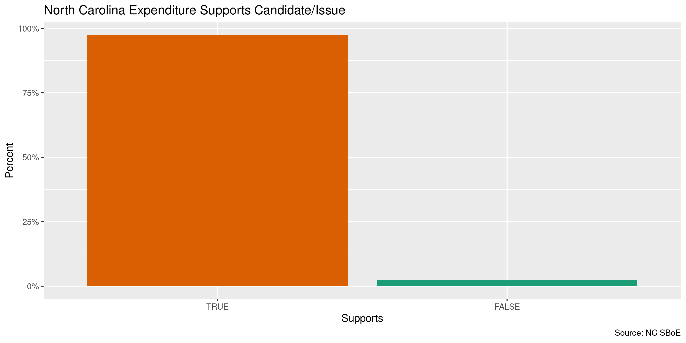
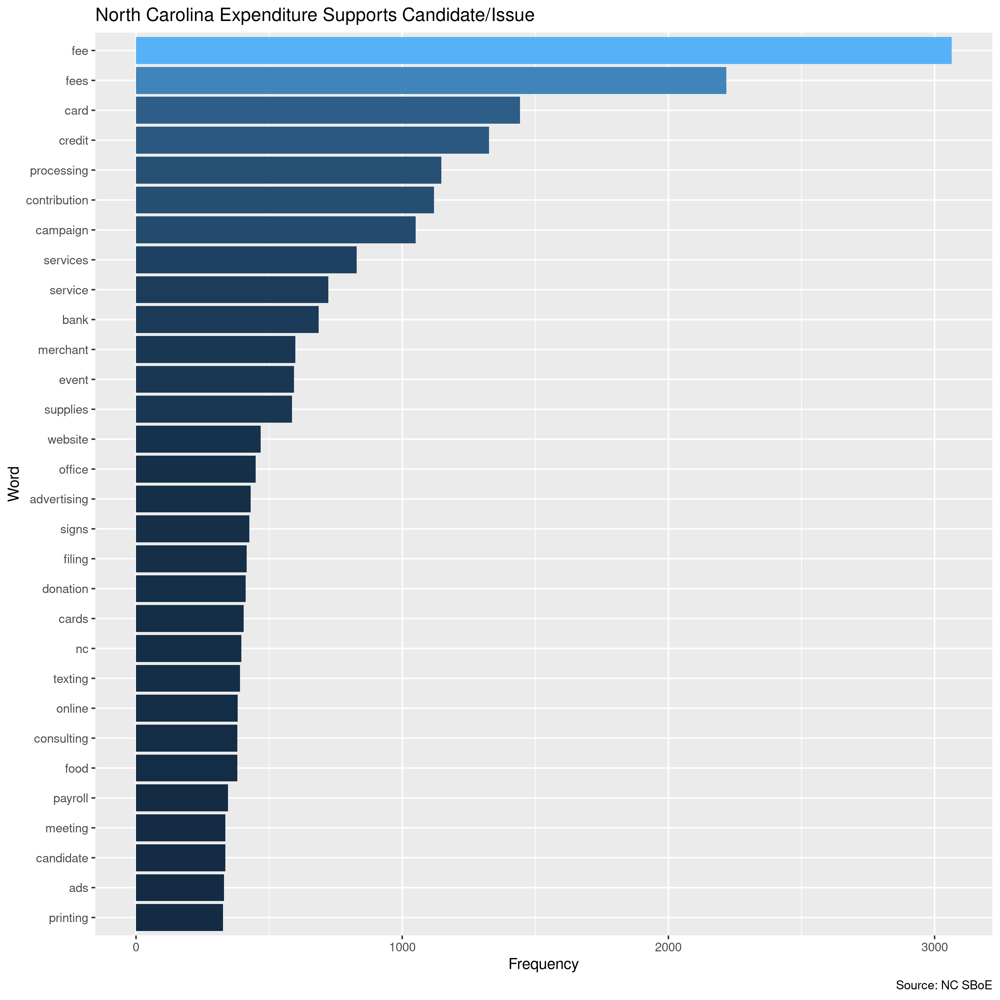
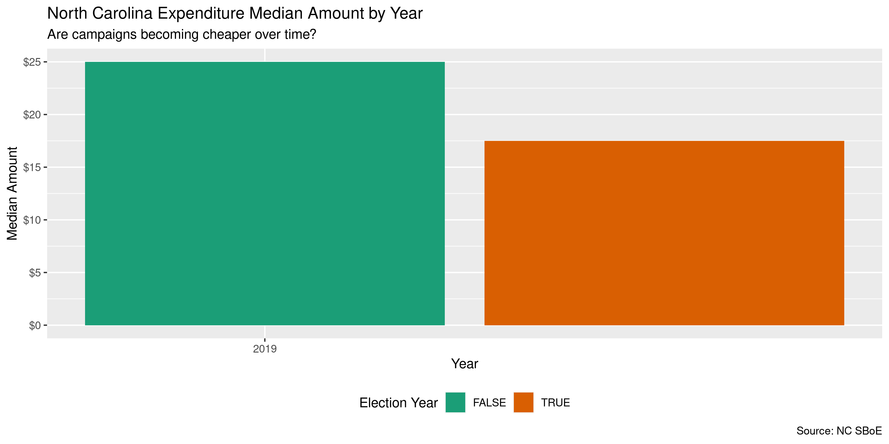
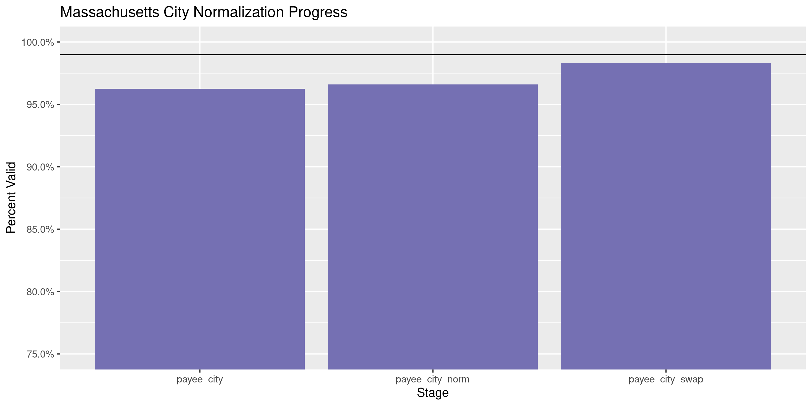
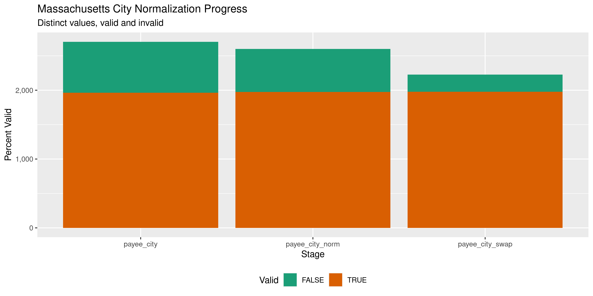

North Carolina Expenditures
================
Kiernan Nicholls
2020-04-28 13:33:09

## Project

The Accountability Project is an effort to cut across data silos and
give journalists, policy professionals, activists, and the public at
large a simple way to search across huge volumes of public data about
people and organizations.

Our goal is to standardizing public data on a few key fields by thinking
of each dataset row as a transaction. For each transaction there should
be (at least) 3 variables:

1.  All **parties** to a transaction
2.  The **date** of the transaction
3.  The **amount** of money involved

## Objectives

This document describes the process used to complete the following
objectives:

1.  How many records are in the database?
2.  Check for duplicates
3.  Check ranges
4.  Is there anything blank or missing?
5.  Check for consistency issues
6.  Create a five-digit ZIP Code called `ZIP5`
7.  Create a `YEAR` field from the transaction date
8.  Make sure there is data on both parties to a transaction

## Packages

The following packages are needed to collect, manipulate, visualize,
analyze, and communicate these results. The `pacman` package will
facilitate their installation and attachment.

The IRW’s `campfin` package will also have to be installed from GitHub.
This package contains functions custom made to help facilitate the
processing of campaign finance data.

``` r
if (!require("pacman")) install.packages("pacman")
pacman::p_load_gh("irworkshop/campfin")
pacman::p_load(
  tidyverse, # data manipulation
  lubridate, # datetime strings
  magrittr, # pipe opperators
  tidytext, # text analysis
  janitor, # dataframe clean
  batman, # parse logical
  refinr, # cluster and merge
  scales, # format strings
  rvest, # read html files
  knitr, # knit documents
  vroom, # read files fast
  glue, # combine strings
  here, # relative storage
  fs # search storage 
)
```

This document should be run as part of the `R_campfin` project, which
lives as a sub-directory of the more general, language-agnostic
\[`irworkshop/accountability_datacleaning`\]\[01\] GitHub repository.

The `R_campfin` project uses the \[RStudio projects\]\[02\] feature and
should be run as such. The project also uses the dynamic `here::here()`
tool for file paths relative to *your* machine.

``` r
# where does this document knit?
here::here()
#> [1] "/home/kiernan/Code/accountability_datacleaning/R_campfin"
```

## Data

Data is obtained from the North Carolina State Board of Elections (NC
SBoE).

> The State Board of Elections (State Board) is the state agency charged
> with the administration of the elections process and campaign finance
> disclosure and compliance.

> The state’s Campaign Reporting Act applies to:
> 
>   - all candidates for public office;  
>   - all political party groups and political action committees;  
>   - all groups organized to support or oppose a referendum;  
>   - every person or group participating in activities that support or
>     oppose the nomination or election of one or more clearly
>     identified candidates, or a political party or a referendum.

### Download

To download the data, perform a [Transaction Entity
Search](https://cf.ncsbe.gov/CFTxnLkup/) for type “Expenditure” from
2008-01-01 to 2020-04-28.

> This page allows for searching through the NC SBoE Campaign Finance
> database of transactions that committees have received (Receipts) or
> spent (Expenditures). Report data that is imported does not appear on
> our website in real-time. Our website updates overnight each
> weeknight. All data imported during a business day will appear on our
> website the following day.

``` r
raw_dir <- dir_create(here("nc", "expends", "data", "raw")) 
```

### Read

``` r
nc <- read_csv(
  file = path(raw_dir, "transinq_results.csv"),
  na = c("NA", "", "Not Available"),
  skip = 1,
  col_names = c(
    "payee_name",
    "payee_street1",
    "payee_street2",
    "payee_city",
    "payee_state",
    "payee_zip",
    "profession",
    "employer",
    "transction_type",
    "comm_name",
    "comm_id",
    "comm_street1",
    "comm_street2",
    "comm_city",
    "comm_state",
    "comm_zip",
    "report_name",
    "date",
    "account_code",
    "amount",
    "form_of_payment",
    "purpose",
    "referendum_name",
    "declaration",
    "supports"
  ),
  col_types = cols(
    .default = col_character(),
    date = col_date_usa(),
    amount = col_double()
  )
) %>% 
  mutate_if(is_character, str_to_upper) %>% 
  mutate(supports = equals(declaration, "SUPPORT"))
```

## Explore

``` r
head(nc)
```

    #> # A tibble: 6 x 25
    #>   payee_name payee_street1 payee_street2 payee_city payee_state payee_zip profession employer
    #>   <chr>      <chr>         <chr>         <chr>      <chr>       <chr>     <chr>      <chr>   
    #> 1 AGGREGATE… <NA>          <NA>          <NA>       <NA>        <NA>      <NA>       <NA>    
    #> 2 AGGREGATE… <NA>          <NA>          <NA>       <NA>        <NA>      <NA>       <NA>    
    #> 3 AGGREGATE… <NA>          <NA>          <NA>       <NA>        <NA>      <NA>       <NA>    
    #> 4 AGGREGATE… <NA>          <NA>          <NA>       <NA>        <NA>      <NA>       <NA>    
    #> 5 AGGREGATE… <NA>          <NA>          <NA>       <NA>        <NA>      <NA>       <NA>    
    #> 6 AGGREGATE… <NA>          <NA>          <NA>       <NA>        <NA>      <NA>       <NA>    
    #> # … with 17 more variables: transction_type <chr>, comm_name <chr>, comm_id <chr>,
    #> #   comm_street1 <chr>, comm_street2 <chr>, comm_city <chr>, comm_state <chr>, comm_zip <chr>,
    #> #   report_name <chr>, date <date>, account_code <chr>, amount <dbl>, form_of_payment <chr>,
    #> #   purpose <chr>, referendum_name <chr>, declaration <chr>, supports <lgl>

``` r
tail(nc)
```

    #> # A tibble: 6 x 25
    #>   payee_name payee_street1 payee_street2 payee_city payee_state payee_zip profession employer
    #>   <chr>      <chr>         <chr>         <chr>      <chr>       <chr>     <chr>      <chr>   
    #> 1 DAVID ZWE… 2907 WOODSTO… <NA>          SILVER SP… MD          20910     PHYSICIAN  MONTG C…
    #> 2 CASSIE ZW… 507 PINE HUR… <NA>          HAMPSTEAD  NC          28443-38… REAL ESTA… CENTURY…
    #> 3 STEPHEN Z… 141 HERMANCE… <NA>          MOORESVIL… NC          28117     MANUFACTU… PROFILE…
    #> 4 TATIANA Z… 562 LINDLEY … <NA>          GREENSBORO NC          27410     RETIRED    RETIRED 
    #> 5 MAUREEN M… 2704 WESTHAM… <NA>          RALEIGH    NC          27604-48… ATTORNEY   PARKER …
    #> 6 LISA ZYWI… 1229 CANTERB… <NA>          RALEIGH    NC          27608     FINANCIAL… RETIRED 
    #> # … with 17 more variables: transction_type <chr>, comm_name <chr>, comm_id <chr>,
    #> #   comm_street1 <chr>, comm_street2 <chr>, comm_city <chr>, comm_state <chr>, comm_zip <chr>,
    #> #   report_name <chr>, date <date>, account_code <chr>, amount <dbl>, form_of_payment <chr>,
    #> #   purpose <chr>, referendum_name <chr>, declaration <chr>, supports <lgl>

``` r
glimpse(sample_frac(nc))
```

    #> Rows: 176,806
    #> Columns: 25
    #> $ payee_name      <chr> "AGGREGATED INDIVIDUAL CONTRIBUTION", "AGGREGATED INDIVIDUAL CONTRIBUTIO…
    #> $ payee_street1   <chr> NA, NA, "1652 LAWRENCE CIRCLE", "5500 MCNEELY DR #103", "3005 VALLEYSTON…
    #> $ payee_street2   <chr> NA, NA, NA, NA, NA, NA, NA, NA, NA, NA, NA, NA, NA, NA, NA, NA, NA, "# 1…
    #> $ payee_city      <chr> NA, NA, "DAYTONA BEACH", "RALEIGH", "CARY", NA, "HILLSBOROUGH", NA, "CAR…
    #> $ payee_state     <chr> NA, NA, "FL", "NC", "NC", NA, "NC", NA, "NC", "NC", "NC", "NC", "MD", "N…
    #> $ payee_zip       <chr> NA, NA, "32117", "27612", "27519", NA, "27278-9566", NA, "27519-6355", "…
    #> $ profession      <chr> NA, NA, NA, NA, "NOT EMPLOYED", NA, "REAL ESTATE BROKER", NA, "REAL ESTA…
    #> $ employer        <chr> NA, NA, "RETIRED", NA, "NOT EMPLOYED", NA, "COLDWELL BANKER HPW", NA, "K…
    #> $ transction_type <chr> "INDIVIDUAL", "INDIVIDUAL", "INDIVIDUAL", "OPERATING EXP", "INDIVIDUAL",…
    #> $ comm_name       <chr> "CAMPAIGN TO ELECT DONNA ENSLEY", "NC ASSN OF ELECTRIC COOPERATIVES RURA…
    #> $ comm_id         <chr> "BUN-7957B9-C-001", "STA-C3341N-C-001", "STA-C0498N-C-002", "STA-53C1KP-…
    #> $ comm_street1    <chr> "2385 HENDERSONVILLE RD.", "P. O. BOX 26566", "434 FAYETTEVILLE ST   SUI…
    #> $ comm_street2    <chr> NA, NA, NA, NA, NA, NA, "SUITE 1109", NA, "SUITE 1109", NA, NA, "SUITE 1…
    #> $ comm_city       <chr> "ARDEN", "RALEIGH", "RALEIGH", "MORGANTON", "RALEIGH", "RALEIGH", "GREEN…
    #> $ comm_state      <chr> "NC", "NC", "NC", "NC", "NC", "NC", "NC", "NC", "NC", "NC", "NC", "NC", …
    #> $ comm_zip        <chr> "28704", "27611", "27601", "28680", "27601", "27601", "27407", "27601", …
    #> $ report_name     <chr> "2020 FIRST QUARTER", "2019 YEAR END SEMI-ANNUAL (AMENDMENT)", "2020 FIR…
    #> $ date            <date> 2020-01-21, 2019-12-19, 2020-02-03, 2020-01-16, 2020-01-21, 2020-01-15,…
    #> $ account_code    <chr> NA, NA, NA, NA, NA, NA, NA, NA, NA, NA, NA, NA, NA, NA, NA, NA, NA, NA, …
    #> $ amount          <dbl> 25.00, 25.00, 50.00, 130.00, 50.00, 0.50, 17.50, 0.40, 17.50, 100.00, 11…
    #> $ form_of_payment <chr> "CHECK", "CHECK", "CHECK", "CHECK", "CREDIT CARD", NA, "CHECK", NA, "CHE…
    #> $ purpose         <chr> NA, NA, NA, "DONATION - 26 BIBLES", NA, NA, NA, NA, NA, NA, NA, NA, NA, …
    #> $ referendum_name <chr> NA, NA, NA, NA, NA, NA, NA, NA, NA, NA, NA, NA, NA, NA, NA, NA, NA, NA, …
    #> $ declaration     <chr> NA, NA, NA, NA, NA, NA, NA, NA, NA, NA, NA, NA, NA, NA, NA, NA, NA, NA, …
    #> $ supports        <lgl> NA, NA, NA, NA, NA, NA, NA, NA, NA, NA, NA, NA, NA, NA, NA, NA, NA, NA, …

### Missing

``` r
glimpse_fun(nc, count_na)
```

    #> # A tibble: 25 x 4
    #>    col             type        n         p
    #>    <chr>           <chr>   <dbl>     <dbl>
    #>  1 payee_name      <chr>       4 0.0000226
    #>  2 payee_street1   <chr>   76497 0.433    
    #>  3 payee_street2   <chr>  168520 0.953    
    #>  4 payee_city      <chr>   76194 0.431    
    #>  5 payee_state     <chr>   73211 0.414    
    #>  6 payee_zip       <chr>   76833 0.435    
    #>  7 profession      <chr>   98219 0.556    
    #>  8 employer        <chr>  100429 0.568    
    #>  9 transction_type <chr>       3 0.0000170
    #> 10 comm_name       <chr>       3 0.0000170
    #> 11 comm_id         <chr>       3 0.0000170
    #> 12 comm_street1    <chr>       3 0.0000170
    #> 13 comm_street2    <chr>  155191 0.878    
    #> 14 comm_city       <chr>       3 0.0000170
    #> 15 comm_state      <chr>       3 0.0000170
    #> 16 comm_zip        <chr>       3 0.0000170
    #> 17 report_name     <chr>       3 0.0000170
    #> 18 date            <date>      3 0.0000170
    #> 19 account_code    <chr>  176806 1        
    #> 20 amount          <dbl>       3 0.0000170
    #> 21 form_of_payment <chr>   19991 0.113    
    #> 22 purpose         <chr>  153945 0.871    
    #> 23 referendum_name <chr>  176727 1.00     
    #> 24 declaration     <chr>  176727 1.00     
    #> 25 supports        <lgl>  176727 1.00

There seems to be a regular block of records missing the variables
needed to properly identify a transaction. We can flag those
expenditures with `campfin::flag_na()`.

``` r
nc <- nc %>% flag_na(payee_name, comm_name, date, amount)
sum(nc$na_flag)
```

    #> [1] 5

``` r
percent(mean(nc$na_flag))
```

    #> [1] "0%"

### Duplicates

There are a fairly significant number of duplicate records in the
database. It’s possible for a committee to make multiple legitimate
expenditures to the same vendor, on the same day, for the same amount.
Still, we will flag these records with `campfin::dupe_flag()`.

``` r
nc <- flag_dupes(nc, everything())
sum(nc$dupe_flag)
```

    #> [1] 58532

``` r
percent(mean(nc$dupe_flag))
```

    #> [1] "33%"

### Categorical

We can check the distribution of categorical variables to gain a better
understanding as to what kind of expenditures are being made.

``` r
glimpse_fun(nc, n_distinct)
```

    #> # A tibble: 27 x 4
    #>    col             type       n          p
    #>    <chr>           <chr>  <dbl>      <dbl>
    #>  1 payee_name      <chr>  55379 0.313     
    #>  2 payee_street1   <chr>  51389 0.291     
    #>  3 payee_street2   <chr>   2188 0.0124    
    #>  4 payee_city      <chr>   2704 0.0153    
    #>  5 payee_state     <chr>     57 0.000322  
    #>  6 payee_zip       <chr>  20591 0.116     
    #>  7 profession      <chr>   7280 0.0412    
    #>  8 employer        <chr>  16468 0.0931    
    #>  9 transction_type <chr>     21 0.000119  
    #> 10 comm_name       <chr>   1467 0.00830   
    #> 11 comm_id         <chr>   1466 0.00829   
    #> 12 comm_street1    <chr>   1370 0.00775   
    #> 13 comm_street2    <chr>     83 0.000469  
    #> 14 comm_city       <chr>    291 0.00165   
    #> 15 comm_state      <chr>     23 0.000130  
    #> 16 comm_zip        <chr>    556 0.00314   
    #> 17 report_name     <chr>     38 0.000215  
    #> 18 date            <date>   143 0.000809  
    #> 19 account_code    <chr>      1 0.00000566
    #> 20 amount          <dbl>  10289 0.0582    
    #> 21 form_of_payment <chr>      9 0.0000509 
    #> 22 purpose         <chr>   7426 0.0420    
    #> 23 referendum_name <chr>     29 0.000164  
    #> 24 declaration     <chr>      3 0.0000170 
    #> 25 supports        <lgl>      3 0.0000170 
    #> 26 na_flag         <lgl>      2 0.0000113 
    #> 27 dupe_flag       <lgl>      2 0.0000113

We can use `campfin::explore_plot()` to explore the distribution of the
least distinct categorical variables.

<!-- -->

<!-- -->

<!-- -->

We can use `tidytext::unnest_tokens()` and `ggplot2::geom_col()` to
explore the most frequent word usage of the long-form `purpose`
variable.

<!-- -->

### Continuous

We should also check the range and distribution of continuous
    variables.

#### Amounts

``` r
summary(nc$amount)
```

    #>      Min.   1st Qu.    Median      Mean   3rd Qu.      Max.      NA's 
    #>   -5000.0       3.0      20.8     315.4     100.0 1162020.0         3

``` r
sum(nc$amount <= 0, na.rm = TRUE)
```

    #> [1] 165

<!-- -->

<!-- -->

<!-- -->

#### Dates

We can add a `year` variable using `lubridate::year()`.

``` r
nc <- mutate(nc, year = year(date))
```

The `date` variable is very clean, with 0 records before 2008 and 0
records after 2020-04-28.

``` r
min(nc$date, na.rm = TRUE)
#> [1] "2019-11-05"
sum(nc$year < 2008, na.rm = TRUE)
#> [1] 0
max(nc$date, na.rm = TRUE)
#> [1] "2020-04-27"
sum(nc$date > today(), na.rm = TRUE)
#> [1] 0
```

<!-- -->

<!-- -->

<!-- -->

<!-- -->

<!-- -->

## Wrangle

To improve the searchability of the database, we can perform some
functional text normalization of geographic data. Here, we have
geographic data for both the expender and payee.

### Adress

``` r
nc <- nc %>% 
  unite(
    starts_with("payee_street"),
    col = payee_street,
    sep = " ",
    remove = FALSE,
    na.rm = TRUE
  ) %>% 
  unite(
    starts_with("comm_street"),
    col = comm_street,
    sep = " ",
    remove = FALSE,
    na.rm = TRUE
  ) %>% 
  mutate_at(
   .vars = vars(ends_with("street")),
   .funs = list(norm = normal_address),
   abbs = usps_street,
   na = invalid_city,
   na_rep = TRUE
  ) %>% 
  select(
    -ends_with("street")
  )
```

### States

``` r
nc <- nc %>%
  mutate_at(
    .vars = vars(ends_with("state")),
    .funs = str_replace_all,
    "^N$", "NC"
  ) %>% 
  mutate_at(
   .vars = vars(ends_with("state")),
   .funs = list(norm = normal_state),
   abbreviate = TRUE,
   na = c("", "NA"),
   na_rep = TRUE,
   valid = valid_state
  )
```

``` r
progress_table(
  nc$payee_state,
  nc$payee_state_norm,
  compare = valid_state
)
```

    #> # A tibble: 2 x 6
    #>   stage            prop_in n_distinct prop_na n_out n_diff
    #>   <chr>              <dbl>      <dbl>   <dbl> <dbl>  <dbl>
    #> 1 payee_state         1.00         57   0.414     4      3
    #> 2 payee_state_norm    1            55   0.414     0      1

### Zip

``` r
nc <- nc %>%
  mutate_at(
   .vars = vars(ends_with("zip")),
   .funs = list(norm = normal_zip),
   na = c("", "NA"),
   na_rep = TRUE
  )
```

``` r
progress_table(
  nc$payee_zip,
  nc$payee_zip_norm,
  nc$comm_zip,
  nc$comm_zip_norm,
  compare = valid_zip
)
```

    #> # A tibble: 4 x 6
    #>   stage          prop_in n_distinct   prop_na n_out n_diff
    #>   <chr>            <dbl>      <dbl>     <dbl> <dbl>  <dbl>
    #> 1 payee_zip        0.673      20591 0.435     32653  17545
    #> 2 payee_zip_norm   0.998       3717 0.435       245    148
    #> 3 comm_zip         0.849        556 0.0000170 26698     94
    #> 4 comm_zip_norm    0.998        485 0.0000170   294      7

### City

``` r
nc <- nc %>% 
  mutate_at(
   .vars = vars(ends_with("city")),
   .funs = list(norm = normal_city),
   abbs = usps_city,
   states = c("NC", "DC"),
   na = invalid_city,
   na_rep = TRUE
  )
```

``` r
nc <- nc %>% 
  left_join(
    y = zipcodes,
    by = c(
      "payee_state_norm" = "state",
      "payee_zip_norm" = "zip"
    )
  ) %>% 
  rename(payee_city_match = city) %>% 
  left_join(
    y = zipcodes,
    by = c(
      "comm_state_norm" = "state",
      "comm_zip_norm" = "zip"
    )
  ) %>% 
  rename(comm_city_match = city)
```

``` r
nc <- nc %>%
  # check and swap payee city
  mutate(
    match_abb = is_abbrev(payee_city_norm, payee_city_match),
    match_dist = str_dist(payee_city_norm, payee_city_match),
    payee_city_swap = if_else(
      condition = !is.na(payee_city_match) & (match_abb | match_dist <= 1),
      true = payee_city_match,
      false = payee_city_norm
    )
  ) %>% 
  # check and swap committee city
  mutate(
    match_abb = is_abbrev(comm_city_norm, comm_city_match),
    match_dist = str_dist(comm_city_norm, comm_city_match),
    comm_city_swap = if_else(
      condition = !is.na(comm_city_match) & (match_abb | match_dist <= 1),
      true = comm_city_match,
      false = comm_city_norm
    )
  )
```

``` r
progress_table(
  nc$payee_city,
  nc$payee_city_norm,
  nc$payee_city_swap,
  compare = valid_city
)
```

    #> # A tibble: 3 x 6
    #>   stage           prop_in n_distinct prop_na n_out n_diff
    #>   <chr>             <dbl>      <dbl>   <dbl> <dbl>  <dbl>
    #> 1 payee_city        0.963       2704   0.431  3761    740
    #> 2 payee_city_norm   0.966       2600   0.431  3429    624
    #> 3 payee_city_swap   0.983       2226   0.431  1691    249

``` r
progress_table(
  nc$comm_city,
  nc$comm_city_norm,
  nc$comm_city_swap,
  compare = valid_city
)
```

    #> # A tibble: 3 x 6
    #>   stage          prop_in n_distinct   prop_na n_out n_diff
    #>   <chr>            <dbl>      <dbl>     <dbl> <dbl>  <dbl>
    #> 1 comm_city        0.988        291 0.0000170  2134     24
    #> 2 comm_city_norm   0.991        287 0.0000170  1678     18
    #> 3 comm_city_swap   0.998        276 0.0000170   436      5

<!-- -->

More importantly, the number of distinct values decreased each stage. We
were able to confidently change many distinct invalid values to their
valid equivilent.

``` r
progress %>% 
  select(
    stage, 
    all = n_distinct,
    bad = n_diff
  ) %>% 
  mutate(good = all - bad) %>% 
  pivot_longer(c("good", "bad")) %>% 
  mutate(name = name == "good") %>% 
  ggplot(aes(x = stage, y = value)) +
  geom_col(aes(fill = name)) +
  scale_fill_brewer(palette = "Dark2") +
  scale_y_continuous(labels = comma) +
  theme(legend.position = "bottom") +
  labs(
    title = "Massachusetts City Normalization Progress",
    subtitle = "Distinct values, valid and invalid",
    x = "Stage",
    y = "Percent Valid",
    fill = "Valid"
  )
```

<!-- -->

## Conclude

1.  There are 176806 records in the database
2.  There are 58532 (33%) duplicate records
3.  The range and distribution of `amount` and `date` are reasonable
4.  There are 5 (0%) records missing names
5.  Consistency in geographic data has been improved with
    `campfin::normal_*()`
6.  The 5-digit `zip_norm` variable has been created with
    `campfin::normal_zip()`
7.  The 4-digit `year` variable has been created with
    `lubridate::year()`

## Export

``` r
proc_dir <- dir_create(here("nc", "expends", "data", "processed"))
```

``` r
nc %>% select(
  -payee_city_match,
  -comm_city_match,
  -match_abb,
  -match_dist,
) -> nc

names(nc) %>% str_replace("_(norm|swap)$", "_clean") -> names(nc)

write_csv(
  x = nc,
  na = "",
  path = path(raw_dir, "nc_expends_2020-04-28.csv")
)
```
