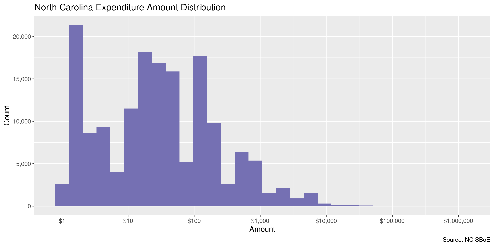
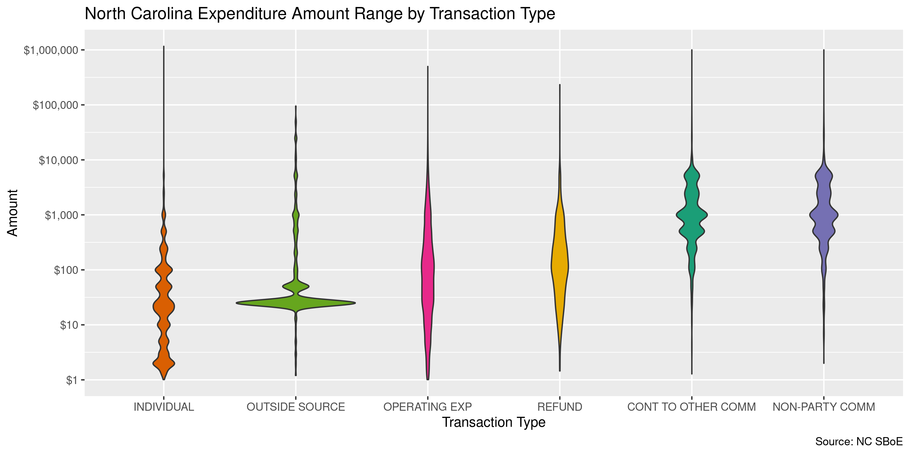
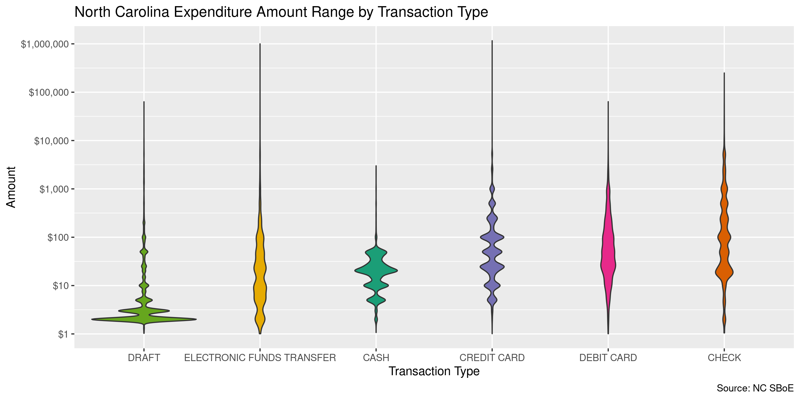
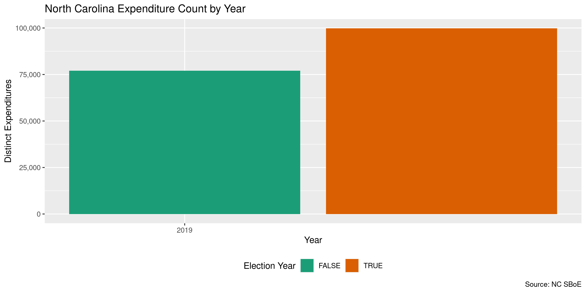
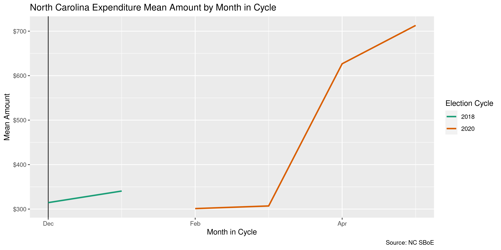

North Carolina Expenditures
================
Kiernan Nicholls
2019-08-08 15:55:12

  - [Project](#project)
  - [Objectives](#objectives)
  - [Packages](#packages)
  - [Data](#data)
  - [Explore](#explore)
  - [Wrangle](#wrangle)
  - [Conclude](#conclude)
  - [Export](#export)

## Project

The Accountability Project is an effort to cut across data silos and
give journalists, policy professionals, activists, and the public at
large a simple way to search across huge volumes of public data about
people and organizations.

Our goal is to standardizing public data on a few key fields by thinking
of each dataset row as a transaction. For each transaction there should
be (at least) 3 variables:

1.  All **parties** to a transaction
2.  The **date** of the transaction
3.  The **amount** of money involved

## Objectives

This document describes the process used to complete the following
objectives:

1.  How many records are in the database?
2.  Check for duplicates
3.  Check ranges
4.  Is there anything blank or missing?
5.  Check for consistency issues
6.  Create a five-digit ZIP Code called `ZIP5`
7.  Create a `YEAR` field from the transaction date
8.  Make sure there is data on both parties to a transaction

## Packages

The following packages are needed to collect, manipulate, visualize,
analyze, and communicate these results. The `pacman` package will
facilitate their installation and attachment.

The IRW’s `campfin` package will also have to be installed from GitHub.
This package contains functions custom made to help facilitate the
processing of campaign finance data.

``` r
if (!require("pacman")) install.packages("pacman")
pacman::p_load_current_gh("kiernann/campfin")
pacman::p_load(
  stringdist, # levenshtein value
  tidyverse, # data manipulation
  RSelenium, # remote browser
  lubridate, # datetime strings
  magrittr, # pipe opperators
  tidytext, # text analysis
  janitor, # dataframe clean
  batman, # parse logical
  refinr, # cluster and merge
  scales, # format strings
  rvest, # read html files
  knitr, # knit documents
  vroom, # read files fast
  glue, # combine strings
  here, # relative storage
  fs # search storage 
)
```

This document should be run as part of the `R_campfin` project, which
lives as a sub-directory of the more general, language-agnostic
\[`irworkshop/accountability_datacleaning`\]\[01\] GitHub repository.

The `R_campfin` project uses the \[RStudio projects\]\[02\] feature and
should be run as such. The project also uses the dynamic `here::here()`
tool for file paths relative to *your* machine.

``` r
# where does this document knit?
here::here()
#> [1] "/home/ubuntu/R/accountability_datacleaning/R_campfin"
```

## Data

Data is obtained from the North Carolina State Board of Elections (NC
SBoE).

> The State Board of Elections (State Board) is the state agency charged
> with the administration of the elections process and campaign finance
> disclosure and compliance.

> The state’s Campaign Reporting Act applies to:
> 
>   - all candidates for public office;  
>   - all political party groups and political action committees;  
>   - all groups organized to support or oppose a referendum;  
>   - every person or group participating in activities that support or
>     oppose the nomination or  
>   - election of one or more clearly identified candidates, or a
>     political party or a referendum.

### Download

To download the data, perform a [Transaction Entity
Search](https://cf.ncsbe.gov/CFTxnLkup/) for type “Expenditure” from
2008-01-01 to 2019-08-08.

> This page allows for searching through the NC SBoE Campaign Finance
> database of transactions that committees have received (Receipts) or
> spent (Expenditures). Report data that is imported does not appear on
> our website in real-time. Our website updates overnight each
> weeknight. All data imported during a business day will appear on our
> website the following day.

``` r
raw_dir <- here("nc", "expends", "data", "data", "raw")
dir_create(raw_dir) 
```

### Read

``` r
nc <- read_csv(
  file = glue("{raw_dir}/transinq_results.csv"),
  na = c("NA", "", "Not Available"),
  col_types = cols(
    .default = col_character(),
    `Date Occured` = col_date("%m/%d/%Y"),
    Amount = col_double()
  )
)

nc <- nc %>% 
  clean_names(case = "snake") %>% 
  mutate_if(is_character, str_to_upper) %>% 
  mutate(supports = equals(declaration, "SUPPORT"))
```

## Explore

``` r
head(nc)
```

    #> # A tibble: 6 x 25
    #>   name  street_line_1 street_line_2 city  state zip_code profession_job_… employers_name_…
    #>   <chr> <chr>         <chr>         <chr> <chr> <chr>    <chr>            <chr>           
    #> 1 <NA>  1100 WATERMA… <NA>          RALE… NC    27609    <NA>             <NA>            
    #> 2 <NA>  THE COMMITTE… <NA>          RALE… NC    27611    <NA>             <NA>            
    #> 3 <NA>  3353 RIVER RD <NA>          COLU… NC    28722    <NA>             <NA>            
    #> 4 <NA>  PO BOX 2012   <NA>          RALE… NC    27603    <NA>             <NA>            
    #> 5 <NA>  <NA>          <NA>          <NA>  <NA>  <NA>     <NA>             <NA>            
    #> 6 <NA>  <NA>          <NA>          <NA>  NE    <NA>     <NA>             <NA>            
    #> # … with 17 more variables: transction_type <chr>, committee_name <chr>,
    #> #   committee_s_bo_e_id <chr>, committee_street_1 <chr>, committee_street_2 <chr>,
    #> #   committee_city <chr>, committee_state <chr>, committee_zip_code <chr>, report_name <chr>,
    #> #   date_occured <date>, account_code <chr>, amount <dbl>, form_of_payment <chr>, purpose <chr>,
    #> #   candidate_referendum_name <chr>, declaration <chr>, supports <lgl>

``` r
tail(nc)
```

    #> # A tibble: 6 x 25
    #>   name  street_line_1 street_line_2 city  state zip_code profession_job_… employers_name_…
    #>   <chr> <chr>         <chr>         <chr> <chr> <chr>    <chr>            <chr>           
    #> 1 ZWEL… 4600 DURHAM … STE 26        DURH… NC    27707-2… <NA>             <NA>            
    #> 2 BARR… 5423 17TH AV… <NA>          BROO… NY    11204    EXECUTIVE        AMTRUST FINANCI…
    #> 3 MICH… 2754 COMMONW… <NA>          CHAR… NC    28205    FIELD ORGANIZER  GREEN PEACE     
    #> 4 MICH… 2754 COMMONW… <NA>          CHAR… NC    28205    FIELD ORGANIZER  GREEN PEACE     
    #> 5 MICH… 2754 COMMONW… <NA>          CHAR… NC    28205    FIELD ORGANIZER  GREEN PEACE     
    #> 6 ZZZ   718 ATLANTIC… <NA>          ATLA… NC    28512    <NA>             <NA>            
    #> # … with 17 more variables: transction_type <chr>, committee_name <chr>,
    #> #   committee_s_bo_e_id <chr>, committee_street_1 <chr>, committee_street_2 <chr>,
    #> #   committee_city <chr>, committee_state <chr>, committee_zip_code <chr>, report_name <chr>,
    #> #   date_occured <date>, account_code <chr>, amount <dbl>, form_of_payment <chr>, purpose <chr>,
    #> #   candidate_referendum_name <chr>, declaration <chr>, supports <lgl>

``` r
glimpse(sample_frac(nc))
```

    #> Observations: 630,822
    #> Variables: 25
    #> $ name                          <chr> "TIFFANY TEACHEY", "AGGREGATED NON-MEDIA EXPENDITURE", "MR…
    #> $ street_line_1                 <chr> "600 GREEN LAWN DR", NA, "1101 LAKE MORAINE PLACE", "3937 …
    #> $ street_line_2                 <chr> "APRT 2202", NA, NA, "APT D", NA, NA, NA, NA, NA, NA, NA, …
    #> $ city                          <chr> "COLUMBIA", NA, "RALEIGH", "GREENSBORO", "KANNAPOLIS", "LU…
    #> $ state                         <chr> "SC", NA, "NC", "NC", "NC", "NC", "MD", "NC", "NC", NA, "N…
    #> $ zip_code                      <chr> "29209", NA, "27607", "27401-4572", NA, "28358", "21741-66…
    #> $ profession_job_title          <chr> "ENGINEER", NA, NA, "CANVASSER", NA, NA, NA, NA, NA, NA, "…
    #> $ employers_name_specific_field <chr> "WESTINGHOUSE EELCTRIC COMPANY", NA, NA, "WORKING AMERICA"…
    #> $ transction_type               <chr> "REFUND", "OPERATING EXP", "OPERATING EXP", "INDEPENDENT E…
    #> $ committee_name                <chr> "FRIENDS OF VICTORIA WATLINGTON", "COMM TO ELECT LISA MATH…
    #> $ committee_s_bo_e_id           <chr> "090-808H0N-C-001", "STA-M9RTMV-C-001", "STA-C4184N-C-001"…
    #> $ committee_street_1            <chr> "1324 BETHEL RD", "PO BOX 4956", "PO BOX 12905", "815 16TH…
    #> $ committee_street_2            <chr> NA, NA, NA, NA, NA, NA, NA, NA, "LOBBYIST", NA, NA, NA, NA…
    #> $ committee_city                <chr> "CHARLOTTE", "SANFORD", "RALEIGH", "WASHINGTON", "KANNAPOL…
    #> $ committee_state               <chr> "NC", "NC", "NC", "DC", "NC", "NC", "NC", "NC", "NC", "NC"…
    #> $ committee_zip_code            <chr> "28208", "27331-4956", "27605", "20006", "28081", "28372",…
    #> $ report_name                   <chr> "2019 THIRTY-FIVE-DAY", "2018 THIRD QUARTER (AMENDMENT)", …
    #> $ date_occured                  <date> 2019-07-29, 2018-09-04, 2011-02-28, 2016-10-24, 2011-09-1…
    #> $ account_code                  <chr> NA, NA, NA, NA, NA, NA, NA, NA, NA, NA, NA, NA, NA, NA, NA…
    #> $ amount                        <dbl> 97.26, 9.99, 3584.49, 29.72, 76.65, 36.72, 10.52, 1600.26,…
    #> $ form_of_payment               <chr> "CHECK", "ELECTRONIC FUNDS TRANSFER", "CHECK", NA, "CHECK"…
    #> $ purpose                       <chr> NA, "STORAGE", "PAYROLL", "SALARY AND BENEFITS", "TELEPHON…
    #> $ candidate_referendum_name     <chr> NA, NA, NA, "ROY COOPER", NA, NA, NA, NA, NA, NA, NA, NA, …
    #> $ declaration                   <chr> NA, NA, NA, "SUPPORT", NA, NA, NA, NA, NA, NA, NA, NA, NA,…
    #> $ supports                      <lgl> NA, NA, NA, TRUE, NA, NA, NA, NA, NA, NA, NA, NA, NA, NA, …

### Missing

``` r
glimpse_fun(nc, count_na)
```

    #> # A tibble: 25 x 4
    #>    var                           type       n        p
    #>    <chr>                         <chr>  <int>    <dbl>
    #>  1 name                          chr      355 0.000563
    #>  2 street_line_1                 chr   165492 0.262   
    #>  3 street_line_2                 chr   590889 0.937   
    #>  4 city                          chr   153646 0.244   
    #>  5 state                         chr   132004 0.209   
    #>  6 zip_code                      chr   169700 0.269   
    #>  7 profession_job_title          chr   566339 0.898   
    #>  8 employers_name_specific_field chr   572875 0.908   
    #>  9 transction_type               chr      634 0.00101 
    #> 10 committee_name                chr      634 0.00101 
    #> 11 committee_s_bo_e_id           chr      634 0.00101 
    #> 12 committee_street_1            chr      938 0.00149 
    #> 13 committee_street_2            chr   587244 0.931   
    #> 14 committee_city                chr      634 0.00101 
    #> 15 committee_state               chr      634 0.00101 
    #> 16 committee_zip_code            chr      634 0.00101 
    #> 17 report_name                   chr      634 0.00101 
    #> 18 date_occured                  date     634 0.00101 
    #> 19 account_code                  chr   630822 1       
    #> 20 amount                        dbl      642 0.00102 
    #> 21 form_of_payment               chr    34093 0.0540  
    #> 22 purpose                       chr    94622 0.150   
    #> 23 candidate_referendum_name     chr   599595 0.950   
    #> 24 declaration                   chr   599620 0.951   
    #> 25 supports                      lgl   599620 0.951

There seems to be a regular block of records missing the variables
needed to properly identify a transaction. We can flag those
expenditures with `campfin::flag_na()`.

``` r
nc <- nc %>% flag_na(name, committee_name, date_occured, amount)
sum(nc$na_flag)
```

    #> [1] 718

``` r
percent(mean(nc$na_flag))
```

    #> [1] "0.114%"

### Duplicates

``` r
nc <- flag_dupes(nc, everything())
sum(nc$dupe_flag)
```

    #> [1] 20011

``` r
percent(mean(nc$dupe_flag))
```

    #> [1] "3.17%"

### Categorical

We can check the distribution of categorical variables to gain a better
understanding as to what kind of expenditures are being made.

``` r
glimpse_fun(nc, n_distinct)
```

    #> # A tibble: 27 x 4
    #>    var                           type       n          p
    #>    <chr>                         <chr>  <int>      <dbl>
    #>  1 name                          chr    99366 0.158     
    #>  2 street_line_1                 chr    89458 0.142     
    #>  3 street_line_2                 chr     4354 0.00690   
    #>  4 city                          chr     4480 0.00710   
    #>  5 state                         chr       74 0.000117  
    #>  6 zip_code                      chr    16311 0.0259    
    #>  7 profession_job_title          chr     3738 0.00593   
    #>  8 employers_name_specific_field chr     6380 0.0101    
    #>  9 transction_type               chr       10 0.0000159 
    #> 10 committee_name                chr     4144 0.00657   
    #> 11 committee_s_bo_e_id           chr     4148 0.00658   
    #> 12 committee_street_1            chr     3759 0.00596   
    #> 13 committee_street_2            chr      184 0.000292  
    #> 14 committee_city                chr      549 0.000870  
    #> 15 committee_state               chr       36 0.0000571 
    #> 16 committee_zip_code            chr     1036 0.00164   
    #> 17 report_name                   chr      295 0.000468  
    #> 18 date_occured                  date    4229 0.00670   
    #> 19 account_code                  chr        1 0.00000159
    #> 20 amount                        dbl    77749 0.123     
    #> 21 form_of_payment               chr        9 0.0000143 
    #> 22 purpose                       chr   125676 0.199     
    #> 23 candidate_referendum_name     chr      378 0.000599  
    #> 24 declaration                   chr        3 0.00000476
    #> 25 supports                      lgl        3 0.00000476
    #> 26 na_flag                       lgl        2 0.00000317
    #> 27 dupe_flag                     lgl        2 0.00000317

We can use `campfin::explore_plot()` to explroe the distribution of the
least distinct categorical variables.

<!-- -->

<!-- -->

<!-- -->

We can use `tidytext::unnest_tokens()` and `ggplot2::geom_col()` to
explore the most frequent word usage of the long-form `purpose`
variable.

<!-- -->

### Continuous

We should also check the range and distribution of continuous variables.

#### Amounts

``` r
summary(nc$amount)
```

    #>    Min. 1st Qu.  Median    Mean 3rd Qu.    Max.    NA's 
    #>  -31961      28     105    1131     500 3201000     642

<!-- -->

<!-- -->

<!-- -->

#### Dates

We can add a `year_occured` variable using `lubridate::year()`.

``` r
nc <- mutate(nc, year_occured = year(date_occured))
```

The `date_occured` variable is very clean, with 0 records before 2008
and 0 records after 2019-08-08.

``` r
min(nc$date_occured, na.rm = TRUE)
#> [1] "2008-01-01"
sum(nc$year_occured < 2008, na.rm = TRUE)
#> [1] 0
max(nc$date_occured, na.rm = TRUE)
#> [1] "2019-08-06"
sum(nc$date_occured > today(), na.rm = TRUE)
#> [1] 0
```

<!-- -->

<!-- -->

<!-- -->

<!-- -->

<!-- -->

## Wrangle

To improve the searcability of the database, we can perform some
functional text normalization of geographic data. Here, we have
geographic data for both the expender and payee.

### Payees

#### Address

First, we will perform simple text normalization on the address strings
using `tidyr::unite()` and `campfin::normal_address()`.

``` r
# need the dev tidyr for na.rm
packageVersion("tidyr")
#> [1] '0.8.3.9000'
nc <- nc %>% 
  unite(
    col = street_combined,
    starts_with("street_line"),
    sep = " ",
    remove = FALSE,
    na.rm = TRUE,
  ) %>% 
  mutate(
    address_norm = normal_address(
      address = street_combined,
      add_abbs = usps,
      na = c(""),
      na_rep = TRUE
    )
  )
```

    #> # A tibble: 4 x 3
    #>   street_line_1                street_combined               address_norm                   
    #>   <chr>                        <chr>                         <chr>                          
    #> 1 12120 SUNSET HILLS RD        12120 SUNSET HILLS RD STE 500 12120 SUNSET HILLS ROAD STE 500
    #> 2 411 FAYETTEVILLE STREET MALL 411 FAYETTEVILLE STREET MALL  411 FAYETTEVILLE STREET MALL   
    #> 3 MT. JEFFERSON ROAD           MT. JEFFERSON ROAD            MOUNT JEFFERSON ROAD           
    #> 4 126 CONNER LANE              126 CONNER LANE               126 CONNER LANE

#### Payee ZIP

``` r
n_distinct(nc$zip_code)
#> [1] 16311
prop_in(nc$zip_code, geo$zip, na.rm = TRUE)
#> [1] 0.7871366
length(setdiff(nc$zip_code, geo$zip))
#> [1] 12351
```

``` r
nc <- nc %>% 
  mutate(
    zip_norm = normal_zip(
      zip = zip_code,
      na_rep = TRUE
    )
  )
```

``` r
n_distinct(nc$zip_norm)
#> [1] 5026
prop_in(nc$zip_norm, geo$zip, na.rm = TRUE)
#> [1] 0.9962747
length(setdiff(nc$zip_norm, geo$zip))
#> [1] 579
```

#### Payee State

``` r
n_distinct(nc$state)
#> [1] 74
prop_in(nc$state, geo$state, na.rm = TRUE)
#> [1] 0.9999519
length(setdiff(nc$state, geo$state))
#> [1] 12
```

``` r
nc %>%
  drop_na(state, zip_code) %>% 
  filter(state %out% geo$state) %>% 
  select(city, state, zip_code) %>% 
  left_join(geo, by = c("zip_code" = "zip"), suffix = c("_nc", "_geo")) %>% 
  arrange(state_nc)
```

    #> # A tibble: 19 x 5
    #>    city_nc     state_nc zip_code city_geo       state_geo
    #>    <chr>       <chr>    <chr>    <chr>          <chr>    
    #>  1 WASHINGTON  CD       20005    WASHINGTON     DC       
    #>  2 DECATUR     GE       30030    DECATUR        GA       
    #>  3 LOUISVILLE  KE       40222    LOUISVILLE     KY       
    #>  4 LOUISVILLE  KE       40222    LOUISVILLE     KY       
    #>  5 LOUISVILLE  KE       40222    LOUISVILLE     KY       
    #>  6 LOUISVILLE  KE       40222    LOUISVILLE     KY       
    #>  7 LOUISVILLE  KE       40222    LOUISVILLE     KY       
    #>  8 MANDEVILLE  LO       70471    MANDEVILLE     LA       
    #>  9 RALEIGH     N        27603    RALEIGH        NC       
    #> 10 WILLIAMSTON N        27892    WILLIAMSTON    NC       
    #> 11 WILLIAMSTON N        27892    WILLIAMSTON    NC       
    #> 12 SANFORD     N        27330    SANFORD        NC       
    #> 13 HIGH POINT  N        27265    HIGH POINT     NC       
    #> 14 PARKTON     N        28371    PARKTON        NC       
    #> 15 ROWLAND     N        28383    ROWLAND        NC       
    #> 16 SANFORD     N        27330    SANFORD        NC       
    #> 17 DURHAM      NX       27702    DURHAM         NC       
    #> 18 DURHAM      NX       27705    DURHAM         NC       
    #> 19 <NA>        WE       28694    WEST JEFFERSON NC

``` r
nc <- nc %>% 
  mutate(
    state_norm = state %>% 
      str_replace("^CD$", "DC") %>% 
      str_replace("^GE$", "GA") %>% 
      str_replace("^KE$", "KY") %>% 
      str_replace("^LO$", "LA") %>% 
      str_replace("^N$",  "NC") %>% 
      str_replace("^NX$", "NC") %>% 
      str_replace("^WE$", "NC") %>% 
      na_if("PU") %>% 
      na_if("KI") %>% 
      na_if("TH") %>% 
      na_if("VE")
  )
```

``` r
n_distinct(nc$state_norm)
#> [1] 63
prop_in(nc$state_norm, geo$state, na.rm = TRUE)
#> [1] 1
length(setdiff(nc$state_norm, geo$state))
#> [1] 1
```

#### Payee City

``` r
n_distinct(nc$city)
#> [1] 4480
prop_in(nc$city, geo$city, na.rm = TRUE)
#> [1] 0.9653671
length(setdiff(nc$city, geo$city))
#> [1] 2363
```

##### Payee City Normalize

``` r
nc <- nc %>% 
  mutate(
    city_norm = normal_city(
      city = city %>% 
        str_replace("CLT", "CHARLOTTE") %>% 
        str_replace("ATL", "ATLANTA") %>% 
        str_replace("AVL", "ASHEVILLE"),
      geo_abbs = usps_city,
      st_abbs = c("NC", "DC", "NORTH CAROLINA"),
      na = na_city,
      na_rep = TRUE
    )
  )
```

``` r
n_distinct(nc$city_norm)
#> [1] 4166
prop_in(nc$city_norm, geo$city, na.rm = TRUE)
#> [1] 0.9673323
length(setdiff(nc$city_norm, geo$city))
#> [1] 2036
```

##### Payee City Swap

``` r
nc <- nc %>% 
  rename(city_raw = city) %>% 
  left_join(
    y = geo,
    by = c(
      "state_norm" = "state",
      "zip_norm" = "zip"
    )
  ) %>% 
  rename(city_match = city) %>% 
  mutate(
    match_dist = stringdist(city_norm, city_match),
    city_swap = if_else(
      condition = is_less_than(match_dist, 4),
      true = city_match,
      false = city_norm
    )
  )
```

``` r
n_distinct(nc$city_swap)
#> [1] 2402
prop_in(nc$city_swap, geo$city, na.rm = TRUE)
#> [1] 0.9788466
length(setdiff(nc$city_swap, geo$city))
#> [1] 370
```

``` r
nc %>% 
  filter(city_swap %out% geo$city) %>% 
  count(
    city_swap, 
    city_match, 
    state_norm, 
    sort = TRUE
  ) %>% 
  drop_na() %>% 
  arrange(desc(n)) %>% 
  mutate(cumulative_prop = cumsum(n)/sum(n)) %>% 
  print(n = 20)
```

    #> # A tibble: 394 x 5
    #>    city_swap          city_match      state_norm     n cumulative_prop
    #>    <chr>              <chr>           <chr>      <int>           <dbl>
    #>  1 ATLANTAANTA        ATLANTA         GA          4684           0.485
    #>  2 ARCHDALE           HIGH POINT      NC           573           0.544
    #>  3 SYMMES TOWNSHIP    CINCINNATI      OH           456           0.591
    #>  4 SYMMES TWP         CINCINNATI      OH           324           0.625
    #>  5 MINT HILL          CHARLOTTE       NC           314           0.657
    #>  6 THE WOODLANDS      SPRING          TX           253           0.683
    #>  7 MILWAUKIE          PORTLAND        OR           240           0.708
    #>  8 ELON               ELON COLLEGE    NC           197           0.728
    #>  9 ATLANTAANTIC BEACH ATLANTIC BEACH  NC           180           0.747
    #> 10 WEST SOMERVILLE    SOMERVILLE      MA           166           0.764
    #> 11 MOUNTAIN BROOK     BIRMINGHAM      AL           118           0.776
    #> 12 WEDDINGTON         MATTHEWS        NC            97           0.786
    #> 13 CAPE CARTERET      SWANSBORO       NC            91           0.796
    #> 14 WHISPERING PINES   CARTHAGE        NC            64           0.803
    #> 15 OVERLAND PARK      SHAWNEE MISSION KS            63           0.809
    #> 16 PINE KNOLL SHORES  ATLANTIC BEACH  NC            60           0.815
    #> 17 CORAL GABLES       MIAMI           FL            58           0.821
    #> 18 DAVIE              FORT LAUDERDALE FL            58           0.827
    #> 19 SOUTHERN SHORES    KITTY HAWK      NC            49           0.832
    #> 20 RALRIGHPAXTON      RALEIGH         NC            48           0.837
    #> # … with 374 more rows

    #> # A tibble: 3 x 4
    #>   step  n_distinct prop_in unique_bad
    #>   <chr>      <int>   <dbl>      <int>
    #> 1 raw         4480   0.965       2363
    #> 2 norm        4166   0.967       2036
    #> 3 swap        2402   0.979        370

### Committees

#### Committee Address

``` r
nc <- nc %>% 
  unite(
    col = committee_street_combined,
    starts_with("committee_street"),
    sep = " ",
    remove = FALSE,
    na.rm = TRUE,
  ) %>% 
  mutate(
    committee_address_norm = normal_address(
      address = committee_street_combined,
      add_abbs = usps,
      na = c(""),
      na_rep = TRUE
    )
  )
```

    #> # A tibble: 10 x 3
    #>    committee_street_1    committee_street_combined        committee_address_norm            
    #>    <chr>                 <chr>                            <chr>                             
    #>  1 317 DAYBROOK DRIVE    317 DAYBROOK DRIVE               317 DAYBROOK DRIVE                
    #>  2 337 DENADA PATH       337 DENADA PATH                  337 DENADA PATH                   
    #>  3 148 BROOKHAVEN TRAIL  148 BROOKHAVEN TRAIL             148 BROOKHAVEN TRAIL              
    #>  4 904 CLIPPER COURT     904 CLIPPER COURT                904 CLIPPER COURT                 
    #>  5 107 SARDIS GROVE LANE 107 SARDIS GROVE LANE            107 SARDIS GROVE LANE             
    #>  6 1400 SANSBERRY RD     1400 SANSBERRY RD                1400 SANSBERRY ROAD               
    #>  7 1020 N. FRENCH ST.    1020 N. FRENCH ST. DE5-002-03-11 1020 N FRENCH STREET DE5 002 03 11
    #>  8 PO BOX 20875          PO BOX 20875                     PO BOX 20875                      
    #>  9 320 KETCHIE ESTATE RD 320 KETCHIE ESTATE RD            320 KETCHIE ESTATE ROAD           
    #> 10 PO BOX 3396           PO BOX 3396                      PO BOX 3396

#### Committee ZIP

``` r
n_distinct(nc$committee_zip_code)
#> [1] 1036
prop_in(nc$committee_zip_code, geo$zip, na.rm = TRUE)
#> [1] 0.9007666
length(setdiff(nc$committee_zip_code, geo$zip))
#> [1] 279
```

``` r
nc <- nc %>% 
  mutate(
    committee_zip_norm = normal_zip(
      zip = committee_zip_code,
      na_rep = TRUE
    )
  )
```

``` r
n_distinct(nc$committee_zip_norm)
#> [1] 793
prop_in(nc$committee_zip_norm, geo$zip, na.rm = TRUE)
#> [1] 0.9992414
length(setdiff(nc$committee_zip_norm, geo$zip))
#> [1] 11
```

#### Committee State

The `committee_state` variable does not need to be normalized.

``` r
n_distinct(nc$committee_state)
#> [1] 36
prop_in(nc$committee_state, geo$state, na.rm = TRUE)
#> [1] 1
length(setdiff(nc$committee_state, geo$state))
#> [1] 1
```

#### Committee City

``` r
n_distinct(nc$committee_city)
#> [1] 549
prop_in(nc$committee_city, geo$city, na.rm = TRUE)
#> [1] 0.9751821
length(setdiff(nc$committee_city, geo$city))
#> [1] 66
```

##### Committee City Normalize

``` r
nc <- nc %>% 
  mutate(
    committee_city_norm = normal_city(
      city = committee_city,
      geo_abbs = usps_city,
      st_abbs = c("NC", "DC", "NORTH CAROLINA"),
      na = na_city,
      na_rep = TRUE
    )
  )
```

``` r
n_distinct(nc$committee_city_norm)
#> [1] 536
prop_in(nc$committee_city_norm, geo$city, na.rm = TRUE)
#> [1] 0.9896981
length(setdiff(nc$committee_city_norm, geo$city))
#> [1] 52
```

##### Committee City Swap

``` r
nc <- nc %>% 
  rename(committee_city_raw = committee_city) %>% 
  left_join(
    y = geo,
    by = c(
      "committee_state" = "state",
      "committee_zip_norm" = "zip"
    )
  ) %>% 
  rename(committee_city_match = city) %>% 
  mutate(
    committee_match_dist = stringdist(committee_city_norm, city_match),
    committee_city_swap = if_else(
      condition = is_less_than(match_dist, 4),
      true = committee_city_match,
      false = committee_city_norm
    )
  )
```

``` r
n_distinct(nc$committee_city_swap)
#> [1] 512
prop_in(nc$committee_city_swap, geo$city, na.rm = TRUE)
#> [1] 0.9990838
length(setdiff(nc$committee_city_swap, geo$city))
#> [1] 28
```

Our usual normalization process has done little to clean the already
clean `committee_city`.

    #> # A tibble: 3 x 4
    #>   step  n_distinct prop_in unique_bad
    #>   <chr>      <int>   <dbl>      <int>
    #> 1 raw          549   0.975         66
    #> 2 norm         536   0.990         52
    #> 3 swap         512   0.999         28

## Conclude

1.  There are 630825 records in the database
2.  There are 20011 (3.17%) duplicate records
3.  The range and distribution of `amount` and `date_occured` are
    reasonable
4.  There are 718 (0.114%) records missing names
5.  Consistency in goegraphic data has been improved with
    `campfin::normal_*()`
6.  The 5-digit `zip_norm` variable has been created with
    `campfin::normal_zip()`
7.  The 4-digit `year_occured` variable has been created with
    `lubridate::year()`

## Export

``` r
proc_dir <- here("nc", "expends", "data", "processed")
dir_create(proc_dir)
```

``` r
nc %>% 
  select(
    -city_norm,
    -match_dist,
    -city_match,
    -committee_city_norm,
    -committee_match_dist,
    -committee_city_match
  ) %>% 
  write_csv(
    na = "",
    path = glue("{proc_dir}/nc_expends_clean.csv")
  )
```
