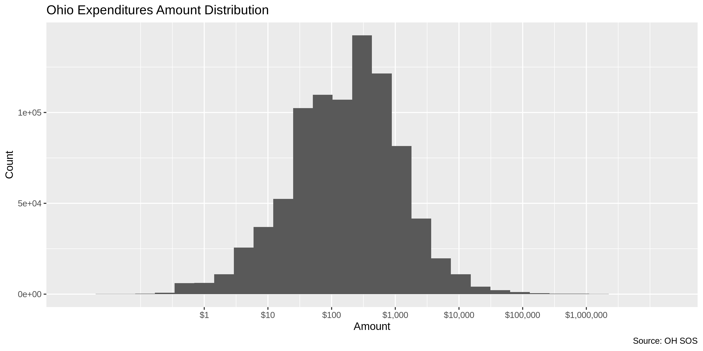
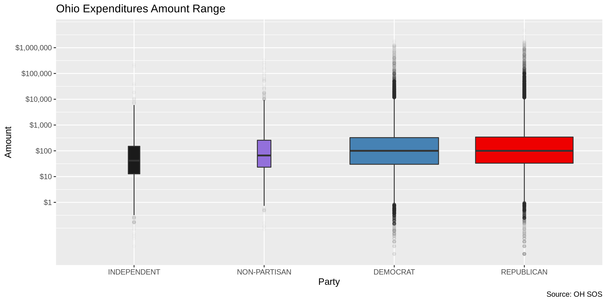
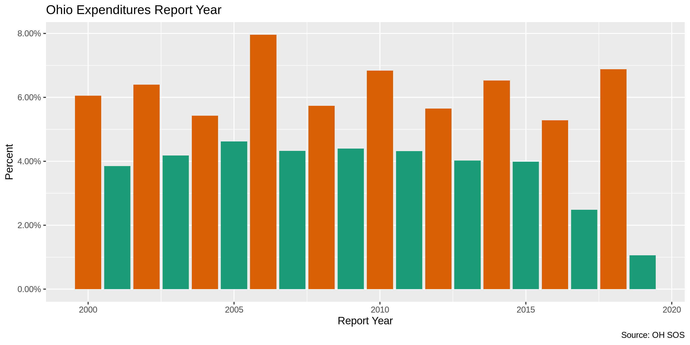
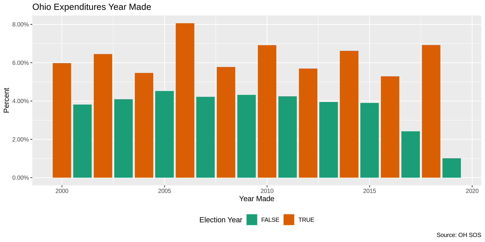

Ohio Expenditures
================
Kiernan Nicholls
2019-08-22 14:40:50

  - [Project](#project)
  - [Objectives](#objectives)
  - [Packages](#packages)
  - [Data](#data)
  - [Import](#import)
  - [Explore](#explore)
  - [Wrangle](#wrangle)
  - [Conclude](#conclude)
  - [Export](#export)

## Project

The Accountability Project is an effort to cut across data silos and
give journalists, policy professionals, activists, and the public at
large a simple way to search across huge volumes of public data about
people and organizations.

Our goal is to standardizing public data on a few key fields by thinking
of each dataset row as a transaction. For each transaction there should
be (at least) 3 variables:

1.  All **parties** to a transaction
2.  The **date** of the transaction
3.  The **amount** of money involved

## Objectives

This document describes the process used to complete the following
objectives:

1.  How many records are in the database?
2.  Check for duplicates
3.  Check ranges
4.  Is there anything blank or missing?
5.  Check for consistency issues
6.  Create a five-digit ZIP Code called `ZIP5`
7.  Create a `YEAR` field from the transaction date
8.  Make sure there is data on both parties to a transaction

## Packages

The following packages are needed to collect, manipulate, visualize,
analyze, and communicate these results. The `pacman` package will
facilitate their installation and attachment.

The IRW’s `campfin` package will also have to be installed from GitHub.
This package contains functions custom made to help facilitate the
processing of campaign finance data.

``` r
# Thu Aug 01 12:53:28 2019 ------------------------------
if (!require("pacman")) install.packages("pacman")
pacman::p_load_current_gh("kiernann/campfin")
pacman::p_load(
  stringdist, # levenshtein value
  RSelenium, # remote browser
  tidyverse, # data manipulation
  lubridate, # datetime strings
  tidytext, # text analysis
  magrittr, # pipe opperators
  janitor, # dataframe clean
  refinr, # cluster and merge
  scales, # format strings
  knitr, # knit documents
  vroom, # read files fast
  glue, # combine strings
  here, # relative storage
  fs # search storage 
)
```

This document should be run as part of the `R_campfin` project, which
lives as a sub-directory of the more general, language-agnostic
[`irworkshop/accountability_datacleaning`](https://github.com/irworkshop/accountability_datacleaning "TAP repo")
GitHub repository.

The `R_campfin` project uses the [RStudio
projects](https://support.rstudio.com/hc/en-us/articles/200526207-Using-Projects "Rproj")
feature and should be run as such. The project also uses the dynamic
`here::here()` tool for file paths relative to *your* machine.

``` r
# where dfs this document knit?
here::here()
#> [1] "/home/ubuntu/R/accountability_datacleaning/R_campfin"
```

## Data

Data is obtained from the [Ohio Secretary of State Campaign Finance
site](https://www.sos.state.oh.us/campaign-finance/search/).

> Search, view and download campaign finance data filed with the
> Secretary of State’s office. Under Ohio Revised Code 3517.106(E),
> information will be provided within five days of an entity filing data
> with the Secretary of State’s office.

The OH SOS provides an FTP (File Transfer Page) option for obtaining
bulk data.

> Welcome to the Ohio Secretary of State’s Campaign Finance File
> Transfer Page. This page was developed to allow users to obtain large
> sets of data faster than the normal query process. At this page you
> can download files of pre-queried data, such as all candidate
> contributions for a particular year or a list of all active political
> action committees registered with the Secretary of State. In addition,
> campaign finance data filed prior to 2000 is available only on this
> site. These files contain all relevant and frequently requested
> information. If you are looking for smaller or very specific sets of
> data please use the regular Campaign Finance queries listed on the
> tabs above.
> 
> The data is in a “comma delimited” format that loads easily into
> Microsoft Excel or Access as well as many other spreadsheet or
> database programs. Many of the available files contain a significant
> quantity of data records. A spreadsheet program, such as Microsoft
> Excel, may not allow all of the data in a file to be loaded because of
> a limit on the number of available rows. For this reason, it is
> advised that a database application be utilized to load and work with
> the data available at this site. For more information please contact
> the Campaign Finance unit at (614) 466-3111 or
> <CFINANCE@SOS.STATE.OH.US>

## Import

### Download

To download the annual files, we need to manually click on the download
link for each.

> On the FTP page, please decide which information you would like to
> download. Click “Download File” on the right hand side. The system
> will then proceed to download the file into Microsoft Excel or provide
> you will an opportunity to download the file to the location on your
> computer (the settings on your computer will dictate this). You may
> see a series of dialog boxes on your screen asking you if you want to
> run or save the zipped .exe file. Follow the dialog boxes for
> whichever you chose telling the computer where you want the files
> saved. The end result will be a .csv file that you can open in
> Microsoft Excel or some other database application.

We can automate this process with the RSelenium package.

``` r
raw_dir <- here("oh", "expends", "data", "raw")
dir_create(raw_dir)
```

``` r
# open the driver with auto download options
remote_driver <- rsDriver(
  port = 4444L,
  browser = "firefox",
  extraCapabilities = makeFirefoxProfile(
    list(
      browser.download.dir = raw_dir,
      browser.download.folderList = 2L,
      browser.helperApps.neverAsk.saveToDisk = "text/CSV"
    )
  )
)

# navigate to the OH FTP site for candidates
remote_browser <- remote_driver$client
can_url <- "https://www6.sos.state.oh.us/ords/f?p=CFDISCLOSURE:73:16499944485586:CAN:NO:RP:P73_TYPE:CAN:"
remote_browser$navigate(can_url)

# create the CSS selectors for the expends links
childs <- seq(from = 5, to = 43, by = 2)
css_selectors <- glue("tr.highlight-row:nth-child({childs}) > td:nth-child(4) > a:nth-child(1)")

# click on every CSS selector
for (selector in css_selectors) {
  remote_browser$findElement("css", selector)$clickElement()
}

# navigate to the OH FTP site for committees
pac_url <- "https://www6.sos.state.oh.us/ords/f?p=CFDISCLOSURE:73:13908331107877:PAC:NO:RP:P73_TYPE:PAC:"
remote_browser$navigate(pac_url)

# click on every CSS selector
for (selector in css_selectors) {
  remote_browser$findElement("css", selector)$clickElement()
}

# close the browser and driver
remote_browser$close()
remote_driver$server$stop()
```

### Read

We can combine each annual file into a single data frame by using
`purrr::map()` to read each file with `readr::read_csv()` into a single
list, then bind each list element with `dplyr::bind_rows()`.

``` r
oh <- 
  dir_ls(
    path = raw_dir, 
    glob = "*EXP*.CSV$"
  ) %>% 
  map(
    read_csv,
    col_types = cols(
      .default = col_character(),
      RPT_YEAR = col_integer(),
      EXPEND_DATE = col_date("%m/%d/%Y"),
      AMOUNT = col_number(),
      EVENT_DATE = col_date("%m/%d/%Y"),
      INKIND = col_logical(),
      DISTRICT = col_integer()
    )
  ) %>% 
  bind_rows(.id = "file") %>%
  mutate(file = basename(file)) %>%
  clean_names() %>% 
  rename(city_raw = city)
```

## Explore

``` r
head(oh)
```

    #> # A tibble: 6 x 26
    #>   file  com_name master_key rpt_year report_key report_descript… short_descripti… first_name
    #>   <chr> <chr>    <chr>         <int> <chr>      <chr>            <chr>            <chr>     
    #> 1 ALL_… FRIENDS… 2              2000 123946     ANNUAL   (JANUA… 31-F  FR Expend… <NA>      
    #> 2 ALL_… FRIENDS… 2              2000 123946     ANNUAL   (JANUA… 31-B  Stmt of E… <NA>      
    #> 3 ALL_… FRIENDS… 2              2000 123946     ANNUAL   (JANUA… 31-B  Stmt of E… <NA>      
    #> 4 ALL_… FRIENDS… 2              2000 123946     ANNUAL   (JANUA… 31-B  Stmt of E… THEODORA  
    #> 5 ALL_… FRIENDS… 2              2000 123946     ANNUAL   (JANUA… 31-B  Stmt of E… <NA>      
    #> 6 ALL_… FRIENDS… 2              2000 123946     ANNUAL   (JANUA… 31-B  Stmt of E… <NA>      
    #> # … with 18 more variables: middle_name <chr>, last_name <chr>, suffix_name <chr>,
    #> #   non_individual <chr>, address <chr>, city_raw <chr>, state <chr>, zip <chr>,
    #> #   expend_date <date>, amount <dbl>, event_date <date>, purpose <chr>, inkind <lgl>,
    #> #   candidate_first_name <chr>, candidate_last_name <chr>, office <chr>, district <int>,
    #> #   party <chr>

``` r
tail(oh)
```

    #> # A tibble: 6 x 26
    #>   file  com_name master_key rpt_year report_key report_descript… short_descripti… first_name
    #>   <chr> <chr>    <chr>         <int> <chr>      <chr>            <chr>            <chr>     
    #> 1 PAC_… THE JM … 15154          2019 348983053  MAY 20TH MONTHLY 31-B  Stmt of E… <NA>      
    #> 2 PAC_… OHIOANS… 15170          2019 350645149  SEMIANNUAL   (J… 31-B  Stmt of E… <NA>      
    #> 3 PAC_… OHIOANS… 15170          2019 350645149  SEMIANNUAL   (J… 31-B  Stmt of E… <NA>      
    #> 4 PAC_… OHIOANS… 15170          2019 350645149  SEMIANNUAL   (J… 31-B  Stmt of E… <NA>      
    #> 5 PAC_… OHIOANS… 15170          2019 350645149  SEMIANNUAL   (J… 31-B  Stmt of E… <NA>      
    #> 6 PAC_… VOTE MA… 15175          2019 351967570  JULY 31 MIDYEAR… 31-B  Stmt of E… <NA>      
    #> # … with 18 more variables: middle_name <chr>, last_name <chr>, suffix_name <chr>,
    #> #   non_individual <chr>, address <chr>, city_raw <chr>, state <chr>, zip <chr>,
    #> #   expend_date <date>, amount <dbl>, event_date <date>, purpose <chr>, inkind <lgl>,
    #> #   candidate_first_name <chr>, candidate_last_name <chr>, office <chr>, district <int>,
    #> #   party <chr>

``` r
glimpse(sample_frac(oh))
```

    #> Observations: 893,075
    #> Variables: 26
    #> $ file                 <chr> "CAC_EXP_2012.CSV", "PAC_EXP_2013.CSV", "CAC_EXP_2010.CSV", "ALL_PA…
    #> $ com_name             <chr> "DR. TERRY JOHNSON FOR OHIO", "NISOURCE  INC. PAC", "FRIENDS OF BRU…
    #> $ master_key           <chr> "12981", "1116", "12054", "1894", "9469", "8251", "12856", "12822",…
    #> $ rpt_year             <int> 2012, 2013, 2010, 2009, 2017, 2007, 2016, 2014, 2006, 2010, 2010, 2…
    #> $ report_key           <chr> "123656572", "158565562", "76633567", "1017466", "309205321", "2344…
    #> $ report_description   <chr> "PRE-GENERAL", "JAN 31 YEAR END (FEDERAL)", "PRE-PRIMARY", "SEMIANN…
    #> $ short_description    <chr> "31-B  Stmt of Expenditures", "31-B  Stmt of Expenditures", "31-B  …
    #> $ first_name           <chr> NA, NA, NA, "JIM", NA, NA, NA, NA, NA, NA, NA, NA, NA, NA, NA, NA, …
    #> $ middle_name          <chr> NA, NA, NA, NA, NA, NA, NA, NA, NA, NA, NA, NA, NA, NA, NA, NA, NA,…
    #> $ last_name            <chr> NA, NA, NA, "HUGHES", NA, NA, NA, NA, NA, NA, NA, NA, NA, NA, NA, N…
    #> $ suffix_name          <chr> NA, NA, NA, NA, NA, NA, NA, NA, NA, NA, NA, NA, NA, NA, NA, NA, NA,…
    #> $ non_individual       <chr> "SOUTHERN OHIO BUSINESS SOURCE", "FRIENDS OF TIMOTHY J DE GEETER", …
    #> $ address              <chr> "111 EAST MAIN STREET  P O BOX 26", NA, "14 ARROW STREET SUITE 11",…
    #> $ city_raw             <chr> "WEST UNION", NA, "CAMBRIDGE", "COLUMBUS", "WEST CHESTER", "COLUMBU…
    #> $ state                <chr> "OH", NA, "MA", "OH", "OH", "OH", "OH", "OH", NA, "OH", "OH", "OH",…
    #> $ zip                  <chr> "45693", NA, "02138", "43214", "45069", "43215", "43215", "43015", …
    #> $ expend_date          <date> 2012-08-16, 2013-12-20, 2010-02-05, 2009-06-19, 2017-02-06, 2007-0…
    #> $ amount               <dbl> 680.00, 200.00, 0.15, 350.00, 1.59, 150.00, 19.99, 240.00, 25.00, 2…
    #> $ event_date           <date> NA, NA, NA, NA, NA, NA, NA, NA, NA, NA, NA, NA, NA, NA, NA, NA, NA…
    #> $ purpose              <chr> "FAIR SUPPLIES", NA, "CREDIT CARD PAYMENT FEE", "6/24/09 FUNDRAISER…
    #> $ inkind               <lgl> NA, NA, NA, NA, NA, FALSE, NA, NA, NA, NA, NA, NA, NA, NA, NA, NA, …
    #> $ candidate_first_name <chr> "TERRY", NA, "BRUCE", NA, "WILLIAM (BILL)", "SANDRA", "JOHN", "DAVI…
    #> $ candidate_last_name  <chr> "JOHNSON", NA, "CARTER", NA, "COLEY", "STABILE HARWOOD", "KASICH", …
    #> $ office               <chr> "HOUSE", NA, "HOUSE", NA, "SENATE", "HOUSE", "GOVERNOR", "AUDITOR",…
    #> $ district             <int> 90, NA, 54, NA, 4, 65, 0, 0, 0, 33, NA, NA, NA, 7, NA, NA, NA, 49, …
    #> $ party                <chr> "REPUBLICAN", NA, "DEMOCRAT", NA, "REPUBLICAN", "DEMOCRAT", "REPUBL…

### Missing

``` r
glimpse_fun(oh, count_na)
```

    #> # A tibble: 26 x 4
    #>    var                  type       n        p
    #>    <chr>                <chr>  <int>    <dbl>
    #>  1 file                 chr        0 0       
    #>  2 com_name             chr        0 0       
    #>  3 master_key           chr        0 0       
    #>  4 rpt_year             int        0 0       
    #>  5 report_key           chr        0 0       
    #>  6 report_description   chr        0 0       
    #>  7 short_description    chr        0 0       
    #>  8 first_name           chr   804282 0.901   
    #>  9 middle_name          chr   876840 0.982   
    #> 10 last_name            chr   803237 0.899   
    #> 11 suffix_name          chr   889851 0.996   
    #> 12 non_individual       chr    91683 0.103   
    #> 13 address              chr    73060 0.0818  
    #> 14 city_raw             chr    59141 0.0662  
    #> 15 state                chr    57451 0.0643  
    #> 16 zip                  chr    69421 0.0777  
    #> 17 expend_date          date    1481 0.00166 
    #> 18 amount               dbl      400 0.000448
    #> 19 event_date           date  861634 0.965   
    #> 20 purpose              chr    52807 0.0591  
    #> 21 inkind               lgl   790472 0.885   
    #> 22 candidate_first_name chr   395739 0.443   
    #> 23 candidate_last_name  chr   395520 0.443   
    #> 24 office               chr   395520 0.443   
    #> 25 district             int   399395 0.447   
    #> 26 party                chr   395606 0.443

There are 0 missing values for the `com_name` variable, used to identify
the giving party to the expenditure. The payee is identified by either
`last_name` for individuals or `non_individual` for, well, non
individuals. There are some records without wither payee name, which we
will now flag with `na_flag`. We will also flag any record missing an
`amount` value. However, there 0.166% of records are missing an
`expend_date`, too usefully many to flag.

``` r
oh <- mutate(oh, na_flag = (is.na(last_name) & is.na(non_individual)) | is.na(amount))
sum(oh$na_flag)
```

    #> [1] 2496

### Duplicates

There are many duplicated records, 1.22% of the entire database.

``` r
nrow(oh) - nrow(distinct(oh))
```

    #> [1] 10905

### Categorical

``` r
glimpse_fun(oh, n_distinct)
```

    #> # A tibble: 27 x 4
    #>    var                  type       n          p
    #>    <chr>                <chr>  <int>      <dbl>
    #>  1 file                 chr       39 0.0000437 
    #>  2 com_name             chr     4169 0.00467   
    #>  3 master_key           chr     4185 0.00469   
    #>  4 rpt_year             int       20 0.0000224 
    #>  5 report_key           chr    58422 0.0654    
    #>  6 report_description   chr       61 0.0000683 
    #>  7 short_description    chr       14 0.0000157 
    #>  8 first_name           chr     4798 0.00537   
    #>  9 middle_name          chr      337 0.000377  
    #> 10 last_name            chr    12097 0.0135    
    #> 11 suffix_name          chr      189 0.000212  
    #> 12 non_individual       chr   134314 0.150     
    #> 13 address              chr   174580 0.195     
    #> 14 city_raw             chr     7056 0.00790   
    #> 15 state                chr      137 0.000153  
    #> 16 zip                  chr    16200 0.0181    
    #> 17 expend_date          date    7799 0.00873   
    #> 18 amount               dbl    84367 0.0945    
    #> 19 event_date           date    4744 0.00531   
    #> 20 purpose              chr   149232 0.167     
    #> 21 inkind               lgl        3 0.00000336
    #> 22 candidate_first_name chr      694 0.000777  
    #> 23 candidate_last_name  chr     1747 0.00196   
    #> 24 office               chr       17 0.0000190 
    #> 25 district             int      102 0.000114  
    #> 26 party                chr       12 0.0000134 
    #> 27 na_flag              lgl        2 0.00000224

<!-- -->

### Continuous

#### Amounts

``` r
summary(oh$amount)
```

    #>    Min. 1st Qu.  Median    Mean 3rd Qu.    Max.    NA's 
    #> -150000      48     200    1590     500 9715708     400

``` r
sum(oh$amount < 0, na.rm = TRUE)
```

    #> [1] 2966

``` r
oh %>% 
  ggplot(aes(amount)) +
  geom_histogram() +
  scale_x_continuous(
    trans = "log10", 
    labels = dollar,
    breaks = c(1, 10, 100, 1000, 10000, 100000, 1000000)
  ) +
  labs(
    title = "Ohio Expenditures Amount Distribution",
    x = "Amount",
    y = "Count",
    caption = "Source: OH SOS"
  )
```

<!-- -->

<!-- -->

#### Dates

``` r
oh <- mutate(oh, expend_year = year(expend_date))
min_year <- min(as.double(str_extract(dir_ls(raw_dir) , "\\d{4}")))
```

``` r
min(oh$expend_date, na.rm = TRUE)
#> [1] "10-03-02"
sum(oh$expend_year < min_year, na.rm = TRUE)
#> [1] 917
max(oh$expend_date, na.rm = TRUE)
#> [1] "5555-05-05"
sum(oh$expend_date > today(), na.rm = TRUE)
#> [1] 328
```

``` r
oh <- mutate(oh, date_flag = expend_year < min_year | expend_date > today())
sum(oh$date_flag, na.rm = TRUE)
```

    #> [1] 1245

``` r
oh <- oh %>% 
  mutate(
    date_clean = as_date(ifelse(date_flag, NA, expend_date)),
    year_clean = year(date_clean)
  )
```

<!-- -->

<!-- -->

<!-- -->

<!-- -->

<!-- -->

## Wrangle

### Address

``` r
oh <- oh %>% 
  mutate(
    address_norm = normal_address(
      address = address,
      add_abbs = usps,
      na_rep = TRUE
    )
  )
```

    #> # A tibble: 10 x 2
    #>    address                     address_norm                 
    #>    <chr>                       <chr>                        
    #>  1 P O BOX 45950               PO BOX 45950                 
    #>  2 70 ROSS RD                  70 ROSS ROAD                 
    #>  3 1028 BENZ AVENUE            1028 BENZ AVENUE             
    #>  4 1509 BON AIR CIRCLE         1509 BON AIR CIRCLE          
    #>  5 3578 SUNSET D.              3578 SUNSET D                
    #>  6 214 WEST WEBER              214 WEST WEBER               
    #>  7 233 S. HIGH STREET          233 SOUTH HIGH STREET        
    #>  8 812 HURON ROAD E  SUITE 690 812 HURON ROAD EAST SUITE 690
    #>  9 <NA>                        <NA>                         
    #> 10 <NA>                        <NA>

### ZIP

``` r
n_distinct(oh$zip)
#> [1] 16200
prop_in(oh$zip, geo$zip, na.rm = TRUE)
#> [1] 0.9262397
length(setdiff(oh$zip, geo$zip))
#> [1] 9690
```

``` r
oh <- oh %>% 
  mutate(
    zip_norm = normal_zip(
      zip = zip,
      na_rep = TRUE
    )
  )
```

``` r
n_distinct(oh$zip_norm)
#> [1] 8084
prop_in(oh$zip_norm, geo$zip, na.rm = TRUE)
#> [1] 0.987146
length(setdiff(oh$zip_norm, geo$zip))
#> [1] 1189
```

### State

``` r
n_distinct(oh$state)
#> [1] 137
prop_in(oh$state, geo$state, na.rm = TRUE)
#> [1] 0.9994028
length(setdiff(oh$state, geo$state))
#> [1] 75
setdiff(oh$state, geo$state)
#>  [1] NA   "IO" "IG" "CN" "0H" "KA" "NO" "UK" "IW" "O"  "OO" "NU" "II" "EC" "HO" "43" "PH" "MC" "OG"
#> [20] "UH" "NI" "IH" "OJ" "M"  "IS" "T"  "0"  "TC" "45" "AV" "NZ" "LV" "O`" "H"  "OI" "TO" "PJ" "`O"
#> [39] "44" "P"  "DL" "FR" "OY" "ST" "OP" "N/" "DR" "?"  "A"  "BE" "AU" "PO" "IR" "WS" "VS" "OX" "OV"
#> [58] "UN" "CD" "FA" "BH" "11" "XX" "CI" "BZ" "BR" "SW" "SF" "IT" ")H" "TE" "HT" "SA" "."  "VO"
```

``` r
oh <- oh %>% 
  mutate(
    state_norm = normal_state(
      state = state,
      abbreviate = FALSE,
      valid = geo$state
    )
  )
```

``` r
n_distinct(oh$state_norm)
#> [1] 63
prop_in(oh$state_norm, geo$state, na.rm = TRUE)
#> [1] 1
length(setdiff(oh$state_norm, geo$state))
#> [1] 1
```

### City

``` r
n_distinct(oh$city_raw)
#> [1] 7056
prop_in(oh$city_raw, geo$city, na.rm = TRUE)
#> [1] 0.9345428
length(setdiff(oh$city_raw, geo$city))
#> [1] 4113
```

#### Normalize

``` r
oh <- oh %>% 
  mutate(
    city_norm = normal_city(
      geo_abbs = usps_city,
      st_abbs = c("OH", "DC", "OHIO"),
      na = na_city,
      na_rep = TRUE,
      city = city_raw %>% 
        str_replace("^CIN$",   "CINCINNATI") %>% 
        str_replace("^COL$",   "COLUMBUS")   %>% 
        str_replace("^CLEVE$", "CLEVELAND")  %>% 
        str_replace("^CINTI$", "CINCINNATI") %>% 
        str_replace("^YO$",    "YOUNGSTOWN") %>% 
        str_replace("^COLS$",  "COLUMBUS")   %>% 
        str_replace("^CINCI$", "CINCINNATI") %>% 
        str_replace("^CLEV$",  "CLEVELAND")  %>% 
        str_replace("^CLE$",   "CLEVELAND")  %>% 
        str_replace("^LKWD$",  "LAKEWOOD")   %>% 
        str_replace("^CINT$",  "CINCINNATI") %>% 
        str_replace("^ATL$",   "ATLANTA")
    )
  )
```

``` r
n_distinct(oh$city_norm)
#> [1] 6527
prop_in(oh$city_norm, geo$city, na.rm = TRUE)
#> [1] 0.9470637
length(setdiff(oh$city_norm, geo$city))
#> [1] 3557
```

#### Swap

``` r
oh <- oh %>% 
  left_join(
    y = geo,
    by = c(
      "state_norm" = "state",
      "zip_norm" = "zip"
    )
  ) %>% 
  rename(city_match = city) %>% 
  mutate(
    match_dist = stringdist(city_norm, city_match),
    city_swap = if_else(
      condition = (match_dist <= 2),
      true = city_match,
      false = city_norm
    )
  )
```

``` r
n_distinct(oh$city_swap)
#> [1] 4225
prop_in(oh$city_swap, geo$city, na.rm = TRUE)
#> [1] 0.9555501
length(setdiff(oh$city_swap, geo$city))
#> [1] 1321
summary(oh$match_dist)
#>    Min. 1st Qu.  Median    Mean 3rd Qu.    Max.    NA's 
#>    0.00    0.00    0.00    0.86    0.00   27.00   83826
```

#### Refine

``` r
oh_refined <- oh %>%
  filter(
    state_norm == "OH",
    match_dist > 2,
  ) %>% 
  mutate(
    city_refine = city_swap %>% 
      key_collision_merge(dict = geo$city[geo$state == "OH"]) %>% 
      n_gram_merge(numgram = 1, bus_suffix = FALSE)
  ) %>% 
  filter(city_refine != city_swap)
```

``` r
good_refined <- oh_refined %>% 
  inner_join(
    y = geo,
    by = c(
      "city_refine" = "city",
      "state_norm" = "state",
      "zip_norm" = "zip"
    )
  )
```

``` r
oh <- oh %>%
  left_join(good_refined) %>% 
  mutate(city_clean = coalesce(city_refine, city_swap))
```

``` r
n_distinct(oh$city_clean)
#> [1] 4209
prop_in(oh$city_clean, geo$city, na.rm = TRUE)
#> [1] 0.9555871
length(setdiff(oh$city_clean, geo$city))
#> [1] 1306
```

#### Lookup

To catch the final few invalid city names, we will use this custom
lookup table.

``` r
# Thu Aug 22 14:31:02 2019 ------------------------------
lookup <- read_csv(file = here("oh", "expends", "data", "oh_city_lookup.csv"))
```

``` r
oh <- left_join(oh, lookup %>% select(city_clean, city_new))
```

``` r
n_distinct(oh$city_new)
#> [1] 3607
prop_in(oh$city_new, geo$city, na.rm = TRUE)
#> [1] 0.9567738
length(setdiff(oh$city_new, geo$city))
#> [1] 730
```

#### Progress

``` r
n_distinct(oh$city_raw)
#> [1] 7056
n_distinct(oh$city_norm)
#> [1] 6527
n_distinct(oh$city_swap)
#> [1] 4225
n_distinct(oh$city_clean)
#> [1] 4209
n_distinct(oh$city_new)
#> [1] 3607

prop_in(oh$city_raw, geo$city)
#> [1] 0.9345408
prop_in(oh$city_norm, geo$city)
#> [1] 0.9470615
prop_in(oh$city_swap, geo$city)
#> [1] 0.9555501
prop_in(oh$city_new, geo$city)
#> [1] 0.9567738
```

## Conclude

1.  There are 893096 records in the database.
2.  There are 10905 duplicate records, 1.22% of records. Not yet
    flagged.
3.  The range and distribution of `amount` and `date` seem reasonable.
4.  There are 2496 records missing either recipient or date.
5.  Consistency in goegraphic data has been improved with
    `campfin::normal_*()`.
6.  The 5-digit `zip_norm` variable has been created with
    `campfin::normal_zip(oh$zip)`.
7.  The 4-digit `year_clean` variable has been created with
    `lubridate::year(oh$date_clean)`.

## Export

``` r
proc_dir <- here("oh", "expends", "data", "processed")
dir_create(proc_dir)
```

``` r
oh %>% 
  select(
    -city_raw,
    -state,
    -zip,
    -expend_date,
    -expend_year,
    -city_norm,
    -city_match,
    -match_dist,
    -city_swap,
    -city_refine,
    -city_clean
  ) %>% 
  write_csv(
    na = "",
    path = glue("{proc_dir}/oh_expends_clean.csv")
  )
```
