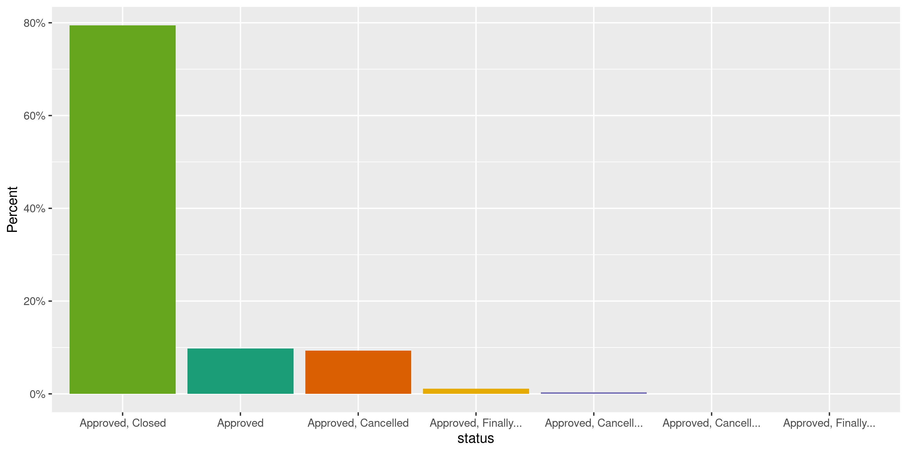
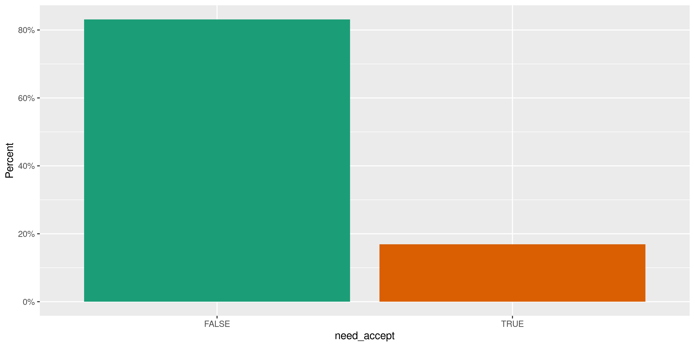
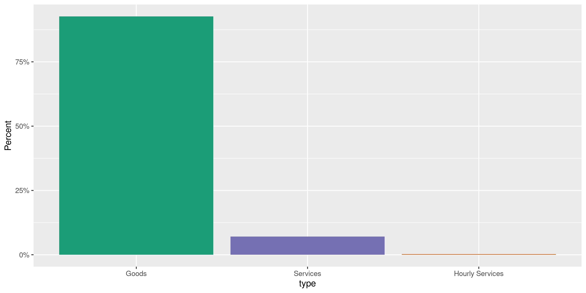
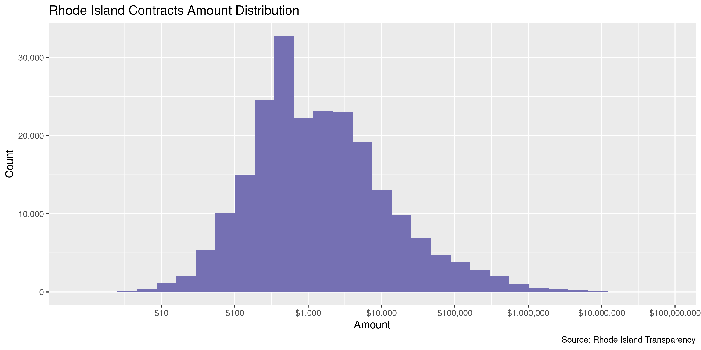

Rhode Island Contracts
================
Kiernan Nicholls
2020-10-15 11:50:57

  - [Project](#project)
  - [Objectives](#objectives)
  - [Packages](#packages)
  - [Data](#data)
  - [Download](#download)
  - [Read](#read)
  - [Join](#join)
  - [Explore](#explore)
  - [Wrangle](#wrangle)
  - [Conclude](#conclude)
  - [Export](#export)
  - [Upload](#upload)

<!-- Place comments regarding knitting here -->

## Project

The Accountability Project is an effort to cut across data silos and
give journalists, policy professionals, activists, and the public at
large a simple way to search across huge volumes of public data about
people and organizations.

Our goal is to standardizing public data on a few key fields by thinking
of each dataset row as a transaction. For each transaction there should
be (at least) 3 variables:

1.  All **parties** to a transaction.
2.  The **date** of the transaction.
3.  The **amount** of money involved.

## Objectives

This document describes the process used to complete the following
objectives:

1.  How many records are in the database?
2.  Check for entirely duplicated records.
3.  Check ranges of continuous variables.
4.  Is there anything blank or missing?
5.  Check for consistency issues.
6.  Create a five-digit ZIP Code called `zip`.
7.  Create a `year` field from the transaction date.
8.  Make sure there is data on both parties to a transaction.

## Packages

The following packages are needed to collect, manipulate, visualize,
analyze, and communicate these results. The `pacman` package will
facilitate their installation and attachment.

The IRW’s `campfin` package will also have to be installed from GitHub.
This package contains functions custom made to help facilitate the
processing of campaign finance data.

``` r
if (!require("pacman")) install.packages("pacman")
pacman::p_load_gh("irworkshop/campfin")
pacman::p_load(
  tidyverse, # data manipulation
  lubridate, # datetime strings
  gluedown, # printing markdown
  magrittr, # pipe operators
  janitor, # clean data frames
  aws.s3, # aws bucket storage
  refinr, # cluster and merge
  scales, # format strings
  knitr, # knit documents
  vroom, # read files fast
  rvest, # html scraping
  glue, # combine strings
  here, # relative paths
  httr, # http requests
  XML, # read xml trees
  fs # local storage 
)
```

This document should be run as part of the `R_campfin` project, which
lives as a sub-directory of the more general, language-agnostic
[`irworkshop/accountability_datacleaning`](https://github.com/irworkshop/accountability_datacleaning)
GitHub repository.

The `R_campfin` project uses the [RStudio
projects](https://support.rstudio.com/hc/en-us/articles/200526207-Using-Projects)
feature and should be run as such. The project also uses the dynamic
`here::here()` tool for file paths relative to *your* machine.

``` r
# where does this document knit?
here::here()
#> [1] "/home/kiernan/Code/tap/R_campfin"
```

## Data

Rhode Island contracts data was provided to the Investigative Reporting
Workshop under R.I. General Laws § 38-2-1 et seq., commonly known as the
Access to Public Records Act. The file was mailed to IRW as a single XML
file on a CD.

## Download

The file is hosted on the IRW’s AWS server, where it can be downloaded.

``` r
raw_dir <- dir_create(here("ri", "contracts", "data", "raw"))
raw_path <- path(raw_dir, "po_detail.zip")
aws_path <- path("FOR_REVIEW", "po detail.zip")
```

``` r
if (!file_exists(raw_path)) {
  save_object(
    object = aws_path,
    bucket = "publicaccountability",
    file = raw_path
  )
}
```

The XML file can be extracted from the ZIP archive.

``` r
file_size(raw_path)
#> 22.5M
raw_zip <- unzip(raw_path, exdir = raw_dir)
raw_xml <- unzip(raw_zip, exdir = raw_dir)
file_size(raw_xml)
#> 526M
```

``` r
raw_xml <- file_move(
  path = raw_xml,
  new_path = str_replace_all(raw_xml, "\\s", "_")
)
```

## Read

The XML file contains invalid characters and newlines that prevent it
from being properly read. We can remove these chracters using a regular
expression and save it to a new file.

``` r
raw_fix <- path(raw_dir, "po_fix.xml")
x <- read_lines(raw_xml)
x <- str_remove_all(
  string = str_replace_all(x, "(?<!>)\n", " "),
  pattern = "[^\u0009\u000a\u000d\u0020-\uD7FF\uE000-\uFFFD]"
)

write_lines(x, raw_fix)
```

This XML file is incredibly nested, with only a single layer working as
a rectangular dataframe. The `G_HEADERS` tree contains the aggregate
level data on each contract. We can extract this level of the XML tree
and parse it as a data frame, which can then be saved to disk as a CSV
text file.

``` r
w <- str_which(x, "LIST_G_HEADERS")
csv_path <- path(raw_dir, "po_detail.csv")
if (!file_exists(csv_path)) {
  write_csv(
    path = csv_path,
    x = xmlToDataFrame(
      doc = xmlParse(
        file = x[w[1]:w[2]]
      )
    )
  )
}
```

This CSV text file can then be re-read as a dataframe. We are going to
ignore the column of this CSV that contains the un-structured line-item
text.

``` r
ric <- read_csv(
  file = csv_path,
  col_types = cols(
    .default = col_character(),
    CREATION_DATE = col_date("%d-%b-%y"),
    PRINTED_DATE = col_date("%d-%b-%y"),
    ACCEPTANCE_DATE = col_date("%d-%b-%y"),
    REVISED_DATE = col_date("%d-%b-%y"),
    REV = col_integer(),
    TYPE = col_skip(),
    LIST_G_BREAK_LINES = col_skip(),
    C_AMOUNT_AGR = col_double(),
    C_AMOUNT_AGR_ROUND = col_skip(),
    C_AMOUNT_AGR_DISP = col_skip()
  )
)
```

``` r
ric <- ric %>% 
  clean_names("snake") %>% 
  rename(
    created = creation_date,
    printed = printed_date,
    currency = c_currency,
    accepted = acceptance_date,
    vendor_site = vendor_site,
    need_accept = acceptance_required,
    amount = c_amount_agr,
    po_header = po_header_id1,
    revised = revised_date,
    po_number = po_number,
    precision = c_fnd_precision
  ) %>% 
  mutate(across(need_accept, is.na))
```

## Join

Each contract contains a `G_BREAK_LINES` node with multiple lines for
each shipment or line item withing the contract total. We can extract
each of these contract details.

``` r
a <- read_xml(raw_fix)
b <- xml_nodes(a, "G_BREAK_LINES")
c <- tibble(
  po_header = xml_text(xml_nodes(b, "PO_HEADER_ID")),
  line = xml_text(xml_nodes(b, "LINE")),
  type = xml_text(xml_nodes(b, "LINE_TYPE")),
  desc = xml_text(xml_nodes(b, "ITEM_DESCRIPTION")),
  unit = xml_text(xml_nodes(b, "UNIT")),
  price = xml_text(xml_nodes(b, "UNIT_PRICE")),
  ordered = xml_text(xml_node(b, "QUANTITY_AMOUNT_ORDERED")),
  recieved = xml_text(xml_node(b, "QUANTITY_AMOUNT_RECEIVED")),
  canceled = xml_text(xml_node(b, "QUANTITY_AMOUNT_CANCELLED")),
  billed = xml_text(xml_node(b, "QUANTITY_AMOUNT_BILLED")),
  ship_to = xml_text(xml_node(b, "SHIP_TO_LOCATION"))
)
```

``` r
ric_details <- type_convert(
  df = c, na = "",
  col_types = cols(
    po_header = col_character()
  )
)
```

These details can be joined against the contract information.

We are only interested in those goods or services were actually
delivered, so we can filter out any canceled contracts.

``` r
ric <- ric %>% 
  left_join(ric_details) %>% 
  filter(canceled == 0) %>% 
  select(-canceled) %>% 
  remove_empty("cols") %>% 
  remove_constant()
```

## Explore

There are 226,868 rows and 22 columns. Each record represents a single
contract or purchase order between the state and an outside vendor.
There is a `buyer` name for who made the purchase, but no information on
which state agency they belong to.

``` r
glimpse(ric)
#> Rows: 226,868
#> Columns: 22
#> $ created     <date> 2017-12-14, 2018-11-15, 2019-12-20, 2020-04-24, 2013-07-31, 2013-07-31, 201…
#> $ status      <chr> "Approved, Closed", "Approved, Closed", "Approved, Closed", "Approved, Close…
#> $ rev         <int> 0, 0, 0, 2, 0, 0, 0, 0, 0, 0, 0, 0, 0, 0, 0, 0, 0, 0, 0, 1, 1, 1, 1, 1, 1, 1…
#> $ printed     <date> 2017-12-14, 2018-11-15, 2020-01-09, 2020-06-25, 2013-08-20, 2013-08-20, 201…
#> $ buyer       <chr> "Autocreate, *", "Autocreate, *", "Autocreate, *", "Autocreate, *", "Autocre…
#> $ vendor      <chr> "#1 OF RHODE ISLAND CHAPTER OF THE NATIONAL ASSOC OF WOMEN IN CONSTRUCTION",…
#> $ on_hold     <chr> NA, NA, NA, NA, NA, NA, NA, NA, NA, NA, NA, NA, NA, NA, NA, NA, NA, NA, NA, …
#> $ vendor_site <chr> "01", "01", "01", "99", "01", "01", "01", "01", "01", "01", "01", "01", "01"…
#> $ need_accept <lgl> FALSE, FALSE, FALSE, FALSE, FALSE, FALSE, FALSE, FALSE, FALSE, FALSE, FALSE,…
#> $ amount      <dbl> 500.00, 500.00, 4460.00, 1264210.07, 250.00, 250.00, 250.00, 1000.00, 500.00…
#> $ po_header   <chr> "1253690", "1296940", "1335860", "1346623", "862677", "862691", "862700", "1…
#> $ revised     <date> NA, NA, NA, 2020-06-25, NA, NA, NA, NA, NA, NA, NA, NA, NA, NA, NA, NA, NA,…
#> $ po_number   <chr> "3548351", "3597849", "3660336", "3675467", "3337486", "3337514", "3337532",…
#> $ line        <dbl> 1, 1, 1, 1, 1, 1, 1, 1, 1, 1, 1, 1, 2, 1, 1, 1, 1, 1, 2, 1, 2, 3, 4, 1, 2, 3…
#> $ type        <chr> "Goods", "Goods", "Services", "Goods", "Goods", "Goods", "Goods", "Services"…
#> $ desc        <chr> "OFFICE OF OPPORTUNITY DIVERSITY AND EQUITY TEAM TO ATTEND AN NAWIC PANEL DI…
#> $ unit        <chr> "Each", "Each", "Each", "Each", "Each", "Each", "Each", "Each", "Each", "Eac…
#> $ price       <dbl> 500.00, 1.00, NA, 1.00, 25.00, 25.00, 25.00, NA, NA, NA, NA, 96.10, 484.16, …
#> $ ordered     <dbl> 1, 500, 4460, 1264210, 10, 10, 10, 1000, 500, 2000, 2250, 1, 1, 1, 1, 1, 432…
#> $ recieved    <dbl> 1, 500, 4460, 1264210, 10, 10, 10, 1000, 500, 2000, 2250, 1, 1, 1, 1, 1, 288…
#> $ billed      <dbl> 1, 500, 4460, 1264210, 10, 10, 10, 1000, 500, 2000, 2250, 1, 1, 1, 1, 1, 288…
#> $ ship_to     <chr> "06800-047", "06800-047", "02600-001", "06800-073", "08100-009", "08100-009"…
tail(ric)
#> # A tibble: 6 x 22
#>   created    status   rev printed    buyer vendor on_hold vendor_site need_accept amount po_header
#>   <date>     <chr>  <int> <date>     <chr> <chr>  <chr>   <chr>       <lgl>        <dbl> <chr>    
#> 1 2018-12-03 Appro…     0 2018-12-07 DeAn… ZUCCH… <NA>    01          FALSE        6300  1298115  
#> 2 2019-08-09 Appro…     0 2019-08-09 Auto… ZW US… <NA>    01          FALSE         229. 1321951  
#> 3 2017-09-13 Appro…     0 2018-10-18 Yatt… ZYANT… <NA>    01          FALSE        1920  1238635  
#> 4 2018-11-26 Appro…     0 2018-11-29 McGu… ZYANT… <NA>    01          FALSE         960  1297516  
#> 5 2019-07-26 Appro…     0 2019-07-26 McGu… ZYANT… <NA>    01          FALSE         624  1319903  
#> 6 2019-11-27 Appro…     1 2019-12-02 Nade… ZYANT… <NA>    01          FALSE         480  1334222  
#> # … with 11 more variables: revised <date>, po_number <chr>, line <dbl>, type <chr>, desc <chr>,
#> #   unit <chr>, price <dbl>, ordered <dbl>, recieved <dbl>, billed <dbl>, ship_to <chr>
```

### Missing

There are no records missing key variables.

``` r
col_stats(ric, count_na)
#> # A tibble: 22 x 4
#>    col         class       n      p
#>    <chr>       <chr>   <int>  <dbl>
#>  1 created     <date>      0 0     
#>  2 status      <chr>       0 0     
#>  3 rev         <int>       0 0     
#>  4 printed     <date>   6458 0.0285
#>  5 buyer       <chr>       0 0     
#>  6 vendor      <chr>       0 0     
#>  7 on_hold     <chr>  226866 1.00  
#>  8 vendor_site <chr>       0 0     
#>  9 need_accept <lgl>       0 0     
#> 10 amount      <dbl>       0 0     
#> 11 po_header   <chr>       0 0     
#> 12 revised     <date> 172629 0.761 
#> 13 po_number   <chr>       0 0     
#> 14 line        <dbl>       0 0     
#> 15 type        <chr>       0 0     
#> 16 desc        <chr>       0 0     
#> 17 unit        <chr>       0 0     
#> 18 price       <dbl>   16061 0.0708
#> 19 ordered     <dbl>       0 0     
#> 20 recieved    <dbl>       0 0     
#> 21 billed      <dbl>       0 0     
#> 22 ship_to     <chr>       0 0
```

### Duplicates

There are no duplicate records in the data.

``` r
ric <- flag_dupes(ric, everything())
#> Warning in flag_dupes(ric, everything()): no duplicate rows, column not created
```

### Categorical

``` r
col_stats(ric, n_distinct)
#> # A tibble: 22 x 4
#>    col         class       n          p
#>    <chr>       <chr>   <int>      <dbl>
#>  1 created     <date>   2249 0.00991   
#>  2 status      <chr>       7 0.0000309 
#>  3 rev         <int>      22 0.0000970 
#>  4 printed     <date>   1951 0.00860   
#>  5 buyer       <chr>      37 0.000163  
#>  6 vendor      <chr>    9809 0.0432    
#>  7 on_hold     <chr>       2 0.00000882
#>  8 vendor_site <chr>      85 0.000375  
#>  9 need_accept <lgl>       2 0.00000882
#> 10 amount      <dbl>   65694 0.290     
#> 11 po_header   <chr>  147434 0.650     
#> 12 revised     <date>   1778 0.00784   
#> 13 po_number   <chr>  147434 0.650     
#> 14 line        <dbl>     216 0.000952  
#> 15 type        <chr>       3 0.0000132 
#> 16 desc        <chr>  158534 0.699     
#> 17 unit        <chr>      75 0.000331  
#> 18 price       <dbl>   25852 0.114     
#> 19 ordered     <dbl>   47512 0.209     
#> 20 recieved    <dbl>   40816 0.180     
#> 21 billed      <dbl>   47952 0.211     
#> 22 ship_to     <chr>     454 0.00200
```

``` r
explore_plot(ric, status) + scale_x_truncate()
```

<!-- -->

``` r
explore_plot(ric, need_accept) + scale_x_truncate()
```

<!-- -->

``` r
explore_plot(ric, type) + scale_x_truncate()
```

<!-- -->

### Amounts

We can also confirm this floor with the `amount` value.

``` r
noquote(map_chr(summary(ric$amount), dollar))
#>        Min.     1st Qu.      Median        Mean     3rd Qu.        Max. 
#>          $0     $312.93   $1,091.44  $42,362.30      $4,920 $55,961,793
mean(ric$amount <= 0)
#> [1] 0.009022868
```

<!-- -->

### Dates

We can add the calendar year from `date` with `lubridate::year()`

``` r
ric <- mutate(ric, date = coalesce(revised, created))
```

``` r
ric <- mutate(ric, year = year(date))
```

``` r
min(ric$date)
#> [1] "2005-04-14"
sum(ric$year < 2000)
#> [1] 0
max(ric$date)
#> [1] "2020-07-07"
sum(ric$date > today())
#> [1] 0
```

<!-- -->

## Wrangle

We need to manually add the state government abbreviation making the
purchase.

``` r
ric <- mutate(ric, govt = "RI", .after = buyer)
```

## Conclude

``` r
glimpse(sample_n(ric, 50))
#> Rows: 50
#> Columns: 25
#> $ created     <date> 2016-08-19, 2019-03-05, 2018-02-05, 2018-03-09, 2019-07-26, 2017-10-17, 201…
#> $ status      <chr> "Approved, Cancelled", "Approved, Closed", "Approved, Closed", "Approved, Cl…
#> $ rev         <int> 1, 0, 0, 0, 0, 0, 0, 0, 0, 0, 0, 0, 1, 2, 0, 1, 0, 1, 0, 0, 1, 0, 1, 1, 0, 1…
#> $ printed     <date> 2019-10-24, 2019-03-05, 2018-02-05, 2018-03-09, 2019-07-26, 2018-10-18, NA,…
#> $ buyer       <chr> "Autocreate, *", "Autocreate, *", "Autocreate, *", "Autocreate, *", "Autocre…
#> $ govt        <chr> "RI", "RI", "RI", "RI", "RI", "RI", "RI", "RI", "RI", "RI", "RI", "RI", "RI"…
#> $ vendor      <chr> "HP INC", "ATMED TREATMENT CENTER INC", "RHODE ISLAND SNOW & ICE CO", "COX R…
#> $ on_hold     <chr> NA, NA, NA, NA, NA, NA, NA, NA, NA, NA, NA, NA, NA, NA, NA, NA, NA, NA, NA, …
#> $ vendor_site <chr> "13", "01", "01", "99", "01", "01", "99", "01", "01", "01", "01", "99", "99"…
#> $ need_accept <lgl> TRUE, FALSE, FALSE, FALSE, FALSE, FALSE, FALSE, FALSE, FALSE, TRUE, FALSE, F…
#> $ amount      <dbl> 315.30, 4710.00, 3409.00, 171.00, 35.00, 457.34, 185.00, 1200.00, 100.00, 45…
#> $ po_header   <chr> "1201442", "1306372", "1259141", "1265565", "1319601", "1244248", "950842", …
#> $ revised     <date> 2017-08-18, NA, NA, NA, NA, NA, NA, NA, NA, NA, NA, NA, 2014-01-06, 2015-12…
#> $ po_number   <chr> "3481426", "3613236", "3554228", "3559064", "3636528", "3540891", "3397233",…
#> $ line        <dbl> 2, 2, 1, 1, 1, 8, 1, 1, 1, 1, 1, 3, 1, 2, 1, 1, 1, 1, 3, 5, 1, 2, 1, 1, 1, 1…
#> $ type        <chr> "Goods", "Goods", "Goods", "Goods", "Goods", "Goods", "Goods", "Goods", "Goo…
#> $ desc        <chr> "One Part # UQ224E, HP 3 Year Care Pack Business Priority Support , per Quot…
#> $ unit        <chr> "Each", "Each", "Each", "Each", "Box", "Each", "Each", "Each", "Each", "Each…
#> $ price       <dbl> 66.30, 25.00, 1.00, 1.00, 35.00, 13.60, 1.00, 1.00, 25.00, NA, 160.00, 34.30…
#> $ ordered     <dbl> 1.00, 76.00, 3409.00, 171.00, 1.00, 1.00, 185.00, 1200.00, 4.00, 4570.00, 2.…
#> $ recieved    <dbl> 0.00, 76.00, 3409.00, 171.00, 1.00, 1.00, 185.00, 1200.00, 4.00, 4570.00, 2.…
#> $ billed      <dbl> 1.00, 76.00, 3409.00, 171.00, 1.00, 1.00, 185.00, 1200.00, 4.00, 4570.00, 2.…
#> $ ship_to     <chr> "09900-003", "07600-003", "07600-006", "08100-004", "07400-026", "07600-012"…
#> $ date        <date> 2017-08-18, 2019-03-05, 2018-02-05, 2018-03-09, 2019-07-26, 2017-10-17, 201…
#> $ year        <dbl> 2017, 2019, 2018, 2018, 2019, 2017, 2014, 2017, 2017, 2015, 2017, 2014, 2014…
```

1.  There are 226,868 records in the database.
2.  There are 0 duplicate records in the database.
3.  The range and distribution of `amount` and `date` seem reasonable.
4.  There are 0 records missing key variables.
5.  Consistency in geographic data has been improved with
    `campfin::normal_*()`.
6.  The 4-digit `year` variable has been created with
    `lubridate::year()`.

## Export

Now the file can be saved on disk for upload to the Accountability
server.

``` r
clean_dir <- dir_create(here("ri", "contracts", "data", "clean"))
clean_path <- path(clean_dir, "ri_contracts_clean.csv")
write_csv(ric, clean_path, na = "")
(clean_size <- file_size(clean_path))
#> 50.6M
file_encoding(clean_path) %>% 
  mutate(across(path, path.abbrev))
#> # A tibble: 1 x 3
#>   path                                             mime            charset 
#>   <chr>                                            <chr>           <chr>   
#> 1 ~/ri/contracts/data/clean/ri_contracts_clean.csv application/csv us-ascii
```

## Upload

We can use the `aws.s3::put_object()` to upload the text file to the IRW
server.

``` r
s3_path <- path("csv", basename(clean_path))
if (!object_exists(s3_path, "publicaccountability")) {
  put_object(
    file = clean_path,
    object = s3_path, 
    bucket = "publicaccountability",
    acl = "public-read",
    show_progress = TRUE,
    multipart = TRUE
  )
}
s3_head <- head_object(s3_path, "publicaccountability")
(s3_size <- as_fs_bytes(attr(s3_head, "content-length")))
unname(s3_size == clean_size)
```
