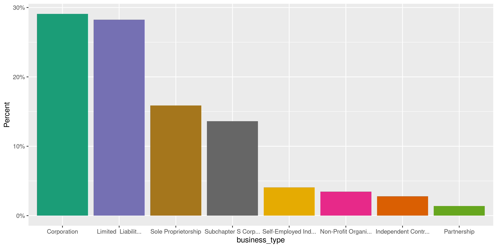
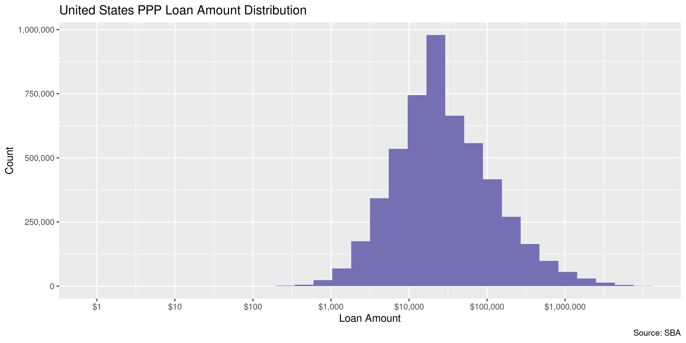
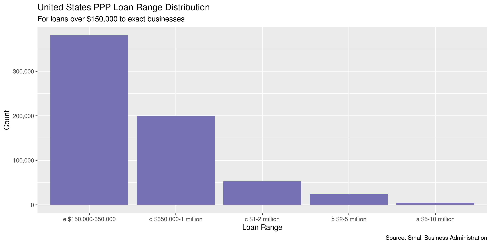
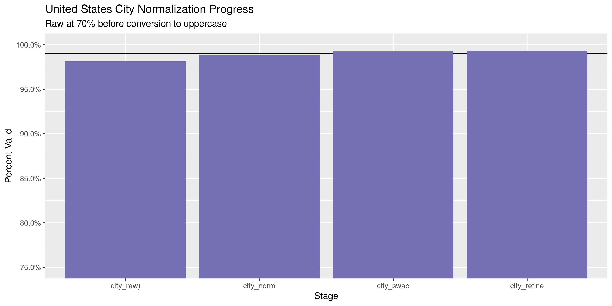
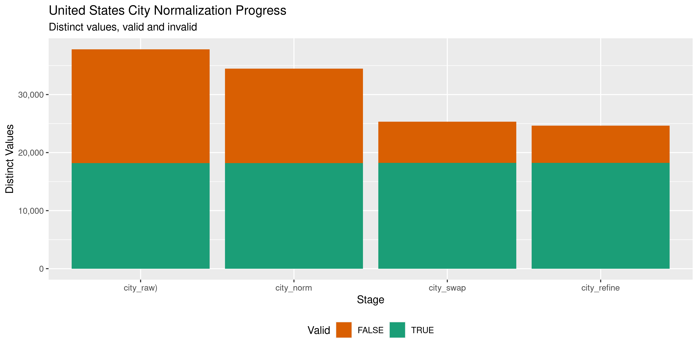

Paycheck Protection Program Loans
================
Kiernan Nicholls
2020-07-09 17:50:06

  - [Project](#project)
  - [Objectives](#objectives)
  - [Packages](#packages)
  - [Data](#data)
  - [Download](#download)
  - [Read](#read)
  - [Explore](#explore)
  - [Wrangle](#wrangle)
  - [Conclude](#conclude)
  - [Export](#export)
  - [Upload](#upload)
  - [Dictionary](#dictionary)

<!-- Place comments regarding knitting here -->

## Project

The Accountability Project is an effort to cut across data silos and
give journalists, policy professionals, activists, and the public at
large a simple way to search across huge volumes of public data about
people and organizations.

Our goal is to standardizing public data on a few key fields by thinking
of each dataset row as a transaction. For each transaction there should
be (at least) 3 variables:

1.  All **parties** to a transaction.
2.  The **date** of the transaction.
3.  The **amount** of money involved.

## Objectives

This document describes the process used to complete the following
objectives:

1.  How many records are in the database?
2.  Check for entirely duplicated records.
3.  Check ranges of continuous variables.
4.  Is there anything blank or missing?
5.  Check for consistency issues.
6.  Create a five-digit ZIP Code called `zip`.
7.  Create a `year` field from the transaction date.
8.  Make sure there is data on both parties to a transaction.

## Packages

The following packages are needed to collect, manipulate, visualize,
analyze, and communicate these results. The `pacman` package will
facilitate their installation and attachment.

The IRW’s `campfin` package will also have to be installed from GitHub.
This package contains functions custom made to help facilitate the
processing of campaign finance data.

``` r
if (!require("pacman")) install.packages("pacman")
pacman::p_load_gh("irworkshop/campfin")
pacman::p_load(
  tidyverse, # data manipulation
  lubridate, # datetime strings
  gluedown, # printing markdown
  janitor, # clean data frames
  refinr, # cluster and merge
  scales, # format strings
  knitr, # knit documents
  vroom, # read files fast
  rvest, # html scraping
  glue, # combine strings
  here, # relative paths
  httr, # http requests
  fs # local storage 
)
```

This document should be run as part of the `R_campfin` project, which
lives as a sub-directory of the more general, language-agnostic
[`irworkshop/accountability_datacleaning`](https://github.com/irworkshop/accountability_datacleaning)
GitHub repository.

The `R_campfin` project uses the [RStudio
projects](https://support.rstudio.com/hc/en-us/articles/200526207-Using-Projects)
feature and should be run as such. The project also uses the dynamic
`here::here()` tool for file paths relative to *your* machine.

``` r
# where does this document knit?
here::here()
#> [1] "/home/kiernan/Code/tap/R_campfin"
```

## Data

Paycheck Protection Loan Data is released by the Small Business
Administration on their public Box cloud storage server. The data
released at the beginning of June does *not* contain exact loan amounts,
only five ranges. For any loans less than the smallest range of $150,000
loans are aggregated and provided as separate files.

> #### Key Aspects of PPP Loan Data
> 
> In releasing PPP loan data to the public, SBA is maintaining a balance
> between providing transparency to American taxpayers and protecting
> small businesses’ confidential business information, such as payroll,
> and personally identifiable information. Small businesses are the
> driving force of American economic stability and are essential to
> America economic rebound from the pandemic. SBA is committed to
> ensuring that any release of PPP loan data does not harm small
> businesses or their employees…

> #### PPP Is A Delegated Loan Making Process
> 
> PPP loans are not made by SBA. PPP loans are made by lending
> institutions and then guaranteed by SBA. Accordingly, borrowers apply
> to lenders and self-certify that they are eligible for PPP loans. The
> self- certification includes a good faith certification that the
> borrower has economic need requiring the loan and that the borrower
> has applied the affiliation rules and is a small business. The lender
> then reviews the borrower’s application, and if all the paperwork is
> in order, approves the loan and submits it to SBA…

> #### Cancelled Loans Do Not Appear In The PPP Loan Data
> 
> The public PPP data includes only active loans. Loans that were
> cancelled for any reason are not included in the public data release.

## Download

We can download PPP loan data from the SBA Box server as a ZIP archive.

``` r
raw_dir <- dir_create(here("us", "covid", "ppp", "data", "raw"))
raw_zip <- path(raw_dir, "All Data by State.zip")
```

We can extract all files from the archive to a `data/raw/` directory.

``` r
raw_path <- unzip(
  zipfile = raw_zip, 
  exdir = raw_dir,
  junkpaths = TRUE
)
```

Loan data is divided into one `foia_150k_plus.csv` file and 57
`foia_up_to_150k_*.csv` files for each state and territory.

``` r
raw_dir %>% 
  dir_info(regexp = "csv$") %>% 
  select(path, size, modification_time) %>% 
  mutate(across(path, basename)) %>% 
  as_tibble()
#> # A tibble: 58 x 3
#>    path                          size modification_time  
#>    <chr>                  <fs::bytes> <dttm>             
#>  1 foia_150k_plus.csv         124.95M 2020-07-09 17:50:10
#>  2 foia_up_to_150k_AK.csv        1.2M 2020-07-09 17:50:08
#>  3 foia_up_to_150k_AL.csv       7.22M 2020-07-09 17:50:08
#>  4 foia_up_to_150k_AR.csv       4.75M 2020-07-09 17:50:08
#>  5 foia_up_to_150k_AS.csv      25.43K 2020-07-09 17:50:08
#>  6 foia_up_to_150k_AZ.csv       9.35M 2020-07-09 17:50:09
#>  7 foia_up_to_150k_CA.csv      64.38M 2020-07-09 17:50:10
#>  8 foia_up_to_150k_CO.csv      11.73M 2020-07-09 17:50:08
#>  9 foia_up_to_150k_CT.csv       7.15M 2020-07-09 17:50:08
#> 10 foia_up_to_150k_DC.csv        1.3M 2020-07-09 17:50:08
#> # … with 48 more rows
```

## Read

We can read all these files into a single data frame using
`purrr::map_df()` and `readr::read_csv()`. There is a slight difference
in columns across the state files and single file; for large loans there
is only a `loan_range` value but for smaller loans broken down by state,
there is a `loan_amount` instead. When we merge these two files
together, `NA` values will be used for any record from a file without a
given variable.

``` r
ppp <- map_df(
  .x = raw_path, 
  .f = read_csv,
  .id = "file",
  na = c("", "N/A", "Unanswered"),
  col_types = cols(
    .default = col_character(),
    LoanRange = col_factor(),
    LoanAmount = col_double(),
    DateApproved = col_date_usa(),
    JobsRetained = col_integer()
  )
)
```

``` r
ppp <- ppp %>% 
  clean_names("snake") %>% 
  relocate(loan_amount, .before = loan_range) %>% 
  mutate(across(non_profit, ~!(is.na(.)))) %>% 
  mutate(across(file, basename)) %>% 
  relocate(file, .after = last_col())
```

## Explore

``` r
glimpse(ppp)
#> Rows: 4,885,388
#> Columns: 18
#> $ loan_amount    <dbl> NA, NA, NA, NA, NA, NA, NA, NA, NA, NA, NA, NA, NA, NA, NA, NA, NA, NA, N…
#> $ loan_range     <fct> a $5-10 million, a $5-10 million, a $5-10 million, a $5-10 million, a $5-…
#> $ business_name  <chr> "ARCTIC SLOPE NATIVE ASSOCIATION, LTD.", "CRUZ CONSTRUCTION INC", "I. C. …
#> $ address        <chr> "7000 Uula St", "7000 East Palmer Wasilla Hwy", "2606 C Street", "11001 O…
#> $ city           <chr> "BARROW", "PALMER", "ANCHORAGE", "ANCHORAGE", "PALMER", "ANCHORAGE", "ANC…
#> $ state          <chr> "AK", "AK", "AK", "AK", "AK", "AK", "AK", "AK", "AK", "AK", "AK", "AK", "…
#> $ zip            <chr> "99723", "99645", "99503", "99515", "99645", "99503", "99502", "99603", "…
#> $ naics_code     <chr> "813920", "238190", "722310", "621111", "517311", "541330", "213112", "62…
#> $ business_type  <chr> "Non-Profit Organization", "Subchapter S Corporation", "Corporation", "Li…
#> $ race_ethnicity <chr> NA, NA, NA, NA, NA, NA, NA, NA, NA, NA, NA, NA, NA, NA, NA, NA, NA, NA, N…
#> $ gender         <chr> NA, NA, NA, NA, NA, NA, NA, NA, NA, NA, NA, NA, NA, NA, NA, NA, NA, NA, N…
#> $ veteran        <chr> NA, NA, NA, NA, NA, NA, NA, NA, NA, NA, NA, NA, NA, NA, NA, NA, NA, NA, N…
#> $ non_profit     <lgl> TRUE, FALSE, FALSE, FALSE, FALSE, FALSE, FALSE, FALSE, FALSE, FALSE, FALS…
#> $ jobs_retained  <int> 295, 215, 367, 0, 267, 231, 298, 439, 361, 0, 0, 220, 126, 135, 180, 216,…
#> $ date_approved  <date> 2020-04-14, 2020-04-15, 2020-04-11, 2020-04-29, 2020-06-10, 2020-05-19, …
#> $ lender         <chr> "National Cooperative Bank, National Association", "First National Bank A…
#> $ cd             <chr> "AK - 00", "AK - 00", "AK - 00", "AK - 00", "AK - 00", "AK - 00", "AK - 0…
#> $ file           <chr> "foia_150k_plus.csv", "foia_150k_plus.csv", "foia_150k_plus.csv", "foia_1…
tail(ppp)
#> # A tibble: 6 x 18
#>   loan_amount loan_range business_name address city  state zip   naics_code business_type
#>         <dbl> <fct>      <chr>         <chr>   <chr> <chr> <chr> <chr>      <chr>        
#> 1           0 <NA>       <NA>          <NA>    <NA>  XX    <NA>  339114     <NA>         
#> 2           0 <NA>       <NA>          <NA>    <NA>  XX    <NA>  339114     <NA>         
#> 3           0 <NA>       <NA>          <NA>    <NA>  XX    <NA>  339114     <NA>         
#> 4           0 <NA>       <NA>          <NA>    <NA>  XX    <NA>  339114     <NA>         
#> 5           0 <NA>       <NA>          <NA>    <NA>  XX    <NA>  339114     <NA>         
#> 6           0 <NA>       <NA>          <NA>    <NA>  XX    <NA>  339114     <NA>         
#> # … with 9 more variables: race_ethnicity <chr>, gender <chr>, veteran <chr>, non_profit <lgl>,
#> #   jobs_retained <int>, date_approved <date>, lender <chr>, cd <chr>, file <chr>
```

### Missing

Variables differ in their degree of missing values.

``` r
col_stats(ppp, count_na)
#> # A tibble: 18 x 4
#>    col            class        n         p
#>    <chr>          <chr>    <int>     <dbl>
#>  1 loan_amount    <dbl>   661218 0.135    
#>  2 loan_range     <fct>  4224170 0.865    
#>  3 business_name  <chr>  4224177 0.865    
#>  4 address        <chr>  4224187 0.865    
#>  5 city           <chr>      246 0.0000504
#>  6 state          <chr>        0 0        
#>  7 zip            <chr>      224 0.0000459
#>  8 naics_code     <chr>   133527 0.0273   
#>  9 business_type  <chr>     4723 0.000967 
#> 10 race_ethnicity <chr>  4364407 0.893    
#> 11 gender         <chr>  3795164 0.777    
#> 12 veteran        <chr>  4139322 0.847    
#> 13 non_profit     <lgl>        0 0        
#> 14 jobs_retained  <int>   324122 0.0663   
#> 15 date_approved  <date>       0 0        
#> 16 lender         <chr>        0 0        
#> 17 cd             <chr>        0 0        
#> 18 file           <chr>        0 0
```

No files are missing any values they aren’t supposed to be missing. For
loans up to $150,000 (the ones aggregated by ZIP code in the individual
state files), there is no `business_name` variable.

### Duplicates

There are a small amount of duplicate records in the database, all of
which can be flagged with a new logical variable.

``` r
d1 <- duplicated(ppp, fromLast = FALSE)
d2 <- duplicated(ppp, fromLast = TRUE)
ppp <- mutate(ppp, dupe_flag = d1 | d2)
percent(mean(ppp$dupe_flag), 0.01)
#> [1] "0.16%"
rm(d1, d2); flush_memory()
```

``` r
ppp %>% 
  filter(dupe_flag) %>% 
  select(loan_range, business_name, lender, date_approved)
#> # A tibble: 7,805 x 4
#>    loan_range         business_name                     lender                        date_approved
#>    <fct>              <chr>                             <chr>                         <date>       
#>  1 d $350,000-1 mill… CREATIVE COMPOUNDS INC            Wells Fargo Bank, National A… 2020-04-29   
#>  2 d $350,000-1 mill… CREATIVE COMPOUNDS INC            Wells Fargo Bank, National A… 2020-04-29   
#>  3 e $150,000-350,000 JOHNS INCREDIBLE PIZZA            Citizens Bank, National Asso… 2020-04-15   
#>  4 e $150,000-350,000 JOHNS INCREDIBLE PIZZA            Citizens Bank, National Asso… 2020-04-15   
#>  5 e $150,000-350,000 TAHOE KEYS RESORT INC             Greater Nevada CU             2020-04-16   
#>  6 e $150,000-350,000 TAHOE KEYS RESORT INC             Greater Nevada CU             2020-04-16   
#>  7 e $150,000-350,000 POU LLC                           Radius Bank                   2020-06-30   
#>  8 e $150,000-350,000 POU LLC                           Radius Bank                   2020-06-30   
#>  9 e $150,000-350,000 THE LEARNING TREE CHILD CARE CEN… TCF National Bank             2020-04-14   
#> 10 e $150,000-350,000 THE LEARNING TREE CHILD CARE CEN… TCF National Bank             2020-04-14   
#> # … with 7,795 more rows
```

### Categorical

``` r
col_stats(ppp, n_distinct)
#> # A tibble: 19 x 4
#>    col            class       n           p
#>    <chr>          <chr>   <int>       <dbl>
#>  1 loan_amount    <dbl>  424226 0.0868     
#>  2 loan_range     <fct>       6 0.00000123 
#>  3 business_name  <chr>  656594 0.134      
#>  4 address        <chr>  628513 0.129      
#>  5 city           <chr>   37626 0.00770    
#>  6 state          <chr>      59 0.0000121  
#>  7 zip            <chr>   36552 0.00748    
#>  8 naics_code     <chr>    1242 0.000254   
#>  9 business_type  <chr>      18 0.00000368 
#> 10 race_ethnicity <chr>       9 0.00000184 
#> 11 gender         <chr>       3 0.000000614
#> 12 veteran        <chr>       3 0.000000614
#> 13 non_profit     <lgl>       2 0.000000409
#> 14 jobs_retained  <int>     507 0.000104   
#> 15 date_approved  <date>     79 0.0000162  
#> 16 lender         <chr>    4895 0.00100    
#> 17 cd             <chr>     597 0.000122   
#> 18 file           <chr>      58 0.0000119  
#> 19 dupe_flag      <lgl>       2 0.000000409
```

``` r
explore_plot(ppp, business_type) + scale_x_truncate()
```

<!-- -->

``` r
explore_plot(ppp, gender)
```

<!-- -->

``` r
explore_plot(ppp, veteran)
```

<!-- -->

``` r
explore_plot(ppp, non_profit)
```

<!-- -->

### Amounts

Since the amount values for loans over $150,000 are given as a range, we
can’t combine them with the exact `loan_amount` given for aggregated
records.

``` r
summary(ppp$loan_amount)
#>    Min. 1st Qu.  Median    Mean 3rd Qu.    Max.    NA's 
#> -199659    9816   20832   33569   46100  150000  661218
mean(ppp$loan_amount <= 0, na.rm = TRUE)
#> [1] 1.704477e-05
```

<!-- -->

<!-- -->

We can combine these two variables into a single one for mapping on the
site. A new logical `range_flag` value will be added to indicate any
record above $150,000 and thus containing only a loan range.

``` r
ppp <- ppp %>%
  # combine the two columns
  unite(
    col = amount_range,
    starts_with("loan_"),
    na.rm = TRUE,
    remove = FALSE
  ) %>% 
  # convert range text to numbers
  mutate(
    amount_range = amount_range %>% 
      str_remove("\\w\\s\\$") %>% 
      str_remove("\\smillion") %>% 
      str_replace_all("(?<=^|-)(\\d{1,2})(?!\\d)", "\\1,000,000") %>% 
      str_remove_all(",")
  ) %>% 
  # flag any column using ranges
  mutate(range_flag = !is.na(loan_range))
```

### Dates

We can add the calendar year from `date_approved` with
`lubridate::year()`

``` r
ppp <- mutate(ppp, year_approved = year(date_approved))
```

``` r
min(ppp$date_approved)
#> [1] "2020-04-03"
sum(ppp$year_approved < 2020)
#> [1] 0
max(ppp$date_approved)
#> [1] "2020-06-30"
sum(ppp$date_approved > today())
#> [1] 0
```

<!-- -->

## Wrangle

To improve the searchability of the database, we will perform some
consistent, confident string normalization. For geographic variables
like city names and ZIP codes, the corresponding `campfin::normal_*()`
functions are tailor made to facilitate this process.

### Address

For the street `addresss` variable, the `campfin::normal_address()`
function will force consistence case, remove punctuation, and abbreviate
official USPS suffixes.

``` r
ppp <- ppp %>% 
  mutate(
    address_norm = normal_address(
      address = address,
      abbs = usps_street,
      na_rep = TRUE
    )
  )
```

``` r
ppp %>% 
  select(starts_with("address")) %>% 
  distinct() %>% 
  sample_n(10)
#> # A tibble: 10 x 2
#>    address                address_norm          
#>    <chr>                  <chr>                 
#>  1 2580 WALDEN ST         2580 WALDEN ST        
#>  2 6735 LOW BID LN        6735 LOW BID LN       
#>  3 13524 South 200 West   13524 S 200 W         
#>  4 356 WESTBURY AVE STE C 356 WESTBURY AVE STE C
#>  5 970 SW 104TH STREET RD 970 SW 104 TH ST RD   
#>  6 1121 S Frontage Rd     1121 S FRONTAGE RD    
#>  7 6105 Cahill Avenue     6105 CAHILL AVE       
#>  8 2244 EULER RD          2244 EULER RD         
#>  9 106 E GREENFIELD LN    106 E GREENFIELD LN   
#> 10 1295 101ST ST          1295 101 ST ST
```

### ZIP

The `zip` variable is already extremely clean.

``` r
progress_table(ppp$zip, compare = valid_zip)
#> # A tibble: 1 x 6
#>   stage prop_in n_distinct   prop_na n_out n_diff
#>   <chr>   <dbl>      <dbl>     <dbl> <dbl>  <dbl>
#> 1 zip     0.999      36552 0.0000459  3554    306
```

### State

The `state` variable is also entirely clean, aside from two values.

For these values of “XX” with a valid `zip` variable, we can use the
matched state abbreviation instead.

``` r
ppp %>% 
  filter(state %out% valid_state) %>% 
  count(state, zip, city, sort = TRUE) %>% 
  left_join(zipcodes, by = "zip")
#> # A tibble: 45 x 6
#>    state.x zip   city.x            n city.y        state.y
#>    <chr>   <chr> <chr>         <int> <chr>         <chr>  
#>  1 XX      <NA>  <NA>            166 <NA>          <NA>   
#>  2 XX      03800 <NA>              2 <NA>          <NA>   
#>  3 FI      33069 POMPANO BEACH     1 POMPANO BEACH FL     
#>  4 XX      01423 <NA>              1 <NA>          <NA>   
#>  5 XX      01776 SUDBURY           1 SUDBURY       MA     
#>  6 XX      01812 <NA>              1 ANDOVER       MA     
#>  7 XX      02006 <NA>              1 <NA>          <NA>   
#>  8 XX      02414 <NA>              1 <NA>          <NA>   
#>  9 XX      02744 <NA>              1 NEW BEDFORD   MA     
#> 10 XX      02910 <NA>              1 CRANSTON      RI     
#> # … with 35 more rows
```

``` r
state_match <- select(zipcodes, zip, state_norm = state)
ppp <- left_join(ppp, state_match, by = "zip")
ppp$state_norm[ppp$state != "XX"] <- NA
ppp <- mutate(ppp, state_norm = coalesce(state_norm, state))
ppp$state_norm <- str_replace(ppp$state_norm, "FI", "FL")
```

``` r
sum(ppp$state == "XX")
#> [1] 210
sum(ppp$state_norm == "XX")
#> [1] 175
ppp %>% 
  filter(state == "XX") %>% 
  count(state_norm, sort = TRUE)
#> # A tibble: 16 x 2
#>    state_norm     n
#>    <chr>      <int>
#>  1 XX           175
#>  2 CA             7
#>  3 SC             7
#>  4 FL             4
#>  5 MA             3
#>  6 ME             2
#>  7 NJ             2
#>  8 NY             2
#>  9 AL             1
#> 10 CT             1
#> 11 MI             1
#> 12 NC             1
#> 13 NH             1
#> 14 NV             1
#> 15 RI             1
#> 16 WA             1
```

### City

Cities are the most difficult geographic variable to normalize, simply
due to the wide variety of valid cities and formats.

#### Normal

The `campfin::normal_city()` function is a good start, again converting
case, removing punctuation, but *expanding* USPS abbreviations. We can
also remove `invalid_city` values.

``` r
ppp <- ppp %>% 
  mutate(
    city_norm = normal_city(
      city = city, 
      abbs = usps_city,
      states = "DC",
      na = invalid_city,
      na_rep = TRUE
    )
  )
```

#### Swap

We can further improve normalization by comparing our normalized value
against the *expected* value for that record’s state abbreviation and
ZIP code. If the normalized value is either an abbreviation for or very
similar to the expected value, we can confidently swap those two.

``` r
ppp <- ppp %>% 
  rename(city_raw = city) %>% 
  left_join(
    y = zipcodes,
    by = c(
      "state_norm" = "state",
      "zip" = "zip"
    )
  ) %>% 
  rename(city_match = city) %>% 
  mutate(
    match_abb = is_abbrev(city_norm, city_match),
    match_dist = str_dist(city_norm, city_match),
    city_swap = if_else(
      condition = !is.na(match_dist) & (match_abb | match_dist == 1),
      true = city_match,
      false = city_norm
    )
  ) %>% 
  select(
    -city_match,
    -match_dist,
    -match_abb
  )
```

#### Refine

The [OpenRefine](https://openrefine.org/) algorithms can be used to
group similar strings and replace the less common versions with their
most common counterpart. This can greatly reduce inconsistency, but with
low confidence; we will only keep any refined strings that have a valid
city/state/zip combination.

``` r
good_refine <- ppp %>% 
  mutate(
    city_refine = city_swap %>% 
      key_collision_merge() %>% 
      n_gram_merge(numgram = 1)
  ) %>% 
  filter(city_refine != city_swap) %>% 
  inner_join(
    y = zipcodes,
    by = c(
      "city_refine" = "city",
      "state_norm" = "state",
      "zip" = "zip"
    )
  )
```

    #> # A tibble: 686 x 5
    #>    state_norm zip   city_swap              city_refine        n
    #>    <chr>      <chr> <chr>                  <chr>          <int>
    #>  1 SC         29406 NORTH CHARLESTON       CHARLESTON       393
    #>  2 NY         11733 SETAUKET               EAST SETAUKET     92
    #>  3 CA         90292 MARINA DALE REY        MARINA DEL REY    90
    #>  4 NY         11733 SETAUKET EAST SETAUKET EAST SETAUKET     30
    #>  5 CA         92625 CORONA DALE MAR        CORONA DEL MAR    28
    #>  6 IN         46184 NEW WHITELAND          WHITELAND         18
    #>  7 IL         60429 EAST HAZEL CREST       HAZEL CREST       15
    #>  8 HI         96813 HONOLULULULU           HONOLULU           6
    #>  9 IL         60067 PALENTINE              PALATINE           6
    #> 10 HI         96813 HONOLULUNOLULU         HONOLULU           5
    #> # … with 676 more rows

Then we can join the refined values back to the database.

``` r
ppp <- ppp %>% 
  left_join(good_refine) %>% 
  mutate(city_refine = coalesce(city_refine, city_swap))
```

#### Progress

| stage        | prop\_in | n\_distinct | prop\_na | n\_out | n\_diff |
| :----------- | -------: | ----------: | -------: | -----: | ------: |
| city\_raw)   |    0.982 |       37626 |        0 |  86310 |   19480 |
| city\_norm   |    0.988 |       34403 |        0 |  57711 |   16247 |
| city\_swap   |    0.993 |       25728 |        0 |  33515 |    7531 |
| city\_refine |    0.993 |       25181 |        0 |  32533 |    6986 |

You can see how the percentage of valid values increased with each
stage.

<!-- -->

More importantly, the number of distinct values decreased each stage. We
were able to confidently change many distinct invalid values to their
valid equivalent.

<!-- -->

## Conclude

Before exporting, we can remove the intermediary normalization columns
and rename all added variables with the `_clean` suffix.

``` r
ppp <- ppp %>% 
  select(
    -city_norm,
    -city_swap,
    city_clean = city_refine
  ) %>% 
  rename_all(~str_replace(., "_norm", "_clean")) %>% 
  rename_all(~str_remove(., "_raw"))
```

``` r
glimpse(sample_n(ppp, 20))
#> Rows: 20
#> Columns: 25
#> $ amount_range   <chr> "20800", "24500", "42495", "20047", "150000-350000", "20207", "23700", "5…
#> $ loan_amount    <dbl> 20800, 24500, 42495, 20047, NA, 20207, 23700, 51922, NA, 66000, 3983, NA,…
#> $ loan_range     <fct> NA, NA, NA, NA, "e $150,000-350,000", NA, NA, NA, "e $150,000-350,000", N…
#> $ business_name  <chr> NA, NA, NA, NA, "PENNSYLVANIA PAIN SPECIALISTS, PC", NA, NA, NA, "ALLEGHE…
#> $ address        <chr> NA, NA, NA, NA, "163 North Commerce Way", NA, NA, NA, "495 WATERFRONT DR"…
#> $ city           <chr> "NEWBURGH", "LIBBY", "JACKSONVILLE", "FRANKFORT", "BETHLEHEM", "BENSALEM"…
#> $ state          <chr> "NY", "MT", "FL", "MI", "PA", "PA", "CO", "NV", "PA", "CA", "CA", "TN", "…
#> $ zip            <chr> "12550", "59923", "32207", "49635", "18017", "19020", "80908", "89138", "…
#> $ naics_code     <chr> "448310", "541511", "423940", "813110", "621111", "484220", "541110", "54…
#> $ business_type  <chr> "Corporation", "Corporation", "Limited  Liability Company(LLC)", "Non-Pro…
#> $ race_ethnicity <chr> "White", NA, NA, NA, NA, NA, NA, NA, NA, NA, NA, NA, NA, NA, NA, NA, NA, …
#> $ gender         <chr> "Male Owned", NA, "Male Owned", NA, NA, NA, NA, NA, NA, NA, NA, NA, NA, N…
#> $ veteran        <chr> "Non-Veteran", NA, NA, NA, NA, NA, NA, NA, NA, "Non-Veteran", NA, NA, NA,…
#> $ non_profit     <lgl> FALSE, FALSE, FALSE, TRUE, FALSE, FALSE, FALSE, FALSE, FALSE, FALSE, FALS…
#> $ jobs_retained  <int> 1, 4, 5, 4, 12, 0, 2, 9, 14, 5, 1, 33, 19, 0, 15, NA, 12, NA, 3, 2
#> $ date_approved  <date> 2020-04-13, 2020-04-27, 2020-04-30, 2020-05-05, 2020-04-29, 2020-06-26, …
#> $ lender         <chr> "KeyBank National Association", "Glacier Bank", "American Express Nationa…
#> $ cd             <chr> "NY - 18", "MT - 00", "FL - 01", "MI - 01", "PA - 15", "PA - 01", "CO - 0…
#> $ file           <chr> "foia_up_to_150k_NY.csv", "foia_up_to_150k_MT.csv", "foia_up_to_150k_FL.c…
#> $ dupe_flag      <lgl> FALSE, FALSE, FALSE, FALSE, FALSE, FALSE, FALSE, FALSE, FALSE, FALSE, FAL…
#> $ range_flag     <lgl> FALSE, FALSE, FALSE, FALSE, TRUE, FALSE, FALSE, FALSE, TRUE, FALSE, FALSE…
#> $ year_approved  <dbl> 2020, 2020, 2020, 2020, 2020, 2020, 2020, 2020, 2020, 2020, 2020, 2020, 2…
#> $ address_clean  <chr> NA, NA, NA, NA, "163 N COMMERCE WAY", NA, NA, NA, "495 WATERFRONT DR", NA…
#> $ state_clean    <chr> "NY", "MT", "FL", "MI", "PA", "PA", "CO", "NV", "PA", "CA", "CA", "TN", "…
#> $ city_clean     <chr> "NEWBURGH", "LIBBY", "JACKSONVILLE", "FRANKFORT", "BETHLEHEM", "BENSALEM"…
```

1.  There are 4,885,390 records in the database.
2.  There are 7,807 duplicate records in the database.
3.  The range and distribution of `amount` and `date` seem reasonable.
4.  There are 0 records missing key variables.
5.  Consistency in geographic data has been improved with
    `campfin::normal_*()`.
6.  The 4-digit `year` variable has been created with
    `lubridate::year()`.

## Export

Now the file can be saved on disk for upload to the Accountability
server. The data frame will be split into two files, the original file
types for loans over and under $150,000.

``` r
clean_dir <- dir_create(here("us", "covid", "ppp", "data", "clean"))
clean_path <- path(clean_dir, "sba_ppp_loans.csv")
write_csv(ppp, clean_path, na = "")
file_size(clean_path)
#> 881M
file_encoding(clean_path)
#> # A tibble: 1 x 3
#>   path                                                                      mime            charset
#>   <fs::path>                                                                <chr>           <chr>  
#> 1 /home/kiernan/Code/tap/R_campfin/us/covid/ppp/data/clean/sba_ppp_loans.c… application/csv us-asc…
```

## Upload

Using the [duckr](https://github.com/kiernann/duckr) R package, we can
wrap around the [duck](https://duck.sh/) command line tool to upload the
file to the IRW server.

``` r
# remotes::install_github("kiernann/duckr")
s3_dir <- "s3:/publicaccountability/csv/"
s3_path <- path(s3_dir, basename(clean_path))
if (require(duckr)) {
  duckr::duck_upload(clean_path, s3_path)
}
```

## Dictionary

The following table describes the variables in our final exported file:

| Column           | Type        | Definition                                    |
| :--------------- | :---------- | :-------------------------------------------- |
| `amount_range`   | `character` | Combined loan amount with range               |
| `loan_amount`    | `double`    | Aggregated loan amount (under $150,000)       |
| `loan_range`     | `integer`   | Loan range (over $150,000)                    |
| `business_name`  | `character` | Recipient business name                       |
| `address`        | `character` | Recipient business address                    |
| `city`           | `character` | Recipient business city name                  |
| `state`          | `character` | Recipient business state abbreviation         |
| `zip`            | `character` | Recipient business ZIP code                   |
| `naics_code`     | `character` | North American Industry Classification System |
| `business_type`  | `character` | Recipient business type                       |
| `race_ethnicity` | `character` | Recipient owner race or ethnicity             |
| `gender`         | `character` | Recipient owner gender                        |
| `veteran`        | `character` | Recipient owner veteran status                |
| `non_profit`     | `logical`   | Recipient business is non-profit              |
| `jobs_retained`  | `integer`   | Individual jobs retained by loan              |
| `date_approved`  | `double`    | Date loan approved                            |
| `lender`         | `character` | Lending institution name                      |
| `cd`             | `character` | Loan recipient location code                  |
| `file`           | `character` | Source file name                              |
| `dupe_flag`      | `logical`   | Flag indicating duplicate record              |
| `range_flag`     | `logical`   | Flag indicating range amount                  |
| `year_approved`  | `double`    | Calendar year approved                        |
| `address_clean`  | `character` | Normalized recipient address                  |
| `state_clean`    | `character` | Normalized recipient state                    |
| `city_clean`     | `character` | Normalized recipient city                     |
