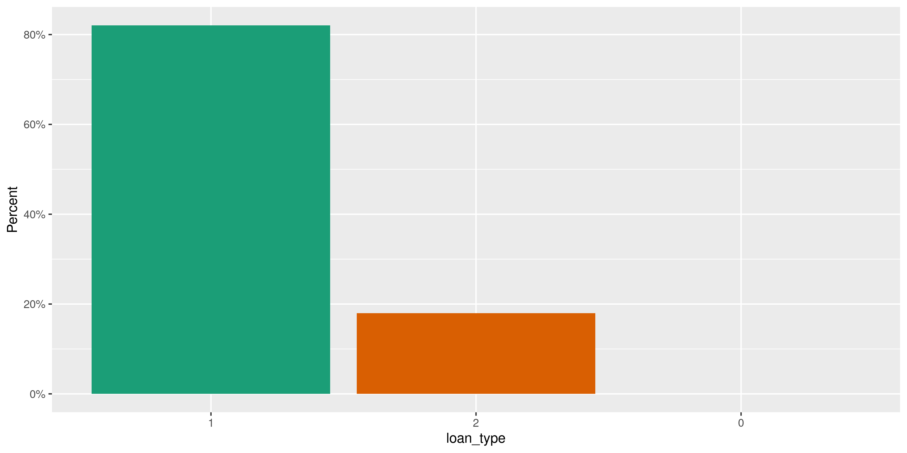
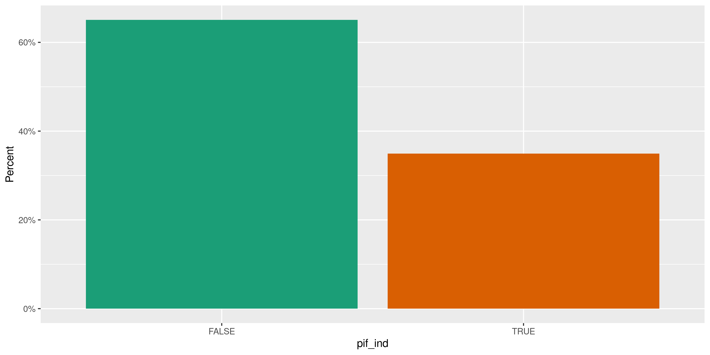
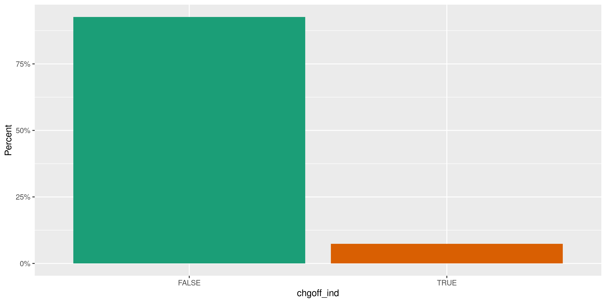
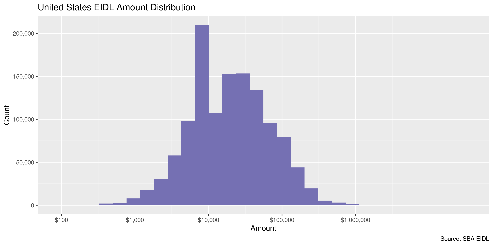
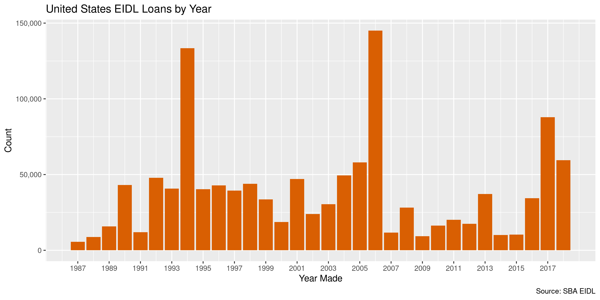
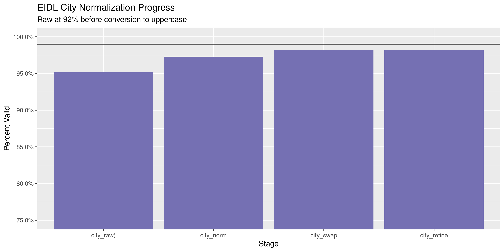

United States Economic Injury Disaster Loans Diary
================
Kiernan Nicholls
2020-07-30 13:38:19

  - [Project](#project)
  - [Objectives](#objectives)
  - [Packages](#packages)
  - [Data](#data)
  - [Read](#read)
  - [Explore](#explore)
  - [Wrangle](#wrangle)
  - [Conclude](#conclude)
  - [Export](#export)
  - [Upload](#upload)
  - [Dictionary](#dictionary)

<!-- Place comments regarding knitting here -->

## Project

The Accountability Project is an effort to cut across data silos and
give journalists, policy professionals, activists, and the public at
large a simple way to search across huge volumes of public data about
people and organizations.

Our goal is to standardizing public data on a few key fields by thinking
of each dataset row as a transaction. For each transaction there should
be (at least) 3 variables:

1.  All **parties** to a transaction.
2.  The **date** of the transaction.
3.  The **amount** of money involved.

## Objectives

This document describes the process used to complete the following
objectives:

1.  How many records are in the database?
2.  Check for entirely duplicated records.
3.  Check ranges of continuous variables.
4.  Is there anything blank or missing?
5.  Check for consistency issues.
6.  Create a five-digit ZIP Code called `zip`.
7.  Create a `year` field from the transaction date.
8.  Make sure there is data on both parties to a transaction.

## Packages

The following packages are needed to collect, manipulate, visualize,
analyze, and communicate these results. The `pacman` package will
facilitate their installation and attachment.

The IRW’s `campfin` package will also have to be installed from GitHub.
This package contains functions custom made to help facilitate the
processing of campaign finance data.

``` r
if (!require("pacman")) install.packages("pacman")
pacman::p_load_gh("irworkshop/campfin")
pacman::p_load(
  tidyverse, # data manipulation
  lubridate, # datetime strings
  gluedown, # printing markdown
  magrittr, # pipe operators
  janitor, # clean data frames
  refinr, # cluster and merge
  scales, # format strings
  readxl, # read excel files
  knitr, # knit documents
  vroom, # read files fast
  rvest, # html scraping
  glue, # combine strings
  here, # relative paths
  httr, # http requests
  fs # local storage 
)
```

This document should be run as part of the `R_campfin` project, which
lives as a sub-directory of the more general, language-agnostic
[`irworkshop/accountability_datacleaning`](https://github.com/irworkshop/accountability_datacleaning)
GitHub repository.

The `R_campfin` project uses the [RStudio
projects](https://support.rstudio.com/hc/en-us/articles/200526207-Using-Projects)
feature and should be run as such. The project also uses the dynamic
`here::here()` tool for file paths relative to *your* machine.

``` r
# where does this document knit?
here::here()
#> [1] "/home/kiernan/Code/tap/R_campfin"
```

## Data

The Economic Injury Disaster Loans (EIDL) are a program of the Small
Business Administration. EIDL loans are typically given to relieve the
economic strain of natural disasters on local economies.

The Investigative Reporting Workshop has obtained a copy of EIDL loan
disbursement from Investigative Reporters and Editors, Inc. (IRE), which
they originally obtained via a Freedom of Information Act request. The
raw data set can be purchased from IRE for $150.

> NICAR receives this data as an Access database from the SBA through a
> FOIA request; we do not reformat or clean the data in any way. For the
> Access file we change the names of the tables to make them easier to
> use; for the CSV format we simply export the tables as comma-delimited
> files with double quote text qualifiers…
> 
> Disaster loans from the Small Business Administration are the primary
> form of federal assistance for non-farm, private-sector disaster
> losses. For this reason, the disaster loans program is the only form
> of SBA assistance not limited to small businesses. Disaster loans from
> SBA help homeowners, renters, businesses of all sizes and nonprofit
> organizations finance their rebuilding. The data identifies the
> borrower, the disaster, the amount and, for business borrowers,
> whether the loan was paid in full or deemed uncollectible.

The file from IRE is obtained as a single ZIP archive.

``` r
raw_dir <- dir_create(here("us", "eidl", "data", "raw"))
raw_zip <- path(raw_dir, "SBADisaster_CSV_update.zip")
file_size(raw_zip)
#> 46.8M
```

We can extract the contents and move them to the raw directory.

``` r
unzip(raw_zip, exdir = raw_dir)
sba_dir <- path(raw_dir, "SBADisaster_CSV_update")
raw_files <- dir_ls(sba_dir) %>% 
  # str_subset(negate = TRUE)
  file_move(raw_dir)
dir_delete(sba_dir)
```

The ZIP archive contains a README file which tells us how to properly
load data.

``` r
readme <- read_lines(path(raw_dir, "Readme_CSV.txt"))
md_quote(readme[4])
#> > This update contains information on 1,222,316 loans from October 1987 through July 31, 2018. This update replaces a previous version of the data that covered 1979 through February 2016. The data was not combined due to lack of a unique ID number that prevented checks for duplicate records. For previous data, please contact Director of Data Services Charles Minshew at charles@ire.org
md_quote(readme[14:18])
#> > SBA_Disaster folder, which includes these tables: 
#> >    Disaster: Table of companies and individuals receiving disaster loans
#> >    Dislook: Lookup table to decipher which specific disaster is associated with the loan
#> >    SIC_Codes: Lookup table of Standard Industry Classification (SIC) codes 
#> >    NAIC_Codes: Lookup table of North American Industrial Classification codes
```

## Read

Per the README, we can read the `Disaster.csv` file to get loan data.

``` r
eidl <- vroom(
  file = path(raw_dir, "Disaster.csv"),
  escape_backslash = FALSE,
  escape_double = TRUE,
  delim = ",",
  na = c("", "NA"),
  .name_repair = make_clean_names,
  col_types = cols(
    .default = col_character(),
    LOANTYPE = col_factor(),
    APPROVALAMT = col_double(),
    LOANAPPVDT = col_date("%Y%m%d")
  )
)
```

``` r
count(eidl, pif_ind)
#> # A tibble: 2 x 2
#>   pif_ind      n
#>   <chr>    <int>
#> 1 P I F   426922
#> 2 <NA>    795394
count(eidl, chgoff_ind)
#> # A tibble: 2 x 2
#>   chgoff_ind       n
#>   <chr>        <int>
#> 1 CHGOFF       89819
#> 2 <NA>       1132497
eidl <- mutate(eidl, across(12:13, ~!is.na(.)))
```

## Explore

``` r
glimpse(eidl)
#> Rows: 1,222,316
#> Columns: 13
#> $ loan_type  <fct> 1, 1, 1, 1, 1, 1, 1, 1, 1, 1, 1, 1, 1, 1, 1, 1, 1, 2, 1, 1, 1, 1, 1, 1, 1, 2,…
#> $ diaster_id <chr> "153228", "137686", "152748", "127808", "149118", "101768", "153028", "329911…
#> $ borrower   <chr> "Rosa M. Bernat PocoVI", "PAMELA MCMULLEN", "Esequiel Lopez", "Inell  Jones",…
#> $ address    <chr> "BO MIRAFLORES ESPINO CARR 663", "225 IROQUOIS DRIVE", "2009 ANGELITA DR", "P…
#> $ city       <chr> "ARECIBO", "BOULDER", "SINTON", "RAHWAY", "RED SPRINGS", "NEW ORLEANS", "JACK…
#> $ state      <chr> "PR", "CO", "TX", "NJ", "NC", "LA", "FL", "OH", "PR", "PR", "TN", "FL", "FL",…
#> $ zip        <chr> "612", "80303", "78387", "7065", "28377", "70127", "32207", "45420", "767", "…
#> $ date       <date> 2018-01-02, 2013-10-22, 2017-11-14, 2011-10-27, 2016-11-01, 2006-02-25, 2017…
#> $ amount     <dbl> 62500, 30400, 23800, 14000, 17500, 170600, 7300, 121500, 83400, 17400, 214900…
#> $ siccd      <chr> "0", "0", "0", "0", "0", "0", "0", "0", "0", "0", "0", "0", "0", "0", "0", "0…
#> $ naicscd    <chr> NA, NA, NA, NA, NA, NA, NA, NA, NA, NA, NA, NA, NA, NA, NA, NA, NA, "531110",…
#> $ pif_ind    <lgl> FALSE, FALSE, FALSE, FALSE, FALSE, FALSE, FALSE, FALSE, FALSE, FALSE, FALSE, …
#> $ chgoff_ind <lgl> FALSE, FALSE, FALSE, FALSE, FALSE, FALSE, FALSE, FALSE, FALSE, FALSE, FALSE, …
tail(eidl)
#> # A tibble: 6 x 13
#>   loan_type diaster_id borrower address city  state zip   date       amount siccd naicscd pif_ind
#>   <fct>     <chr>      <chr>    <chr>   <chr> <chr> <chr> <date>      <dbl> <chr> <chr>   <lgl>  
#> 1 1         254308     LAALOI … PO BOX… PAGO… AS    96799 1992-03-30  10000 0     <NA>    FALSE  
#> 2 1         269702     HENRY &… 6713 V… WEST… CA    91307 1994-03-23  44800 0     <NA>    TRUE   
#> 3 1         269802     CAROLYN… PO BOX… UPLA… CA    91785 1994-06-20   5200 0     <NA>    TRUE   
#> 4 1         305706     OLIVE M… 17  FO… SAN … CA    94131 1998-03-17   7600 0     <NA>    FALSE  
#> 5 1         242206     CHARLES… P.O. B… REYD… AR    72133 1990-07-12  28900 0     <NA>    TRUE   
#> 6 1         269702     JESSIE … 14641 … MISS… CA    91345 1994-02-24  13700 0     <NA>    TRUE   
#> # … with 1 more variable: chgoff_ind <lgl>
```

### Missing

No records are missing key values that need to be flagged.

``` r
col_stats(eidl, count_na)
#> # A tibble: 13 x 4
#>    col        class        n        p
#>    <chr>      <chr>    <int>    <dbl>
#>  1 loan_type  <fct>        0 0       
#>  2 diaster_id <chr>        0 0       
#>  3 borrower   <chr>        0 0       
#>  4 address    <chr>        0 0       
#>  5 city       <chr>        0 0       
#>  6 state      <chr>      175 0.000143
#>  7 zip        <chr>        0 0       
#>  8 date       <date>       0 0       
#>  9 amount     <dbl>        0 0       
#> 10 siccd      <chr>        0 0       
#> 11 naicscd    <chr>  1046860 0.856   
#> 12 pif_ind    <lgl>        0 0       
#> 13 chgoff_ind <lgl>        0 0
```

### Duplicates

``` r
d1 <- duplicated(eidl, fromLast = FALSE)
d2 <- duplicated(eidl, fromLast = TRUE)
eidl <- mutate(eidl, dupe_flag = d1 | d2)
sum(eidl$dupe_flag)
#> [1] 1841
rm(d1, d2); flush_memory()
```

``` r
eidl %>% 
  filter(dupe_flag) %>% 
  select(date, borrower, amount, diaster_id) %>% 
  arrange(date)
#> # A tibble: 1,841 x 4
#>    date       borrower                       amount diaster_id
#>    <date>     <chr>                           <dbl> <chr>     
#>  1 1987-11-04 GREEN GABLES RESTAURANT         14000 633500    
#>  2 1987-11-04 GREEN GABLES RESTAURANT         14000 633500    
#>  3 1987-11-10 JOSEPH RODRIQUEZ                 6700 229202    
#>  4 1987-11-10 JOSEPH RODRIQUEZ                 6700 229202    
#>  5 1988-05-11 ANDREW W AND PATRICIA I MILLER  11600 230506    
#>  6 1988-05-11 ANDREW W AND PATRICIA I MILLER  11600 230506    
#>  7 1989-09-06 JAMES & ANNA HALBOHM             9400 235706    
#>  8 1989-09-06 JAMES & ANNA HALBOHM             9400 235706    
#>  9 1989-11-30 HERBERT L AND ALICE PARNELL     40000 238702    
#> 10 1989-11-30 HERBERT L AND ALICE PARNELL     40000 238702    
#> # … with 1,831 more rows
```

### Categorical

``` r
col_stats(eidl, n_distinct)
#> # A tibble: 14 x 4
#>    col        class        n          p
#>    <chr>      <chr>    <int>      <dbl>
#>  1 loan_type  <fct>        3 0.00000245
#>  2 diaster_id <chr>     4615 0.00378   
#>  3 borrower   <chr>  1156365 0.946     
#>  4 address    <chr>  1070826 0.876     
#>  5 city       <chr>    30498 0.0250    
#>  6 state      <chr>       94 0.0000769 
#>  7 zip        <chr>    31002 0.0254    
#>  8 date       <date>    8791 0.00719   
#>  9 amount     <dbl>     7338 0.00600   
#> 10 siccd      <chr>      894 0.000731  
#> 11 naicscd    <chr>     1229 0.00101   
#> 12 pif_ind    <lgl>        2 0.00000164
#> 13 chgoff_ind <lgl>        2 0.00000164
#> 14 dupe_flag  <lgl>        2 0.00000164
```

``` r
explore_plot(eidl, loan_type)
```

<!-- -->

``` r
explore_plot(eidl, pif_ind)
```

<!-- -->

``` r
explore_plot(eidl, chgoff_ind)
```

<!-- -->

### Amounts

``` r
summary(eidl$amount)
#>     Min.  1st Qu.   Median     Mean  3rd Qu.     Max. 
#>      100     8900    19500    41266    45100 25046400
mean(eidl$amount <= 0)
#> [1] 0
```

<!-- -->

### Dates

We can add the calendar year from `date` with `lubridate::year()`

``` r
eidl <- mutate(eidl, year = year(date))
```

``` r
min(eidl$date)
#> [1] "1987-10-05"
mean(eidl$year < 2000)
#> [1] 0.4148698
max(eidl$date)
#> [1] "2018-07-31"
sum(eidl$date > today())
#> [1] 0
```

<!-- -->

## Wrangle

To improve the searchability of the database, we will perform some
consistent, confident string normalization. For geographic variables
like city names and ZIP codes, the corresponding `campfin::normal_*()`
functions are tailor made to facilitate this process.

### Address

For the street `addresss` variable, the `campfin::normal_address()`
function will force consistence case, remove punctuation, and abbreviate
official USPS suffixes.

``` r
eidl <- mutate(
  .data = eidl,
  address_norm = normal_address(
    address = address,
    abbs = usps_street,
    na_rep = TRUE
  )
)
```

``` r
eidl %>% 
  select(contains("address")) %>% 
  distinct() %>% 
  sample_n(10)
#> # A tibble: 10 x 2
#>    address                  address_norm          
#>    <chr>                    <chr>                 
#>  1 208 MERRYWOOD DR         208 MERRYWOOD DR      
#>  2 1105 S ARCH STREET       1105 S ARCH ST        
#>  3 158 BASSWOOD DR          158 BASSWOOD DR       
#>  4 19303  WADLEY AVE        19303 WADLEY AVE      
#>  5 PO BOX 9023807           PO BOX 9023807        
#>  6 14008  HAMLIN ST         14008 HAMLIN ST       
#>  7 RURAL ROUTE 1 BOX 122 AA RURAL RTE 1 BOX 122 AA
#>  8 9570  CEDAR CREEK        9570 CEDAR CRK        
#>  9 2511 ANDERSON ROAD       2511 ANDERSON RD      
#> 10 14000 WEST 78TH AVENUE   14000 W 78 TH AVE
```

### ZIP

For ZIP codes, the `campfin::normal_zip()` function will attempt to
create valid *five* digit codes by removing the ZIP+4 suffix and
returning leading zeroes dropped by other programs like Microsoft Excel.

``` r
eidl <- mutate(
  .data = eidl,
  zip_norm = normal_zip(
    zip = zip,
    na_rep = TRUE
  )
)
```

``` r
progress_table(
  eidl$zip,
  eidl$zip_norm,
  compare = valid_zip
)
#> # A tibble: 2 x 6
#>   stage    prop_in n_distinct prop_na  n_out n_diff
#>   <chr>      <dbl>      <dbl>   <dbl>  <dbl>  <dbl>
#> 1 zip        0.873      31002 0       155664   3666
#> 2 zip_norm   0.997      30991 0.00134   4014   1104
```

### State

Valid two digit state abbreviations can be made using the
`campfin::normal_state()` function.

``` r
eidl <- mutate(eidl, state_norm = state)
state_match <- eidl %>% 
  count(state_norm, zip_norm, sort = TRUE) %>% 
  left_join(zipcodes, by = c("zip_norm" = "zip")) %>% 
  filter(state_norm %out% valid_state) %>% 
  drop_na() %>% 
  count(state_norm, state, sort = TRUE) %>% 
  select(state_norm, state_match = state)
```

``` r
eidl <- eidl %>% 
  left_join(state_match) %>% 
  mutate(state_norm = coalesce(state_match, state_norm)) %>% 
  select(-state_match)
```

``` r
progress_table(
  eidl$state,
  eidl$state_norm,
  compare = valid_state
)
#> # A tibble: 2 x 6
#>   stage      prop_in n_distinct  prop_na n_out n_diff
#>   <chr>        <dbl>      <dbl>    <dbl> <dbl>  <dbl>
#> 1 state         1.00         94 0.000143   409     32
#> 2 state_norm    1.00         70 0.000143     8      8
```

### City

Cities are the most difficult geographic variable to normalize, simply
due to the wide variety of valid cities and formats.

#### Normal

The `campfin::normal_city()` function is a good start, again converting
case, removing punctuation, but *expanding* USPS abbreviations. We can
also remove `invalid_city` values.

``` r
eidl <- mutate(
  .data = eidl,
  city_norm = normal_city(
    city = city, 
    abbs = usps_city,
    states = "DC",
    na = invalid_city,
    na_rep = TRUE
  )
)
```

#### Swap

We can further improve normalization by comparing our normalized value
against the *expected* value for that record’s state abbreviation and
ZIP code. If the normalized value is either an abbreviation for or very
similar to the expected value, we can confidently swap those two.

``` r
eidl <- eidl %>% 
  rename(city_raw = city) %>% 
  left_join(
    y = zipcodes,
    by = c(
      "state_norm" = "state",
      "zip_norm" = "zip"
    )
  ) %>% 
  rename(city_match = city) %>% 
  mutate(
    match_abb = is_abbrev(city_norm, city_match),
    match_dist = str_dist(city_norm, city_match),
    city_swap = if_else(
      condition = !is.na(match_dist) & (match_abb | match_dist == 1),
      true = city_match,
      false = city_norm
    )
  ) %>% 
  select(
    -city_match,
    -match_dist,
    -match_abb
  )
```

#### Refine

The [OpenRefine](https://openrefine.org/) algorithms can be used to
group similar strings and replace the less common versions with their
most common counterpart. This can greatly reduce inconsistency, but with
low confidence; we will only keep any refined strings that have a valid
city/state/zip combination.

``` r
good_refine <- eidl %>% 
  mutate(
    city_refine = city_swap %>% 
      key_collision_merge() %>% 
      n_gram_merge(numgram = 1)
  ) %>% 
  filter(city_refine != city_swap) %>% 
  inner_join(
    y = zipcodes,
    by = c(
      "city_refine" = "city",
      "state_norm" = "state",
      "zip_norm" = "zip"
    )
  )
```

    #> # A tibble: 233 x 5
    #>    state_norm zip_norm city_swap             city_refine        n
    #>    <chr>      <chr>    <chr>                 <chr>          <int>
    #>  1 SC         29406    NORTH CHARLESTON      CHARLESTON        85
    #>  2 SC         29419    NORTH CHARLESTON      CHARLESTON        23
    #>  3 NY         11733    SETAUKET              EAST SETAUKET      8
    #>  4 PR         00745    RIO GRANDE RIO GRANDE RIO GRANDE         6
    #>  5 SC         29415    NORTH CHARLESTON      CHARLESTON         6
    #>  6 CA         90292    MARINA DALE REY       MARINA DEL REY     5
    #>  7 SC         29423    NORTH CHARLESTON      CHARLESTON         5
    #>  8 NJ         08008    HAVEN BEACH           BEACH HAVEN        4
    #>  9 NY         11968    SOUTH HAMPTON         SOUTHAMPTON        4
    #> 10 AL         35754    LACEY SPRINGS         LACEYS SPRING      3
    #> # … with 223 more rows

Then we can join the refined values back to the database.

``` r
eidl <- eidl %>% 
  left_join(good_refine) %>% 
  mutate(city_refine = coalesce(city_refine, city_swap))
```

#### Progress

Almost all of the remaining unknown cities are in Guam, the Virgin
Islands, or similar territories whose cities are not in our list. These
are places often affected by natural disasters.

``` r
many_city <- c(valid_city, extra_city)
eidl %>% 
  filter(city_refine %out% many_city) %>% 
  count(city_refine, state_norm, sort = TRUE) %>% 
  add_prop(sum = TRUE)
#> # A tibble: 5,096 x 4
#>    city_refine               state_norm     n      p
#>    <chr>                     <chr>      <int>  <dbl>
#>  1 AGANA                     GU          1796 0.0816
#>  2 GMF                       GU          1237 0.138 
#>  3 CHRISTIANSTED SAINT CROIX VI          1176 0.191 
#>  4 RIO PIEDRAS               PR           703 0.223 
#>  5 KINGSHILL SAINT CROIX     VI           656 0.253 
#>  6 FREDERIKSTED SAINT CROIX  VI           596 0.280 
#>  7 SANTURCE                  PR           356 0.296 
#>  8 SEPULVEDA                 CA           333 0.311 
#>  9 TALOFOFO                  GU           285 0.324 
#> 10 SINAJANA                  GU           277 0.337 
#> # … with 5,086 more rows
```

| stage        | prop\_in | n\_distinct | prop\_na | n\_out | n\_diff |
| :----------- | -------: | ----------: | -------: | -----: | ------: |
| city\_raw)   |    0.952 |       26510 |        0 |  59255 |   11560 |
| city\_norm   |    0.973 |       24497 |        0 |  33109 |    9498 |
| city\_swap   |    0.982 |       20074 |        0 |  22278 |    5040 |
| city\_refine |    0.982 |       19876 |        0 |  22005 |    4843 |

You can see how the percentage of valid values increased with each
stage.

<!-- -->

More importantly, the number of distinct values decreased each stage. We
were able to confidently change many distinct invalid values to their
valid equivalent.

<!-- -->

## Conclude

Before exporting, we can remove the intermediary normalization columns
and rename all added variables with the `_clean` suffix.

``` r
eidl <- eidl %>% 
  select(
    -city_norm,
    -city_swap,
    city_clean = city_refine
  ) %>% 
  rename_all(~str_replace(., "_norm", "_clean")) %>% 
  rename_all(~str_remove(., "_raw"))
```

``` r
glimpse(sample_n(eidl, 50))
#> Rows: 50
#> Columns: 19
#> $ loan_type     <fct> 1, 1, 1, 1, 1, 1, 1, 1, 1, 1, 2, 2, 2, 1, 1, 1, 1, 1, 2, 1, 2, 1, 1, 1, 1,…
#> $ diaster_id    <chr> "262906", "363508", "101768", "269702", "296111", "133678", "289408", "282…
#> $ borrower      <chr> "ROBERT T & TERESA FAITEL", "JOHN C AND WILLA L DAVIS", "Mitchell Rick", "…
#> $ address       <chr> "2510  HACIENDA DR", "180  BALDWIN CT", "25295  STEPP RD", "20027 SEPTO ST…
#> $ city          <chr> "SANTA BARBARA", "PORT CHARLOTTE", "ROBERT", "CHATSWORTH", "MILWAUKEE", "B…
#> $ state         <chr> "CA", "FL", "LA", "CA", "WI", "NJ", "NC", "PA", "SC", "CO", "GA", "LA", "G…
#> $ zip           <chr> "93105", "33952", "70455", "91311", "53218", "8723", "27810", "16822", "29…
#> $ date          <date> 1993-08-27, 2005-03-10, 2005-11-10, 1994-03-25, 1997-08-19, 2013-02-22, 1…
#> $ amount        <dbl> 37600, 50400, 57800, 45000, 4700, 26500, 7200, 7000, 12000, 9800, 88000, 2…
#> $ siccd         <chr> "0", "0", "0", "0", "0", "0", "0", "0", "0", "0", "0", "0", "7623", "0", "…
#> $ naicscd       <chr> NA, NA, NA, NA, NA, NA, NA, NA, NA, NA, "114112", "531110", NA, NA, NA, NA…
#> $ pif_ind       <lgl> TRUE, FALSE, FALSE, FALSE, FALSE, TRUE, FALSE, TRUE, TRUE, FALSE, TRUE, TR…
#> $ chgoff_ind    <lgl> FALSE, FALSE, FALSE, FALSE, FALSE, FALSE, FALSE, FALSE, FALSE, FALSE, FALS…
#> $ dupe_flag     <lgl> FALSE, FALSE, FALSE, FALSE, FALSE, FALSE, FALSE, FALSE, FALSE, FALSE, FALS…
#> $ year          <dbl> 1993, 2005, 2005, 1994, 1997, 2013, 1996, 1996, 1989, 2013, 2001, 2006, 19…
#> $ address_clean <chr> "2510 HACIENDA DR", "180 BALDWIN CT", "25295 STEPP RD", "20027 SEPTO ST", …
#> $ zip_clean     <chr> "93105", "33952", "70455", "91311", "53218", "08723", "27810", "16822", "2…
#> $ state_clean   <chr> "CA", "FL", "LA", "CA", "WI", "NJ", "NC", "PA", "SC", "CO", "GA", "LA", "G…
#> $ city_clean    <chr> "SANTA BARBARA", "PORT CHARLOTTE", "ROBERT", "CHATSWORTH", "MILWAUKEE", "B…
```

1.  There are 1,222,563 records in the database.
2.  There are 1,841 duplicate records in the database.
3.  The range and distribution of `amount` and `date` seem reasonable.
4.  There are 0 records missing key variables.
5.  Consistency in geographic data has been improved with
    `campfin::normal_*()`.
6.  The 4-digit `year` variable has been created with
    `lubridate::year()`.

## Export

Now the file can be saved on disk for upload to the Accountability
server.

``` r
clean_dir <- dir_create(here("us", "eidl", "data", "clean"))
clean_path <- path(clean_dir, "us_eidl_ire-2018.csv")
write_csv(eidl, clean_path, na = "")
file_size(clean_path)
#> 171M
file_encoding(clean_path) %>% 
  mutate(across(path, path.abbrev))
#> # A tibble: 1 x 3
#>   path                                      mime            charset 
#>   <chr>                                     <chr>           <chr>   
#> 1 ~/us/eidl/data/clean/us_eidl_ire-2018.csv application/csv us-ascii
```

## Upload

Using the [duckr](https://github.com/kiernann/duckr) R package, we can
wrap around the [duck](https://duck.sh/) command line tool to upload the
file to the IRW server.

``` r
# remotes::install_github("kiernann/duckr")
s3_dir <- "s3:/publicaccountability/csv/"
s3_path <- path(s3_dir, basename(clean_path))
if (require(duckr)) {
  duckr::duck_upload(clean_path, s3_path)
}
```

## Dictionary

The following table describes the variables in our final exported file:

| Column          | Type        | Definition                                                     |
| :-------------- | :---------- | :------------------------------------------------------------- |
| `loan_type`     | `integer`   | Whether the loan went to a business (2) or a home (1)          |
| `diaster_id`    | `character` | Disaster declaration numbers (to join with the DISLOOK)        |
| `borrower`      | `character` | The name of business/homeowner(s) receiving loan guarantees    |
| `address`       | `character` | The mailing address of the business/home                       |
| `city`          | `character` | The city of the business/home                                  |
| `state`         | `character` | The state of the business/home                                 |
| `zip`           | `character` | The ZIP code of the business/home                              |
| `date`          | `double`    | The date the loan was approved for an SBA guarantee: YYYYMMDD. |
| `amount`        | `double`    | The amount of the loan guaranteed by the SBA                   |
| `siccd`         | `character` | The Standard Industry Classification code                      |
| `naicscd`       | `character` | The North American Industrial Classification codes             |
| `pif_ind`       | `logical`   | Whether or not the loan was fully paid (yes or blank)          |
| `chgoff_ind`    | `logical`   | Whether or not the loan was charged off (yes or blank)         |
| `dupe_flag`     | `logical`   | Flag indicating completely duplicate record                    |
| `year`          | `double`    | Calendar year the loan was approved                            |
| `address_clean` | `character` | Normalized borrower mailing address                            |
| `zip_clean`     | `character` | Normalized 5-digit ZIP code                                    |
| `state_clean`   | `character` | Normalized 2-letter state abbreviation                         |
| `city_clean`    | `character` | Normalized city name                                           |
