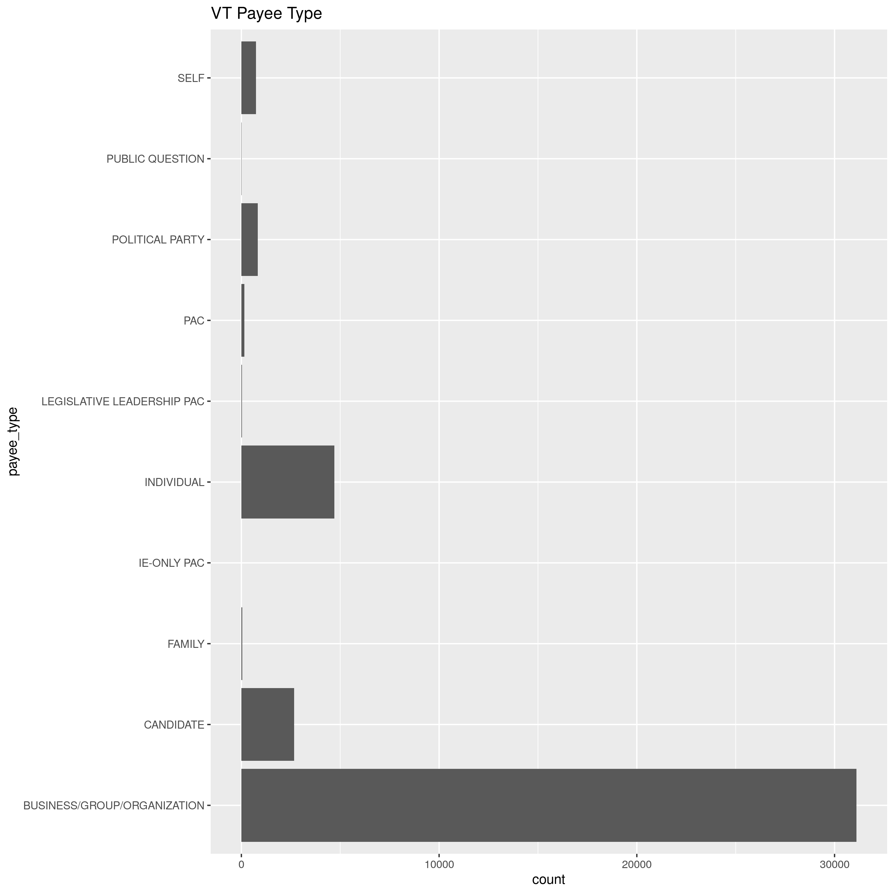
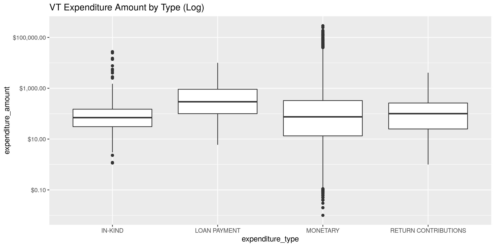
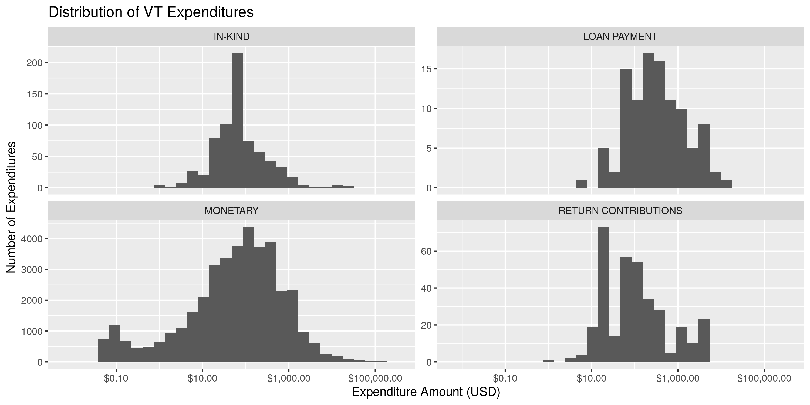

Vermont Expenditures
================
Kiernan Nicholls
2019-08-27 16:41:20

  - [Objectives](#objectives)
  - [Packages](#packages)
  - [Data](#data)
  - [Read](#read)
  - [Explore](#explore)
  - [Explore](#explore-1)
  - [Mutate](#mutate)
  - [Conclude](#conclude)
  - [Write](#write)

## Objectives

1.  How many records are in the database?
2.  Check for duplicates
3.  Check ranges
4.  Is there anything blank or missing?
5.  Check for consistency issues
6.  Create a five-digit ZIP Code called ZIP5
7.  Create a YEAR field from the transaction date
8.  For campaign donation data, make sure there is both a donor AND
    recipient

## Packages

The following packages are needed to collect, manipulate, visualize,
analyze, and communicate these results. The `pacman` package will
facilitate their installation and attachment.

``` r
if (!require("pacman")) install.packages("pacman")
pacman::p_load_current_gh("kiernann/campfin")
pacman::p_load(
  stringdist, # levenshtein value
  snakecase, # change string case
  RSelenium, # remote browser
  tidyverse, # data manipulation
  lubridate, # datetime strings
  tidytext, # text analysis
  magrittr, # pipe opperators
  janitor, # dataframe clean
  batman, # rep(NA, 8) Batman!
  refinr, # cluster and merge
  scales, # format strings
  knitr, # knit documents
  vroom, # read files fast
  glue, # combine strings
  here, # relative storage
  httr, # http query
  fs # search storage 
)
```

This document should be run as part of the `R_campfin` project, which
lives as a sub-directory of the more general, language-agnostic
`irworkshop/accountability_datacleaning` [GitHub
repository](https://github.com/irworkshop/accountability_datacleaning).

The `R_campfin` project uses the [RStudio
projects](https://support.rstudio.com/hc/en-us/articles/200526207-Using-Projects)
feature and should be run as such. The project also uses the dynamic
[`here::here()`](https://github.com/jennybc/here_here) tool for file
paths relative to *your* machine.

``` r
# where was this document knit?
here::here()
#> [1] "/home/ubuntu/R/accountability_datacleaning/R_campfin"
```

## Data

> Definition of Expenditure - 17 V.S.A. 2901(7)
> 
> Expenditure means a payment, disbursement, distribution, advance
> deposit, loan, or gift of money, or anything of value paid or promised
> to be paid for the purpose of influencing an election, advocating a
> position on a public question, or supporting or opposing one or more
> candidates. As used in this chapter, expenditure shall not include any
> of the following:
> 
> 1.  A personal loan of money to a candidate from a lending institution
>     made in the ordinary course of business;
> 2.  Services provided without compensation by individuals volunteering
>     their time on behalf of a candidate, political committee, or
>     political party;
> 3.  Unreimbursed travel expenses paid for by an individual for himself
>     or herself, who volunteers personal services to a candidate; or
> 4.  Unreimbursed campaign-related travel expenses, paid for by the
>     candidate or the candidates spouse.

## Read

``` r
vt <- 
  here("vt", "expends", "data", "raw", "ViewExpenditureList.csv") %>% 
  read_csv(
    col_types = cols(
      .default = col_character(),
      `Transaction Date` = col_date("%m/%d/%Y %H:%M:%S %p"),
      `Reporting Period` = col_date("%m/%d/%Y %H:%M:%S %p"),
      `Expenditure Amount` = col_number()
    )
  ) %>% 
  clean_names() %>% 
  remove_empty("rows") %>% 
  mutate_if(is.character, str_to_upper) %>% 
  rownames_to_column("id")
```

## Explore

## Explore

There are 40280 records of 15 variables in the full database.

``` r
glimpse(sample_frac(vt))
```

    #> Observations: 40,280
    #> Variables: 15
    #> $ id                  <chr> "4240", "30817", "32895", "4665", "3418", "21349", "38794", "30303",…
    #> $ transaction_date    <date> 2018-10-16, 2016-06-09, 2016-04-01, 2018-10-12, 2018-10-25, 2016-09…
    #> $ payee_type          <chr> "BUSINESS/GROUP/ORGANIZATION", "INDIVIDUAL", "BUSINESS/GROUP/ORGANIZ…
    #> $ payee_name          <chr> "FACEBOOK", "NADEAU, DWAYNE D.", "KSE PARTNERS LLP", "ACTBLUE", "VOT…
    #> $ payee_address       <chr> "1601 WILLOW RD., MENLO PARK, VT 94025", "10 NORTHWOOD TERRACE, GRAN…
    #> $ registrant_name     <chr> "PATT, AVRAM", "LISMAN, BRUCE M", "PECKHAM INDUSTRIES INC VERMONT PA…
    #> $ registrant_type     <chr> "CANDIDATE", "CANDIDATE", "POLITICAL ACTION COMMITTEE", "CANDIDATE",…
    #> $ office              <chr> "STATE REPRESENTATIVE - LAMOILLE-WASHINGTON", "GOVERNOR", NA, "STATE…
    #> $ election_cycle      <chr> "2018 GENERAL", "2016 GENERAL", "2016 GENERAL", "2018 GENERAL", "201…
    #> $ reporting_period    <date> 2018-11-02, 2016-07-15, 2016-07-15, 2018-10-15, 2018-11-02, 2016-10…
    #> $ expenditure_type    <chr> "MONETARY", "MONETARY", "MONETARY", "MONETARY", "MONETARY", "MONETAR…
    #> $ expenditure_purpose <chr> "MEDIA - ONLINE ADVERTISING", "ADMINISTRATIVE - SALARIES AND WAGES",…
    #> $ expenditure_amount  <dbl> 18.22, 13.39, 4000.00, 62.48, 99.00, 1500.00, 375.00, 4456.81, 29.99…
    #> $ public_question     <chr> NA, NA, NA, NA, NA, NA, NA, NA, NA, NA, NA, NA, NA, NA, NA, NA, NA, …
    #> $ comments            <chr> NA, NA, NA, NA, NA, NA, NA, NA, NA, "FACEBOOK ADS: RAN FROM NOV 5-NO…

### Distinct

The variables range in their degree of distinctness.

``` r
glimpse_fun(vt, n_distinct)
```

    #> # A tibble: 15 x 4
    #>    var                 type      n         p
    #>    <chr>               <chr> <int>     <dbl>
    #>  1 id                  chr   40280 1        
    #>  2 transaction_date    date   1822 0.0452   
    #>  3 payee_type          chr      10 0.000248 
    #>  4 payee_name          chr    6938 0.172    
    #>  5 payee_address       chr    9456 0.235    
    #>  6 registrant_name     chr     816 0.0203   
    #>  7 registrant_type     chr       7 0.000174 
    #>  8 office              chr     170 0.00422  
    #>  9 election_cycle      chr      15 0.000372 
    #> 10 reporting_period    date     62 0.00154  
    #> 11 expenditure_type    chr       4 0.0000993
    #> 12 expenditure_purpose chr      86 0.00214  
    #> 13 expenditure_amount  dbl   12769 0.317    
    #> 14 public_question     chr      11 0.000273 
    #> 15 comments            chr    6876 0.171

We can use `ggplot2::geom_bar()` to explore the distribution of these
least distinct nominal values.

<!-- -->

<!-- -->

<!-- -->

<!-- -->

<!-- -->

<!-- -->

### Duplicate

There are a significant number of duplicate records.

``` r
vt <- flag_dupes(vt, -id)
sum(vt$dupe_flag)
```

    #> [1] 3165

``` r
percent(mean(vt$dupe_flag))
```

    #> [1] "7.86%"

### Missing

The variables also vary in their degree of values that are `NA`
(missing). Note that 68 rows were removed using
`janitor::remove_empty()` during our initial reading of the file. The
remaining count of missing values in each variable can be found below:

``` r
glimpse_fun(vt, count_na)
```

    #> # A tibble: 16 x 4
    #>    var                 type      n     p
    #>    <chr>               <chr> <int> <dbl>
    #>  1 id                  chr       0 0    
    #>  2 transaction_date    date      0 0    
    #>  3 payee_type          chr       0 0    
    #>  4 payee_name          chr       0 0    
    #>  5 payee_address       chr       0 0    
    #>  6 registrant_name     chr       0 0    
    #>  7 registrant_type     chr       0 0    
    #>  8 office              chr    8222 0.204
    #>  9 election_cycle      chr       0 0    
    #> 10 reporting_period    date      0 0    
    #> 11 expenditure_type    chr       0 0    
    #> 12 expenditure_purpose chr       0 0    
    #> 13 expenditure_amount  dbl       0 0    
    #> 14 public_question     chr   40209 0.998
    #> 15 comments            chr   26285 0.653
    #> 16 dupe_flag           lgl       0 0

Most variables have zero `NA` values, aside from the supplemental
`public_question` and `comments` variables. `NA` values in the `office`
variable represent expenditures from non-candidate registrants.

``` r
vt %>% 
  group_by(registrant_type) %>% 
  summarise(n_na = sum(is.na(office)))
```

    #> # A tibble: 7 x 2
    #>   registrant_type                     n_na
    #>   <chr>                              <int>
    #> 1 CANDIDATE                              0
    #> 2 IE-ONLY POLITICAL ACTION COMMITTEE  1071
    #> 3 LEGISLATIVE LEADERSHIP PAC           485
    #> 4 POLITICAL ACTION COMMITTEE          3136
    #> 5 POLITICAL PARTY COMMITTEE           3373
    #> 6 PUBLIC MEDIA ACTIVITIES               86
    #> 7 PUBLIC QUESTION COMMITTEE             71

### Ranges

The range of continuous variables will need to be checked for data
integrity. There are only three quasi-continuous variables, the
`transaction_date`, `reporting_period`, and `expenditure_amount`.

The range for `trans_amount` seems reasonable enough.

``` r
summary(vt$expenditure_amount)
```

    #>      Min.   1st Qu.    Median      Mean   3rd Qu.      Max. 
    #>      0.01     14.36     75.00    688.93    324.00 288221.00

<!-- -->

The number of contributions is fairly lopsides, with nearly 80% of all
records coming from 2016 and 2018. This makes some sense, as these were
election years.

``` r
summary(vt$transaction_date)
```

    #>         Min.      1st Qu.       Median         Mean      3rd Qu.         Max. 
    #> "2008-08-08" "2016-06-23" "2016-10-06" "2017-02-21" "2018-06-30" "2019-07-04"

``` r
vt %>% 
  group_by(transaction_year = year(transaction_date)) %>% 
  ggplot(mapping = aes(transaction_year)) +
  geom_bar() +
  scale_x_continuous(breaks = seq(2007, 2020)) + 
  labs(
    title = "Number of Expenditures by Year",
    x = "Year",
    y = "Number of Expenditures"
  )
```

<!-- -->

For some reason, the reporting period for expenditures begin in 2014
despite our data spanning 2008 to 2019.

``` r
summary(vt$reporting_period)
```

    #>         Min.      1st Qu.       Median         Mean      3rd Qu.         Max. 
    #> "2014-08-18" "2016-07-15" "2016-10-15" "2017-04-04" "2018-07-15" "2020-11-17"

## Mutate

Payee and registrant addresses are not divided into street, city, state,
and ZIP columns. We can extract the ZIP digits and state abbreviation
from the end of the string using regular expressions.

Since we parsed the `transaction_date` as a date file using
`readr::col_date()` inside `readr::read_csv()`, we can simply extract
the year of the transaction with `lubridate::year()`

``` r
vt <- vt %>% 
  mutate(
    transaction_year = year(transaction_date),
    payee_zip = payee_address %>% 
      str_extract(rx_zip) %>% 
      normal_zip(na_rep = TRUE),
    payee_state = payee_address %>% 
      str_extract(rx_state) %>%
      normal_state(
        abbreviate = TRUE, 
        na_rep = TRUE, 
        valid = valid_state
      )
    )
```

## Conclude

1.  There are 40280 records in the database
2.  The 3165 duplicate records have been flagged with `dupe_flag`
3.  Ranges for continuous variables have been checked and make sense
4.  There are no important variables with blank or missing values
5.  Consistency issues have been fixed with the `stringr` package
6.  The `payee_zip` variable has been extracted from `payee_address`
    with `stringr::str_extract()` and cleaned with
    `zipcode::clean.zipcode()`
7.  The `transaction_year` variable has been extracted from
    `transaction_date` with `readr::col_date()` and `lubridate::year()`
8.  There is both a registrant and payee for every record.

## Write

``` r
dir_create(here("vt", "expends", "data", "processed"))
write_csv(
  x = vt,
  path = here("vt", "expends", "data", "processed", "vt_expends_clean.csv"),
  na = ""
)
```
