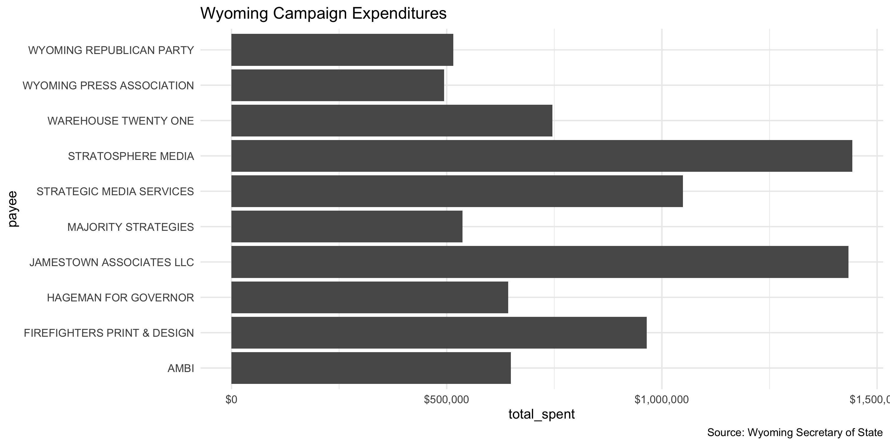
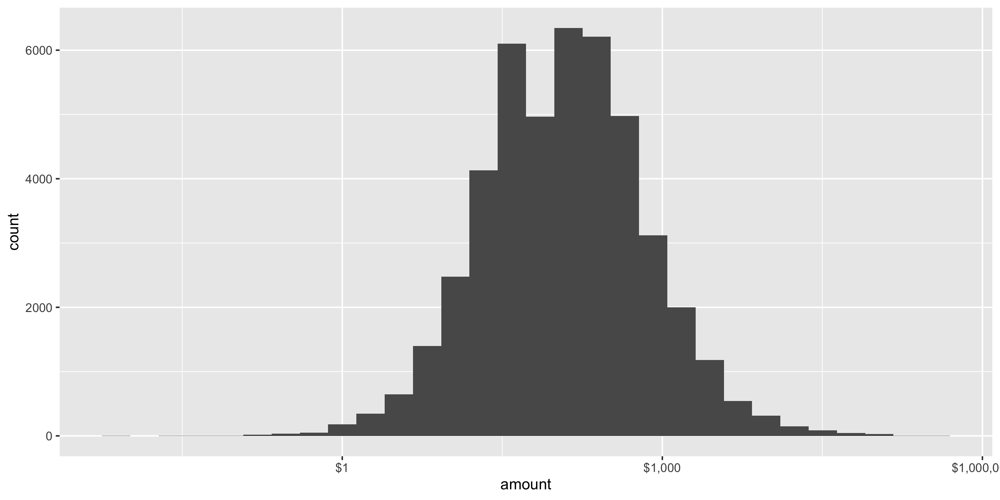
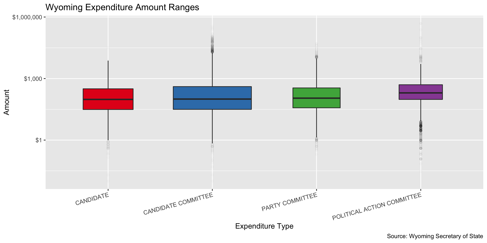
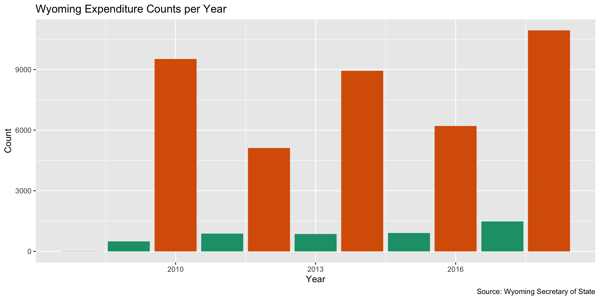
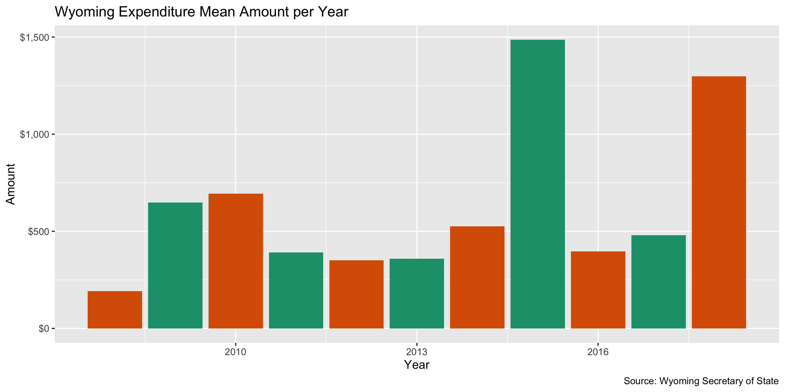

Wyoming Campaign Expenditures Data Diary
================
Yanqi Xu
2019-08-07 10:58:05

## Project

The Accountability Project is an effort to cut across data silos and
give journalists, policy professionals, activists, and the public at
large a simple way to search across huge volumes of public data about
people and organizations.

Our goal is to standardizing public data on a few key fields by thinking
of each dataset row as a transaction. For each transaction there should
be (at least) 3 variables:

1.  All **parties** to a transaction
2.  The **date** of the transaction
3.  The **amount** of money involved

## Objectives

This document describes the process used to complete the following
objectives:

1.  How many records are in the database?
2.  Check for duplicates
3.  Check ranges
4.  Is there anything blank or missing?
5.  Check for consistency issues
6.  Create a five-digit ZIP Code called `ZIP5`
7.  Create a `YEAR` field from the transaction date
8.  Make sure there is data on both parties to a transaction

## Packages

The following packages are needed to collect, manipulate, visualize,
analyze, and communicate these results. The `pacman` package will
facilitate their installation and attachment.

``` r
if (!require("pacman")) install.packages("pacman")
pacman::p_load_current_gh("kiernann/campfin")
pacman::p_load(
  campfin,
  stringdist, # levenshtein value
  tidyverse, # data manipulation
  lubridate, # datetime strings
  tidytext, # string analysis
  magrittr, # pipe opperators
  janitor, # dataframe clean
  zipcode, # clean & database
  refinr, # cluster and merge
  knitr, # knit documents
  glue, # combine strings
  scales, #format strings
  here, # relative storage
  fs, # search storage 
  rvest # scrape html
)
```

This document should be run as part of the `R_campfin` project, which
lives as a sub-directory of the more general, language-agnostic
[`irworkshop/accountability_datacleaning`](https://github.com/irworkshop/accountability_datacleaning "TAP repo")
GitHub repository.

The `R_campfin` project uses the [RStudio
projects](https://support.rstudio.com/hc/en-us/articles/200526207-Using-Projects "Rproj")
feature and should be run as such. The project also uses the dynamic
`here::here()` tool for file paths relative to *your* machine.

``` r
# where dfs this document knit?
here::here()
#> [1] "/Users/soc/accountability_datacleaning/R_campfin"
```

## Data

Describe *where* the data is coming from. [Link to the data
download](https://www.wycampaignfinance.gov/WYCFWebApplication/GSF_SystemConfiguration/SearchExpenditures.aspx "source")
page if possible.

Describe the data set that is going to be cleaned. A file name, age, and
unit of observation.

### About

More information about the Wyoming Campaign Finance Information Systems
can be found here
<https://www.wycampaignfinance.gov/WYCFWebApplication/Reports/FormationReportsViewer.aspx?docType=3>.

### Variables

`variable_name`:

> Directly quote the definition given for variables of interest.

## Import

### Download

Download raw, **immutable** data file. Go to
<https://www.wycampaignfinance.gov/WYCFWebApplication/GSF_SystemConfiguration/SearchExpenditures.aspx>,
leave the fields blank, and click the “All” tab and hit “Search”. After
the table is populated, click “Export”

``` r
# create a directory for the raw data
raw_dir <- here("wy", "expends", "data", "raw")
dir_create(raw_dir)
```

### Read

## Explore

There are `nrow(wy)` records of `length(wy)` variables in the full
database.

``` r
head(wy)
```

    #> # A tibble: 6 x 8
    #>   filer_type   filer_name    payee       purpose    date       city_state_zip  filing_status amount
    #>   <chr>        <chr>         <chr>       <chr>      <date>     <chr>           <chr>          <dbl>
    #> 1 CANDIDATE C… FRIENDS OF M… DEPARTMENT… TAXES      2018-12-31 CHEYENNE, WY 8… AMEND - ADD    933. 
    #> 2 CANDIDATE C… FRIENDS OF M… FIRST INTE… BANKING    2018-12-31 BUFFALO, WY 82… AMEND - ADD     17  
    #> 3 CANDIDATE C… FRIENDS OF M… MICHELLE K… PAYROLL    2018-12-31 CLEARMONT, WY … AMEND - ADD   1972. 
    #> 4 CANDIDATE C… FRIENDS OF M… PAUL ULRICH FOOD AND … 2018-12-31 PINEDALE, WY 8… AMEND - ADD    700  
    #> 5 CANDIDATE C… FRIENDS OF M… US TREASUR… TAXES      2018-12-31 "OGDEN, UT "    AMEND - ADD    611. 
    #> 6 PARTY COMMI… REPUBLICAN    DC VIP CAB  TRAVEL (H… 2018-12-31 WASHINGTON, DC… AMEND - ADD     12.8

``` r
tail(wy)
```

    #> # A tibble: 6 x 8
    #>   filer_type   filer_name       payee    purpose     date       city_state_zip filing_status amount
    #>   <chr>        <chr>            <chr>    <chr>       <date>     <chr>          <chr>          <dbl>
    #> 1 PARTY COMMI… ALBANY DEMOCRAT… ROCKY M… UTILITIES … 2008-12-02 PORTLAND, OR … PUBLISHED      178. 
    #> 2 PARTY COMMI… ALBANY DEMOCRAT… POSTMAS… POSTAGE     2008-11-18 LARAMIE, WY 8… PUBLISHED       26.4
    #> 3 PARTY COMMI… PARK REPUBLICAN… KIMI'S … OTHER: FLO… 2008-11-14 "82414, WY "   PUBLISHED       46.7
    #> 4 PARTY COMMI… PARK REPUBLICAN… KURT HO… FOOD AND B… 2008-11-14 "82414, WY "   PUBLISHED       94.6
    #> 5 PARTY COMMI… PARK REPUBLICAN… SHERRY … FOOD AND B… 2008-11-14 "82414, WY "   PUBLISHED       53.5
    #> 6 CANDIDATE C… PARTNERS FOR MA… MAX MAX… ENTERTAINM… 2008-07-15 CHEYENNE, WY … PUBLISHED       14.0

``` r
glimpse(wy)
```

    #> Observations: 45,354
    #> Variables: 8
    #> $ filer_type     <chr> "CANDIDATE COMMITTEE", "CANDIDATE COMMITTEE", "CANDIDATE COMMITTEE", "CAN…
    #> $ filer_name     <chr> "FRIENDS OF MARK GORDON", "FRIENDS OF MARK GORDON", "FRIENDS OF MARK GORD…
    #> $ payee          <chr> "DEPARTMENT OF WORK FORCE SERVICES", "FIRST INTERSTATE BANK", "MICHELLE K…
    #> $ purpose        <chr> "TAXES", "BANKING", "PAYROLL", "FOOD AND BEVERAGES", "TAXES", "TRAVEL (HO…
    #> $ date           <date> 2018-12-31, 2018-12-31, 2018-12-31, 2018-12-31, 2018-12-31, 2018-12-31, …
    #> $ city_state_zip <chr> "CHEYENNE, WY 82002", "BUFFALO, WY 82834", "CLEARMONT, WY 82835", "PINEDA…
    #> $ filing_status  <chr> "AMEND - ADD", "AMEND - ADD", "AMEND - ADD", "AMEND - ADD", "AMEND - ADD"…
    #> $ amount         <dbl> 933.01, 17.00, 1972.40, 700.00, 611.20, 12.76, 42.50, 186.11, 385.48, 562…

### Distinct

The variables range in their degree of distinctness.

``` r
wy %>% glimpse_fun(n_distinct)
```

    #> # A tibble: 8 x 4
    #>   var            type      n         p
    #>   <chr>          <chr> <int>     <dbl>
    #> 1 filer_type     chr       4 0.0000882
    #> 2 filer_name     chr     704 0.0155   
    #> 3 payee          chr   11738 0.259    
    #> 4 purpose        chr    1703 0.0375   
    #> 5 date           date   3112 0.0686   
    #> 6 city_state_zip chr    1577 0.0348   
    #> 7 filing_status  chr       4 0.0000882
    #> 8 amount         dbl   16289 0.359

We can explore the distribution of the least distinct values with
`ggplot2::geom_bar()`.

<!-- -->

Or, filter the data and explore the most frequent discrete data.

<!-- -->

### Missing

The variables also vary in their degree of values that are `NA`
(missing).

``` r
wy %>% glimpse_fun(count_na)
```

    #> # A tibble: 8 x 4
    #>   var            type      n      p
    #>   <chr>          <chr> <int>  <dbl>
    #> 1 filer_type     chr       0 0     
    #> 2 filer_name     chr       0 0     
    #> 3 payee          chr       0 0     
    #> 4 purpose        chr       0 0     
    #> 5 date           date      0 0     
    #> 6 city_state_zip chr    3023 0.0667
    #> 7 filing_status  chr       0 0     
    #> 8 amount         dbl       0 0

We will flag any records with missing values in the key variables used
to identify an expenditure. There are 0 columns in city\_state\_zip that
are NAs

``` r
wy <- wy %>% mutate(na_flag = is.na(city_state_zip))
```

### Duplicates

There are no duplicates

``` r
wy_dupes <- get_dupes(wy)
```

### Ranges

#### Amounts

``` r
summary(wy$amount)
```

    #>     Min.  1st Qu.   Median     Mean  3rd Qu.     Max. 
    #>      0.0     35.5    107.8    723.0    396.0 482033.0

See how the campaign expenditures were distributed

``` r
wy %>% 
  ggplot(aes(x = amount)) + 
  geom_histogram() +
  scale_x_continuous(
    trans = "log10", labels = dollar)
```

<!-- -->

Distribution of expenses by filer
<!-- -->

### Dates

The dates seem to be reasonable, with records dating back to
1.407510^{4} till 1.545610^{4}, 1.630410^{4}, 1.633529210^{4},
1.745410^{4},
    1.789610^{4}

``` r
summary(wy$date)
```

    #>         Min.      1st Qu.       Median         Mean      3rd Qu.         Max. 
    #> "2008-07-15" "2012-04-26" "2014-08-22" "2014-09-22" "2017-10-15" "2018-12-31"

### Year

Add a `year` variable from `date` after `col_date()` using
`lubridate::year()`.

``` r
wy <- wy %>% mutate(year = year(date), on_year = is_even(year))
```

<!-- -->

<!-- -->

``` r
wy %>% 
  mutate(month = month(date)) %>% 
  group_by(on_year, month) %>% 
  summarize(mean = mean(amount)) %>% 
  ggplot(aes(month, mean)) +
  geom_line(aes(color = on_year), size = 2) +
  scale_y_continuous(labels = dollar) +
  scale_x_continuous(labels = month.abb, breaks = 1:12) +
  scale_color_brewer(
    type = "qual",
    palette = "Dark2"
  ) +
  labs(
    title = "Wyoming Expenditure Amount by Month",
    caption = "Source: Wyoming Secretary of State",
    color = "Election Year",
    x = "Month",
    y = "Amount"
  )
```

<!-- --> \#\# Wrangle \#\#\#
Indexing

``` r
wy <- tibble::rowid_to_column(wy, "id")
```

The lengths of city\_state\_zip column differ, and regular expressions
can be used to separate the components.

The original data the city, state, and ZIP all in one column. The
following code seperates them.

### Zipcode

First, we’ll extract any numbers whose lengths range from 1 to 5 and
normalize them under “zip\_clean”.

``` r
wy <- wy %>% 
  mutate(
    zip_clean = city_state_zip %>% 
      str_extract("\\d{2,5}") %>% 
      normal_zip(na_rep = TRUE))
sample(wy$zip_clean, 10)
```

    #>  [1] NA      "82701" NA      "83001" "82901" "82601" "82834" "75284" "82716" "82007"

### State

In this regex, state is considered to consist of two upper-case letters
following a space, or two upper-case letters with a trailing space at
the end.

``` r
wy <- wy %>% 
  mutate( state_clean =
            trimws(str_extract(wy$city_state_zip, "\\s([A-Z]{2})\\s|^([A-Z]{2})\\s$")))
count_na(wy$state_clean)
```

    #> [1] 3059

``` r
wy <- wy %>% mutate(state_clean = normal_state(state_clean))
```

### City

First, we can get a list of incorporated cities and towns in Wyoming.
The Wyoming State Archives provided the list in a web table. We use the
`rvest` package to scrape the names of Wyoming cities and towns.
<http://wyoarchives.state.wy.us/index.php/incorporated-cities>.

``` r
wyoming_cities_page <- read_html("http://wyoarchives.state.wy.us/index.php/incorporated-cities")

wy_city <- wyoming_cities_page %>%  html_nodes("tr") %>% 
  html_text()

wy_city <- str_match(wy_city[2:100],"(^\\D{2,})\\r")[,2]
wy_city <- toupper(wy_city[!is.na(wy_city)])
```

``` r
valid_city <- unique(c(wy_city,zipcode$city))
```

Cleaning city values is the most complicated. This process involves four
steps:

1.  Prepare raw city values by removing invalid data and reducing
    inconsistencies
2.  Match prepared city values with the *actual* city name of that
    record’s ZIP code
3.  swap prepared city values with the ZIP code match *if* only 1 edit
    is needed
4.  Refine swapped city values with key collision and n-gram
    fingerprints

#### Prep

Find the cities before a comma first, if not, find the non-numeric
string.

``` r
wy <- wy %>% 
  mutate(
    city_raw = str_match(wy$city_state_zip,"(^\\D{3,}),")[,2]) 

wy <- wy %>% mutate(city_raw=ifelse(is.na(city_raw)==TRUE, 
               str_extract(city_state_zip, "[A-Z]{4,}"), paste(city_raw)))

wy$city_raw <- wy$city_raw %>% 
  str_replace("^ROCK$", "ROCK SPRING") 
```

``` r
count_na(wy$city_raw)
#> [1] 12303
n_distinct(wy$city_raw)
#> [1] 742
prop_in(wy$city_raw, valid_city, na.rm = TRUE)
#> [1] 0.9762488
sum(unique(wy$city_raw) %out% valid_city)
#> [1] 288
```

33051 cities were found.

``` r
wy <- wy %>% mutate(city_prep = normal_city(city_raw))
```

#### Match

``` r
wy <- wy %>%
  left_join(
    y = zipcode,
    by = c(
      "zip_clean" = "zip",
      "state_clean" = "state"
    )
  ) %>%
  rename(city_match = city) 
```

#### Swap

To replace city names with expected city names from zipcode when the two
variables are no more than two characters different

``` r
wy <- wy %>% 
  mutate(
    match_dist = stringdist(city_prep, city_match),
    city_swap = if_else(condition = is.na(city_match) == FALSE,
                        if_else(
      condition = match_dist <= 2,
      true = city_match,
      false = city_prep
    ),
      false = city_prep
  ))

wy$city_swap <- wy$city_swap %>% 
  str_replace("^CAS$", "CASPER") %>% 
  str_replace("^CA$", "CASPER") %>% 
  str_replace("^RS$","ROCK SPRINGS") %>% 
  str_replace("^AF$", "AFTON") %>% 
  str_replace("^M$", "MOUNTAIN VIEW") %>% 
  str_replace("^GR$", "GREEN RIVER") %>% 
  na_if("WY") %>% 
  str_replace(" WYOMING","") %>% 
  str_replace("^SLC$", "SALT LAKE CITY") %>% 
  str_replace("^COD$", "CODY") 

  
summary(wy$match_dist)
```

    #>    Min. 1st Qu.  Median    Mean 3rd Qu.    Max.    NA's 
    #>   0.000   0.000   0.000   0.158   0.000  24.000   15204

``` r
sum(wy$match_dist == 1, na.rm = TRUE)
```

    #> [1] 265

``` r
n_distinct(wy$city_swap)
```

    #> [1] 566

This ZIP match swapping made 349 changes.

#### Refine

Instead of using the OpenRefine algorithms’
`refinr::key_collision_merge()` and `refinr::n_gram_merge()` functions,
we use `adist` and `agrep` to fuzzy match the swapped city data with
valid city names.

``` r
wy_cities <- tibble(city = wy_city, state = rep("WY",length(wy_city)))
cities <- unique(rbind(wy_cities, unique(select(zipcode, -zip))))
# Get a table of cities that are not in the valid_city vector
wy_out <- wy %>% 
  count(state_clean, city_swap, sort = TRUE) %>% 
  filter(city_swap %out% valid_city) %>% 
  drop_na()

# Fuzzy-matching city names with the names out of such list
prep_refine <- wy_out %>% 
  # Join on all names in the relevant state
  left_join(cities, by=c(state_clean = "state")) %>%
  # Calculate the distances, per original city name.
  group_by(city) %>%                
  mutate(dist = diag(adist(city_swap, city, partial=TRUE))) %>%
  # Append the agrepl result with the Levenshtein edit distance
  rowwise() %>%
  mutate(string_agrep = agrepl(city_swap, city, max.distance = 0.3)) %>%
  ungroup() %>%  
  # Only retain minimum distances
  group_by(city_swap) %>%   
  filter(dist == min(dist))

# Refine the entries where city_swap is six letter apart from a single match in cities (It's a rather safe switch, after examining the prep_refine table). Overcorrection can be manually changed later.
to_refine <- prep_refine %>% filter(n()==1) %>% filter(city_swap %in% prep_refine$city_swap[prep_refine$dist<6])
```

#### Merge

``` r
wy_refined <- wy %>% left_join(to_refine, by = "city_swap") %>% 
  select(-n, -state_clean.y, -dist, - string_agrep) %>% 
   mutate(city_refine = if_else(
    condition = is.na(city) == TRUE,
    true = city_swap,
    false = city
  )) %>% select(-city)
```

Manually change the city\_refine fields due to
overcorrection/undercorrection.

``` r
wy_refined$city_refine <- wy_refined$city_refine %>% 
  str_replace("^RIO VISTA$", "LAGO VISTA") %>% 
  str_replace("^OGEN$", "OGDEN") %>%
  str_replace("^ANNIPOLIS$", "ANNAPOLIS") %>% 
  str_replace("^LAR$", "LARAMIE") %>%
  str_replace("^LARA$", "LARAMIE") %>%
  str_replace("^CHE$", "CHEYENNE") %>%
  str_replace("^COLO SPGS$", "COLORADO SPRINGS") %>%
  str_replace("^WASHNGTON$", "WASHINGTON") %>% 
  str_replace("^WASHINGTON DC$", "WASHINGTON") %>% 
  str_replace("^ST//s", "SAINT " ) %>% 
  str_replace("^PINE$", "PINEDALE")
```

This process reduces the number of distinct city value by 220

``` r
n_distinct(wy_refined$city_raw)
#> [1] 742
n_distinct(wy_refined$city_prep)
#> [1] 692
n_distinct(wy_refined$city_swap)
#> [1] 566
n_distinct(wy_refined$city_refine)
#> [1] 522
```

Each process also increases the percent of valid city names.

``` r
prop_in(wy_refined$city_raw, valid_city, na.rm = TRUE)
#> [1] 0.9762488
prop_in(wy_refined$city_prep, valid_city, na.rm = TRUE)
#> [1] 0.9815437
prop_in(wy_refined$city_swap, valid_city, na.rm = TRUE)
#> [1] 0.991377
prop_in(wy_refined$city_refine, valid_city, na.rm = TRUE)
#> [1] 0.9952195
```

Each step of the cleaning process reduces the number of distinct city
values. There are 33051 entries of cities identified in the original
data matching the regex with 742 distinct values, after the swap and
refine processes, there are 33051 entries with 522 distinct values.

## Conclude

1.  There are 45354 records in the database
2.  There are 0 records with duplicate filer, recipient, date, *and*
    amount (flagged with `dupe_flag`)
3.  The ranges for dates and amounts are reasonable
4.  Consistency has been improved with `stringr` package and custom
    `normal_*()` functions.
5.  The five-digit `zip_clean` variable has been created with
    `zipcode::clean.zipcode()`
6.  The `year` variable has been created with `lubridate::year()`
7.  There are 0 records with missing `name` values and 0 records with
    missing `date` values (both flagged with the `na_flag`)

## Export

``` r
clean_dir <- here("wy", "expends", "data", "processed")
dir_create(clean_dir)
wy_refined %>% 
  rename(city_clean = city_refine) %>% 
  select(
    -city_state_zip,
    -city_prep,
    -on_year,
    -city_match,
    -match_dist,
    -city_swap,
  ) %>% 
  write_csv(
    path = glue("{clean_dir}/wy_expends_clean.csv"),
    na = ""
  )
```
