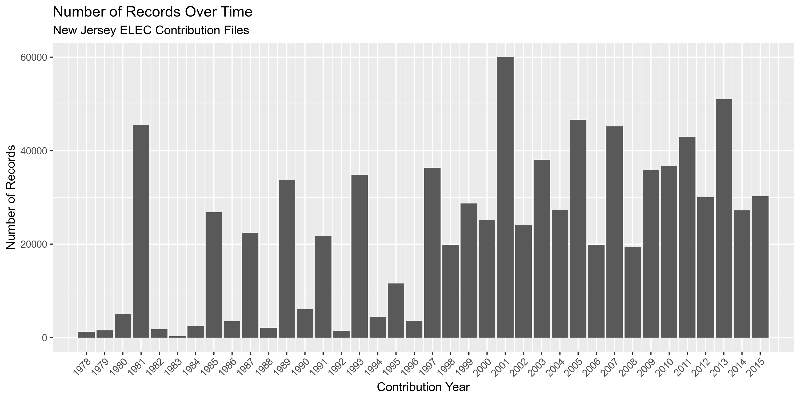
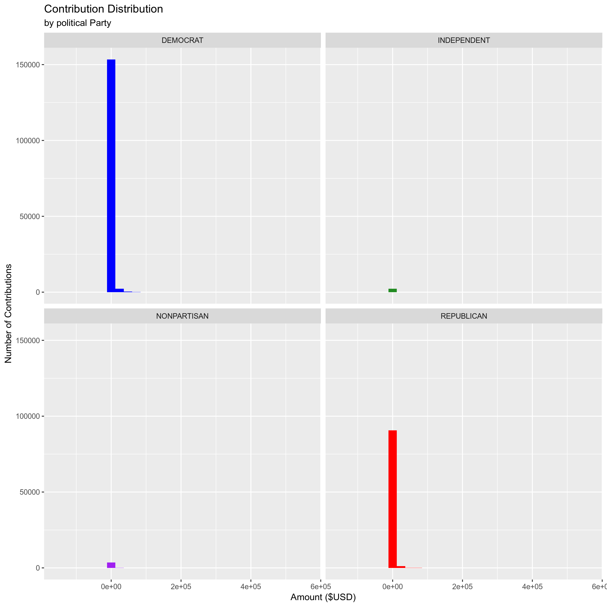
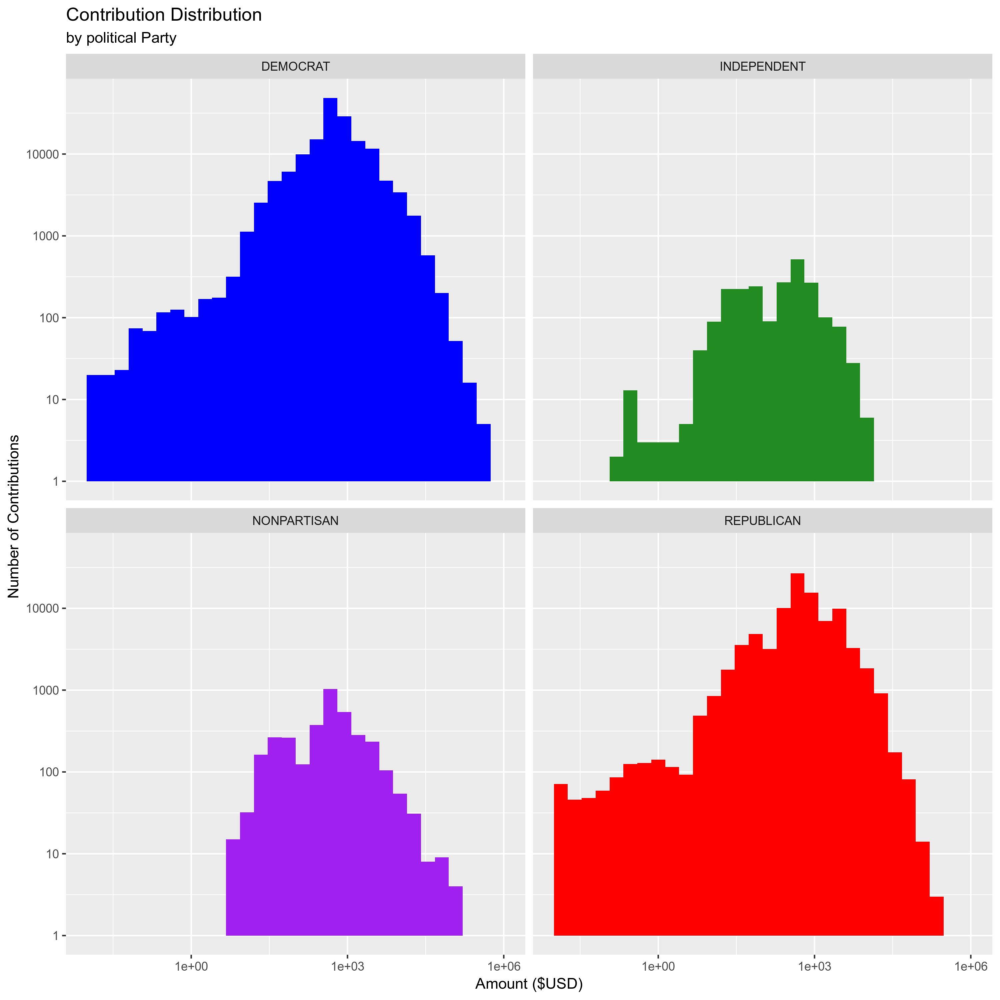
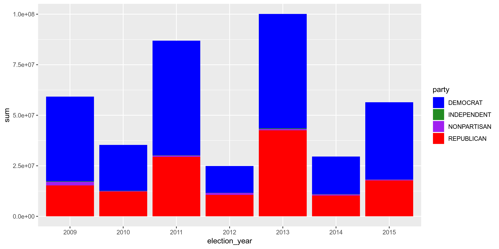
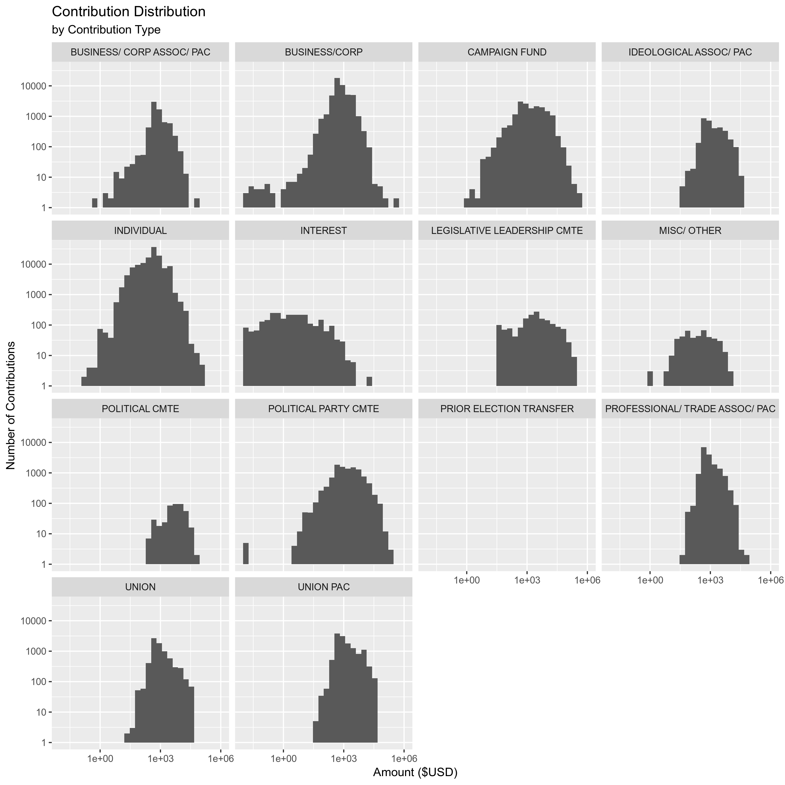
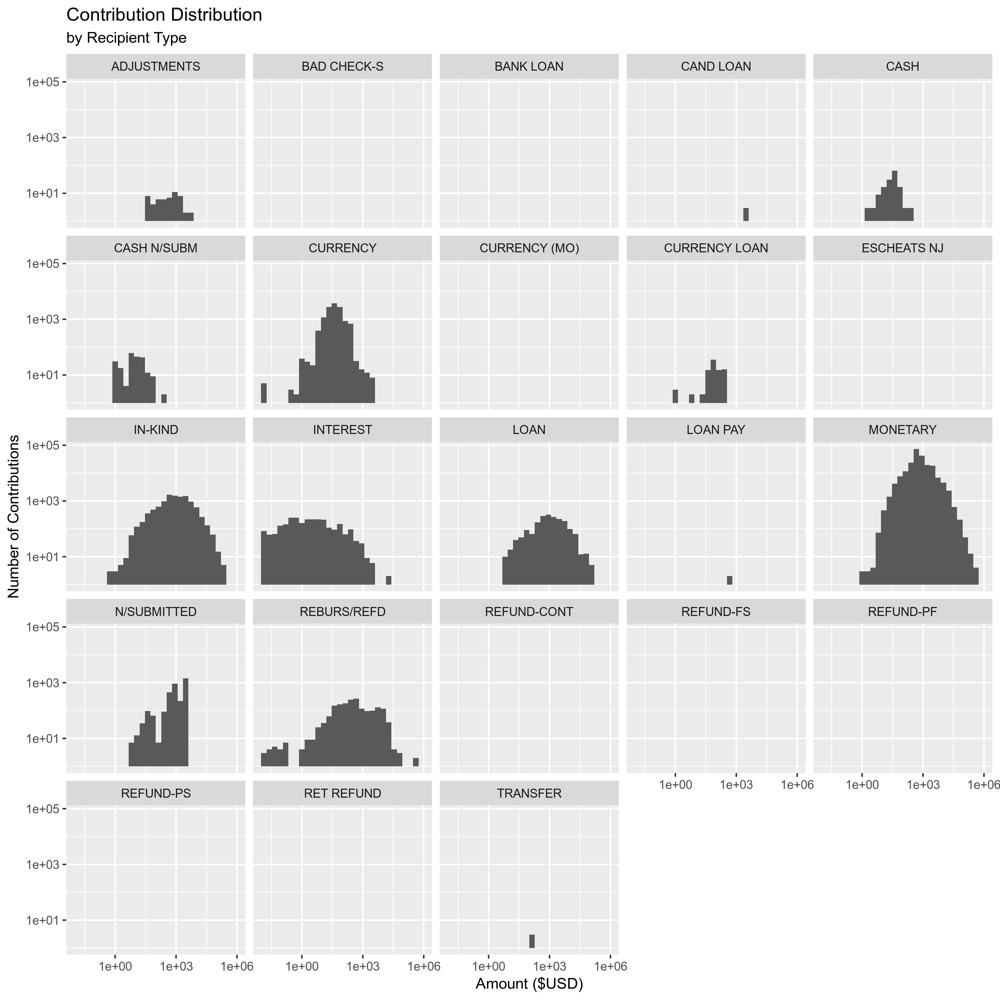
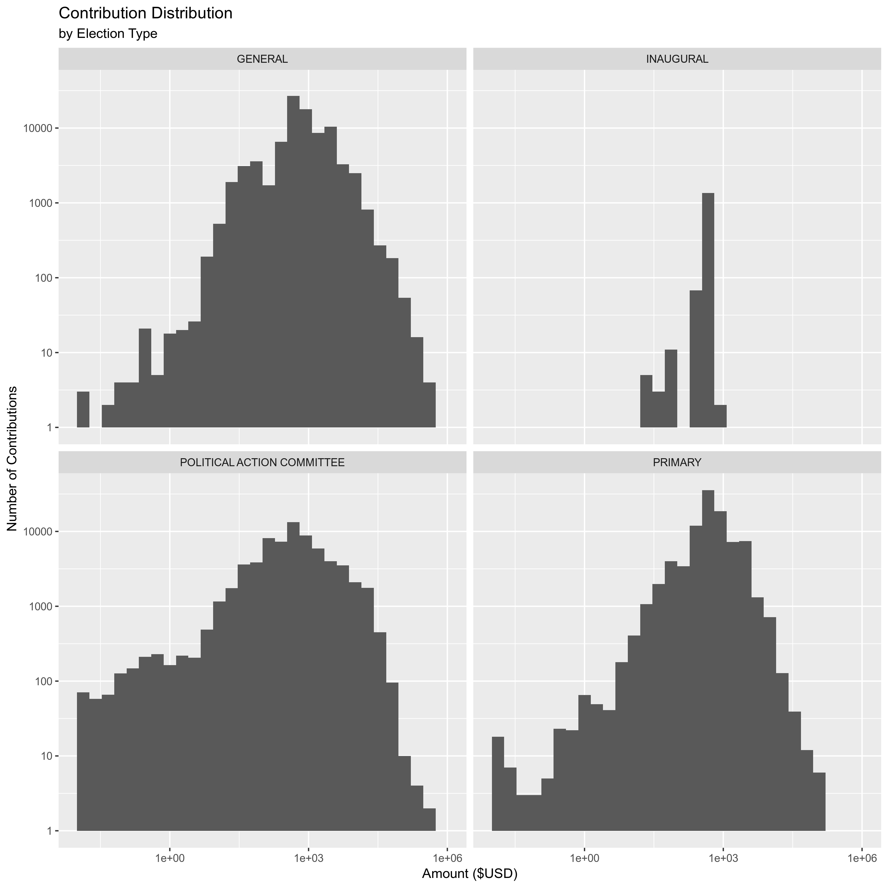
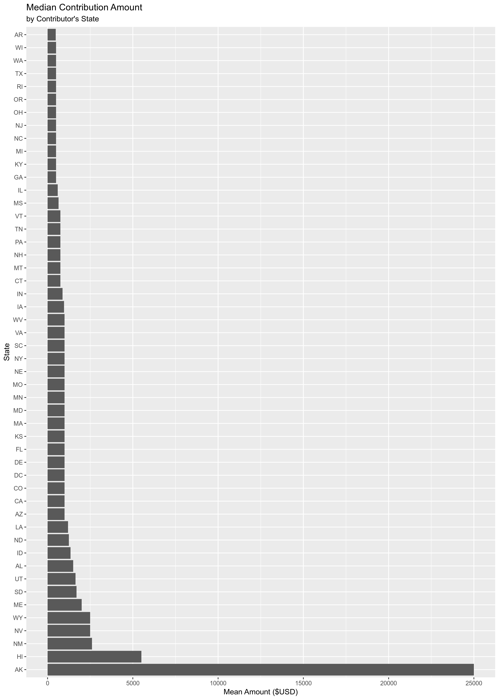

## Objectives

1. How many records are in the database?
1. Check for duplicates
1. Check ranges
1. Is there anything blank or missing?
1. Check for consistency issues
1. Create a five-digit ZIP Code called ZIP5
1. Create a YEAR field from the transaction date
1. For campaign donation data, make sure there is both a donor AND recipient

## Packages

The following packages are needed to collect, manipulate, visualize, analyze, and communicate
these results. The `pacman` package will facilitate their installation and attachment.


```r
# install.packages("pacman")
pacman::p_load(
  tidyverse, # data manipulation
  lubridate, # date strings
  magrittr, # pipe opperators
  janitor, # data cleaning
  zipcode, # clean and compare
  refinr, # cluster and merge
  vroom, # read files fast
  rvest, # scrape web pages
  knitr, # knit documents
  httr, # acess web API
  here, # navigate local storage
  fs # search local storage 
)
```

## Data

Data comes courtesy of the New Jersey Election Law Enforcement Commission (ELEC)
[website](https://www.elec.state.nj.us/ELECReport/). The data can be downloaded from their 
["Quick Data Downloads"](https://www.elec.state.nj.us/publicinformation/quickdownload.htm) page in
four separate files:

* [`All_GUB_Text.zip`]("https://www.elec.state.nj.us/download/Data/Gubernatorial/All_GUB_Text.zip")
* [`All_LEG_Text.zip`]("https://www.elec.state.nj.us/download/Data/Legislative/All_LEG_Text.zip")
* [`All_CW_Text.zip`]("https://www.elec.state.nj.us/download/Data/Countywide/All_CW_Text.zip")
* [`All_PAC_Text.zip`]("https://www.elec.state.nj.us/download/Data/PAC/All_PAC_Text.zip")

Each ZIP file contains a number of individual TXT files separated by year.

ELEC makes the following disclaimer at the bottom of the download page:

> The data contained in the ELEC database includes information as reported by candidates and
committees. Although ELEC has taken all reasonable precautions to prevent data entry errors, the
possibility that some exist cannot be entirely eliminated. Contributor and Expenditure types are
coded by ELEC staff members and are subjective according to the information provided by the filer.
Additionally, this information is subject to change as amendments are filed by candidates and
committees. For the most up-to-date information, please go to the “Search for Contributions” pages
to search for the most recent contributor information.

## Read

Since ELEC breaks up each year into a separate file and each groups them by contribution type, we
will have to do a little work to download, unzip, and read them all at once.

Furthermore, the delimiter used in each file is inconsistent, with some using tabs and others using
commas. The newly developed `vroom::vroom()` function is perfect for this situation, as it will
allow us to read all the unzipped files (~100) at once, with automatic detection of the delimiter.

First, we will get some general info on the files we are about to download. We want to be sure the
ZIP files aren't old, huge in size, or contain too many/suspicious files.


```r
response <- GET("https://www.elec.state.nj.us/download/Data/Gubernatorial/All_GUB_Text.zip")
utils:::format.object_size(as.numeric(headers(response)[["Content-Length"]]), "auto")
#> [1] "5.7 Mb"
httr::headers(response)[["last-modified"]]
#> [1] "Thu, 30 Mar 2017 13:30:47 GMT"
```

Then, create a list of files to be downloaded at once.


```r
nj_zip_urls <- c(
  "https://www.elec.state.nj.us/download/Data/Gubernatorial/All_GUB_Text.zip", # (5.7 MB)
  "https://www.elec.state.nj.us/download/Data/Legislative/All_LEG_Text.zip", # (9.7 MB)
  "https://www.elec.state.nj.us/download/Data/Countywide/All_CW_Text.zip", # (3.5 MB)
  "https://www.elec.state.nj.us/download/Data/PAC/All_PAC_Text.zip" # (6.2 MB)
)
```

If any of the files have not yet been downloaded today, download them again to ensure the latest
data from ELEC is being analyzed.


```r
# create a direcory for download
dir_create(here("nj_contribs", "data", "raw"))

# file date wrapper function
any_old_files <- function(path, type) {
  path %>%
    dir_ls(type = "file", glob = type) %>% 
    file_info() %>% 
    pull(modification_time) %>% 
    floor_date("day") %>% 
    equals(today()) %>% 
    not() %>% 
    any()
}

# download each file in the vector
if (any_old_files(here("nj_contribs", "data", "raw"), "*.zip")) {
  for (url in nj_zip_urls) {
    download.file(
      url = url,
      destfile = here(
        "nj_contribs",
        "data",
        basename(url)
      )
    )
  }
}
```


```r
nj_zip_files <- dir_ls(
  path = here("nj_contribs", "data"),
  type = "file",
  glob = "*.zip",
)

nj_zip_files %>% 
  map(unzip, list = TRUE) %>% 
  bind_rows(.id = "zip") %>%
  mutate(zip = basename(zip)) %>% 
  set_names(c("zip", "file", "bytes", "date")) %>%
  sample_n(10) %>% 
  print()
```

```
#>                 zip          file   bytes                date
#> 1   All_CW_Text.zip   CWP2015.txt 1328594 2017-03-27 16:01:00
#> 2  All_GUB_Text.zip Gub_I1998.txt  549770 2009-10-09 14:16:00
#> 3   All_CW_Text.zip   CWG2009.txt 1731054 2011-08-10 12:12:00
#> 4  All_PAC_Text.zip   PAC2015.txt 2556994 2017-03-27 16:01:00
#> 5  All_GUB_Text.zip Gub_P2005.txt 3576926 2009-10-09 14:27:00
#> 6  All_LEG_Text.zip Leg_G2009.txt 1512691 2010-08-24 12:11:00
#> 7   All_CW_Text.zip   CWG2000.txt  140846 2009-10-09 14:09:00
#> 8  All_PAC_Text.zip   PAC1994.txt  368357 2009-10-09 14:37:00
#> 9  All_PAC_Text.zip   PAC2003.txt 3874758 2009-10-09 14:41:00
#> 10 All_LEG_Text.zip LEG_G2005.txt 2144542 2009-10-09 14:33:00
```

Each ZIP file contains individual text files for each election year. If the `/data` directory
does not already contain these files, or if any are older than a day, unzip them now.


```r
if (any_old_files(here("nj_contribs", "data", "raw"), "*.txt")) {
  map(
    nj_zip_files,
    unzip,
    exdir = here("nj_contribs", "data"),
    overwrite = TRUE
  )
}
```

While every file has the same structure, the _names_ of those columns vary slightly. In some, there
is an `occupation` variable; in others, that _same_ variable is named `occupation_name`. This
incongruity prevents them from all being read together with `vroom::vroom()`. We can solve this by
extracting the variable names from a single file and using those to name every file's columns.


```r
nj_names <-
  here("nj_contribs", "data") %>%
  dir_ls(type = "file", glob = "*.txt") %>%
  extract(1) %>%
  read.table(nrows = 1, sep = "\t", header = FALSE) %>%
  as_vector() %>%
  make_clean_names()
```

One we have this vector of column names, we can read each file into a single data frame. Every
column will be read as character strings and parsed after the fact using the `dplyr::parse_*()`
functions. Normally we would use `col_types = cols(cont_date = col_date())`, but this seems to
introduce a number of `NA` values from some unknown parsing error that is does not happen with
`dplyr::parse_date()`.


```r
nj <-
  here("nj_contribs", "data") %>%
  dir_ls(type = "file", glob = "*.txt") %>%
  vroom(
    delim = NULL,
    col_names = nj_names,
    col_types = cols(.default = "c"),
    id = "source_file",
    skip = 1,
    trim_ws = TRUE,
    locale = locale(tz = "US/Eastern"),
    progress = FALSE
  ) %>%
  # parse non-character cols
  mutate(
    source_file = basename(source_file) %>% str_remove("\\.txt$"),
    cont_date   = parse_date(cont_date, "%m/%d/%Y"),
    cont_amt    = parse_number(cont_amt)
  )
```

## Explore and Flag

Below is the structure of the data arranged randomly by row. There are 879485 rows of 
34 variables.


```r
glimpse(sample_frac(nj))
```

```
#> Observations: 879,485
#> Variables: 34
#> $ source_file        <chr> "Gub_G1985", "LEG_G2003", "Gub_I2006", "LEG_P2003", "PAC2002", "Leg_G…
#> $ cont_lname         <chr> "SCHWARTZ", "KAHN", "DESANTI", NA, "COLLINS", NA, "OSTLIND", NA, "WAG…
#> $ cont_fname         <chr> "EDWARD", "ANDREA", "FRED", NA, "BARBARA", NA, "DAN", NA, "JEFFREY", …
#> $ cont_mname         <chr> "R", "L", NA, NA, NA, NA, "A", NA, "B", "M", "R", NA, "A", NA, NA, NA…
#> $ cont_suffix        <chr> NA, NA, NA, NA, NA, NA, NA, NA, NA, NA, NA, NA, NA, NA, NA, NA, NA, N…
#> $ cont_non_ind_name  <chr> NA, NA, NA, "PIPEFITTERS LU 274", NA, "NJ AUTO DEALERS ASSOC", NA, "B…
#> $ cont_non_ind_name2 <chr> NA, NA, NA, NA, NA, NA, NA, NA, NA, NA, NA, "STATE FUND", NA, NA, NA,…
#> $ cont_street1       <chr> "3 BIRCHWOOD DR", "ONE RIVERFRONT PLZ 4TH FL", "112 HARMONY LANE", "P…
#> $ cont_street2       <chr> NA, NA, NA, NA, NA, NA, NA, NA, "ONE SPEEDWELL AVE", NA, NA, NA, NA, …
#> $ cont_city          <chr> "LIVINGSTON", "NEWARK", "BROOKSIDE", "RIDGEFIELD", "WOODSTOWN", "WEST…
#> $ cont_state         <chr> "NJ", "NJ", "NJ", "NJ", "NJ", "NJ", "NJ", "NJ", "NJ", "NJ", "NJ", "NJ…
#> $ cont_zip           <chr> "07039", "07102", "07926", "07657", "08098", "00000", "08889", "07701…
#> $ cont_type          <chr> "INDIVIDUAL", "INDIVIDUAL", "INDIVIDUAL", "UNION", "INDIVIDUAL", "PRO…
#> $ cont_amt           <dbl> 100, 500, 250, 500, 200, 200, 5, 5000, 500, 500, 500, 150, 500, 4000,…
#> $ receipt_type       <chr> "MONETARY", "MONETARY", "MONETARY", "MONETARY", "MONETARY", "MONETARY…
#> $ cont_date          <date> 1985-05-28, 2003-07-29, 2006-01-12, 2002-10-23, 2002-11-13, 1991-09-…
#> $ occupation         <chr> NA, "OTHER", "MANAGEMENT", NA, "OTHER", NA, "OTHER", NA, "MGMT/EXECUT…
#> $ emp_name           <chr> NA, "MCMANIMON & SCOTLAND", "PSE&G", NA, "SALEM CTY TAX BOARD", NA, N…
#> $ emp_street1        <chr> NA, "ONE RIVERFRONT PLZ 4TH FL", "80 PARK PLAZA", NA, "94 MARKET ST",…
#> $ emp_street2        <chr> NA, NA, NA, NA, NA, NA, NA, NA, "ONE SPEEDWELL AVE", NA, NA, NA, NA, …
#> $ emp_city           <chr> NA, "NEWARK", "NEWARK", NA, "SALEM", NA, NA, NA, "MORRISTOWN", NA, "P…
#> $ emp_state          <chr> NA, "NJ", "NJ", NA, "NJ", NA, NA, NA, "NJ", NA, "NJ", NA, "NJ", NA, N…
#> $ emp_zip            <chr> NA, "07102", "07102", NA, "08079", NA, NA, NA, "07960", NA, "08854", …
#> $ rec_lname          <chr> "KEAN(G)", "GILL", NA, "IMPREVEDUTO", NA, "MARINI", "SCHUNDLER", NA, …
#> $ rec_fname          <chr> "THOMAS", "NIA", NA, "ANTHONY", NA, "RAY", "BRET", NA, NA, NA, NA, "J…
#> $ rec_mname          <chr> "H", "H", NA, NA, NA, "J", NA, NA, NA, NA, NA, "J", "E", NA, NA, NA, …
#> $ rec_suffix         <chr> NA, NA, NA, NA, NA, NA, NA, NA, NA, NA, NA, NA, NA, NA, NA, NA, NA, N…
#> $ rec_non_ind_name   <chr> NA, NA, "INAUGURAL 2006, INC. (CORZINE)", NA, "SALEM COUNTY REPUBLICA…
#> $ rec_non_ind_name2  <chr> NA, NA, NA, NA, NA, NA, NA, NA, NA, NA, NA, NA, NA, NA, NA, NA, NA, N…
#> $ office             <chr> "GOVERNOR", "STATE SENATE", "POL CMTE (BALLOT QUESTION)", "STATE ASSE…
#> $ party              <chr> "REPUBLICAN", "DEMOCRAT", "DEMOCRAT", "DEMOCRAT", "REPUBLICAN", "INDE…
#> $ location           <chr> "STATEWIDE", "34TH LEGISLATIVE DISTRICT", "STATEWIDE", "32ND LEGISLAT…
#> $ election_year      <chr> "1985", "2003", "2006", "2003", "2002", "1991", "2001", "2000", "2002…
#> $ election_type      <chr> "GENERAL", "GENERAL", "INAUGURAL", "PRIMARY", "POLITICAL ACTION COMMI…
```

### Dates

The hard files contain data on elections from 1981 to `r
max(nj$election_year)`. When you filter out those contributions made before 2008, more than 2/3rds
of the data is removed.


```r
sum(nj$cont_date < "2008-01-01", na.rm = TRUE) / nrow(nj)
#> [1] 0.6839355
min(nj$cont_date, na.rm = TRUE)
#> [1] "1-08-28"
max(nj$cont_date, na.rm = TRUE)
#> [1] "5013-10-05"
```

Although the data does become more abundant as time goes on, there is still a significant number
of records before our 2008 time frame.

<!-- -->

Regardless, (for now) we will filter out any contributions made before 2008.


```r
nj <- nj %>% 
  filter(year(cont_date) > 2008)
```

### Distinct Values

The variables vary in their degree of distinctiveness.


```r
nj %>% 
  map(n_distinct) %>% 
  unlist() %>% 
  enframe(name = "variable", value = "n_distinct") %>% 
  mutate(prop_distinct = round(n_distinct / nrow(nj), 4)) %>%
  print(n = length(nj))
```

```
#> # A tibble: 34 x 3
#>    variable           n_distinct prop_distinct
#>    <chr>                   <int>         <dbl>
#>  1 source_file                42      0.0002  
#>  2 cont_lname              24861      0.0978  
#>  3 cont_fname               9453      0.0372  
#>  4 cont_mname                 52      0.0002  
#>  5 cont_suffix                26      0.0001  
#>  6 cont_non_ind_name       26049      0.102   
#>  7 cont_non_ind_name2       1448      0.0057  
#>  8 cont_street1            65786      0.259   
#>  9 cont_street2             1127      0.0044  
#> 10 cont_city                2970      0.0117  
#> 11 cont_state                 58      0.0002  
#> 12 cont_zip                 4415      0.0174  
#> 13 cont_type                  14      0.0001  
#> 14 cont_amt                10603      0.0417  
#> 15 receipt_type               23      0.0001  
#> 16 cont_date                2560      0.0101  
#> 17 occupation                 88      0.000300
#> 18 emp_name                32386      0.128   
#> 19 emp_street1             26544      0.104   
#> 20 emp_street2               690      0.0027  
#> 21 emp_city                 1847      0.0073  
#> 22 emp_state                  56      0.0002  
#> 23 emp_zip                  2874      0.0113  
#> 24 rec_lname                1865      0.0073  
#> 25 rec_fname                 770      0.003   
#> 26 rec_mname                  29      0.0001  
#> 27 rec_suffix                  6      0       
#> 28 rec_non_ind_name         2168      0.0085  
#> 29 rec_non_ind_name2         857      0.0034  
#> 30 office                     21      0.0001  
#> 31 party                       5      0       
#> 32 location                  478      0.0019  
#> 33 election_year              10      0       
#> 34 election_type               4      0
```

For the least distinct variables, we can explore the most common values.


```r
print_tabyl(nj, source_file)
```

```
#> # A tibble: 42 x 3
#>    source_file     n percent
#>    <chr>       <dbl>   <dbl>
#>  1 Leg_P2011   21610  0.0851
#>  2 Leg_P2013   17703  0.0697
#>  3 PAC2010     11970  0.0471
#>  4 LEG_G2011   11850  0.0466
#>  5 Leg_G2013   11449  0.0451
#>  6 LEG_P2015   11419  0.0449
#>  7 PAC2011     11226  0.0442
#>  8 PAC2013     10340  0.0407
#>  9 PAC2012     10294  0.0405
#> 10 PAC2014      9195  0.0362
#> # … with 32 more rows
```

```r
print_tabyl(nj, party)
```

```
#> # A tibble: 5 x 3
#>   party                                       n   percent
#>   <chr>                                   <dbl>     <dbl>
#> 1 DEMOCRAT                               156293 0.615    
#> 2 REPUBLICAN                              91979 0.362    
#> 3 NONPARTISAN                              3557 0.0140   
#> 4 INDEPENDENT                              2242 0.00882  
#> 5 OTHER (ANY COMBINATION OF DEM/REP/IND)     10 0.0000394
```

```r
print_tabyl(nj, election_year) %>% arrange(election_year)
```

```
#> # A tibble: 10 x 3
#>    election_year     n   percent
#>    <chr>         <dbl>     <dbl>
#>  1 2001              3 0.0000118
#>  2 2003              5 0.0000197
#>  3 2007              4 0.0000157
#>  4 2009          29612 0.117    
#>  5 2010          28108 0.111    
#>  6 2011          55560 0.219    
#>  7 2012          19669 0.0774   
#>  8 2013          60937 0.240    
#>  9 2014          22092 0.0869   
#> 10 2015          38091 0.150
```

```r
print_tabyl(nj, cont_type)
```

```
#> # A tibble: 14 x 3
#>    cont_type                           n   percent
#>    <chr>                           <dbl>     <dbl>
#>  1 INDIVIDUAL                     126217 0.497    
#>  2 BUSINESS/CORP                   47827 0.188    
#>  3 CAMPAIGN FUND                   17063 0.0672   
#>  4 PROFESSIONAL/ TRADE ASSOC/ PAC  16504 0.0650   
#>  5 UNION PAC                       13104 0.0516   
#>  6 POLITICAL PARTY CMTE            10705 0.0421   
#>  7 UNION                            7428 0.0292   
#>  8 BUSINESS/ CORP ASSOC/ PAC        6898 0.0271   
#>  9 IDEOLOGICAL ASSOC/ PAC           3209 0.0126   
#> 10 INTEREST                         2605 0.0103   
#> 11 LEGISLATIVE LEADERSHIP CMTE      1643 0.00647  
#> 12 MISC/ OTHER                       445 0.00175  
#> 13 POLITICAL CMTE                    430 0.00169  
#> 14 PRIOR ELECTION TRANSFER             3 0.0000118
```

```r
print_tabyl(nj, receipt_type)
```

```
#> # A tibble: 23 x 3
#>    receipt_type      n  percent
#>    <chr>         <dbl>    <dbl>
#>  1 MONETARY     218506 0.860   
#>  2 CURRENCY      12579 0.0495  
#>  3 IN-KIND       11055 0.0435  
#>  4 N/SUBMITTED    3322 0.0131  
#>  5 INTEREST       2616 0.0103  
#>  6 LOAN           1940 0.00764 
#>  7 REBURS/REFD    1781 0.00701 
#>  8 ADJUSTMENTS    1438 0.00566 
#>  9 LOAN PAY        270 0.00106 
#> 10 CASH N/SUBM     229 0.000901
#> # … with 13 more rows
```

```r
print_tabyl(nj, office)
```

```
#> # A tibble: 21 x 3
#>    office                    n percent
#>    <chr>                 <dbl>   <dbl>
#>  1 STATE ASSEMBLY        55285  0.218 
#>  2 JOINT CANDIDATES CMTE 34666  0.136 
#>  3 STATE SENATE          32984  0.130 
#>  4 MUNICIPAL DEM PARTY   23234  0.0914
#>  5 COUNTY DEM PARTY      15602  0.0614
#>  6 MUNICIPAL OFFICE      12527  0.0493
#>  7 COUNTY REP PARTY      12264  0.0483
#>  8 MAYOR                 12144  0.0478
#>  9 COUNTY FREEHOLDER     10933  0.0430
#> 10 COUNTY SHERIFF        10446  0.0411
#> # … with 11 more rows
```

```r
print_tabyl(nj, cont_state)
```

```
#> # A tibble: 58 x 4
#>    cont_state      n percent valid_percent
#>    <chr>       <dbl>   <dbl>         <dbl>
#>  1 NJ         227728 0.896         0.916  
#>  2 <NA>         5414 0.0213       NA      
#>  3 PA           5407 0.0213        0.0217 
#>  4 NY           5344 0.0210        0.0215 
#>  5 DC           2463 0.00969       0.00990
#>  6 CA           1049 0.00413       0.00422
#>  7 FL            941 0.00370       0.00378
#>  8 TX            748 0.00294       0.00301
#>  9 NC            609 0.00240       0.00245
#> 10 VA            557 0.00219       0.00224
#> # … with 48 more rows
```

```r
print_tabyl(nj, occupation)
```

```
#> # A tibble: 88 x 4
#>    occupation                     n percent valid_percent
#>    <chr>                      <dbl>   <dbl>         <dbl>
#>  1 <NA>                      145279  0.572        NA     
#>  2 LEGAL                      19667  0.0774        0.181 
#>  3 RETIRED                    11465  0.0451        0.105 
#>  4 MGMT/EXECUTIVES            10220  0.0402        0.0939
#>  5 PROTECTIVE/ARMED SERVICES   4628  0.0182        0.0425
#>  6 PROFESSORS/TEACHERS         3751  0.0148        0.0345
#>  7 SERVICE OCCUPATIONS         3616  0.0142        0.0332
#>  8 PUBLIC SECTOR               3548  0.0140        0.0326
#>  9 OWNERS                      3461  0.0136        0.0318
#> 10 MGMT/ADMINISTRATORS         3331  0.0131        0.0306
#> # … with 78 more rows
```

```r
print_tabyl(nj, election_type)
```

```
#> # A tibble: 4 x 3
#>   election_type                  n percent
#>   <chr>                      <dbl>   <dbl>
#> 1 PRIMARY                    95134 0.374  
#> 2 GENERAL                    88933 0.350  
#> 3 POLITICAL ACTION COMMITTEE 68508 0.270  
#> 4 INAUGURAL                   1506 0.00593
```

We can create some visualizations to better help us understand the value of these distinct and 
continuous variables. 

**Note that all contribution amount values have been scaled logarithmically on both the X and Y**
**axis to account for the incredibly skewed distribution.**

<!-- -->

<!-- -->

<!-- -->

<!-- -->

<!-- -->

<!-- -->


```r
nj %>% 
  group_by(cont_state) %>% 
  summarize(mean_cont = median(cont_amt)) %>%
  filter(cont_state %in% c(state.abb, "DC")) %>% 
  ggplot(aes(x = reorder(cont_state, -mean_cont), mean_cont)) +
  geom_col() +
  coord_flip() +
  labs(
    title = "Median Contribution Amount",
    subtitle = "by Contributor's State",
    x = "State",
    y = "Mean Amount ($USD)"
  )
```

<!-- -->

### Duplicate Records

There are 2183 rows with duplicates values in every variable. Over 1% of
rows are complete duplicates.


```r
nrow(distinct(nj)) - nrow(nj)
#> [1] -2183
```


```r
# create dupes df
nj_dupes <- nj %>% 
  get_dupes() %>%
  distinct() %>% 
  mutate(dupe_flag = TRUE)

# show dupes
nj_dupes %>% 
  mutate(rec = coalesce(rec_lname, rec_non_ind_name)) %>% 
  select(
    cont_lname,
    cont_amt,
    cont_date,
    rec,
    dupe_count,
    dupe_flag
  )
```

```
#> # A tibble: 1,319 x 6
#>    cont_lname cont_amt cont_date  rec                                     dupe_count dupe_flag
#>    <chr>         <dbl> <date>     <chr>                                        <int> <lgl>    
#>  1 BATTAGLIA     319   2009-06-23 GOODWIN                                          2 TRUE     
#>  2 BREZA          35   2009-06-23 GOODWIN                                          2 TRUE     
#>  3 BUMBERNICK     62.8 2009-09-20 BUMBERNICK                                       2 TRUE     
#>  4 CAMERINO      500   2009-10-20 SCAGLLIONE                                       2 TRUE     
#>  5 CHAMBERLIN     70   2009-06-23 GOODWIN                                          2 TRUE     
#>  6 COSTANTINO     60   2009-07-30 GONNELLI BUECKNER COSTANTINO & MCKEEVER          2 TRUE     
#>  7 GOTTESHAM    2600   2009-10-26 GARGANIO & OBRIEN                                2 TRUE     
#>  8 MASER         500   2009-10-13 SCAGLLIONE                                       2 TRUE     
#>  9 OLSEN         500   2009-05-09 GONNELLI BUECKNER COSTANTINO & MCKEEVER          2 TRUE     
#> 10 OSWALD         35   2009-06-23 GOODWIN                                          2 TRUE     
#> # … with 1,309 more rows
```

Flag these duplicate rows by joining the duplicate table with the original data.


```r
nj <- nj %>% 
  left_join(nj_dupes) %>% 
  mutate(
    dupe_count = ifelse(is.na(dupe_count), 1, dupe_count),
    dupe_flag  = !is.na(dupe_flag)
    )
```

Since there is no entirely unique variable to track contributions, we will create one.


```r
nj <- nj %>%
  # unique row num id
  rownames_to_column(var = "id") %>% 
  # make all same width
  mutate(id = str_pad(
    string = id, 
    width = max(nchar(id)), 
    side = "left", 
    pad = "0")
  )

# distinct for every row
n_distinct(nj$id) == nrow(nj)
#> [1] TRUE
```

### `NA` Values

The variables also vary in their degree of values that are `NA` (empty). 

Many of these variables are understandably `NA`; there cannot, for example, be both a `cont_lname`
and `cont_non_ind_name` value for a single record, as these two variables are mutually exclusive.
These mutually exclusive variables cover 100% of records.


```r
# prop NA each sum to 1
mean(is.na(nj$rec_lname)) + mean(is.na(nj$rec_non_ind_name))
#> [1] 1
```

Other variables like `cont_mname` or `cont_suffix` simply aren't recorded as frequently or as
common as the required `cont_lname` (for a single person).

It's notable that many important variables (e.g., `cont_type`, `cont_amt`, `cont_date`, `office`)
contain _zero_ `NA` values.

The geographic contributor variables (e.g., `cont_zip`, `cont_city`) each contain 2-3% `NA` values.

The full count of `NA` for each variable in the data frame can be found below:


```r
nj %>% 
  map(function(var) sum(is.na(var))) %>% 
  unlist() %>% 
  enframe(name = "variable", value = "n_na") %>% 
  mutate(prop_na = n_na / nrow(nj)) %>% 
  print(n = length(nj))
```

```
#> # A tibble: 37 x 3
#>    variable             n_na prop_na
#>    <chr>               <int>   <dbl>
#>  1 id                      0  0     
#>  2 source_file             0  0     
#>  3 cont_lname         128010  0.504 
#>  4 cont_fname         127994  0.504 
#>  5 cont_mname         219612  0.864 
#>  6 cont_suffix        249819  0.983 
#>  7 cont_non_ind_name  126220  0.497 
#>  8 cont_non_ind_name2 250315  0.985 
#>  9 cont_street1         6688  0.0263
#> 10 cont_street2       247901  0.976 
#> 11 cont_city            5419  0.0213
#> 12 cont_state           5414  0.0213
#> 13 cont_zip             6516  0.0256
#> 14 cont_type               0  0     
#> 15 cont_amt                0  0     
#> 16 receipt_type            0  0     
#> 17 cont_date               0  0     
#> 18 occupation         145279  0.572 
#> 19 emp_name           162734  0.640 
#> 20 emp_street1        168796  0.664 
#> 21 emp_street2        252487  0.994 
#> 22 emp_city           166725  0.656 
#> 23 emp_state          166686  0.656 
#> 24 emp_zip            167555  0.659 
#> 25 rec_lname          105073  0.414 
#> 26 rec_fname          105073  0.414 
#> 27 rec_mname          179781  0.708 
#> 28 rec_suffix         245157  0.965 
#> 29 rec_non_ind_name   149008  0.586 
#> 30 rec_non_ind_name2  223284  0.879 
#> 31 office                  0  0     
#> 32 party                   0  0     
#> 33 location                0  0     
#> 34 election_year           0  0     
#> 35 election_type           0  0     
#> 36 dupe_count              0  0     
#> 37 dupe_flag               0  0
```

## Clean

New variables will be added with _cleaned_ versions of the original data. Cleaning follows the
[IRW data cleaning guide](https://github.com/irworkshop/accountability_datacleaning/blob/master/R_contribs/accountability_datacleaning/IRW_guides/data_check_guide.md). Cleaned variables will all
match the `*_clean` name syntax.

This primarily means correcting obvious spelling and structure mistakes in Address, City, State,
and ZIP variables. Steps will also be taken to remove punctuation and make strings consistently
uppercase. New variables will also be made from the original data to match the searching parameters
of the Accountability Project database. Rows with unresolvable errors in `*_clean` will be flagged
with a logical `*_flag` variable.

Ultimately, each cleaned variable should contain less distinct values. This would indicate typos
have been corrected and invalid values made `NA`.

### Create Year

Since the `cont_date` variable was parsed as an R date object through `readr::parse_date()`, the
`lubridate::year()` function makes it easy to extract the contribution year from the contribution
date.


```r
# extract year variable
nj <- nj %>% 
  mutate(cont_year = year(cont_date))
```

Note that this new `cont_year` variable, _does not_ always equal the `election_year` variable.


```r
mean(nj$cont_year == nj$election_year)
#> [1] 0.846423
```

There are a number of year variables that don't make any sense. Since we previously filtered any
date before 2008-01-01, the only erroneous dates are from the future. There are 
11 records with date values from the future. They can be flagged with
a new `date_flag` variable.


```
#> # A tibble: 11 x 5
#>    cont_date  cont                       cont_amt rec                                   source_file
#>    <date>     <chr>                         <dbl> <chr>                                 <chr>      
#>  1 2020-01-08 ALLIANCE OF LIQUORS RETAI…      500 CODEY                                 LEG_P2003  
#>  2 2020-05-08 DEGROOT                         500 GREENWALD                             LEG_P2003  
#>  3 2020-08-01 PLUMBERS LU 24 PAC              600 ESSEX COUNTY DEMOCRATIC CMTE          PAC2011    
#>  4 2020-10-12 DAMINGER                        500 GLOUCESTER COUNTY DEMOCRAT EXECUTIVE… PAC2001    
#>  5 2024-01-01 ESPOSITO                          5 SCHUNDLER                             Gub_G2001  
#>  6 2033-10-18 MAIER                          2000 SWEENEY                               LEG_G2003  
#>  7 2098-09-13 CALDWELL                         20 GATTO & SILVA FOR TWP COMMITTEE       CWG2013    
#>  8 2111-11-09 KEARNS                          150 NORTH BERGEN DEMOCRATIC MUNICIPAL CO… PAC2014    
#>  9 2207-09-23 OKEEFIE                          10 SCHEURER                              Leg_G2007  
#> 10 3007-07-31 GOETZ                            10 VAINIERI HUTTLE                       Leg_G2007  
#> 11 5013-10-05 UA PLUMBERS LOCAL 24           1000 MORRIS COUNTY REPUBLICAN CMTE         PAC2015
```


```r
# flag future contribs
nj <- nj %>% 
  mutate(date_flag = cont_date > today())
```

### ZIP Code

The `zipcodes::clean.zipcodes()` function automates many of the required steps to clean US Zip code
strings. From the function documentation:

> Attempts to detect and clean up suspected ZIP codes. Will strip "ZIP+4" suffixes to match format
of zipcode data.frame. Restores leading zeros, converts invalid entries to NAs, and returns
character vector. Note that this function does not attempt to find a matching ZIP code in the
database, but rather examines formatting alone.

The `zipcode` package also contains a useful `zipcode` database: 

> This package contains a database of city, state, latitude, and longitude information for U.S. ZIP
codes from the CivicSpace Database (August 2004) and augmented by Daniel Coven's
federalgovernmentzipcodes.us web site (updated January 22, 2012).


```r
data("zipcode")

zipcode <- zipcode %>% 
  as_tibble() %>% 
  select(city, state, zip) %>% 
  mutate(city = str_to_upper(city))

zipcode %>% sample_n(10)
```

```
#> # A tibble: 10 x 3
#>    city               state zip  
#>    <chr>              <chr> <chr>
#>  1 DENVER             CO    80234
#>  2 HALSEY             NE    69142
#>  3 FORT SMITH         AR    72901
#>  4 GENEVA             TX    75947
#>  5 MIDLAND            TX    79706
#>  6 FARMINGTON         MI    48332
#>  7 DES MOINES         IA    50309
#>  8 HUNTINGTON STATION NY    11750
#>  9 ROYERSFORD         PA    19468
#> 10 WARREN             NJ    07059
```


```r
nj <- nj %>% mutate(zip5 = clean.zipcodes(cont_zip))

nj$zip5 <- nj$zip5 %>% 
  na_if("0") %>% 
  na_if("000000") %>% 
  na_if("999999")

n_distinct(nj$cont_zip)
#> [1] 4415
n_distinct(nj$zip5)
#> [1] 3666
```

We can filter for zip codes that are not five characters long and compare them against the first valid zipcode for that contributor's city and state. If need be, the `cont_street1` can be looked
up to get an exact ZIP.


```r
nj_bad_zip <- nj %>% 
  filter(nchar(zip5) != 5) %>% 
  select(id, cont_street1, cont_city, cont_state, cont_zip, zip5) %>% 
  left_join(zipcode, by = c("cont_city" = "city", "cont_state" = "state")) %>% 
  rename(clean_zip = zip5, valid_zip = zip)

print(nj_bad_zip)
```

```
#> # A tibble: 318 x 7
#>    id     cont_street1          cont_city   cont_state cont_zip clean_zip valid_zip
#>    <chr>  <chr>                 <chr>       <chr>      <chr>    <chr>     <chr>    
#>  1 038089 540 NORTH AVE         UNION       NJ         070083   070083    07083    
#>  2 076342 1 ASHGROVE CT         <NA>        <NA>       008816   008816    <NA>     
#>  3 079735 2 LAURA CT            BRIDGETON   NJ         080302   080302    08302    
#>  4 095477 600 CORPORATE PARK DR SAINT LOUIS MO         631053   631053    63101    
#>  5 095477 600 CORPORATE PARK DR SAINT LOUIS MO         631053   631053    63102    
#>  6 095477 600 CORPORATE PARK DR SAINT LOUIS MO         631053   631053    63103    
#>  7 095477 600 CORPORATE PARK DR SAINT LOUIS MO         631053   631053    63104    
#>  8 095477 600 CORPORATE PARK DR SAINT LOUIS MO         631053   631053    63105    
#>  9 095477 600 CORPORATE PARK DR SAINT LOUIS MO         631053   631053    63106    
#> 10 095477 600 CORPORATE PARK DR SAINT LOUIS MO         631053   631053    63107    
#> # … with 308 more rows
```

Then some of these typo ZIPs can be corrected explicitly using their unique `id`. Most either
contain an erroneous leading zero or trailing digit.


```r
nj$zip5[nj$id %in% nj_bad_zip$id] <- c(
  "07083", # (070083) valid union
  "08816", # (008816) valid NJ
  "08302", # (080302) valid bridgeton
  "63105", # (631053) valid stl
  "08077", # (089077) valid cinnaminson
  "08691", # (086914) valid hamilton
  "08872", # (088872) valid sayreville
  "10013", # (100313) valid nyc
  "83713", # (083713) valid boise
  "07932", # (079325) valid florham
  "08028", # (08)     valid glassboro
  "08902", # (008902) valid n brunswick
  "07666", # (076666) valid teaneck
  "07047", # (07)     valid jersey city
  "84201", # (084201) valid ogden
  "08902"  # (008902) valid n brunswick
)

n_distinct(nj$zip5)
#> [1] 3652
sum(nchar(nj$zip5) != 5, na.rm = TRUE)
#> [1] 0
```

### State Abbreviations

We can clean states abbreviations by comparing the `cont_state` variable values against a
comprehensive list of valid abbreviations.

The `zipcode` database also contains many city names and the full list of abbreviations for all US
states, territories, and military mail codes (as opposed to `datasets::state.abb`).

I will add rows for the Canadian provinces from Wikipedia. The capital city and largest city are
included alongside the proper provincial abbreviation. Canada uses a different ZIP code convention,
so that data cannot be included.


```r
canadian_abbs <-
  read_html("https://en.Wikipedia.org/wiki/Provinces_and_territories_of_Canada") %>%
  html_node("table.wikitable:nth-child(12)") %>% 
  html_table(fill = TRUE) %>% 
  as_tibble(.name_repair = make_clean_names) %>% 
  slice(-1, -nrow(.)) %>% 
  select(postalabbrev, capital_1, largestcity_2) %>%
  rename(state = postalabbrev,
         capital = capital_1, 
         queen = largestcity_2) %>% 
  gather(-state, capital, queen,
         key = type,
         value = city) %>% 
  select(-type) %>% 
  distinct()
```

We can use this database to locate records with invalid values and compare them against possible
valid values.


```r
zipcode <- zipcode %>% 
  bind_rows(canadian_abbs) %>%
  mutate(city = str_to_upper(city))

valid_abb <- sort(unique(zipcode$state))
setdiff(valid_abb, state.abb)
```

```
#>  [1] "AA" "AB" "AE" "AP" "AS" "BC" "DC" "FM" "GU" "MB" "MH" "MP" "NB" "NL" "NS" "ON" "PE" "PR" "PW"
#> [20] "QC" "SK" "VI"
```

Here, we can see most invalid `cont_state` values are reasonable typos that can be corrected.


```
#> # A tibble: 15 x 6
#>    id     cont_city        cont_state cont_zip city             state
#>    <chr>  <chr>            <chr>      <chr>    <chr>            <chr>
#>  1 065972 WEST LONG BRANCH N          07764    WEST LONG BRANCH NJ   
#>  2 086330 CEDAR KNOLLS     NK         07929    <NA>             <NA> 
#>  3 087376 RED BANK         NK         07701    RED BANK         NJ   
#>  4 087403 RED BANK         NK         07701    RED BANK         NJ   
#>  5 090799 NASHVILLE        TE         37215    NASHVILLE        TN   
#>  6 096849 DILLSBURG        P          17019    DILLSBURG        PA   
#>  7 102285 PHILADELPHIA     7          19134    PHILADELPHIA     PA   
#>  8 112041 KENVIL           MJ         07847    KENVIL           NJ   
#>  9 116310 NEWARK           N          07114    NEWARK           NJ   
#> 10 130361 BAYONNE          N          07002    BAYONNE          NJ   
#> 11 160643 DILLSBURG        P          17019    DILLSBURG        PA   
#> 12 165000 DILLSBURG        P          17019    DILLSBURG        PA   
#> 13 166273 PHILADELPHIA     P          19149    PHILADELPHIA     PA   
#> 14 172365 DILLSBURG        P          17019    DILLSBURG        PA   
#> 15 181975 EDISON           N          08837    EDISON           NJ
```


```r
sum(!(na.omit(nj$cont_state) %in% valid_abb))
#> [1] 15
n_distinct(nj$cont_state)
#> [1] 58

nj$state_clean <- nj$cont_state %>% 
  str_replace_all(pattern = "MJ", replacement = "NJ") %>% 
  str_replace_all("^N$", "NJ") %>% 
  str_replace_all("NK",  "NJ") %>% 
  str_replace_all("TE",  "TN") %>% 
  str_replace_all("^P$", "PA") %>% 
  str_replace_all("^7$", "PA")

sum(!(na.omit(nj$state_clean) %in% valid_abb))
#> [1] 0
n_distinct(nj$state_clean)
#> [1] 52
```

Over 98% of all contributions have a `state_clean` value from the top 10 most common states.


```r
nj %>% 
  tabyl(state_clean) %>% 
  arrange(desc(n)) %>% 
  as_tibble() %>% 
  mutate(cum_percent = cumsum(percent))
```

```
#> # A tibble: 52 x 5
#>    state_clean      n percent valid_percent cum_percent
#>    <chr>        <dbl>   <dbl>         <dbl>       <dbl>
#>  1 NJ          227736 0.896         0.916         0.896
#>  2 <NA>          5414 0.0213       NA             0.918
#>  3 PA            5413 0.0213        0.0218        0.939
#>  4 NY            5344 0.0210        0.0215        0.960
#>  5 DC            2463 0.00969       0.00990       0.970
#>  6 CA            1049 0.00413       0.00422       0.974
#>  7 FL             941 0.00370       0.00378       0.977
#>  8 TX             748 0.00294       0.00301       0.980
#>  9 NC             609 0.00240       0.00245       0.983
#> 10 VA             557 0.00219       0.00224       0.985
#> # … with 42 more rows
```

### City Names

The State of New Jersey publishes a comprehensive list of all municipalities in the state. We can
read that file from the internet to check the `cont_city` variable values.

Not all contributions come from New Jersey, but 9/10 do so this list is a good start.


```r
nj_muni <- 
  read_tsv(
    file = "https://www.nj.gov/infobank/muni.dat", 
    col_names = c("muni", "county", "old_code", "tax_code", "district", "fed_code", "county_code"),
    col_types = cols(.default = col_character())
  ) %>% 
  mutate(
    county = str_to_upper(county),
    muni   = str_to_upper(muni)
  )

nj_valid_muni <- sort(unique(nj_muni$muni))
```

With this list and the fairly comprehensive list of cities from other states, we can isolate only
the most suspicious `cont_city` values.

There are 20302 records (~5%) with a
`cont_city` value not in either of these two lists. Of these suspicious records, there are
1119 distinct 
`cont_city`values.

We can expand our list of valid city values to include those without the municipality type suffix,
those with the full version of the suffix, and those with the suffix but without punctuation.


```r
nj_without_suffix <- nj_valid_muni %>% 
  str_remove("[:punct:]") %>% 
  str_remove("\\b(\\w+)$") %>% 
  str_trim()

nj_no_punct <- nj_valid_muni %>% 
  str_remove_all("[:punct:]")

nj_full_suffix <- nj_valid_muni %>% 
  str_replace("TWP\\.$", "TOWNSHIP")

all_valid_muni <- sort(unique(c(
  # variations on valid NJ munis
  nj_valid_muni,
  nj_without_suffix, 
  nj_no_punct,
  nj_full_suffix,
  # valid cities outside NJ
  zipcode$city,
  # very common valid unincorperated places
  "WHITEHOUSE STATION",
  "MCAFEE",
  "GLEN MILLS",
  "KINGS POINT"
)))
```

After this full list is created, there are now only 10097
records with a `cont_city` value not in our extended list. There are 
984 distinct `cont_city` values
that need to be checked or corrected.


```r
nj_bad_city <- nj %>%
  filter(!(cont_city %in% all_valid_muni)) %>% 
  filter(!is.na(cont_city)) %>% 
  select(id, cont_street1, state_clean, zip5, cont_city)
```

Many (almost all) of these "bad" `cont_city` values are valid city names simply not in the created
list of municipalities. They are either too obscure, are unincorporated territories, or have too
many valid spelling variations. Almost 50% of all "bad" values are from the 10 most common, and are
all actually valid.


```r
nj_bad_city %>% 
  group_by(cont_city, state_clean) %>% 
  count() %>% 
  ungroup() %>% 
  arrange(desc(n)) %>% 
  mutate(
    prop = n / sum(n),
    cumsum = cumsum(n),
    cumprop = cumsum(prop)
  )
```

```
#> # A tibble: 988 x 6
#>    cont_city           state_clean     n   prop cumsum cumprop
#>    <chr>               <chr>       <int>  <dbl>  <int>   <dbl>
#>  1 WEST TRENTON        NJ            531 0.114     531   0.114
#>  2 MERCERVILLE         NJ            322 0.0688    853   0.182
#>  3 WINSTON-SALEM       NC            297 0.0635   1150   0.246
#>  4 TURNERSVILLE        NJ            230 0.0492   1380   0.295
#>  5 HAMILTON SQUARE     NJ            222 0.0475   1602   0.342
#>  6 WHITE HOUSE STATION NJ            193 0.0413   1795   0.384
#>  7 NORTH CAPE MAY      NJ            163 0.0348   1958   0.419
#>  8 YARDVILLE           NJ            126 0.0269   2084   0.445
#>  9 CONVENT STATION     NJ            118 0.0252   2202   0.471
#> 10 YARDLEY             PA            111 0.0237   2313   0.494
#> # … with 978 more rows
```

Invalid `cont_city` values are going to be corrected using key collision and ngram fingerprint
algorithms from the open source tool OpenRefine. These algorithms are ported to R in the package
`refinr`. These tools are able to correct many simple errors, but I will be double checking
the table and making changes in R.

First, we will create the `city_prep` variable, 

A separate table will be used to correct the `cont_city` values in the original table. The
`city_prep` variable is created by expanding abbreviations and removes common non-city information.
The `city_prep` value is refined using `refinr::key_collision_merge()` and
`refinr::n_gram_merge()`. Unchanged rows are removed, as well as non-geographical information.


```r
nj_city_fix <- nj %>%  
  rename(city_original = cont_city) %>%
  select(
    id,
    cont_street1,
    state_clean,
    zip5,
    city_original
  ) %>% 
  mutate(city_prep = city_original %>%
           str_to_upper() %>%
           str_replace_all("(^|\\b)N(\\b|$)",  "NORTH") %>%
           str_replace_all("(^|\\b)S(\\b|$)",  "SOUTH") %>%
           str_replace_all("(^|\\b)E(\\b|$)",  "EAST") %>%
           str_replace_all("(^|\\b)W(\\b|$)",  "WEST") %>%
           str_replace_all("(^|\\b)MT(\\b|$)", "MOUNT") %>%
           str_replace_all("(^|\\b)ST(\\b|$)", "SAINT") %>%
           str_replace_all("(^|\\b)PT(\\b|$)", "PORT") %>%
           str_replace_all("(^|\\b)FT(\\b|$)", "FORT") %>%
           str_replace_all("(^|\\b)PK(\\b|$)", "PARK") %>%
           str_replace_all("(^|\\b)JCT(\\b|$)", "JUNCTION") %>%
           str_replace_all("(^|\\b)TWP(\\b|$)", "TOWNSHIP") %>%
           str_replace_all("(^|\\b)TWP\\.(\\b|$)", "TOWNSHIP") %>%
           str_remove("(^|\\b)NJ(\\b|$)") %>%
           str_remove("(^|\\b)NY(\\b|$)") %>%
           str_remove_all(fixed("\\")) %>%
           str_replace_all("\\s\\s", " ") %>% 
           str_trim() %>% 
           na_if("")
  )

sum(nj_city_fix$city_original != nj_city_fix$city_prep, na.rm = TRUE)
#> [1] 337
```

The new `city_prep` variable is fed into the OpenRefine algorithm and a new `city_fix` variable is
returned. Records unchanged by this process are removed and the table is formatted.


```r
nj_city_fix <- nj_city_fix %>% 
  # refine the prepared variable
  mutate(city_fix = city_prep %>%
           # edit to match valid munis
           key_collision_merge(dict = all_valid_muni) %>%
           n_gram_merge()) %>%
  # create logical change variable
  mutate(fixed = city_prep != city_fix) %>%
  # keep only changed records
  filter(fixed) %>%
  # group by fixes
  arrange(city_fix) %>% 
  select(-fixed)

nrow(nj_city_fix)
#> [1] 1062
nj_city_fix %>% 
  select(city_original, city_fix) %>% 
  distinct() %>% 
  nrow()
#> [1] 163
```

Not all of the changes made to create `city_fix` should have been made. We can "accept" any change
that resulted in a state, zip, and city combination that matches the `zipcode` database. Almost
exactly half of the `city_fix` variables _definitely_ fixed a misspelled city name. Not bad.


```r
good_fix <- nj_city_fix %>%
  inner_join(
    y = zipcode,
    by = c(
      "zip5" = "zip",
      "city_fix" = "city",
      "state_clean" = "state"
    )
  )

nrow(good_fix) # total changes made
```

```
#> [1] 513
```

```r
n_distinct(good_fix$city_fix) # distinct changes
```

```
#> [1] 75
```

```r
print(good_fix)
```

```
#> # A tibble: 513 x 7
#>    id     cont_street1      state_clean zip5  city_original     city_prep         city_fix        
#>    <chr>  <chr>             <chr>       <chr> <chr>             <chr>             <chr>           
#>  1 108886 18 ALBERT ROAD    NJ          07401 ALENDALE          ALENDALE          ALLENDALE       
#>  2 160091 3102 RIVERWALK DR MD          21403 ANAPOLIS          ANAPOLIS          ANNAPOLIS       
#>  3 105326 60 MILL POND RD   NJ          08502 BELLE MEADE       BELLE MEADE       BELLE MEAD      
#>  4 122542 40 BELLMONT RD    NJ          08502 BELLE MEADE       BELLE MEADE       BELLE MEAD      
#>  5 130392 105 WILSHIRE DR   NJ          08502 BELLEMEAD         BELLEMEAD         BELLE MEAD      
#>  6 141176 40 BELLEMONT RD   NJ          08502 BELLEMEAD         BELLEMEAD         BELLE MEAD      
#>  7 126161 P O BOX 1362      NJ          08099 BELMAWR           BELMAWR           BELLMAWR        
#>  8 145030 701 SEVENTH AVE   NJ          07719 BELLMAR           BELLMAR           BELMAR          
#>  9 122667 223 KEMEYS AVE    NY          10510 BRIAR CLIFF MANOR BRIAR CLIFF MANOR BRIARCLIFF MANOR
#> 10 043752 4907 JACKSON DR   PA          19015 BROOK HAVEN       BROOK HAVEN       BROOKHAVEN      
#> # … with 503 more rows
```

Those changes without a full matching combination should be checked and corrected.


```r
bad_fix <- nj_city_fix %>%
  filter(!(id %in% good_fix$id))

nrow(bad_fix)
```

```
#> [1] 549
```

```r
print(bad_fix)
```

```
#> # A tibble: 549 x 7
#>    id     cont_street1        state_clean zip5  city_original      city_prep        city_fix       
#>    <chr>  <chr>               <chr>       <chr> <chr>              <chr>            <chr>          
#>  1 101169 428 LLOYD RD        NJ          07747 ABERDEN            ABERDEN          ABERDEEN       
#>  2 085329 799 VIA ONDULANDO   CA          93003 VENTURA            VENTURA          AVENTURA       
#>  3 075522 206 LAKE AVE        NJ          08742 BAYHEAD            BAYHEAD          BAY HEAD       
#>  4 211867 206 LAKE AVE        NJ          08742 BAYHEAD            BAYHEAD          BAY HEAD       
#>  5 218999 242 EAST AVE        NJ          08742 BAYHEAD            BAYHEAD          BAY HEAD       
#>  6 181666 10 STEVENS ST       NJ          07924 BERARDDSVILLE      BERARDDSVILLE    BERARDSVILLE   
#>  7 150961 10 EAGLE ROCK DR    NJ          07005 BOONTOON TOWNSHIP  BOONTOON TOWNSH… BOONTON TOWNSH…
#>  8 185561 200 EVANS WAY       NJ          08869 BRA NCHBURG TOWNS… BRA NCHBURG TOW… BRANCHBURG TOW…
#>  9 227617 622 CEDAR CREST DR  NJ          08069 CARNEYS POINTS     CARNEYS POINTS   CARNEYS POINT  
#> 10 038340 1751 BRINTON BRIDG… PA          19371 CHADDS FORDS       CHADDS FORDS     CHADDS FORD    
#> # … with 539 more rows
```

```r
# these 6 erroneous changes account for 4/5 bad fixes
bad_fix$city_fix <- bad_fix$city_fix %>% 
  str_replace_all("^DOUGLASVILLE", "DOUGLASSVILLE") %>% 
  str_replace_all("^FOREST LAKE", "LAKE FOREST") %>% 
  str_replace_all("^GLENN MILLS", "GLEN MILLS") %>% 
  str_replace_all("^LAKE SPRING", "SPRING LAKE") %>% 
  str_replace_all("^WHITE HOUSE STATION", "WHITEHOUSE STATION") %>% 
  str_replace_all("^WINSTON SALEM", "WINSTON-SALEM")

# last 25 changes
bad_fix %>% 
  filter(city_original != city_fix) %>% 
  filter(!(city_fix %in% all_valid_muni)) %>% 
  print(n = nrow(.))
```

```
#> # A tibble: 25 x 7
#>    id     cont_street1       state_clean zip5  city_original       city_prep        city_fix       
#>    <chr>  <chr>              <chr>       <chr> <chr>               <chr>            <chr>          
#>  1 085329 799 VIA ONDULANDO  CA          93003 VENTURA             VENTURA          AVENTURA       
#>  2 181666 10 STEVENS ST      NJ          07924 BERARDDSVILLE       BERARDDSVILLE    BERARDSVILLE   
#>  3 184769 305 CAYUGA RD STE… NY          14225 CHEEK TOWAGA        CHEEK TOWAGA     CHEEKTOWAGA    
#>  4 253912 301 CAINS MILL RD  NJ          08094 COLLINGS LAKES      COLLINGS LAKES   COLLINGS LAKE  
#>  5 085829 186 KINGS POINT RD NY          11024 KINGS POINT         KINGS POINT      KINGSPOINT     
#>  6 071220 P O BOX 84         NJ          07428 MCAFEE              MCAFEE           MC AFEE        
#>  7 203465 P O BOX 84         NJ          07428 MCAFEE              MCAFEE           MC AFEE        
#>  8 211775 24 OLD RUDETOWN RD NJ          07428 MCAFEE              MCAFEE           MC AFEE        
#>  9 189628 1377 MAIN ST       NJ          08844 MILSTONE BOROUGH    MILSTONE BOROUGH MILLSTONE BORO…
#> 10 086816 600 OLD GULPH RD   PA          19072 NARTBETH            NARTBETH         NARBETH        
#> 11 065572 308 W 8TH ST       NJ          07060 PLAINFIEILD         PLAINFIEILD      PLAINFEILD     
#> 12 253052 12223 ADVENTURE DR FL          33579 RIVERVIEW           RIVERVIEW        RIVER VIEW     
#> 13 192273 40 MISTY ACRES RD  CA          90274 ROLLING HILLES EST… ROLLING HILLES … ROLLING HILL E…
#> 14 123006 40 MISTY ACRES RD  CA          90274 ROLLING HILLS ESTA… ROLLING HILLS E… ROLLING HILLS …
#> 15 153513 40 MISTY ACRES RO… CA          90274 ROLLING HILLS ESTA… ROLLING HILLS E… ROLLING HILLS …
#> 16 185613 40 MISTY ACRES RD  CA          90274 ROLLING HILLS ESTA… ROLLING HILLS E… ROLLING HILLS …
#> 17 017307 10 FULTON PL       NJ          07753 SHARK RIVER HILLS   SHARK RIVER HIL… SHARK RIVER HI…
#> 18 153794 10225 E ELMWOOD DR AZ          85248 SUN LAKES           SUN LAKES        SUN LAKE       
#> 19 201480 150 WHITE PLAINS … NY          10591 TARREYTOWN          TARREYTOWN       TAREYTOWN      
#> 20 201481 150 WHITE PLAINS … NY          10591 TARREYTOWN          TARREYTOWN       TAREYTOWN      
#> 21 152794 116 CLAIRE COURT   NJ          08012 TURNERSVILE         TURNERSVILE      TURNERSVILLE   
#> 22 218426 9 POINT RD         NJ          08012 TURNNERSVILLE       TURNNERSVILLE    TURNERSVILLE   
#> 23 089516 123 HELLER WAY     NJ          07043 UPPER MONTCLAIRE    UPPER MONTCLAIRE UPPER MONTCLAIR
#> 24 089517 123 HELLER WAY     NJ          07043 UPPER MONTCLAIRE    UPPER MONTCLAIRE UPPER MONTCLAIR
#> 25 204379 27 APPIAN DR       MA          02481 WELLESLEY HILLS     WELLESLEY HILLS  WELLSLEY HILLS
```

```r
bad_fix$city_fix <- bad_fix$city_fix %>% 
  str_replace_all("^AVENTURA", "VENTURA") %>% 
  str_replace_all("^BERARDSVILLE", "BERNARDSVILLE") %>% 
  str_replace_all("^FOREST HILL", "FOREST HILLS") %>% 
  str_replace_all("^FOREST RIVER", "RIVER FOREST") %>% 
  str_replace_all("^MALVERN", "MALVERN") %>% 
  str_replace_all("^MC AFEE", "MCAFEE") %>% 
  str_replace_all("^NARBETH", "NARBERTH") %>% 
  str_replace_all("^ORRISTOWN", "MORRISTOWN") %>% 
  str_replace_all("^NMORRISTOWN", "MORRISTOWN") %>% 
  str_replace_all("^KINGSPOINT", "KINGS POINT") %>% 
  str_replace_all("^MILLSTONE BOROUGH", "MILLSTONE BORO") %>% 
  str_replace_all("^PLAINFEILD", "PLAINFIELD") %>% 
  str_replace_all("^RIVERVIEW", "RIVERVIEW") %>% 
  str_replace_all("^ROLLING HILL ESTATES$", "ROLLING HILLS ESTATES") %>% 
  str_replace_all("^SHARK RIVER HILL", "SHARK RIVER HILLS") %>% 
  str_replace_all("^TAREYTOWN", "TARRYTOWN") %>% 
  str_replace_all("^WELLSLEY HILLS", "WELLESLEY HILLS")
```

After fixing the bad fixes, the two tables of fixed spellings can be combined.


```r
if (nrow(good_fix) + nrow(bad_fix) == nrow(nj_city_fix)) {
  nj_city_fix <- 
    bind_rows(good_fix, bad_fix) %>% 
    select(id, city_original, city_fix) %>% 
    filter(city_original != city_fix)
}

print(nj_city_fix)
```

```
#> # A tibble: 629 x 3
#>    id     city_original     city_fix        
#>    <chr>  <chr>             <chr>           
#>  1 108886 ALENDALE          ALLENDALE       
#>  2 160091 ANAPOLIS          ANNAPOLIS       
#>  3 105326 BELLE MEADE       BELLE MEAD      
#>  4 122542 BELLE MEADE       BELLE MEAD      
#>  5 130392 BELLEMEAD         BELLE MEAD      
#>  6 141176 BELLEMEAD         BELLE MEAD      
#>  7 126161 BELMAWR           BELLMAWR        
#>  8 145030 BELLMAR           BELMAR          
#>  9 122667 BRIAR CLIFF MANOR BRIARCLIFF MANOR
#> 10 043752 BROOK HAVEN       BROOKHAVEN      
#> # … with 619 more rows
```

Using the unique `id` variable, replace the incorrectly spelled `cont_city` values with the
refined and corrected `city_fix` values from the new table. In a final `city_clean` variable, use
`city_fix` where changes were made, otherwise use the original `cont_city`.


```r
nj <- nj %>% 
  left_join(nj_city_fix, by = "id") %>% 
  mutate(city_clean = ifelse(is.na(city_fix), cont_city, city_fix)) %>% 
  select(-city_original, -city_fix)

n_distinct(nj$cont_city)
#> [1] 2970
n_distinct(nj$city_clean)
#> [1] 2823

nj %>% 
  filter(cont_city != city_clean) %>% 
  select(id, cont_city, city_clean, state_clean) %>% 
  sample_frac()
#> # A tibble: 629 x 4
#>    id     cont_city     city_clean    state_clean
#>    <chr>  <chr>         <chr>         <chr>      
#>  1 155553 WINSTON-SALEM WINSTON SALEM NC         
#>  2 108618 WINSTON-SALEM WINSTON SALEM NC         
#>  3 222841 WINSTON-SALEM WINSTON SALEM NC         
#>  4 181805 WINSTON-SALEM WINSTON SALEM NC         
#>  5 175819 CRESKILL      CRESSKILL     NJ         
#>  6 135288 CHADS FORD    CHADDS FORD   PA         
#>  7 126086 KENNILWORTH   KENILWORTH    NJ         
#>  8 134322 RIVERVALE     RIVER VALE    NJ         
#>  9 201480 TARREYTOWN    TARRYTOWN     NY         
#> 10 238864 MC LEAN       MCLEAN        VA         
#> # … with 619 more rows
```

## Missing Parties

To ensure every columns contains some kind of identifying information on both the contributor and
recipient, we can united individual names and coalesce the united variable with non-individual
names. This captures all names for both contributors and donors. We then select for key variables
and identify any remaining missing values.


```r
nj_key_vars <- nj %>%
  replace_na(
    list(
      cont_lname  = "",
      cont_fname  = "",
      cont_mname  = "",
      cont_suffix = ""
    )
  ) %>% 
  # unite first and last names
  unite(cont_fname, cont_mname, cont_lname, cont_suffix,
        col = cont_full_name,
        sep = " ") %>%
  # remove empty unites
  mutate(cont_full_name = na_if(str_trim(cont_full_name), "")) %>% 
  # repeat for non-individual contributors
  replace_na(
    list(
      cont_non_ind_name  = "",
      cont_non_ind_name2  = ""
    )
  ) %>% 
  unite(cont_non_ind_name, cont_non_ind_name2,
        col = cont_non_ind_name,
        sep = " ") %>%
  mutate(cont_non_ind_name = na_if(str_trim(cont_non_ind_name), "")) %>% 
  # coalesce ind and non-ind united names into single variable
  mutate(cont = coalesce(cont_full_name, cont_non_ind_name)) %>% 
  # repeat for recipients
  replace_na(
    list(
      rec_lname  = "",
      rec_fname  = "",
      rec_mname  = "",
      rec_suffix = ""
    )
  ) %>% 
  # unite first and last names
  unite(rec_fname, rec_mname, rec_lname, rec_suffix,
        col = rec_full_name,
        sep = " ") %>%
  # remove empty unites
  mutate(rec_full_name = na_if(str_trim(rec_full_name), "")) %>% 
  # repeat for non-individual contributors
  replace_na(
    list(
      rec_non_ind_name  = "",
      rec_non_ind_name2  = ""
    )
  ) %>% 
  unite(rec_non_ind_name, rec_non_ind_name2,
        col = rec_non_ind_name,
        sep = " ") %>%
  mutate(rec_non_ind_name = na_if(str_trim(rec_non_ind_name), "")) %>% 
  # coalesce ind and non-ind united names into single variable
  mutate(rec = coalesce(rec_full_name, rec_non_ind_name)) %>% 
  # select key vars
  select(id, cont_date, cont_type, cont_amt, cont, rec)


print(nj_key_vars)
#> # A tibble: 254,081 x 6
#>    id     cont_date  cont_type   cont_amt cont               rec                                   
#>    <chr>  <date>     <chr>          <dbl> <chr>              <chr>                                 
#>  1 000001 2009-01-05 INDIVIDUAL   1000    MICHAEL E HOGAN    MICHAEL E HOGAN                       
#>  2 000002 2009-01-05 INDIVIDUAL   2000    MICHAEL E HOGAN    MICHAEL E HOGAN                       
#>  3 000003 2009-01-11 BUSINESS/C…   300    CIROS RISTORANTE   MILLER DALINA & TAMBURRO              
#>  4 000004 2009-01-14 INDIVIDUAL    200    JAMES V CAPONE     MADARA GALLAGHER CAPONE & MANGEL DEPT…
#>  5 000005 2009-01-15 INTEREST        0.18 STURDY SAVINGS BA… MARY H PEREZ                          
#>  6 000006 2009-01-16 INDIVIDUAL   1000    MUJIBA  SALAAM PA… MUJIBA SALAAM  PARKER                 
#>  7 000007 2009-01-22 INDIVIDUAL    755.   MUJIBA  SALAAM PA… MUJIBA SALAAM  PARKER                 
#>  8 000008 2009-01-26 UNION PAC    2500    UNITE HERE LOCAL … ANGELO  DEMAIO                        
#>  9 000009 2009-01-30 INDIVIDUAL   1045    MUJIBA  SALAAM PA… MUJIBA SALAAM  PARKER                 
#> 10 000010 2009-01-31 BUSINESS/C…   500    ASPEN TREE EXPERT… MICHAEL  REINA                        
#> # … with 254,071 more rows
nrow(nj_key_vars)
#> [1] 254081
nrow(distinct(nj_key_vars))
#> [1] 254081
nrow(drop_na(nj_key_vars))
#> [1] 253976
```

There are 105 records with missing contributor
information. We will flag these variables with a new `na_flag` variable based on their unique `id`.


```r
nj_key_vars %>% 
  map(function(var) sum(is.na(var))) %>% 
  unlist() %>% 
  enframe(name = "variable", value = "n_na")
```

```
#> # A tibble: 6 x 2
#>   variable   n_na
#>   <chr>     <int>
#> 1 id            0
#> 2 cont_date     0
#> 3 cont_type     0
#> 4 cont_amt      0
#> 5 cont        105
#> 6 rec           0
```

```r
nj <- nj %>% 
  mutate(na_flag = id %in% nj_key_vars$id[is.na(nj_key_vars$cont)])
```

## Conclusion

1. There are 254081 records in the database
1. There are 3502 duplicated records (flagged with `dupe_flag`)
1. There are 11 dates from the future (flagged with `date_flag`)
1. The degree of blank or missing values varies by variable
1. City, state, and ZIP code consistency issues have been remedied (`*_clean` variables)
1. The five-digit ZIP Code variable is named `zip5`
1. The YEAR field from the transaction date is named `cont_year`
1. There are 105 records missing contributor names (flagged with `na_flag`)


```r
nj %>% 
  select(
    id,
    cont_date, 
    cont_type, 
    cont_amt,
    ends_with("clean"),
    ends_with("flag")
  )
```

```
#> # A tibble: 254,081 x 9
#>    id     cont_date  cont_type    cont_amt state_clean city_clean       dupe_flag date_flag na_flag
#>    <chr>  <date>     <chr>           <dbl> <chr>       <chr>            <lgl>     <lgl>     <lgl>  
#>  1 000001 2009-01-05 INDIVIDUAL    1000    NJ          WASHINGTON TOWN… FALSE     FALSE     FALSE  
#>  2 000002 2009-01-05 INDIVIDUAL    2000    NJ          WASHINGTON TOWN… FALSE     FALSE     FALSE  
#>  3 000003 2009-01-11 BUSINESS/CO…   300    NJ          MONROE TOWNSHIP  FALSE     FALSE     FALSE  
#>  4 000004 2009-01-14 INDIVIDUAL     200    NJ          DEPTFORD         FALSE     FALSE     FALSE  
#>  5 000005 2009-01-15 INTEREST         0.18 NJ          DENNISVILLE      FALSE     FALSE     FALSE  
#>  6 000006 2009-01-16 INDIVIDUAL    1000    NJ          CAMDEN           FALSE     FALSE     FALSE  
#>  7 000007 2009-01-22 INDIVIDUAL     755.   NJ          CAMDEN           FALSE     FALSE     FALSE  
#>  8 000008 2009-01-26 UNION PAC     2500    NJ          ATLANTIC CITY    FALSE     FALSE     FALSE  
#>  9 000009 2009-01-30 INDIVIDUAL    1045    NJ          CAMDEN           FALSE     FALSE     FALSE  
#> 10 000010 2009-01-31 BUSINESS/CO…   500    NJ          JACKSON          FALSE     FALSE     FALSE  
#> # … with 254,071 more rows
```

## Write


```r
nj %>% 
  # remove unclean cols
  select(
    -cont_city,
    -cont_state,
    -cont_zip
  ) %>% 
  # write to disk
  write_csv(
    path = here("nj_contribs", "data", "nj_contribs_clean.csv"),
    na = ""
  )
```

