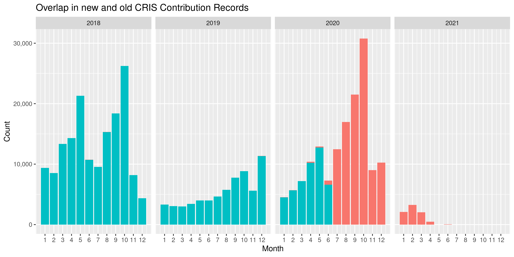
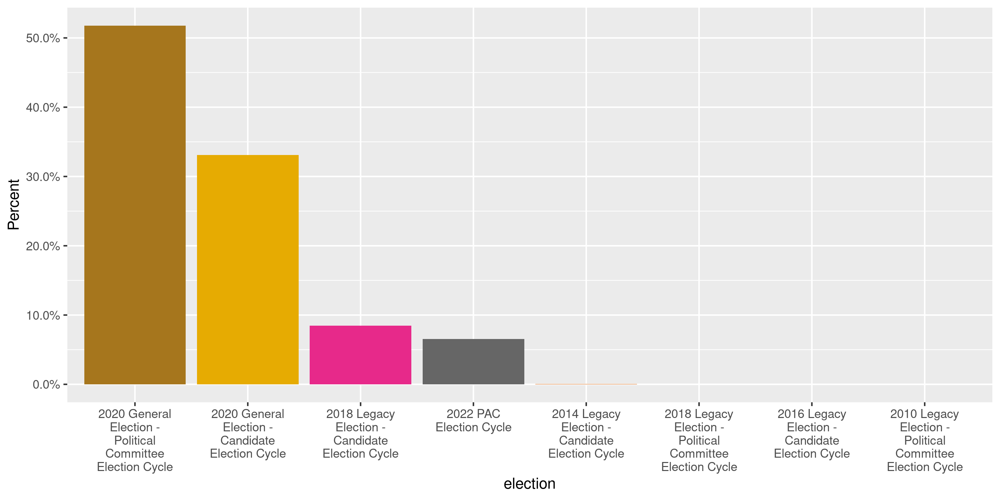
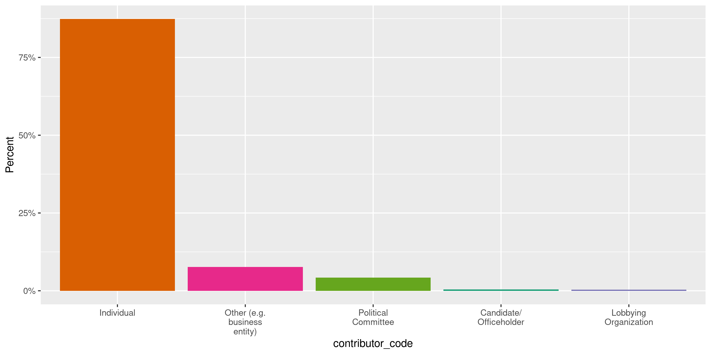
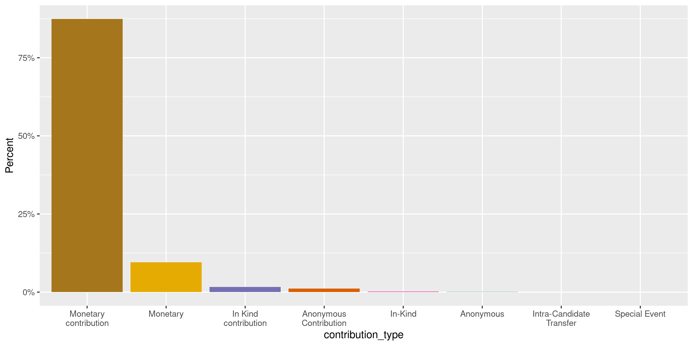
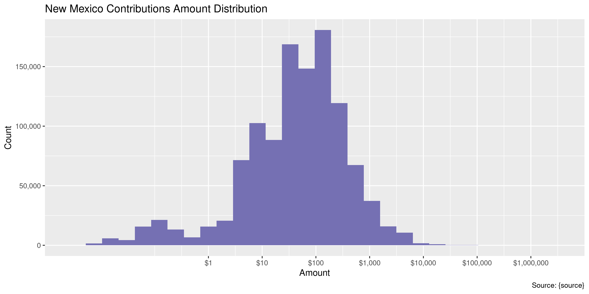
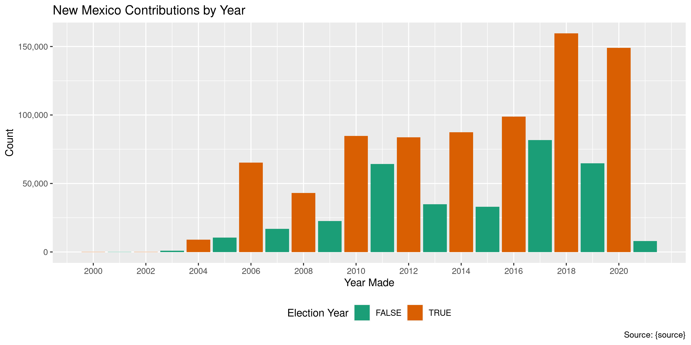
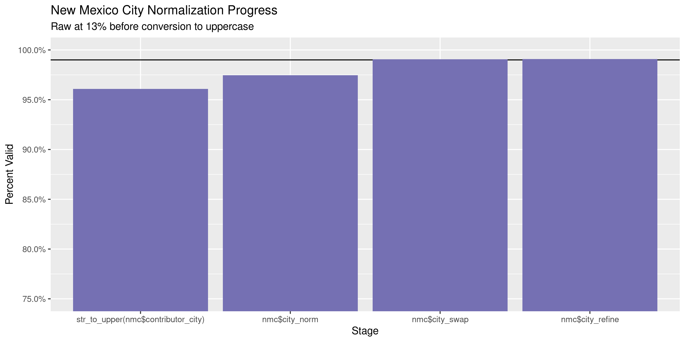
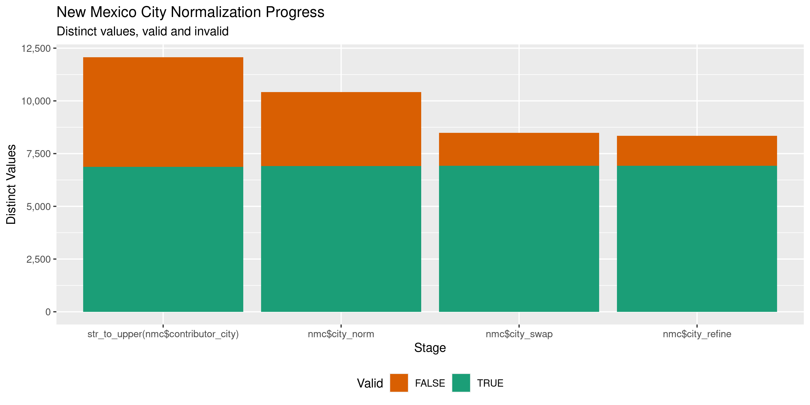

New Mexico Contributions
================
Kiernan Nicholls
Fri Aug 20 12:54:06 2021

-   [Project](#project)
-   [Objectives](#objectives)
-   [Packages](#packages)
-   [Data](#data)
-   [Download](#download)
    -   [Old](#old)
    -   [New](#new)
-   [Read](#read)
    -   [Old](#old-1)
    -   [New](#new-1)
    -   [Combine](#combine)
-   [Explore](#explore)
    -   [Missing](#missing)
    -   [Duplicates](#duplicates)
    -   [Categorical](#categorical)
    -   [Amounts](#amounts)
    -   [Dates](#dates)
-   [Wrangle](#wrangle)
    -   [Address](#address)
    -   [ZIP](#zip)
    -   [State](#state)
    -   [City](#city)
-   [Conclude](#conclude)
-   [Export](#export)
-   [Upload](#upload)

<!-- Place comments regarding knitting here -->

## Project

The Accountability Project is an effort to cut across data silos and
give journalists, policy professionals, activists, and the public at
large a simple way to search across huge volumes of public data about
people and organizations.

Our goal is to standardize public data on a few key fields by thinking
of each dataset row as a transaction. For each transaction there should
be (at least) 3 variables:

1.  All **parties** to a transaction.
2.  The **date** of the transaction.
3.  The **amount** of money involved.

## Objectives

This document describes the process used to complete the following
objectives:

1.  How many records are in the database?
2.  Check for entirely duplicated records.
3.  Check ranges of continuous variables.
4.  Is there anything blank or missing?
5.  Check for consistency issues.
6.  Create a five-digit ZIP Code called `zip`.
7.  Create a `year` field from the transaction date.
8.  Make sure there is data on both parties to a transaction.

## Packages

The following packages are needed to collect, manipulate, visualize,
analyze, and communicate these results. The `pacman` package will
facilitate their installation and attachment.

``` r
if (!require("pacman")) {
  install.packages("pacman")
}
pacman::p_load(
  tidyverse, # data manipulation
  lubridate, # datetime strings
  gluedown, # printing markdown
  janitor, # clean data frames
  campfin, # custom irw tools
  aws.s3, # aws cloud storage
  refinr, # cluster & merge
  scales, # format strings
  knitr, # knit documents
  vroom, # fast reading
  rvest, # scrape html
  glue, # code strings
  here, # project paths
  httr, # http requests
  fs # local storage 
)
```

This document should be run as part of the `R_campfin` project, which
lives as a sub-directory of the more general, language-agnostic
[`irworkshop/accountability_datacleaning`](https://github.com/irworkshop/accountability_datacleaning)
GitHub repository.

The `R_campfin` project uses the [RStudio
projects](https://support.rstudio.com/hc/en-us/articles/200526207-Using-Projects)
feature and should be run as such. The project also uses the dynamic
`here::here()` tool for file paths relative to *your* machine.

``` r
# where does this document knit?
here::i_am("nm/contribs/docs/nm_contribs_diary.Rmd")
```

## Data

The data available at [the old CFIS
website](https://www.cfis.state.nm.us/media/CFIS_Data_Download.aspx) is
decommissioned and no longer updated. The most recent contributions in
the data were made in October of 2020.

> #### !!Attention Candidates, Political Committees and Lobbyists!!
>
> This system has been decommissioned and is no longer available for use
> by candidates and political committees. To file a disclosure report or
> to register a new political committee, please use the new CFIS at
> <https://login.cfis.sos.state.nm.us>
>
> Lobbyists, please continue to use this system through calendar year
> 2020. You will use the new CFIS for 2021. More information will
> follow. If you have any support questions, please contact
> <sos.elections@state.nm.us>.

Data from 2020 onward can be found from the New Mexico Secretary of
state at a [new CRIS portal](https://login.cfis.sos.state.nm.us/).

> This page provides comma separated value (CSV) downloads of
> contribution, expenditure, and loan data for each reporting year in a
> zipped file format. These files can be downloaded and imported into
> other applications (Microsoft Excel, Microsoft Access, etc.)
>
> This data is extracted as it existed as of 08/17/2021 12:09 PM.

The new CRIS page also provides a [record
layout](https://login.cfis.sos.state.nm.us/Template/Contributions%20and%20Loans%20File%20Layout%20Key.pdf)
for contributions. From this layout, we know the new data has a
different structure than the old data. We will first download the old
data and format it to take an overlapping structure to the newer data.

## Download

We can download data from both CRIS websites using a combination of GET
and POST requests made to the server. These requests define what data we
are interested in and save the file locally.

``` r
raw_dir <- dir_create(here("nm", "contribs", "data", "raw"))
```

### Old

The old CRIS website uses an ASP.NET server. We can visit the home page
and then use the cookies from that visit to make two subsequent requests
for campaign finance transactions made by (1) Candidates and (2) PACs.

> #### CFIS Data Download
>
> The files available will be downloaded in a CSV file format. To
> download a file, select the type of CFIS data and corresponding
> filters and click Download Data. The file will be downloaded and
> should appear in the lower left corner of your browser window. If you
> do not see the file, please check your browser’s pop-up blocker
> settings.

> ##### Transactions
>
> Download a listing of all contributions and expenditures for one or
> all filing periods for candidates, PACs, and Lobbyists.
>
> The CFIS data available for download is updated daily at 12:00AM and
> 12:00PM MST.

``` r
nm_url <- "https://www.cfis.state.nm.us/media/CFIS_Data_Download.aspx"
set_config(config(ssl_verifypeer = 0L))
nm_home <- GET(nm_url)
nm_html <- content(nm_home, as = "parsed")
nm_cookie <- cookies(nm_home)
nm_cookie <- setNames(nm_cookie$value, nm_cookie$name)
```

``` r
view_state <- list(
  `__VIEWSTATE` = nm_html %>% 
    html_element("#__VIEWSTATE") %>% 
    html_attr("value"),
  `__VIEWSTATEGENERATOR` = nm_html %>% 
    html_element("#__VIEWSTATEGENERATOR") %>% 
    html_attr("value"),
  `__EVENTVALIDATION` = nm_html %>% 
    html_element("#__EVENTVALIDATION") %>% 
    html_attr("value")
)
```

``` r
nm_types <- tribble(
  ~look_for,    ~file_name,
  "Candidates", "CandidateTransactions.csv", 
# "Lobbyist",   "LobbyistTransactions.csv", 
  "PACs",       "PACTransactions.csv",
)
```

| “Look For” | File Path                                         |
|:-----------|:--------------------------------------------------|
| Candidates | \~/nm/contribs/data/raw/CandidateTransactions.csv |
| PACs       | \~/nm/contribs/data/raw/PACTransactions.csv       |

``` r
for (look_for in nm_types$look_for) {
  message(look_for)
  csv_path <- nm_types$file_name[match(look_for, nm_types$look_for)]
  if (!file_exists(csv_path)) {
    Sys.sleep(runif(1, 1, 3))
    POST(
      url = "https://www.cfis.state.nm.us/media/CFIS_Data_Download.aspx",
      write_disk(path = csv_path, overwrite = TRUE),
      set_cookies(nm_cookie),
      progress("down"),
      body = c( # combine extracted VIEWSTATE with form options 
        view_state, # __VIEWSTATE, __VIEWSTATEGENERATOR, __EVENTVALIDATION
        list( # dropdown body arguments: ALL rows for each file type
          `ctl00$ContentPlaceHolder1$header1$ddlCSVSelect` = "Transactions",
          `ctl00$ContentPlaceHolder1$header1$ddlRegisrationYear` = "0",
          `ctl00$ContentPlaceHolder1$header1$ddlViewBy` = "Lobbyist", # keep
          `ctl00$ContentPlaceHolder1$header1$hfFilePeriodFilter` = "ALL",
          `ctl00$ContentPlaceHolder1$header1$ddlLookFor` = look_for, # change
          `ctl00$ContentPlaceHolder1$header1$ddlFilePeriodYear` = "0",
          `ctl00$ContentPlaceHolder1$header1$ddlFPCan` = "ALL",
          `ctl00$ContentPlaceHolder1$header1$Button1` = "Download+Data",
          `ctl00$ContentPlaceHolder1$header1$hfLobbyistFilingPeriod` = "ALL",
          `ctl00$ContentPlaceHolder1$header1$ddlTransRegYear` = "0",
          `ctl00$ContentPlaceHolder1$header1$ddlFPLob` = "ALL"
        )
      )
    )
  }
}
```

### New

The new CRIS website hosts separate annual files for political
contributions and expenditures. These files can be checked with a
request to the page.

``` r
nm_check <- GET(
  "https://login.cfis.sos.state.nm.us/api///DataDownload/GetCheckDatadownload",
  query = list(
    pageNumber = 1,
    pageSize = 10,
    sortDir = "Desc",
    sortedBy = "ElectionYear"
  )
)
```

``` r
nm_check <- content(
  x = nm_check, 
  as = "parsed", 
  type = "application/json"
)
```

The data on this page reports last being updates at
`format(as_datetime(nm_check[[length(nm_check)]]$PSTTime), "%H:%M %b %d, %Y")`.
There are `length(nm_check) - 1` files currently hosted on the new CRIS
download page. We will download the files with `TransactionType` of
`CON`, indicating they contain contributions.

| TransactionKey          | ElectionYear | NameOfFile    | TransactionType | PSTTime             |
|:------------------------|-------------:|:--------------|:----------------|:--------------------|
| Contributions and Loans |         2021 | CON\_2021.csv | CON             | 2021-08-20 09:53:42 |
| Expenditures            |         2021 | EXP\_2021.csv | EXP             | 2021-08-20 09:53:42 |
| Contributions and Loans |         2020 | CON\_2020.csv | CON             | 2021-08-20 09:53:42 |
| Expenditures            |         2020 | EXP\_2020.csv | EXP             | 2021-08-20 09:53:42 |

``` r
for (i in seq(nrow(nm_check))) {
  message(nm_check$NameOfFile[i])
  con_path <- path(raw_dir, nm_check$NameOfFile[i])
  if (!file_exists(con_path)) {
    GET(
     "https://login.cfis.sos.state.nm.us/api/DataDownload/GetCSVDownloadReport",
      query = list(
        year = nm_check$ElectionYear[i],
        transactionType = nm_check$TransactionType[i],
        reportFormat = "csv",
        fileName = nm_check$NameOfFile[i],
      )
    )
  }
}
```

## Read

We will read the old and new file formats separately. The search format
of the Accountability Project database requires that files in the same
dataset have the same structure. The older files have fewer columns
containing less overall data. We can rename the shared columns to match
and remove any columns in the older format containing data not found in
the newer format.

For example, if the older data contained columns \[a, b, c, d\] and the
newer format contained columns \[A, B, C, E, F\] then the older columns
would be renamed and removed to contain only \[A, B, C\] to overlap with
the newer data.

### Old

``` r
nm_old <- map(
  .x = nm_types$file_name,
  .f = read_delim,
  delim = ",",
  na = c("", "NA", "NULL", "N/A"),
  escape_backslash = FALSE, 
  escape_double = FALSE,
  locale = locale(tz = "MST"),
  col_types = cols(
    .default = col_character(),
    `IsContribution` = col_logical(),
    `IsAnonymous` = col_logical(),
    `Amount` = col_double(),
    `Date Contribution` = col_date(),
    `Date Added` = col_datetime()
  )
)
```

The older data has two very similar formats for Candidate and PAC
contributions. Once the `PAC Name` column is renamed to `Last Name`,
then the two can be bound into a single table.

``` r
names(nm_old) <- nm_types$look_for
nm_old$PACs <- rename(nm_old$PACs, `Last Name` = `PAC Name`)
nm_old <- bind_rows(nm_old)
```

Here is a random row from the old format.

    #> Rows: 1
    #> Columns: 21
    #> $ `First Name`                     <chr> "Billie"
    #> $ `Last Name`                      <chr> "Helean"
    #> $ Description                      <chr> "Monetary Expenditure"
    #> $ IsContribution                   <lgl> FALSE
    #> $ IsAnonymous                      <lgl> FALSE
    #> $ Amount                           <dbl> 105
    #> $ `Date Contribution`              <date> 2018-07-24
    #> $ Memo                             <chr> NA
    #> $ `ContribExpenditure Description` <chr> "PO Box"
    #> $ `ContribExpenditure First Name`  <chr> NA
    #> $ `ContribExpenditure Middle Name` <chr> NA
    #> $ `ContribExpenditure Last Name`   <chr> NA
    #> $ Suffix                           <chr> NA
    #> $ `Company Name`                   <chr> "United States Postal Service"
    #> $ Address                          <chr> "2003 Southern Blvd SE # 102"
    #> $ City                             <chr> "Rio Rancho"
    #> $ State                            <chr> "NM"
    #> $ Zip                              <chr> "87124"
    #> $ Occupation                       <chr> NA
    #> $ `Filing Period`                  <chr> "2018 First General"
    #> $ `Date Added`                     <dttm> 2018-09-05 07:04:19

In the old data, the `Last Name` column contains the *recipient* while
the `ContribExpenditure Last Name` or `Company Name` contains the name
of the party making the contribution.

    #> # A tibble: 10 × 3
    #>    `Last Name`                                              `ContribExpenditure Last Name` `Company Name`
    #>    <chr>                                                    <chr>                          <chr>         
    #>  1 ActBlue New Mexico                                       MESIAH PHD                     <NA>          
    #>  2 ActBlue New Mexico                                       SAVAGE                         <NA>          
    #>  3 ActBlue New Mexico                                       HARRIS                         <NA>          
    #>  4 New Mexico Coca-Cola Nonpartisan PAC for Good Government Anderson                       Coca-Cola     
    #>  5 King                                                     Vincent                        <NA>          
    #>  6 Ferrary                                                  Alvarez                        <NA>          
    #>  7 El Paso Electric Company Employee PAC                    Stone                          <NA>          
    #>  8 Lopez                                                    Tristani                       <NA>          
    #>  9 Mcmillan                                                 <NA>                           NM Dental PAC 
    #> 10 ActBlue New Mexico                                       THIESSEN                       <NA>

### New

We can similarly read the files from the new CRIS website.

``` r
new_csv <- path(raw_dir, nm_check$NameOfFile)
```

``` r
nm_new <- read_delim(
  file = new_csv,
  escape_backslash = FALSE,
  escape_double = TRUE,
  locale = locale(tz = "MST"),
  col_types = cols(
    .default = col_character(),
    `Transaction Amount` = col_double(),
    `Transaction ID` = col_integer()
    # BUG: https://github.com/tidyverse/readr/issues/1276
    # `Transaction Date` = col_datetime("%m/%d/%Y %H:%M:%S %p"),
    # `Filed Date` = col_datetime("%m/%d/%Y %H:%M:%S %p"),
    # `Start of Period` = col_datetime("%b  %d %Y %H:%M%p"),
    # `End of Period` = col_datetime("%b  %d %Y %H:%M%p"),
  )
)
```

    #> Rows: 1
    #> Columns: 35
    #> $ OrgID                              <chr> "2856"
    #> $ `Transaction Amount`               <dbl> 500
    #> $ `Transaction Date`                 <dttm> 2020-08-26
    #> $ `Last Name`                        <chr> "Espinoza"
    #> $ `First Name`                       <chr> "Diego"
    #> $ `Middle Name`                      <chr> "L."
    #> $ Prefix                             <chr> NA
    #> $ Suffix                             <chr> NA
    #> $ `Contributor Address Line 1`       <chr> NA
    #> $ `Contributor Address Line 2`       <chr> NA
    #> $ `Contributor City`                 <chr> NA
    #> $ `Contributor State`                <chr> NA
    #> $ `Contributor Zip Code`             <chr> NA
    #> $ Description                        <chr> "Check"
    #> $ `Check Number`                     <chr> "1069"
    #> $ `Transaction ID`                   <int> 73397
    #> $ `Filed Date`                       <dttm> 2020-09-14 07:49:02
    #> $ Election                           <chr> "2020 General Election - Candidate Election Cycle"
    #> $ `Report Name`                      <chr> "First General Report"
    #> $ `Start of Period`                  <dttm> 2020-06-30
    #> $ `End of Period`                    <dttm> 2020-09-07
    #> $ `Contributor Code`                 <chr> "Political Committee"
    #> $ `Contribution Type`                <chr> "Monetary"
    #> $ `Report Entity Type`               <chr> "Candidate"
    #> $ `Committee Name`                   <chr> "Crystal Diamond for New Mexico"
    #> $ `Candidate Last Name`              <chr> "DIAMOND"
    #> $ `Candidate First Name`             <chr> "CRYSTAL"
    #> $ `Candidate Middle Name`            <chr> "R"
    #> $ `Candidate Prefix`                 <chr> NA
    #> $ `Candidate Suffix`                 <chr> NA
    #> $ Amended                            <lgl> FALSE
    #> $ `Contributor Employer`             <chr> NA
    #> $ `Contributor Occupation`           <chr> NA
    #> $ `Occupation Comment`               <chr> NA
    #> $ `Employment Information Requested` <lgl> FALSE

In the new data, every row has a `Committee Name` that received and
reported the contribution. The contributions made to a *candidate*
campaign committee have both the `Committee Name` and the
`Candidate * Name`. For contributions made by an individual there is a
first and last name, while those made by companies entirely in the
`Last Name` column.

``` r
nm_new %>% 
  select(
    `Contributor Code`,
    `First Name`,
    `Last Name`,
    `Committee Name`,
    `Report Entity Type`,
    `Candidate Last Name`,
  ) %>% 
  sample_n(10) %>% 
  arrange(
    `Contributor Code`,
    `Report Entity Type`
  )
#> # A tibble: 10 × 6
#>    `Contributor Code` `First Name` `Last Name`         `Committee Name`             `Report Entity T… `Candidate Last N…
#>    <chr>              <chr>        <chr>               <chr>                        <chr>             <chr>             
#>  1 Individual         Shelley      Robinson            Friends of Maggie Toulouse … Candidate         Toulouse Oliver   
#>  2 Individual         Joan         Puccini             JaniceForPRC-NM              Candidate         ARNOLD-JONES      
#>  3 Individual         Susan        Yanda               New Mexicans for Michelle    Candidate         Lujan Grisham     
#>  4 Individual         Steven       Peralta             Candidate Campaign Committe… Candidate         MARTINEZ          
#>  5 Individual         SIDNEY       BRYAN               ActBlue New Mexico           PAC - Other       <NA>              
#>  6 Individual         CHRISTOPHER  JARAMILLO           ActBlue New Mexico           PAC - Other       <NA>              
#>  7 Individual         ROBER        PEDRONCELLI         Southwest Regional Council … PAC - Other       <NA>              
#>  8 Individual         ROBERT       STALLINGS           Southwest Regional Council … PAC - Other       <NA>              
#>  9 Political Committ… <NA>         NM Senate Majority… Paul A Baca for Senate       Candidate         BACA              
#> 10 Political Committ… <NA>         IBEW PAC Voluntary… Elect Willie Madrid for NM … Candidate         MADRID
```

    #> # A tibble: 6 × 2
    #>   `Contributor Code`           no_first_name
    #>   <chr>                                <dbl>
    #> 1 <NA>                              1       
    #> 2 Other (e.g. business entity)      1.00    
    #> 3 Lobbying Organization             0.896   
    #> 4 Political Committee               0.780   
    #> 5 Individual                        0.000147
    #> 6 Candidate/Officeholder            0
    #> # A tibble: 6 × 2
    #>   `Report Entity Type`                                  no_first_name
    #>   <chr>                                                         <dbl>
    #> 1 PAC - Contribution or Coordination                                1
    #> 2 PAC - Independent Expenditure                                     1
    #> 3 PAC - Legislative Caucus Committee                                1
    #> 4 PAC - Mixed (Independent & Contribution/Coordination)             1
    #> 5 PAC - Other                                                       1
    #> 6 Candidate                                                         0

### Combine

while the two files have different column names, they overlap
significantly in the actual data contained in those columns. We can
rename the *older* columns to match their newer counterparts and then
combine the two files.

``` r
nm_old_nm <- names(nm_old)
```

``` r
nm_old <- nm_old %>% 
  rename(
    `Candidate First Name` = `First Name`,
    `Candidate Last Name` = `Last Name`,
    `Contribution Type` = `Description`,
    `Transaction Amount` = `Amount`,
    `Transaction Date` = `Date Contribution`,
    `Description` = `ContribExpenditure Description`,
    `First Name` = `ContribExpenditure First Name`,
    `Middle Name` = `ContribExpenditure Middle Name`,
    `Last Name` = `ContribExpenditure Last Name`,
    `Contributor Address Line 1` = `Address`,
    `Contributor City` = `City`,
    `Contributor State` = `State`,
    `Contributor Zip Code` = `Zip`,
    `Contributor Occupation` = `Occupation`,
    `Report Name` = `Filing Period`,
    `Filed Date` = `Date Added`
  )
```

``` r
mean(is.na(nm_old$`Last Name`)[!is.na(nm_old$`Company Name`)])
#> [1] 0.9067446
mean(!is.na(nm_old$`Last Name`)[is.na(nm_old$`Company Name`)])
#> [1] 0.9850568
nm_old <- mutate(nm_old, `Last Name` = coalesce(`Last Name`, `Company Name`))
```

``` r
old_new_overlap <- intersect(x = names(nm_new), y = names(nm_old))
length(old_new_overlap)
#> [1] 17
setdiff(names(nm_new), names(nm_old)) # in new, not old
#>  [1] "OrgID"                            "Prefix"                           "Contributor Address Line 2"      
#>  [4] "Check Number"                     "Transaction ID"                   "Election"                        
#>  [7] "Start of Period"                  "End of Period"                    "Contributor Code"                
#> [10] "Report Entity Type"               "Committee Name"                   "Candidate Middle Name"           
#> [13] "Candidate Prefix"                 "Candidate Suffix"                 "Amended"                         
#> [16] "Contributor Employer"             "Occupation Comment"               "Employment Information Requested"
nm_old <- select(nm_old, all_of(old_new_overlap))
```

Both files contain records from the year 2020, although we can plot the
total contributions made in each month to see that the shift to the new
CRIS website occurred in June and there doesn’t seem to be a gap in the
time covered or significant overlap in data.

<!-- -->

``` r
# sort and fill with empty rows
# bind_rows(nm_new[0, ], nm_old)
```

We have removed any columns in the *old* data that did not have
analogues in the *new* data. When the two tables are essentially stacked
together, empty rows will be created for any column not found in the new
data.

``` r
nmc <- bind_rows(new = nm_new, old = nm_old, .id = "age")
```

``` r
nmc <- clean_names(nmc, case = "snake")
```

## Explore

There are 1,530,519 rows of 36 columns. Each record represents a single
contribution made from an individual or corporation to a political
candidate campaign or committee.

``` r
glimpse(nmc)
#> Rows: 1,530,519
#> Columns: 36
#> $ age                              <chr> "new", "new", "new", "new", "new", "new", "new", "new", "new", "new", "new", …
#> $ org_id                           <chr> "1416", "1416", "1442", "1442", "1453", "1453", "1453", "1453", "1453", "1453…
#> $ transaction_amount               <dbl> 2.77, 110.79, 69.00, 500.00, 1.00, 1.00, 1.00, 1.00, 1.00, 1.00, 1.00, 1.00, …
#> $ transaction_date                 <dttm> 2020-10-01, 2020-12-15, 2021-02-17, 2021-02-17, 2020-10-07, 2020-10-10, 2020…
#> $ last_name                        <chr> "Payne", "Payne", "Chase Financial", "Stebbins", "Deherrera", "Markman", "Geo…
#> $ first_name                       <chr> "William", "William", NA, "Maggie", "Deanne", "Scott", "Barbara", "Herman", "…
#> $ middle_name                      <chr> "H", "H", NA, "Hart", NA, NA, NA, NA, NA, NA, NA, NA, NA, NA, NA, NA, NA, "L.…
#> $ prefix                           <chr> NA, NA, NA, NA, NA, NA, NA, NA, NA, NA, NA, NA, NA, NA, NA, NA, NA, NA, NA, N…
#> $ suffix                           <chr> NA, NA, NA, NA, NA, NA, NA, NA, NA, NA, NA, NA, NA, NA, NA, NA, NA, NA, NA, N…
#> $ contributor_address_line_1       <chr> NA, NA, "chase.com", NA, "6007 PALM AVE SW", "PO BOX 169", "13612 OLD MISSION…
#> $ contributor_address_line_2       <chr> NA, NA, NA, NA, NA, NA, NA, NA, NA, NA, "Apt 1118", NA, NA, NA, NA, NA, NA, N…
#> $ contributor_city                 <chr> NA, NA, "chase.com", NA, "ALBUQUERQUE", "ABIQUIU", "RIVERSIDE", "MADISON", "V…
#> $ contributor_state                <chr> NA, NA, "NM", NA, "NM", "NM", "CA", "WI", "VA", "MN", "CA", "NM", "NM", "NM",…
#> $ contributor_zip_code             <chr> NA, NA, "87110", NA, "87121", "87510", "92503", "53713", "22180", "55113", "9…
#> $ description                      <chr> "Interest on Checking Account", "shown to reconcile closing/balance of campai…
#> $ check_number                     <chr> NA, NA, NA, NA, NA, NA, NA, NA, NA, NA, NA, NA, NA, NA, NA, NA, NA, NA, NA, N…
#> $ transaction_id                   <int> 166556, 268222, 331388, 331387, 328748, 329406, 328974, 330483, 329670, 32834…
#> $ filed_date                       <dttm> 2021-04-09 14:18:25, 2021-04-09 15:19:22, 2021-04-13 22:15:57, 2021-04-13 22…
#> $ election                         <chr> "2016 Legacy Election - Candidate Election Cycle", "2016 Legacy Election - Ca…
#> $ report_name                      <chr> "Second Bi-Annual report", "First Bi-Annual Report", "First Bi-Annual Report"…
#> $ start_of_period                  <dttm> 2020-04-07, 2020-10-06, 2020-10-06, 2020-10-06, 2020-10-06, 2020-10-06, 2020…
#> $ end_of_period                    <dttm> 2020-10-05, 2021-04-05, 2021-04-05, 2021-04-05, 2021-04-05, 2021-04-05, 2021…
#> $ contributor_code                 <chr> "Candidate/Officeholder", "Candidate/Officeholder", "Other (e.g. business ent…
#> $ contribution_type                <chr> "Monetary", "Monetary", "Monetary", "Monetary", "Monetary", "Monetary", "Mone…
#> $ report_entity_type               <chr> "Candidate", "Candidate", "Candidate", "Candidate", "Candidate", "Candidate",…
#> $ committee_name                   <chr> "Payne for NM State Senate", "Payne for NM State Senate", "Maggie Hart Stebbi…
#> $ candidate_last_name              <chr> "Payne", "Payne", "Stebbins", "Stebbins", "Lujan Grisham", "Lujan Grisham", "…
#> $ candidate_first_name             <chr> "William", "William", "Maggie", "Maggie", "Michelle", "Michelle", "Michelle",…
#> $ candidate_middle_name            <chr> "H", "H", "Hart", "Hart", NA, NA, NA, NA, NA, NA, NA, NA, NA, NA, NA, NA, NA,…
#> $ candidate_prefix                 <chr> NA, NA, NA, NA, NA, NA, NA, NA, NA, NA, NA, NA, NA, NA, NA, NA, NA, NA, NA, N…
#> $ candidate_suffix                 <chr> NA, NA, NA, NA, NA, NA, NA, NA, NA, NA, NA, NA, NA, NA, NA, NA, NA, NA, NA, N…
#> $ amended                          <lgl> TRUE, FALSE, FALSE, FALSE, FALSE, FALSE, FALSE, FALSE, FALSE, FALSE, FALSE, F…
#> $ contributor_employer             <chr> "none", "none", NA, NA, NA, NA, NA, NA, NA, NA, NA, NA, NA, NA, NA, NA, NA, N…
#> $ contributor_occupation           <chr> NA, NA, NA, NA, NA, NA, NA, NA, NA, NA, NA, NA, NA, NA, NA, NA, NA, NA, NA, N…
#> $ occupation_comment               <chr> NA, NA, NA, NA, NA, NA, NA, NA, NA, NA, NA, NA, NA, NA, NA, NA, NA, NA, NA, N…
#> $ employment_information_requested <lgl> TRUE, TRUE, FALSE, TRUE, FALSE, FALSE, FALSE, FALSE, FALSE, FALSE, FALSE, FAL…
tail(nmc)
#> # A tibble: 6 × 36
#>   age   org_id transaction_amou… transaction_date    last_name    first_name middle_name prefix suffix contributor_addr…
#>   <chr> <chr>              <dbl> <dttm>              <chr>        <chr>      <chr>       <chr>  <chr>  <chr>            
#> 1 old   <NA>               2743  2009-06-08 00:00:00 Crook        Keigm      <NA>        <NA>   <NA>   6800 Montgomery,…
#> 2 old   <NA>                702. 2009-06-15 00:00:00 Los Pinos F… <NA>       <NA>        <NA>   <NA>   2820 Richmond Dr.
#> 3 old   <NA>                200  2009-06-24 00:00:00 Denish       Diane      <NA>        <NA>   <NA>   2604 Morrow, NE  
#> 4 old   <NA>                267. 2009-08-01 00:00:00 Madrid Busi… <NA>       <NA>        <NA>   <NA>   P.O. Box 92406   
#> 5 old   <NA>               2000  2009-08-17 00:00:00 Cravens      Kent       <NA>        <NA>   <NA>   4500 Osuna, NE   
#> 6 old   <NA>               2000  2009-09-23 00:00:00 Crook        Keigm      <NA>        <NA>   <NA>   6800 Montgomery,…
#> # … with 26 more variables: contributor_address_line_2 <chr>, contributor_city <chr>, contributor_state <chr>,
#> #   contributor_zip_code <chr>, description <chr>, check_number <chr>, transaction_id <int>, filed_date <dttm>,
#> #   election <chr>, report_name <chr>, start_of_period <dttm>, end_of_period <dttm>, contributor_code <chr>,
#> #   contribution_type <chr>, report_entity_type <chr>, committee_name <chr>, candidate_last_name <chr>,
#> #   candidate_first_name <chr>, candidate_middle_name <chr>, candidate_prefix <chr>, candidate_suffix <chr>,
#> #   amended <lgl>, contributor_employer <chr>, contributor_occupation <chr>, occupation_comment <chr>,
#> #   employment_information_requested <lgl>
```

### Missing

Columns vary in their degree of missing values. Of course, rows not
found in the *older* data will be 100% in this combined table.

``` r
col_stats(nmc, count_na)
#> # A tibble: 36 × 4
#>    col                              class        n        p
#>    <chr>                            <chr>    <int>    <dbl>
#>  1 age                              <chr>        0 0       
#>  2 org_id                           <chr>  1420461 0.928   
#>  3 transaction_amount               <dbl>        0 0       
#>  4 transaction_date                 <dttm>     726 0.000474
#>  5 last_name                        <chr>    14266 0.00932 
#>  6 first_name                       <chr>   531124 0.347   
#>  7 middle_name                      <chr>  1354054 0.885   
#>  8 prefix                           <chr>  1530504 1.00    
#>  9 suffix                           <chr>  1519870 0.993   
#> 10 contributor_address_line_1       <chr>    20017 0.0131  
#> 11 contributor_address_line_2       <chr>  1528337 0.999   
#> 12 contributor_city                 <chr>    19115 0.0125  
#> 13 contributor_state                <chr>    18601 0.0122  
#> 14 contributor_zip_code             <chr>    18604 0.0122  
#> 15 description                      <chr>  1066864 0.697   
#> 16 check_number                     <chr>  1509439 0.986   
#> 17 transaction_id                   <int>  1420461 0.928   
#> 18 filed_date                       <dttm>       0 0       
#> 19 election                         <chr>  1420461 0.928   
#> 20 report_name                      <chr>    12850 0.00840 
#> 21 start_of_period                  <dttm> 1420461 0.928   
#> 22 end_of_period                    <dttm> 1420461 0.928   
#> 23 contributor_code                 <chr>  1421800 0.929   
#> 24 contribution_type                <chr>      278 0.000182
#> 25 report_entity_type               <chr>  1420461 0.928   
#> 26 committee_name                   <chr>  1420461 0.928   
#> 27 candidate_last_name              <chr>    64520 0.0422  
#> 28 candidate_first_name             <chr>   768865 0.502   
#> 29 candidate_middle_name            <chr>  1500385 0.980   
#> 30 candidate_prefix                 <chr>  1530516 1.00    
#> 31 candidate_suffix                 <chr>  1528688 0.999   
#> 32 amended                          <lgl>  1420461 0.928   
#> 33 contributor_employer             <chr>  1488913 0.973   
#> 34 contributor_occupation           <chr>   761067 0.497   
#> 35 occupation_comment               <chr>  1530519 1       
#> 36 employment_information_requested <lgl>  1420461 0.928
```

We can flag any record missing a key variable needed to identify a
transaction.

``` r
nmc <- nmc %>% 
  mutate(committee_name = coalesce(committee_name, candidate_last_name))
```

``` r
key_vars <- c("transaction_date", "last_name", 
              "transaction_amount", "committee_name")
nmc <- flag_na(nmc, all_of(key_vars))
percent(mean(nmc$na_flag), 0.01)
#> [1] "0.98%"
```

``` r
nmc %>% 
  filter(na_flag) %>% 
  select(age, all_of(key_vars))
#> # A tibble: 15,048 × 5
#>    age   transaction_date    last_name transaction_amount committee_name                       
#>    <chr> <dttm>              <chr>                  <dbl> <chr>                                
#>  1 new   2020-11-01 00:00:00 <NA>                      20 Republican Party of Bernalillo County
#>  2 new   2020-12-11 00:00:00 <NA>                      41 Republican Party of Bernalillo County
#>  3 new   2020-12-04 00:00:00 <NA>                      50 Republican Party of Bernalillo County
#>  4 new   2020-10-30 00:00:00 <NA>                      88 Republican Party of Bernalillo County
#>  5 new   2021-03-18 00:00:00 <NA>                      62 Republican Women's Club of Carlsbad  
#>  6 new   2020-10-28 00:00:00 <NA>                      30 Democratic Party of Socorro County   
#>  7 new   2020-10-28 00:00:00 <NA>                      40 Democratic Party of Socorro County   
#>  8 new   2020-10-28 00:00:00 <NA>                      60 Democratic Party of Socorro County   
#>  9 new   2020-12-03 00:00:00 <NA>                      87 Democratic Party of Sandoval County  
#> 10 new   2021-02-12 00:00:00 <NA>                      15 Luna County Democratic Party         
#> # … with 15,038 more rows
```

### Duplicates

We can also flag any record completely duplicated across every column.

``` r
nmc <- flag_dupes(nmc, -transaction_id)
percent(mean(nmc$dupe_flag), 0.01)
#> [1] "3.91%"
```

``` r
percent(mean(nmc$dupe_flag[nmc$na_flag]))
#> [1] "14%"
```

``` r
nmc %>% 
  filter(dupe_flag) %>% 
  select(age, all_of(key_vars)) %>% 
  arrange(committee_name)
#> # A tibble: 59,863 × 5
#>    age   transaction_date    last_name                             transaction_amount committee_name     
#>    <chr> <dttm>              <chr>                                              <dbl> <chr>              
#>  1 old   2017-10-27 00:00:00 Bargas                                           5500    579 PAC            
#>  2 old   2017-10-27 00:00:00 Bargas                                           5500    579 PAC            
#>  3 old   2017-12-05 00:00:00 Perry                                            5500    579 PAC            
#>  4 old   2017-12-05 00:00:00 Perry                                            5500    579 PAC            
#>  5 old   2017-05-13 00:00:00 Brenner                                           250    A Better Way For LA
#>  6 old   2017-05-13 00:00:00 Brenner                                           250    A Better Way For LA
#>  7 new   2020-11-30 00:00:00 US Eagle Federal Credit Union                       3.32 A New Day For NM   
#>  8 new   2020-12-31 00:00:00 US Eagle Federal Credit Union                       3.33 A New Day For NM   
#>  9 new   2020-10-31 00:00:00 US Eagle Federal Credit Union                       3.82 A New Day For NM   
#> 10 new   2020-10-29 00:00:00 Rio Grande Chapter of Sierra Club PAC               8.03 A New Day For NM   
#> # … with 59,853 more rows
```

### Categorical

``` r
col_stats(nmc, n_distinct)
#> # A tibble: 38 × 4
#>    col                              class       n           p
#>    <chr>                            <chr>   <int>       <dbl>
#>  1 age                              <chr>       2 0.00000131 
#>  2 org_id                           <chr>     620 0.000405   
#>  3 transaction_amount               <dbl>   68514 0.0448     
#>  4 transaction_date                 <dttm>   6536 0.00427    
#>  5 last_name                        <chr>  184478 0.121      
#>  6 first_name                       <chr>   50264 0.0328     
#>  7 middle_name                      <chr>    3686 0.00241    
#>  8 prefix                           <chr>       4 0.00000261 
#>  9 suffix                           <chr>     205 0.000134   
#> 10 contributor_address_line_1       <chr>  409952 0.268      
#> 11 contributor_address_line_2       <chr>     804 0.000525   
#> 12 contributor_city                 <chr>   19103 0.0125     
#> 13 contributor_state                <chr>     477 0.000312   
#> 14 contributor_zip_code             <chr>   58756 0.0384     
#> 15 description                      <chr>  100726 0.0658     
#> 16 check_number                     <chr>    8024 0.00524    
#> 17 transaction_id                   <int>   93215 0.0609     
#> 18 filed_date                       <dttm> 504359 0.330      
#> 19 election                         <chr>      10 0.00000653 
#> 20 report_name                      <chr>     118 0.0000771  
#> 21 start_of_period                  <dttm>     26 0.0000170  
#> 22 end_of_period                    <dttm>     11 0.00000719 
#> 23 contributor_code                 <chr>       6 0.00000392 
#> 24 contribution_type                <chr>      10 0.00000653 
#> 25 report_entity_type               <chr>       7 0.00000457 
#> 26 committee_name                   <chr>    2852 0.00186    
#> 27 candidate_last_name              <chr>    2729 0.00178    
#> 28 candidate_first_name             <chr>    1618 0.00106    
#> 29 candidate_middle_name            <chr>     118 0.0000771  
#> 30 candidate_prefix                 <chr>       4 0.00000261 
#> 31 candidate_suffix                 <chr>       4 0.00000261 
#> 32 amended                          <lgl>       3 0.00000196 
#> 33 contributor_employer             <chr>    7807 0.00510    
#> 34 contributor_occupation           <chr>   43594 0.0285     
#> 35 occupation_comment               <chr>       1 0.000000653
#> 36 employment_information_requested <lgl>       3 0.00000196 
#> 37 na_flag                          <lgl>       2 0.00000131 
#> 38 dupe_flag                        <lgl>       2 0.00000131
```

<!-- --><!-- --><!-- -->

### Amounts

``` r
summary(nmc$transaction_amount)
#>    Min. 1st Qu.  Median    Mean 3rd Qu.    Max. 
#>   -1166      19      50     399     200 3269132
percent(mean(nmc$transaction_amount <= 0), 0.001)
#> [1] "0.001%"
```

These are the records with the minimum and maximum amounts.

``` r
glimpse(nmc[c(
  which.max(nmc$transaction_amount), 
  which.min(nmc$transaction_amount)), 
])
#> Rows: 2
#> Columns: 38
#> $ age                              <chr> "old", "old"
#> $ org_id                           <chr> NA, NA
#> $ transaction_amount               <dbl> 3269132, -1166
#> $ transaction_date                 <dttm> 2014-02-20, 2004-06-30
#> $ last_name                        <chr> "Martinez", "Laughing Lamb Design"
#> $ first_name                       <chr> "Susana", NA
#> $ middle_name                      <chr> NA, NA
#> $ prefix                           <chr> NA, NA
#> $ suffix                           <chr> NA, NA
#> $ contributor_address_line_1       <chr> "P.O. Box 15117", "P.O. Box 12045"
#> $ contributor_address_line_2       <chr> NA, NA
#> $ contributor_city                 <chr> "Las Cruces", "Jackson"
#> $ contributor_state                <chr> "NM", "WY"
#> $ contributor_zip_code             <chr> "88004-5117", "83002"
#> $ description                      <chr> "Transfer of funds to 2014 campaign", NA
#> $ check_number                     <chr> NA, NA
#> $ transaction_id                   <int> NA, NA
#> $ filed_date                       <dttm> 2014-04-04 10:53:21, 2010-01-01 00:00:00
#> $ election                         <chr> NA, NA
#> $ report_name                      <chr> "2014 First Biannual ", "Third Primary Report"
#> $ start_of_period                  <dttm> NA, NA
#> $ end_of_period                    <dttm> NA, NA
#> $ contributor_code                 <chr> NA, NA
#> $ contribution_type                <chr> "Monetary Expenditure", "Monetary Expenditure"
#> $ report_entity_type               <chr> NA, NA
#> $ committee_name                   <chr> "Martinez", "Wirth"
#> $ candidate_last_name              <chr> "Martinez", "Wirth"
#> $ candidate_first_name             <chr> "Susana", "Peter"
#> $ candidate_middle_name            <chr> NA, NA
#> $ candidate_prefix                 <chr> NA, NA
#> $ candidate_suffix                 <chr> NA, NA
#> $ amended                          <lgl> NA, NA
#> $ contributor_employer             <chr> NA, NA
#> $ contributor_occupation           <chr> NA, NA
#> $ occupation_comment               <chr> NA, NA
#> $ employment_information_requested <lgl> NA, NA
#> $ na_flag                          <lgl> FALSE, FALSE
#> $ dupe_flag                        <lgl> FALSE, FALSE
```

<!-- -->

### Dates

We can add the calendar year from `transaction_date` with
`lubridate::year()`.

``` r
nmc <- mutate(nmc, transaction_year = year(transaction_date))
```

``` r
min(nmc$transaction_date, na.rm = TRUE)
#> [1] "1900-04-09 MST"
sum(nmc$transaction_year < 2000, na.rm = TRUE)
#> [1] 14
max(nmc$transaction_date, na.rm = TRUE)
#> [1] "3004-03-30 MST"
sum(nmc$transaction_date > today(), na.rm = TRUE)
#> [1] 2
```

<!-- -->

## Wrangle

To improve the searchability of the database, we will perform some
consistent, confident string normalization. For geographic variables
like city names and ZIP codes, the corresponding `campfin::normal_*()`
functions are tailor made to facilitate this process.

### Address

For the street `addresss` variable, the `campfin::normal_address()`
function will force consistence case, remove punctuation, and abbreviate
official USPS suffixes.

``` r
nm_addr <- nmc %>% 
  distinct(contributor_address_line_1, contributor_address_line_2) %>% 
  unite(
    col = address_full,
    starts_with("contributor_address"),
    sep = " ",
    remove = FALSE,
    na.rm = TRUE
  ) %>% 
  mutate(
    address_norm = normal_address(
      address = address_full,
      abbs = usps_street,
      na_rep = TRUE
    )
  ) %>% 
  select(-address_full)
```

``` r
nm_addr
#> # A tibble: 410,472 × 3
#>    contributor_address_line_1 contributor_address_line_2 address_norm         
#>    <chr>                      <chr>                      <chr>                
#>  1 <NA>                       <NA>                       <NA>                 
#>  2 chase.com                  <NA>                       CHASE COM            
#>  3 6007 PALM AVE SW           <NA>                       6007 PALM AVE SW     
#>  4 PO BOX 169                 <NA>                       PO BOX 169           
#>  5 13612 OLD MISSION CT       <NA>                       13612 OLD MISSION CT 
#>  6 481 MARIGOLD DR            <NA>                       481 MARIGOLD DR      
#>  7 2533 Villanova Dr          <NA>                       2533 VILLANOVA DR    
#>  8 3077 Evelyn St             <NA>                       3077 EVELYN ST       
#>  9 1251 Turk St               Apt 1118                   1251 TURK ST APT 1118
#> 10 7809 SHERWOOD DR NW        <NA>                       7809 SHERWOOD DR NW  
#> # … with 410,462 more rows
```

``` r
nmc <- left_join(nmc, nm_addr)
```

### ZIP

For ZIP codes, the `campfin::normal_zip()` function will attempt to
create valid *five* digit codes by removing the ZIP+4 suffix and
returning leading zeroes dropped by other programs like Microsoft Excel.

``` r
nmc <- nmc %>% 
  mutate(
    zip_norm = normal_zip(
      zip = contributor_zip_code,
      na_rep = TRUE
    )
  )
```

``` r
progress_table(
  nmc$contributor_zip_code,
  nmc$zip_norm,
  compare = valid_zip
)
#> # A tibble: 2 × 6
#>   stage                    prop_in n_distinct prop_na  n_out n_diff
#>   <chr>                      <dbl>      <dbl>   <dbl>  <dbl>  <dbl>
#> 1 nmc$contributor_zip_code   0.883      58756  0.0122 177367  45498
#> 2 nmc$zip_norm               0.989      17214  0.0143  16268   2684
```

### State

Valid two digit state abbreviations can be made using the
`campfin::normal_state()` function.

``` r
nmc <- nmc %>% 
  mutate(
    state_norm = normal_state(
      state = contributor_state,
      abbreviate = TRUE,
      na_rep = TRUE,
      valid = valid_state
    )
  )
```

``` r
nmc %>% 
  filter(contributor_state != state_norm) %>% 
  count(contributor_state, state_norm, sort = TRUE)
#> # A tibble: 213 × 3
#>    contributor_state    state_norm     n
#>    <chr>                <chr>      <int>
#>  1 New Mexico           NM         14162
#>  2 California           CA          1787
#>  3 Texas                TX           991
#>  4 New York             NY           737
#>  5 nm                   NM           648
#>  6 Florida              FL           528
#>  7 Colorado             CO           477
#>  8 Arizona              AZ           374
#>  9 Illinois             IL           322
#> 10 District of Columbia DC           321
#> # … with 203 more rows
```

``` r
progress_table(
  nmc$contributor_state,
  nmc$state_norm,
  compare = valid_state
)
#> # A tibble: 2 × 6
#>   stage                 prop_in n_distinct prop_na n_out n_diff
#>   <chr>                   <dbl>      <dbl>   <dbl> <dbl>  <dbl>
#> 1 nmc$contributor_state   0.982        477  0.0122 27002    418
#> 2 nmc$state_norm          1             59  0.0135     0      1
```

### City

Cities are the most difficult geographic variable to normalize, simply
due to the wide variety of valid cities and formats.

#### Normal

The `campfin::normal_city()` function is a good start, again converting
case, removing punctuation, but *expanding* USPS abbreviations. We can
also remove `invalid_city` values.

``` r
norm_city <- nmc %>% 
  distinct(contributor_city, state_norm, zip_norm) %>% 
  mutate(
    city_norm = normal_city(
      city = contributor_city, 
      abbs = usps_city,
      states = c("NM", "DC", "NEW MEXICO"),
      na = invalid_city,
      na_rep = TRUE
    )
  )
```

#### Swap

We can further improve normalization by comparing our normalized value
against the *expected* value for that record’s state abbreviation and
ZIP code. If the normalized value is either an abbreviation for or very
similar to the expected value, we can confidently swap those two.

``` r
norm_city <- norm_city %>% 
  left_join(
    y = zipcodes,
    by = c(
      "state_norm" = "state",
      "zip_norm" = "zip"
    )
  ) %>% 
  rename(city_match = city) %>% 
  mutate(
    match_abb = is_abbrev(city_norm, city_match),
    match_dist = str_dist(city_norm, city_match),
    city_swap = if_else(
      condition = !is.na(match_dist) & (match_abb | match_dist == 1),
      true = city_match,
      false = city_norm
    )
  ) %>% 
  select(
    -city_match,
    -match_dist,
    -match_abb
  )
```

``` r
nmc <- left_join(
  x = nmc,
  y = norm_city,
  by = c(
    "contributor_city", 
    "state_norm", 
    "zip_norm"
  )
)
```

#### Refine

The [OpenRefine](https://openrefine.org/) algorithms can be used to
group similar strings and replace the less common versions with their
most common counterpart. This can greatly reduce inconsistency, but with
low confidence; we will only keep any refined strings that have a valid
city/state/zip combination.

``` r
good_refine <- nmc %>% 
  mutate(
    city_refine = city_swap %>% 
      key_collision_merge() %>% 
      n_gram_merge(numgram = 1)
  ) %>% 
  filter(city_refine != city_swap) %>% 
  inner_join(
    y = zipcodes,
    by = c(
      "city_refine" = "city",
      "state_norm" = "state",
      "zip_norm" = "zip"
    )
  )
```

    #> # A tibble: 271 × 5
    #>    state_norm zip_norm city_swap      city_refine       n
    #>    <chr>      <chr>    <chr>          <chr>         <int>
    #>  1 NC         28270    CHAROLETTE     CHARLOTTE       115
    #>  2 NM         87801    SOCCORO        SOCORRO          48
    #>  3 NM         87010    LOS CERRILLOS  CERRILLOS        46
    #>  4 CA         94105    SAN FRANSICO   SAN FRANCISCO    34
    #>  5 NM         88310    ALMGORODO      ALAMOGORDO       27
    #>  6 NM         88081    CHAPPARAL      CHAPARRAL        24
    #>  7 IL         60094    PALLANTINE     PALATINE         21
    #>  8 NM         87375    YAH TA HEY     YATAHEY          20
    #>  9 NM         87375    YA TA HEY      YATAHEY          19
    #> 10 NM         87106    ALBUQUERQERQUE ALBUQUERQUE      15
    #> # … with 261 more rows

Then we can join the refined values back to the database.

``` r
nmc <- nmc %>% 
  left_join(good_refine, by = names(.)) %>% 
  mutate(city_refine = coalesce(city_refine, city_swap))
```

#### Progress

Our goal for normalization was to increase the proportion of city values
known to be valid and reduce the total distinct values by correcting
misspellings.

| stage                                | prop\_in | n\_distinct | prop\_na | n\_out | n\_diff |
|:-------------------------------------|---------:|------------:|---------:|-------:|--------:|
| `str_to_upper(nmc$contributor_city)` |    0.955 |       13728 |    0.012 |  67326 |    6731 |
| `nmc$city_norm`                      |    0.973 |       11526 |    0.014 |  40888 |    4481 |
| `nmc$city_swap`                      |    0.991 |        9167 |    0.014 |  13874 |    2113 |
| `nmc$city_refine`                    |    0.991 |        8988 |    0.014 |  13012 |    1934 |

You can see how the percentage of valid values increased with each
stage.

<!-- -->

More importantly, the number of distinct values decreased each stage. We
were able to confidently change many distinct invalid values to their
valid equivalent.

<!-- -->

## Conclude

Before exporting, we can remove the intermediary normalization columns
and rename all added variables with the `_clean` suffix.

``` r
nmc <- nmc %>% 
  select(
    -city_norm,
    -city_swap,
    city_clean = city_refine
  ) %>% 
  rename_all(~str_replace(., "_norm", "_clean")) %>% 
  rename_all(~str_remove(., "_raw")) %>% 
  relocate(city_clean, .after = address_clean) %>% 
  relocate(zip_clean, .after = state_clean)
```

``` r
glimpse(sample_n(nmc, 50))
#> Rows: 50
#> Columns: 43
#> $ age                              <chr> "old", "old", "old", "old", "old", "old", "old", "old", "old", "old", "old", …
#> $ org_id                           <chr> NA, NA, NA, NA, NA, NA, NA, NA, NA, NA, NA, NA, NA, NA, NA, NA, NA, NA, NA, N…
#> $ transaction_amount               <dbl> 150.00, 33.75, 25.00, 250.00, 500.00, 11.88, 0.05, 600.44, 10.00, 15.00, 50.0…
#> $ transaction_date                 <dttm> 2010-06-02, 2013-10-07, 2012-09-13, 2007-09-18, 2014-03-03, 2018-08-10, 2011…
#> $ last_name                        <chr> "Pacheco", "Gonzalez", "Allison", "NARAL New Mexico", "Lundstrom", "Buchanan"…
#> $ first_name                       <chr> "Sharon", "Leo", "Linda", NA, "Patricia", "Erik", "Jeffrey", NA, NA, "Robert"…
#> $ middle_name                      <chr> "S.", NA, NA, NA, "A", NA, NA, NA, NA, "E", NA, "O", NA, NA, "Z.", NA, NA, NA…
#> $ prefix                           <chr> NA, NA, NA, NA, NA, NA, NA, NA, NA, NA, NA, NA, NA, NA, NA, NA, NA, NA, NA, N…
#> $ suffix                           <chr> NA, NA, NA, NA, NA, NA, NA, NA, NA, "Jr.", NA, NA, NA, NA, NA, NA, NA, NA, NA…
#> $ contributor_address_line_1       <chr> "1105 Carmel Road", "Alvarado Square", "2300 Wrangler Ct", "P.O. Box 97", "34…
#> $ contributor_address_line_2       <chr> NA, NA, NA, NA, NA, NA, NA, NA, NA, NA, NA, NA, NA, NA, NA, NA, NA, NA, NA, N…
#> $ contributor_city                 <chr> "Belen", "Albuquerque", "Rio Rancho", "Albuquerque", "Gallup", "Albuquerque",…
#> $ contributor_state                <chr> "NM", "NM", "NM", "NM", "NM", "NM", "KY", "NM", "NM", "NM", "NM", "NM", "NM",…
#> $ contributor_zip_code             <chr> "87002", "87158", "87124", "87103", "87301", "87102", "42503-4131", "88046", …
#> $ description                      <chr> NA, NA, "Campaign contribution", NA, "campaign contribution", NA, NA, "Commun…
#> $ check_number                     <chr> NA, NA, NA, NA, NA, NA, NA, NA, NA, NA, NA, NA, NA, NA, NA, NA, NA, NA, NA, N…
#> $ transaction_id                   <int> NA, NA, NA, NA, NA, NA, NA, NA, NA, NA, NA, NA, NA, NA, NA, NA, NA, NA, NA, N…
#> $ filed_date                       <dttm> 2010-06-28 16:41:43, 2013-10-08 10:57:27, 2012-10-08 15:18:51, 2010-01-01 00…
#> $ election                         <chr> NA, NA, NA, NA, NA, NA, NA, NA, NA, NA, NA, NA, NA, NA, NA, NA, NA, NA, NA, N…
#> $ report_name                      <chr> "Fourth Primary Report 2010", "2013 Second Biannual", "2012 Second Biannual",…
#> $ start_of_period                  <dttm> NA, NA, NA, NA, NA, NA, NA, NA, NA, NA, NA, NA, NA, NA, NA, NA, NA, NA, NA, …
#> $ end_of_period                    <dttm> NA, NA, NA, NA, NA, NA, NA, NA, NA, NA, NA, NA, NA, NA, NA, NA, NA, NA, NA, …
#> $ contributor_code                 <chr> NA, NA, NA, NA, NA, NA, NA, NA, NA, NA, NA, NA, NA, NA, NA, NA, NA, NA, NA, N…
#> $ contribution_type                <chr> "Monetary contribution", "Monetary contribution", "Monetary Expenditure", "Mo…
#> $ report_entity_type               <chr> NA, NA, NA, NA, NA, NA, NA, NA, NA, NA, NA, NA, NA, NA, NA, NA, NA, NA, NA, N…
#> $ committee_name                   <chr> "Barela", "PNM Responsible Citizens Group", "Saxton", "Park", "Gonzales", "PN…
#> $ candidate_last_name              <chr> "Barela", "PNM Responsible Citizens Group", "Saxton", "Park", "Gonzales", "PN…
#> $ candidate_first_name             <chr> "Elias", NA, "Janice", "Al", "Roberto 'bobby'", NA, NA, "Carrie", NA, NA, "Em…
#> $ candidate_middle_name            <chr> NA, NA, NA, NA, NA, NA, NA, NA, NA, NA, NA, NA, NA, NA, NA, NA, NA, NA, NA, N…
#> $ candidate_prefix                 <chr> NA, NA, NA, NA, NA, NA, NA, NA, NA, NA, NA, NA, NA, NA, NA, NA, NA, NA, NA, N…
#> $ candidate_suffix                 <chr> NA, NA, NA, NA, NA, NA, NA, NA, NA, NA, NA, NA, NA, NA, NA, NA, NA, NA, NA, N…
#> $ amended                          <lgl> NA, NA, NA, NA, NA, NA, NA, NA, NA, NA, NA, NA, NA, NA, NA, NA, NA, NA, NA, N…
#> $ contributor_employer             <chr> NA, NA, NA, NA, NA, NA, NA, NA, NA, NA, NA, NA, NA, NA, NA, NA, NA, NA, NA, N…
#> $ contributor_occupation           <chr> NA, NA, "Candidate for Senate District 40", NA, NA, "CONTROLLER ASST, SHARED …
#> $ occupation_comment               <chr> NA, NA, NA, NA, NA, NA, NA, NA, NA, NA, NA, NA, NA, NA, NA, NA, NA, NA, NA, N…
#> $ employment_information_requested <lgl> NA, NA, NA, NA, NA, NA, NA, NA, NA, NA, NA, NA, NA, NA, NA, NA, NA, NA, NA, N…
#> $ na_flag                          <lgl> FALSE, FALSE, FALSE, FALSE, FALSE, FALSE, FALSE, FALSE, FALSE, FALSE, FALSE, …
#> $ dupe_flag                        <lgl> FALSE, FALSE, FALSE, FALSE, FALSE, FALSE, FALSE, FALSE, TRUE, FALSE, FALSE, F…
#> $ transaction_year                 <dbl> 2010, 2013, 2012, 2007, 2014, 2018, 2011, 2019, 2014, 2017, 2012, 2016, 2019,…
#> $ address_clean                    <chr> "1105 CARMEL RD", "ALVARADO SQ", "2300 WRANGLER CT", "PO BOX 97", "3406 BLUEH…
#> $ city_clean                       <chr> "BELEN", "ALBUQUERQUE", "RIO RANCHO", "ALBUQUERQUE", "GALLUP", "ALBUQUERQUE",…
#> $ state_clean                      <chr> "NM", "NM", "NM", "NM", "NM", "NM", "KY", "NM", "NM", "NM", "NM", "NM", "NM",…
#> $ zip_clean                        <chr> "87002", "87158", "87124", "87103", "87301", "87102", "42503", "88046", "8719…
```

1.  There are 1,530,533 records in the database.
2.  There are 59,877 duplicate records in the database.
3.  The range and distribution of `amount` and `date` seem reasonable.
4.  There are 15,048 records missing key variables.
5.  Consistency in geographic data has been improved with
    `campfin::normal_*()`.
6.  The 4-digit `year` variable has been created with
    `lubridate::year()`.

## Export

Now the file can be saved on disk for upload to the Accountability
server.

``` r
clean_dir <- dir_create(here("nm", "contribs", "data", "clean"))
clean_path <- path(clean_dir, "nm_contribs_2000-20210817.csv")
write_csv(nmc, clean_path, na = "")
(clean_size <- file_size(clean_path))
#> 424M
file_encoding(clean_path) %>% 
  mutate(across(path, path.abbrev))
#> # A tibble: 1 × 3
#>   path                                                   mime            charset
#>   <fs::path>                                             <chr>           <chr>  
#> 1 ~/nm/contribs/data/clean/nm_contribs_2000-20210817.csv application/csv utf-8
```

## Upload

We can use the `aws.s3::put_object()` to upload the text file to the IRW
server.

``` r
aws_path <- path("csv", basename(clean_path))
if (!object_exists(aws_path, "publicaccountability")) {
  put_object(
    file = clean_path,
    object = aws_path, 
    bucket = "publicaccountability",
    acl = "public-read",
    show_progress = TRUE,
    multipart = TRUE
  )
}
aws_head <- head_object(aws_path, "publicaccountability")
(aws_size <- as_fs_bytes(attr(aws_head, "content-length")))
unname(aws_size == clean_size)
```
