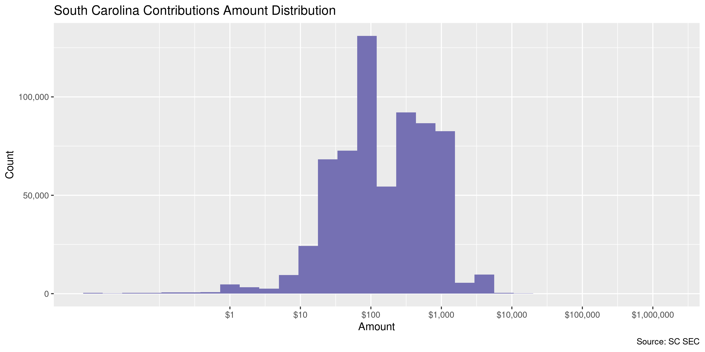
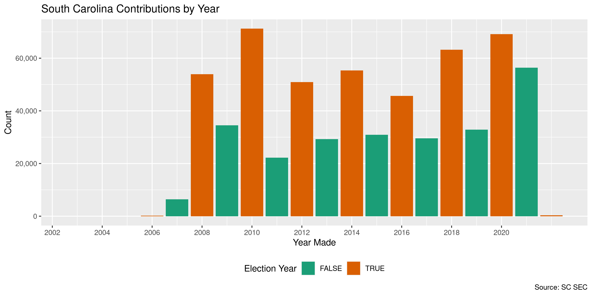
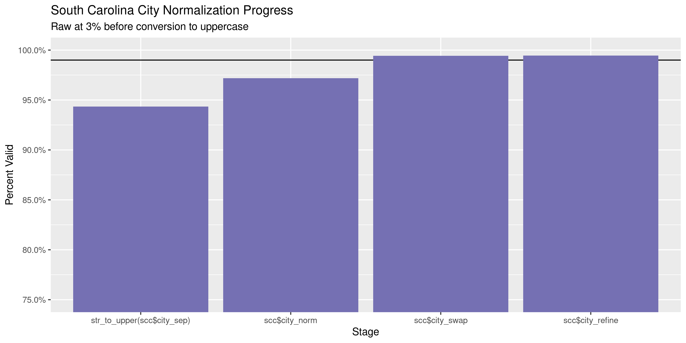
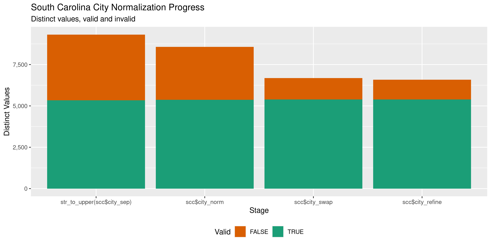

South Carolina Contributions
================
Kiernan Nicholls
Fri Feb 25 13:44:44 2022

-   [Project](#project)
-   [Objectives](#objectives)
-   [Packages](#packages)
-   [Source](#source)
-   [Download](#download)
-   [Read](#read)
-   [Explore](#explore)
    -   [Missing](#missing)
    -   [Duplicates](#duplicates)
    -   [Categorical](#categorical)
    -   [Amounts](#amounts)
    -   [Dates](#dates)
-   [Wrangle](#wrangle)
    -   [Address](#address)
    -   [ZIP](#zip)
    -   [State](#state)
    -   [City](#city)
-   [Conclude](#conclude)
-   [Export](#export)
-   [Upload](#upload)

<!-- Place comments regarding knitting here -->

## Project

The Accountability Project is an effort to cut across data silos and
give journalists, policy professionals, activists, and the public at
large a simple way to search across huge volumes of public data about
people and organizations.

Our goal is to standardize public data on a few key fields by thinking
of each dataset row as a transaction. For each transaction there should
be (at least) 3 variables:

1.  All **parties** to a transaction.
2.  The **date** of the transaction.
3.  The **amount** of money involved.

## Objectives

This document describes the process used to complete the following
objectives:

1.  How many records are in the database?
2.  Check for entirely duplicated records.
3.  Check ranges of continuous variables.
4.  Is there anything blank or missing?
5.  Check for consistency issues.
6.  Create a five-digit ZIP Code called `zip`.
7.  Create a `year` field from the transaction date.
8.  Make sure there is data on both parties to a transaction.

## Packages

The following packages are needed to collect, manipulate, visualize,
analyze, and communicate these results. The `pacman` package will
facilitate their installation and attachment.

``` r
if (!require("pacman")) {
  install.packages("pacman")
}
pacman::p_load(
  tidyverse, # data manipulation
  lubridate, # datetime strings
  jsonlite, # read json data
  gluedown, # printing markdown
  janitor, # clean data frames
  campfin, # custom irw tools
  aws.s3, # aws cloud storage
  refinr, # cluster & merge
  scales, # format strings
  knitr, # knit documents
  vroom, # fast reading
  rvest, # scrape html
  glue, # code strings
  here, # project paths
  httr, # http requests
  fs # local storage 
)
```

This diary was run using `campfin` version 1.0.8.9201.

``` r
packageVersion("campfin")
#> [1] '1.0.8.9201'
```

This document should be run as part of the `R_tap` project, which lives
as a sub-directory of the more general, language-agnostic
[`irworkshop/accountability_datacleaning`](https://github.com/irworkshop/accountability_datacleaning)
GitHub repository.

The `R_tap` project uses the [RStudio
projects](https://support.rstudio.com/hc/en-us/articles/200526207-Using-Projects)
feature and should be run as such. The project also uses the dynamic
`here::here()` tool for file paths relative to *your* machine.

``` r
# where does this document knit?
here::i_am("sc/contribs/docs/sc_contribs_diary.Rmd")
```

## Source

South Carolina contribution data can be obtained from the [State Ethics
Commission](https://ethics.sc.gov/), which operates a [search
portal](https://ethicsfiling.sc.gov/public/campaign-reports/contributions).

## Download

We can use the **Advance Search** functions of the portal to request all
contributions made between two dates. We will request all contributions
since the year 2000 and save the results to a local JSON file.

``` r
raw_dir <- dir_create(here("sc", "contribs", "data", "raw"))
raw_json <- path(raw_dir, "Contribution-Search-Results.xlsx")
```

``` r
if (!file_exists(raw_json)) {
  a <- POST(
    url = "https://ethicsfiling.sc.gov/api/Candidate/Contribution/Search/",
    encode = "json",
    write_disk(path = raw_json),
    progress(type = "down"),
    body = list(
      amountMax = 0,
      amountMin = 0,
      candidate = "",
      contributionDateMax = Sys.Date(), # thru today
      contributionDateMin = "2000-01-01T05:00:00.000Z",
      contributionDescription = "",
      contributorCity = "",
      contributorName = "",
      contributorOccupation = "",
      contributorZip = NULL,
      officeRun = ""
    )
  )
}
```

## Read

The JSON file can be read as a flat table with the `fromJSON()`
function.

``` r
scc <- as_tibble(fromJSON(raw_json))
scc <- clean_names(scc, case = "snake")
```

The columns must be parsed after the fact.

``` r
scc <- scc %>% 
  mutate(
    across(ends_with("date"), as_date),
    across(group, function(x) x == "Yes"),
    across(where(is_character), str_trim),
    across(where(is_character), na_if, "")
  )
```

## Explore

There are 652,039 rows of 13 columns. Each record represents a single
contribution made from an individual to a campaign.

``` r
glimpse(scc)
#> Rows: 652,039
#> Columns: 13
#> $ contribution_id        <int> 972, 2422, 974, 6636, 6638, 1257, 1259, 1025, 1027, 1043, 1045, 1062, 35162, 1064, 1079…
#> $ office_run_id          <int> 246, 246, 250, 251, 251, 253, 253, 275, 275, 284, 284, 298, 298, 265, 265, 265, 265, 26…
#> $ candidate_id           <int> 224, 224, 228, 229, 229, 231, 231, 253, 253, 262, 262, 276, 276, 243, 243, 243, 243, 24…
#> $ date                   <date> 2007-09-21, 2007-11-26, 2007-10-19, 2007-09-30, 2007-09-30, 2007-09-24, 2007-10-17, 20…
#> $ amount                 <dbl> 550.00, 300.00, 200.00, 25.00, 50.00, 50.00, 400.00, 300.00, 1000.00, 60.00, 50.00, 45.…
#> $ candidate_name         <chr> "Carron Smoak", "Carron Smoak", "Ryan Buckhannon", "Michael Loftus", "Michael Loftus", …
#> $ office_name            <chr> "Isle Of Palms City Council", "Isle Of Palms City Council", "Isle Of Palms City Council…
#> $ election_date          <date> 2007-10-16, 2007-10-16, 2007-11-06, 2007-11-06, 2007-11-06, 2007-11-06, 2007-11-06, 20…
#> $ contributor_name       <chr> "Carron Smoak", "Carron Smoak", "Colette Holmes", "Larry Staffard", "Michael Maughon", …
#> $ contributor_occupation <chr> "Health, Safety & Environmental Director", "Health, Safety & Environmental Director", "…
#> $ group                  <lgl> FALSE, FALSE, FALSE, FALSE, FALSE, TRUE, FALSE, TRUE, FALSE, FALSE, TRUE, FALSE, FALSE,…
#> $ contributor_address    <chr> "50 Pelican Reach  Isle of Palms, SC 29451", "50 Pelican Reach  Isle of Palms, SC 29451…
#> $ description            <chr> NA, NA, NA, NA, NA, NA, NA, NA, NA, NA, NA, NA, NA, NA, NA, NA, NA, NA, NA, NA, NA, NA,…
tail(scc)
#> # A tibble: 6 × 13
#>   contribution_id office_run_id candidate_id date       amount candidate_name office_name election_date contributor_name
#>             <int>         <int>        <int> <date>      <dbl> <chr>          <chr>       <date>        <chr>           
#> 1         1558395         59999        32993 2022-02-14    105 Candace Jenni… SC House o… 2022-03-08    Mark Taylor     
#> 2         1558365         59999        32993 2022-02-03     35 Candace Jenni… SC House o… 2022-03-08    George Karges   
#> 3         1558379         59999        32993 2022-02-07    500 Candace Jenni… SC House o… 2022-03-08    Thomas Fernandez
#> 4         1558380         59999        32993 2022-02-07     35 Candace Jenni… SC House o… 2022-03-08    Chris Herndon   
#> 5         1558517         70874        44236 2022-02-08    135 Darnell Hartw… Berkeley 5  2022-06-07    Mike Doty       
#> 6         1558518         70881        44259 2022-02-08     25 Robert McInty… Charleston… 2022-06-14    Yana McIntyre   
#> # … with 4 more variables: contributor_occupation <chr>, group <lgl>, contributor_address <chr>, description <chr>
```

### Missing

Columns vary in their degree of missing values.

``` r
col_stats(scc, count_na)
#> # A tibble: 13 × 4
#>    col                    class       n     p
#>    <chr>                  <chr>   <int> <dbl>
#>  1 contribution_id        <int>       0 0    
#>  2 office_run_id          <int>       0 0    
#>  3 candidate_id           <int>       0 0    
#>  4 date                   <date>      0 0    
#>  5 amount                 <dbl>       0 0    
#>  6 candidate_name         <chr>       0 0    
#>  7 office_name            <chr>       0 0    
#>  8 election_date          <date>      0 0    
#>  9 contributor_name       <chr>       0 0    
#> 10 contributor_occupation <chr>  137025 0.210
#> 11 group                  <lgl>       0 0    
#> 12 contributor_address    <chr>       0 0    
#> 13 description            <chr>  650110 0.997
```

We can flag any record missing a key variable needed to identify a
transaction.

``` r
key_vars <- c("date", "contributor_name", "amount", "candidate_name")
```

Only the `contributor_occupation` and `description` columns are missing
data.

### Duplicates

We can also flag any record completely duplicated across every column.

``` r
scc <- flag_dupes(scc, -contribution_id)
sum(scc$dupe_flag)
#> [1] 5568
mean(scc$dupe_flag)
#> [1] 0.008539367
```

``` r
scc %>% 
  filter(dupe_flag) %>% 
  select(all_of(key_vars)) %>% 
  arrange(date)
#> # A tibble: 5,568 × 4
#>    date       contributor_name       amount candidate_name 
#>    <date>     <chr>                   <dbl> <chr>          
#>  1 2007-08-30 unitemized 100 or less   568. Mark Richardson
#>  2 2007-08-30 unitemized 100 or less   568. Mark Richardson
#>  3 2007-09-26 Grover Seaton           1000  Blair Jennings 
#>  4 2007-09-26 Grover Seaton           1000  Blair Jennings 
#>  5 2007-09-29 Doris Brockington        100  Frank Wideman  
#>  6 2007-09-29 Doris Brockington        100  Frank Wideman  
#>  7 2007-10-17 Archie Patterson          25  E Cromartie II 
#>  8 2007-10-17 Archie Patterson          25  E Cromartie II 
#>  9 2007-10-29 James Means               25  E Cromartie II 
#> 10 2007-10-29 James Means               25  E Cromartie II 
#> # … with 5,558 more rows
```

### Categorical

``` r
col_stats(scc, n_distinct)
#> # A tibble: 14 × 4
#>    col                    class       n          p
#>    <chr>                  <chr>   <int>      <dbl>
#>  1 contribution_id        <int>  652039 1         
#>  2 office_run_id          <int>   13577 0.0208    
#>  3 candidate_id           <int>   10526 0.0161    
#>  4 date                   <date>   5482 0.00841   
#>  5 amount                 <dbl>   14483 0.0222    
#>  6 candidate_name         <chr>    8151 0.0125    
#>  7 office_name            <chr>    1151 0.00177   
#>  8 election_date          <date>    518 0.000794  
#>  9 contributor_name       <chr>  269741 0.414     
#> 10 contributor_occupation <chr>   37270 0.0572    
#> 11 group                  <lgl>       2 0.00000307
#> 12 contributor_address    <chr>  332271 0.510     
#> 13 description            <chr>     407 0.000624  
#> 14 dupe_flag              <lgl>       2 0.00000307
```

<!-- -->

### Amounts

``` r
# fix floating point precision
scc$amount <- round(scc$amount, digits = 2)
```

``` r
summary(scc$amount)
#>      Min.   1st Qu.    Median      Mean   3rd Qu.      Max. 
#>    -250.0      50.0     150.0     387.2     500.0 1127418.1
mean(scc$amount <= 0)
#> [1] 0.0006932101
```

These are the records with the minimum and maximum amounts.

``` r
glimpse(scc[c(which.max(scc$amount), which.min(scc$amount)), ])
#> Rows: 2
#> Columns: 14
#> $ contribution_id        <int> 1011202, 1495931
#> $ office_run_id          <int> 295, 20254
#> $ candidate_id           <int> 273, 14040
#> $ date                   <date> 2007-07-07, 2018-04-05
#> $ amount                 <dbl> 1127418, -250
#> $ candidate_name         <chr> "Frank Willis", "Jason Elliott"
#> $ office_name            <chr> "Governor", "SC House of Representatives District 22"
#> $ election_date          <date> 2006-06-13, 2018-06-12
#> $ contributor_name       <chr> "Frank Willis", "Matthew Cotner"
#> $ contributor_occupation <chr> "Contractor", "banker"
#> $ group                  <lgl> FALSE, FALSE
#> $ contributor_address    <chr> "1616 Hillside Ave  Florence, SC 29501", "7 Frontus Street  Greenville, SC 29605"
#> $ description            <chr> NA, NA
#> $ dupe_flag              <lgl> FALSE, FALSE
```

The distribution of amount values are typically log-normal.

<!-- -->

### Dates

We can add the calendar year from `date` with `lubridate::year()`

``` r
scc <- mutate(scc, year = year(date))
```

``` r
min(scc$date)
#> [1] "2003-08-31"
sum(scc$year < 2000)
#> [1] 0
max(scc$date)
#> [1] "2022-02-23"
sum(scc$date > today())
#> [1] 0
```

It’s common to see an increase in the number of contributins in
elections years.

<!-- -->

## Wrangle

To improve the searchability of the database, we will perform some
consistent, confident string normalization. For geographic variables
like city names and ZIP codes, the corresponding `campfin::normal_*()`
functions are tailor made to facilitate this process.

``` r
scc <- extract(
  data = scc,
  col = contributor_address,
  into = c("address_sep", "city_sep", "state_sep", "zip_sep"),
  regex = "^(.*)  (.*), (\\w{2}) (\\d+)$",
  remove = FALSE
)
```

### Address

For the street `addresss` variable, the `campfin::normal_address()`
function will force consistence case, remove punctuation, and abbreviate
official USPS suffixes.

``` r
addr_norm <- scc %>% 
  distinct(address_sep) %>% 
  mutate(
    address_norm = normal_address(
      address = address_sep,
      abbs = usps_street,
      na_rep = TRUE
    )
  )
```

``` r
addr_norm
#> # A tibble: 294,327 × 2
#>    address_sep          address_norm      
#>    <chr>                <chr>             
#>  1 50 Pelican Reach     50 PELICAN REACH  
#>  2 7 53rd Ave           7 53RD AVE        
#>  3 3302 Hartnett Blvd   3302 HARTNETT BLVD
#>  4 7 Wills Way          7 WILLS WAY       
#>  5 21 J.C. Long Blvd    21 JC LONG BLVD   
#>  6 6 Ensign Ct          6 ENSIGN CT       
#>  7 1415 M. L. King Blvd 1415 M L KING BLVD
#>  8 246 Forest Trail     246 FOREST TRL    
#>  9 237 Fulmer Rd        237 FULMER RD     
#> 10 3936 Sunset Blvd     3936 SUNSET BLVD  
#> # … with 294,317 more rows
```

``` r
scc <- scc %>% 
  left_join(addr_norm, by = "address_sep") %>% 
  select(-address_sep)
```

### ZIP

For ZIP codes, the `campfin::normal_zip()` function will attempt to
create valid *five* digit codes by removing the ZIP+4 suffix and
returning leading zeroes dropped by other programs like Microsoft Excel.

``` r
scc <- scc %>% 
  mutate(
    zip_norm = normal_zip(
      zip = zip_sep,
      na_rep = TRUE
    )
  )
```

``` r
progress_table(
  scc$zip_sep,
  scc$zip_norm,
  compare = valid_zip
)
#> # A tibble: 2 × 6
#>   stage        prop_in n_distinct prop_na n_out n_diff
#>   <chr>          <dbl>      <dbl>   <dbl> <dbl>  <dbl>
#> 1 scc$zip_sep    0.994      12227  0.0259  3731   1116
#> 2 scc$zip_norm   0.995      12181  0.0269  2982   1069
```

``` r
scc %>% 
  filter(zip_sep != zip_norm | !is.na(zip_sep) & is.na(zip_norm)) %>% 
  count(zip_sep, zip_norm, sort = TRUE)
#> # A tibble: 49 × 3
#>    zip_sep   zip_norm     n
#>    <chr>     <chr>    <int>
#>  1 00000     <NA>       633
#>  2 11111     <NA>        34
#>  3 99999     <NA>        22
#>  4 294076256 29407        3
#>  5 294646302 29464        3
#>  6 295788082 29578        3
#>  7 296271502 29627        3
#>  8 296428235 29642        3
#>  9 299125    29912        3
#> 10 334376604 33437        3
#> # … with 39 more rows
```

``` r
scc <- select(scc, -zip_sep)
```

### State

Valid two digit state abbreviations can be made using the
`campfin::normal_state()` function.

``` r
scc <- scc %>% 
  mutate(
    state_norm = normal_state(
      state = state_sep,
      abbreviate = TRUE,
      na_rep = TRUE,
      valid = valid_state
    )
  )
```

``` r
scc %>% 
  filter(state_sep != state_norm | !is.na(state_sep) & is.na(state_norm)) %>% 
  count(state_sep, state_norm, sort = TRUE)
#> # A tibble: 41 × 3
#>    state_sep state_norm     n
#>    <chr>     <chr>      <int>
#>  1 sc        SC           195
#>  2 Sc        SC            35
#>  3 Ga        GA            21
#>  4 So        <NA>          15
#>  5 Fl        FL             6
#>  6 sC        SC             6
#>  7 Co        CO             4
#>  8 Ma        MA             4
#>  9 nc        NC             4
#> 10 Or        OR             3
#> # … with 31 more rows
```

``` r
progress_table(
  scc$state_sep,
  scc$state_norm,
  compare = valid_state
)
#> # A tibble: 2 × 6
#>   stage          prop_in n_distinct prop_na n_out n_diff
#>   <chr>            <dbl>      <dbl>   <dbl> <dbl>  <dbl>
#> 1 scc$state_sep    0.999        101  0.0259   333     42
#> 2 scc$state_norm   1             60  0.0259     0      1
```

``` r
scc <- select(scc, -state_sep)
```

### City

Cities are the most difficult geographic variable to normalize, simply
due to the wide variety of valid cities and formats.

#### Normal

The `campfin::normal_city()` function is a good start, again converting
case, removing punctuation, but *expanding* USPS abbreviations. We can
also remove `invalid_city` values.

``` r
norm_city <- scc %>% 
  distinct(city_sep, state_norm, zip_norm) %>% 
  mutate(
    city_norm = normal_city(
      city = city_sep, 
      abbs = usps_city,
      states = c("SC", "DC", "SOUTH CAROLINA"),
      na = invalid_city,
      na_rep = TRUE
    )
  )
```

#### Swap

We can further improve normalization by comparing our normalized value
against the *expected* value for that record’s state abbreviation and
ZIP code. If the normalized value is either an abbreviation for or very
similar to the expected value, we can confidently swap those two.

``` r
norm_city <- norm_city %>% 
  rename(city_raw = city_sep) %>% 
  left_join(
    y = zipcodes,
    by = c(
      "state_norm" = "state",
      "zip_norm" = "zip"
    )
  ) %>% 
  rename(city_match = city) %>% 
  mutate(
    match_abb = is_abbrev(city_norm, city_match),
    match_dist = str_dist(city_norm, city_match),
    city_swap = if_else(
      condition = !is.na(match_dist) & (match_abb | match_dist == 1),
      true = city_match,
      false = city_norm
    )
  ) %>% 
  select(
    -city_match,
    -match_dist,
    -match_abb
  )
```

``` r
scc <- left_join(
  x = scc,
  y = norm_city,
  by = c(
    "city_sep" = "city_raw", 
    "state_norm", 
    "zip_norm"
  )
)
```

#### Refine

The [OpenRefine](https://openrefine.org/) algorithms can be used to
group similar strings and replace the less common versions with their
most common counterpart. This can greatly reduce inconsistency, but with
low confidence; we will only keep any refined strings that have a valid
city/state/zip combination.

``` r
good_refine <- scc %>% 
  mutate(
    city_refine = city_swap %>% 
      key_collision_merge() %>% 
      n_gram_merge(numgram = 1)
  ) %>% 
  filter(city_refine != city_swap) %>% 
  inner_join(
    y = zipcodes,
    by = c(
      "city_refine" = "city",
      "state_norm" = "state",
      "zip_norm" = "zip"
    )
  )
```

``` r
good_refine <- good_refine %>% 
  filter(str_detect(city_swap, "^(NORTH|SOUTH|EAST|WEST)", negate = TRUE))
```

    #> # A tibble: 107 × 5
    #>    state_norm zip_norm city_swap         city_refine             n
    #>    <chr>      <chr>    <chr>             <chr>               <int>
    #>  1 SC         29920    ST HELENAS ISLAND SAINT HELENA ISLAND    10
    #>  2 MD         20878    GAITEHURSBURG     GAITHERSBURG            4
    #>  3 SC         29205    COLUMBIACOLUMBIA  COLUMBIA                4
    #>  4 SC         29406    NO CHARLESTON     CHARLESTON              4
    #>  5 SC         29585    PAWSLEY ISLAND    PAWLEYS ISLAND          4
    #>  6 FL         32082    PONTE VERDE BEACH PONTE VEDRA BEACH       3
    #>  7 NY         11733    SETAUKET          EAST SETAUKET           3
    #>  8 SC         29365    LYNAM             LYMAN                   3
    #>  9 SC         29512    BENNESTVILLE      BENNETTSVILLE           3
    #> 10 CA         92698    ALISA VIE JO      ALISO VIEJO             2
    #> # … with 97 more rows

Then we can join the refined values back to the database.

``` r
scc <- scc %>% 
  left_join(good_refine, by = names(.)) %>% 
  mutate(city_refine = coalesce(city_refine, city_swap))
```

#### Progress

Our goal for normalization was to increase the proportion of city values
known to be valid and reduce the total distinct values by correcting
misspellings.

| stage                        | prop_in | n_distinct | prop_na | n_out | n_diff |
|:-----------------------------|--------:|-----------:|--------:|------:|-------:|
| `str_to_upper(scc$city_sep)` |   0.943 |       9313 |   0.026 | 35928 |   3974 |
| `scc$city_norm`              |   0.972 |       8567 |   0.028 | 17898 |   3195 |
| `scc$city_swap`              |   0.994 |       6682 |   0.028 |  3605 |   1288 |
| `scc$city_refine`            |   0.995 |       6587 |   0.028 |  3459 |   1196 |

You can see how the percentage of valid values increased with each
stage.

<!-- -->

More importantly, the number of distinct values decreased each stage. We
were able to confidently change many distinct invalid values to their
valid equivalent.

<!-- -->

Before exporting, we can remove the intermediary normalization columns
and rename all added variables with the `_clean` suffix.

``` r
scc <- scc %>% 
  select(
    -city_norm,
    -city_swap,
    city_clean = city_refine
  ) %>% 
  rename_all(~str_replace(., "_norm", "_clean")) %>% 
  rename_all(~str_remove(., "_raw")) %>% 
  relocate(address_clean, city_clean, state_clean, .before = zip_clean)
```

## Conclude

``` r
glimpse(sample_n(scc, 1000))
#> Rows: 1,000
#> Columns: 20
#> $ contribution_id        <int> 250769, 1358390, 1334336, 1395796, 243260, 1339746, 560026, 534650, 705833, 570551, 133…
#> $ office_run_id          <int> 8210, 47899, 45036, 31487, 7001, 49433, 15929, 15707, 17945, 9247, 45036, 265, 16767, 4…
#> $ candidate_id           <int> 5659, 31124, 27720, 15553, 6429, 32624, 12227, 12084, 13429, 5890, 27720, 243, 12710, 2…
#> $ date                   <date> 2010-09-09, 2020-08-14, 2020-07-14, 2017-09-05, 2010-08-16, 2021-04-26, 2014-08-18, 20…
#> $ amount                 <dbl> 500.00, 1000.00, 5.00, 250.00, 250.00, 12.50, 100.00, 250.00, 500.00, 40.00, 100.00, 25…
#> $ candidate_name         <chr> "Vincent Sheheen", "Thomas Brittain Jr", "Sam Skardon", "Donald Branham", "James Byars …
#> $ office_name            <chr> "Governor", "SC House of Representatives District 107", "SC Senate District 41", "Kersh…
#> $ election_date          <date> 2010-11-02, 2020-11-03, 2020-11-03, 2018-06-12, 2010-06-08, 2022-06-07, 2014-09-30, 20…
#> $ contributor_name       <chr> "Carolyn Bishop-McLeod", "South Carolina Association For Justice PAC", "Nina Hoffman", …
#> $ contributor_occupation <chr> "Retired", NA, "attorney", "Business owner", "Insurance Agent", "Not Employed", "PHYSIC…
#> $ group                  <lgl> FALSE, TRUE, FALSE, FALSE, FALSE, FALSE, FALSE, FALSE, FALSE, FALSE, FALSE, FALSE, FALS…
#> $ contributor_address    <chr> "2970 Bruce Circle Ext  Sumter, SC 29154", "PO Box 11495  Columbia, SC 29211", "5 Lavin…
#> $ city_sep               <chr> "Sumter", "Columbia", "Charleston", "Camden", "Summerville", "Pittsburg", "WINNSBORO", …
#> $ description            <chr> NA, NA, NA, NA, NA, NA, NA, NA, NA, NA, NA, NA, NA, NA, NA, NA, NA, NA, NA, NA, NA, NA,…
#> $ dupe_flag              <lgl> FALSE, FALSE, FALSE, FALSE, FALSE, FALSE, FALSE, FALSE, FALSE, FALSE, FALSE, FALSE, FAL…
#> $ year                   <dbl> 2010, 2020, 2020, 2017, 2010, 2021, 2014, 2014, 2016, 2014, 2020, 2008, 2015, 2019, 202…
#> $ address_clean          <chr> "2970 BRUCE CIRCLE EXT", "PO BOX 11495", "5 LAVINGTON RD", "816 BROAD ST", "1661 N MAIN…
#> $ city_clean             <chr> "SUMTER", "COLUMBIA", "CHARLESTON", "CAMDEN", "SUMMERVILLE", "PITTSBURG", "WINNSBORO", …
#> $ state_clean            <chr> "SC", "SC", "SC", "SC", "SC", "CA", "SC", "SC", "SC", "SC", "SC", "SC", "SC", "SC", "SC…
#> $ zip_clean              <chr> "29154", "29211", "29407", "29020", "29483", "94565", "29180", "29180", "29936", "29410…
```

1.  There are 652,039 records in the database.
2.  There are 5,568 duplicate records in the database.
3.  The range and distribution of `amount` and `date` seem reasonable.
4.  There are 0 records missing key variables.
5.  Consistency in geographic data has been improved with
    `campfin::normal_*()`.
6.  The 4-digit `year` variable has been created with
    `lubridate::year()`.

## Export

Now the file can be saved on disk for upload to the Accountability
server. We will name the object using a date range of the records
included.

``` r
min_dt <- str_remove_all(min(scc$date), "-")
max_dt <- str_remove_all(max(scc$date), "-")
csv_ts <- paste(min_dt, max_dt, sep = "-")
```

``` r
clean_dir <- dir_create(here("sc", "contribs", "data", "clean"))
clean_csv <- path(clean_dir, glue("sc_contribs_{csv_ts}.csv"))
clean_rds <- path_ext_set(clean_csv, "rds")
basename(clean_csv)
#> [1] "sc_contribs_20030831-20220223.csv"
```

``` r
write_csv(scc, clean_csv, na = "")
write_rds(scc, clean_rds, compress = "xz")
(clean_size <- file_size(clean_csv))
#> 133M
```

## Upload

We can use the `aws.s3::put_object()` to upload the text file to the IRW
server.

``` r
aws_key <- path("csv", basename(clean_csv))
if (!object_exists(aws_key, "publicaccountability")) {
  put_object(
    file = clean_csv,
    object = aws_key, 
    bucket = "publicaccountability",
    acl = "public-read",
    show_progress = TRUE,
    multipart = TRUE
  )
}
aws_head <- head_object(aws_key, "publicaccountability")
(aws_size <- as_fs_bytes(attr(aws_head, "content-length")))
unname(aws_size == clean_size)
```
