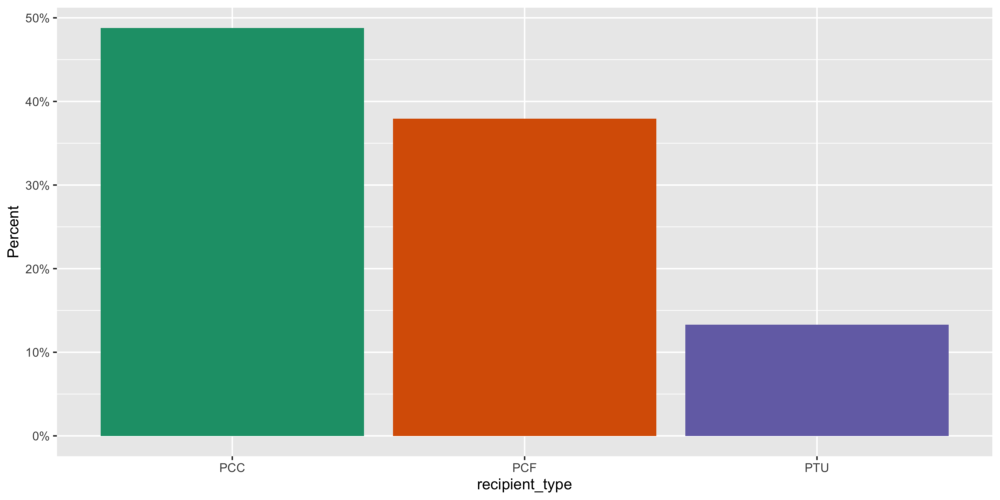
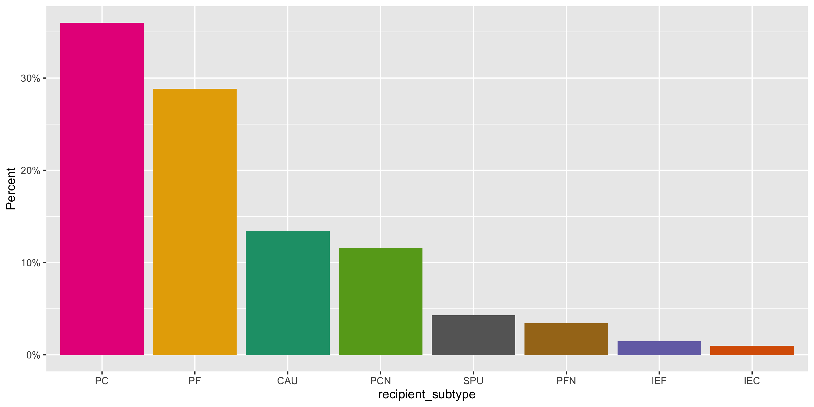
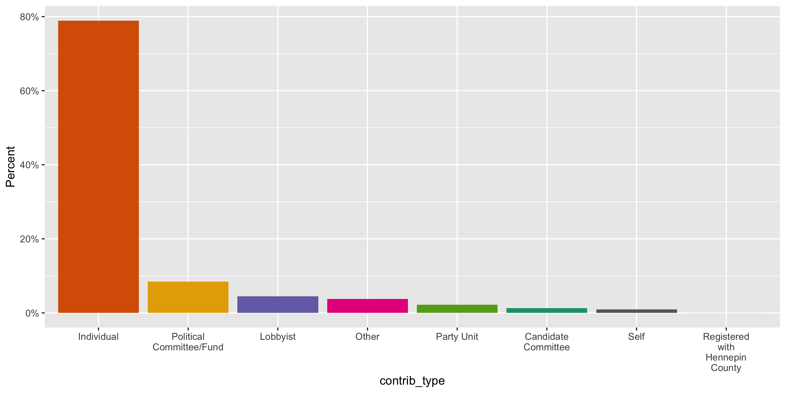
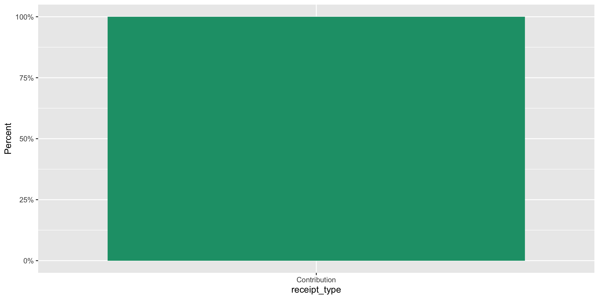
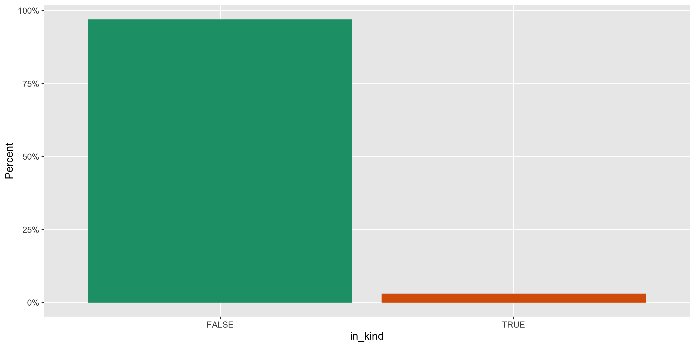
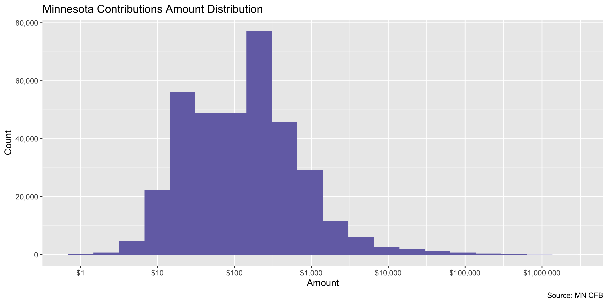
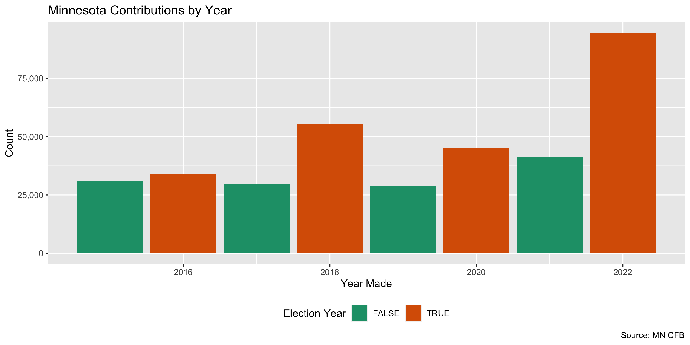

Minnesota Contributions
================
Kiernan Nicholls & Aarushi Sahejpal
Sun Feb 26 16:23:19 2023

- <a href="#project" id="toc-project">Project</a>
- <a href="#objectives" id="toc-objectives">Objectives</a>
- <a href="#packages" id="toc-packages">Packages</a>
- <a href="#data" id="toc-data">Data</a>
- <a href="#download" id="toc-download">Download</a>
- <a href="#read" id="toc-read">Read</a>
- <a href="#explore" id="toc-explore">Explore</a>
  - <a href="#missing" id="toc-missing">Missing</a>
  - <a href="#duplicates" id="toc-duplicates">Duplicates</a>
  - <a href="#categorical" id="toc-categorical">Categorical</a>
  - <a href="#amounts" id="toc-amounts">Amounts</a>
  - <a href="#dates" id="toc-dates">Dates</a>
- <a href="#wrangle" id="toc-wrangle">Wrangle</a>
- <a href="#conclude" id="toc-conclude">Conclude</a>
- <a href="#export" id="toc-export">Export</a>
- <a href="#upload" id="toc-upload">Upload</a>
- <a href="#dictionary" id="toc-dictionary">Dictionary</a>

<!-- Place comments regarding knitting here -->

## Project

The Accountability Project is an effort to cut across data silos and
give journalists, policy professionals, activists, and the public at
large a simple way to search across huge volumes of public data about
people and organizations.

Our goal is to standardizing public data on a few key fields by thinking
of each dataset row as a transaction. For each transaction there should
be (at least) 3 variables:

1.  All **parties** to a transaction.
2.  The **date** of the transaction.
3.  The **amount** of money involved.

## Objectives

This document describes the process used to complete the following
objectives:

1.  How many records are in the database?
2.  Check for entirely duplicated records.
3.  Check ranges of continuous variables.
4.  Is there anything blank or missing?
5.  Check for consistency issues.
6.  Create a five-digit ZIP Code called `zip`.
7.  Create a `year` field from the transaction date.
8.  Make sure there is data on both parties to a transaction.

## Packages

The following packages are needed to collect, manipulate, visualize,
analyze, and communicate these results. The `pacman` package will
facilitate their installation and attachment.

``` r
if (!require("pacman")) {
  install.packages("pacman")
}
pacman::p_load(
  tidyverse, # data manipulation
  lubridate, # datetime strings
  gluedown, # printing markdown
  janitor, # clean data frames
  campfin, # custom irw tools
  aws.s3, # aws cloud storage
  refinr, # cluster & merge
  scales, # format strings
  knitr, # knit documents
  vroom, # fast reading
  rvest, # scrape html
  glue, # code strings
  here, # project paths
  httr, # http requests
  fs # local storage 
)
```

This document should be run as part of the `R_campfin` project, which
lives as a sub-directory of the more general, language-agnostic
[`irworkshop/accountability_datacleaning`](https://github.com/irworkshop/accountability_datacleaning)
GitHub repository.

The `R_campfin` project uses the [RStudio
projects](https://support.rstudio.com/hc/en-us/articles/200526207-Using-Projects)
feature and should be run as such. The project also uses the dynamic
`here::here()` tool for file paths relative to *your* machine.

``` r
# where does this document knit?
here::i_am("mn/contribs/docs/mn_contribs_diary.Rmd")
```

## Data

The data is obtained from the [Minnesota Campaign Finance Board
(CFB)](https://cfb.mn.gov/).

> The Campaign Finance and Public Disclosure Board was established by
> the state legislature in 1974 and is charged with the administration
> of Minnesota Statutes, Chapter 10A, the Campaign Finance and Public
> Disclosure Act, as well as portions of Chapter 211B, the Fair Campaign
> Practices act.

> The Board’s four major programs are campaign finance registration and
> disclosure, public subsidy administration, lobbyist registration and
> disclosure, and economic interest disclosure by public officials. The
> Board has six members, appointed by the Governor on a bi-partisan
> basis for staggered four-year terms. The appointments must be
> confirmed by a three-fifths vote of the members of each house of the
> legislature.

The CFB provides [direct data
download](https://cfb.mn.gov/reports-and-data/self-help/data-downloads/campaign-finance/)
for all campaign finance data.

## Download

``` r
cfb_url <- str_c(
  "https://cfb.mn.gov/",
  "reports-and-data/self-help/data-downloads/campaign-finance"
)
```

``` r
mn_head <- HEAD(cfb_url, query = list(download = -2113865252))
mn_file <- str_extract(
  string = headers(mn_head)[["content-disposition"]], 
  pattern = "(?<=\\=\")(.*)(?=\")"
)
```

``` r
raw_dir <- dir_create(here("mn", "contribs", "data", "raw"))
raw_csv <- path(raw_dir, mn_file)
```

``` r
if (!file_exists(raw_csv)) {
  GET(
    "https://cfb.mn.gov/reports-and-data/self-help/data-downloads/campaign-finance/",
    query = list(download = -2113865252),
    write_disk(raw_csv, overwrite = FALSE),
    progress(type = "down")
  )
}
```

## Read

``` r
mnc <- read_delim(
  file = raw_csv,
  delim = ",",
  escape_backslash = FALSE,
  escape_double = TRUE,
  col_types = cols(
    .default = col_character(),
    `Recipient reg num` = col_integer(),
    `Amount` = col_double(),
    `Receipt date` = col_date_mdy(),
    `Year` = col_integer(),
    `Contributor ID` = col_integer(),
    `Contrib Reg Num` = col_integer(),
    `Contrib employer ID` = col_integer()
  )
)
```

``` r
mnc <- mnc %>% 
  clean_names(case = "snake") %>% 
  rename(date = receipt_date) %>% 
  mutate(in_kind = (in_kind == "Yes")) %>% 
  remove_empty("cols")
```

## Explore

There are 359,673 rows of 15 columns. Each record represents a single
contribution made to a political committee.

``` r
glimpse(mnc)
#> Rows: 359,673
#> Columns: 15
#> $ recipient_reg_num     <int> 30635, 17439, 17439, 17931, 18043, 18043, 15638, 15638, 15638, 17966, 17966, 17904, 1704…
#> $ recipient             <chr> "Housing First", "McKendry, Laurie Senate Committee", "McKendry, Laurie Senate Committee…
#> $ recipient_type        <chr> "PCF", "PCC", "PCC", "PCC", "PCC", "PCC", "PCC", "PCC", "PCC", "PCC", "PCC", "PCC", "PCC…
#> $ recipient_subtype     <chr> "IEF", NA, NA, NA, NA, NA, NA, NA, NA, NA, NA, NA, NA, NA, "PC", "PC", "PC", "PC", "PC",…
#> $ amount                <dbl> 10500.00, 100.00, 1000.00, 300.00, 1000.00, 1000.00, 250.00, 250.00, 500.00, 124.27, 172…
#> $ date                  <date> 2015-05-08, 2015-01-20, 2015-01-02, 2016-03-01, 2016-07-14, 2016-07-28, 2016-01-28, 201…
#> $ year                  <int> 2015, 2015, 2015, 2016, 2016, 2016, 2016, 2015, 2015, 2016, 2016, 2016, 2016, 2015, 2016…
#> $ contributor           <chr> "Builders Association of the Twin Cities", "Burns, Sally M", "Friends of DFL Women", "Mo…
#> $ contrib_reg_num       <int> NA, NA, 40295, NA, NA, 30236, NA, 40248, 30013, NA, NA, NA, 40550, NA, NA, 30617, NA, 30…
#> $ contrib_type          <chr> "Other", "Individual", "Political Committee/Fund", "Individual", "Individual", "Politica…
#> $ receipt_type          <chr> "Contribution", "Contribution", "Contribution", "Contribution", "Contribution", "Contrib…
#> $ in_kind               <lgl> FALSE, FALSE, FALSE, FALSE, FALSE, FALSE, FALSE, FALSE, FALSE, FALSE, FALSE, FALSE, FALS…
#> $ in_kind_descr         <chr> NA, NA, NA, NA, NA, NA, NA, NA, NA, NA, NA, NA, NA, NA, NA, NA, NA, NA, NA, NA, NA, NA, …
#> $ contrib_zip           <chr> "55113", "55347", "55417", "55406", "55901", "55904", "55127", "55128", "55414", "55077"…
#> $ contrib_employer_name <chr> NA, "Self employed retired", NA, "Comfort Home Health Care", "Psychologist", NA, "Forest…
tail(mnc)
#> # A tibble: 6 × 15
#>   recipient_re…¹ recip…² recip…³ recip…⁴ amount date        year contr…⁵ contr…⁶ contr…⁷ recei…⁸ in_kind in_ki…⁹ contr…˟
#>            <int> <chr>   <chr>   <chr>    <dbl> <date>     <int> <chr>     <int> <chr>   <chr>   <lgl>   <chr>   <chr>  
#> 1          18863 Zupanc… PCC     <NA>       250 2022-06-27  2022 Saeger…      NA Indivi… Contri… FALSE   <NA>    53097  
#> 2          18863 Zupanc… PCC     <NA>      1000 2022-10-28  2022 Schlot…      NA Indivi… Contri… FALSE   <NA>    55792  
#> 3          18863 Zupanc… PCC     <NA>      1000 2022-10-12  2022 St Lou…   20327 Party … Contri… FALSE   <NA>    55792  
#> 4          18863 Zupanc… PCC     <NA>        50 2022-07-10  2022 Weckma…      NA Indivi… Contri… TRUE    SAFD    55731  
#> 5          18863 Zupanc… PCC     <NA>       460 2022-07-23  2022 Wognum…      NA Indivi… Contri… FALSE   <NA>    55731  
#> 6          18863 Zupanc… PCC     <NA>       100 2022-09-26  2022 Zupanc…      NA Indivi… Contri… FALSE   <NA>    55790  
#> # … with 1 more variable: contrib_employer_name <chr>, and abbreviated variable names ¹​recipient_reg_num, ²​recipient,
#> #   ³​recipient_type, ⁴​recipient_subtype, ⁵​contributor, ⁶​contrib_reg_num, ⁷​contrib_type, ⁸​receipt_type, ⁹​in_kind_descr,
#> #   ˟​contrib_zip
```

### Missing

Columns vary in their degree of missing values.

``` r
col_stats(mnc, count_na)
#> # A tibble: 15 × 4
#>    col                   class       n        p
#>    <chr>                 <chr>   <int>    <dbl>
#>  1 recipient_reg_num     <int>       0 0       
#>  2 recipient             <chr>     473 0.00132 
#>  3 recipient_type        <chr>       0 0       
#>  4 recipient_subtype     <chr>  193926 0.539   
#>  5 amount                <dbl>       0 0       
#>  6 date                  <date>      0 0       
#>  7 year                  <int>       0 0       
#>  8 contributor           <chr>       0 0       
#>  9 contrib_reg_num       <int>  299975 0.834   
#> 10 contrib_type          <chr>      56 0.000156
#> 11 receipt_type          <chr>       0 0       
#> 12 in_kind               <lgl>       0 0       
#> 13 in_kind_descr         <chr>  349060 0.970   
#> 14 contrib_zip           <chr>    3855 0.0107  
#> 15 contrib_employer_name <chr>   59721 0.166
```

We can flag any record missing a key variable needed to identify a
transaction.

``` r
key_vars <- c("date", "contributor", "amount", "recipient")
mnc <- flag_na(mnc, all_of(key_vars))
sum(mnc$na_flag)
#> [1] 473
```

``` r
mnc %>% 
  filter(na_flag) %>% 
  select(all_of(key_vars))
#> # A tibble: 473 × 4
#>    date       contributor                           amount recipient
#>    <date>     <chr>                                  <dbl> <chr>    
#>  1 2016-10-18 14th Senate District RPM                 200 <NA>     
#>  2 2018-06-12 14th Senate District RPM                1000 <NA>     
#>  3 2020-09-20 14th Senate District RPM                 400 <NA>     
#>  4 2018-09-06 Bechtold, Gary                           250 <NA>     
#>  5 2017-11-03 Bernick, Jason                           250 <NA>     
#>  6 2018-09-13 Blonigen, Donald                         250 <NA>     
#>  7 2017-11-01 CAR Committee of Automotive Retailers    250 <NA>     
#>  8 2020-06-22 Chikeles, Matthew                       1000 <NA>     
#>  9 2016-10-24 Cragle, Stephen P                        250 <NA>     
#> 10 2016-10-24 Donnay, Walt                             250 <NA>     
#> # … with 463 more rows
```

### Duplicates

We can also flag any record completely duplicated across every column.

``` r
mnc <- flag_dupes(mnc, everything())
percent(mean(mnc$dupe_flag), 0.1)
#> [1] "1.9%"
```

``` r
mnc %>% 
  filter(dupe_flag) %>% 
  select(all_of(key_vars)) %>% 
  arrange(date)
#> # A tibble: 6,722 × 4
#>    date       contributor      amount recipient                              
#>    <date>     <chr>             <dbl> <chr>                                  
#>  1 2015-01-05 Rice, Brian F       100 Hayden, Jeffrey (Jeff) Senate Committee
#>  2 2015-01-05 Rice, Brian F       100 Hayden, Jeffrey (Jeff) Senate Committee
#>  3 2015-01-20 Katyal, Maire       100 Otto, Rebecca State Aud Committee      
#>  4 2015-01-20 Katyal, Maire       100 Otto, Rebecca State Aud Committee      
#>  5 2015-01-24 Pederson, John C     40 14th Senate District RPM               
#>  6 2015-01-24 Pederson, John C     40 14th Senate District RPM               
#>  7 2015-01-24 Frey, Kristi         50 Gruenhagen, Glenn H House Committee    
#>  8 2015-01-24 Frey, Kristi         50 Gruenhagen, Glenn H House Committee    
#>  9 2015-01-24 Frey, Robert         50 Gruenhagen, Glenn H House Committee    
#> 10 2015-01-24 Frey, Robert         50 Gruenhagen, Glenn H House Committee    
#> # … with 6,712 more rows
```

### Categorical

``` r
col_stats(mnc, n_distinct)
#> # A tibble: 17 × 4
#>    col                   class      n          p
#>    <chr>                 <chr>  <int>      <dbl>
#>  1 recipient_reg_num     <int>   2125 0.00591   
#>  2 recipient             <chr>   2095 0.00582   
#>  3 recipient_type        <chr>      3 0.00000834
#>  4 recipient_subtype     <chr>     10 0.0000278 
#>  5 amount                <dbl>  14365 0.0399    
#>  6 date                  <date>  2922 0.00812   
#>  7 year                  <int>      8 0.0000222 
#>  8 contributor           <chr>  59678 0.166     
#>  9 contrib_reg_num       <int>   2309 0.00642   
#> 10 contrib_type          <chr>     10 0.0000278 
#> 11 receipt_type          <chr>      1 0.00000278
#> 12 in_kind               <lgl>      2 0.00000556
#> 13 in_kind_descr         <chr>   6318 0.0176    
#> 14 contrib_zip           <chr>   5258 0.0146    
#> 15 contrib_employer_name <chr>  30640 0.0852    
#> 16 na_flag               <lgl>      2 0.00000556
#> 17 dupe_flag             <lgl>      2 0.00000556
```

<!-- --><!-- --><!-- --><!-- --><!-- -->

### Amounts

``` r
summary(mnc$amount)
#>      Min.   1st Qu.    Median      Mean   3rd Qu.      Max. 
#>       0.0      37.5     133.3    1501.5     500.0 2000000.0
mean(mnc$amount <= 0)
#> [1] 0.0001946212
```

These are the records with the minimum and maximum amounts.

``` r
glimpse(mnc[c(which.max(mnc$amount), which.min(mnc$amount)), ])
#> Rows: 2
#> Columns: 17
#> $ recipient_reg_num     <int> 41174, 18378
#> $ recipient             <chr> "DGA Victory Fund", "Lessard, Robert Atty Gen Committee"
#> $ recipient_type        <chr> "PCF", "PCC"
#> $ recipient_subtype     <chr> "PC", NA
#> $ amount                <dbl> 2e+06, 0e+00
#> $ date                  <date> 2022-07-15, 2018-07-26
#> $ year                  <int> 2022, 2018
#> $ contributor           <chr> "Pritzker, Jay", ", "
#> $ contrib_reg_num       <int> NA, NA
#> $ contrib_type          <chr> "Individual", "Individual"
#> $ receipt_type          <chr> "Contribution", "Contribution"
#> $ in_kind               <lgl> FALSE, TRUE
#> $ in_kind_descr         <chr> NA, NA
#> $ contrib_zip           <chr> "60606", NA
#> $ contrib_employer_name <chr> "State of Illinois", NA
#> $ na_flag               <lgl> FALSE, FALSE
#> $ dupe_flag             <lgl> FALSE, FALSE
```

<!-- -->

### Dates

Since the `year` variable already exists, there is no need to create
one. Any of these which do not match seems to fall near beginning of the
year.

``` r
mean(mnc$year == year(mnc$date))
#> [1] 0.9991047
mnc %>% 
  filter(year != year(date)) %>% 
  count(month = month(date))
#> # A tibble: 5 × 2
#>   month     n
#>   <dbl> <int>
#> 1     1   200
#> 2     2    97
#> 3     3    21
#> 4     4     2
#> 5    12     2
```

No further cleaning of the date variable is needed.

``` r
min(mnc$date)
#> [1] "2015-01-01"
sum(mnc$year < 2000)
#> [1] 0
max(mnc$date)
#> [1] "2022-12-31"
sum(mnc$date > today())
#> [1] 0
```

<!-- -->

## Wrangle

The database does *not* contain the full range of geographic variables
we’d expect. There is only a ZIP code. We can use this `zip` variable to
add the `city` and `state` variables, but not an `address`. These
variables will *not* be accurate to the data provided by the state.

``` r
prop_in(mnc$contrib_zip, valid_zip)
#> [1] 0.9989489
```

``` r
pre_names <- names(mnc)
mnc <- mnc %>% 
  left_join(zipcodes, by = c("contrib_zip" = "zip")) %>% 
  rename_with(
    .fn = ~glue("contrib_{.}_match"),
    .cols = setdiff(names(.), pre_names)
  )
```

## Conclude

``` r
glimpse(sample_n(mnc, 50))
#> Rows: 50
#> Columns: 19
#> $ recipient_reg_num     <int> 18707, 18379, 70001, 17021, 30331, 15719, 20011, 18464, 16881, 30331, 40877, 40714, 2001…
#> $ recipient             <chr> "Freeberg, Sheigh Senate Committee", "Yang, Cindy House Committee", "MN Chamber of Comme…
#> $ recipient_type        <chr> "PCC", "PCC", "PCF", "PCC", "PCF", "PCC", "PTU", "PCC", "PCC", "PCF", "PCF", "PCF", "PTU…
#> $ recipient_subtype     <chr> NA, NA, "PCN", NA, "PF", NA, "CAU", NA, NA, "PF", "PC", "PC", "CAU", "CAU", NA, NA, NA, …
#> $ amount                <dbl> 25.00, 1000.00, 20.00, 1000.00, 50.00, 500.00, 500.00, 250.00, 1000.00, 35.00, 41.32, 21…
#> $ date                  <date> 2022-02-06, 2018-07-25, 2021-09-02, 2022-08-04, 2015-08-24, 2022-09-29, 2020-09-25, 202…
#> $ year                  <int> 2022, 2018, 2021, 2022, 2015, 2022, 2020, 2020, 2015, 2015, 2021, 2016, 2020, 2016, 2015…
#> $ contributor           <chr> "Cragg, Lucas", "Yang, Se", "Effertz, Joseph", "Senjem David H Senate Dist 25 Committee"…
#> $ contrib_reg_num       <int> NA, NA, NA, 15705, NA, NA, NA, NA, NA, NA, NA, NA, 30137, 7419, NA, NA, NA, NA, 70026, N…
#> $ contrib_type          <chr> "Individual", "Individual", "Individual", "Candidate Committee", "Individual", "Individu…
#> $ receipt_type          <chr> "Contribution", "Contribution", "Contribution", "Contribution", "Contribution", "Contrib…
#> $ in_kind               <lgl> FALSE, FALSE, FALSE, FALSE, FALSE, FALSE, FALSE, FALSE, FALSE, FALSE, FALSE, FALSE, FALS…
#> $ in_kind_descr         <chr> NA, NA, NA, NA, NA, NA, NA, NA, NA, NA, NA, NA, NA, NA, NA, NA, NA, NA, NA, NA, NA, NA, …
#> $ contrib_zip           <chr> "55104", "92582", "55352", "55903", "44301", "55906", "55104", "56063", "55391", "27574"…
#> $ contrib_employer_name <chr> "Teplinsky Law Group", "Self employed Retired", "Black Forest Ltd.", NA, "IBEW Fourth Di…
#> $ na_flag               <lgl> FALSE, FALSE, FALSE, FALSE, FALSE, FALSE, FALSE, FALSE, FALSE, FALSE, FALSE, FALSE, FALS…
#> $ dupe_flag             <lgl> FALSE, FALSE, FALSE, FALSE, FALSE, FALSE, FALSE, FALSE, FALSE, FALSE, FALSE, FALSE, FALS…
#> $ contrib_city_match    <chr> "SAINT PAUL", "SAN JACINTO", "JORDAN", "ROCHESTER", "AKRON", "ROCHESTER", "SAINT PAUL", …
#> $ contrib_state_match   <chr> "MN", "CA", "MN", "MN", "OH", "MN", "MN", "MN", "MN", "NC", "TX", "MN", "MN", "MN", NA, …
```

1.  There are 359,673 records in the database.
2.  There are 6,722 duplicate records in the database.
3.  The range and distribution of `amount` and `date` seem reasonable.
4.  There are 473 records missing key variables.
5.  Consistency in geographic data has been improved with
    `campfin::normal_*()`.
6.  The 4-digit `year` variable has been created with
    `lubridate::year()`.

## Export

Now the file can be saved on disk for upload to the Accountability
server.

``` r
clean_dir <- dir_create(here("mn", "contribs", "data", "clean"))
clean_path <- path(clean_dir, "mn_contribs_clean.csv")
write_csv(mnc, clean_path, na = "")
(clean_size <- file_size(clean_path))
#> 56.1M
non_ascii(clean_path)
#> # A tibble: 80 × 2
#>      row line                                                                                                           
#>    <int> <chr>                                                                                                          
#>  1  7594 "18127,\"Coleman, Christopher B Gov Committee\",PCC,,1000,2017-12-27,2017,\"Quinn, Peter\",,Individual,Contrib…
#>  2 28173 "20417,19th Senate District DFL (Old),PTU,,1065,2019-04-28,2019,\"Johnson, Ruth E\",,Individual,Contribution,T…
#>  3 28536 "20417,19th Senate District DFL (Old),PTU,,901,2019-04-28,2019,\"Forster, Judith\",,Individual,Contribution,TR…
#>  4 46904 "18385,\"Bierman, Robert House Committee\",PCC,,400,2018-09-07,2018,\"Vanselus, Fred W\",,Individual,Contribut…
#>  5 50817 "30138,CARE / PAC,PCF,PFN,50,2022-12-17,2022,\"Evans, LaDonna\",,Individual,Contribution,FALSE,,56143,Good Sam…
#>  6 50977 "30138,CARE / PAC,PCF,PFN,50,2022-08-10,2022,\"Ward, Casey\",,Individual,Contribution,FALSE,,56515,Good Samari…
#>  7 52248 "30138,CARE / PAC,PCF,PFN,50,2022-10-17,2022,\"Evans, LaDonna\",,Individual,Contribution,FALSE,,56143,Good Sam…
#>  8 52408 "30138,CARE / PAC,PCF,PFN,50,2022-01-10,2022,\"Ward, Casey\",,Individual,Contribution,FALSE,,56515,Good Samari…
#>  9 52409 "30138,CARE / PAC,PCF,PFN,50,2022-02-10,2022,\"Ward, Casey\",,Individual,Contribution,FALSE,,56515,Good Samari…
#> 10 53123 "30138,CARE / PAC,PCF,PFN,50,2022-09-10,2022,\"Ward, Casey\",,Individual,Contribution,FALSE,,56515,Good Samari…
#> # … with 70 more rows
```

## Upload

We can use the `aws.s3::put_object()` to upload the text file to the IRW
server.

``` r
aws_path <- path("csv", basename(clean_path))
if (!object_exists(aws_path, "publicaccountability")) {
  put_object(
    file = clean_path,
    object = aws_path, 
    bucket = "publicaccountability",
    acl = "public-read",
    show_progress = TRUE,
    multipart = TRUE
  )
}
aws_head <- head_object(aws_path, "publicaccountability")
(aws_size <- as_fs_bytes(attr(aws_head, "content-length")))
unname(aws_size == clean_size)
```

## Dictionary

The following table describes the variables in our final exported file:

<!-- {r dict_make, echo=FALSE}
dict_raw <- tibble(
  var = md_code(names(mnc)),
  type = md_code(map_chr(mnc, typeof)),
  def = c(
    "Recipient ID",
    "**Recipient name**",
    "Recipeint type",
    "Recipient sub-type",
    "**Amount** of contribution",
    "**Date** contribution made",
    "**Year** contribution made",
    "**Contributor name**",
    "Contributor ID",
    "Contributor registration",
    "Contributor type",
    "Receipt type",
    "Flag indicating in-kind contribution",
    "Description of in-kind contribution",
    "Contributor ZIP code",
    "Contributor employer name",
    "Flag indicating missing value",
    "Flag indicating duplicate record",
    "City name from _matched_ ZIP code",
    "State abbreviation from _matched_ ZIP code"
  )
)


{r dict_md, echo=FALSE}
(dict_md <- kable(
  x = dict_raw,
  format = "markdown",
  col.names = c("Column", "Type", "Definition")
))
-->
