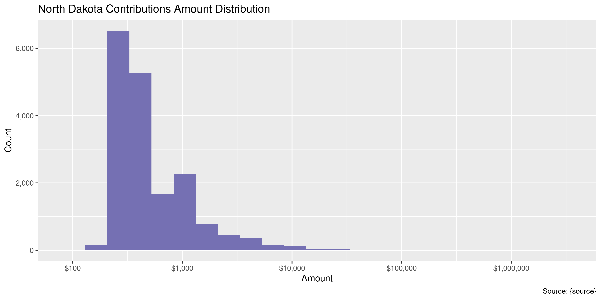
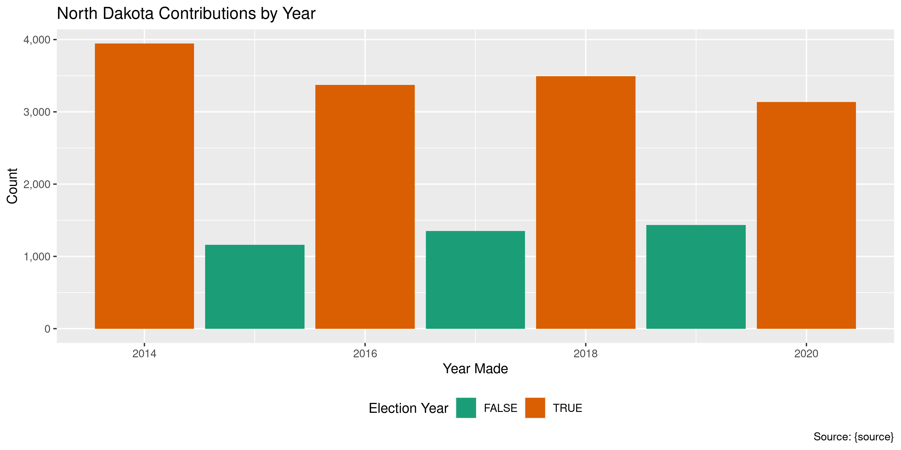
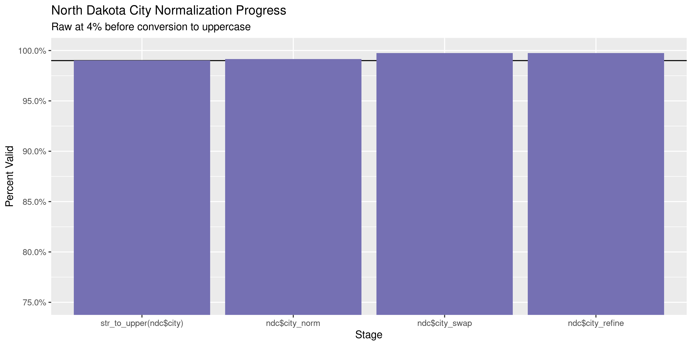
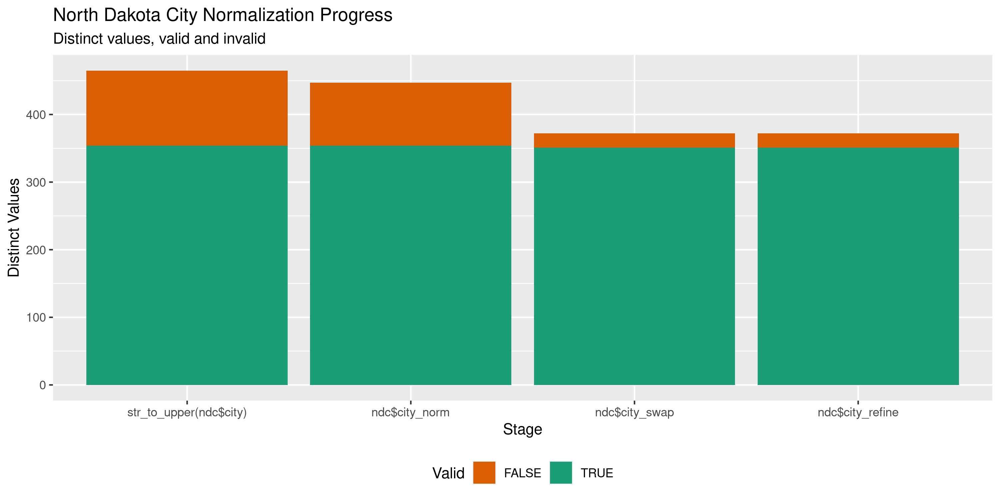

North Dakota Contributions
================
Kiernan Nicholls
Tue Mar 22 11:43:30 2022

-   [Project](#project)
-   [Objectives](#objectives)
-   [Packages](#packages)
-   [Source](#source)
-   [Download](#download)
-   [Read](#read)
-   [Explore](#explore)
    -   [Missing](#missing)
    -   [Duplicates](#duplicates)
    -   [Amounts](#amounts)
    -   [Dates](#dates)
-   [Wrangle](#wrangle)
    -   [Address](#address)
    -   [ZIP](#zip)
    -   [State](#state)
    -   [City](#city)
-   [Conclude](#conclude)
-   [Export](#export)
-   [Upload](#upload)

<!-- Place comments regarding knitting here -->

## Project

The Accountability Project is an effort to cut across data silos and
give journalists, policy professionals, activists, and the public at
large a simple way to search across huge volumes of public data about
people and organizations.

Our goal is to standardize public data on a few key fields by thinking
of each dataset row as a transaction. For each transaction there should
be (at least) 3 variables:

1.  All **parties** to a transaction.
2.  The **date** of the transaction.
3.  The **amount** of money involved.

## Objectives

This document describes the process used to complete the following
objectives:

1.  How many records are in the database?
2.  Check for entirely duplicated records.
3.  Check ranges of continuous variables.
4.  Is there anything blank or missing?
5.  Check for consistency issues.
6.  Create a five-digit ZIP Code called `zip`.
7.  Create a `year` field from the transaction date.
8.  Make sure there is data on both parties to a transaction.

## Packages

The following packages are needed to collect, manipulate, visualize,
analyze, and communicate these results. The `pacman` package will
facilitate their installation and attachment.

``` r
if (!require("pacman")) {
  install.packages("pacman")
}
pacman::p_load(
  tidyverse, # data manipulation
  lubridate, # datetime strings
  gluedown, # printing markdown
  janitor, # clean data frames
  campfin, # custom irw tools
  aws.s3, # aws cloud storage
  refinr, # cluster & merge
  scales, # format strings
  knitr, # knit documents
  vroom, # fast reading
  rvest, # scrape html
  glue, # code strings
  here, # project paths
  httr, # http requests
  fs # local storage 
)
```

This diary was run using `campfin` version 1.0.8.9201.

``` r
packageVersion("campfin")
#> [1] '1.0.8.9201'
```

This document should be run as part of the `R_tap` project, which lives
as a sub-directory of the more general, language-agnostic
[`irworkshop/accountability_datacleaning`](https://github.com/irworkshop/accountability_datacleaning)
GitHub repository.

The `R_tap` project uses the [RStudio
projects](https://support.rstudio.com/hc/en-us/articles/200526207-Using-Projects)
feature and should be run as such. The project also uses the dynamic
`here::here()` tool for file paths relative to *your* machine.

``` r
# where does this document knit?
here::i_am("nd/contribs/docs/nd_contribs_diary.Rmd")
```

## Source

North Dakota campaign contributions data was obtained by students at
American University via a state records request.

## Download

The data provided by the state in response to the request is hosted on
AWS S3.

``` r
raw_key <- "jla_class_data2021/ND_2011_2021_campaign-contributions copy.zip" 
raw_dir <- dir_create(here("nd", "contribs", "data", "raw"))
raw_zip <- path(raw_dir, basename(raw_key))
```

``` r
if (!file_exists(raw_zip)) {
  save_object(
    object = raw_key,
    bucket = "publicaccountability",
    file = raw_zip,
    show_progress = TRUE
  )
}
```

``` r
raw_csv <- unzip(raw_zip, exdir = raw_dir, junkpaths = TRUE)
raw_csv <- str_subset(raw_csv, "/\\.", negate = TRUE)
```

## Read

``` r
for (i in seq_along(raw_csv)) {
  message(i)
  read_lines(raw_csv[i]) %>% 
    str_remove(",$") %>% 
    write_lines(raw_csv[i])
}
```

``` r
ndc <- read_delim(
  file = raw_csv,
  delim = ",",
  escape_backslash = FALSE,
  escape_double = FALSE,
  col_types = cols(
    .default = col_character(),
    Date = col_date("%m/%d/%Y %H:%M:%S %p"),
    Amount = col_double()
  )
)
```

``` r
ndc <- ndc %>% 
  clean_names(case = "snake") %>% 
  mutate(across(where(is.character), str_squish))
```

## Explore

There are 17,898 rows of 8 columns. Each record represents a single
Contributions…

``` r
glimpse(ndc)
#> Rows: 17,898
#> Columns: 8
#> $ contributor    <chr> "20th District Republicans", "Aarfor, Renae", "Aberle, Debby", "Ableidinger, Tom", "ACE/ND PAC"…
#> $ street         <chr> "15857 7th St NE", "3535 Woodbury Court S", "114 W Main Ave, Suite C", "3498 Shadow Wood Ln", "…
#> $ city           <chr> "Cummings", "Fargo", "Bismarck", "West Fargo", "Bismarck", "Bismarck", "Bismarck", "Bismarck", …
#> $ state          <chr> "ND", "ND", "Su", "ND", "ND", "ND", "ND", "ND", "ND", "ND", "ND", "ND", "ND", "ND", "ND", "ND",…
#> $ zip            <chr> "58223", "58103", "te C <br />Bismarck, ND 58501", "58078", "58507-7370", "58507", "58507", "58…
#> $ date           <date> 2020-07-13, 2020-06-01, 2020-10-29, 2020-02-11, 2020-08-01, 2020-09-29, 2020-12-31, 2020-08-25…
#> $ amount         <dbl> 750, 220, 250, 500, 250, 1000, 1000, 250, 245, 1000, 1000, 4000, 703, 250, 250, 400, 750, 300, …
#> $ contributed_to <chr> "JARED HAGERT", "Shelley J Lenz", "North Dakota Assoc of Realtors PAC", "Doug Burgum for North …
tail(ndc)
#> # A tibble: 6 × 8
#>   contributor              street                     city      state zip        date       amount contributed_to       
#>   <chr>                    <chr>                      <chr>     <chr> <chr>      <date>      <dbl> <chr>                
#> 1 Yvonne/Gene Kroll        610 4th Ave East           Dickinson ND    58601      2014-08-27    225 North Dakota Republi…
#> 2 Zachary Blaine Smith     1134 S Highland Acres Road Bismarck  ND    58501      2014-06-23    220 Republican House Cau…
#> 3 Zahrt, Barb              3322 42nd Ave S            Fargo     ND    58104      2014-03-18    335 North Dakota Democra…
#> 4 ZAHRT, BARB              3322 42ND AVE S            FARGO     ND    58104      2014-08-09    350 Taylor for North Dak…
#> 5 Zielezienski, J. Stephen 10514 James Wren Way       Fairfax   ND    22030-8119 2014-12-26    650 Property Casualty In…
#> 6 Zimmerman, Todd          1215 8th St S              Fargo     ND    58103      2014-10-21    250 Taylor for North Dak…
```

### Missing

Columns vary in their degree of missing values.

``` r
col_stats(ndc, count_na)
#> # A tibble: 8 × 4
#>   col            class      n       p
#>   <chr>          <chr>  <int>   <dbl>
#> 1 contributor    <chr>     46 0.00257
#> 2 street         <chr>      0 0      
#> 3 city           <chr>      0 0      
#> 4 state          <chr>      0 0      
#> 5 zip            <chr>      0 0      
#> 6 date           <date>     0 0      
#> 7 amount         <dbl>      0 0      
#> 8 contributed_to <chr>      0 0
```

We can flag any record missing a key variable needed to identify a
transaction.

``` r
key_vars <- c("date", "contributor", "amount", "contributed_to")
ndc <- flag_na(ndc, all_of(key_vars))
sum(ndc$na_flag)
#> [1] 46
```

``` r
ndc %>% 
  filter(na_flag) %>% 
  select(all_of(key_vars))
#> # A tibble: 46 × 4
#>    date       contributor amount contributed_to                    
#>    <date>     <chr>        <dbl> <chr>                             
#>  1 2019-10-01 <NA>           280 North Dakota Assoc of Realtors PAC
#>  2 2019-10-01 <NA>           224 North Dakota Assoc of Realtors PAC
#>  3 2019-12-01 <NA>          6479 North Dakota Assoc of Realtors PAC
#>  4 2019-09-17 <NA>           250 North Dakota Assoc of Realtors PAC
#>  5 2019-10-01 <NA>          2500 North Dakota Assoc of Realtors PAC
#>  6 2019-11-01 <NA>          1250 North Dakota Assoc of Realtors PAC
#>  7 2019-12-01 <NA>          3660 North Dakota Assoc of Realtors PAC
#>  8 2019-11-01 <NA>          3560 North Dakota Assoc of Realtors PAC
#>  9 2019-11-01 <NA>          1970 North Dakota Assoc of Realtors PAC
#> 10 2019-06-28 <NA>           450 North Dakota Assoc of Realtors PAC
#> # … with 36 more rows
```

### Duplicates

We can also flag any record completely duplicated across every column.

``` r
ndc <- flag_dupes(ndc, everything())
sum(ndc$dupe_flag)
#> [1] 0
```

There are no duplicate contributions.

### Amounts

``` r
# fix floating point precision
ndc$amount <- round(ndc$amount, digits = 2)
```

``` r
summary(ndc$amount)
#>    Min. 1st Qu.  Median    Mean 3rd Qu.    Max. 
#>     120     265     500    1473     774 3231100
mean(ndc$amount <= 0)
#> [1] 0
```

These are the records with the minimum and maximum amounts.

``` r
glimpse(ndc[c(which.max(ndc$amount), which.min(ndc$amount)), ])
#> Rows: 2
#> Columns: 9
#> $ contributor    <chr> "DOUG BURGUM", "Lein, Christy"
#> $ street         <chr> "1131 N 4TH ST", "625 21st Ave South"
#> $ city           <chr> "BISMARCK", "Fargo"
#> $ state          <chr> "ND", "ND"
#> $ zip            <chr> "58501", "58103"
#> $ date           <date> 2020-12-30, 2019-12-09
#> $ amount         <dbl> 3231100, 120
#> $ contributed_to <chr> "Dakota Leadership PAC", "LegalizeND"
#> $ na_flag        <lgl> FALSE, FALSE
```

The distribution of amount values are typically log-normal.

<!-- -->

### Dates

We can add the calendar year from `date` with `lubridate::year()`

``` r
ndc <- mutate(ndc, year = year(date))
```

``` r
min(ndc$date)
#> [1] "2014-01-01"
sum(ndc$year < 2000)
#> [1] 0
max(ndc$date)
#> [1] "2020-12-31"
sum(ndc$date > today())
#> [1] 0
```

It’s common to see an increase in the number of contributins in
elections years.

<!-- -->

## Wrangle

To improve the searchability of the database, we will perform some
consistent, confident string normalization. For geographic variables
like city names and ZIP codes, the corresponding `campfin::normal_*()`
functions are tailor made to facilitate this process.

A number of contributions seem to contain the `<br>` HTML tag embedded
in the `zip` column. This appears to be some bug in the back-end. We
need to find these rows and fix the data. These rows also mess up the
`state` value too.

    #> # A tibble: 42 × 4
    #>    street                                           city      state zip                                                 
    #>    <chr>                                            <chr>     <chr> <chr>                                               
    #>  1 114 W Main Ave, Suite C                          Bismarck  Su    te C <br />Bismarck, ND 58501                       
    #>  2 PO Box 897, Bismarck, ND 58502 PO Box 897        Bismarck  Bi    marck, ND 58502 PO Box 897 <br />Bismarck, ND 58502 
    #>  3 4610 Amber Valley Pkwy, Ste E                    Fargo     St    E <br />Fargo, ND 58104                             
    #>  4 PO Box 1147 Fargo, ND 58107 PO Box 1147          Fargo     ND    58107 PO Box 1147 <br />Fargo, ND 58107             
    #>  5 1661 Capitol Way Ste, 102                        Bismarck  10    <br />Bismarck, ND 58501                            
    #>  6 114 W Main Ave, Suite C                          Bismarck  Su    te C <br />Bismarck, ND 58501                       
    #>  7 PO Box 2277, Bismarck, ND 58501-7117 PO Box 2277 Bismarck  Bi    marck, ND 58501-7117 PO Box 2277 <br />Bismarck, ND…
    #>  8 5012 53 St S, Ste G                              Fargo     St    G <br />Fargo, ND 58104                             
    #>  9 269 16th Street West, Suite A                    Dickinson Su    te A <br />Dickinson, ND 58601                      
    #> 10 624 Main Ave, Suite 2B                           Fargo     Su    te 2B <br />Fargo, ND 58102                         
    #> # … with 32 more rows

``` r
bad_zip <- filter(ndc, str_detect(zip, "<br\\s/>"))
gud_zip <- filter(ndc, str_detect(zip, "<br\\s/>", negate = TRUE))
```

``` r
bad_zip <- bad_zip %>% 
  select(-city, -state) %>% 
  filter(str_detect(zip, "<br\\s/>")) %>% 
  mutate(zip = str_remove(zip, "(.*)<br\\s/>")) %>% 
  extract(
    col = zip,
    into = c("city", "state", "zip"),
    regex = "^(.*),\\s(.*)\\s(.*)$",
    remove = TRUE
  )
```

``` r
ndc <- bind_rows(gud_zip, bad_zip)
ndc <- arrange(ndc, desc(ndc))
```

### Address

For the street `addresss` variable, the `campfin::normal_address()`
function will force consistence case, remove punctuation, and abbreviate
official USPS suffixes.

``` r
addr_norm <- ndc %>% 
  distinct(street) %>% 
  mutate(
    street_norm = normal_address(
      address = street,
      abbs = usps_street,
      na_rep = TRUE
    )
  )
```

``` r
addr_norm
#> # A tibble: 8,898 × 2
#>    street                   street_norm             
#>    <chr>                    <chr>                   
#>  1 707 15th Ave E           707 15TH AVE E          
#>  2 4320 Borden Harbor Pl SE 4320 BORDEN HARBOR PL SE
#>  3 PO Box 927               PO BOX 927              
#>  4 P.O. Box 927             PO BOX 927              
#>  5 1215 8th St S            1215 8TH ST S           
#>  6 PO BOX Box 11            PO BOX BOX 11           
#>  7 4318 Trenton Drive       4318 TRENTON DR         
#>  8 1524 University Avenue   1524 UNIVERSITY AVE     
#>  9 101 13th Ave N           101 13TH AVE N          
#> 10 PO Box 303               PO BOX 303              
#> # … with 8,888 more rows
```

``` r
ndc <- left_join(ndc, addr_norm, by = "street")
```

### ZIP

For ZIP codes, the `campfin::normal_zip()` function will attempt to
create valid *five* digit codes by removing the ZIP+4 suffix and
returning leading zeroes dropped by other programs like Microsoft Excel.

``` r
ndc <- ndc %>% 
  mutate(
    zip_norm = normal_zip(
      zip = zip,
      na_rep = TRUE
    )
  )
```

``` r
progress_table(
  ndc$zip,
  ndc$zip_norm,
  compare = valid_zip
)
#> # A tibble: 2 × 6
#>   stage        prop_in n_distinct prop_na n_out n_diff
#>   <chr>          <dbl>      <dbl>   <dbl> <dbl>  <dbl>
#> 1 ndc$zip        0.916       1029       0  1500    626
#> 2 ndc$zip_norm   0.998        438       0    37     28
```

### State

The `state` variable does not need to be cleaned.

``` r
prop_na(ndc$state)
#> [1] 0
prop_in(ndc$state, state.abb)
#> [1] 0.9999441
what_out(ndc$state, state.abb)
#> [1] "S"
```

### City

Cities are the most difficult geographic variable to normalize, simply
due to the wide variety of valid cities and formats.

#### Normal

The `campfin::normal_city()` function is a good start, again converting
case, removing punctuation, but *expanding* USPS abbreviations. We can
also remove `invalid_city` values.

``` r
norm_city <- ndc %>% 
  distinct(city, state, zip_norm) %>% 
  mutate(
    city_norm = normal_city(
      city = city, 
      abbs = usps_city,
      states = c("ND", "DC", "NORTH DAKOTA"),
      na = invalid_city,
      na_rep = TRUE
    )
  )
```

#### Swap

We can further improve normalization by comparing our normalized value
against the *expected* value for that record’s state abbreviation and
ZIP code. If the normalized value is either an abbreviation for or very
similar to the expected value, we can confidently swap those two.

``` r
norm_city <- norm_city %>% 
  rename(city_raw = city) %>% 
  left_join(
    y = zipcodes,
    by = c(
      "state" = "state",
      "zip_norm" = "zip"
    )
  ) %>% 
  rename(city_match = city) %>% 
  mutate(
    match_abb = is_abbrev(city_norm, city_match),
    match_dist = str_dist(city_norm, city_match),
    city_swap = if_else(
      condition = !is.na(match_dist) & (match_abb | match_dist == 1),
      true = city_match,
      false = city_norm
    )
  ) %>% 
  select(
    -city_match,
    -match_dist,
    -match_abb
  )
```

``` r
ndc <- left_join(
  x = ndc,
  y = norm_city,
  by = c(
    "city" = "city_raw", 
    "state", 
    "zip_norm"
  )
)
```

#### Refine

The [OpenRefine](https://openrefine.org/) algorithms can be used to
group similar strings and replace the less common versions with their
most common counterpart. This can greatly reduce inconsistency, but with
low confidence; we will only keep any refined strings that have a valid
city/state/zip combination.

``` r
good_refine <- ndc %>% 
  mutate(
    city_refine = city_swap %>% 
      key_collision_merge() %>% 
      n_gram_merge(numgram = 1)
  ) %>% 
  filter(city_refine != city_swap) %>% 
  inner_join(
    y = zipcodes,
    by = c(
      "city_refine" = "city",
      "state" = "state",
      "zip_norm" = "zip"
    )
  )
```

    #> # A tibble: 0 × 5
    #> # … with 5 variables: state <chr>, zip_norm <chr>, city_swap <chr>, city_refine <chr>, n <int>

Then we can join the refined values back to the database.

``` r
ndc <- ndc %>% 
  left_join(good_refine, by = names(.)) %>% 
  mutate(city_refine = coalesce(city_refine, city_swap))
```

#### Progress

Our goal for normalization was to increase the proportion of city values
known to be valid and reduce the total distinct values by correcting
misspellings.

| stage                    | prop_in | n_distinct | prop_na | n_out | n_diff |
|:-------------------------|--------:|-----------:|--------:|------:|-------:|
| `str_to_upper(ndc$city)` |   0.990 |        465 |       0 |   178 |    111 |
| `ndc$city_norm`          |   0.992 |        447 |       0 |   150 |     93 |
| `ndc$city_swap`          |   0.998 |        372 |       0 |    43 |     21 |
| `ndc$city_refine`        |   0.998 |        372 |       0 |    43 |     21 |

You can see how the percentage of valid values increased with each
stage.

<!-- -->

More importantly, the number of distinct values decreased each stage. We
were able to confidently change many distinct invalid values to their
valid equivalent.

<!-- -->

Before exporting, we can remove the intermediary normalization columns
and rename all added variables with the `_clean` suffix.

``` r
ndc <- ndc %>% 
  select(
    -city_norm,
    -city_swap,
    city_clean = city_refine
  ) %>% 
  rename_all(~str_replace(., "_norm", "_clean")) %>% 
  rename_all(~str_remove(., "_raw")) %>% 
  relocate(street_clean, city_clean, .before = zip_clean)
```

## Conclude

``` r
glimpse(sample_n(ndc, 1000))
#> Rows: 1,000
#> Columns: 13
#> $ contributor    <chr> "Evelyn Quigley", "Hammes, Jeff", "ND Chiropractic PAC", "Erin Hill-Oban", "Sheri Miller", "Nag…
#> $ street         <chr> "253 Prairiewood SW Dr.", "4319 Borden Harbor PL SE", "1383 21st Ave N Suite A", "1319 Apache S…
#> $ city           <chr> "Fargo", "Mandan", "Fargo", "Bismarck", "West Fargo", "Fargo", "Bismarck", "Grand forks", "Stre…
#> $ state          <chr> "ND", "ND", "ND", "ND", "ND", "ND", "ND", "ND", "ND", "ND", "ND", "ND", "ND", "ND", "ND", "ND",…
#> $ zip            <chr> "58103", "58554", "58102", "58501", "58078", "58103", "58503", "58201", "58483", "58702", "5850…
#> $ date           <date> 2015-05-19, 2020-08-13, 2018-09-11, 2019-09-25, 2018-12-07, 2014-07-10, 2018-08-29, 2019-12-15…
#> $ amount         <dbl> 500.0, 700.0, 1000.0, 300.0, 240.0, 360.0, 800.0, 355.5, 225.0, 500.0, 1200.0, 1500.0, 240.0, 2…
#> $ contributed_to <chr> "Cass County Dem-NPL of North Dakota", "North Dakota Ethanol Producers Association PAC", "Rich …
#> $ na_flag        <lgl> FALSE, FALSE, FALSE, FALSE, FALSE, FALSE, FALSE, FALSE, FALSE, FALSE, FALSE, FALSE, FALSE, FALS…
#> $ year           <dbl> 2015, 2020, 2018, 2019, 2018, 2014, 2018, 2019, 2017, 2020, 2016, 2014, 2018, 2020, 2016, 2017,…
#> $ street_clean   <chr> "253 PRAIRIEWOOD SW DR", "4319 BORDEN HARBOR PL SE", "1383 21ST AVE N SUITE A", "1319 APACHE ST…
#> $ city_clean     <chr> "FARGO", "MANDAN", "FARGO", "BISMARCK", "WEST FARGO", "FARGO", "BISMARCK", "GRAND FORKS", "STRE…
#> $ zip_clean      <chr> "58103", "58554", "58102", "58501", "58078", "58103", "58503", "58201", "58483", "58702", "5850…
```

1.  There are 17,898 records in the database.
2.  There are 0 duplicate records in the database.
3.  The range and distribution of `amount` and `date` seem reasonable.
4.  There are 46 records missing key variables.
5.  Consistency in geographic data has been improved with
    `campfin::normal_*()`.
6.  The 4-digit `year` variable has been created with
    `lubridate::year()`.

## Export

Now the file can be saved on disk for upload to the Accountability
server. We will name the object using a date range of the records
included.

``` r
min_dt <- str_remove_all(min(ndc$date), "-")
max_dt <- str_remove_all(max(ndc$date), "-")
csv_ts <- paste(min_dt, max_dt, sep = "-")
```

``` r
clean_dir <- dir_create(here("nd", "contribs", "data", "clean"))
clean_csv <- path(clean_dir, glue("nd_contribs_{csv_ts}.csv"))
clean_rds <- path_ext_set(clean_csv, "rds")
basename(clean_csv)
#> [1] "nd_contribs_20140101-20201231.csv"
```

``` r
write_csv(ndc, clean_csv, na = "")
write_rds(ndc, clean_rds, compress = "xz")
(clean_size <- file_size(clean_csv))
#> 2.35M
```

## Upload

We can use the `aws.s3::put_object()` to upload the text file to the IRW
server.

``` r
aws_key <- path("csv", basename(clean_csv))
if (!object_exists(aws_key, "publicaccountability")) {
  put_object(
    file = clean_csv,
    object = aws_key, 
    bucket = "publicaccountability",
    acl = "public-read",
    show_progress = TRUE,
    multipart = TRUE
  )
}
aws_head <- head_object(aws_key, "publicaccountability")
(aws_size <- as_fs_bytes(attr(aws_head, "content-length")))
unname(aws_size == clean_size)
```
