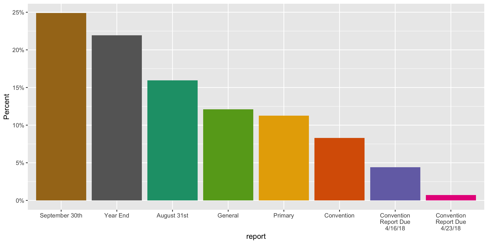
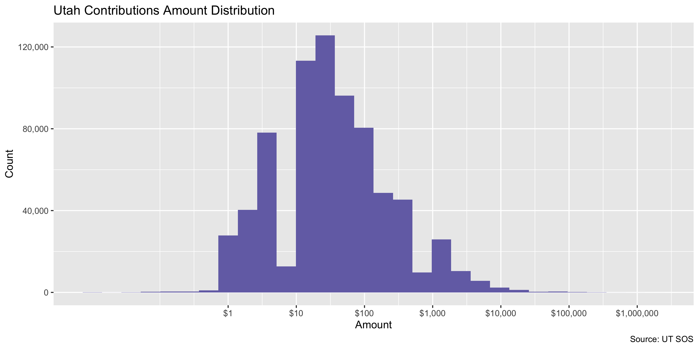
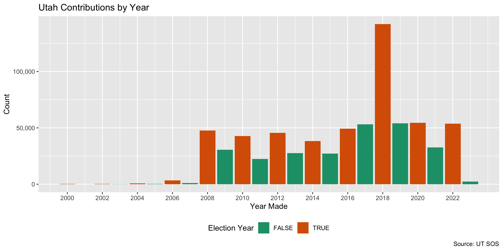
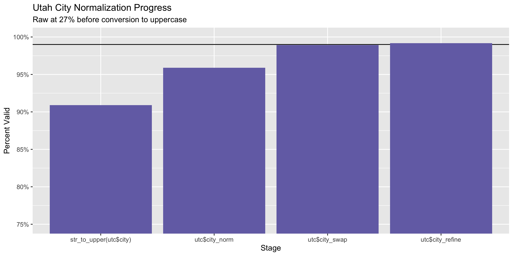
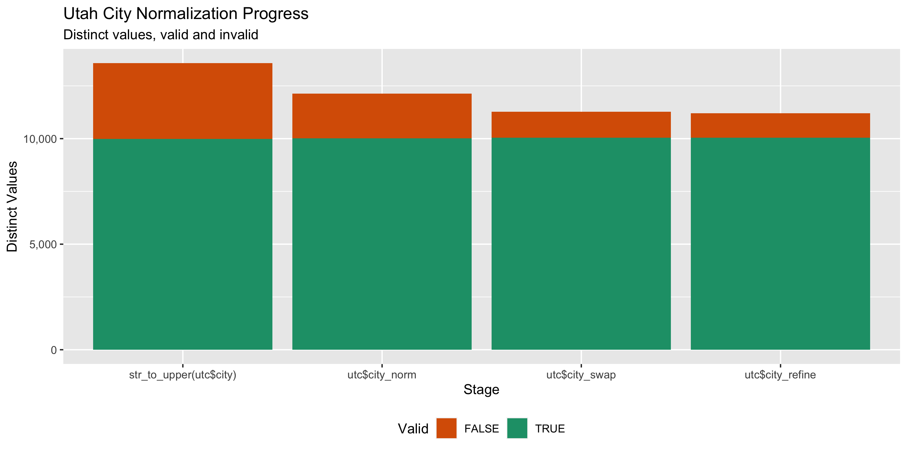

Utah Contributions
================
Kiernan Nicholls & Aarushi Sahejpal
Sun May 28 10:10:15 2023

- <a href="#project" id="toc-project">Project</a>
- <a href="#objectives" id="toc-objectives">Objectives</a>
- <a href="#packages" id="toc-packages">Packages</a>
- <a href="#download" id="toc-download">Download</a>
- <a href="#fix" id="toc-fix">Fix</a>
- <a href="#read" id="toc-read">Read</a>
- <a href="#explore" id="toc-explore">Explore</a>
  - <a href="#missing" id="toc-missing">Missing</a>
  - <a href="#duplicates" id="toc-duplicates">Duplicates</a>
  - <a href="#categorical" id="toc-categorical">Categorical</a>
  - <a href="#amounts" id="toc-amounts">Amounts</a>
  - <a href="#dates" id="toc-dates">Dates</a>
- <a href="#wrangle" id="toc-wrangle">Wrangle</a>
  - <a href="#address" id="toc-address">Address</a>
  - <a href="#zip" id="toc-zip">ZIP</a>
  - <a href="#state" id="toc-state">State</a>
  - <a href="#city" id="toc-city">City</a>
- <a href="#conclude" id="toc-conclude">Conclude</a>
- <a href="#export" id="toc-export">Export</a>
- <a href="#upload" id="toc-upload">Upload</a>

<!-- Place comments regarding knitting here -->

## Project

The Accountability Project is an effort to cut across data silos and
give journalists, policy professionals, activists, and the public at
large a simple way to search across huge volumes of public data about
people and organizations.

Our goal is to standardize public data on a few key fields by thinking
of each dataset row as a transaction. For each transaction there should
be (at least) 3 variables:

1.  All **parties** to a transaction.
2.  The **date** of the transaction.
3.  The **amount** of money involved.

## Objectives

This document describes the process used to complete the following
objectives:

1.  How many records are in the database?
2.  Check for entirely duplicated records.
3.  Check ranges of continuous variables.
4.  Is there anything blank or missing?
5.  Check for consistency issues.
6.  Create a five-digit ZIP Code called `zip`.
7.  Create a `year` field from the transaction date.
8.  Make sure there is data on both parties to a transaction.

## Packages

The following packages are needed to collect, manipulate, visualize,
analyze, and communicate these results. The `pacman` package will
facilitate their installation and attachment.

``` r
if (!require("pacman")) {
  install.packages("pacman")
}
pacman::p_load(
  tidyverse, # data manipulation
  lubridate, # datetime strings
  gluedown, # printing markdown
  janitor, # clean data frames
  campfin, # custom irw tools
  aws.s3, # aws cloud storage
  refinr, # cluster & merge
  scales, # format strings
  knitr, # knit documents
  vroom, # fast reading
  rvest, # scrape html
  glue, # code strings
  here, # project paths
  httr, # http requests
  cli, # command line
  fs # local storage 
)
```

This document should be run as part of the `R_campfin` project, which
lives as a sub-directory of the more general, language-agnostic
[`irworkshop/accountability_datacleaning`](https://github.com/irworkshop/accountability_datacleaning)
GitHub repository.

The `R_campfin` project uses the [RStudio
projects](https://support.rstudio.com/hc/en-us/articles/200526207-Using-Projects)
feature and should be run as such. The project also uses the dynamic
`here::here()` tool for file paths relative to *your* machine.

``` r
# where does this document knit?
here::i_am("ut/contribs/docs/ut_contribs_diary.Rmd")
```

Campaign expenditures are from the Utah [Financial Disclosures
website](https://disclosures.utah.gov/).

> #### Reporting Contributions and Expenditures:
>
> The general requirement for contribution reporting is to report each
> contribution you receive within 31 days of receiving it. However,
> there are additional requirements that must be followed: …
>
> - All expenditures must be reported by the reporting deadline for each
>   reporting period.
> - All additional contributions received during a reporting period must
>   be reported by the reporting deadline.
> - All filing reports must be filled by no later than 11:59 p.m. on the
>   day of the reporting deadline. Failure to file a report on time may
>   result in a fine.

## Download

Using the website’s [advance search
feature](https://disclosures.utah.gov/Search/AdvancedSearch), users can
search along a name, entity type, and report year. The site gives
ambiguous directions, but we can obtain *all* records for a year and
entity type if we leave the name blank and click on the top record.

> Please follow these steps: \* Select an Entity Type \* Select a Report
> Year \* Click Find \* In the top row of results, click the year under
> the far right column – “Download Data by Year”

We make these direct HTTP requests using `httr::GET()`.

``` r
raw_dir <- dir_create(here("ut", "contribs", "data", "raw"))
```

Search results are categorized across eight entity types for every year
from 1998 to 2020.

- PCC = Candidates & Office Holders
- CORP = Corporation
- ELECT = Electioneering
- INDEXP = Independent Expenditures
- LABOR = Labor Organizations
- PAC = Political Action Committee
- PIC = Political Issues Committee
- PARTY = Political Party

We can first scrape all the entity types and report years from the
search site’s dropdown menus.

``` r
search_url <- "https://disclosures.utah.gov/Search/AdvancedSearch/"
ut_search <- read_html(search_url)
rpt_years <- ut_search %>% 
  html_elements("#ReportYear option") %>% 
  html_attr("value")
```

``` r
min(rpt_years)
#> [1] "1998"
max(rpt_years)
#> [1] "2023"
```

``` r
entity_types <- ut_search %>% 
  html_elements("#EntityType option") %>% 
  html_attr("value") %>% 
  str_subset("\\w")
```

There are 208 combinations of these types and years, however many of
these combinations have no search results.

``` r
length(entity_types) * length(rpt_years)
#> [1] 208
```

We can make a `for` loop to run through each combination and request
data from the server with `httr::GET()`. For any combination without any
results, a HTML file is returned instead of the CSV file we want; these
files can be detected and deleted, leaving us with only files containing
expenditure records.

``` r
for (yr in rpt_years) {
  cli_h2("Year: {yr}")
  for (et in entity_types) {
    combo_csv <- path(raw_dir, glue("{et}-{yr}.csv"))
    if (!file_exists(combo_csv)) {
      # request the year and type file
      combo_get <- GET(
        url = str_c(search_url, "GenerateReport"),
        write_disk(combo_csv),
        query = list(
          ReportYear = yr,
          EntityType = et
        )
      )
      # delete the saved file if it isn't a CSV
      combo_mime <- headers(combo_get)[["content-type"]]
      if (!str_detect(combo_mime, "application/csv")) {
        file_delete(combo_csv)
        cli_alert_danger("{et} deleted")
      } else {
        cli_alert_success("{et} saved")
      }
    } else {
      cli_alert_success("{et} exists")
    }
  }
  Sys.sleep(runif(1, 1, 2)) 
}
```

We are left with 102 CSV files with data.

``` r
raw_info <- dir_info(raw_dir, glob = "*.csv")
nrow(raw_info)
#> [1] 102
sum(raw_info$size)
#> 162M
raw_csv <- raw_info$path
```

## Fix

Most columns in the comma-separated file are enclosed in
double-quotation marks (`"`) to escape any commas *within* the columns.
However, double-quotes within strings are not escaped with doubling or a
backslash. We can use regular expressions to find quotes not being used
to enclose a column and replace them with a single-quote mark.

``` r
tmp_dir <- dir_create(path(dirname(raw_dir), "tmp"))
tmp_csv <- path(tmp_dir, basename(raw_csv))
for (i in seq_along(raw_csv)) {
  if (!file_exists(tmp_csv[i])) {
    y <- read_lines(raw_csv[i])
    # quote not after comma and before non-quote/comma
    y <- str_replace_all(y, '(?<!,|^)\"(?=[^\",])', "'")
    y <- str_replace_all(y, '(?<=[^\",])\"(?!,|$)', "'")
    y <- str_replace(y, '",""","', '","","')
    write_lines(y, file = tmp_csv[i])
  }
}
```

## Read

The fixed files can be read together into a list of tables.

``` r
utc <- map(
  tmp_csv,
  read_delim,
  delim = ",",
  na = c("", "NA", "na", "N/A"),
  escape_backslash = FALSE,
  escape_double = FALSE,
  col_types = cols(
    .default = col_character(),
    TRAN_ID = col_integer(),
    TRAN_DATE = col_date("%m/%d/%Y"),
    TRAN_AMT = col_double()
  )
)
```

The second column in each file contains the name of the entity filing
the report on which the contribution was reported. The name of that
second column is thus different depending on the entity type of that
particular file. We can rename the second column in every file to
`ENTITY_NAME`.

``` r
utc <- map(utc, rename, ENTITY_NAME = 2)
```

Now every table has the same names and can be combined into a single
table.

``` r
names(utc) <- basename(tmp_csv)
utc <- bind_rows(utc, .id = "FILE_NAME")
```

We will identify the source of each row by the entity type and report
year from the file name.

``` r
file_entity <- extract(
  data = tibble(FILE_NAME = basename(tmp_csv)),
  col = FILE_NAME,
  into = c("ENTITY_TYPE", "REPORT_YEAR"),
  regex = "(\\w+)-(\\d{4}).csv",
  remove = FALSE,
  convert = TRUE
)
```

``` r
utc <- utc %>% 
  left_join(file_entity, by = "FILE_NAME") %>% 
  select(-FILE_NAME)
```

This data includes both `Contribution` and `Expenditure` transaction
types. We can filter the data to only include the former.

``` r
utc <- filter(utc, TRAN_TYPE == "Contribution")
```

``` r
utc <- clean_names(utc, case = "snake")
```

Finally, three columns use an `X` to indicate a `TRUE` value and blank
`NA` to indicate false.

``` r
utc %>% 
  select(filed, inkind, loan) %>% 
  distinct()
#> # A tibble: 7 × 3
#>   filed inkind loan 
#>   <chr> <chr>  <chr>
#> 1 X     <NA>   <NA> 
#> 2 X     X      <NA> 
#> 3 X     <NA>   X    
#> 4 <NA>  <NA>   <NA> 
#> 5 <NA>  X      <NA> 
#> 6 X     X      X    
#> 7 <NA>  <NA>   X
```

We can convert these quasi-logical columns to their proper data type for
mathematical analysis.

``` r
utc <- utc %>% 
  mutate(across(c(filed, inkind, loan), ~!is.na(.)))
```

## Explore

There are 729,542 rows of 20 columns. Each record represents a single
contribution made from an entity to a political campaign or committee.

``` r
glimpse(utc)
#> Rows: 729,542
#> Columns: 20
#> $ filed           <lgl> TRUE, TRUE, TRUE, TRUE, TRUE, TRUE, TRUE, TRUE, TRUE, TRUE, TRUE, TRUE, TRUE, TRUE, TRUE, TRUE…
#> $ entity_name     <chr> "Pharmaceutical Research and Manufacturers of America (PhRMA)", "Mutual Benefit International …
#> $ report          <chr> "General", "Year End", "August 31st", "August 31st", "August 31st", "August 31st", "August 31s…
#> $ tran_id         <int> 69793, 400413, 285618, 285625, 285627, 285619, 285620, 285621, 285622, 285623, 285624, 285628,…
#> $ tran_type       <chr> "Contribution", "Contribution", "Contribution", "Contribution", "Contribution", "Contribution"…
#> $ tran_date       <date> 2008-10-24, 2011-10-17, 2011-04-05, 2011-05-12, 2011-05-17, 2011-05-18, 2011-05-18, 2011-05-1…
#> $ tran_amt        <dbl> -500.0, 10000.0, 1500.0, 750.0, 750.0, 200.0, 200.0, 200.0, 750.0, 100.0, 250.0, 750.0, 1000.0…
#> $ inkind          <lgl> FALSE, FALSE, FALSE, FALSE, FALSE, FALSE, FALSE, FALSE, FALSE, FALSE, FALSE, FALSE, FALSE, FAL…
#> $ loan            <lgl> FALSE, FALSE, FALSE, FALSE, FALSE, FALSE, FALSE, FALSE, FALSE, FALSE, FALSE, FALSE, FALSE, FAL…
#> $ amends          <chr> NA, NA, NA, NA, NA, NA, NA, NA, NA, NA, NA, NA, NA, NA, NA, NA, NA, NA, NA, NA, NA, NA, NA, NA…
#> $ name            <chr> "Committee to Elect Ron Bigelow", "Ted Cruz ", "SelectHealth", "Weber State University", "Cast…
#> $ purpose         <chr> NA, NA, NA, NA, NA, NA, NA, NA, NA, NA, NA, NA, NA, NA, NA, NA, NA, NA, NA, NA, NA, NA, NA, NA…
#> $ address1        <chr> NA, "10440 N Central Expwy, Suite #1160", "36 South State, Suite 900", "1014 University Circle…
#> $ address2        <chr> NA, NA, NA, NA, NA, NA, NA, NA, NA, NA, NA, NA, NA, NA, NA, NA, NA, NA, NA, NA, NA, NA, NA, NA…
#> $ city            <chr> NA, "Dallas", "Salt Lake City", "Ogden", "Price", "Highalnd", "Sandy", "Salt Lake City", "Drap…
#> $ state           <chr> NA, "TX", "UT", "UT", "UT", "UT", "UT", "UT", "UT", "UT", "UT", "UT", "UT", "UT", "UT", "UT", …
#> $ zip             <chr> NA, "75231", "84111", "84408", "84501", "84003", "84092", "84121", "84020", "84103", "84103", …
#> $ inkind_comments <chr> NA, NA, NA, NA, NA, NA, NA, NA, NA, NA, NA, NA, NA, NA, NA, NA, NA, NA, NA, NA, NA, NA, NA, NA…
#> $ entity_type     <chr> "CORP", "CORP", "CORP", "CORP", "CORP", "CORP", "CORP", "CORP", "CORP", "CORP", "CORP", "CORP"…
#> $ report_year     <int> 2008, 2011, 2011, 2011, 2011, 2011, 2011, 2011, 2011, 2011, 2011, 2011, 2011, 2011, 2011, 2011…
tail(utc)
#> # A tibble: 6 × 20
#>   filed entity_name     report tran_id tran_type tran_date  tran_amt inkind loan  amends name  purpose address1 address2
#>   <lgl> <chr>           <chr>    <int> <chr>     <date>        <dbl> <lgl>  <lgl> <chr>  <chr> <chr>   <chr>    <chr>   
#> 1 FALSE ZOO ARTS AND P… Septe… 1208980 Contribu… 2023-03-01    1745. FALSE  FALSE <NA>   Salt… <NA>    54 Finc… <NA>    
#> 2 FALSE ZOO ARTS AND P… Septe… 1208983 Contribu… 2023-03-01   19077. FALSE  FALSE <NA>   Hale… <NA>    9900 So… <NA>    
#> 3 FALSE ZOO ARTS AND P… Septe… 1208984 Contribu… 2023-03-01    2203. FALSE  FALSE <NA>   Utah… <NA>    202 Wes… <NA>    
#> 4 FALSE ZOO ARTS AND P… Septe… 1209024 Contribu… 2023-03-03    1000. FALSE  FALSE <NA>   Wasa… <NA>    824 S 4… Ste B127
#> 5 FALSE ZOO ARTS AND P… Septe… 1209202 Contribu… 2023-03-06    1188. FALSE  FALSE <NA>   Utah… <NA>    20 S We… <NA>    
#> 6 FALSE ZOO ARTS AND P… Septe… 1209609 Contribu… 2023-03-07    2054. FALSE  FALSE <NA>   Salt… <NA>    111 Eas… Suite 99
#> # ℹ 6 more variables: city <chr>, state <chr>, zip <chr>, inkind_comments <chr>, entity_type <chr>, report_year <int>
```

We can see that despite data existing since 1998, contributions aren’t
really reported in bulk until 2008.

### Missing

Columns vary in their degree of missing values.

``` r
col_stats(utc, count_na)
#> # A tibble: 20 × 4
#>    col             class       n        p
#>    <chr>           <chr>   <int>    <dbl>
#>  1 filed           <lgl>       0 0       
#>  2 entity_name     <chr>       0 0       
#>  3 report          <chr>       0 0       
#>  4 tran_id         <int>       0 0       
#>  5 tran_type       <chr>       0 0       
#>  6 tran_date       <date>      0 0       
#>  7 tran_amt        <dbl>       0 0       
#>  8 inkind          <lgl>       0 0       
#>  9 loan            <lgl>       0 0       
#> 10 amends          <chr>  728299 0.998   
#> 11 name            <chr>     107 0.000147
#> 12 purpose         <chr>  729431 1.00    
#> 13 address1        <chr>    2799 0.00384 
#> 14 address2        <chr>  709617 0.973   
#> 15 city            <chr>    2055 0.00282 
#> 16 state           <chr>   24556 0.0337  
#> 17 zip             <chr>    1351 0.00185 
#> 18 inkind_comments <chr>  722140 0.990   
#> 19 entity_type     <chr>       0 0       
#> 20 report_year     <int>       0 0
```

We can flag any record missing a key variable needed to identify a
transaction.

``` r
key_vars <- c("tran_date", "name", "tran_amt", "entity_name")
utc <- flag_na(utc, all_of(key_vars))
sum(utc$na_flag)
#> [1] 107
```

Of the four key variables, only a few are missing the `name` of the
individual making the contribution.

``` r
utc %>% 
  filter(na_flag) %>% 
  select(all_of(key_vars))
#> # A tibble: 107 × 4
#>    tran_date  name  tran_amt entity_name                                          
#>    <date>     <chr>    <dbl> <chr>                                                
#>  1 2014-06-10 <NA>       0   Ensign Services Inc                                  
#>  2 2008-01-24 <NA>      25.0 Utah Apartment Association Political Action Committee
#>  3 2010-01-01 <NA>       0   Utah Building & Construction Trades Council          
#>  4 2010-01-01 <NA>       0   Utah Building & Construction Trades Council          
#>  5 2010-01-01 <NA>       0   Utah Building & Construction Trades Council          
#>  6 2011-12-29 <NA>       0   Laborers Political League                            
#>  7 2011-06-13 <NA>       0   Utah Bankers Association                             
#>  8 2011-05-14 <NA>       0   Utah Dental Association Political Action Committee   
#>  9 2012-08-17 <NA>       0   A.B.A.T.E. of Utah                                   
#> 10 2012-01-19 <NA>       0   Associated General Contractors                       
#> # ℹ 97 more rows
```

### Duplicates

We can also flag any record completely duplicated across every column.

``` r
utc <- flag_dupes(utc, -tran_id)
sum(utc$dupe_flag)
#> [1] 28053
```

Despite unique `tran_id` values, there are 28,053 fully duplicated
values (same date, amount, names, etc.).

``` r
utc %>% 
  filter(dupe_flag) %>% 
  select(tran_id, all_of(key_vars)) %>% 
  arrange(tran_date)
#> # A tibble: 28,053 × 5
#>    tran_id tran_date  name                             tran_amt entity_name         
#>      <int> <date>     <chr>                               <dbl> <chr>               
#>  1    8987 2000-05-17 Magnesian Corporation Of America      100 doe, john           
#>  2    8988 2000-05-17 Magnesian Corporation Of America      100 doe, john           
#>  3    9091 2000-11-06 Aggregate Contributions                50 doe, john           
#>  4    9094 2000-11-06 Aggregate Contributions                50 doe, john           
#>  5    9095 2000-11-06 Aggregate Contributions                25 doe, john           
#>  6    9109 2000-11-06 Aggregate Contributions                25 doe, john           
#>  7   24431 2004-06-11 Cain, Camille T.                      500 Karras, Nolan E     
#>  8   24432 2004-06-11 Cain, Camille T.                      500 Karras, Nolan E     
#>  9   25794 2004-10-07 Aggregate Contributions                25 Aubrey, Johnathan M.
#> 10   25762 2004-10-07 Aggregate Contributions                25 Aubrey, Johnathan M.
#> # ℹ 28,043 more rows
```

### Categorical

``` r
col_stats(utc, n_distinct)
#> # A tibble: 22 × 4
#>    col             class       n          p
#>    <chr>           <chr>   <int>      <dbl>
#>  1 filed           <lgl>       2 0.00000274
#>  2 entity_name     <chr>    2353 0.00323   
#>  3 report          <chr>      15 0.0000206 
#>  4 tran_id         <int>  729542 1         
#>  5 tran_type       <chr>       1 0.00000137
#>  6 tran_date       <date>   6607 0.00906   
#>  7 tran_amt        <dbl>   15531 0.0213    
#>  8 inkind          <lgl>       2 0.00000274
#>  9 loan            <lgl>       2 0.00000274
#> 10 amends          <chr>    1244 0.00171   
#> 11 name            <chr>  217783 0.299     
#> 12 purpose         <chr>      10 0.0000137 
#> 13 address1        <chr>  224798 0.308     
#> 14 address2        <chr>    3828 0.00525   
#> 15 city            <chr>   19499 0.0267    
#> 16 state           <chr>      78 0.000107  
#> 17 zip             <chr>   25743 0.0353    
#> 18 inkind_comments <chr>    4628 0.00634   
#> 19 entity_type     <chr>       7 0.00000960
#> 20 report_year     <int>      23 0.0000315 
#> 21 na_flag         <lgl>       2 0.00000274
#> 22 dupe_flag       <lgl>       2 0.00000274
```

<!-- -->

### Amounts

``` r
summary(utc$tran_amt)
#>      Min.   1st Qu.    Median      Mean   3rd Qu.      Max. 
#>   -7355.0      10.0      25.0     369.2     100.0 1780024.0
mean(utc$tran_amt <= 0)
#> [1] 0.002633159
```

These are the records with the minimum and maximum amounts.

``` r
glimpse(utc[c(which.max(utc$tran_amt), which.min(utc$tran_amt)), ])
#> Rows: 2
#> Columns: 22
#> $ filed           <lgl> TRUE, TRUE
#> $ entity_name     <chr> "Southwest Regional Council Of Carpenters Political Action Fund", "King, Brian S"
#> $ report          <chr> "August 31st", "General"
#> $ tran_id         <int> 161886, 69389
#> $ tran_type       <chr> "Contribution", "Contribution"
#> $ tran_date       <date> 2010-08-26, 2008-10-23
#> $ tran_amt        <dbl> 1780024.04, -7354.99
#> $ inkind          <lgl> FALSE, FALSE
#> $ loan            <lgl> FALSE, FALSE
#> $ amends          <chr> NA, NA
#> $ name            <chr> "Unitemized Contributions", "Silver Trinity Media"
#> $ purpose         <chr> NA, NA
#> $ address1        <chr> NA, NA
#> $ address2        <chr> NA, NA
#> $ city            <chr> NA, NA
#> $ state           <chr> "UT", NA
#> $ zip             <chr> NA, NA
#> $ inkind_comments <chr> NA, NA
#> $ entity_type     <chr> "PAC", "PCC"
#> $ report_year     <int> 2010, 2008
#> $ na_flag         <lgl> FALSE, FALSE
#> $ dupe_flag       <lgl> FALSE, FALSE
```

<!-- -->

### Dates

We can add the calendar year from `tran_date` with `lubridate::year()`

``` r
utc <- mutate(utc, tran_year = year(tran_date))
```

``` r
min(utc$tran_date)
#> [1] "2000-01-18"
sum(utc$tran_year < 2000)
#> [1] 0
max(utc$tran_date)
#> [1] "2023-05-10"
sum(utc$tran_date > today())
#> [1] 0
```

<!-- -->

## Wrangle

To improve the searchability of the database, we will perform some
consistent, confident string normalization. For geographic variables
like city names and ZIP codes, the corresponding `campfin::normal_*()`
functions are tailor made to facilitate this process.

### Address

For the street `addresss` variable, the `campfin::normal_address()`
function will force consistence case, remove punctuation, and abbreviate
official USPS suffixes.

``` r
norm_addr <- utc %>% 
  distinct(address1, address2) %>% 
  unite(
    col = address_full,
    starts_with("address"),
    sep = " ",
    remove = FALSE,
    na.rm = TRUE
  ) %>% 
  mutate(
    address_norm = normal_address(
      address = address_full,
      abbs = usps_street,
      na_rep = TRUE
    )
  ) %>% 
  select(-address_full)
```

    #> # A tibble: 228,160 × 3
    #>    address1                           address2 address_norm                     
    #>    <chr>                              <chr>    <chr>                            
    #>  1 <NA>                               <NA>     <NA>                             
    #>  2 10440 N Central Expwy, Suite #1160 <NA>     10440 N CENTRAL EXPWY SUITE #1160
    #>  3 36 South State, Suite 900          <NA>     36 SOUTH STATE SUITE 900         
    #>  4 1014 University Circle             <NA>     1014 UNIVERSITY CIR              
    #>  5 300 N Hospital Drive               <NA>     300 N HOSPITAL DR                
    #>  6 5509 W Kinsington Circle           <NA>     5509 W KINSINGTON CIR            
    #>  7 10183 Loridan Lane                 <NA>     10183 LORIDAN LN                 
    #>  8 6483 Canyon Cove Place             <NA>     6483 CANYON COVE PL              
    #>  9 14727 Woods Landing Ct             <NA>     14727 WOODS LANDING CT           
    #> 10 1252 Arlington Drive               <NA>     1252 ARLINGTON DR                
    #> # ℹ 228,150 more rows

``` r
utc <- left_join(utc, norm_addr, by = c("address1", "address2"))
```

### ZIP

For ZIP codes, the `campfin::normal_zip()` function will attempt to
create valid *five* digit codes by removing the ZIP+4 suffix and
returning leading zeroes dropped by other programs like Microsoft Excel.

``` r
utc <- utc %>% 
  mutate(
    zip_norm = normal_zip(
      zip = zip,
      na_rep = TRUE
    )
  )
```

``` r
progress_table(
  utc$zip,
  utc$zip_norm,
  compare = valid_zip
)
#> # A tibble: 2 × 6
#>   stage        prop_in n_distinct prop_na n_out n_diff
#>   <chr>          <dbl>      <dbl>   <dbl> <dbl>  <dbl>
#> 1 utc$zip        0.946      25743 0.00185 39164   6827
#> 2 utc$zip_norm   0.994      19427 0.00615  4155    474
```

### State

Valid two digit state abbreviations can be made using the
`campfin::normal_state()` function.

``` r
utc <- utc %>% 
  mutate(
    state_norm = normal_state(
      state = state,
      abbreviate = TRUE,
      na_rep = TRUE,
      valid = valid_state
    )
  )
```

``` r
utc %>% 
  filter(state != state_norm) %>% 
  count(state, state_norm, sort = TRUE)
#> # A tibble: 13 × 3
#>    state state_norm     n
#>    <chr> <chr>      <int>
#>  1 Ut    UT           211
#>  2 ut    UT           168
#>  3 ny    NY            13
#>  4 ca    CA             3
#>  5 co    CO             2
#>  6 md    MD             2
#>  7 Co    CO             1
#>  8 Va    VA             1
#>  9 ak    AK             1
#> 10 il    IL             1
#> 11 ma    MA             1
#> 12 or    OR             1
#> 13 va    VA             1
```

``` r
progress_table(
  utc$state,
  utc$state_norm,
  compare = valid_state
)
#> # A tibble: 2 × 6
#>   stage          prop_in n_distinct prop_na n_out n_diff
#>   <chr>            <dbl>      <dbl>   <dbl> <dbl>  <dbl>
#> 1 utc$state        0.999         78  0.0337   431     21
#> 2 utc$state_norm   1             58  0.0337     0      1
```

### City

Cities are the most difficult geographic variable to normalize, simply
due to the wide variety of valid cities and formats.

#### Normal

The `campfin::normal_city()` function is a good start, again converting
case, removing punctuation, but *expanding* USPS abbreviations. We can
also remove `invalid_city` values.

``` r
norm_city <- utc %>% 
  distinct(city, state_norm, zip_norm) %>% 
  mutate(
    city_norm = normal_city(
      city = city, 
      abbs = usps_city,
      states = c("UT", "DC", "UTAH"),
      na = invalid_city,
      na_rep = TRUE
    )
  )
```

#### Swap

We can further improve normalization by comparing our normalized value
against the *expected* value for that record’s state abbreviation and
ZIP code. If the normalized value is either an abbreviation for or very
similar to the expected value, we can confidently swap those two.

``` r
norm_city <- norm_city %>% 
  rename(city_raw = city) %>% 
  left_join(
    y = zipcodes,
    by = c(
      "state_norm" = "state",
      "zip_norm" = "zip"
    )
  ) %>% 
  rename(city_match = city) %>% 
  mutate(
    match_abb = is_abbrev(city_norm, city_match),
    match_dist = str_dist(city_norm, city_match),
    city_swap = if_else(
      condition = !is.na(match_dist) & (match_abb | match_dist == 1),
      true = city_match,
      false = city_norm
    )
  ) %>% 
  select(
    -city_match,
    -match_dist,
    -match_abb
  )
```

``` r
utc <- left_join(
  x = utc,
  y = norm_city,
  by = c(
    "city" = "city_raw", 
    "state_norm", 
    "zip_norm"
  )
)
```

#### Refine

The [OpenRefine](https://openrefine.org/) algorithms can be used to
group similar strings and replace the less common versions with their
most common counterpart. This can greatly reduce inconsistency, but with
low confidence; we will only keep any refined strings that have a valid
city/state/zip combination.

``` r
good_refine <- utc %>% 
  mutate(
    city_refine = city_swap %>% 
      key_collision_merge() %>% 
      n_gram_merge(numgram = 1)
  ) %>% 
  filter(city_refine != city_swap) %>% 
  inner_join(
    y = zipcodes,
    by = c(
      "city_refine" = "city",
      "state_norm" = "state",
      "zip_norm" = "zip"
    )
  )
```

    #> # A tibble: 69 × 5
    #>    state_norm zip_norm city_swap                 city_refine         n
    #>    <chr>      <chr>    <chr>                     <chr>           <int>
    #>  1 UT         84105    SALT LAKE CITYSLC         SALT LAKE CITY     56
    #>  2 UT         84414    NO OGDEN                  OGDEN              30
    #>  3 UT         84108    SALT LAKE CITYSALT LAKE   SALT LAKE CITY      5
    #>  4 UT         84098    PARK CITYPARK CITY        PARK CITY           4
    #>  5 UT         84117    SALT LAKE CITYSLC         SALT LAKE CITY      4
    #>  6 UT         84124    SALT LAKE CITYSALT LAKE C SALT LAKE CITY      4
    #>  7 OH         45201    CINCINATTI                CINCINNATI          3
    #>  8 CO         80113    ENGLEWOOD CO              ENGLEWOOD           2
    #>  9 DE         19850    WILLIMNGTON               WILMINGTON          2
    #> 10 FL         33308    FORT LAUDERDALE FL        FORT LAUDERDALE     2
    #> # ℹ 59 more rows

Then we can join the refined values back to the database.

``` r
utc <- utc %>% 
  left_join(good_refine, by = names(.)) %>% 
  mutate(city_refine = coalesce(city_refine, city_swap))
```

#### Progress

Our goal for normalization was to increase the proportion of city values
known to be valid and reduce the total distinct values by correcting
misspellings.

Some misspellings and abbreviations remain than can be manually fixed.

``` r
many_city <- c(valid_city, extra_city)
utc %>% 
  count(city_refine, sort = TRUE) %>% 
  filter(city_refine %out% many_city)
#> # A tibble: 1,165 × 2
#>    city_refine         n
#>    <chr>           <int>
#>  1 <NA>             9537
#>  2 ST GEORGE         611
#>  3 NIBLEY            592
#>  4 SOUTH SALT LAKE   440
#>  5 WVC               440
#>  6 SALT LAKE CIT     422
#>  7 WEST VALLEY C     343
#>  8 FARR WEST         321
#>  9 SLC               297
#> 10 MOUNTAIN GREEN    238
#> # ℹ 1,155 more rows
```

``` r
utc <- utc %>% 
  mutate(
    city_refine = city_refine %>% 
      str_replace("^SALT LAKE CIT$", "SALT LAKE CITY") %>% 
      str_replace("^SALT LAKE CTY$", "SALT LAKE CITY") %>% 
      str_replace("^SLC$", "SALT LAKE CITY") %>% 
      str_replace("^WEST VALLEY C$", "WEST VALLEY CITY") %>% 
      str_replace("^WVC$", "WEST VALLEY CITY")
  )
```

Some other common *valid* city names need to be recognized before we
check our progress.

``` r
many_city <- c(many_city, "NIBLEY", "ST GEORGE")
```

| stage                    | prop_in | n_distinct | prop_na | n_out | n_diff |
|:-------------------------|--------:|-----------:|--------:|------:|-------:|
| `str_to_upper(utc$city)` |   0.909 |      13573 |   0.003 | 66259 |   3581 |
| `utc$city_norm`          |   0.959 |      12131 |   0.013 | 29646 |   2112 |
| `utc$city_swap`          |   0.989 |      11272 |   0.013 |  7795 |   1222 |
| `utc$city_refine`        |   0.992 |      11208 |   0.013 |  5891 |   1158 |

You can see how the percentage of valid values increased with each
stage.

<!-- -->

More importantly, the number of distinct values decreased each stage. We
were able to confidently change many distinct invalid values to their
valid equivalent.

<!-- -->

Before exporting, we can remove the intermediary normalization columns
and rename all added variables with the `_clean` suffix.

``` r
utc <- utc %>% 
  select(
    -city_norm,
    -city_swap,
    city_clean = city_refine
  ) %>% 
  rename_all(~str_replace(., "_norm", "_clean")) %>% 
  rename_all(~str_remove(., "_raw")) %>% 
  relocate(address_clean, city_clean, state_clean, .before = zip_clean)
```

## Conclude

``` r
glimpse(sample_n(utc, 50))
#> Rows: 50
#> Columns: 27
#> $ filed           <lgl> TRUE, TRUE, TRUE, TRUE, TRUE, TRUE, TRUE, TRUE, TRUE, TRUE, TRUE, TRUE, TRUE, TRUE, TRUE, TRUE…
#> $ entity_name     <chr> "Vote for West Jordan", "Americans for an Informed Electorate", "Eliason, Steven", "Associated…
#> $ report          <chr> "General", "September 30th", "Convention", "August 31st", "September 30th", "September 30th", …
#> $ tran_id         <int> 668011, 822706, 317182, 65715, 819317, 1022099, 1051527, 578637, 689531, 966200, 1162443, 8153…
#> $ tran_type       <chr> "Contribution", "Contribution", "Contribution", "Contribution", "Contribution", "Contribution"…
#> $ tran_date       <date> 2017-10-02, 2018-08-22, 2012-01-01, 2008-01-01, 2018-08-03, 2020-09-05, 2020-10-15, 2016-05-2…
#> $ tran_amt        <dbl> 33.00, 10.00, 5002.65, 76.00, 25.00, 100.00, 15.00, 200.00, 25.00, 25.00, 2.00, 25.00, 1.00, 7…
#> $ inkind          <lgl> TRUE, FALSE, FALSE, FALSE, FALSE, FALSE, FALSE, FALSE, FALSE, FALSE, FALSE, FALSE, FALSE, FALS…
#> $ loan            <lgl> FALSE, FALSE, FALSE, FALSE, FALSE, FALSE, FALSE, FALSE, FALSE, FALSE, FALSE, FALSE, FALSE, FAL…
#> $ amends          <chr> NA, NA, NA, NA, NA, NA, NA, NA, NA, NA, NA, NA, NA, NA, NA, NA, NA, NA, NA, NA, NA, NA, NA, NA…
#> $ name            <chr> "Anonymous", "JEFFERY PITTS", "2010 Candidate Account - Balance Transfer", "The Guarantee Comp…
#> $ purpose         <chr> NA, NA, NA, NA, NA, NA, NA, NA, NA, NA, NA, NA, NA, NA, NA, NA, NA, NA, NA, NA, NA, NA, NA, NA…
#> $ address1        <chr> "-", "1206 SW 8th Ave", NA, "8950 South Sandia Hills Drive #1149", "1817 S. Main Street, Suite…
#> $ address2        <chr> NA, NA, NA, NA, NA, NA, NA, NA, NA, NA, NA, NA, NA, NA, NA, NA, NA, NA, NA, NA, NA, NA, NA, NA…
#> $ city            <chr> "West Jordan", "Ontario", NA, "Sandy", "Salt Lake City", "Salt  Lake City", "Provo", "woods cr…
#> $ state           <chr> "UT", "OR", "UT", "UT", "UT", "UT", "UT", "UT", "IN", "UT", "UT", "CA", "UT", "UT", "UT", "UT"…
#> $ zip             <chr> "84084", "97914", "88888", "84094", "84115", "84102", "84604", "84010", "47805", "84404", "840…
#> $ inkind_comments <chr> "website service", NA, NA, NA, NA, NA, NA, NA, NA, NA, NA, NA, NA, NA, NA, NA, NA, NA, NA, NA,…
#> $ entity_type     <chr> "PIC", "PAC", "PCC", "PAC", "PAC", "PCC", "PARTY", "PCC", "PAC", "PARTY", "PAC", "PAC", "PAC",…
#> $ report_year     <int> 2017, 2018, 2012, 2008, 2018, 2020, 2020, 2016, 2017, 2019, 2022, 2018, 2013, 2015, 2018, 2013…
#> $ na_flag         <lgl> FALSE, FALSE, FALSE, FALSE, FALSE, FALSE, FALSE, FALSE, FALSE, FALSE, FALSE, FALSE, FALSE, FAL…
#> $ dupe_flag       <lgl> FALSE, FALSE, FALSE, FALSE, FALSE, FALSE, FALSE, FALSE, FALSE, FALSE, FALSE, FALSE, FALSE, FAL…
#> $ tran_year       <dbl> 2017, 2018, 2012, 2008, 2018, 2020, 2020, 2016, 2017, 2019, 2022, 2018, 2013, 2015, 2018, 2013…
#> $ address_clean   <chr> NA, "1206 SW 8TH AVE", NA, "8950 SOUTH SANDIA HILLS DRIVE #1149", "1817 S MAIN STREET SUITE 14…
#> $ city_clean      <chr> "WEST JORDAN", "ONTARIO", NA, "SANDY", "SALT LAKE CITY", "SALT LAKE CITY", "PROVO", "WOODS CRO…
#> $ state_clean     <chr> "UT", "OR", "UT", "UT", "UT", "UT", "UT", "UT", "IN", "UT", "UT", "CA", "UT", "UT", "UT", "UT"…
#> $ zip_clean       <chr> "84084", "97914", NA, "84094", "84115", "84102", "84604", "84010", "47805", "84404", "84005", …
```

1.  There are 729,542 records in the database.
2.  There are 28,053 duplicate records in the database.
3.  The range and distribution of `tran_amt` and `tran_date` seem
    reasonable.
4.  There are 107 records missing key variables.
5.  Consistency in geographic data has been improved with
    `campfin::normal_*()`.
6.  The 4-digit `tran_year` variable has been created with
    `lubridate::year()`.

## Export

Now the file can be saved on disk for upload to the Accountability
server.

``` r
clean_dir <- dir_create(here("ut", "contribs", "data", "clean"))
clean_path <- path(clean_dir, "ut_contribs_2000-20230510.csv")
write_csv(utc, clean_path, na = "")
(clean_size <- file_size(clean_path))
#> 154M
```

## Upload

We can use the `aws.s3::put_object()` to upload the text file to the IRW
server.

``` r
aws_path <- path("csv", basename(clean_path))
if (!object_exists(aws_path, "publicaccountability")) {
  put_object(
    file = clean_path,
    object = aws_path, 
    bucket = "publicaccountability",
    acl = "public-read",
    show_progress = TRUE,
    multipart = TRUE
  )
}
aws_head <- head_object(aws_path, "publicaccountability")
(aws_size <- as_fs_bytes(attr(aws_head, "content-length")))
unname(aws_size == clean_size)
```
