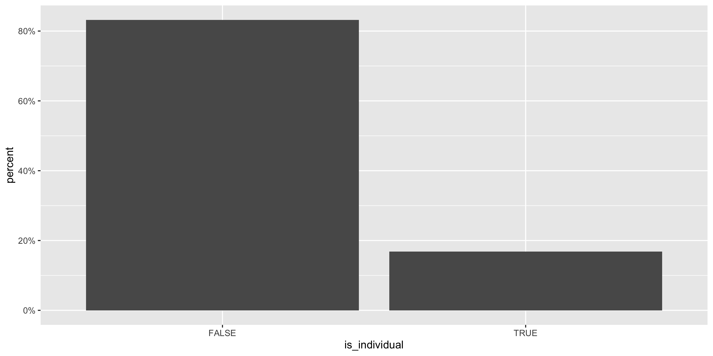
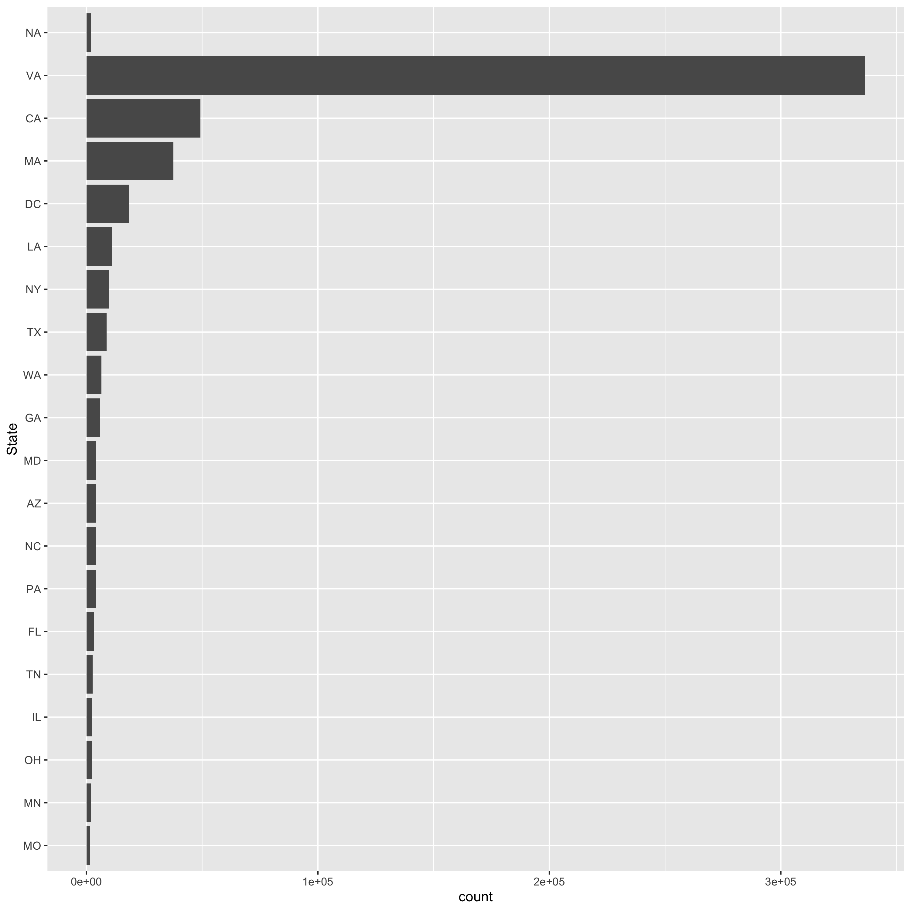
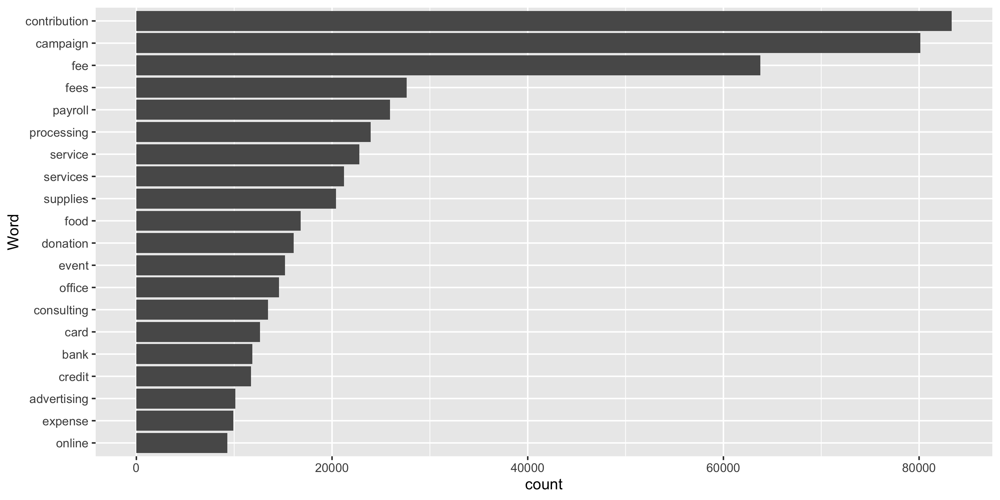
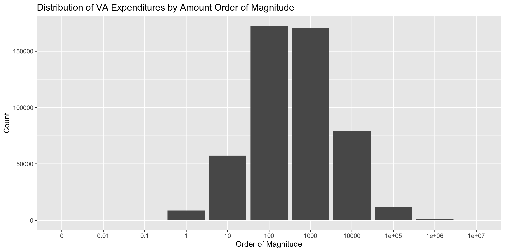
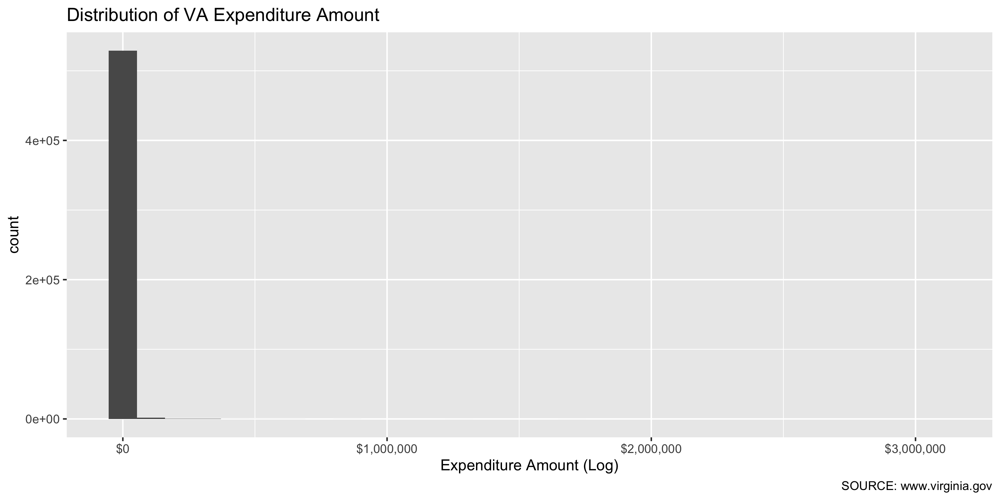
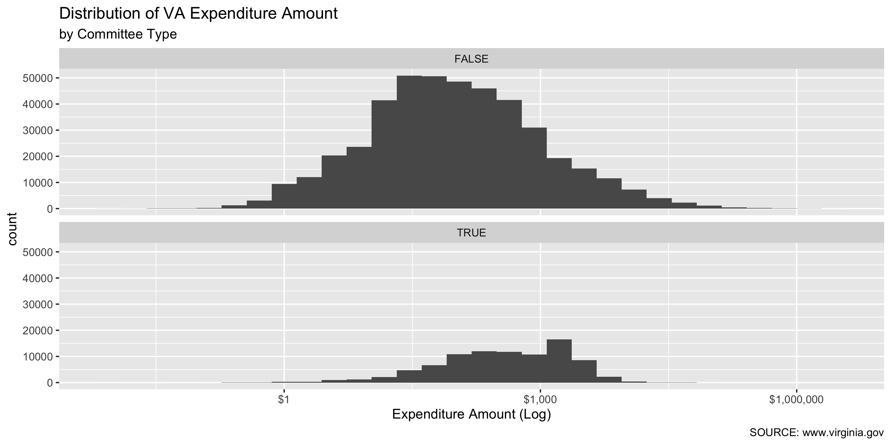
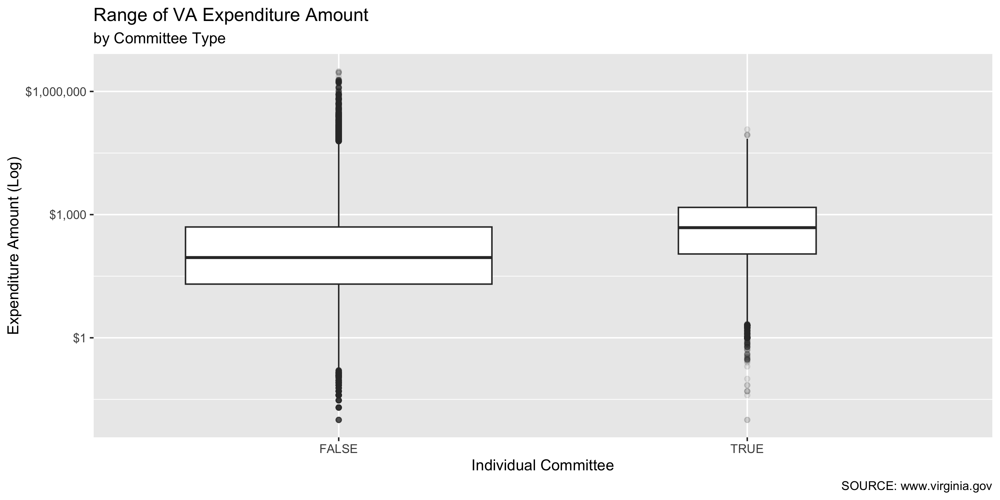
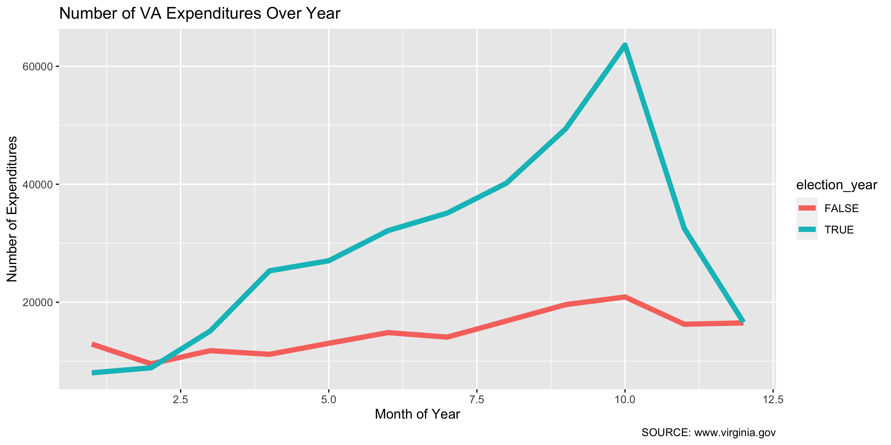
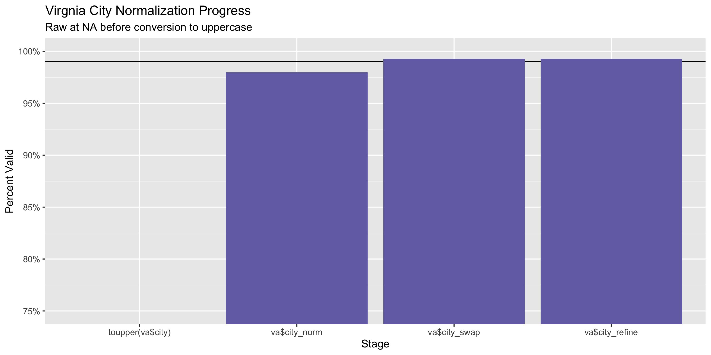
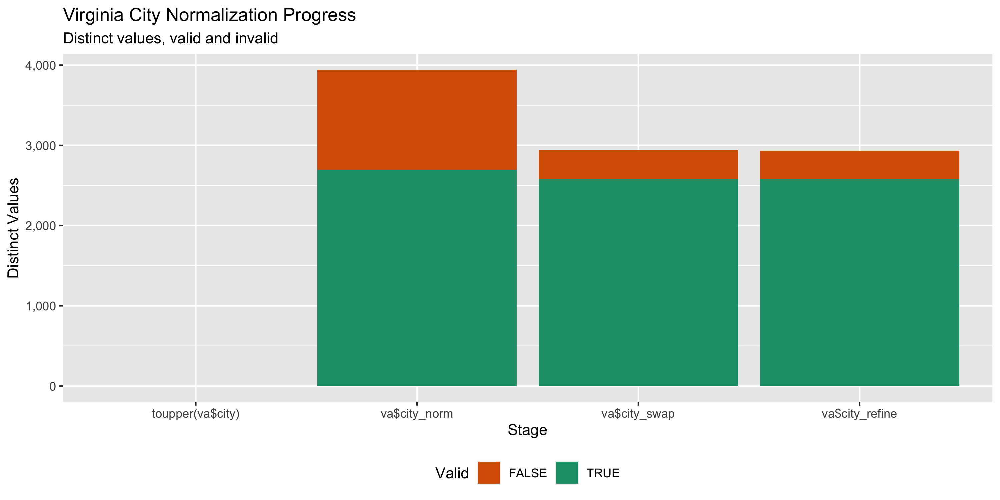

Virgina Expenditures Data Diary
================
Kiernan Nicholls & Yanqi Xu
2023-03-13 17:24:30

- <a href="#project" id="toc-project">Project</a>
- <a href="#objectives" id="toc-objectives">Objectives</a>
- <a href="#prerequisites" id="toc-prerequisites">Prerequisites</a>
- <a href="#data" id="toc-data">Data</a>
- <a href="#import" id="toc-import">Import</a>
- <a href="#fix" id="toc-fix">Fix</a>
- <a href="#explore" id="toc-explore">Explore</a>
- <a href="#wrangle" id="toc-wrangle">Wrangle</a>
- <a href="#export" id="toc-export">Export</a>

## Project

The Accountability Project is an effort to cut across data silos and
give journalists, policy professionals, activists, and the public at
large a simple way to search across huge volumes of public data about
people and organizations.

Our goal is to standardizing public data on a few key fields by thinking
of each dataset row as a transaction. For each transaction there should
be (at least) 3 variables:

1.  All **parties** to a transaction
2.  The **date** of the transaction
3.  The **amount** of money involved

## Objectives

This document describes the process used to complete the following
objectives:

1.  How many records are in the database?
2.  Check for duplicates
3.  Check ranges
4.  Is there anything blank or missing?
5.  Check for consistency issues
6.  Create a five-digit ZIP Code called `ZIP5`
7.  Create a `YEAR` field from the transaction date
8.  Make sure there is data on both parties to a transaction

## Prerequisites

The following packages are needed to collect, manipulate, visualize,
analyze, and communicate these results. The `pacman` package will
facilitate their installation and attachment.

``` r
pacman::p_load_gh("VerbalExpressions/RVerbalExpressions")
pacman::p_load_current_gh("irworkshop/campfin")
pacman::p_load(
  stringdist, # levenshtein value
  tidyverse, # data manipulation
  lubridate, # datetime strings
  tidytext, # text mining tools
  magrittr, # pipe opperators
  janitor, # dataframe clean
  zipcode, # clean & databse
  batman, # parse logicals
  refinr, # cluster & merge
  scales, #format strings
  rvest, # scrape website
  skimr, # summary stats
  vroom, # quickly read
  glue, # combine strings
  gluedown, #markdown
  here, # locate storage
  fs # search storage 
)
```

This document should be run as part of the `R_campfin` project, which
lives as a sub-directory of the more general, language-agnostic
[`irworkshop/accountability_datacleaning`](https://github.com/irworkshop/accountability_datacleaning "TAP repo")
GitHub repository.

The `R_campfin` project uses the [RStudio
projects](https://support.rstudio.com/hc/en-us/articles/200526207-Using-Projects "Rproj")
feature and should be run as such. The project also uses the dynamic
`here::here()` tool for file paths relative to *your* machine.

``` r
# where dfs this document knit?
here::here()
#> [1] "/Users/yanqixu/code/accountability_datacleaning"
```

## Data

Data is provided by the Virginia Department of Elections (ELECT). From
the campaign finance reporting home page, we can navigate to “Download
Campaign Finance Data” which takes us to the
[`SBE_CSV/CF/`](https://apps.elections.virginia.gov/SBE_CSV/CF/ "source")
subdirectory of the ELECT website.

On this page, there are additional subdirectories for each year from
1999 until 2012. There are additional subdirectories for each month from
January 2012 to June 2019.

The new update includes datasets from July 2019 to Nov. 2022.

Inside each subdirectory of `/SBE_CSV/CF/`, there are separate CSV files
for each form submitted by committees. Expenditure data is reported by
candidates and committees using “Schedule D” forms, as described by the
[ELECT
website](https://www.elections.virginia.gov/candidatepac-info/campaign-finance-disclosure-forms/index.html):

> Schedule D – Itemization of Expenditures Use to report all
> expenditures incurred by a committee.

From the [instructions on how to fill our Schedule D
forms](https://www.elections.virginia.gov/media/formswarehouse/Campaign-Finance/2018/CampaignFinance/Schedules/2014Schedule-D-Instructions.pdf "instructions"),
we know the following data is included:

1.  The full name of person or company paid and the complete mailing
    address of payee
2.  The description of the item or service purchased
3.  The name of the individual who authorized the expenditure
4.  The date the expense was incurred
5.  The amount of the expenditure

## Import

Schedule D bulk downloads are saved as CSV files, which can easily be
imported once downloaded.

### Download

In the yearly subdirectories (e.g., `/SBE_CSV/CF/2010/`), schedule D
data is separated into two files:

1.  `SBE_CSV/CF/2010/ScheduleD.csv` (5MB)
2.  `SBE_CSV/CF/2010/ScheduleD_PAC.csv` (115KB)

For years after 2011, the files are organized by month and are not
separated:

1.  `SBE_CSV/CF/2013_02/ScheduleD.csv`

We will start by downloading all the files separated by month from 2012
to January 2023. Next update should start February 2023.

First we need to create the URLs for each year/month combination.

``` r
#sub_dirs <- unlist(map(2012:2019, str_c, str_pad(1:12, 2, side = "left", pad = "0"), sep = "_"))
sub_dirs <- unlist(map(2012:2023, str_c, str_pad(1:12, 2, side = "left", pad = "0"), sep = "_"))
exp_urls <- sort(glue("https://apps.elections.virginia.gov/SBE_CSV/CF/{sub_dirs}/ScheduleD.csv"))
rep_urls <- sort(glue("https://apps.elections.virginia.gov/SBE_CSV/CF/{sub_dirs}/Report.csv"))
exp_urls <- exp_urls[3:(length(sub_dirs)-11)]
rep_urls <- rep_urls[3:(length(sub_dirs)-11)]
head(exp_urls)
```

    #> https://apps.elections.virginia.gov/SBE_CSV/CF/2012_03/ScheduleD.csv
    #> https://apps.elections.virginia.gov/SBE_CSV/CF/2012_04/ScheduleD.csv
    #> https://apps.elections.virginia.gov/SBE_CSV/CF/2012_05/ScheduleD.csv
    #> https://apps.elections.virginia.gov/SBE_CSV/CF/2012_06/ScheduleD.csv
    #> https://apps.elections.virginia.gov/SBE_CSV/CF/2012_07/ScheduleD.csv
    #> https://apps.elections.virginia.gov/SBE_CSV/CF/2012_08/ScheduleD.csv

``` r
exp_urls %>% 
  tail() %>% 
  md_code() %>% 
  md_bullet()
```

    #> * `https://apps.elections.virginia.gov/SBE_CSV/CF/2022_08/ScheduleD.csv`
    #> * `https://apps.elections.virginia.gov/SBE_CSV/CF/2022_09/ScheduleD.csv`
    #> * `https://apps.elections.virginia.gov/SBE_CSV/CF/2022_10/ScheduleD.csv`
    #> * `https://apps.elections.virginia.gov/SBE_CSV/CF/2022_11/ScheduleD.csv`
    #> * `https://apps.elections.virginia.gov/SBE_CSV/CF/2022_12/ScheduleD.csv`
    #> * `https://apps.elections.virginia.gov/SBE_CSV/CF/2023_01/ScheduleD.csv`

Then we can download these files to our `/data/raw/single/` directory.

``` r
raw_dir <- here("state","va", "expends", "data", "raw", "single")
dir_create(raw_dir)

raw_names <- basename(str_replace(exp_urls, "/(?=[^/]*$)", "_"))
rep_names <- basename(str_replace(rep_urls, "/(?=[^/]*$)", "_"))
raw_paths <- path(raw_dir, raw_names)
rep_paths <- path(dir_create(here("state","va", "expends", "data", "raw", "meta")), rep_names)
```

``` r
library(httr)    

for (i in seq_along(raw_paths)) {
  wait = 1
  if (file_exists(raw_paths[i])) {
    next("file already downloaded")
  } else {
 ua <- "Mozilla/5.0 (Linux; Android 6.0; Nexus 5 Build/MRA58N) AppleWebKit/537.36 (KHTML, like Gecko) Chrome/110.0.0.0 Mobile Safari/537.36"
    httr::GET(exp_urls[i],add_headers(`Connection` = "keep-alive", `User-Agent` = ua), write_disk(raw_paths[i]))
    x <- read_lines(raw_paths[i])
    if (str_starts(x[1], "#")) {
      next("file already fixed")
    } else {
      x <- str_replace_all(x, "(?<!^|,|\r\n)\"(?!,|\r\n|$)", "'")
      x <- c("### file fixed", x)
      write_lines(x, raw_paths[i])
      Sys.sleep(time = wait)
    }
  }
}

for (i in seq_along(rep_paths)) {
  wait = 0.5
  if (file_exists(rep_paths[i])) {
    next("file already downloaded")
  } else {
 ua <- "Mozilla/5.0 (Linux; Android 6.0; Nexus 5 Build/MRA58N) AppleWebKit/537.36 (KHTML, like Gecko) Chrome/110.0.0.0 Mobile Safari/537.36"
    httr::GET(rep_urls[i],add_headers(`Connection` = "keep-alive", `User-Agent` = ua), write_disk(rep_paths[i]))
      Sys.sleep(time = wait)
    }
  }
}
```

## Fix

To properly read the file into R, we first have to do some simple string
processing to the text file.

``` r
raw_info <- dir_info(raw_dir)
fix_dir <- dir_create(path(dirname(raw_dir), "fix"))
fix_eval <- length(dir_ls(fix_dir)) != nrow(raw_info)
```

``` r
# for old format files
for (f in raw_info$path) {
  n <- path(fix_dir, str_c("FIX", basename(f), sep = "_"))
  x <- read_lines(f, skip = 1)
  for (i in rev(seq_along(x))) {
    y <- i - 1
    if (y == 0) {
      next() # skip first
    } else if (str_starts(x[i], "\"\\d+\",") | str_ends(x[y], "\"(Y|N)\"")) {
      next() # skip if good
    } else { # merge if bad
      x[y] <- str_c(x[y], x[i])
      x <- x[-i] # remove bad
    }
  }
  x <- str_remove(x, '(?<=")"(?!,)')
  write_lines(x, n)
  message(basename(n))
}
```

``` r
# new format files
for (f in raw_info$path[1:length(raw_info$path)]) {
  n <- path(fix_dir, str_c("FIX", basename(f), sep = "_"))
  x <- read_lines(f, skip = 1)
  for (i in rev(seq_along(x))) {
    if (str_starts(x[i], "\\d+,\\d+,")) {
      next() # skip if good
    } else { # merge if bad
      x[i - 1] <- str_c(x[i - 1], x[i])
      x <- x[-i] # remove bad
    }
  }
  write_lines(x, n)
  message(basename(n))
}
```

``` r
fix_info <- as_tibble(dir_info(fix_dir))
sum(fix_info$size)
```

    #> 257M

``` r
fix_info %>% 
  select(path, size, modification_time) %>% 
  mutate(across(path, basename))
```

    #> # A tibble: 131 × 3
    #>    path                             size modification_time  
    #>    <chr>                     <fs::bytes> <dttm>             
    #>  1 FIX_2012_03_ScheduleD.csv       6.48K 2023-02-22 21:54:40
    #>  2 FIX_2012_04_ScheduleD.csv     981.71K 2023-02-22 22:33:28
    #>  3 FIX_2012_05_ScheduleD.csv      21.22K 2023-02-25 12:58:42
    #>  4 FIX_2012_06_ScheduleD.csv     405.02K 2023-02-25 12:44:15
    #>  5 FIX_2012_07_ScheduleD.csv       3.14M 2023-02-22 23:23:18
    #>  6 FIX_2012_08_ScheduleD.csv      69.23K 2023-02-22 23:23:18
    #>  7 FIX_2012_09_ScheduleD.csv     281.84K 2023-02-22 23:23:18
    #>  8 FIX_2012_10_ScheduleD.csv       1.38M 2023-02-22 23:23:19
    #>  9 FIX_2012_11_ScheduleD.csv      87.95K 2023-02-22 23:23:19
    #> 10 FIX_2012_12_ScheduleD.csv     261.77K 2023-02-22 23:23:19
    #> # … with 121 more rows

### Read

Since all recent files are located in the same directory with the same
structure, we can read them all at once by using `purrr::map()` to apply
`readr::read_csv()` to each file in the directory, then binding each
file into a single data frame using `dplyr::bind_rows()`.

We also need to read the related data on reports submitted by each
committee, which contain names and addresses of each committee. The
field we can join the report data by is `report_id`, which is unique.
Each committee could have multiple report ids, but not vice versa.

``` r
va <- 
  dir_ls(fix_dir, glob = "*.csv") %>% 
  map_dfr(
    read_delim,
    delim = ",",
    na = c("NA", "N/A", ""),
    escape_double = FALSE,
    col_types = cols(
      .default = col_character(),
      IsIndividual = col_logical(),
      TransactionDate = col_date("%m/%d/%Y"),
      Amount = col_double()
    )
  ) %>% 
    clean_names()

va_meta <- rep_paths %>% map_dfr(read_delim, delim = ",",
                                   na = c("NA", "N/A", ""),
                                 escape_double = TRUE, col_types = cols(
                                   .default = col_character(), ReportYear=col_integer(),
                                 )) %>% clean_names()

va_prev <- dir_ls(here("state", "va","expends", "data", "previous")) %>% 
                    read_delim(
    delim = ",",
    na = c("NA", "N/A", ""),
    escape_double = FALSE,
    col_types = cols(.default = col_character(),
                     IsIndividual = col_logical(),
                      TransactionDate = col_date("%m/%d/%Y"),
                      Amount = col_double())) %>% clean_names()
```

The older files, separated by payee type, have a different structure and
will have to be imported, explored, and cleaned separated from the
recent files.

## Explore

There are 1248841 records of 20 variables in the full database.

``` r
glimpse(sample_frac(va))
```

    #> Rows: 1,248,841
    #> Columns: 20
    #> $ schedule_d_id        <chr> "414622", "4137749", "2141716", "3553851", "1853557", "2179940", "31…
    #> $ report_id            <chr> "24519", "310749", "140839", "258260", "122290", "143273", "235434",…
    #> $ committee_contact_id <chr> "126217", "930126", NA, "690908", NA, "24899", NA, NA, "85406", NA, …
    #> $ first_name           <chr> NA, NA, NA, NA, NA, NA, "MARGARET", NA, NA, NA, NA, NA, NA, NA, NA, …
    #> $ middle_name          <chr> NA, NA, NA, NA, NA, NA, NA, NA, NA, NA, NA, NA, NA, NA, NA, NA, NA, …
    #> $ last_or_company_name <chr> "Victory Store", "Amazon Prime", "MIKE MASKELL FOR VIRGINIA BEACH CI…
    #> $ prefix               <chr> NA, NA, NA, NA, NA, NA, NA, NA, NA, NA, NA, NA, NA, NA, NA, NA, NA, …
    #> $ suffix               <chr> NA, NA, NA, NA, NA, NA, NA, NA, NA, NA, NA, NA, NA, NA, NA, NA, NA, …
    #> $ address_line1        <chr> "5200 SW 30th St", "410 Terry Avenue N", "4403 LISBON LN", "2500 Nim…
    #> $ address_line2        <chr> NA, NA, NA, NA, "Suite F", NA, NA, NA, NA, NA, NA, "# F8", NA, NA, N…
    #> $ city                 <chr> "Davenport", "Seattle", "VIRGINIA BEACH", "Virginia Beach", "Newport…
    #> $ state_code           <chr> "IA", "WA", "VA", "VA", "VA", "VA", "TX", "VA", "VA", "MA", "VA", "T…
    #> $ zip_code             <chr> "52802", "98109", "23462", "23456", "23607", "23111", "78745", "2360…
    #> $ is_individual        <lgl> FALSE, FALSE, FALSE, FALSE, FALSE, FALSE, TRUE, FALSE, FALSE, FALSE,…
    #> $ transaction_date     <date> 2013-07-19, 2022-12-14, 2018-05-13, 2021-08-31, 2017-08-28, 2018-03…
    #> $ amount               <dbl> 597.15, 16.15, 96.05, 3.00, 1300.00, 5.00, 50.00, 49.00, 123.99, 511…
    #> $ authorizing_name     <chr> "Stephanie Brewer", "John G. Selph", "Neil Reiff", "Karen Mallard", …
    #> $ item_or_service      <chr> "Signs", "Office expense", "Campaign Contribution", "Bank Fees", "Re…
    #> $ schedule_id          <chr> NA, NA, NA, NA, NA, NA, NA, NA, NA, NA, NA, NA, NA, NA, NA, NA, NA, …
    #> $ report_uid           <chr> "{191BF7FE-21F1-357C-654A-22A1B44729B5}", "{426241D9-C395-0D92-9A85-…

``` r
glimpse(sample_frac(va_meta))
```

    #> Rows: 128,544
    #> Columns: 39
    #> $ report_id                     <chr> "250882", "102118", "29350", "73154", "79378", "121778", "8…
    #> $ committee_code                <chr> "CC-19-00846", "CC-12-00368", "CC-13-00245", "CC-15-00388",…
    #> $ committee_name                <chr> "Friends of Cheryl Buford.", "Hutchinson for Herndon", "Fri…
    #> $ committee_type                <chr> "Candidate Campaign Committee", "Candidate Campaign Committ…
    #> $ candidate_name                <chr> "Cheryl  Buford", "Ms. Connie Haines Hutchinson", "Charles …
    #> $ is_state_wide                 <chr> "False", "False", "False", "False", "False", "False", "Fals…
    #> $ is_general_assembly           <chr> "False", "False", "False", "False", "False", "False", "True…
    #> $ is_local                      <chr> "True", "True", "True", "True", "True", "True", "False", "T…
    #> $ party                         <chr> "Independent", "Independent", "Republican", "Republican", "…
    #> $ fec_number                    <chr> NA, NA, NA, NA, NA, NA, NA, NA, NA, NA, NA, NA, NA, NA, NA,…
    #> $ report_year                   <int> 2021, 2016, 2013, 2015, 2015, 2017, 2015, 2022, 2019, 2018,…
    #> $ filing_date                   <chr> "2021-08-17 10:33:05.793000000", "2016-10-31 10:17:34.00700…
    #> $ start_date                    <chr> "2021-07-01 00:00:00", "2016-10-01 00:00:00", "2013-10-01 0…
    #> $ end_date                      <chr> "2021-12-31 00:00:00", "2016-10-26 00:00:00", "2013-10-23 0…
    #> $ address_line1                 <chr> "PO Box 292", "1019 Van Buren Street", "252 East High Stree…
    #> $ address_line2                 <chr> NA, NA, NA, NA, NA, NA, NA, NA, NA, NA, "P.O. Box 104", NA,…
    #> $ address_line3                 <chr> NA, NA, NA, NA, NA, NA, NA, NA, NA, NA, NA, NA, NA, NA, NA,…
    #> $ city                          <chr> "McLean", "Herndon", "Charlottesville", "Quicksburg", "Glen…
    #> $ state_code                    <chr> "VA", "VA", "VA", "VA", "VA", "VA", "VA", "VA", "VA", "VA",…
    #> $ zip_code                      <chr> "22101", "20170", "22902", "22847", "23233", "22963", "2012…
    #> $ filing_type                   <chr> "Report", "Report", "Report", "Report", "Large Contribution…
    #> $ is_final_report               <chr> "True", "False", "False", "False", "False", "False", "False…
    #> $ is_amendment                  <chr> "False", "False", "False", "False", "False", "False", "True…
    #> $ amendment_count               <chr> "0", "0", "0", "0", "0", "0", "1", "0", "0", "1", "0", "2",…
    #> $ submitter_phone               <chr> "703-299-7572", "703-501-6282", "4342425753", "540.233.2113…
    #> $ submitter_email               <chr> "george_croft@hotmail.com", "conniehutch072@hotmail.com", "…
    #> $ election_cycle                <chr> "11/2023", "11/2016", "11/2013", "11/2015", "11/2015", "11/…
    #> $ election_cycle_start_date     <chr> "2020-01-01 00:00:00", "2015-01-01 00:00:00", "2010-01-01 0…
    #> $ election_cycle_end_date       <chr> "2023-12-31 00:00:00", "2016-12-31 00:00:00", "2013-12-31 0…
    #> $ office_sought                 <chr> "Member School Board At Large", "Member Town Council - Hern…
    #> $ district                      <chr> NA, "Town - HERNDON", NA, NA, "Election - THREE CHOPT DISTR…
    #> $ no_activity                   <chr> "False", "False", "False", "False", "False", "False", "Fals…
    #> $ balance_last_reporting_period <chr> "1147.34", "147.01", "9489.60", "7125.69", NA, "203.20", "6…
    #> $ date_of_referendum            <chr> NA, NA, NA, NA, NA, NA, NA, NA, NA, NA, NA, NA, NA, NA, NA,…
    #> $ submitted_date                <chr> "2021-08-17 10:35:26.307000000", "2016-10-31 10:22:07.35700…
    #> $ account_id                    <chr> "{6026BCD1-B984-E911-ACC7-984BE103F032}", "{CFF74F5F-607E-E…
    #> $ due_date                      <chr> "2022-01-18 23:59:59", "2016-10-31 23:59:00", "2013-10-28 1…
    #> $ is_xml_upload                 <chr> "False", "False", "False", "False", "False", "False", "Fals…
    #> $ report_uid                    <chr> "{9070A812-CD5B-83A8-A18A-4500A9124123}", "{326F7AA0-5145-F…

``` r
va_meta <- va_meta %>% select(report_id,candidate_name, committee_name,office_sought, city, address_line1, address_line2, address_line3, state_code, zip_code)

va_meta <- va_meta %>% rename_at(vars(5:10), ~paste0("com_",.))
```

``` r
va <- va %>% left_join(va_meta, by = "report_id")

va <- va %>% filter(schedule_d_id %out% va_prev$schedule_d_id)

va %>% filter(committee_name %>% is.na()) %>% nrow()
```

    #> [1] 0

``` r
va_prev <- va_prev %>% rename_at(vars(starts_with("committee")), ~sub("committee","com", .x)) %>% glimpse()
```

    #> Rows: 717,386
    #> Columns: 49
    #> $ schedule_d_id                 <chr> "94", "95", "96", "97", "98", "99", "100", "101", "102", "1…
    #> $ report_id                     <chr> "42", "42", "42", "42", "42", "42", "42", "42", "42", "42",…
    #> $ com_contact_id                <chr> "888", "888", "888", "888", "888", "888", "888", "888", "88…
    #> $ first_name                    <chr> NA, NA, NA, NA, NA, NA, NA, NA, NA, NA, NA, NA, NA, NA, NA,…
    #> $ middle_name                   <chr> NA, NA, NA, NA, NA, NA, NA, NA, NA, NA, NA, NA, NA, NA, NA,…
    #> $ last_or_company_name          <chr> "Staples", "Staples", "Staples", "Staples", "Staples", "Sta…
    #> $ prefix                        <chr> NA, NA, NA, NA, NA, NA, NA, NA, NA, NA, NA, NA, NA, NA, NA,…
    #> $ suffix                        <chr> NA, NA, NA, NA, NA, NA, NA, NA, NA, NA, NA, NA, NA, NA, NA,…
    #> $ address_line1                 <chr> "295 Worth Avenue", "295 Worth Avenue", "295 Worth Avenue",…
    #> $ address_line2                 <chr> NA, NA, NA, NA, NA, NA, NA, NA, NA, NA, NA, NA, NA, "#100",…
    #> $ city                          <chr> "Stafford", "Stafford", "Stafford", "Stafford", "Stafford",…
    #> $ state_code                    <chr> "VA", "VA", "VA", "VA", "VA", "VA", "VA", "VA", "VA", "VA",…
    #> $ zip_code                      <chr> "22554", "22554", "22554", "22554", "22554", "22554", "2255…
    #> $ is_individual                 <lgl> FALSE, FALSE, FALSE, FALSE, FALSE, FALSE, FALSE, FALSE, FAL…
    #> $ transaction_date              <date> 2012-02-19, 2012-02-25, 2012-02-26, 2012-02-27, 2012-03-03…
    #> $ amount                        <dbl> 6.81, 60.70, 56.70, 13.11, 72.23, 127.90, 24.49, 168.53, 14…
    #> $ authorizing_name              <chr> "Jac Starkey", "Jac Starkey", "Jac Starkey", "Jac Starkey",…
    #> $ item_or_service               <chr> "Name Tags", "Palm Cards", "Palm Cards", "Mailing Labels", …
    #> $ schedule_id                   <chr> NA, NA, NA, NA, NA, NA, NA, NA, NA, NA, NA, NA, NA, NA, NA,…
    #> $ com_code                      <chr> "CC-12-00203", "CC-12-00203", "CC-12-00203", "CC-12-00203",…
    #> $ com_name                      <chr> "Starkey for Supervisor", "Starkey for Supervisor", "Starke…
    #> $ com_type                      <chr> "Candidate Campaign Committee", "Candidate Campaign Committ…
    #> $ candidate_name                <chr> "Jac Starkey", "Jac Starkey", "Jac Starkey", "Jac Starkey",…
    #> $ fec_number                    <chr> NA, NA, NA, NA, NA, NA, NA, NA, NA, NA, NA, NA, NA, NA, NA,…
    #> $ report_year                   <chr> "2012", "2012", "2012", "2012", "2012", "2012", "2012", "20…
    #> $ filing_date                   <chr> "2012-03-26 17:17:09.780000000", "2012-03-26 17:17:09.78000…
    #> $ start_date                    <chr> "2012-01-01 00:00:00", "2012-01-01 00:00:00", "2012-01-01 0…
    #> $ end_date                      <chr> "2012-03-23 00:00:00", "2012-03-23 00:00:00", "2012-03-23 0…
    #> $ com_address_line1             <chr> "52 Brush Everard Court", "52 Brush Everard Court", "52 Bru…
    #> $ com_address_line2             <chr> NA, NA, NA, NA, NA, NA, NA, NA, NA, NA, NA, NA, NA, NA, NA,…
    #> $ com_address_line3             <chr> NA, NA, NA, NA, NA, NA, NA, NA, NA, NA, NA, NA, NA, NA, NA,…
    #> $ com_city                      <chr> "Stafford", "Stafford", "Stafford", "Stafford", "Stafford",…
    #> $ com_state_code                <chr> NA, NA, NA, NA, NA, NA, NA, NA, NA, NA, NA, NA, NA, NA, NA,…
    #> $ com_zip_code                  <chr> "22554", "22554", "22554", "22554", "22554", "22554", "2255…
    #> $ filing_type                   <chr> "Report", "Report", "Report", "Report", "Report", "Report",…
    #> $ is_final_report               <chr> "False", "False", "False", "False", "False", "False", "Fals…
    #> $ is_amendment                  <chr> "False", "False", "False", "False", "False", "False", "Fals…
    #> $ amendment_count               <chr> "0", "0", "0", "0", "0", "0", "0", "0", "0", "0", "0", "0",…
    #> $ submitter_phone               <chr> "540-374-5032", "540-374-5032", "540-374-5032", "540-374-50…
    #> $ submitter_email               <chr> "bsaller@cox.net", "bsaller@cox.net", "bsaller@cox.net", "b…
    #> $ election_cycle                <chr> "4/2012", "4/2012", "4/2012", "4/2012", "4/2012", "4/2012",…
    #> $ election_cycle_start_date     <chr> "2008-01-01 00:00:00", "2008-01-01 00:00:00", "2008-01-01 0…
    #> $ election_cycle_end_date       <chr> "2012-12-31 00:00:00", "2012-12-31 00:00:00", "2012-12-31 0…
    #> $ office_sought                 <chr> "Member Board of Supervisors", "Member Board of Supervisors…
    #> $ district                      <chr> "Election - GARRISONVILLE", "Election - GARRISONVILLE", "El…
    #> $ no_activity                   <chr> "False", "False", "False", "False", "False", "False", "Fals…
    #> $ balance_last_reporting_period <chr> ".00", ".00", ".00", ".00", ".00", ".00", ".00", ".00", ".0…
    #> $ date_of_referendum            <chr> NA, NA, NA, NA, NA, NA, NA, NA, NA, NA, NA, NA, NA, NA, NA,…
    #> $ submitted_date                <chr> "2012-03-26 17:20:45.740000000", "2012-03-26 17:20:45.74000…

``` r
va_new <- va_prev %>% 
  rename(committee_contact_id = com_contact_id,
         committee_name = com_name) %>% 
  bind_rows(va)
```

### Distinct

The variables range in their degree of distinctness.

``` r
va %>% 
  map(n_distinct) %>% 
  unlist() %>% 
  enframe(name = "variable", value = "n_distinct") %>% 
  mutate(prop_distinct = round(n_distinct / nrow(va), 4))
```

    #> # A tibble: 29 × 3
    #>    variable             n_distinct prop_distinct
    #>    <chr>                     <int>         <dbl>
    #>  1 schedule_d_id            531518        1     
    #>  2 report_id                 28683        0.054 
    #>  3 committee_contact_id      90729        0.171 
    #>  4 first_name                 6365        0.012 
    #>  5 middle_name                 783        0.0015
    #>  6 last_or_company_name      47197        0.0888
    #>  7 prefix                        1        0     
    #>  8 suffix                        1        0     
    #>  9 address_line1             60326        0.114 
    #> 10 address_line2              3792        0.0071
    #> # … with 19 more rows

We can explore the distribution of the least distinct values with
`ggplot2::geom_bar()`.

<!-- -->

Or, filter the data and explore the most frequent discrete data.

<!-- -->

The `item_or_service` variable is an open-ended text field, so we can
only analyze it by frequency or word tokens.

``` r
va %>% 
  unnest_tokens(word, item_or_service) %>% 
  mutate(word = str_to_lower(word)) %>%
  count(word, sort = TRUE) %>% 
  anti_join(stop_words) %>% 
  head(20) %>% 
  ggplot() + 
  geom_col(aes(reorder(word, n), n)) +
  coord_flip() +
  labs(x = "Word", y = "count")
```

<!-- -->

### Missing

The variables also vary in their degree of values that are `NA`
(missing).

``` r
va %>% 
  map(function(var) sum(is.na(var))) %>% 
  unlist() %>% 
  enframe(name = "variable", value = "n_na") %>% 
  mutate(prop_na = n_na / nrow(va))
```

    #> # A tibble: 29 × 3
    #>    variable               n_na   prop_na
    #>    <chr>                 <int>     <dbl>
    #>  1 schedule_d_id             0 0        
    #>  2 report_id                 0 0        
    #>  3 committee_contact_id 214010 0.403    
    #>  4 first_name           442318 0.832    
    #>  5 middle_name          519344 0.977    
    #>  6 last_or_company_name     12 0.0000226
    #>  7 prefix               531518 1        
    #>  8 suffix               531518 1        
    #>  9 address_line1          1808 0.00340  
    #> 10 address_line2        446200 0.839    
    #> # … with 19 more rows

### Duplicates

We can use `janitor::get_dupes()` to create a table only including
records that are completely duplicated across every row, aside from the
uniqe `schedule_d_id` variable.

``` r
va_dupes <- va %>% 
  select(-schedule_d_id) %>% 
  get_dupes() %>% 
  distinct() %>% 
  mutate(dupe_flag = TRUE)
```

There are 4942 distinct duplicated records in this database, covering
13286 total records. It’s entirely possible that two expenditures can be
made by the same committee, to the same payeee, of the same amount, on
the same day, for the same purpose. However, we will flag these records
with `dupe_flag` nonetheless.

``` r
va_dupes %>% 
  tabyl(item_or_service) %>%
  as_tibble() %>% 
  arrange(desc(n)) %>% 
  mutate(cum_percent = cumsum(percent))
```

    #> # A tibble: 713 × 5
    #>    item_or_service                 n percent valid_percent cum_percent
    #>    <chr>                       <int>   <dbl>         <dbl>       <dbl>
    #>  1 Contribution Fee              943  0.191         0.191        0.191
    #>  2 Contribution Refund           230  0.0465        0.0466       0.237
    #>  3 Refund to Contributor         210  0.0425        0.0425       0.280
    #>  4 Processing Fee                195  0.0395        0.0395       0.319
    #>  5 Contribution processing fee   151  0.0306        0.0306       0.350
    #>  6 Processing fee                133  0.0269        0.0269       0.377
    #>  7 Fee                           130  0.0263        0.0263       0.403
    #>  8 Wire Fee                      109  0.0221        0.0221       0.425
    #>  9 Bank Fee                      108  0.0219        0.0219       0.447
    #> 10 Advertising                    70  0.0142        0.0142       0.461
    #> # … with 703 more rows

``` r
va <- va %>%
  left_join(va_dupes) %>% 
  mutate(dupe_flag = !is.na(dupe_flag))
```

### Ranges

It’s important to ensure the ranges for continuous variables makes
sense; that there aren’t any old or future dates or trillion dollar
expenditures. We can explore these variables with `ggplot2::ggplot()`
functions and `base::summary()`.

#### Amounts

The expenditure `amount` variable contains the USD value of the
expenditure and can reasonably reach millions of dollars. This dataset
contains 0 records with an `amount` value less than zero, which
sometimes indicate expenditure correction filings. There are however 8
records with an `amount` value *of* zero.

``` r
summary(va$amount)
```

    #>      Min.   1st Qu.    Median      Mean   3rd Qu.      Max. 
    #>       0.0      25.0     117.2    2005.5     596.8 3078578.5

``` r
va %>% filter(amount == max(amount, na.rm = TRUE)) %>% glimpse()
```

    #> Rows: 1
    #> Columns: 31
    #> $ schedule_d_id        <chr> "3607640"
    #> $ report_id            <chr> "262144"
    #> $ committee_contact_id <chr> NA
    #> $ first_name           <chr> NA
    #> $ middle_name          <chr> NA
    #> $ last_or_company_name <chr> "Grassroots Media LLC"
    #> $ prefix               <chr> NA
    #> $ suffix               <chr> NA
    #> $ address_line1        <chr> "2 Bala Blaza"
    #> $ address_line2        <chr> "Ste 300"
    #> $ city                 <chr> "Bala Cynwyd"
    #> $ state_code           <chr> "PA"
    #> $ zip_code             <chr> "19004"
    #> $ is_individual        <lgl> FALSE
    #> $ transaction_date     <date> 2021-10-21
    #> $ amount               <dbl> 3078578
    #> $ authorizing_name     <chr> "Lillie Louise Lucas"
    #> $ item_or_service      <chr> "Media Buy"
    #> $ schedule_id          <chr> NA
    #> $ report_uid           <chr> "{995FA0DA-EBC4-934C-2D45-D4C7004FC35D}"
    #> $ candidate_name       <chr> "Gov. Terrance Richard McAuliffe"
    #> $ committee_name       <chr> "Terry for Virginia"
    #> $ office_sought        <chr> "Governor"
    #> $ com_city             <chr> "Arlington"
    #> $ com_address_line1    <chr> "PO Box 26112"
    #> $ com_address_line2    <chr> NA
    #> $ com_address_line3    <chr> NA
    #> $ com_state_code       <chr> "VA"
    #> $ com_zip_code         <chr> "22215"
    #> $ dupe_count           <int> NA
    #> $ dupe_flag            <lgl> FALSE

We can visually explore the distribution and range of `amount` values
using `ggplot2::geom_histogram()` and `ggplot2::geom_boxplot()`.

Expenditures have a Log-normal distribution, with the vast majority of
expenditures around the mean of \$1,385.

``` r
va %>% 
  select(amount) %>% 
  mutate(oom = 10^(ceiling(log10(amount)))) %>% 
  count(oom) %>% 
  arrange(oom) %>%
  mutate(oom = as.ordered(oom)) %>% 
  ggplot() +
  geom_col(aes(oom, n)) +
  labs(
    title = "Distribution of VA Expenditures by Amount Order of Magnitude",
    x = "Order of Magnitude",
    y = "Count"
  )
```

<!-- -->

<!-- -->

We will have to transform the x-axis logarithmically to find patterns in
the distribution.

<!-- -->

We can use `ggplot2::facet_wrap()` to explore that distribution for both
individual (candidate) committees and more general issue committees.

<!-- -->

<!-- -->

<!-- -->

### Dates

The quasi-continuous variable `transaction_date` should also be explored
for a reasonable range. There are no expenditures made before 2008-10-15
and 0 expenditures reported as being made in the future.

``` r
summary(va$transaction_date)
#>         Min.      1st Qu.       Median         Mean      3rd Qu.         Max. 
#> "2008-10-15" "2019-10-15" "2021-02-26" "2020-10-09" "2021-10-06" "2023-01-30"
```

<!-- -->

<!-- -->

## Wrangle

To improve the searchability of the data on the TAP website, we will
endeavor to normalize character strings, correct misspellings, flag
undisambiguatable values. Original variables will remain immutable, all
records will be preserved, and manipulated versions of each variable
take the form `*_clean`.

### Year

Create a `transaction_year` variable from `transaction_date` using
`lubridate::year()` after parsing the character string earlier with
`readr::col_date()`.

``` r
va <- va %>% mutate(transaction_year = year(transaction_date))
```

### Address

The `address` variable should be minimally cleaned by removing
punctuation and fixing white-space.

``` r
va <- va %>% 
 unite(
    col = address_full,
    starts_with("address_"),
    sep = " ",
    remove = FALSE,
    na.rm = TRUE
  ) %>% 
  # normalize combined addr
  mutate(
    address_clean = normal_address(
      address = address_full,
      abbs = usps_street,
      na_rep = TRUE
    )
  ) %>% 
  select(-address_full)
```

``` r
va <- va %>% 
 unite(
    col = address_full,
    starts_with("com_address_"),
    sep = " ",
    remove = FALSE,
    na.rm = TRUE
  ) %>% 
  # normalize combined addr
  mutate(
    com_address_clean = normal_address(
      address = address_full,
      abbs = usps_street,
      na_rep = TRUE
    )
  ) %>% 
  select(-address_full)
```

### ZIP

For ZIP codes, the `campfin::normal_zip()` function will attempt to
create valid *five* digit codes by removing the ZIP+4 suffix and
returning leading zeroes dropped by other programs like Microsoft Excel.

``` r
va <- va %>% 
  mutate_at(
    .vars = vars(ends_with("zip_code")),
    .funs = list(norm = normal_zip),
    na_rep = TRUE
  )
```

### State

Using comprehensive list of state abbreviations in the Zipcodes
database, we can isolate invalid `state` values and manually correct
them.

``` r
valid_state <- c(unique(campfin::zipcodes$state), "AB", "BC", "MB", "NB", "NS", "ON", "PE", "QC", "SK")
length(valid_state)
#> [1] 71
setdiff(valid_state, state.abb)
#>  [1] "PR" "VI" "AE" "DC" "AA" "AP" "AS" "GU" "PW" "FM" "MP" "MH" "AB" "BC" "MB" "NB" "NS" "ON" "PE"
#> [20] "QC" "SK"
```

``` r
setdiff(va$state_code, valid_state)
#> [1] NA
va <- va %>%
    mutate_at(
    .vars = vars(ends_with("state_code")),
    .funs = list(norm = normal_state),
    abbreviate = TRUE,
    na_rep = TRUE,
    valid = NULL
  )
```

### City

``` r
valid_city <- unique(campfin::zipcodes$city)
n_distinct(va$city)
#> [1] 5348
mean(va$city %in% campfin::zipcodes$city)
#> [1] 0.0949187
```

Cleaning city values is the most complicated. This process involves four
steps:

1.  Prepare raw city values by removing invalid data and reducing
    inconsistencies
2.  Match prepared city values with the *actual* city name of that
    record’s ZIP code
3.  swap prepared city values with the ZIP code match *if* only 1 edit
    is needed
4.  Refine swapped city values with key collision and n-gram
    fingerprints

#### Normalize

We will use the `prep_city()` function in the `/R` directory to
normalize the strings, remove some common `NA` values, and lop
abbreviations off the end of the string.

``` r
va <- va %>% 
    mutate_at(
    .vars = vars(ends_with("city")),
    .funs = list(norm = normal_city),
    abbs = usps_city,
    states = c("VA", "VIRGINIA", "MA", "DC", "TX"),
    na = invalid_city,
    na_rep = TRUE
  )

n_distinct(va$city_norm)
#> [1] 3942
```

#### Match

To disambiguate the city values, we will look at the *expected* city
name for a given ZIP code. We can calculate the edit distance between
each original value and the expected value.

``` r
va <- va %>%
  left_join(
    zipcodes,
    by = c(
      "state_code_norm" = "state",
      "zip_code_norm" = "zip"
    )
  ) %>%
  rename(city = city.x, city_match = city.y) %>%
  mutate(match_dist = stringdist(city_norm, city_match))
```

``` r
summary(va$match_dist)
```

    #>    Min. 1st Qu.  Median    Mean 3rd Qu.    Max.    NA's 
    #>   0.000   0.000   0.000   0.433   0.000  35.000   11630

``` r
va %>% 
  count(perf_match = match_dist == 0) %>% 
  mutate(p = n/sum(n))
```

    #> # A tibble: 3 × 3
    #>   perf_match      n      p
    #>   <lgl>       <int>  <dbl>
    #> 1 FALSE       32894 0.0619
    #> 2 TRUE       486994 0.916 
    #> 3 NA          11630 0.0219

``` r
va %>% 
    filter(match_dist == 1) %>% 
    count(city_norm, city_match, sort = TRUE)
```

    #> # A tibble: 681 × 3
    #>    city_norm     city_match        n
    #>    <chr>         <chr>         <int>
    #>  1 SOMMERVILLE   SOMERVILLE      622
    #>  2 SAN FRANSISCO SAN FRANCISCO   505
    #>  3 CENTERVILLE   CENTREVILLE     247
    #>  4 MENIO PARK    MENLO PARK      223
    #>  5 MC LEAN       MCLEAN          151
    #>  6 MENLOW PARK   MENLO PARK      126
    #>  7 SAN JOE       SAN JOSE        104
    #>  8 SOMERVBILLE   SOMERVILLE       99
    #>  9 WINSTONSALEM  WINSTON SALEM    94
    #> 10 MOUTAIN VIEW  MOUNTAIN VIEW    86
    #> # … with 671 more rows

#### Swap

If the edit distance is less than or equal to two, we can fairly safely
use the actual, expected value instead of the original value.

``` r
va <- va %>% 
  mutate(
    city_swap = if_else(
      condition = match_dist <= 2, 
      true = city_match, 
      false = city_norm
    )
  )

n_distinct(va$city_swap)
#> [1] 2943

va <- va %>% 
rename(com_city_raw = city) %>% 
  left_join(
    y = zipcodes,
    by = c(
      "com_state_code_norm" = "state",
      "com_zip_code_norm" = "zip"
    )
  ) %>% 
  rename(com_city_match = city) %>% 
  mutate(
    match_abb = is_abbrev(com_city_norm,com_city_match),
    match_dist = str_dist(com_city_norm,com_city_match),
    com_city_swap = if_else(
      condition = !is.na(com_city_match) & (match_abb | match_dist == 1),
      true = com_city_match, 
      false = com_city_norm
    )
  ) %>% 
  select(
    -com_city_match,
    -match_abb,
    -match_dist
  ) %>% glimpse()
#> Rows: 531,518
#> Columns: 43
#> $ schedule_d_id        <chr> "69434", "69435", "113292", "2430085", "2430086", "2430087", "243008…
#> $ report_id            <chr> "4932", "4932", "7809", "159729", "159729", "159729", "159729", "159…
#> $ committee_contact_id <chr> "2711", "2712", "31230", "514564", "514564", "514564", "514564", "54…
#> $ first_name           <chr> NA, "Diana", NA, NA, NA, NA, NA, NA, NA, NA, NA, NA, NA, "Randy", NA…
#> $ middle_name          <chr> NA, NA, NA, NA, NA, NA, NA, NA, NA, NA, NA, NA, NA, NA, NA, NA, NA, …
#> $ last_or_company_name <chr> "Virginia State Board of Elections", "Venskus", "Kathy Graziano for …
#> $ prefix               <chr> NA, NA, NA, NA, NA, NA, NA, NA, NA, NA, NA, NA, NA, NA, NA, NA, NA, …
#> $ suffix               <chr> NA, NA, NA, NA, NA, NA, NA, NA, NA, NA, NA, NA, NA, NA, NA, NA, NA, …
#> $ address_line1        <chr> "1100 Bank St., Richmond, VA 23219.", "6620  Goldsboro Road", "6948 …
#> $ address_line2        <chr> NA, NA, NA, NA, NA, NA, NA, NA, NA, NA, NA, NA, NA, "117", NA, "7th …
#> $ com_city_raw         <chr> "Richmond", "Falls Church", "Richmond", "Lexington", "Lexington", "L…
#> $ state_code           <chr> "VA", "VA", "VA", "MN", "MN", "MN", "MN", "VA", "VA", "VA", "VA", "V…
#> $ zip_code             <chr> "23219", "22042", "23225", "23114", "23114", "23114", "23114", "2311…
#> $ is_individual        <lgl> FALSE, TRUE, FALSE, FALSE, FALSE, FALSE, FALSE, FALSE, FALSE, FALSE,…
#> $ transaction_date     <date> 2012-02-12, 2012-02-12, 2012-04-05, 2019-01-07, 2019-02-07, 2019-03…
#> $ amount               <dbl> 10.00, 215.67, 250.00, 18.00, 18.00, 18.00, 76.98, 20.00, 58.96, 25.…
#> $ authorizing_name     <chr> "Diana Venskus", "Sydney Sawyer", "Craig Toalson", "Arika Phillips",…
#> $ item_or_service      <chr> "Registration fee for SBE/Comet Training", "Reimbursement for award …
#> $ schedule_id          <chr> NA, NA, NA, NA, NA, NA, NA, NA, NA, NA, NA, NA, NA, NA, NA, NA, NA, …
#> $ report_uid           <chr> "{FDE858CD-6D65-797B-B546-8DC6C547F408}", "{FDE858CD-6D65-797B-B546-…
#> $ candidate_name       <chr> NA, NA, NA, "Mrs. Arika  Phillips", "Mrs. Arika  Phillips", "Mrs. Ar…
#> $ committee_name       <chr> "Virginia Physical Therapy Association - PAC", "Virginia Physical Th…
#> $ office_sought        <chr> NA, NA, NA, "Member School Board", "Member School Board", "Member Sc…
#> $ com_city             <chr> "Clifton", "Clifton", "Richmond", "Midlothian", "Midlothian", "Midlo…
#> $ com_address_line1    <chr> "11907 Henderson Court", "11907 Henderson Court", "400 N. Ridge Rd",…
#> $ com_address_line2    <chr> NA, NA, NA, NA, NA, NA, NA, NA, NA, NA, NA, NA, NA, NA, NA, NA, NA, …
#> $ com_address_line3    <chr> NA, NA, NA, NA, NA, NA, NA, NA, NA, NA, NA, NA, NA, NA, NA, NA, NA, …
#> $ com_state_code       <chr> "VA", "VA", "VA", "VA", "VA", "VA", "VA", "VA", "VA", "VA", "VA", "V…
#> $ com_zip_code         <chr> "20124", "20124", "23229", "23113", "23113", "23113", "23113", "2311…
#> $ dupe_count           <int> NA, NA, NA, NA, NA, NA, NA, NA, NA, NA, NA, NA, NA, NA, NA, NA, NA, …
#> $ dupe_flag            <lgl> FALSE, FALSE, FALSE, FALSE, FALSE, FALSE, FALSE, FALSE, FALSE, FALSE…
#> $ transaction_year     <dbl> 2012, 2012, 2012, 2019, 2019, 2019, 2019, 2019, 2019, 2019, 2019, 20…
#> $ address_clean        <chr> "1100 BANK ST RICHMOND VA 23219", "6620 GOLDSBORO RD", "6948 FOREST …
#> $ com_address_clean    <chr> "11907 HENDERSON CT", "11907 HENDERSON CT", "400 N RIDGE RD", "PO BO…
#> $ zip_code_norm        <chr> "23219", "22042", "23225", "23114", "23114", "23114", "23114", "2311…
#> $ com_zip_code_norm    <chr> "20124", "20124", "23229", "23113", "23113", "23113", "23113", "2311…
#> $ state_code_norm      <chr> "VA", "VA", "VA", "MN", "MN", "MN", "MN", "VA", "VA", "VA", "VA", "V…
#> $ com_state_code_norm  <chr> "VA", "VA", "VA", "VA", "VA", "VA", "VA", "VA", "VA", "VA", "VA", "V…
#> $ city_norm            <chr> "RICHMOND", "FALLS CHURCH", "RICHMOND", "LEXINGTON", "LEXINGTON", "L…
#> $ com_city_norm        <chr> "CLIFTON", "CLIFTON", "RICHMOND", "MIDLOTHIAN", "MIDLOTHIAN", "MIDLO…
#> $ city_match           <chr> "RICHMOND", "FALLS CHURCH", "RICHMOND", NA, NA, NA, NA, "MIDLOTHIAN"…
#> $ city_swap            <chr> "RICHMOND", "FALLS CHURCH", "RICHMOND", NA, NA, NA, NA, "MIDLOTHIAN"…
#> $ com_city_swap        <chr> "CLIFTON", "CLIFTON", "RICHMOND", "MIDLOTHIAN", "MIDLOTHIAN", "MIDLO…
```

There are still 25103 records with a `city_swap` value not in our list
of valid city names. Many, if not most, of these values are actually
acceptable city names that are simply not in our list.

``` r
va %>% 
  filter(city_swap %out% valid_city) %>%
  count(city_swap, sort = TRUE)
```

    #> # A tibble: 468 × 2
    #>    city_swap              n
    #>    <chr>              <int>
    #>  1 <NA>               11630
    #>  2 WEST SOMERVILLE     4601
    #>  3 NORTH CHESTERFIELD  2018
    #>  4 DALE CITY            407
    #>  5 MANASSAS PARK        370
    #>  6 FAIRLAWN             367
    #>  7 CHESTERBROOK         323
    #>  8 POTOMAC FALLS        300
    #>  9 SOUTH RIDING         282
    #> 10 ST LOUIS             270
    #> # … with 458 more rows

#### Refine

The [OpenRefine](https://openrefine.org/) algorithms can be used to
group similar strings and replace the less common versions with their
most common counterpart. This can greatly reduce inconsistency, but with
low confidence; we will only keep any refined strings that have a valid
city/state/zip combination.

``` r
good_refine <- va %>% 
  mutate(
    city_refine = city_swap %>% 
      key_collision_merge() %>% 
      n_gram_merge(numgram = 1)
  ) %>% 
  filter(city_refine != city_swap) %>% 
  inner_join(
    y = zipcodes,
    by = c(
      "city_refine" = "city",
      "state_code_norm" = "state",
      "zip_code_norm" = "zip"
    )
  )
```

    #> # A tibble: 8 × 5
    #>   state_code_norm zip_code_norm city_swap         city_refine        n
    #>   <chr>           <chr>         <chr>             <chr>          <int>
    #> 1 CA              94103         SAN FRANSICAO     SAN FRANCISCO      8
    #> 2 VA              23452         VIRGINIA BEACH VA VIRGINIA BEACH     5
    #> 3 AL              36265         JACKSONVILLE AL   JACKSONVILLE       2
    #> 4 NY              10018         NEW YORK NEW YORK NEW YORK           2
    #> 5 VA              24541         DANVILLE VA       DANVILLE           2
    #> 6 CA              94043         MOUNTAINVIEW VIEW MOUNTAIN VIEW      1
    #> 7 TX              78288         SANTONIO          SAN ANTONIO        1
    #> 8 VA              24083         DALEVILLE VA      DALEVILLE          1

Then we can join the refined values back to the database.

``` r
va <- va %>% 
  left_join(good_refine, by = names(.)) %>% 
  mutate(city_refine = coalesce(city_refine, city_swap))
```

#### Progress

Our goal for normalization was to increase the proportion of city values
known to be valid and reduce the total distinct values by correcting
misspellings.

| stage                                                         | prop_in | n_distinct | prop_na | n_out | n_diff |
|:--------------------------------------------------------------|--------:|-----------:|--------:|------:|-------:|
| toupper(va$city) | NaN| 0| NaN| 0| 0| |va$city_norm           |   0.980 |       3942 |   0.004 | 10663 |   1245 |
| va$city_swap | 0.993| 2943| 0.022| 3753| 362| |va$city_refine |   0.993 |       2935 |   0.022 |  3731 |    354 |

You can see how the percentage of valid values increased with each
stage.

<!-- -->

More importantly, the number of distinct values decreased each stage. We
were able to confidently change many distinct invalid values to their
valid equivalent.

<!-- -->

## Export

1.  There are 531,518 records in the database.
2.  There are 13,286 duplicate records in the database.
3.  The range and distribution of `amount` and `date` seem reasonable.
4.  There are 0 records missing key variables.
5.  Consistency in geographic data has been improved with
    `campfin::normal_*()`.
6.  The 4-digit `year` variable has been created with
    `lubridate::year()`.

``` r
proc_dir <- here("state","va", "expends", "data", "processed")
dir_create(proc_dir)

va <- va %>% 
  rename(city_clean = city_refine,
         state_clean = state_code_norm,
  com_state_clean = com_state_code_norm,
         zip_clean = zip_code_norm,
         com_zip_clean = com_zip_code_norm,
         com_city_clean = com_city_swap) %>% 
  select(
    -city_norm,
    -city_swap,
    -city_match,
    -com_city_norm
  )

va %>% 
  write_csv(
    na = "",
    path = str_c(proc_dir, "va_expends.csv", sep = "/")
  )
```
