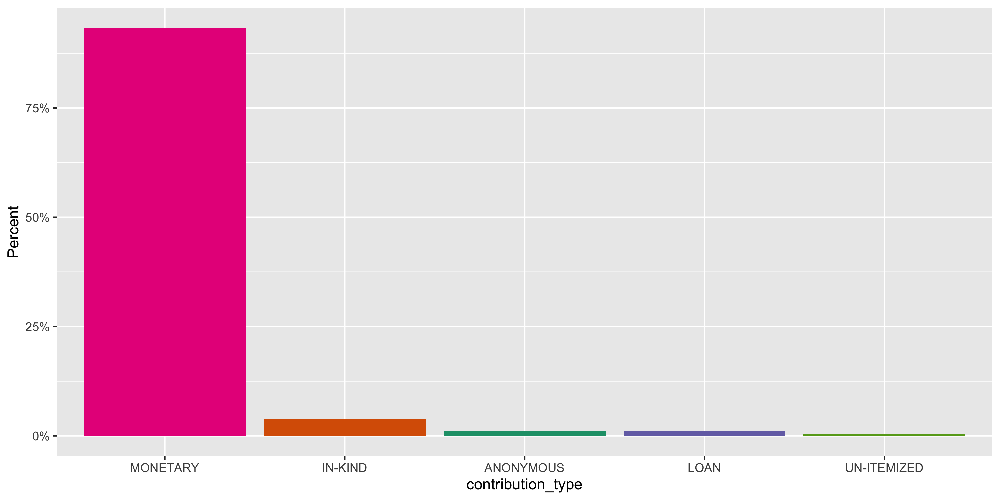
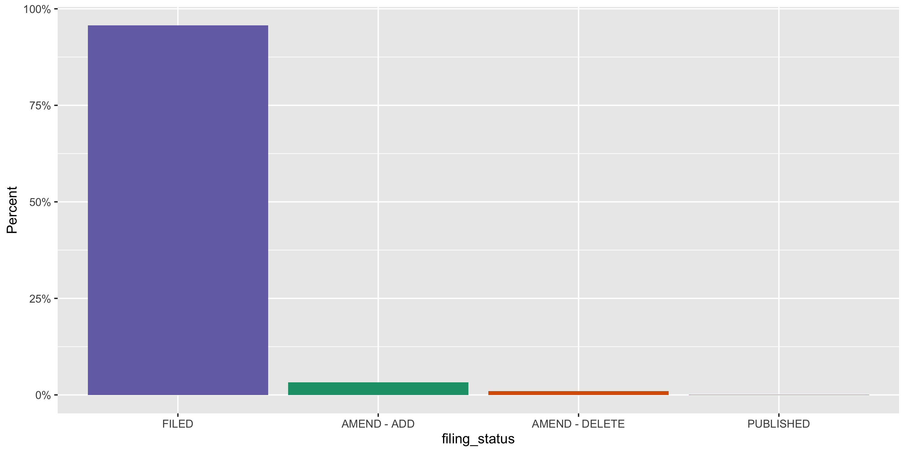
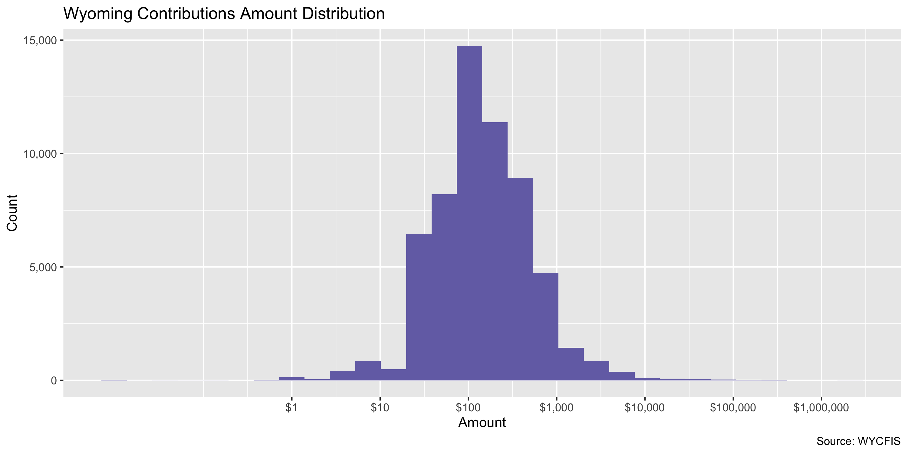
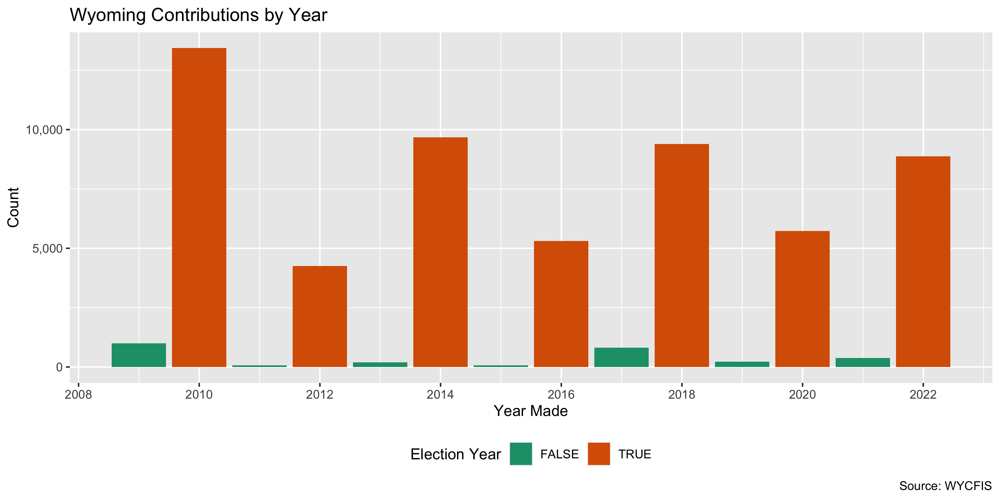
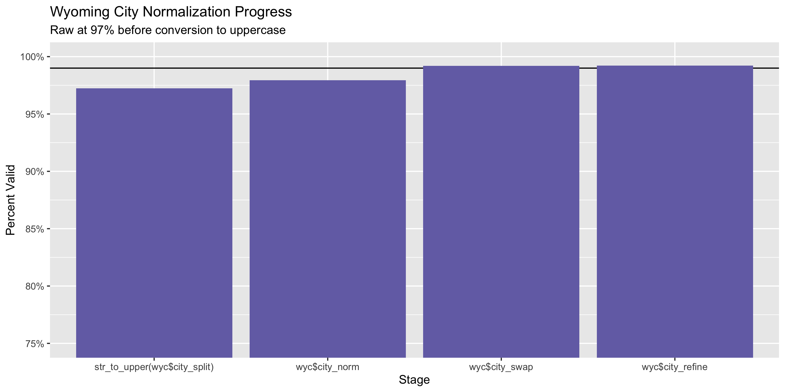

Wyoming Contributions
================
Kiernan Nicholls & Aarushi Sahejpal
Fri Mar 24 22:01:13 2023

- <a href="#project" id="toc-project">Project</a>
- <a href="#objectives" id="toc-objectives">Objectives</a>
- <a href="#packages" id="toc-packages">Packages</a>
- <a href="#source" id="toc-source">Source</a>
- <a href="#download" id="toc-download">Download</a>
- <a href="#read" id="toc-read">Read</a>
- <a href="#explore" id="toc-explore">Explore</a>
- <a href="#separate" id="toc-separate">Separate</a>
  - <a href="#missing" id="toc-missing">Missing</a>
  - <a href="#duplicates" id="toc-duplicates">Duplicates</a>
  - <a href="#categorical" id="toc-categorical">Categorical</a>
  - <a href="#amounts" id="toc-amounts">Amounts</a>
  - <a href="#dates" id="toc-dates">Dates</a>
- <a href="#wrangle" id="toc-wrangle">Wrangle</a>
  - <a href="#zip" id="toc-zip">ZIP</a>
  - <a href="#city" id="toc-city">City</a>
- <a href="#conclude" id="toc-conclude">Conclude</a>
- <a href="#export" id="toc-export">Export</a>
- <a href="#upload" id="toc-upload">Upload</a>
- <a href="#dictionary" id="toc-dictionary">Dictionary</a>

<!-- Place comments regarding knitting here -->

## Project

The Accountability Project is an effort to cut across data silos and
give journalists, policy professionals, activists, and the public at
large a simple way to search across huge volumes of public data about
people and organizations.

Our goal is to standardize public data on a few key fields by thinking
of each dataset row as a transaction. For each transaction there should
be (at least) 3 variables:

1.  All **parties** to a transaction.
2.  The **date** of the transaction.
3.  The **amount** of money involved.

## Objectives

This document describes the process used to complete the following
objectives:

1.  How many records are in the database?
2.  Check for entirely duplicated records.
3.  Check ranges of continuous variables.
4.  Is there anything blank or missing?
5.  Check for consistency issues.
6.  Create a five-digit ZIP Code called `zip`.
7.  Create a `year` field from the transaction date.
8.  Make sure there is data on both parties to a transaction.

## Packages

The following packages are needed to collect, manipulate, visualize,
analyze, and communicate these results. The `pacman` package will
facilitate their installation and attachment.

``` r
if (!require("pacman")) {
  install.packages("pacman")
}
pacman::p_load(
  tidyverse, # data manipulation
  lubridate, # datetime strings
  gluedown, # printing markdown
  janitor, # clean data frames
  campfin, # custom irw tools
  aws.s3, # aws cloud storage
  refinr, # cluster & merge
  scales, # format strings
  knitr, # knit documents
  vroom, # fast reading
  rvest, # scrape html
  glue, # code strings
  here, # project paths
  httr, # http requests
  fs # local storage 
)
```

This document should be run as part of the `R_campfin` project, which
lives as a sub-directory of the more general, language-agnostic
[`irworkshop/accountability_datacleaning`](https://github.com/irworkshop/accountability_datacleaning)
GitHub repository.

The `R_campfin` project uses the [RStudio
projects](https://support.rstudio.com/hc/en-us/articles/200526207-Using-Projects)
feature and should be run as such. The project also uses the dynamic
`here::here()` tool for file paths relative to *your* machine.

``` r
# where does this document knit?
here::i_am("wy/contribs/docs/wy_contribs_diary.Rmd")
```

## Source

Data is obtained from the Wyoming Secretary of State’s Campaign Finance
System (WYCIFS).

> Wyoming’s Campaign Finance Information System (WYCFIS) exists to
> provide a mechanism for online filing of campaign finance information
> and to provide full disclosure to the public. This website contains
> detailed financial records and related information that candidates,
> committees, organizations and parties are required by law to disclose.

## Download

Using the WYCIFS [contribution search
portal](https://www.wycampaignfinance.gov/WYCFWebApplication/GSF_SystemConfiguration/SearchContributions.aspx),
we can run an empty search and return all contributions from “All”
sources. Those search results need to be manually exported as the
`ExportContributions` file.

``` r
raw_dir <- dir_create(here("wy", "contribs", "data", "raw"))
raw_txt <- dir_ls(raw_dir, glob = "*.txt")
file_size(raw_txt)
#> 7.63M
```

## Read

``` r
wyc <- read_delim(
  file = raw_txt,
  delim = ",",
  escape_backslash = FALSE,
  escape_double = FALSE,
  col_types = cols(
    .default = col_character(),
    Date = col_date_mdy(),
    Amount = col_double()
  )
)
```

``` r
wyc <- clean_names(wyc, case = "snake")
```

## Explore

There are 59,416 rows of 8 columns. Each record represents a single
contribution from an individual or business to a political committee.

``` r
glimpse(wyc)
#> Rows: 59,416
#> Columns: 8
#> $ contributor_name  <chr> "KING, SUSAN  (BILLINGS)", "OEDEKOVEN, PEGGY  (LAGRANGE)", "SHUPTRINE, SANDY  (JACKSON)", "W…
#> $ recipient_name    <chr> "VOTEVOGELHEIM", "COMMITTEE TO ELECT CURT MEIER", "STORER FOR STATE HOUSE", "FRIENDS OF MARK…
#> $ recipient_type    <chr> "CANDIDATE COMMITTEE", "CANDIDATE COMMITTEE", "CANDIDATE COMMITTEE", "CANDIDATE COMMITTEE", …
#> $ contribution_type <chr> "MONETARY", "MONETARY", "MONETARY", "MONETARY", "MONETARY", "MONETARY", "MONETARY", "MONETAR…
#> $ date              <date> 2022-12-22, 2022-12-19, 2022-12-19, 2022-12-19, 2022-12-16, 2022-12-08, 2022-12-08, 2022-12…
#> $ filing_status     <chr> "AMEND - ADD", "AMEND - ADD", "AMEND - ADD", "AMEND - ADD", "AMEND - ADD", "AMEND - ADD", "A…
#> $ amount            <dbl> 100.00, 6.00, 100.00, 1000.00, 2500.00, 200.00, 253.43, 253.43, 70.00, 100.00, 117.72, 100.0…
#> $ city_state_zip    <chr> "BILLINGS, MT 59106", "LAGRANGE, WY 82221", "JACKSON, WY 83001", "BENTONVILLE, AR 72716", "C…
tail(wyc)
#> # A tibble: 6 × 8
#>   contributor_name                 recipient_name       recipient_type      contribu…¹ date       filin…² amount city_…³
#>   <chr>                            <chr>                <chr>               <chr>      <date>     <chr>    <dbl> <chr>  
#> 1 BUNCE, WILLIAM W  (STEPHENVILLE) MICHELI FOR GOVERNOR CANDIDATE COMMITTEE MONETARY   2009-04-08 FILED     1000 STEPHE…
#> 2 COSNER, BARNEY  (LINCOLN)        MICHELI FOR GOVERNOR CANDIDATE COMMITTEE MONETARY   2009-04-08 FILED     1000 LINCOL…
#> 3 MICHELI, MATTHEW J  (CHEYENNE)   MICHELI FOR GOVERNOR CANDIDATE COMMITTEE MONETARY   2009-04-08 FILED     4010 CHEYEN…
#> 4 PARK, GORDON L  (EVANSTON)       MICHELI FOR GOVERNOR CANDIDATE COMMITTEE MONETARY   2009-04-08 FILED      100 EVANST…
#> 5 THOMPSON, DOUGLAS L  (LANDER)    MICHELI FOR GOVERNOR CANDIDATE COMMITTEE MONETARY   2009-04-08 FILED      100 LANDER…
#> 6 MICHELI, RON  (FT. BRIDGER)      MICHELI FOR GOVERNOR CANDIDATE COMMITTEE MONETARY   2009-03-15 FILED     1000 FT. BR…
#> # … with abbreviated variable names ¹​contribution_type, ²​filing_status, ³​city_state_zip
```

## Separate

``` r
wyc <- wyc %>% 
  extract(
    col = contributor_name,
    into = c("contributor_name", "contributor_city"),
    regex = "^(.*)\\s\\((.*)\\)$",
    remove = TRUE
  ) %>% 
  extract(
    col = "city_state_zip",
    into = c("city_split", "state_split", "zip_split"),
    regex = "^(.*),\\s+(\\w{2})\\s+(\\d{5})$",
    remove = FALSE
  ) %>% 
  mutate(across(where(is.character), str_squish)) %>% 
  mutate(across(where(is.character), na_if, ""))
```

### Missing

Columns vary in their degree of missing values.

``` r
col_stats(wyc, count_na)
#> # A tibble: 12 × 4
#>    col               class      n      p
#>    <chr>             <chr>  <int>  <dbl>
#>  1 contributor_name  <chr>   1000 0.0168
#>  2 contributor_city  <chr>   1006 0.0169
#>  3 recipient_name    <chr>      0 0     
#>  4 recipient_type    <chr>      0 0     
#>  5 contribution_type <chr>      0 0     
#>  6 date              <date>     0 0     
#>  7 filing_status     <chr>      0 0     
#>  8 amount            <dbl>      0 0     
#>  9 city_state_zip    <chr>    961 0.0162
#> 10 city_split        <chr>   1022 0.0172
#> 11 state_split       <chr>   1022 0.0172
#> 12 zip_split         <chr>   1022 0.0172
```

We can flag any record missing a key variable needed to identify a
transaction.

``` r
key_vars <- c("date", "contributor_name", "amount", "recipient_name")
wyc <- flag_na(wyc, all_of(key_vars))
mean(wyc$na_flag)
#> [1] 0.01683048
sum(wyc$na_flag)
#> [1] 1000
```

``` r
wyc %>% 
  filter(na_flag) %>% 
  select(all_of(key_vars))
#> # A tibble: 1,000 × 4
#>    date       contributor_name amount recipient_name                     
#>    <date>     <chr>             <dbl> <chr>                              
#>  1 2022-12-01 <NA>               5.05 CONNOLLY FOR HOUSE COMMITTEE       
#>  2 2022-11-06 <NA>             200    COMMITTEE TO ELECT JEN SOLIS       
#>  3 2022-10-28 <NA>              50    CONNOLLY FOR HOUSE COMMITTEE       
#>  4 2022-10-27 <NA>              90    TODD PETERSON                      
#>  5 2022-10-26 <NA>             255    COMMITTEE TO ELECT LEESA KUHLMANN  
#>  6 2022-10-26 <NA>             100    TED HANLON COMMITTEE TO ELECT      
#>  7 2022-10-25 <NA>              95.3  MARSHALL ALAN BURT                 
#>  8 2022-10-21 <NA>              60    THE COMMITTEE TO ELECT JORDAN EVANS
#>  9 2022-10-18 <NA>             292.   BEN HORNOK FOR WYOMING             
#> 10 2022-10-18 <NA>              40    JEFF D MARTIN                      
#> # … with 990 more rows
```

### Duplicates

We can also flag any record completely duplicated across every column.

``` r
wyc <- flag_dupes(wyc, everything())
mean(wyc$dupe_flag)
#> [1] 0.008920156
sum(wyc$dupe_flag)
#> [1] 530
```

``` r
wyc %>% 
  filter(dupe_flag) %>% 
  select(all_of(key_vars)) %>% 
  arrange(date)
#> # A tibble: 530 × 4
#>    date       contributor_name  amount recipient_name      
#>    <date>     <chr>              <dbl> <chr>               
#>  1 2009-11-15 THOMPSON, CODY       100 MICHELI FOR GOVERNOR
#>  2 2009-11-15 THOMPSON, CODY       100 MICHELI FOR GOVERNOR
#>  3 2009-11-21 BLUEMEL, IVAN         60 MICHELI FOR GOVERNOR
#>  4 2009-11-21 BLUEMEL, IVAN         60 MICHELI FOR GOVERNOR
#>  5 2009-11-21 BUGAS, LARRY          60 MICHELI FOR GOVERNOR
#>  6 2009-11-21 BUGAS, LARRY          60 MICHELI FOR GOVERNOR
#>  7 2009-11-21 CARPENTER, DONALD     30 MICHELI FOR GOVERNOR
#>  8 2009-11-21 CARPENTER, DONALD     30 MICHELI FOR GOVERNOR
#>  9 2009-11-21 COVOLO, CARI          25 MICHELI FOR GOVERNOR
#> 10 2009-11-21 COVOLO, CARI          25 MICHELI FOR GOVERNOR
#> # … with 520 more rows
```

### Categorical

``` r
col_stats(wyc, n_distinct)
#> # A tibble: 14 × 4
#>    col               class      n         p
#>    <chr>             <chr>  <int>     <dbl>
#>  1 contributor_name  <chr>  24863 0.418    
#>  2 contributor_city  <chr>   2036 0.0343   
#>  3 recipient_name    <chr>    825 0.0139   
#>  4 recipient_type    <chr>      2 0.0000337
#>  5 contribution_type <chr>      5 0.0000842
#>  6 date              <date>  2728 0.0459   
#>  7 filing_status     <chr>      4 0.0000673
#>  8 amount            <dbl>   2361 0.0397   
#>  9 city_state_zip    <chr>   3809 0.0641   
#> 10 city_split        <chr>   2029 0.0341   
#> 11 state_split       <chr>     55 0.000926 
#> 12 zip_split         <chr>   2808 0.0473   
#> 13 na_flag           <lgl>      2 0.0000337
#> 14 dupe_flag         <lgl>      2 0.0000337
```

<!-- --><!-- --><!-- -->

### Amounts

``` r
wyc$amount <- round(wyc$amount, digits = 2)
```

``` r
summary(wyc$amount)
#>      Min.   1st Qu.    Median      Mean   3rd Qu.      Max. 
#>       0.0      50.0     100.0     642.4     350.0 2177032.0
mean(wyc$amount <= 0)
#> [1] 1.683048e-05
```

These are the records with the minimum and maximum amounts.

``` r
glimpse(wyc[c(which.max(wyc$amount), which.min(wyc$amount)), ])
#> Rows: 2
#> Columns: 14
#> $ contributor_name  <chr> "BAGBY, GEORGE", "ESPY, DIANA"
#> $ contributor_city  <chr> "RAWLINS", "RAWLINS"
#> $ recipient_name    <chr> "GEORGE BAGBY", "COMMITTEE TO ELECT KRISTI RACINES"
#> $ recipient_type    <chr> "CANDIDATE", "CANDIDATE COMMITTEE"
#> $ contribution_type <chr> "MONETARY", "MONETARY"
#> $ date              <date> 2012-08-08, 2018-07-19
#> $ filing_status     <chr> "FILED", "FILED"
#> $ amount            <dbl> 2177032, 0
#> $ city_state_zip    <chr> "RAWLINS, WY 82301", "RAWLINS, WY 82301"
#> $ city_split        <chr> "RAWLINS", "RAWLINS"
#> $ state_split       <chr> "WY", "WY"
#> $ zip_split         <chr> "82301", "82301"
#> $ na_flag           <lgl> FALSE, FALSE
#> $ dupe_flag         <lgl> FALSE, FALSE
```

<!-- -->

### Dates

We can add the calendar year from `date` with `lubridate::year()`

``` r
wyc <- mutate(wyc, year = year(date))
```

``` r
min(wyc$date)
#> [1] "2009-03-15"
sum(wyc$year < 2000)
#> [1] 0
max(wyc$date)
#> [1] "2022-12-22"
sum(wyc$date > today())
#> [1] 0
```

<!-- -->

## Wrangle

To improve the searchability of the database, we will perform some
consistent, confident string normalization. For geographic variables
like city names and ZIP codes, the corresponding `campfin::normal_*()`
functions are tailor made to facilitate this process.

### ZIP

``` r
wyc$zip_split <- na_rep(wyc$zip_split)
```

### City

Cities are the most difficult geographic variable to normalize, simply
due to the wide variety of valid cities and formats.

#### Normal

The `campfin::normal_city()` function is a good start, again converting
case, removing punctuation, but *expanding* USPS abbreviations. We can
also remove `invalid_city` values.

``` r
norm_city <- wyc %>% 
  distinct(city_split, state_split, zip_split) %>% 
  mutate(
    city_norm = normal_city(
      city = city_split, 
      abbs = usps_city,
      states = c("WY", "DC", "WYOMING"),
      na = invalid_city,
      na_rep = TRUE
    )
  )
```

#### Swap

We can further improve normalization by comparing our normalized value
against the *expected* value for that record’s state abbreviation and
ZIP code. If the normalized value is either an abbreviation for or very
similar to the expected value, we can confidently swap those two.

``` r
norm_city <- norm_city %>% 
  left_join(
    y = zipcodes,
    by = c(
      "state_split" = "state",
      "zip_split" = "zip"
    )
  ) %>% 
  rename(city_match = city) %>% 
  mutate(
    match_abb = is_abbrev(city_norm, city_match),
    match_dist = str_dist(city_norm, city_match),
    city_swap = if_else(
      condition = !is.na(match_dist) & (match_abb | match_dist == 1),
      true = city_match,
      false = city_norm
    )
  ) %>% 
  select(
    -city_match,
    -match_dist,
    -match_abb
  )
```

``` r
wyc <- left_join(
  x = wyc,
  y = norm_city,
  by = c(
    "city_split", 
    "state_split", 
    "zip_split"
  )
)
```

#### Refine

The [OpenRefine](https://openrefine.org/) algorithms can be used to
group similar strings and replace the less common versions with their
most common counterpart. This can greatly reduce inconsistency, but with
low confidence; we will only keep any refined strings that have a valid
city/state/zip combination.

``` r
good_refine <- wyc %>% 
  mutate(
    city_refine = city_swap %>% 
      key_collision_merge() %>% 
      n_gram_merge(numgram = 1)
  ) %>% 
  filter(city_refine != city_swap) %>% 
  inner_join(
    y = zipcodes,
    by = c(
      "city_refine" = "city",
      "state_split" = "state",
      "zip_split" = "zip"
    )
  )
```

    #> # A tibble: 9 × 5
    #>   state_split zip_split city_swap             city_refine          n
    #>   <chr>       <chr>     <chr>                 <chr>            <int>
    #> 1 NC          28277     CHAROLETTE            CHARLOTTE            1
    #> 2 WI          54494     WISCONSIN RAPIDSAOIDS WISCONSIN RAPIDS     1
    #> 3 WY          82001     CHENEYHE              CHEYENNE             1
    #> 4 WY          82514     FORT WASKAHIE         FORT WASHAKIE        1
    #> 5 WY          82604     CS ASPER              CASPER               1
    #> 6 WY          82633     OUGLASD               DOUGLAS              1
    #> 7 WY          82720     HULLET                HULETT               1
    #> 8 WY          82720     HULLETTE              HULETT               1
    #> 9 WY          82721     OORCROFTM             MOORCROFT            1

Then we can join the refined values back to the database.

``` r
wyc <- wyc %>% 
  left_join(good_refine, by = names(.)) %>% 
  mutate(city_refine = coalesce(city_refine, city_swap))
```

#### Progress

Our goal for normalization was to increase the proportion of city values
known to be valid and reduce the total distinct values by correcting
misspellings.

| stage                          | prop_in | n_distinct | prop_na | n_out | n_diff |
|:-------------------------------|--------:|-----------:|--------:|------:|-------:|
| `str_to_upper(wyc$city_split)` |   0.972 |       2029 |   0.017 |  1610 |    481 |
| `wyc$city_norm`                |   0.979 |       1982 |   0.017 |  1203 |    427 |
| `wyc$city_swap`                |   0.992 |       1702 |   0.017 |   465 |    125 |
| `wyc$city_refine`              |   0.992 |       1693 |   0.017 |   456 |    116 |

You can see how the percentage of valid values increased with each
stage.

<!-- -->

More importantly, the number of distinct values decreased each stage. We
were able to confidently change many distinct invalid values to their
valid equivalent.

<!-- -->

Before exporting, we can remove the intermediary normalization columns
and rename all added variables with the `_clean` suffix.

``` r
wyc <- wyc %>% 
  select(
    -city_split,
    -city_norm,
    -city_swap,
    city_clean = city_refine
  ) %>% 
  rename_all(~str_replace(., "_split", "_clean")) %>% 
  rename_all(~str_remove(., "_raw")) %>% 
  relocate(city_clean, state_clean, zip_clean, .after = year)
```

## Conclude

``` r
glimpse(sample_n(wyc, 50))
#> Rows: 50
#> Columns: 15
#> $ contributor_name  <chr> "HILL, DRAKE AND CINDY", "WYOMING HOSPITAL ASSOCIATION PAC", "ELSER, HARRY", "FUECHSEL, JEFF…
#> $ contributor_city  <chr> "CHEYENNE", "CHEYENNE", "JACKSON", "JACKSON", "CHEYENNE", "CASPER", "CHEYENNE", "LANDER", "E…
#> $ recipient_name    <chr> "COMMITTEE TO ELECT CINDY HILL", "R. J. KOST", "MEAD FOR GOVERNOR", "COMMITTEE TO ELECT RITA…
#> $ recipient_type    <chr> "CANDIDATE COMMITTEE", "CANDIDATE", "CANDIDATE COMMITTEE", "CANDIDATE COMMITTEE", "CANDIDATE…
#> $ contribution_type <chr> "LOAN", "MONETARY", "MONETARY", "MONETARY", "MONETARY", "MONETARY", "MONETARY", "MONETARY", …
#> $ date              <date> 2012-01-06, 2018-08-28, 2010-10-21, 2010-07-06, 2022-05-29, 2014-10-07, 2014-07-12, 2020-06…
#> $ filing_status     <chr> "FILED", "FILED", "FILED", "FILED", "FILED", "FILED", "FILED", "FILED", "FILED", "FILED", "F…
#> $ amount            <dbl> 600, 500, 100, 50, 500, 250, 100, 100, 20, 25, 500, 250, 25, 500, 25, 100, 1517, 200, 100, 5…
#> $ city_state_zip    <chr> "CHEYENNE, WY 82001", "CHEYENNE, WY 82001", "JACKSON, WY 83001", "JACKSON, WY 83001", "CHEYE…
#> $ na_flag           <lgl> FALSE, FALSE, FALSE, FALSE, FALSE, FALSE, FALSE, FALSE, FALSE, FALSE, FALSE, FALSE, FALSE, F…
#> $ dupe_flag         <lgl> FALSE, FALSE, FALSE, FALSE, FALSE, FALSE, FALSE, FALSE, FALSE, FALSE, FALSE, FALSE, FALSE, F…
#> $ year              <dbl> 2012, 2018, 2010, 2010, 2022, 2014, 2014, 2020, 2010, 2010, 2010, 2020, 2014, 2022, 2022, 20…
#> $ city_clean        <chr> "CHEYENNE", "CHEYENNE", "JACKSON", "JACKSON", "CHEYENNE", "CASPER", "CHEYENNE", "LANDER", "E…
#> $ state_clean       <chr> "WY", "WY", "WY", "WY", "WY", "WY", "WY", "WY", "WY", "WY", "WY", "WY", "WY", "WY", "WY", "W…
#> $ zip_clean         <chr> "82001", "82001", "83001", "83001", "82009", "82601", "82009", "82520", "82930", "82520", "8…
```

1.  There are 59,416 records in the database.
2.  There are 530 duplicate records in the database.
3.  The range and distribution of `amount` and `date` seem reasonable.
4.  There are 1,000 records missing key variables.
5.  Consistency in geographic data has been improved with
    `campfin::normal_*()`.
6.  The 4-digit `year` variable has been created with
    `lubridate::year()`.

## Export

Now the file can be saved on disk for upload to the Accountability
server.

``` r
clean_dir <- dir_create(here("wy", "contribs", "data", "clean"))
clean_csv <- path(clean_dir, "wy_contribs_20081216-20221231.csv")
write_csv(wyc, clean_csv, na = "")
(clean_size <- file_size(clean_csv))
#> 8.71M
```

## Upload

We can use the `aws.s3::put_object()` to upload the text file to the IRW
server.

``` r
aws_csv <- path("csv", basename(clean_csv))
if (!object_exists(aws_csv, "publicaccountability")) {
  put_object(
    file = clean_csv,
    object = aws_csv, 
    bucket = "publicaccountability",
    acl = "public-read",
    show_progress = TRUE,
    multipart = TRUE
  )
}
aws_head <- head_object(aws_csv, "publicaccountability")
(aws_size <- as_fs_bytes(attr(aws_head, "content-length")))
unname(aws_size == clean_size)
```

## Dictionary

The following table describes the variables in our final exported file:

| Column              | Type        | Definition |
|:--------------------|:------------|:-----------|
| `contributor_name`  | `character` |            |
| `contributor_city`  | `character` |            |
| `recipient_name`    | `character` |            |
| `recipient_type`    | `character` |            |
| `contribution_type` | `character` |            |
| `date`              | `double`    |            |
| `filing_status`     | `character` |            |
| `amount`            | `double`    |            |
| `city_state_zip`    | `character` |            |
| `na_flag`           | `logical`   |            |
| `dupe_flag`         | `logical`   |            |
| `year`              | `double`    |            |
| `city_clean`        | `character` |            |
| `state_clean`       | `character` |            |
| `zip_clean`         | `character` |            |
